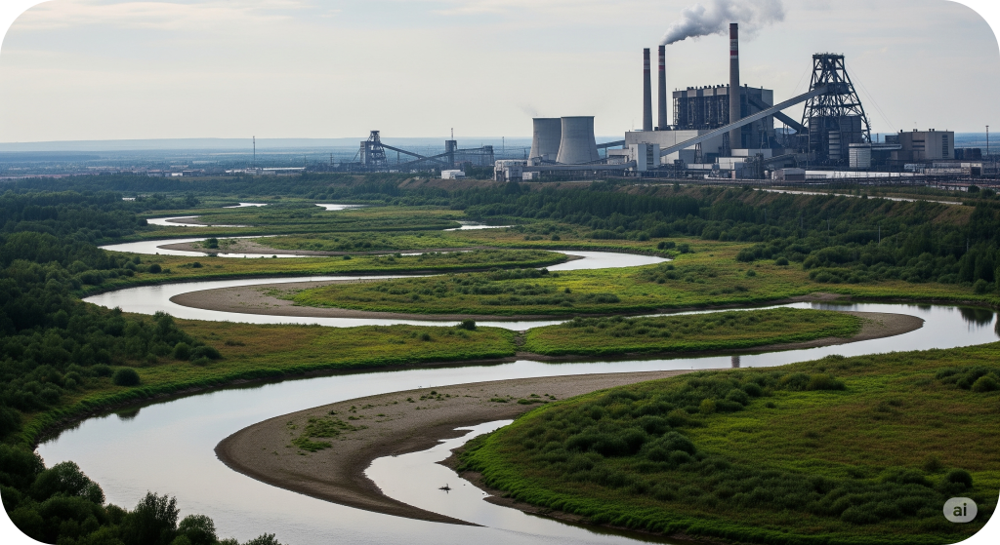
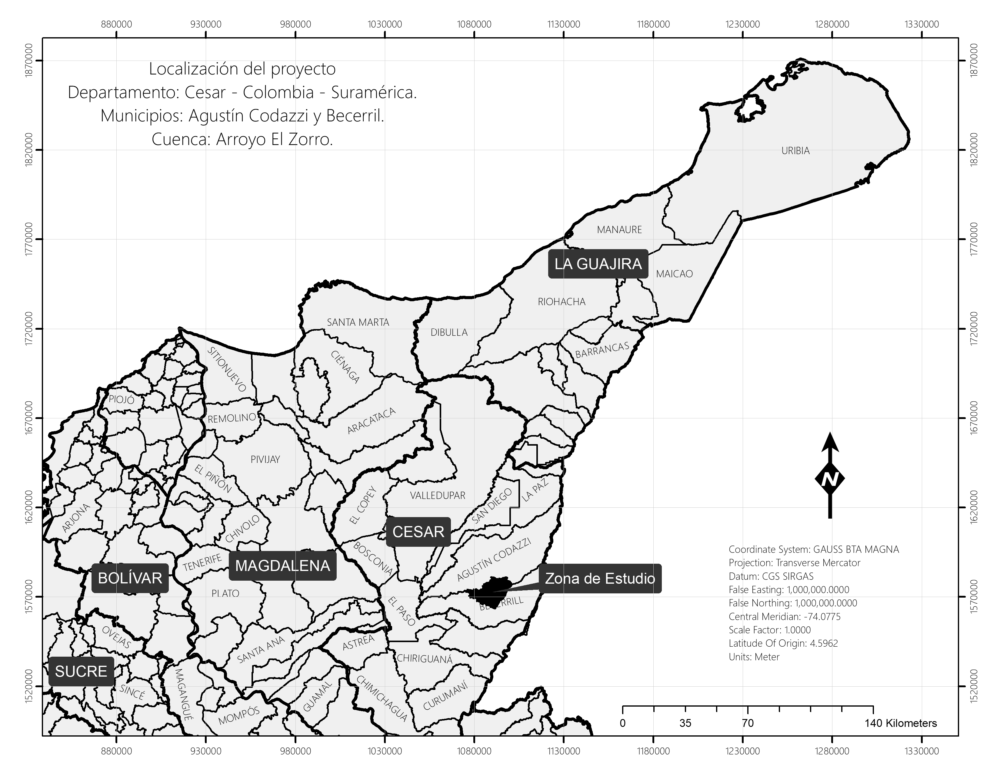
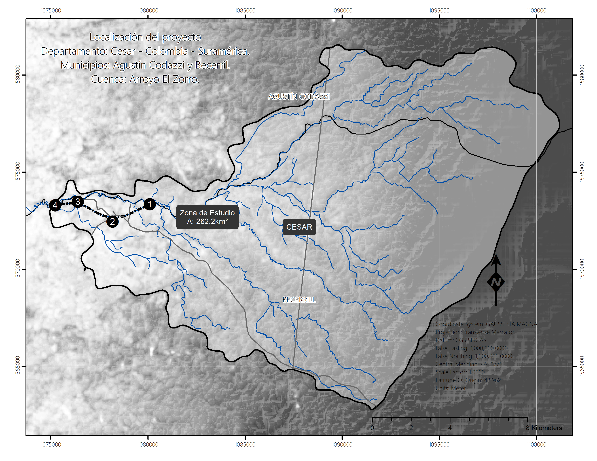
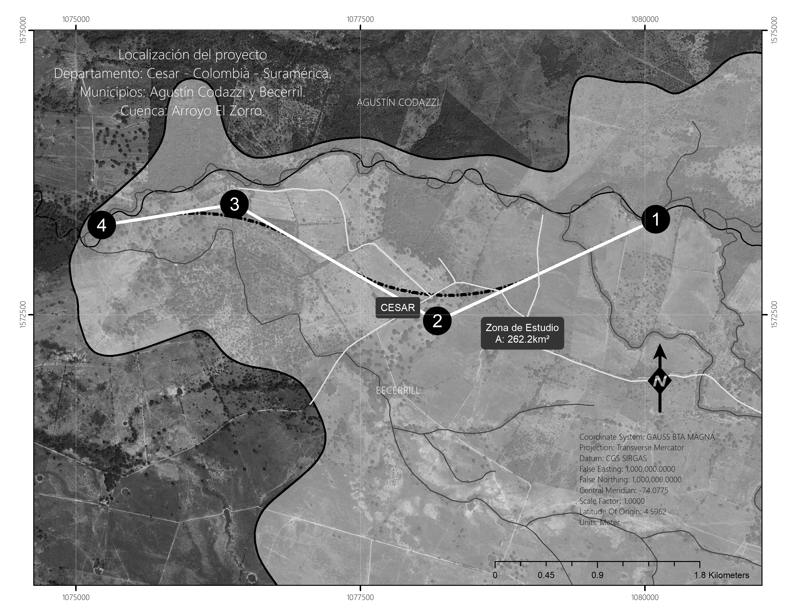

<i>COURSE: Computational tools for the 1D/2D design and modeling of winding channels - HCMC</i>

# CURSO: _“Herramientas computacionales para el diseño y modelación 1D/2D de cauces sinuosos - HCMC”_
Keywords: `hec-ras` `hec-hms` `qgis` `autodesk-civil3d` `river-design` `river-modeling` `river-profile` `river-slope` `curvature-ratio` `sinusoidal-river` `manning-roughness` `hydraulic-structures` `civil-design` 

🌸Videos: [Canal de Youtube](https://www.youtube.com/playlist?list=PLZGvAjHkhphC6-YIjf-L9g8FSmn1y8n8a) (hasta año 2024)

Bienvenid@, en este curso los participantes recibirán conceptos y metodologías generales aplicables al diseño y modelación de cauces artificiales sinuosos y obtendrán habilidades en el uso de diferentes herramientas computacionales, tales como: HEC-HMS, HEC-RAS / RAS Mapper, QGIS y Autodesk Civil 3D. 

  Generado con: <a href="https://gemini.google.com/app/da5e04ff83f70704">https://gemini.google.com</a>  

_Globalmente, diversos proyectos de ingeniería alteran el curso natural de los cauces transformando su morfología y comportamiento hidráulico. El diseño fluvial tiene como objetivo replicar el comportamiento natural de los cauces intervenidos a través del trazado de nuevos canales artificiales que cumplan con los parámetros de diseño establecidos._

## Objetivos del curso

* Ofrecer a los participantes conceptos generales de diseño, modelación hidrológica e hidráulica y la aplicación de diferentes herramientas computacionales.
* Presentar una parte de la metodología general aplicable al diseño y modelación de cauces artificiales sinuosos. 
* Estudiar el comportamiento hidráulico, evaluar la sinuosidad y las pendientes de equilibrio de los cauces naturales existentes en la zona en la que se realizará la implantación del cauce artificial objeto de estudio.
* Realizar el diseño geométrico vertical, por la metodología de fuerza tractiva con evaluación de sección compuesta por flujo permanente, teniendo en cuenta criterios de borde libre.
* Realizar el diseño geométrico horizontal o diseño sinuoso y el trazado de clotoides en 3D.
* Realizar el diseño de las estructuras de entrega de cauces laterales menores al canal principal.
* Construir modelos de superficie 3D, combinando la información topográfica o de terreno con el diseño geométrico realizado para la implantación del cauce artificial.
* Ensamblar el modelo topológico hidráulico en HEC-RAS a partir de las geometrías y vectores obtenidos en QGIS y Autodesk Civil 3D.
* Modelar hidráulicamente, en estado permanente y no permanente, en 1D y 2D, el río artificial diseñado para evaluar su comportamiento hidráulico, realizando el análisis de llanuras de inundación, borde libre, velocidades y esfuerzos cortantes.
* Calcular los volúmenes de corte y relleno obtenidos por la implantación del canal diseñado.
* Generar planos de ingeniería de detalle del diseño realizado, utilizando Autodesk Civil 3D.

## Participantes, metodología y sistema de evaluación

El curso está dirigido a los siguientes estudiantes y/o profesionales y su desarrollo será realizado utilizando la metodología descrita:

| Participantes                                                                                                                                                                                                                                                                                                                                                                                                                                                                                                                                                                                                                                          | Metodología académica                                                                                                                                                                                                                                                                                                                                                                                                                                                                                                                                                                                                                                                                                                                                                                                                                                                                                                                                                                                                                                                                                 |
|--------------------------------------------------------------------------------------------------------------------------------------------------------------------------------------------------------------------------------------------------------------------------------------------------------------------------------------------------------------------------------------------------------------------------------------------------------------------------------------------------------------------------------------------------------------------------------------------------------------------------------------------------------|-------------------------------------------------------------------------------------------------------------------------------------------------------------------------------------------------------------------------------------------------------------------------------------------------------------------------------------------------------------------------------------------------------------------------------------------------------------------------------------------------------------------------------------------------------------------------------------------------------------------------------------------------------------------------------------------------------------------------------------------------------------------------------------------------------------------------------------------------------------------------------------------------------------------------------------------------------------------------------------------------------------------------------------------------------------------------------------------------------|
| ● Dirigido a estudiantes de maestría, ingenieros y profesionales de diferentes disciplinas que requieran aprender y/o fortalecer sus conocimientos en el diseño y modelación de cauces.  ● Es requerido un nivel básico del idioma inglés debido a que utilizaremos las interfaces de usuario y programación en Python en este idioma.  ● Los participantes deberán tener conocimientos generales de hidrología, hidráulica e hidráulica fluvial, así como conocimientos básicos en el uso de herramientas computacionales de modelación, herramientas de dibujo asistido por computador - CAD y sistemas de información geográfica - GIS. | ● Mediante el desarrollo de un taller práctico y con un caso de estudio general, presentar a los participantes, parte de los conceptos y metodologías existentes en la hidráulica fluvial, para posteriormente realizar el diseño y modelación completa de un cauce artificial sinuoso empleando diferentes herramientas computacionales.  ● Se realizará el diseño y modelación completa de un río o canal artificial mediante el desarrollo de diferentes talleres prácticos y un proyecto final opcional no calificable.  ●  Al inicio de cada clase, el tutor realizará una presentación y demostración general de los conceptos y las herramientas computacionales a utilizar y luego los estudiantes desarrollarán los contenidos del taller propuesto.  ● Antes de cada clase, los participantes investigarán los conceptos específicos a tratar y definirán de acuerdo con su criterio los valores de los parámetros requeridos. Es indispensable la asistencia permanente para el desarrollo de cada taller, los resultados de cada taller serán insumo para el siguiente. |

**Evaluación**

| Alcance                                                            | %  | Descripción                                                                                                                                                                                                                                                                                                                                                                                                                                                                                                                                                                                                                                                                                                                                                       |
|:-------------------------------------------------------------------|:--:|:------------------------------------------------------------------------------------------------------------------------------------------------------------------------------------------------------------------------------------------------------------------------------------------------------------------------------------------------------------------------------------------------------------------------------------------------------------------------------------------------------------------------------------------------------------------------------------------------------------------------------------------------------------------------------------------------------------------------------------------------------------------|
| [Autopresentación](https://forms.office.com/r/wTVfqWc6As) | 0  | El diligenciamiento completo de este formulario me permite como instructor, conocer su perfil académico y profesional, saber con qué recursos informáticos cuenta para preparar y desarrollar las pruebas técnicas asignadas, conocer sus conocimientos generales en el uso de herramientas computacionales, lenguajes de programación, métodos de estudio y habilidades.  Antes de iniciar el curso, el participante con base en su propia experiencia y capacitaciones previas, autoevalúa sus conocimientos y habilidades relacionadas con el alcance propuesto en cada taller, así como su experticia en el manejo de las herramientas computacionales, permitiendo identificar los temas que requieren mayor dedicación, investigación y atención.     |
| Asistencia                                                         | 5  | La asistencia a clase es calificable.                                                                                                                                                                                                                                                                                                                                                                                                                                                                                                                                                                                                                                                                                                                             |
| Quices                                                             | 45 | La presentación de los quices es obligatoria.                                                                                                                                                                                                                                                                                                                                                                                                                                                                                                                                                                                                                                                                                                                     |
| Examen final                                                       | 50 | Estudiantes con calificación ≥ a 4.5 en los quices presentados durante el semestre NO presentan examen final. La califiación final corresponderá al promedio de las calificaciones obtenidas en los quices + la asistencia.                                                                                                                                                                                                                                                                                                                                                                                                                                                                                                                                       |
| Proyecto (opcional no calificable)                                 | 0  | El proyecto final de clase es opcional y no calificable. Puede ser realizado progresivamente a medida que avanzamos con las actividades del curso.  En el repositorio del proyecto, los archivos de cada entrega debe estar localizados dentro de la carpetas indicadas en cada actividad y los informes técnicos en la carpeta de reportes, utilizando como nombre de archivo el código de cada actividad e incluyendo la fecha de elaboración, p.ej. `/report/M01A01_20250619.pdf`.                                                                                                                                                                                                                                                                       |

> :blue_heart: Para el nombramiento de los archivos requerido para el seguimiento de control documental, asignar al final de los archivos su código y la fecha en formato numérico aaaammdd.
>
> **Grupos de proyecto (opcional no calificable)**: a partir de los conocimientos y habilidades obtenidas, cada estudiante o grupo de estudiantes, desarrollan las mismas actividades a través de un proyecto final de clase el cual es definido a partir de diferentes nodos y ejes de realineamiento. Dependiendo del número de participantes se permitirá la creación de grupos de trabajo desde 3 integrantes. Reporte los integrantes de su grupo en el enlace de [Repositorio de Proyecto](https://forms.gle/ee5uyfWwQEVifEpu9).

**Control de entregas**

| Entrega       |  Calificación  | Descripción                                                                                                                                                                                                                                                                                                                                                |
|:--------------|:--------------:|:-----------------------------------------------------------------------------------------------------------------------------------------------------------------------------------------------------------------------------------------------------------------------------------------------------------------------------------------------------------|
| Regular       |      5.0       | Domingo hasta las 12:00 de la media noche.                                                                                                                                                                                                                                                                                                                 |
| Extemporánea  |      4.0       | Martes hasta las 12:00 de la noche. Las correcciones no son calificables y el estudiante deberá ajustar la entrega de acuerdo a las observaciones y correcciones indicadas.                                                                                                                                                                                |
| Corrección    |   4.0 o 5.0    | Viernes hasta las 12:00 de la media noche. Aplica solo para entregas recibidas en el horario regular. Las correcciones no son obligatorias, sin embargo, el estudiante deberá ajustar la entrega de acuerdo a las observaciones y correcciones indicadas. La calificación de la corrección es asignada directamente por el estudiante o grupo de proyecto. |

> Para entregas regulares, la calificación final es el promedio de la calificación asignada por el instructor y la auto-calificación realizada por cada grupo de proyecto, de acuerdo a las correcciones realizadas en cada entrega.
>
> **Pregrado**: acorde con el parágrafo del Artículo 38 del reglamento estudiantil, _“La asistencia a talleres y laboratorios es de carácter obligatorio. La inasistencia a estas actividades se califica con cero coma cero (0,0)”_.
> 
> **Posgrado**: acorde con el Literal b del Artículo 46 del reglamento estudiantil, los estudiantes de posgrado deben _“Asistir y participar cumplida y activamente en todas las actividades académicas contempladas en el plan de estudios”_.
> 
> **Informe técnico**: solo será válido si en cada una de las capturas de pantalla se observa su código de alumno en el título o nombre de archivo. Para las capturas de pantalla puede utilizar la Herramienta de Recortes o Snipping Tool, las teclas <kbd>Win</kbd>+<kbd>PrtScn</kbd> para guardar capturas de toda la ventana en la carpeta de imágenes, las teclas <kbd>Win</kbd>+<kbd>G</kbd> para obtener capturas desde la Game Bar, o las teclas <kbd>Win</kbd>+<kbd>Shift</kbd>+<kbd>S</kbd> para capturas instantáneas. Una vez finalizada la elaboración del informe técnico, este debe ser convertido a formato Adobe Acrobat .pdf y adjuntado a la actividad.

## Requerimientos y estructura de directorios

Para el desarrollo del curso y las actividades del proyecto final, son requeridas las siguientes herramientas, estructura de directorios y reportar su repositorio de archivos:

| Requerimiento                                                                  | Descripción                                                                                                                                                                                                                                                 |
|:-------------------------------------------------------------------------------|:------------------------------------------------------------------------------------------------------------------------------------------------------------------------------------------------------------------------------------------------------------|
| [:toolbox:Herramienta](https://www.office.com/)                                | Microsoft 365 (Word, Excel, OneDrive, Teams).                                                                                                                                                                                                               |
| [:toolbox:Herramienta](https://qgis.org/)                                      | QGIS 4.0.3 o superior.                                                                                                                                                                                                                                      |
| [:toolbox:Herramienta](https://notepad-plus-plus.org/)                         | Notepad++ (editor de texto).                                                                                                                                                                                                                                |
| [:toolbox:Herramienta](https://www.hec.usace.army.mil/software/hec-hms/)       | HEC-HMS 4.13 o superior.                                                                                                                                                                                                                                    |
| [:toolbox:Herramienta](https://www.hec.usace.army.mil/software/hec-dssvue/)    | HEC-DSSVue 3.2.3 (versión funcional para cargue masivo de hietogramas).                                                                                                                                                                                     |
| [:toolbox:Herramienta](https://www.hec.usace.army.mil/software/hec-ras/)       | HEC-RAS 7.0.1 o superior.                                                                                                                                                                                                                                   |
| [:toolbox:Herramienta](https://www.autodesk.com/products/autocad)              | Autodesk Autocad 2027 (english version) o superior.                                                                                                                                                                                                         |
| [:toolbox:Herramienta](https://www.autodesk.com/products/civil-3d)             | Autodesk Civil 3D 2027 (english version) o superior.                                                                                                                                                                                                        |
| [:toolbox:Herramienta](https://www.hdfgroup.org/download-hdfview/)             | HDFView.                                                                                                                                                                                                                                                    |
| [:construction_worker:Cuenta de usuario GitHub](https://github.com/)           | Acceso a recursos y actualizaciones del repositorio público del curso.                                                                                                                                                                                      |
| [:package:Estructura de directorios](file/Readme.md)                           | Estructura requerida para el desarrollo del curso.                                                                                                                                                                                                          |
| [:cloud:Repositorio personal de archivos](https://forms.gle/ee5uyfWwQEVifEpu9) | Repositorio creado y compartido para publicación de informes técnicos y avances, nombrar carpeta como `/HCMC`. :blue_heart: El repositorio de proyecto deberá mantenerse durante la duración del curso, estableciendo permisos de lectura para el instructor. |
| [:memo:Plantilla informe técnico](file/report/)                                | Plantilla para presentación de informes técnicos de proyecto, quices y exámenes.                                                                                                                                                                            |

> Nota: los datos hidro-climatológicos suministrados corresponden a información tomada y procesada a partir de datos del IDEAM y los archivos de formas vectoriales han sido descargados del IGAC y de otras fuentes alternas.

### Configuración regional en ingeniería

* **Sistema operativo**: en _Microsoft Windows / Panel de control / Region / Formats / Additional settings..._, establezca símbolo decimal (decimal symbol) como punto ` . `, símbolo de agrupación de miles (digit grouping symbol) como coma ` , ` y separador de listas (list separator) como coma ` , `.
* **Microsoft Excel**: en el menú _Archivo / Opciones / Avanzado / Opciones de Edición_, desmarque la casilla de _Uso de Separadores del Sistema_ y establezca punto ` . ` como separador decimal y coma ` , ` como separador de miles. 
* **QGIS**: desde el menú _Settings / General / Override System Locale_, establezca _User interface translation_ como _American English_ y _Locale (number, date and currency formats)_ como _English United States (en_US)_.

## Caso de estudio general y CRS

Corresponde a un caso hipotético para la implantación de un canal artificial necesario para desviar un río natural debido a que su trazado se encuentra sobre un yacimiento de minerales que serán explotados de forma intensiva y extensiva a cielo abierto. La información topográfica suministrada, así como la hidrología de la zona de estudio, drenajes naturales y otros elementos territoriales, corresponde a información real de la zona.

El curso y sus diferentes actividades prácticos, se ejemplifican a través de un caso de estudio general correspondiente al _**"Realineamiento del Arroyo El Zorro por implantación de actividades mineras de carbón a cielo abierto en el Departamento del Cesar - Colombia"**_

Para el caso de estudio utilizaremos el sistema de proyección de coordenadas - [CRS Gauss Bogotá Magna](file/projectionfile), con los siguientes parámetros:

`PROJCS["GAUSS_BTA_MAGNA",GEOGCS["CGS_SIRGAS",DATUM["CGS_SIRGAS",SPHEROID["GRS_1980",6378137.0,298.257222101]],PRIMEM["Greenwich",0.0],UNIT["Degree",0.0174532925199433]],PROJECTION["Transverse_Mercator"],PARAMETER["False_Easting",1000000.0],PARAMETER["False_Northing",1000000.0],PARAMETER["Central_Meridian",-74.077507917],PARAMETER["Scale_Factor",1.0],PARAMETER["Latitude_Of_Origin",4.596200417],UNIT["Meter",1.0]]`

> Para el desarrollo del proyecto de clase o las evaluaciones (quices y exámenes) utilizar el CRS 3116 del caso de estudio o el sistema 9377 - MAGNA Colombia Origen Único Nacional, que requerirá la re-proyección de las capas suministradas.

## :large_blue_circle:Módulo 1 – Parámetros y diseño geométrico e hidráulico

En este módulo se definen los parámetros generales a utilizar en el diseño del canal artificial y se obtienen los caudales e hidrogramas requeridos para el diseño geométrico y el tránsito hidráulico de las crecientes y se realiza el diseño de las estructuras hidráulicas requeridas.

| Actividad                                                                                                                                 | Descripción                                                                                                                                                                                                                                                                                                                                                                                                                                                                                                                                                                              | Semana |
|:------------------------------------------------------------------------------------------------------------------------------------------|:-----------------------------------------------------------------------------------------------------------------------------------------------------------------------------------------------------------------------------------------------------------------------------------------------------------------------------------------------------------------------------------------------------------------------------------------------------------------------------------------------------------------------------------------------------------------------------------------|:------:|
| [1.0. Investigación de casos de estudio](activity/M01A00/Readme.md)                                                                       | Investigue y documente el realineamiento de un río en cualquier localización mundial y documente los parámetros hidráulicos y geométricos generales utilizados.  [Quiz M01A00](https://forms.gle/s7rzZzBDXjR62eL38)                                                                                                                                                                                                                                                                                                                                                                    |   1    |
| [1.1. Parámetros generales requeridos para el diseño y la modelación](activity/M01A01/Readme.md)                                          | Definición de parámetros generales y establecimiento de criterios a tener en cuenta para el diseño del canal artificial principal, cauces laterales y estructuras hidráulicas.  [Quiz M01A01](https://forms.gle/LgBgSDH8Q9UYZDLX9)                                                                                                                                                                                                                                                                                                                                                      |   1    |
| [1.2. Modelación hidrológica para obtención de caudales de diseño e hidrogramas para tránsito de crecientes](activity/M01A02/Readme.md)   | Obtener en función del área de aportación hasta los puntos de inicio, entrega, descarga de cauces laterales y para diferentes periodos de retorno, los caudales requeridos para el diseño hidráulico y geométrico, así como los hidrogramas para el tránsito hidráulico de crecientes por el canal artificial.  [Quiz M01A02](https://forms.gle/bd2FKR1PgekNgmKu9)                                                                                                                                                                                                                      |  1-2   |
| [1.3. Trazado del eje de valle y estimación de radios de curvatura para suavizado](activity/M01A03/Readme.md)                             | Establecer los puntos para el trazado del eje de valle y estimar los radios de curvatura que permitan trazar el corredor del alineamiento del valle suavizado requerido para el diseño sinuoso.  [Quiz M01A03](https://forms.gle/2tXG4ZvoZiGPuWcx6)                                                                                                                                                                                                                                                                                                                                     |   2    |
| [1.4. Modelo digital de terreno GIS 3D en estado natural (TIN) usando QGIS](activity/M01A04/Readme.md)                                    | A partir de curvas de nivel, construir un modelo de terreno triangulado - TIN (red irregular de triángulos) en 3 dimensiones y modelo ráster, que permita estudiar los cauces existentes así como la implementación del corredor de diseño y cauce sinuoso para la modelación hidráulica.  [Quiz M01A04](https://forms.gle/uhJL4efqChRPLbeV7)                                                                                                                                                                                                                                           |   2    |
| [1.5. Modelo topológico de muestreo en HEC-RAS para el estudio de secciones y perfiles](activity/M01A05/Readme.md)                        | A partir del modelo de terreno triangulado - TIN, la red de drenaje natural foto restituida y el eje suavizado del valle; construir un modelo HEC-RAS que permita evaluar las secciones de referencia, el canal natural actual y el perfil de terreno del eje de valle trazado.  [Quiz M01A05](https://forms.gle/hrBue5H3aX1KrYMx5)                                                                                                                                                                                                                                                     |  2-3   |
| [1.6. Evaluación de secciones transversales de referencia y cotas de fondo de inicio y entrega](activity/M01A06/Readme.md)                | A partir de las secciones existentes en los ríos naturales a intervenir, definir las cotas de inicio y entrega del canal artificial a diseñar, la cota máxima de almacenamiento o cota de desbordamiento, la altura máxima de la sección y el ancho promedio existente del cauce dominante y/o de la llanura.  [Quiz M01A06](https://forms.gle/AhN3QLyFggUKYesp9)                                                                                                                                                                                                                       |   3    |
| [1.7. Análisis de la pendiente de diseño en cauce y valle](activity/M01A07/Readme.md)                                                     | Utilizando el modelo de muestreo en HEC-RAS y a partir de la longitud del tramo natural a reemplazar y de las secciones existentes, determinar la pendiente de referencia para el diseño geométrico e hidráulico. Dentro de las consideraciones para el diseño de la sección del canal artificial, es importante evaluar la condición de equilibrio del cauce natural existente, expresada por la pendiente del cauce dominante y el equilibrio entre la erosión y agradación del lecho determinado por la edad del cauce.  [Quiz M01A07](https://forms.gle/oZ3hgZmfjHLMrBeTA)          |   3    |
| [1.8. Perfil de terreno del valle, evaluación de estructuras de caída y análisis de corte vs. relleno](activity/M01A08/Readme.md)         | A partir de la información topográfica disponible bajo la zona del eje del valle suavizado trazado y utilizando las secciones transversales del modelo de muestreo en HEC-RAS, establecer si el canal artificial a diseñar estará en corte y/o relleno. El procedimiento presentado analiza solo el corte del valle y el posible uso de estructuras de caída para ajuste de pendiente.  [Quiz M01A08](https://forms.gle/dhPfqB7AfZmZdNDJ6)                                                                                                                                              |   4    |
| [1.9. Evaluación de taludes de referencia para diseño a partir de secciones transversales de cauces naturales](activity/M01A09/Readme.md) | A partir de la información topográfica disponible y de las secciones transversales trazadas en el modelo de muestreo HEC-RAS v0 arriba del punto de inicio y abajo del punto de entrega sobre cauces naturales existentes y en cauces laterales, estudiar la inclinación actual de los taludes que será utilizada como referencia para el diseño del canal artificial compuesto, correspondiente al talud estable del cauce natural luego de todos los procesos erosivos y de sedimentación.  [Quiz M01A09](https://forms.gle/FiNfqQAwi37eswns9)                                        |   4    |
| [1.10. Evaluación y análisis de la sinuosidad en cauces naturales existentes de la zona de estudio](activity/M01A10/Readme.md)            | A partir de las líneas de drenaje restituidas y las líneas esquemáticas que representan tránsito hidrológico del modelo HEC-HMS, determinar el factor de sinuosidad por diferentes métodos geográficos.  [Quiz M01A10](https://forms.gle/AFNjA8rrfesxgW1T9)                                                                                                                                                                                                                                                                                                                             |   4    |
| [1.11. Estimación de borde libre en canales - Freeboard](activity/M01A11/Readme.md)                                                       | Sobreelevación requerida o borde libre en la sección de un canal, capaz de contener el flujo sin desbordamiento, producto del oleaje o de la sobreelevación de la lámina de agua en tramos curvos y transiciones.  [Quiz M01A11](https://forms.gle/xxXtxf7QkHSsnLoq5)                                                                                                                                                                                                                                                                                                                   |   4    |
| [1.12. Evaluación de tamaño de partículas y definición de rugosidades de diseño](activity/M01A12/Readme.md)                               | Estudiar el tamaño característico del material que compone el lecho o la zona de corte del canal de realineamiento y establecer los valores de rugosidad a utilizar en el diseño hidráulico de la sección compuesta para la aplicación de diferentes métodos de diseño (Shields, Lane).  [Quiz M01A12](https://forms.gle/6Guq2KQpvi7rw3pZA)                                                                                                                                                                                                                                             |   5    |
| [1.13. Diseño geométrico e hidráulico vertical del cauce principal de desviación y cauces laterales menores](activity/M01A13/Readme.md)   | Dimensionar la sección hidráulica dominante y de creciente del cauce principal y de los cauces laterales menores, verificando a flujo uniforme la capacidad hidráulica de las sección compuesta y el borde libre requerido.  [Quiz M01A13](https://forms.gle/yWFZHMKLNxHhTyzA6)                                                                                                                                                                                                                                                                                                         |   5    |
| [1.14. Prototipo digital del canal prismático diseñado](activity/M01A14/Readme.md)                                                        | A partir del diseño geométrico e hidráulico de la sección y la pendiente del cauce, crear un prototipo del canal principal (sección compuesta por cauce dominante y valle) y realice la modelación en flujo Permanente (todos los periodos de retorno y caudal medio) y No Permanente del canal (periodo de retorno 2.33 y 100 años).  [Quiz M01A14](https://forms.gle/yT9AkeJyxNXXvhqKA)                                                                                                                                                                                               |   5    |
| [1.15. Diseño geométrico horizontal o diseño sinuoso](activity/M01A15/Readme.md)                                                          | A partir de la estimación de los radios de curvatura característicos de los meandros o las ondas existentes en el cauce natural a reemplazar, el índice de sinuosidad y los anchos de sección diseñados hidráulicamente para el transporte del caudal dominante y creciente, determinar los atributos geométricos requeridos para el trazado del cauce sinuoso.  [Quiz M01A15](https://forms.gle/vbAwfLGzFFZos1fX7)                                                                                                                                                                     |   5    |
| [1.16. Obras y estructuras hidráulicas - Paso de vía](activity/M01A16/Readme.md)                                                          | Diseño geométrico de pasos de vía en canales usando alcantarillas por área equivalente a descarga libre para modelos hidráulicos en HEC-RAS.  [Quiz M01A16](https://forms.gle/o61UF8pRwyibdcvs7)                                                                                                                                                                                                                                                                                                                                                                                        |   6    |
| [1.17. Obras y estructuras hidráulicas - Caída y control de fondo](activity/M01A17/Readme.md)                                             | Diseño de estructura de caída con y sin contra-escalón en sección rectangular.  [Quiz M01A17](https://forms.gle/5wftqffeEsexBRTv5)                                                                                                                                                                                                                                                                                                                                                                                                                                                      |   6    |
| [1.18. Obras y estructuras hidráulicas - Contracción y expansión](activity/M01A18/Readme.md)                                              | La construcción del canal prismático de sección compuesta del cauce principal, requiere de la implantación de contracción de inicio y expansión en entrega, debido a que el flujo de diseño debe ser conducido y transportado por un valle confinado.  [Quiz M01A18](https://forms.gle/mV8GZCvUmcDseEvr5)                                                                                                                                                                                                                                                                               |   6    |
| [1.19. Obras y estructuras hidráulicas - Escalonada](activity/M01A19/Readme.md)                                                           | El diseño y construcción de canales hidráulicos, requiere frecuentemente del diseño de estructuras escalonadas cuando existen diferencias importantes de nivel entre el fondo del cauce lateral intervenido y el cauce o canal receptor.  [Quiz M01A19](https://forms.gle/SEaYDwpaq6D3zLmf6)                                                                                                                                                                                                                                                                                            |   6    |
| [1.20. Obras y estructuras hidráulicas - Rápida](activity/M01A20/Readme.md)                                                               | Las rápidas pueden ser utilizadas para realizar conexión de cauces laterales a canales principales de desviación, ya que es posible ajustar la pendiente natural del terreno y por tal razón, el movimiento de tierras es menor al de una entrega usando estructuras escalonadas a flujo rasante. Una desventaja en su implementación es la erosión generada por las altas velocidades del canal de la rápida.  [Quiz M01A20](https://forms.gle/6ty8CzfxpehTNSVA8)                                                                                                             |   6    |

> En la tabla, la columna _Semana_, corresponde al número de semana de clase sin incluir receso o festivos. 

## :large_blue_circle:Módulo 2 – Diseño geométrico Civil 3D para trazado de ejes, construcción de corredores 3D y generación de planos de ingeniería de detalle

En este módulo se trazan en planta los ejes directrices del valle y río a partir del diseño geométrico realizado, para la posterior construcción e integración del modelo tridimensional triangulado requerido. Luego de realizar el diseño, se presentarán algunas indicaciones para la elaboración de planos de ingeniería de detalle, usando para ello las herramientas Autodesk AutoCAD y/o Autodesk Civil 3D.

| Actividad                                                                                                               | Descripción                                                                                                                                                                                                                                                                                                                                                                                              | Semana  |
|:------------------------------------------------------------------------------------------------------------------------|:---------------------------------------------------------------------------------------------------------------------------------------------------------------------------------------------------------------------------------------------------------------------------------------------------------------------------------------------------------------------------------------------------------|:-------:|
| [2.1. Modelo de terreno Civil 3D en estado natural (planicie)](activity/M02A01/Readme.md)                               | Generar a partir del modelo TIN o de curvas de nivel, un modelo de terreno en Civil 3D de la planicie natural como base para el trazado de perfiles, ejes, secciones, cálculo de volúmenes y trazado del modelo de terreno del canal sinuoso compuesto.  [Quiz M02A01](https://forms.gle/qn6hRYRkMBDX2o3K6)                                                                                      |    7    |
| [2.2. Trazado de los alineamientos para el valle (eje de valle, taludes y cauces laterales)](activity/M02A02/Readme.md) | Trazar los alineamientos correspondientes para el eje del valle y taludes para el cauce de realineamiento y cauces menores.                                                                                                                                                                                                                                                                              |    7    |
| [2.3. Trazado de clotoides para el cauce sinuoso](activity/M02A03/Readme.md)                                            | Trazar el alineamiento del cauce dominante sinuoso teniendo en cuenta los parámetros geométricos de la sinuosidad definida en el diseño. Dibujar los ejes correspondientes a los taludes del cauce principal, teniendo en cuenta las consideraciones planteadas en el diseño en cuanto a no linealidad de taludes y pasos para la mecanización. Ajustar el diseño sinuoso al ancho disponible del valle. |    7    |
| [2.4. Trazado del corredor para el valle](activity/M02A04/Readme.md)                                                    | Utilizando Autodesk Civil 3D se dibujan las secciones transversales para el corte y/o relleno del valle sobre el modelo de terreno natural.                                                                                                                                                                                                                                                              |    7    |
| [2.5. Modelo de terreno con la geometría del canal sinuoso diseñado y cauces laterales](activity/M02A05/Readme.md)      | Utilizando Autodesk Civil 3D se dibujan las secciones transversales para el corte y/o relleno del cauce dominante sobre el modelo de terreno creado para el corredor del valle.                                                                                                                                                                                                                          |    8    |
| [2.6. Modelo de terreno combinado (valle, cauce sinuoso diseñado y cauces laterales)](activity/M02A06/Readme.md)        | Crear el modelo de terreno combinado para el canal, incluyendo el valle y el cauce sinuoso.                                                                                                                                                                                                                                                                                                              |    8    |
| [2.7. Dibujo de estructuras hidráulicas](activity/M02A07/Readme.md)                                                     | Dibujo de estructuras hidráulicas e incorporación al modelo de terreno.                                                                                                                                                                                                                                                                                                                                  |   8-9   |
| [2.8. Planos - Cálculo de volúmenes corte y relleno](activity/M02A08/Readme.md)                                         | A partir de los modelos de terreno para la planicie y para el canal combinado, determinar los volúmenes de corte y relleno para el canal. Generar las tablas de volúmenes.                                                                                                                                                                                                                               |    9    |
| [2.9. Planos - Generación de secciones transversales, planta y perfil](activity/M02A09/Readme.md)                       | A partir de los modelos de terreno para la planicie y para el canal combinado, y de los ejes para el valle y el cauce principal, generar las secciones transversales, la planta y el perfil. Generar tablas de curvas.                                                                                                                                                                                   |    9    |

> Es recomendable revisar y ajustar los planos de ingeniería de detalle luego de que sea ejecutada la modelación hidráulica y verificación de cumplimiento de las condiciones de diseño.

## :large_blue_circle:Módulo 3 – Modelación hidráulica 1D

En este módulo se realiza el ensamble en RAS-Mapper de la topología requerida del canal y paso de vía y se realiza la modelación hidráulica 1D en HEC-RAS para verificar mediante los resultados obtenidos, que el canal diseñado cumpla con las especificaciones geométricas e hidráulicas de diseño.

HEC-RAS es una herramienta computacional de dominio público creada por el Cuerpo de Ingenieros Militares de los Estados Unidos de América (US Army Corps of Engineers), utilizada para realizar cálculos hidráulicos sobre una red compuesta por canales abiertos naturales o construidos, llanuras de inundación y aluviones.

HEC-RAS tiene la capacidad de simular Flujo No Permanente, unidimensional o bidimensionalmente y se puede utilizar para modelar regímenes de flujo subcrítico, supercrítico y mixto. 
Actualmente, los cálculos hidráulicos 1D realizados para secciones transversales, puentes, alcantarillas y otras estructuras hidráulicas pueden ser realizados en flujo no permanente. Otras características especiales incluyen: análisis de rotura de presas y diques, estaciones de bombeo, operación de presas para sistemas navegables, sistemas de tuberías a presión, calibración automatizada, reglas de operación definidas por el usuario y la combinación de modelos 1D y 2D.

| Actividad                                                                                                                               | Descripción                                                                                                                                                                                                                                                                                                                                                                           | Semana |
|:----------------------------------------------------------------------------------------------------------------------------------------|:--------------------------------------------------------------------------------------------------------------------------------------------------------------------------------------------------------------------------------------------------------------------------------------------------------------------------------------------------------------------------------------|:-------:|
| [3.1. Creación del modelo topológico usando RAS-Mapper](activity/M03A01/Readme.md)                                                      | A partir de los ejes y modelos de terreno natural, valle y cauce sinuoso diseñado y dibujado en Autodesk Civil 3D, ensamblar el modelo de terreno combinado y generar el modelo topológico geográfico requerido para la modelación hidráulica en HEC-RAS.                                                                                                                             |   10    |
| [3.2. Verificación de topología en HEC-RAS](activity/M03A02/Readme.md)                                                                  | A partir de la topología generada validar y depurar la geometría 1D HEC-RAS del cauce sinuoso diseñado.                                                                                                                                                                                                                                                                               |   10    |
| [3.3. Definición de parámetros hidráulicos y condiciones de frontera](activity/M03A03/Readme.md)                                        | Establecer los parámetros para la modelación hidráulica y definir las condiciones de frontera requeridas para las condiciones de flujo permanente y no permanente.                                                                                                                                                                                                                    |   10    |
| [3.4. Modelación unidimensional en condiciones de flujo permanente y no permanente](activity/M03A04/Readme.md)                          | A partir del modelo geométrico y de los parámetros y condiciones de frontera establecidos, realizar la modelación o tránsito hidráulico para flujo permanente y no permanente.                                                                                                                                                                                                        |   10    |
| [3.5. Análisis de resultados (perfil de flujo, línea de energía, esfuerzo cortante, velocidad, borde libre)](activity/M03A05/Readme.md) | A partir de los resultados obtenidos en la ejecución del modelo hidráulico para condiciones de flujo permanente y no permanente, evaluar los resultados obtenidos para determinar si el diseño realizado cumplió con las especificaciones de diseño planteadas al inicio del curso.                                                                                                   |   10    |
| [3.6. Mapificación de resultados de modelación 1D en RAS Mapper](activity/M03A06/Readme.md)                                             | A partir de los resultados obtenidos en la ejecución del modelo hidráulico para condiciones de flujo permanente o no permanente, mapificar las llanuras de inundación, velocidades, cortantes y energía.                                                                                                                                                                              |   11    |
| [3.7. Modelación 1D del canal principal rectificando fondo de secciones naturales de inicio y entrega](activity/M03A07/Readme.md)       | A partir del modelo geométrico y de los parámetros y condiciones de frontera establecidos, realizar la modelación o tránsito hidráulico para flujo permanente y no permanente solo del cauce principal completo, rectificando el fondo de las secciones naturales de inicio y entrega usando la herramienta Pilot Channel para obtener un fondo sin tramos horizontales y/o adversos. |   11    |
| [3.8. Modelación de pasos de vía en modelos hidráulicos 1D](activity/M03A08/Readme.md)                                                  | A partir del modelo hidráulico funcional que incluye la rectificación de fondo de las secciones naturales antes y después del canal sinuoso diseñado, modelar el paso de vía utilizando alcantarillas en la zona del canal dominante y valle.                                                                                                                                         |   11    |

## :large_blue_circle:Módulo 4 – Modelación hidráulica 2D

En este módulo se ejecuta la modelación bidimensional del cauce diseñado mediante la construcción de mallas semiestructuradas, así como la mapificación y análisis de resultados en RAS Mapper.

| Actividad                                                                                                                                 | Descripción                                                                                                                                                                                                                                                                                                                                                                                                                                                                                                                                                                           | Semana |
|:------------------------------------------------------------------------------------------------------------------------------------------|:--------------------------------------------------------------------------------------------------------------------------------------------------------------------------------------------------------------------------------------------------------------------------------------------------------------------------------------------------------------------------------------------------------------------------------------------------------------------------------------------------------------------------------------------------------------------------------------|:------:|
| [4.0. Introducción y requerimientos](activity/M04A00/Readme.md)                                                                           | Conceptos y elementos requeridos para modelación bidimensional.                                                                                                                                                                                                                                                                                                                                                                                                                                                                                                                       |   11   |
| [4.1. Creación de proyecto 2D en HEC-RAS y procesamiento del modelo de terreno](activity/M04A01/Readme.md)                                | En esta clase se presentan las diferencias principales entre las geometrías de modelos 1D y 2D, las características de los archivos de proyección de coordenadas .prj y el archivo del proyecto RAS. Para la modelación en 2D, es necesario crear y visualizar la grilla del modelo de terreno que integra el terreno natural y el cauce diseñado.                                                                                                                                                                                                                                    |   11   |
| [4.2. Delimitación del área de drenaje 2D a partir de los ejes Civil 3D](activity/M04A02/Readme.md)                                       | La modelación 2D requiere además de un modelo digital de terreno (DTM), del límite de la zona de estudio dentro de la cual se definirá el mallado. Es RAS Mapper, estas áreas se conocen como 2D Flow Areas y pueden ser dibujadas manualmente desde esta herramienta. Con el objeto de trazar áreas con contornos curvos precisos alrededor de la zona de estudio, utilizaremos en QGIS el archivo CAD con los ejes trazados en Civil 3D.                                                                                                                                            |   11   |
| [4.3. Creación y refinamiento de la malla compuesta](activity/M04A03/Readme.md)                                                           | Una malla o grilla computacional es creada a partir de la definición de un área de drenaje 2D y puede ser refinada a partir de ejes y/o regiones.                                                                                                                                                                                                                                                                                                                                                                                                                                     |   12   |
| [4.4. Zonas de uso y coeficiente de rugosidad de Manning asociado, n](activity/M04A04/Readme.md)                                          | Durante la etapa de definición de la malla compuesta, se estableció un valor global del coeficiente de rugosidad de Manning (n) aplicable a todas las celdas del modelo. La clasificación del modelo de terreno en diferentes zonas de uso y su asociación respectiva a coeficientes de rugosidad, permitirá asignar uno o varios valores a cada celda, permitiendo así aplicar masivamente los valores requeridos y utilizados en la etapa de diseño del canal compuesto (cauce dominante y creciente).                                                                              |   12   |
| [4.5. Localización espacial de las condiciones de frontera y datos de entrada para flujo no permanente](activity/M04A05/Readme.md)        | La localización espacial de dos diferentes condiciones de frontera (BC – Boundary Condition Line), No debe ser definida sobre una misma celda de la grilla. Múltiples condiciones de frontera pueden ser agregadas a la malla compuesta y se pueden asociar múltiples hidrogramas de entrada, por ejemplo, en el cauce principal y los cauces laterales, al menos se debe ingresar una línea de condición de frontera aguas arriba y una aguas abajo. Existen 5 diferentes tipos de condiciones de frontera que pueden ser utilizados para modelación 2D y en modelos mixtos 1D a 2D. |   12   |
| [4.6. Modelación hidráulica 2D](activity/M04A06/Readme.md)                                                                                | Luego de definida la localización espacial de las condiciones de frontera y establecidos los datos de entrada y controles se procede a realizar la modelación hidráulica.                                                                                                                                                                                                                                                                                                                                                                                                             |   12   |
| [4.7. Mapificación general en RAS Mapper](activity/M04A07/Readme.md)                                                                      | RAS Mapper dispone de diferentes tipos de mapas para la visualización de los resultados obtenidos de la modelación.                                                                                                                                                                                                                                                                                                                                                                                                                                                                   |   12   |
| [4.8. Análisis de resultados a partir de ejes y secciones de muestreo](activity/M04A08/Readme.md)                                         | Una vez ejecutada la modelación, será necesario consultar los resultados obtenidos en lugares específicos sobre la geometría del canal diseñado utilizando lineas de muestreo.                                                                                                                                                                                                                                                                                                                                                                                                        |   12   |
| [4.9. Modelación incluyendo tramos naturales de inicio, entrega, cauces laterales y estructuras de transición](activity/M04A09/Readme.md) | En esta actividad se evalúa conjuntamente el tramo diseñado con los tramos de inicio, entrega y cauces laterales.                                                                                                                                                                                                                                                                                                                                                                                                                                                                     |   12   |
| [4.10. Visualización de matrices de datos y resultados del modelo 2D con HDFView](activity/M04A10/Readme.md)                              | RAS Mapper de HEC-RAS, utiliza archivos de datos científicos .hdf para almacenar los siguientes datos y resultados: Modelo de terreno, Geometría del modelo 2D, parámetros y condiciones de frontera, Resultados de modelación.                                                                                                                                                                                                                                                                                                                                                       |   12   |

##

_:beginner: **Ayuda / Colabora**: a través de la pestaña _[Discussions](https://github.com/rcfdtools/R.HCMC/discussions)_ localizada en la parte superior de esta ventana, podrás encontrar y participar en los [_anuncios o noticias_](https://github.com/rcfdtools/R.HCMC/discussions/categories/announcements) publicados, enviarnos tus [_ideas_](https://github.com/rcfdtools/R.HCMC/discussions/categories/ideas) para actividades complementarias, participar en preguntas, respuestas y consultas específicas [_Q&A_](https://github.com/rcfdtools/R.HCMC/discussions/categories/q-a) y realizar [_publicaciones o consultas generales_](https://github.com/rcfdtools/R.HCMC/discussions/categories/general) públicas._

_R.HCMC es de uso libre para fines académicos, conoce nuestra licencia, cláusulas, condiciones de uso y como referenciar los contenidos publicados en este repositorio, dando [clic aquí](LICENSE.md)._

_Clonación: para compatibilidad completa de las rutas utilizadas en los scripts y herramientas de R.HCMC, en Microsoft Windows clonar y/o descomprimir en _D:\R.HCMC_. Enlace para clonación https://github.com/rcfdtools/R.HCMC.git._

_¡Encontraste útil este repositorio!, apoya su difusión marcando este repositorio con una ⭐ o síguenos dando clic en el botón Follow de [rcfdtools](https://github.com/rcfdtools) en GitHub._

| [:sun_with_face: Iniciar curso](activity/M01A00/Readme.md) | [:infinity: Otros cursos y herramientas](https://github.com/rcfdtools) | [:beginner: Ayuda / Colabora](https://github.com/rcfdtools/R.HCMC/discussions/1) | [:notebook: Referencias](file/ref/Readme.md) | [:label: Abreviaturas y definiciones](file/ref/Definitions.md) |
|------------------------------------------------------------|------------------------------------------------------------------------|----------------------------------------------------------------------------------|----------------------------------------------|----------------------------------------------------------------|

