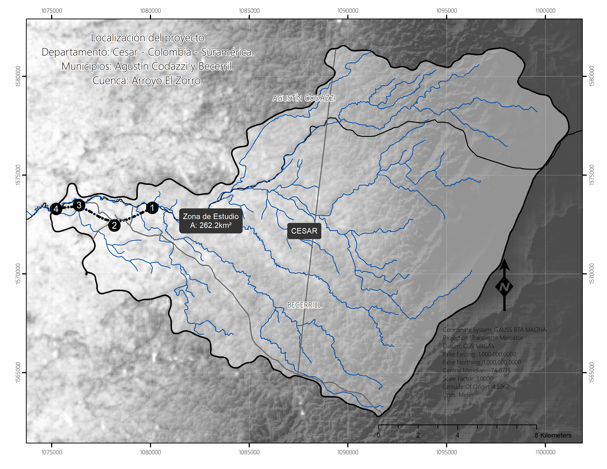

# Herramientas computacionales para el diseño y modelación 1D/2D de cauces sinuosos - HCMC
Keywords: `hec-ras` `hec-hms` `qgis` `autodesk-civil3d` `river-design` `river-modeling`

Bienvenid@, en este curso los participantes recibirán conceptos y metodologías generales aplicables al diseño y modelación de cauces artificiales sinuosos y obtendrán habilidades en el uso de diferentes herramientas computacionales, tales como: HEC-HMS, HEC-RAS / RAS-Mapper, QGIS y Autodesk Civil 3D. 

Globalmente, diversos proyectos de ingeniería alteran el curso natural de los cauces transformando su morfología y comportamiento hidráulico. El diseño fluvial tiene como objetivo replicar el comportamiento natural de los cauces intervenidos a través del trazado de nuevos canales artificiales que cumplan con los parámetros de diseño establecidos.

## Objetivos del curso

* Ofrecer a los participantes conceptos generales de diseño, modelación hidrológica e hidráulica y la aplicación de diferentes herramientas computacionales.
* Presentar una parte de la metodología general aplicable al diseño y modelación de cauces artificiales sinuosos. 
* Estudiar el comportamiento hidráulico, evaluar la sinuosidad y las pendientes de equilibrio de los cauces naturales existentes en la zona en la que se realizará la implantación del cauce artificial objeto de estudio.
* Realizar el diseño geométrico vertical, por la metodología de fuerza tractiva con evaluación de sección compuesta por flujo permanente, teniendo en cuenta criterios de borde libre.
* Realizar el diseño geométrico horizontal o diseño sinuoso y el trazado de clotoides en 3D.
* Realizar el diseño de las estructuras de entrega de cauces laterales menores al canal principal.
Construir modelos de superficies 3D, combinando la información topográfica o de terreno con el diseño geométrico realizado para la implantación del cauce artificial.
* Ensamblar el modelo topológico hidráulico en HEC-RAS a partir de las geometrías y vectores obtenidos en QGIS y Autodesk Civil 3D.
* Modelar hidráulicamente, en estado permanente y no permanente, en 1D y 2D, el río artificial diseñado para evaluar su comportamiento hidráulico, realizando el análisis de llanuras de inundación, borde libre, velocidades y esfuerzos cortantes.
* Calcular los volúmenes de corte y relleno obtenidos por la implantación del canal diseñado.
* Generar planos de ingeniería de detalle del diseño realizado, utilizando Autodesk Civil 3D.

## Participantes

* Los contenidos presentados en este curso taller, están dirigidos a estudiantes de maestría, ingenieros y profesionales de diferentes disciplinas que requieran aprender y/o fortalecer sus conocimientos en el diseño y modelación de cauces.
* Es requerido un nivel básico del idioma inglés debido a que utilizaremos las interfaces de usuario y programación en Python en este idioma.
* Los participantes deberán tener conocimientos generales de hidrología, hidráulica e hidráulica fluvial, así como conocimientos básicos en el uso de herramientas computacionales de modelación, herramientas de dibujo asistido por computador - CAD y sistemas de información geográfica - GIS.

## Metodología y sistema de evaluación

**Metodología académica**

* Mediante el desarrollo de un taller práctico y con un caso de estudio general, presentar a los participantes, parte de los conceptos y metodologías existentes en la hidráulica fluvial, para posteriormente realizar el diseño y modelación completa de un cauce artificial sinuoso empleando diferentes herramientas computacionales.
* Se realizará el diseño y modelación completa de un río o canal artificial mediante el desarrollo de diferentes talleres prácticos y un proyecto final.
* Al inicio de cada clase, el tutor realizará una presentación y demostración general de los conceptos y las herramientas computacionales a utilizar y luego los estudiantes desarrollarán los contenidos del taller propuesto.
* Antes de cada clase, los participantes investigarán los conceptos específicos a tratar y definirán de acuerdo con su criterio los valores de los parámetros requeridos. Es indispensable la asistencia permanente para el desarrollo de cada taller, los resultados de cada taller serán insumo para el siguiente.

**Evaluación**

| Alcance                                                            |  %  | Descripción                                                                                                                                                                                                                                                                                                                                                                                                                                                                                                                                                                                                                                                                                                                                              |
|:-------------------------------------------------------------------|:---:|:---------------------------------------------------------------------------------------------------------------------------------------------------------------------------------------------------------------------------------------------------------------------------------------------------------------------------------------------------------------------------------------------------------------------------------------------------------------------------------------------------------------------------------------------------------------------------------------------------------------------------------------------------------------------------------------------------------------------------------------------------------|
| Asistencia                                                         |  5  | La asistencia a clase es calificable.                                                                                                                                                                                                                                                                                                                                                                                                                                                                                                                                                                                                                                                                                                                    |
| [Autopresentación inicial ](https://forms.office.com/r/wTVfqWc6As) |  5  | El diligenciamiento completo de este formulario me permite como instructor, conocer su perfil académico y profesional, saber con qué recursos informáticos cuenta para preparar y desarrollar las pruebas técnicas asignadas, conocer sus conocimientos generales en el uso de herramientas computacionales, lenguajes de programación, métodos de estudio y habilidades. Antes del inicio, el participante con base en su propia experiencia y capacitaciones previas, autoevalúa sus conocimientos y habilidades relacionadas con el alcance propuesto en cada taller, así como su experticia en el manejo de las herramientas computacionales utilizadas, permitiendo identificar los temas que requieren mayor dedicación, investigación y atención. |
| Proyecto final y/o examen final individual                         | 90  | El proyecto final de clase es obligatorio y se realizará individual y progresivamente a medida que se avanza con las actividades del curso. En el repositorio del proyecto, cada entrega debe estar localizada dentro de la carpeta correspondiente a cada actividad, p. ej.: `\HCMC\activity\0001\`. _En caso de que la nota final del proyecto sea inferior a 3.5, será necesario presentar individualmente el examen final y la nota final correspondiente al % indicado, será el promedio entre la nota final de las diferentes entregas del proyecto individual y la nota del examen._                                                                                                                                                          |

> :blue_heart: Para el nombramiento de los archivos requerido para el seguimiento de control documental, asignar al final de los archivos su código y la fecha en formato numérico aaaammdd. 

**Control de entregas**

| Entrega       |  Calificación  | Descripción                                                                                                                                                                                                                                          |
|:--------------|:--------------:|:-----------------------------------------------------------------------------------------------------------------------------------------------------------------------------------------------------------------------------------------------------|
| Regular       |      5.0       | Domingo hasta las 12:00 de la media noche. Se admiten correcciones que serán autocalificadas por el estudiante.                                                                                                                                      |
| Extemporánea  |      4.0       | Lunes hasta las 12:00 de la noche. Las correcciones no son calificables y el estudiante deberá ajustar la entrega de acuerdo a las observaciones y ajustes indicados.                                                                                |
| Corrección    |   4.0 o 5.0    | Jueves hasta las 12:00 de la media noche. Aplica solo para entregas recibidas en el horario regular. Las correcciones no son obligatorias, sin embargo, el estudiante deberá ajustar la entrega de acuerdo a las observaciones y ajustes indicados.  |

> Para entregas regulares, la calificación final para el estudiante que presenta la entrega regular y las correcciones, es el promedio de las dos calificaciones obtenidas.

## Software requerido, estructura de directorios y datos

Para el desarrollo del curso, son requeridas las siguientes herramientas:

* [:toolbox:Herramienta](https://www.office.com/): Microsoft Office 365.
* [:toolbox:Herramienta](https://qgis.org/): QGIS 3.42 o superior.
* [:toolbox:Herramienta](https://notepad-plus-plus.org/): Notepad++.
* [:toolbox:Herramienta](https://www.hec.usace.army.mil/software/hec-hms/): HEC-HMS 4.12 o superior.
* [:toolbox:Herramienta](https://www.hec.usace.army.mil/software/hec-dssvue/): HEC-DSSVue 3.2.3 o superior.
* [:toolbox:Herramienta](https://www.hec.usace.army.mil/software/hec-ras/): HEC-RAS 6.6 o superior.
* [:toolbox:Herramienta](https://www.autodesk.com/products/civil-3d): Autodesk Civil 3D 2025 o superior.
* [:open_file_folder:Estructura de directorios](file/Readme.md)

> Nota: Los datos hidro-climatológicos suministrados corresponden a información tomada y procesada a partir de datos del IDEAM y los archivos de formas vectoriales han sido descargados del IGAC y de otras fuentes alternas.

## Caso de estudio general y grupos de proyecto

Corresponde a un caso hipotético para la implantación de un canal artificial necesario para desviar un río natural debido a que su trazado se encuentra sobre un yacimiento de minerales que serán explotados de forma intensiva y extensiva a cielo abierto. La información topográfica suministrada, así como la hidrología de la zona de estudio, drenajes naturales y otros elementos territoriales, corresponde a información real de la zona.

El curso y sus diferentes actividades prácticos, se ejemplifican a través de un caso de estudio general correspondiente al **"Realineamiento del Arroyo El Zorro por implantación de actividades mineras de carbón a cielo abierto en el Departamento del Cesar - Colombia"**

> A partir de los conocimientos y habilidades obtenidas, cada estudiante o grupo de estudiantes, desarrollan las mismas actividades a través de un proyecto final de clase el cual es definido a partir de diferentes nodos y ejes de realineamiento.
>
> Dependiendo del número de participantes se permitirá la creación de grupos de trabajo de hasta máximo 3 integrantes.

## :globe_with_meridians:Módulo I – Parámetros y diseño geométrico e hidráulico

En este módulo se definen los parámetros generales a utilizar en el diseño del canal artificial y se obtienen los caudales e hidrogramas requeridos para el diseño geométrico y el tránsito hidráulico de las crecientes.

| Actividad                                                                                                  | Descripción                                                                                                                                                                                                                                                                                                                                                                                                                                                                                  |
|:-----------------------------------------------------------------------------------------------------------|:---------------------------------------------------------------------------------------------------------------------------------------------------------------------------------------------------------------------------------------------------------------------------------------------------------------------------------------------------------------------------------------------------------------------------------------------------------------------------------------------|
| 0. Investigación de casos de estudio                                                                       | Investigue y documente el realineamiento de un río.                                                                                                                                                                                                                                                                                                                                                                                                                                          |
| 1. Parámetros generales requeridos para el diseño y la modelación                                          | Definición de parámetros generales y criterios a tener en cuenta para el diseño del canal artificial.                                                                                                                                                                                                                                                                                                                                                                                        |
| 2. Modelación hidrológica para obtención de caudales de diseño e hidrogramas para tránsito de crecientes   | Obtención en función del área de aportación hasta los puntos de inicio, entrega, descarga de cauces laterales y para diferentes periodos de retorno, los caudales requeridos para el diseño hidráulico y geométrico, así como los hidrogramas para el tránsito hidráulico de crecientes por el canal artificial.                                                                                                                                                                             |
| 3. Trazado del eje de valle y estimación de radios de curvatura para suavizado                             | Establecer los puntos para el trazado del eje de valle y estimar los radios de curvatura que permitan trazar el corredor del alineamiento del valle suavizado requerido para el diseño sinuoso.                                                                                                                                                                                                                                                                                              |
| 4. Modelo digital de terreno GIS 3D en estado natural (TIN) usando QGIS                                    | A partir de curvas de nivel, construir un modelo de terreno triangulado - TIN (red irregular de triángulos) en 3 dimensiones, que permita estudiar los cauces existentes así como la implementación del corredor de diseño y cauce sinuoso para la modelación hidráulica.                                                                                                                                                                                                                    |
| 5. Modelo topológico de muestreo en HEC-RAS para el estudio de secciones y perfiles                        | A partir del modelo de terreno triangulado - TIN, la red de drenaje natural foto restituida y el eje suavizado del valle; construir un modelo HEC-RAS que permita evaluar las secciones de referencia, el canal natural actual y el perfil de terreno del eje de valle trazado.                                                                                                                                                                                                              |
| 6. Evaluación de secciones transversales de referencia y cotas de fondo de inicio y entrega                | A partir de las secciones existentes en los ríos naturales a intervenir, definir las cotas de inicio y entrega del canal artificial a diseñar, la cota máxima de almacenamiento o cota de desbordamiento, la altura máxima de la sección y el ancho promedio existente del cauce dominante y/o de la llanura.                                                                                                                                                                                |
| 7. Análisis de la pendiente de diseño en cauce y valle                                                     | A partir de la longitud del tramo natural a reemplazar y de las secciones existentes, determinar la pendiente de referencia para el diseño geométrico e hidráulico.                                                                                                                                                                                                                                                                                                                          |
| 8. Perfil de terreno del valle, evaluación de estructuras de caída y análisis de corte vs. relleno         | A partir de la información topográfica disponible bajo la zona del eje del valle suavizado trazado y utilizando las secciones transversales del modelo de muestreo en HEC-RAS, establecer si el canal artificial a diseñar estará en corte y/o relleno. El procedimiento presentado analiza solo el corte del valle y el posible uso de estructuras de caída para ajuste de pendiente.                                                                                                       |
| 9. Evaluación de taludes de referencia para diseño a partir de secciones transversales de cauces naturales | A partir de la información topográfica disponible y de las secciones transversales trazadas en el modelo de muestreo HEC-GeoRAS arriba del punto de inicio y abajo del punto de entrega sobre cauces naturales existentes y en cauces laterales, estudiar la inclinación actual de los taludes que será utilizada como referencia para el diseño del canal artificial compuesto, correspondiente al talud estable del cauce natural luego de todos los procesos erosivos y de sedimentación. |
| 10. Evaluación y análisis de la sinuosidad en cauces naturales existentes de la zona de estudio            | A partir de las líneas de drenaje restituidas y las líneas esquemáticas que representan tránsito hidrológico del modelo geográfico en RAS-Mapper, determinar el factor de sinuosidad por diferentes métodos geográficos.                                                                                                                                                                                                                                                                     |
| 11. Estimación de borde libre en canales - Freeboard                                                       | Sobreelevación requerida o borde libre en la sección de un canal, capaz de contener el flujo sin desbordamiento, producto del oleaje o de la sobreelevación de la lámina de agua en tramos curvos y transiciones.                                                                                                                                                                                                                                                                            |
| 12. Evaluación de tamaño de partículas y definición de rugosidades de diseño                               | Estudiar el tamaño característico del material que compone el lecho o la zona de corte del canal de realineamiento y establecer los valores de rugosidad a utilizar en el diseño hidráulico de la sección compuesta para la aplicación de diferentes métodos de diseño (Shields, Lane).                                                                                                                                                                                                      |
| 13. Diseño geométrico e hidráulico vertical del cauce principal de desviación y cauces laterales menores   | Dimensionar la sección hidráulica dominante y de creciente del cauce principal y de los cauces laterales menores, verificando a flujo uniforme la capacidad hidráulica de las sección compuesta y el borde libre requerido.                                                                                                                                                                                                                                                                  |
| 14. Diseño geométrico horizontal o diseño sinuoso                                                          | A partir de la estimación de los radios de curvatura característicos de los meandros o las ondas existentes en el cauce natural a reemplazar, el índice de sinuosidad y los anchos de sección diseñados hidráulicamente para el transporte del caudal dominante y creciente, determinar los atributos geométricos requeridos para el trazado del cauce sinuoso.                                                                                                                              |
| 15. Obras y estructuras hidráulicas                                                                        | El diseño y construcción del canal principal, la descarga de los cauces laterales, los pasos de vía, requieren de diferentes obras hidráulicas.                                                                                                                                                                                                                                                                                                                                              |

## :globe_with_meridians:Módulo II – Trazado de ejes y construcción del modelo digital de terreno 3D

En este módulo se trazan en planta los ejes directrices del valle y río a partir del diseño geométrico realizado, para la posterior construcción e integración del modelo tridimensional triangulado requerido.

## :globe_with_meridians:Módulo III – Planos de ingeniería de detalle

Luego de realizar el diseño, se presentarán algunas indicaciones para la elaboración de planos de ingeniería de detalle, usando para ello las herramientas Autodesk Autocad y Autodesk Civil3D.

> Es recomendable revisar y ajustar los planos de ingeniería de detalle luego de que sea ejecutada la modelación hidráulica y verificación de cumplimiento de las condiciones de diseño.

## :globe_with_meridians:Módulo IV – Modelación hidráulica 1D

En este módulo se realiza el ensamble en RAS-Mapper de la topología requerida del canal y paso de vía y se realiza la modelación hidráulica 1D en HEC-RAS para verificar mediante los resultados obtenidos, que el canal diseñado cumpla con las especificaciones geométricas e hidráulicas de diseño.

HEC-RAS es una herramienta computacional de dominio público creada por el Cuerpo de Ingenieros Militares de los Estados Unidos de América (US Army Corps of Engineers), utilizada para realizar cálculos hidráulicos sobre una red compuesta por canales abiertos naturales o construidos, llanuras de inundación y aluviones.

HEC-RAS tiene la capacidad de simular Flujo No Permanente, unidimensional o bidimensionalmente y se puede utilizar para modelar regímenes de flujo subcrítico, supercrítico y mixto. 
Actualmente, los cálculos hidráulicos 1D realizados para secciones transversales, puentes, alcantarillas y otras estructuras hidráulicas pueden ser realizados en flujo no permanente. Otras características especiales incluyen: análisis de rotura de presas y diques, estaciones de bombeo, operación de presas para sistemas navegables, sistemas de tuberías a presión, calibración automatizada, reglas de operación definidas por el usuario y la combinación de modelos 1D y 2D.

## :globe_with_meridians:Módulo V – Modelación hidráulica 2D

En este módulo se ejecuta la modelación bidimensional del cauce diseñado mediante la construcción de mallas semiestructuradas, así como la mapificación y análisis de resultados.

##

_:beginner: Ayuda / Colabora: a través de la pestaña _[Discussions](https://github.com/rcfdtools/R.HCMC/discussions)_ localizada en la parte superior de esta ventana, podrás encontrar y participar en los [_anuncios o noticias_](https://github.com/rcfdtools/R.SIGE/discussions/categories/announcements) publicados, enviarnos tus [_ideas_](https://github.com/rcfdtools/R.SIGE/discussions/categories/ideas) para actividades complementarias, participar en preguntas, respuestas y consultas específicas [_Q&A_](https://github.com/rcfdtools/R.SIGE/discussions/categories/q-a) y realizar [_publicaciones o consultas generales_](https://github.com/rcfdtools/R.SIGE/discussions/categories/general) públicas._

_R.HCMC es de uso libre para fines académicos, conoce nuestra licencia, cláusulas, condiciones de uso y como referenciar los contenidos publicados en este repositorio, dando [clic aquí](LICENSE.md)._

_Clonación: para compatibilidad completa de las rutas utilizadas en los scripts y herramientas de R.HCMC, en Microsoft Windows clonar y/o descomprimir en _D:\R.HCMC_. Enlace para clonación https://github.com/rcfdtools/R.HCMC.git._

_¡Encontraste útil este repositorio!, apoya su difusión marcando este repositorio con una ⭐ o síguenos dando clic en el botón Follow de [rcfdtools](https://github.com/rcfdtools) en GitHub._

| [:sun_with_face: Iniciar curso](activity/0001/Readme.md) | [:infinity: Otros cursos y herramientas](https://github.com/rcfdtools) | [:beginner: Ayuda / Colabora](https://github.com/rcfdtools/R.SIGE/discussions/1) | [:notebook: Referencias](file/ref/Readme.md) | [:label: Abreviaturas y definiciones](Definitions.md) |
|----------------------------------------------------------|------------------------------------------------------------------------|----------------------------------------------------------------------------------|----------------------------------------------|-------------------------------------------------------|

