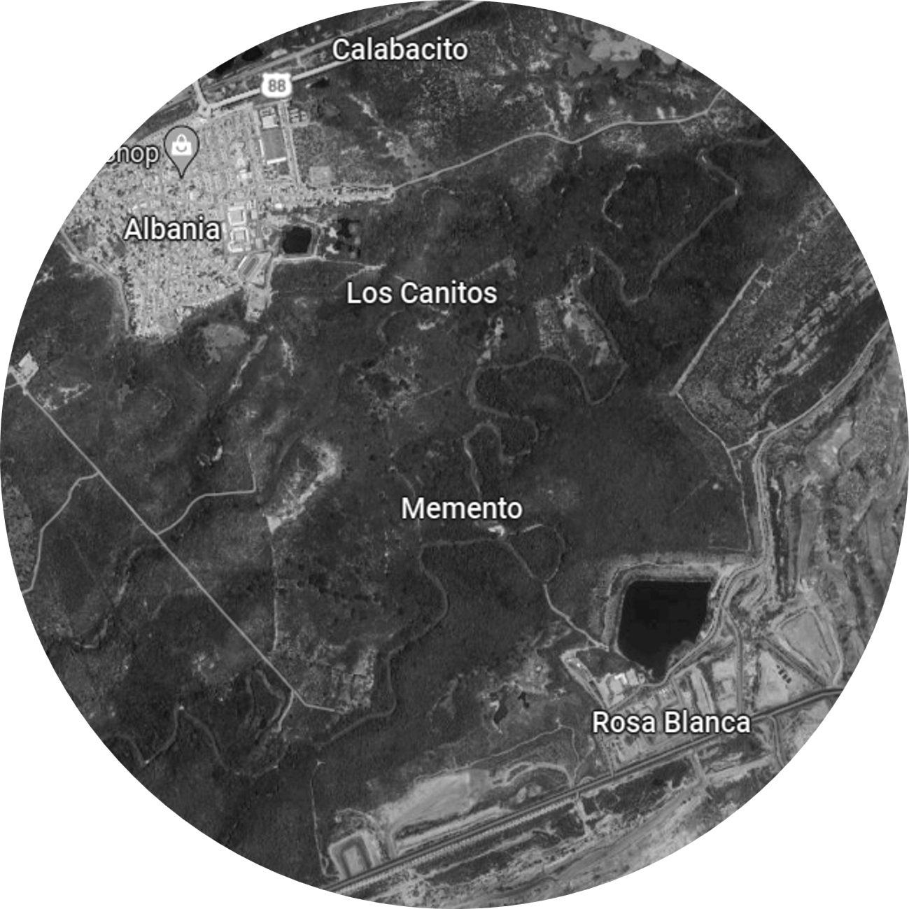
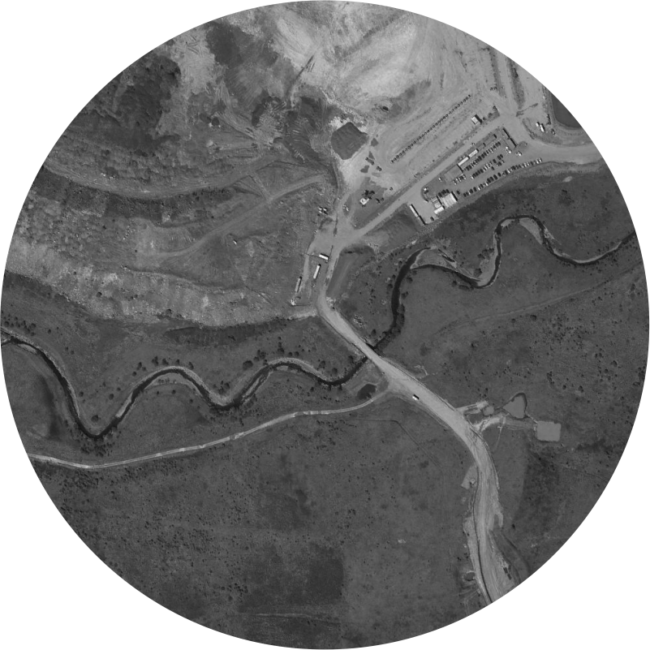

# 0. Investigación de casos de estudio
Keywords: `study-case` `realigment` `hydraulics` `sinuosity` `river-bend` `channel-length` `valley-length` `m01a00`

Investigue y documente el realineamiento de un río en cualquier localización mundial y documente los parámetros hidráulicos y geométricos generales utilizados.     

 Realineamiento Arroyo San Antonio - Cesar - Colombia. Tomado de: <a href="https://www.google.com/maps/place/9%C2%B031'14.0%22N+73%C2%B029'00.6%22W/@9.4908347,-73.5271725,2926a,35y,36h,62.01t/data=!3m1!1e3!4m4!3m3!8m2!3d9.520558!4d-73.483489?entry=ttu&g_ep=EgoyMDI1MDUyNi4wIKXMDSoASAFQAw%3D%3D">Google Maps</a> 

## Objetivos

* Investigar y entender criterios generales para relocalizar o realinear ríos o cauces.
* Evaluar las directrices generales hidráulicas y geométricas a tener en cuenta en el realineamiento de drenajes.

## Requerimientos

* [:toolbox:Herramienta](https://www.microsoft.com/es/microsoft-365/word?market=bz): Microsoft Word 365.
* [:open_file_folder:Repositorio de proyecto](https://forms.office.com/r/gVg8DjvVFh): repositorio creado y compartido para publicación de avances de proyecto. 
* [:open_file_folder:R.HCMC.PlantillaSoporteDesarrollo.docx](../../file/report/R.HCMC.PlantillaSoporteDesarrollo.docx): plantilla para presentación de documentos soporte de desarrollo e informes.

> Para los diferentes avances de proyecto, es necesario guardar y publicar las diferentes versiones generadas del (los) libro (s) de Microsoft Excel y reportes o informes, agregando al final la fecha de control documental en formato aaaammdd, p. ej. _R.HydroTools.DisenoCaucesParametros.20250528.xlsx_.

## Ejemplos de cauces naturales y artificiales sinuosos y curvos con y sin sección compuesta

| Imagen[^1]                                                                            | Cauce                                                                                                                                                                                                                         | Descripción                                                                                                                                                                                                                                                                                                                                                                                                                                                                                                                                                                                                                                                                                                                                                                                                                                                                                                                                                                                                                                                                                                                                                                                                                                                                                                                                                                                                                                                                                                                                                                                                                                                                                                                                                                    |                                  Google maps                                   |
|---------------------------------------------------------------------------------------|:------------------------------------------------------------------------------------------------------------------------------------------------------------------------------------------------------------------------------|:-------------------------------------------------------------------------------------------------------------------------------------------------------------------------------------------------------------------------------------------------------------------------------------------------------------------------------------------------------------------------------------------------------------------------------------------------------------------------------------------------------------------------------------------------------------------------------------------------------------------------------------------------------------------------------------------------------------------------------------------------------------------------------------------------------------------------------------------------------------------------------------------------------------------------------------------------------------------------------------------------------------------------------------------------------------------------------------------------------------------------------------------------------------------------------------------------------------------------------------------------------------------------------------------------------------------------------------------------------------------------------------------------------------------------------------------------------------------------------------------------------------------------------------------------------------------------------------------------------------------------------------------------------------------------------------------------------------------------------------------------------------------------------|:------------------------------------------------------------------------------:|
|   | Canal de desviación Río Calenturitas, Colombia.                                                                                                                                                                               | C.I. Prodeco S.A. Departamento del Cesar, Colombia, Suramérica http://www.grupoprodeco.com.co/es/                                                                                                                                                                                                                                                                                                                                                                                                                                                                                                                                                                                                                                                                                                                                                                                                                                                                                                                                                                                                                                                                                                                                                                                                                                                                                                                                                                                                                                                                                                                                                                                                                                                                        |  [:globe_with_meridians:](http://maps.google.com/maps?q=9.672087,-73.466907)   |
|        | Canal natural Río Maracas, Colombia.                                                                                                                                                                                          | Departamento del Cesar, Colombia, Suramérica                                                                                                                                                                                                                                                                                                                                                                                                                                                                                                                                                                                                                                                                                                                                                                                                                                                                                                                                                                                                                                                                                                                                                                                                                                                                                                                                                                                                                                                                                                                                                                                                                                                                                                                                   |  [:globe_with_meridians:](http://maps.google.com/maps?q=9.694587,-73.399419)   |
|     | Canal de desviación Arroyo San Antonio, Colombia.                                                                                                                                                                             | Drummond Ltd. Departamento del Cesar, Colombia, Suramérica. http://www.drummondltd.com/                                                                                                                                                                                                                                                                                                                                                                                                                                                                                                                                                                                                                                                                                                                                                                                                                                                                                                                                                                                                                                                                                                                                                                                                                                                                                                                                                                                                                                                                                                                                                                                                                                                                                  |  [:globe_with_meridians:](http://maps.google.com/maps?q=9.520558,-73.483489)   |
|             | Cerro Matoso, canales y desviaciones, Colombia.                                                                                                                                                                               | La mina Cerro Matoso en el noroeste de Colombia es una de las minas de ferroníquel a cielo abierto más grandes del mundo. La mina más grande de América del Sur, que contiene la mayor reserva de níquel en Colombia. Es operado por Cerro Matoso SA, empresa que fue propiedad de la multinacional anglo-australiana BHP entre 1980 y 2015, y desde entonces es propiedad de South32. Referencia: 1000054332                                                                                                                                                                                                                                                                                                                                                                                                                                                                                                                                                                                                                                                                                                                                                                                                                                                                                                                                                                                                                                                                                                                                                                                                                                                                                                                                                       |  [:globe_with_meridians:](http://maps.google.com/maps?q=7.889823,-75.530696)   |
|             | Realineamiento Arroyo Bruno, Colombia.                                                                                                                                                                                        | El arroyo Bruno se encuentra localizado en el departamento de La Guajira, en el municipio de Albania, se le realizo un realineamiento de su drenaje con el propósito de poder realizar la explotación de minerales en el proyecto minero Carbones El Cerrejón Limited, 2019. En este canal artificial se pueden apreciar dos diseños, el primero una sección meándrica con una sinuosidad simétrica y la segunda sección un canal con meandros con una longitud de onda mucha más grande y menos simétrica. La obra principal corresponde a la intervención (desvío) de 3,6 km del cauce natural del arroyo Bruno, localizado en el extremo norte del área de explotación minera del Cerrejón, a una distancia Máxima de 720 m al norte del cauce natural; esto incluye sus obras complementarias, a ser ejecutada en un periodo constructivo de aproximadamente de 14 meses. Los diseños y la evaluación ambiental fueron realizados por INGETEC con la interventoría técnica - ambiental de Consultoría Colombiana. Adicionalmente, el diseño contó con el apoyo del consultor internacional Ross Hardie experto en intervenciones de corrientes de agua de la consultora Alluvium (Australia) especializada en manejo de recursos acuáticos, ríos y cuencas. Referencia: 1000003536, 1000090843, 1000094210, ASA                                                                                                                                                                                                                                                                                                                                                                                                                                                 |  [:globe_with_meridians:](http://maps.google.com/maps?q=11.167416,-72.547426)  |
|                | [Realineamiento del cauce del río Tucuy, Colombia.](https://www.anla.gov.co/documentos/proyectos/03_seguimiento/10_jagua_de_ibirico/12-03-2021-anla-4_Resolucion_1173_8_07_2020_Modifica_PMA.pdf)                             | El realineamiento de un tramo del río Tucuy, se enmarca en las actividades del proyecto denominado “Operación Integrada Carbones de La Jagua S.A. (CDJ), Consorcio Minero Unido S.A. (CMU) y Carbones El Tesoro S.A. (CET)” de ahora en adelante “el proyecto”, cuyo objetivo es la extracción de carbón a cielo abierto y sus actividades conexas, dentro de los contratos mineros 285/95 (CDJ), 132/92 (CET), 109/90 (CMU), DKP-141 (CDJ) y HKT-08031 (CDJ), las cuales fueron aprobadas en su Plan de Manejo Ambiental Unificado adoptado por la Autoridad Nacional de Licencias Ambientales -ANLA-, mediante Resolución 2375 de 2008 y modificado mediante Resolución 1173 de 2020 por esta misma autoridad.  Esta última modificación tuvo como objetivo incluir como parte de las obras y actividades que han sido autorizadas por la Autoridad Ambiental en sus diferentes actos administrativos, las cuales fueron ejecutadas por parte del proyecto mediante la ocupación de cauce en el río Tucuy, para la reorientación permanente de un tramo de este cauce y sus obras asociadas, las cuales fueron necesarias para dar respuesta a la emergencia ambiental derivada del deslizamiento de un talud inestable localizado en el sector noroccidental del proyecto, contiguo a las lagunas de sedimentación cercanas al retrollenado norte, en la margen izquierda del río.  El canal de reorientación implementado tuvo el objetivo de alejar el cauce del río Tucuy de la zona afectada, permitiendo el desarrollo de las obras de estabilización requeridas en el sector, con el fin de evitar la afectación del cuerpo de agua natural y la posible generación de deslizamientos adicionales en el talud afectado. Referencia: 1000095706 |  [:globe_with_meridians:](http://maps.google.com/maps?q=9.597621,-73.275049)   |
|           | [Canal del Dique, Colombia.](https://www.banrep.gov.co/es/el-canal-del-dique-y-su-subregion-economia-basada-riqueza-hidrica)                                                                                                  | La subregión Canal del Dique, ubicada en la Costa Caribe colombiana, es una llanura aluvial conformada por un complejo de humedales en donde habitan una gran biodiversidad de especies terrestres y piscícolas. El Canal del Dique fue un sistema de ciénagas interconectadas por un pequeño y sinuoso canal de desborde, habilitado en 1650 por Don Pedro Zapata de Mendoza para la navegación menor. Entre 1981 y 1984, se realizó la última rectificación del canal del Dique, reduciendo en número de curvas, el ancho del fondo se amplió entre 60 y 70 m con una profundidad mínima de 2.5 metros. Referencia: 1000094166                                                                                                                                                                                                                                                                                                                                                                                                                                                                                                                                                                                                                                                                                                                                                                                                                                                                                                                                                                                                                                                                                                                                    |  [:globe_with_meridians:](http://maps.google.com/maps?q=10.231693,-75.228782)  |
|            | [Realineamiento del Río Ranchería, Colombia.](https://es.slideshare.net/slideshow/resumen-del-proyecto-de-expansin-iiwouyaa-para-grupos-de-inters/8830551#31)                                                                 | El proyecto de expansión Liwo`uyaa planteado por parte de Carbones del Cerrejón Limited, se localiza en el departamento de la Guajira, Colombia. Se pretendía realizar una ampliación a la mina del Cerrejón, y disminuir la probabilidad de ocurrencia de inundaciones. Dentro de este proyecto se planteó el desvío del Rio Ranchería, para lo cual se plantearon 4 propuesta, de estas la más opcionada consiste en modificar el cauce del rio en 2 secciones. La intervención abarca 27,5 km del cauce natural, de los cuales se plantea mantener 4,1km entre las 2 secciones a intervenir. Se planteó que el nuevo trazado fuera siempre en el sentido paralelo al cauce natural, y se mantuviera la sinuosidad del mismo, el inicio del desvío se realizaría en el sector denominado Doña Raque y terminaría después de la confluencia con el arroyo Tabaco. La sección del río Ranchería planteado en el desvío corresponde a un ancho en la sección dominante de 41m con base de 20m, y para el flujo máximo se estipulo un ancho entre 100 m y 250 m por uno de los costados se proyectó la construcción de una vía de servicio, ferrocarril y vía del carbón. En juntos costados se tiene planteadas obras de drenaje y diques. Aguas abajo del desvío se realizaría un dique para la protección del municipio de Albania, ya que el proyecto de expansión puede aumentar el riesgo de inundación ante un evento del periodo de 100 años. Referencia: 1000098368, 1000007378                                                                                                                                                                                                                                                                              |  [:globe_with_meridians:](http://maps.google.com/maps?q=11.149801,-72.582214)  | 
|    | [California State water project, U.S.](https://www.centerforfoodsafety.org/issues/4729/water/californias-state-water-project)                                                                                                 | El Dorado Irrigation District. California is home to many of the largest industrial agricultural operations in the country, along with some of the largest state and federal water projects in the country. This combination has resulted in a misguided and unsustainable attempt to overcome the region’s natural and relatively predictable freshwater scarcity, resulting in tremendous damage to aquatic ecosystems. The scale of the problem and the stakes at risk beg for solutions, but most energy is focused on making the overuse of water more “efficient,” through technology and the marketplace, instead of reducing the unsustainable and inequitable use of water in the first place.                                                                                                                                                                                                                                                                                                                                                                                                                                                                                                                                                                                                                                                                                                                                                                                                                                                                                                                                                                                                                                                                        |                                                                                |
|  | Morwell River, River Channel Relocation, Victoria, Australia.                                                                                                                                                                 | El río Morwell es un río perenne de la cuenca de captación de West Gippsland. Está ubicado en las regiones de West Gippsland y South Gippsland del estado australiano de Victoria. Nace en las cordilleras Strezelecki, en un bosque abierto escarpado y luego fluye en un lecho de rocas, cantos rodados y escombors en un valle angosto hasta debajo de Boolarra Sur. Desemboca en el río Latrobe, al sur de Yallourn North. Desciende 156 m en su curso de 41 km. Los tramos inferiores del rio fueron desviados alrededor de minas de carbón a cielo abierto mediante canales y tuberías. El 6 de junio de 2012 se inundó la mina de carbón de Yallourn como consecuencia de la falla de un banco de diques. Tiene una elevación 172 m. Un arroyo popular entre los pescadores es la sección superior a lo largo de Morwell River Road entre Yinnar y Boolarra en donde abundan las truchas marrones y blackfish de río. El río aguas arriba tiene hasta 10 m de ancho con extensas piscinas de más de 1 m de profundidad. Aguas abajo el canal tiene hasta 8 m de ancho con algunos taludes empinados de unos 4 m de altura. La vegetación ribereña es principalmente de sauces, eucaliptos, pastos, arboles de té y moras. Texto: 1000012181                                                                                                                                                                                                                                                                                                                                                                                                                                                                                                                  | [:globe_with_meridians:](http://maps.google.com/maps?q=-38.239749,146.350334)  |
|  | River Nith, Cumnock, United Kingdom.                                                                                                                                                                                          | Realineamiento.                                                                                                                                                                                                                                                                                                                                                                                                                                                                                                                                                                                                                                                                                                                                                                                                                                                                                                                                                                                                                                                                                                                                                                                                                                                                                                                                                                                                                                                                                                                                                                                                                                                                                                                                                                |  [:globe_with_meridians:](http://maps.google.com/maps?q=55.379424,-4.288834)   |
|    | Isaac River, Moranbah, Australia.                                                                                                                                                                                             | Realineamiento.                                                                                                                                                                                                                                                                                                                                                                                                                                                                                                                                                                                                                                                                                                                                                                                                                                                                                                                                                                                                                                                                                                                                                                                                                                                                                                                                                                                                                                                                                                                                                                                                                                                                                                                                                                | [:globe_with_meridians:](http://maps.google.com/maps?q=-21.826206,147.994263)  |
|        | Traralgon Creek, Australia.                                                                                                                                                                                                   | Realineamiento.                                                                                                                                                                                                                                                                                                                                                                                                                                                                                                                                                                                                                                                                                                                                                                                                                                                                                                                                                                                                                                                                                                                                                                                                                                                                                                                                                                                                                                                                                                                                                                                                                                                                                                                                                                | [:globe_with_meridians:](http://maps.google.com/maps?q=-38.227016,146.539554)  |
|            | Río Segre, Lérida (Lleida), Spain.                                                                                                                                                                                            | Realineamiento.                                                                                                                                                                                                                                                                                                                                                                                                                                                                                                                                                                                                                                                                                                                                                                                                                                                                                                                                                                                                                                                                                                                                                                                                                                                                                                                                                                                                                                                                                                                                                                                                                                                                                                                                                                |   [:globe_with_meridians:](http://maps.google.com/maps?q=41.61386,0.627197)    |
|           | Desvío del Rio Sao Francisco, Brasil.                                                                                                                                                                                         | Se diseñaron y construyeron dos grandes canales de derivación para uso agropecuario y de consumo para suministrar agua a 390 municipios, el canal norte tiene 140 km de longitud y un caudal de diseño de 99 m³/s; el canal del este tiene 217 km de longitud y un caudal de diseño de 28 m³/s. Referencia: 1000020502, 1000090843                                                                                                                                                                                                                                                                                                                                                                                                                                                                                                                                                                                                                                                                                                                                                                                                                                                                                                                                                                                                                                                                                                                                                                                                                                                                                                                                                                                                                                  |  [:globe_with_meridians:](http://maps.google.com/maps?q=-8.538265,-39.455780)  |
|    | [Realineamiento de los ríos gemelos, England.](https://www.mdpi.com/2073-4441/10/10/1360/htm): Río Duke of Northumberland y Río Longford, para la construcción del terminal 5 del aeropuerto de Heathrow, Londres, Inglaterra | El proyecto incluyó el realineamiento de dos ríos que originalmente pasaban por en medio de lo que ahora son las pistas y la terminal 5 del aeropuerto de Heathrow en Londres, Inglaterra. Se realizó en varias etapas, primero se hicieron unos realineamientos y se dejaron unas grandes alcantarillas por debajo de las pistas; posteriormente, se realinearon nuevamente y se sacaron completamente del predio del aeropuerto. Referencia: 1000020502                                                                                                                                                                                                                                                                                                                                                                                                                                                                                                                                                                                                                                                                                                                                                                                                                                                                                                                                                                                                                                                                                                                                                                                                                                                                                                           |  [:globe_with_meridians:](http://maps.google.com/maps?q=51.471543,-0.492560)   |
|        | [Realineamiento del Río Cherwell, Banbury, Oxfordshire – United Kingdom.](https://www.therrc.co.uk/2012%20Conference/Outputs/Moon.pdf)                                                                                        | Como parte del Plan de mitigación de inundaciones de Banbury, Oxfordshire, se realizo la realineación de dos secciones del río Cherwell para dar espacio a la construcción de un nuevo dique. Black & Veatch fue la empresa responsable de desarrollar el diseño detallado del nuevo canal realineado y ejecutar la construcción. Uno de los objetivos clave del diseño constituían aumentar la conectividad entre el río y la llanura aluvial.  El realineamiento superior incluyó mejoras adicionales en la biodiversidad y la hidromorfología del diseño del canal, las cuales se llevaron a cabo durante la construcción. Las obras en el lugar involucraron "Hacer más rugoso" el canal, estrecharlo y elevar el lecho en ciertas áreas, así como trasladar vegetación acuática. La supervisión en el lugar de las obras de mejora aseguró la utilización total de los recursos locales, como la retención y reutilización de material vegetal leñoso dentro del canal para lograr un régimen de flujo más variable y acelerar el establecimiento del hábitat ribereño. Realineamiento Superior: 52.0953783,-1.319449. Realineamiento Medio: 52.08508,-1.3208568 Referencia: 1000010006                                                                                                                                                                                                                                                                                                                                                                                                                                                                                                                                                                  |  [:globe_with_meridians:](http://maps.google.com/maps?q=52.0953783,-1.319449)  |
|                  | [Realineamiento del Río Cherry Creek, Denver, Colorado – United States :camera:](https://github.com/rcfdtools/R.GISMobile/blob/main/.poi/29/Readme.md)                                                                        | Realineamiento sinuoso aguas abajo de la represa Crerry Creek. Sección compuesta, biciruta, pasos de vía en sección dominante, estructuras de control de pendiente, estructuras de discipación de energía.                                                                                                                                                                                                                                                                                                                                                                                                                                                                                                                                                                                                                                                                                                                                                                                                                                                                                                                                                                                                                                                                                                                                                                                                                                                                                                                                                                                                                                                                                                                                                                     | [:globe_with_meridians:](http://maps.google.com/maps?q=39.679556,-104.8980469) |
|               | [Realineamiento Whitemarsh Creek, Maryland, U.S.](ref/1000100840_1000098352.pdf)                                                                                                                                              | Localizado en la ciudad de Baltimore, perteneciente al estado de Maryland, EE.UU., pertenece a la cuenca Gunpowder-Patapsco (Area: 12.25 km²) y fluye hacia el este desde la población de Whitemarsh, para luego confluir con el arroyo Honeygo y otros afluentes más pequeños, conformando el Bird River, que finalmente descargar sobre la bahía Chesapeake. Para el año 1996, los principales usos de suelo en la cuenca estaban distribuidos de la siguiente forma: 18% desarrollos urbanos, 23% zonas agrícolas, 18% bosques. Si bien, es una cuenca pequeña, la dinámica de transporte de sedimentos es bastante fluctuante a razón del régimen intermitente de la corriente principal. Referencia: 1000100840, 1000098352                                                                                                                                                                                                                                                                                                                                                                                                                                                                                                                                                                                                                                                                                                                                                                                                                                                                                                                                                                                                                                    |  [:globe_with_meridians:](http://maps.google.com/maps?q=39.366057,-76.439747)  | 
|                   | [Reubicación del rio Bollin en el aeropuerto de Manchester (Reino Unido)](https://www.therrc.co.uk/MOT/Final_Versions_%28Secure%29/11.1_Sugar_Brook.pdf)                                                                      | La construcción de una segunda pista de aterrizaje en el aeropuerto de Manchester requirió el relleno de un tramo de 350m de longitud del Arroyo Sugar book y su valle, para elevar el nivel del suelo hasta la cota necesaria para la pista y las praderas marginales de seguridad. En lugar de enterrar todo el tramo en una alcantarilla, el arroyo se realineo en un tramo de 500 m de longitud que redujo la longitud de la alcantarilla a 140 m, donde inevitablemente pasaba por debajo de las aproximaciones a la pista y la franja de iluminación. La longitud restante del desvió, unos 360 m, se construyo como curso de agua abierto. Referencia: 1000095800, 1000044247                                                                                                                                                                                                                                                                                                                                                                                                                                                                                                                                                                                                                                                                                                                                                                                                                                                                                                                                                                                                                                                                                |   [:globe_with_meridians:](http://maps.google.com/maps?q=53.34149,-2.28765)    | 
|             | [Canal de derivación del Río Rojo Manitoba – Canadá.](ref/1000009579_1000007597.pdf)                                                                                                                                          | El canal de derivación del Rio Rojo “Red River Floodway” fue construido entre 1962 y 1968 al este de Winnipeg, Manitoba, Canadá, con el fin de proteger la ciudad de las amenazas de inundación originadas por las crecientes del Rio Rojo puesto que la ciudad en si se encuentra localizada en la confluencia de los ríos Rojo y Assiniboine dando origen a una llanura aluvial o valle de inundación (Manitoba Government Inquiry, 2024). Referencia: 1000007597, 1000009579                                                                                                                                                                                                                                                                                                                                                                                                                                                                                                                                                                                                                                                                                                                                                                                                                                                                                                                                                                                                                                                                                                                                                                                                                                                                                     |    [:globe_with_meridians:](http://maps.google.com/maps?q=50.0915,-96.9374)    | 
|               | [Realineamiento Río San Antonio, Texas, U.S.](https://www.sariverauthority.org/es/about/history/)                                                                                                                             | El Río San Antonio fue originalmente modificado con canales rectos para el control de inundaciones, lo que afectó negativamente el ecosistema local. El proyecto Mission Reach se llevó a cabo con el objetivo de restaurar 13 kilómetros del río a un estado más natural, añadiendo meandros, bancos vegetados y humedales para promover la biodiversidad y mejorar la calidad del agua. Esta restauración incluyó la creación de un cauce sinuoso que favorece la formación de hábitats diversos, desde áreas de aguas lentas hasta rápidos y cascadas. (San Antonio River Authority, 2024). Referencia: 1000096794                                                                                                                                                                                                                                                                                                                                                                                                                                                                                                                                                                                                                                                                                                                                                                                                                                                                                                                                                                                                                                                                                                                                               | [:globe_with_meridians:](http://maps.google.com/maps?q=29.391923,-98.496194)   | 

## Actividades de proyecto :triangular_ruler:

En la siguiente tabla se listan las actividades que deben ser desarrolladas y documentadas por cada estudiante o grupo de proyecto.

| Actividad | Alcance                                                                                                                                                                                                                                                                                                                                                                                                                                                                                                                                              |
|:----------|:-----------------------------------------------------------------------------------------------------------------------------------------------------------------------------------------------------------------------------------------------------------------------------------------------------------------------------------------------------------------------------------------------------------------------------------------------------------------------------------------------------------------------------------------------------|
| M01A00    | Busque  y documente un realineamiento en cualquier parte del mundo diferente a los citados en esta actividad, incluir:  * Resumen general del proyecto. * Localizador geográfico con latitud y longitud en grados decimales (dd). * Mapa de localización. * Parámetros hidráulicos. * Parámetros geométricos. * Referencias bibliográficas con links de acceso. * Para el informe utilice la plantilla Microsoft Word suministrada y convierta a Adobe Acrobat.                                                              |  
| M01A00    | En una tabla y al final del informe de avance de esta entrega, indique el detalle de las actividades realizadas por cada integrante de su grupo; utilice las siguientes columnas: `Nombre del integrante`, `Actividades realizadas`, `Tiempo dedicado en horas` (si presenta la entrega individualmente, no es necesaria la presentación de esta tabla).  Para actividades que no requieren del desarrollo de elementos de avance, indicar si realizo la lectura de la guía de clase y las lecturas indicadas al inicio en los requerimientos. |

> :blue_heart: Una vez el instructor realice la revisión y el estudiante presente las correcciones o ajustes solicitados, será necesario cargar una nueva versión de los archivos en el repositorio del proyecto, incluyendo o actualizando al final del nombre del archivo, la fecha de presentación en formato aaaammdd y manteniendo las versiones anteriores presentadas.

## Referencias

* www.tankonyvtar.hu
* https://es.wikipedia.org/wiki/Sinuosidad_de_un_r%C3%Ado
* https://www.banrep.gov.co/sites/default/files/publicaciones/archivos/DTSER-72_%28VE%29.pdf
* https://www.canaldeldique.com/anexos/junio3.pdf
* https://semspub.epa.gov/work/01/557060.pdf
* https://www.nrcs.usda.gov/wps/portal/nrcs/detail/national/water/manage/restoration/?cid=stelprdb1044707

## Control de versiones

| Versión    | Descripción                                                                          | Autor                                      | Horas |
|------------|:-------------------------------------------------------------------------------------|--------------------------------------------|:-----:|
| 2022.08.20 | Inclusión de nuevo realineamiento de referencia, Realineamiento de los ríos gemelos. | [rcfdtools](https://github.com/rcfdtools)  | 0.25  |
| 2022.08.14 | Inclusión de nuevos realineamientos de referencia, Canal del Dique a Arroyo Bruno.   | [rcfdtools](https://github.com/rcfdtools)  |   2   |
| 2016.05.21 | Versión inicial.                                                                     | [rcfdtools](https://github.com/rcfdtools)  |   8   |

##

_R.HCMC es de uso libre para fines académicos, conoce nuestra licencia, cláusulas, condiciones de uso y como referenciar los contenidos publicados en este repositorio, dando [clic aquí](../../LICENSE.md)._

_¡Encontraste útil este repositorio!, apoya su difusión marcando este repositorio con una ⭐ o síguenos dando clic en el botón Follow de [rcfdtools](https://github.com/rcfdtools) en GitHub._

| [:arrow_backward: Anterior](../../README.md) | [:house: Inicio](../../README.md) | [:beginner: Ayuda / Colabora](https://github.com/rcfdtools/R.SIGE/discussions/99999) | [Siguiente :arrow_forward:](../M01A01) |
|----------------------------------------------|-----------------------------------|--------------------------------------------------------------------------------------|----------------------------------------|

[^1]: Imágenes tomadas de [Google Maps](http://maps.google.com) y https://www.centerforfoodsafety.org/issues/4729/water/californias-state-water-project.