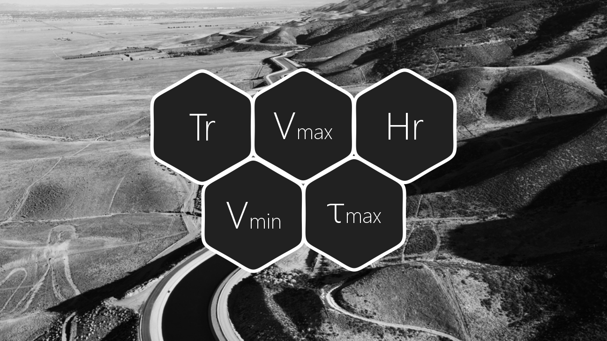

# 1. Parámetros generales requeridos para el diseño y la modelación
Keywords: `technical-parameter` `legal-parameter` `environmental-parameter` `land-zone-parameter` `m01a01`

Definición de parámetros generales y establecimiento de criterios a tener en cuenta para el diseño del canal artificial principal, cauces laterales y estructuras hidráulicas.

## Objetivos

* Establecer parámetros técnicos e hidráulicos generales.
* Revisar parámetros normativos aplicables.
* Identificar restricciones ambientales y sociales.
* identificar restricciones territoriales.

## Requerimientos

* [:toolbox:Herramienta](https://www.microsoft.com/es/microsoft-365/excel?market=bz): Microsoft Excel 365.
* [:open_file_folder:R.HydroTools.DisenoCaucesParametros.xlsx](https://github.com/rcfdtools/R.HydroTools/tree/main/tool/DisenoCaucesParametros): libro de cálculo para el registro de parámetros requeridos y restricciones de diseño.

> Para los diferentes avances de proyecto, es necesario guardar y publicar las diferentes versiones generadas del (los) libro (s) de Microsoft Excel y reportes o informes, agregando al final la fecha de control documental en formato aaaammdd, p. ej. _R.HydroTools.DisenoCaucesParametros.20250528.xlsx_.

## Procedimiento general

Investigar, verificar y registrar en el libro de Excel, los parámetros requeridos descritos a continuación y presentados en el libro de cálculo suministrado:

### A. Técnicos, hidráulicos e hidrológicos

| Parámetro                                                                                                   | Descripción                                                                                                                                                                                                                                                                                                                                                                                                                                                                         | Avance proyecto final                                                                                                                                                                                                                                                                                                                                          |
|:------------------------------------------------------------------------------------------------------------|:------------------------------------------------------------------------------------------------------------------------------------------------------------------------------------------------------------------------------------------------------------------------------------------------------------------------------------------------------------------------------------------------------------------------------------------------------------------------------------|:---------------------------------------------------------------------------------------------------------------------------------------------------------------------------------------------------------------------------------------------------------------------------------------------------------------------------------------------------------------|
| [Tr – Periodos de retorno, años](https://github.com/rcfdtools/R.HydroTools/tree/main/tool/HidrogramaRegVal) | Corresponde a la estimación de la probabilidad de ocurrencia de un evento extremo en un periodo determinado, el cual se utilizará para diseño del canal dominante, creciente, estructuras hidráulicas principales (aplica a pasos de vía, alcantarillas y estructuras de entrega lateral).  Caso estudio: canal dominante: 2.33 años, canal de creciente: 100 años, estructuras hidráulicas: 25 años.                                                                 | Periodos de retorno a utilizar en el diseño del canal dominante y de creciente para canales erosionables y canales revestidos. Periodo de retorno a utilizar en el diseño de estructuras hidráulicas, rectificación y modelación de cauces laterales y áreas de almacenamiento o amortiguación.                                                                |                                                                                            
| Vmax - Velocidad máxima permisible                                                                          | En el diseño hidráulico de la sección estable, una condición vital de diseño es la obtención de velocidades de flujo menores a las que producen un esfuerzo cortante superior a la capacitad estable del lecho.  Caso estudio: velocidad de referencia en canal dominante próxima o inferior a 2m/s y para valle próxima o inferior a 3m/s.                                                                                                                           | Velocidades máximas de referencia para el diseño hidráulico de sección estable para canales erosionables y para el diseño hidráulico de canales no erosionables en zonas de estructuras laterales y canales revestidos.                                                                                                                                        |                                                                                                                                                                 
| Vmin - Velocidad mínima requerida                                                                           | En el diseño hidráulico de la sección estable, una condición también importante es la velocidad mínima que garantice el transporte de los sedimentos depositados sobre el fondo. Caso estudio: velocidad de referencia en canal dominante y creciente próxima o mayor a 0.5m/s.                                                                                                                                                                                       | Velocidades mínima de referencia para el diseño hidráulico de sección estable para canales erosionables y para el diseño hidráulico de canales no erosionables en zonas de estructuras laterales y canales revestidos.                                                                                                                                         |                                                                                                                                                                                                
| τmax - Cortante máximo permisible                                                                           | La fuerza ejercida por unidad de área deberá ser inferior a la soportada por los materiales de fondo, para así prevenir la erosión masiva del cauce y permitir que el canal construido llegue a su condición de equilibrio (volumen de material arrastrado = volumen de material depositado).  Caso estudio: cortante de referencia de diseño, 10 N/m² para el canal dominante y 20 N/m² para el canal de creciente.                                                  | Cortante máximo permitido para prevenir erosión en canales erosionables.                                                                                                                                                                                                                                                                                       |                                                                                   
| Estructuras de paso, gálibos y remanso máximo permitido                                                     | Es necesario definir la localización de las estructuras viales de paso, los gálibos en pasos de vía elevados como puentes, box culverts y pontones y el remanso máximo permitido aguas arriba de cada obra. El remanso condicionará las condiciones de entrega de las las obras hidráulicas.  Caso estudio: vía transversal con soportes o apoyos de cara plana, sin gálibo mínimo requerido y con remanso máximo de hasta 1km.                                       | Longitud de remansos hidráulicos en canales artificiales. Galibo vertical y horizontal para navegabilidad del canal usando puentes.                                                                                                                                                                                                                            |                                                                                    

### B. Normativos (referencias para Colombia - Suramérica)

Avance proyecto final: revisar los parámetros actualmente reportados, investigar, registrar y actualizar.

| Parámetro                                                                                                | Descripción                                                                                                                                                                                                                                                                                                                                                                                                                                                                                                                                                                                                          | 
|:---------------------------------------------------------------------------------------------------------|:---------------------------------------------------------------------------------------------------------------------------------------------------------------------------------------------------------------------------------------------------------------------------------------------------------------------------------------------------------------------------------------------------------------------------------------------------------------------------------------------------------------------------------------------------------------------------------------------------------------------|
| [Requerimientos RAS](http://www.acodal.org.co/reglamento-tecnico-ras-nueva-resolucion-0330-de-2017/)[^1] | Para el diseño del canal propuesto, se deben tener en cuenta los lineamientos y restricciones establecidas en el Reglamento Técnico para el Sector de Agua Potable y Saneamiento Básico – RAS, por ejemplo, las relacionadas con los periodos de retorno de diseño, velocidades y cortantes.                                                                                                                                                                                                                                                                                                                         |                                                                                                                                                                                                                                                                                                                        
| [Requerimientos autoridad ambiental, MADS - ANLA](https://www.minambiente.gov.co)                        | Para cada intervención sobre el territorio y en especial dentro de zonas de concesión para la explotación y aprovechamiento de recursos naturales, será necesario evaluar los lineamientos y restricciones establecidas por la autoridad ambiental nacional. Para el desarrollo de proyectos en Colombia, será necesario consultar la normativa del Ministerio de Ambiente y Desarrollo Sostenible y la reglamentación específica de la Autoridad Nacional de Licencias Ambientales - ANLA. Mas información en: http://www.anla.gov.co/, http://portal.anla.gov.co/biblioteca-web-anla, http://sig.anla.gov.co:8083/ |
| [Requerimientos Corporación Autónoma Regional, CAR](https://www.corpocesar.gov.co/)                      | A nivel regional y dependiendo de la complejidad del proyecto, será necesario solicitar los lineamientos ambientales a la CAR, los cuales podrán condicionar el eje del valle a proponer y los puntos de entrega de cauces laterales. Es preciso identificar los puntos de concesión de agua superficial y los puntos de vertimiento que serán intervenidos por la construcción de canales artificiales. Complementariamente, se deben evaluar las condiciones generales establecidas en los POMCAS de la zona.                                                                                                      |                                                                                                     
| Requerimientos municipales y/o distritales                                                               | Las Secretarías o Gerencias de Planeación y/o de Medio Ambiente de los Municipios dentro de los cuales se desarrollará la implantación del trazado del cauce propuesto, podrán incluir diferentes restricciones locales relacionadas con el ordenamiento territorial, la infraestructura existente y las zonas de conservación y protección. El diseño deberá tener en cuenta todas las restricciones identificadas.                                                                                                                                                                                                 |                                                                                                                                                                                                 

### C. Ambientales y Sociales (referencias para Colombia - Suramérica)

Avance proyecto final: revisar los parámetros actualmente reportados, investigar, registrar y actualizar.

| Parámetro                                       | Descripción                                                                                                                                                                                                                                                                                                                                                                                                                                                                                            |
|:------------------------------------------------|:-------------------------------------------------------------------------------------------------------------------------------------------------------------------------------------------------------------------------------------------------------------------------------------------------------------------------------------------------------------------------------------------------------------------------------------------------------------------------------------------------------|
| Concesiones y vertimientos                      | Qc, Qv, Caudales concesionados en tramos, lps. Para la definición del caudal ecológico, es necesario incluir en el balance hidrológico de largo plazo, la fracción concesionada para captación (Qc: bocatomas y bombeos) y la fracción retornada como caudal de vertimiento o retorno, Qv. Esto permitirá estimar la profundidad de lámina de agua en la sección diseñada para el caudal medio balanceado. Aplica para diferentes usos: agropecuarios, industriales, comerciales, mineros, energéticos |
| PDA, Plan departamental de agua                 | En zonas de proyecto en las que existan diferentes asentamientos humanos (caseríos, cabeceras municipales, centros poblados y ciudades), se deberá analizar la oferta hídrica superficial y evaluar las posibles alteraciones que pueden ocurrir en el abastecimiento de agua para consumo humano, debidas a la implantación del canal.                                                                                                                                                                |                                                                                                                                                              
| POMCA, Planes de ordenación y manejo de cuencas | El Plan de Manejo y Ordenamiento de una Cuenca, POMCA, es el planeamiento del uso y manejo sostenible de sus recursos naturales renovables, de manera que se consiga mantener o restablecer un adecuado equilibrio entre el aprovechamiento económico de tales recursos y la conservación de la estructura físico-biótica de la cuenca y particularmente de sus recursos hídricos. Mas información en: http://www.ambientebogota.gov.co/web/sda/385                                                    |                                                   
| Distritos de riego y reservorios                | En la zona geográfica del proyecto, pueden existir redes complejas de drenaje, como distritos de riego y sistemas de reservorios, que pueden ser alterados e incluso perder su capacidad de operación debido al trazado propuesto. Será necesario entonces, identificar estos sistemas y tenerlos en cuenta como una restricción de diseño.                                                                                                                                                            |                                                                                                                                                          
| Preservación de ecosistemas                     | Dentro de la etapa de formulación del proyecto, es necesario identificar los diferentes ecosistemas que se verán intervenidos por la implantación del canal a construir.  Se deben considerar como una restricción para el trazado del eje de valle propuesto.                                                                                                                                                                                                                                         |                                                                                                                                                                                                                                        
| Tránsito de biofauna (estructuras ecológicas)   | Es necesario identificar los puntos de tránsito de biofauna acuática y terrestre, para diseñar las estructuras ecológicas de paso que permitan mantener las condiciones ecosistémicas de movilidad en la zona de implantación del canal.                                                                                                                                                                                                                                                               |                                                                                                                                                                                                                                                             

### D. Territoriales (referencias para Colombia - Suramérica)

Avance proyecto final: revisar los parámetros actualmente reportados, investigar, registrar y actualizar.

| Parámetro                                           | Descripción                                                                                                                                                                                                                                                                                                                                                                                                                                                                                                                                        |
|:----------------------------------------------------|:---------------------------------------------------------------------------------------------------------------------------------------------------------------------------------------------------------------------------------------------------------------------------------------------------------------------------------------------------------------------------------------------------------------------------------------------------------------------------------------------------------------------------------------------------|
| Alteración en límite de cuencas hidrográficas       | En la definición del trazado del eje del valle, es necesario tener en cuenta que se pueden alterar los límites de las cuencas geográficas de la zona de estudio. Esta alteración puede ocasionar disminución o aumento en la oferta hídrica superficial, lo que podrá ocasionar alteración en las condiciones de operación y funcionamiento de obras existentes en la red de drenaje. Es preciso evaluar las infraestructuras existentes en la zona y dimensionar las posibles alteraciones por la implantación del tramo de desviación propuesto. |
| Alteración de Límites territoriales                 | Por la complejidad en las restricciones de diseño, algunos trazados podrán alterar los límites geopolíticos territoriales de Departamentos, Municipios, Veredas y Corregimientos. Es necesario consultar el alcance de las alteraciones con las diferentes entidades territoriales.                                                                                                                                                                                                                                                                |                                                                                                                                                                                                                                                            
| Restricciones prediales, baldíos y centros poblados | Para el trazado del eje de valle, es necesario realizar un estudio detallado de títulos de propiedad que permita determinar si los predios intervenidos podrán ser comprados, adquiridos o intervenidos.                                                                                                                                                                                                                                                                                                                                           |                                                                                                                                                                                                                                                                                                                                         
| Sistema de gestión del riesgo                       | A nivel municipal o zonal, pueden existir diferentes restricciones relacionadas con la intervención de predios utilizados para la amortiguación de crecientes o para la protección y seguridad de los asentamientos humanos. Se deben consultar los planes de gestión locales.                                                                                                                                                                                                                                                                     |                                                                                                                                                                                                                                                                  
| Zonas protegidas en POT y rondas hídricas           | Dentro de los estudios de ordenamiento territorial, algunos corredores y zonas estarán bajo tratamiento de protección. Para el desarrollo del proyecto, es necesario consultar con las autoridades locales acerca de los cambios a producir en los límites definidos para estas zonas.                                                                                                                                                                                                                                                             |                                                                                                                                                                                                                                                        
| Zonas productivas agropecuarias                     | En la zona de estudio, podrán existir zonas de producción agropecuaria extensiva, las cuales utilizan la infraestructura existente en la zona, dentro de las etapas de diseño, se deben tener en cuenta los corredores de movilidad existente y la conectividad con las redes viales locales, municipales, departamentales y nacionales.                                                                                                                                                                                                           |                                                                                                                                                                                                         

> Respecto a los parámetros en los que no se han indicado las condiciones específicas a utilizar en el ejercicio de clase y en caso de ser necesario, se permitirá que el canal diseñado modifique los límites territoriales, la localización de bocatomas existentes, la localización de los puntos de concesión actuales y en general la modificación topológica de la red de drenaje entre los puntos de inicio y entrega, ajustando la nueva ronda de protección establecida en los planes de ordenamiento.
> 
> En cada hoja y sección, agregue los elementos adicionales investigados en color rojo manteniendo los ya registrados. En caso de no encontrar nuevos parámetros, en la ficha de control documental - FCD, indique el detalle de las fuentes consultadas y si verificó o no las fuentes y referencias suministradas.

## Actividades de proyecto :triangular_ruler:

En la siguiente tabla se listan las actividades que deben ser desarrolladas y documentadas por cada estudiante o grupo de proyecto.

| Actividad | Alcance                                                                                                                                                                                                                                                                                                                                                                                                                                                                                                                                              |
|:----------|:-----------------------------------------------------------------------------------------------------------------------------------------------------------------------------------------------------------------------------------------------------------------------------------------------------------------------------------------------------------------------------------------------------------------------------------------------------------------------------------------------------------------------------------------------------|
| M01A01    | Descargar el archivo [R.HydroTools.DisenoCaucesParametros.xlsx](https://github.com/rcfdtools/R.HydroTools/blob/main/tool/DisenoCaucesParametros/R.HydroTools.DisenoCaucesParametros.xlsx) disponible en GitHub, e incluirlo en el repositorio.                                                                                                                                                                                                                                                                                                       | 
| M01A01    | Investigar, verificar y registrar en el libro de Excel, los parámetros técnicos, hidráulicos e hidrológicos indicados en esta actividad.  Para el grupo de parámetros normativos, ambientales / sociales y territoriales, revisar los parámetros actualmente reportados, investigar, registrar y actualizar.                                                                                                                                                                                                                                   | 
| M01A01    | En una tabla y al final del informe de avance de esta entrega, indique el detalle de las actividades realizadas por cada integrante de su grupo; utilice las siguientes columnas: `Nombre del integrante`, `Actividades realizadas`, `Tiempo dedicado en horas` (si presenta la entrega individualmente, no es necesaria la presentación de esta tabla).  Para actividades que no requieren del desarrollo de elementos de avance, indicar si realizo la lectura de la guía de clase y las lecturas indicadas al inicio en los requerimientos. | 

**A tener en cuenta**

* Todos los valores adoptados se deben justificar técnicamente en la columna _Descripción / Justificación / Referencias_ del libro de Excel. En caso de que lo considere necesario, agregue en color rojo justificaciones adicionales al final de las justificaciones existentes en el libro suministrado.
* Una vez el instructor realice la revisión y el estudiante presente las correcciones o ajustes solicitados, será necesario cargar una nueva versión de los archivos en el repositorio del proyecto, incluyendo o actualizando al final del nombre del archivo, la fecha de presentación en formato aaaammdd y manteniendo las versiones anteriores presentadas. Esto mismo aplica para todas las entregas del proyecto.

## Referencias

* Indicadas en la columna _Descripción / Justificación / Referencias_ de las diferentes hojas del libro de parámetros.

## Control de versiones

| Versión    | Descripción        | Autor                                      | Horas |
|------------|:-------------------|--------------------------------------------|:-----:|
| 2024.02.24 | Migración a GitHub | [rcfdtools](https://github.com/rcfdtools)  |   8   |
| 2014.01.11 | Versión inicial.   | [rcfdtools](https://github.com/rcfdtools)  |  18   |

##

_R.HCMC es de uso libre para fines académicos, conoce nuestra licencia, cláusulas, condiciones de uso y como referenciar los contenidos publicados en este repositorio, dando [clic aquí](../../LICENSE.md)._

_¡Encontraste útil este repositorio!, apoya su difusión marcando este repositorio con una ⭐ o síguenos dando clic en el botón Follow de [rcfdtools](https://github.com/rcfdtools) en GitHub._

| [:arrow_backward: Anterior](../M01A00/Readme.md) | [:house: Inicio](../../README.md) | [:beginner: Ayuda / Colabora](https://github.com/rcfdtools/R.SIGE/discussions/99999) | [Siguiente :arrow_forward:](../M01A02/Readme.md) |
|--------------------------------------------------|-----------------------------------|--------------------------------------------------------------------------------------|--------------------------------------------------|

[^1]: https://www.minvivienda.gov.co/viceministerio-de-agua-y-saneamiento-basico/reglamento-tecnico-sector/reglamento-tecnico-del-sector-de-agua-potable-y-saneamiento-basico-ras