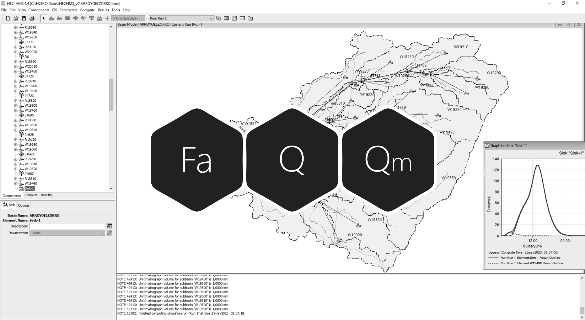
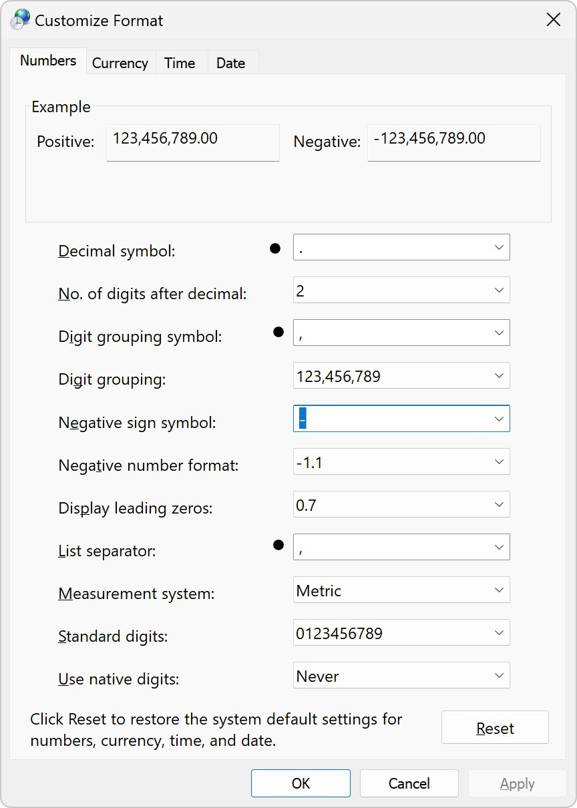
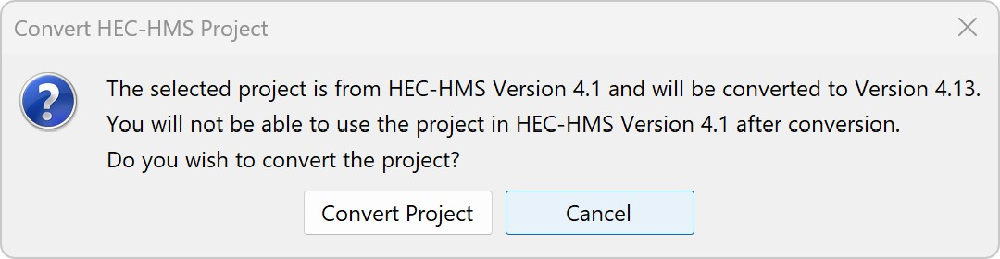
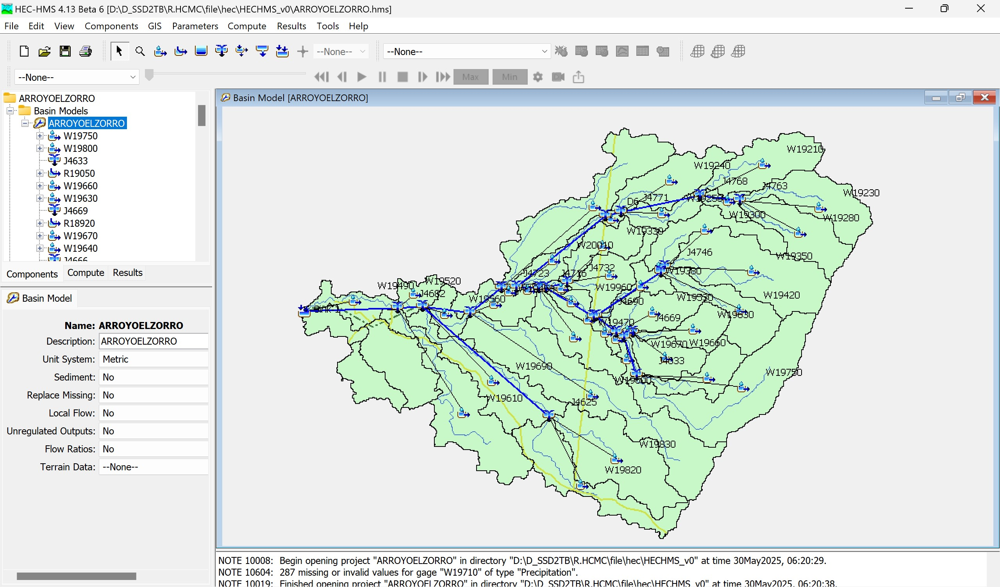
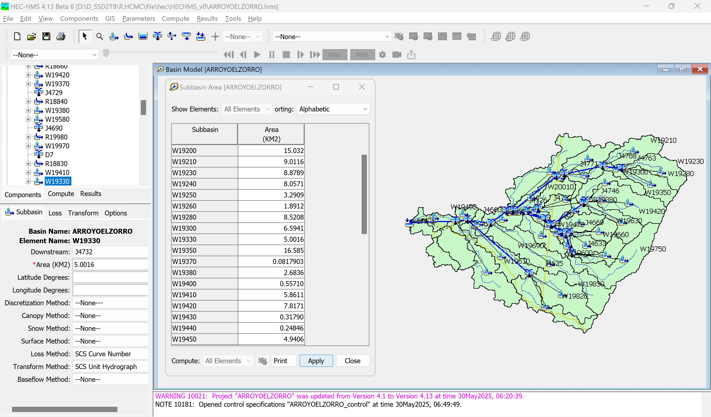
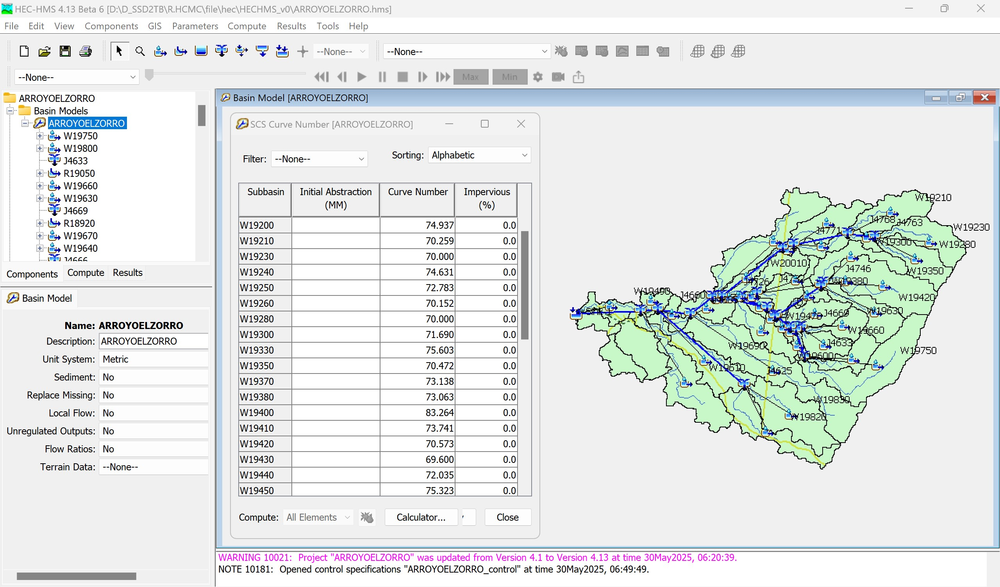
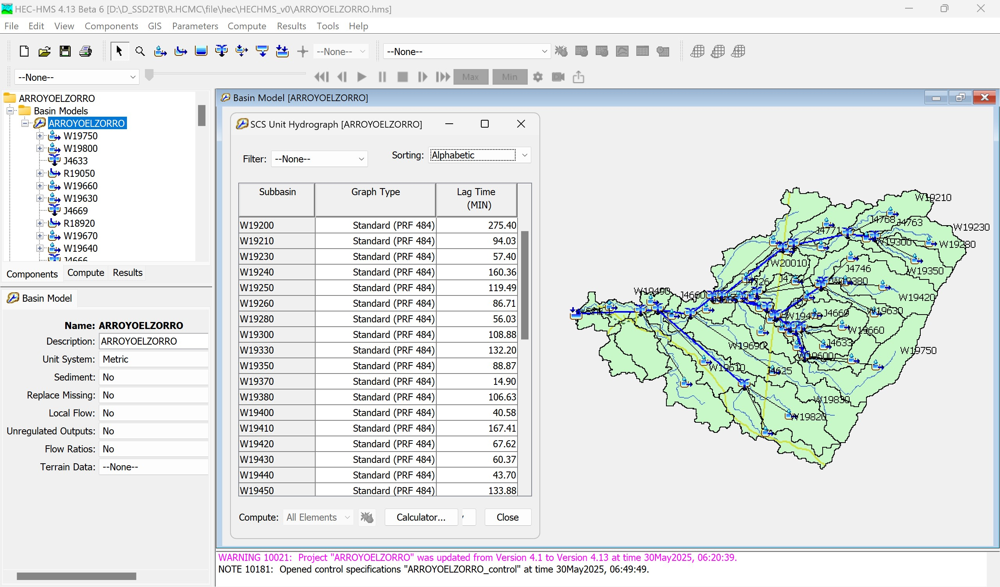
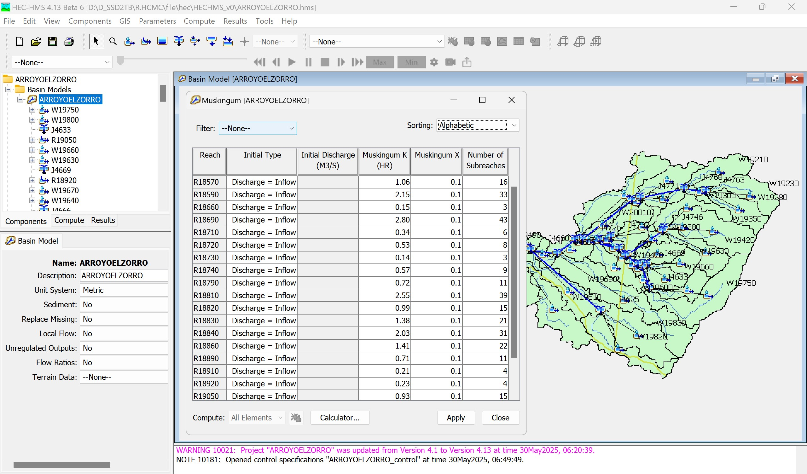
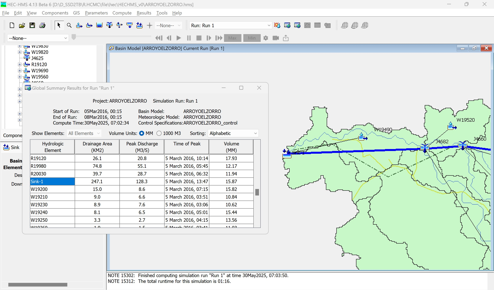

# 1.2. Modelación hidrológica para obtención de caudales de diseño e hidrogramas para tránsito de crecientes
Keywords: `hydrologic-model` `basin` `subbasin` `hec-hms` `hec-dssvue` `m01a02`

Obtener en función del área de aportación hasta los puntos de inicio, entrega, descarga de cauces laterales y para diferentes periodos de retorno, los caudales requeridos para el diseño hidráulico y geométrico, así como los hidrogramas para el tránsito hidráulico de crecientes por el canal artificial.

## Objetivos

* Explorar el modelo hidrológico e Identificar los puntos de estudio.
* Evaluar el área de aportación hasta cada punto de estudio.
* Estimar el factor de atenuación por área simultánea para cada punto.
* Importar a HEC-DSS, los hietogramas por sub-cuenca del modelo hidrológico.
* Estimar caudales pico en diferentes puntos de estudio y para diferentes periodos de retorno.
* Obtener y analizar los hidrogramas obtenidos para el tránsito de crecientes por el tramo de cauce diseñado y para las descargas laterales. 

## Requerimientos

Archivos, actividades previas, lecturas y herramientas requeridas para el desarrollo de esta actividad:

| Requerimiento                                                                                                                                                    | Descripción                                                                                                                                                                                                                                                                                    |
|:-----------------------------------------------------------------------------------------------------------------------------------------------------------------|:-----------------------------------------------------------------------------------------------------------------------------------------------------------------------------------------------------------------------------------------------------------------------------------------------|
| [:toolbox:Herramienta](https://www.microsoft.com/es/microsoft-365/excel?market=bz)                                                                               | Microsoft Excel 365                                                                                                                                                                                                                                                                            |
| [:toolbox:Herramienta](https://notepad-plus-plus.org/)                                                                                                           | Notepad++                                                                                                                                                                                                                                                                                      |
| [:toolbox:Herramienta](https://www.hec.usace.army.mil/software/hec-hms/)                                                                                         | HEC-HMS 4.13 Beta 6 o superior                                                                                                                                                                                                                                                                 |
| [:toolbox:Herramienta](https://www.hec.usace.army.mil/software/hec-dssvue/)                                                                                      | HEC-DSSVue 3.2.3 (versión funcional para cargue masivo de hietogramas)                                                                                                                                                                                                                         |
| [:notebook:Lectura](https://github.com/rcfdtools/R.HydroTools/blob/main/tool/FactorAtenuacionPrecipitacionFa/R.HydroTools.FactorAtenuacionPrecipitacionFa.pdf)   | Factor de atenuación hidrológica de la precipitación por área simultánea                                                                                                                                                                                                                       |
| [:open_file_folder:R.HydroTools.FactorAtenuacion PrecipitacionFa.xlsx](https://github.com/rcfdtools/R.HydroTools/tree/main/tool/FactorAtenuacionPrecipitacionFa) | Libro de cálculo para la estimación del Fa - Factor de atenuación de la precipitación máxima por área simultánea en una cuenca                                                                                                                                                                 |
| [:open_file_folder:HECHMS_v0.zip](../../file/hec/HECHMS_v0.zip)                                                                                                  | Modelo hidrológico HEC-HMS con topología de áreas de drenaje de aproximadamente 4 km² o superior, compuesto por 44 subcuencas, 41 tramos de drenaje de 151.6 km (21 corresponden a tramos con tránsito hidrológico), área total de la cuenca en estudio: 247.1 km².                            |
| [:open_file_folder:Hietogramas](../../file/table/Hietogramas)                                                                                                    | Archivos con series de hietogramas para diferentes periodos de retorno y factores de atenuación (0.62, 0.63, 0.64, 1) en función de las áreas acumuladas hasta los puntos de inicio, entrega y cauces menores. Incluye hietogramas para periodos de retorno de 2.33, 5, 10, 25, 50 y 100 años. |
| [:open_file_folder:R.HCMC.PuntoEstudio.xlsx](../../file/table/R.HCMC.PuntoEstudio.xlsx)                                                                          | Puntos de estudio y factores de atenuación aplicados                                                                                                                                                                                                                                           |
| [:open_file_folder:R.HCMC.NodoValle.xlsx](../../file/table/R.HCMC.NodoValle.xlsx)                                                                                | Puntos de localización para el trazado del valle compuesto por tramos rectos                                                                                                                                                                                                                   |
| [:open_file_folder:R.HydroTools.Hidrograma RegVal.xlsm](https://github.com/rcfdtools/R.HydroTools/tree/main/tool/HidrogramaRegVal)                               | Libro de cálculo para el registro y validación de hidrogramas obtenidos a partir de modelación hidrológica en HEC-HMS                                                                                                                                                                          |

> Para los diferentes avances de proyecto, es necesario guardar y publicar las diferentes versiones generadas del (los) libro (s) de Microsoft Excel y reportes o informes, agregando al final la fecha de control documental en formato aaaammdd, p. ej. _R.HydroTools.DisenoCaucesParametros.20250528.xlsx_.
>
> Nota: los datos hidroclimatológicos suministrados corresponden a información tomada y procesada a partir de datos del IDEAM  y los archivos de formas vectoriales han sido descargados del IGAC y de otras fuentes alternas.

## Conceptos generales y configuración preliminar

### ¿Qué es y para qué sirve un modelo hidrológico?

Es la abstracción o representación del ciclo hidrológico y sus fenómenos asociados, en un prototipo o modelo abstracto simplificado de un evento particular y/o computacional continuo (un modelo es continuo cuando se obtienen múltiples o una serie de resultados instantáneos en un intervalo de tiempo determinado) que sirve para estudiar la interacción de sus principales características y cuyo propósito general es estudiar la escorrentía y caudal producido por la lluvia de una tormenta.

Existen diversas metodologías que dependen de diferentes parámetros y supuestos. Como mínimo se debe estimar el total de lluvia que se puede convertir en escorrentía (lluvia total menos pérdidas y abstracciones), la transformación de la lluvia en escorrentía y el tránsito hidrológico de la escorrentía a través de los cauces.

Para el desarrollo del proyecto utilizaremos:

* Pérdidas de lluvia: Número de curva del [Soil Conservation Service - SCS](http://www.nrcs.usda.gov/) ó CN.
* Transformación de lluvia en escorrentía: Hidrograma unitario del SCS.
* Tránsito hidrológico: Muskingum.

### ¿Qué es y para qué sirve el factor de atenuación por área?

Es un valor numérico adimensional (entre 0 y 1) que multiplica la lluvia total máxima en 24 horas, estimada para cada subcuenca o sus pulsos equivalentes (del hietograma) en función del área de aportación y solo es válido en un punto de estudio determinado. 

Sirve para ajustar o atenuar el valor total de lluvia (mm) máxima, suponiendo que a mayor área acumulada existe menor probabilidad de que simultáneamente llueva sobre toda la cuenca.

El factor de atenuación es inversamente proporcional al área acumulada de la cuenca hasta un determinado punto de estudio. A mayor área acumulada, menor factor y por ende menor precipitación máxima simultánea.

Luego de la modelación o tránsito hidrológico, los valores de caudal pico e hietogramas, solo serán válidos para el punto en estudio.

Para subcuencas pequeñas (menores o iguales a 25 km²) en cauces laterales al río artificial a diseñar, puede suponer que el centro de tormenta cubre toda esta área y por consiguiente el factor multiplicador será de 1.

**Regresiones potenciales - California montañoso** y = a * xb

(3 horas)   y = 2.7388464183 * x -0.2942893251 
(6 horas)   y = 2.4215269794 * x -0.2568171459 
(9 horas)   y = 2.1659921609 * x -0.2239811195 

### Configuración regional del sistema operativo

Antes de abrir el modelo hidrológico suministrado, verifique que el sistema de unidades de su sistema operativo esté configurado con la notación del sistema inglés. En Microsoft Windows ir a Panel de Control / Región / Configuración Adicional y establecer:

* Separador decimal: Punto (.)
* Símbolo de agrupación de miles: Coma (,)
* Separador de listas: Coma (,)

> Nota: recuerde que las herramientas HEC utilizan esta notación y a pesar de que se puede predefinir el sistema internacional de unidades, internamente el núcleo de cálculo realiza las operaciones en sistema inglés.

## Procedimiento general

1. Exploración del modelo: abra el modelo hidrológico HEC-HMS suministrado e identifique: drenajes, subcuencas, esquematización simplificada en nodos y líneas, el eje de valle del cauce a diseñar, consulte los parámetros:

* Área de subcuencas (km²)
* Área total cuenca (km²)
* Área acumulada hasta el nodo superior más cercano al punto de inicio del eje de valle
* Número de Curva SCS asociado a cada subcuenca.
* Tiempo de retardo o LagTime (min) asociado a cada subcuenca.
* Parámetros de tránsito hidrológico para Muskingum, K (hr), X, número de tramos.

> Geográficamente, se muestran las sub-cuencas localizadas al sur-oeste del eje del valle, pero para el tránsito hidrológico no se considerará la escorrentía producida por estas áreas debido a que el análisis hidrológico corresponde al tránsito hasta el punto de entrega del canal a diseñar y este se encuentra arriba del punto de confluencia de estos drenajes. Total área geográfica incluyendo las cuencas al sur: 262.3 km².

Modelo topológico de subcuenca 

Área por subcuenca 

Pérdidas / Número de curva CN del SCS por subcuenca 

Transformación / Hidrograma unitario del SCS por subcuenca 

Tránsito hidrológico / Muskingum por drenaje 

2. Identificación de puntos y área de estudio

Identifique los nodos correspondientes al inicio, entrega del eje de valle, cauce lateral y subcuenca lateral; verifique:

* Código del nodo
* Área total acumulada hasta cada punto (km²)
* Estime el Factor de Atenuación por área correspondiente a cada área acumulada hasta los puntos de estudio. (utilizar la información correspondiente a California Montañoso para lluvias con duración igual o equivalente a 9 horas)
* Identifique la cuenca o cuencas correspondientes al cauce lateral que drenará sus aguas al canal a diseñar y establezca el factor de atenuación. Suponga que el centro de tormenta cubre toda esta cuenca menor.

En la barra de ejecución, seleccione _Run: Run 1_, consulte los resultados actuales del modelo y verifique las áreas acumuladas hasta los diferentes nodos cercanos al eje de realineamiento. Para el caso de estudio corresponden a los nodos J4660, J4682 y Sink-1.

Tránsito hidrológico / Muskingum por drenaje 

| Localización | Descripción                             |       Área acumulada (km²)        | Factor de atenuación - Fa |
|:------------:|:----------------------------------------|:---------------------------------:|:-------------------------:|
|    J4660     | Inicio realineamiento                   |               225.4               |           0.64            |
|    J4682     | Entrega cauce lateral                   |               243.1               |           0.63            |
|    Sink-1    | Fin realineamiento                      | 247.1 sin consider área sur-oeste |           0.63            |
|    Sink-1    | Fin realineamiento                      | 263.2 considerando área sur-oeste |           0.62            |
|    W19610    | Subcuenca lateral entrega en nodo J4682 |             15.195                |           1.00            |

R.HCMC.NodoValle.xlsx

## Actividades de proyecto :triangular_ruler:

En la siguiente tabla se listan las actividades que deben ser desarrolladas y documentadas por cada estudiante o grupo de proyecto.

| Actividad | Alcance                                                                                                                                                                                                                                                                                                                                                                                                                                                                                                                                              |
|:----------|:-----------------------------------------------------------------------------------------------------------------------------------------------------------------------------------------------------------------------------------------------------------------------------------------------------------------------------------------------------------------------------------------------------------------------------------------------------------------------------------------------------------------------------------------------------|
| M01A02    | Descargar el archivo [R.HydroTools.DisenoCaucesParametros.xlsx](https://github.com/rcfdtools/R.HydroTools/blob/main/tool/DisenoCaucesParametros/R.HydroTools.DisenoCaucesParametros.xlsx) disponible en GitHub, e incluirlo en el repositorio.                                                                                                                                                                                                                                                                                                       | 
| M01A02    | Investigar, verificar y registrar en el libro de Excel, los parámetros técnicos, hidráulicos e hidrológicos indicados en esta actividad.  Para el grupo de parámetros normativos, ambientales / sociales y territoriales, revisar los parámetros actualmente reportados, investigar, registrar y actualizar.                                                                                                                                                                                                                                   | 
| M01A02    | En una tabla y al final del informe de avance de esta entrega, indique el detalle de las actividades realizadas por cada integrante de su grupo; utilice las siguientes columnas: `Nombre del integrante`, `Actividades realizadas`, `Tiempo dedicado en horas` (si presenta la entrega individualmente, no es necesaria la presentación de esta tabla).  Para actividades que no requieren del desarrollo de elementos de avance, indicar si realizo la lectura de la guía de clase y las lecturas indicadas al inicio en los requerimientos. | 

> :blue_heart: Una vez el instructor realice la revisión y el estudiante presente las correcciones o ajustes solicitados, será necesario cargar una nueva versión de los archivos en el repositorio del proyecto, incluyendo o actualizando al final del nombre del archivo, la fecha de presentación en formato aaaammdd y manteniendo las versiones anteriores presentadas.

## Referencias

* 

## Control de versiones

| Versión    | Descripción        | Autor                                      | Horas |
|------------|:-------------------|--------------------------------------------|:-----:|
| 2024.02.24 | Migración a GitHub | [rcfdtools](https://github.com/rcfdtools)  |   8   |
| 2014.01.11 | Versión inicial.   | [rcfdtools](https://github.com/rcfdtools)  |  18   |

##

_R.HCMC es de uso libre para fines académicos, conoce nuestra licencia, cláusulas, condiciones de uso y como referenciar los contenidos publicados en este repositorio, dando [clic aquí](../../LICENSE.md)._

_¡Encontraste útil este repositorio!, apoya su difusión marcando este repositorio con una ⭐ o síguenos dando clic en el botón Follow de [rcfdtools](https://github.com/rcfdtools) en GitHub._

| [:arrow_backward: Anterior](../M01A01/Readme.md) | [:house: Inicio](../../README.md) | [:beginner: Ayuda / Colabora](https://github.com/rcfdtools/R.SIGE/discussions/99999) | [Siguiente :arrow_forward:](../M01A03/Readme.md) |
|--------------------------------------------------|-----------------------------------|--------------------------------------------------------------------------------------|--------------------------------------------------|

[^1]: 