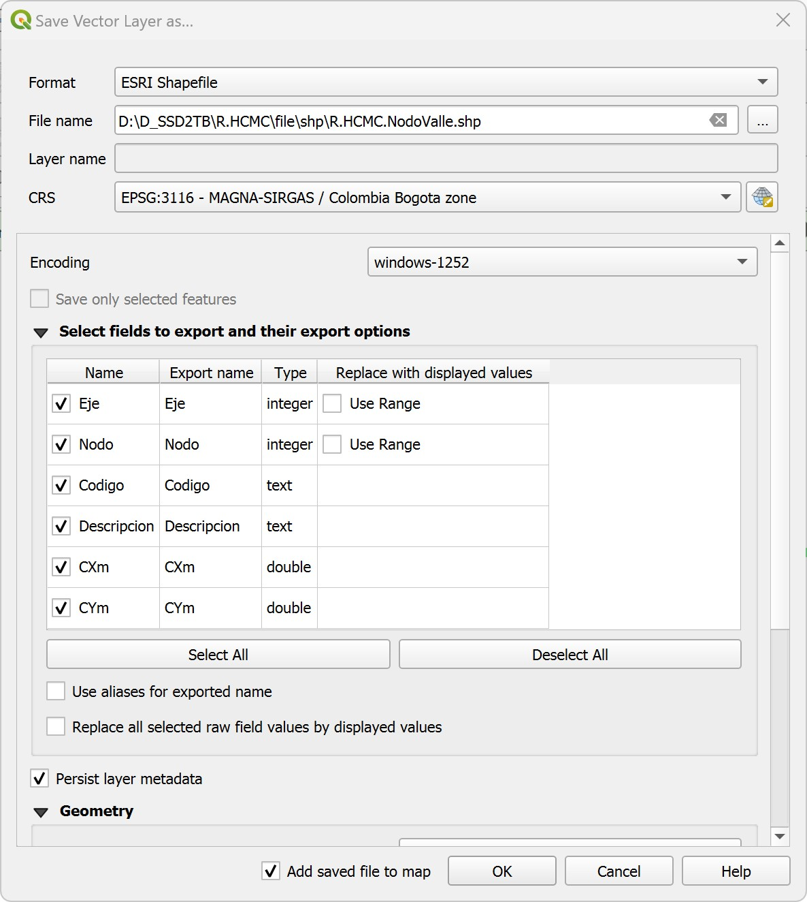
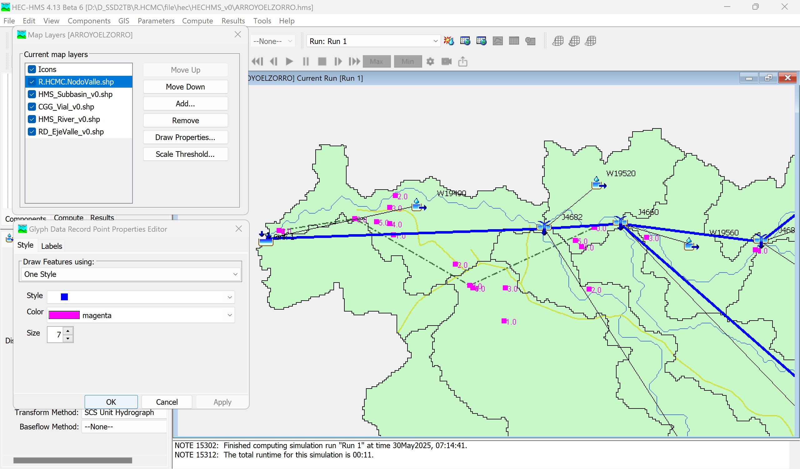
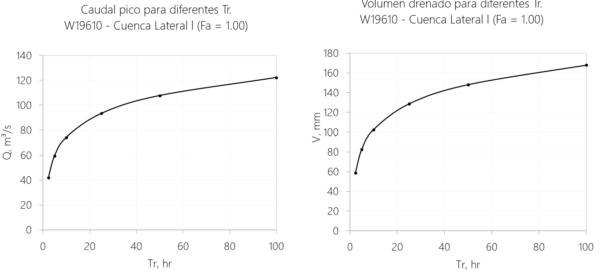
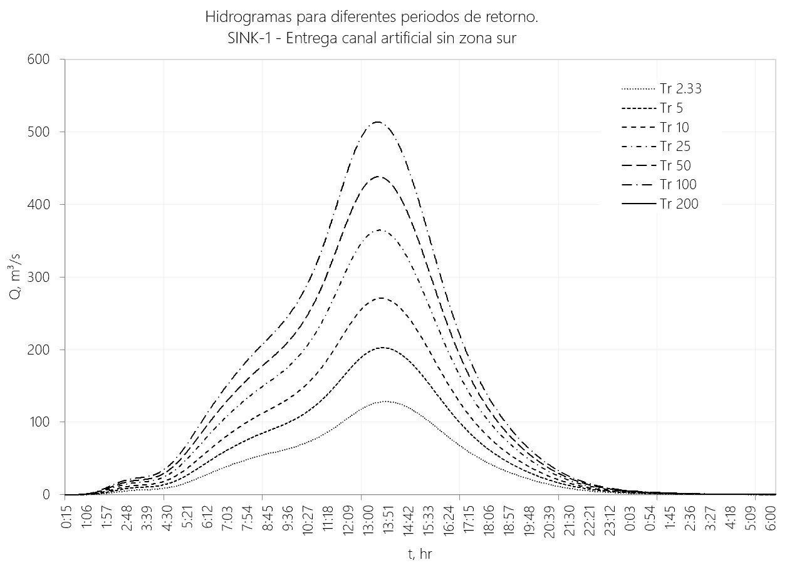

# 1.2. Modelación hidrológica para obtención de caudales de diseño e hidrogramas para tránsito de crecientes
Keywords: `hydrologic-model` `basin` `subbasin` `hec-hms` `hec-dssvue` `m01a02`

Obtener en función del área de aportación hasta los puntos de inicio, entrega, descarga de cauces laterales y para diferentes periodos de retorno, los caudales requeridos para el diseño hidráulico y geométrico, así como los hidrogramas para el tránsito hidráulico de crecientes por el canal artificial.

## Objetivos

* Explorar el modelo hidrológico e Identificar los puntos de estudio.
* Evaluar el área de aportación hasta cada punto de estudio.
* Estimar el factor de atenuación por área simultánea para cada punto.
* Importar a HEC-DSS, los hietogramas por sub-cuenca del modelo hidrológico.
* Estimar caudales pico en diferentes puntos de estudio y para diferentes periodos de retorno.
* Obtener y analizar los hidrogramas obtenidos para el tránsito de crecientes por el tramo de cauce diseñado y para las descargas laterales. 

## Requerimientos

Archivos, actividades previas, lecturas y herramientas requeridas para el desarrollo de esta actividad:

| Requerimiento                                                                                                                                                    | Descripción                                                                                                                                                                                                                                                                                    |
|:-----------------------------------------------------------------------------------------------------------------------------------------------------------------|:-----------------------------------------------------------------------------------------------------------------------------------------------------------------------------------------------------------------------------------------------------------------------------------------------|
| [:toolbox:Herramienta](https://www.microsoft.com/es/microsoft-365/excel?market=bz)                                                                               | Microsoft Excel .                                                                                                                                                                                                                                                                              |
| [:toolbox:Herramienta](https://notepad-plus-plus.org/)                                                                                                           | Notepad++.                                                                                                                                                                                                                                                                                     |
| [:toolbox:Herramienta](https://www.hec.usace.army.mil/software/hec-hms/)                                                                                         | HEC-HMS 4.13 Beta 6 o superior.                                                                                                                                                                                                                                                                |
| [:toolbox:Herramienta](https://www.hec.usace.army.mil/software/hec-dssvue/)                                                                                      | HEC-DSSVue 3.2.3 (versión funcional para cargue masivo de hietogramas).                                                                                                                                                                                                                        |
| [:notebook:Lectura](https://github.com/rcfdtools/R.HydroTools/blob/main/tool/FactorAtenuacionPrecipitacionFa/R.HydroTools.FactorAtenuacionPrecipitacionFa.pdf)   | Factor de atenuación hidrológica de la precipitación por área simultánea.                                                                                                                                                                                                                      |
| [:open_file_folder:R.HydroTools.FactorAtenuacion PrecipitacionFa.xlsx](https://github.com/rcfdtools/R.HydroTools/tree/main/tool/FactorAtenuacionPrecipitacionFa) | Libro de cálculo para la estimación del Fa - Factor de atenuación de la precipitación máxima por área simultánea en una cuenca.                                                                                                                                                                |
| [:open_file_folder:HECHMS_v0.zip](../../file/hec/HECHMS_v0.zip)                                                                                                  | Modelo hidrológico HEC-HMS con topología de áreas de drenaje de aproximadamente 4 km² o superior, compuesto por 44 subcuencas, 41 tramos de drenaje de 151.6 km (21 corresponden a tramos con tránsito hidrológico), área total de la cuenca en estudio: 247.1 km².                            |
| [:open_file_folder:Hietogramas](../../file/table/Hietogramas)                                                                                                    | Archivos con series de hietogramas para diferentes periodos de retorno y factores de atenuación (0.62, 0.63, 0.64, 1) en función de las áreas acumuladas hasta los puntos de inicio, entrega y cauces menores. Incluye hietogramas para periodos de retorno de 2.33, 5, 10, 25, 50 y 100 años. |
| [:open_file_folder:R.HCMC.PuntoEstudio.xlsx](../../file/table/R.HCMC.PuntoEstudio.xlsx)                                                                          | Puntos de estudio y factores de atenuación aplicados.                                                                                                                                                                                                                                          |
| [:open_file_folder:R.HCMC.NodoValle.xlsx](../../file/table/R.HCMC.NodoValle.xlsx)                                                                                | Puntos de localización para el trazado del valle compuesto por tramos rectos.                                                                                                                                                                                                                  |
| [:open_file_folder:R.HydroTools.Hidrograma RegVal.xlsm](https://github.com/rcfdtools/R.HydroTools/tree/main/tool/HidrogramaRegVal)                               | Libro de cálculo para el registro y validación de hidrogramas obtenidos a partir de modelación hidrológica en HEC-HMS.                                                                                                                                                                         |

> Para los diferentes avances de proyecto, es necesario guardar y publicar las diferentes versiones generadas del (los) libro (s) de Microsoft Excel y reportes o informes, agregando al final la fecha de control documental en formato aaaammdd, p. ej. _R.HydroTools.DisenoCaucesParametros.20250528.xlsx_.
>
> Nota: los datos hidroclimatológicos suministrados corresponden a información tomada y procesada a partir de datos del IDEAM  y los archivos de formas vectoriales han sido descargados del IGAC y de otras fuentes alternas.

## Conceptos generales y configuración preliminar

### ¿Qué es y para qué sirve un modelo hidrológico?

Es la abstracción o representación del ciclo hidrológico y sus fenómenos asociados, en un prototipo o modelo abstracto simplificado de un evento particular y/o computacional continuo (un modelo es continuo cuando se obtienen múltiples o una serie de resultados instantáneos en un intervalo de tiempo determinado) que sirve para estudiar la interacción de sus principales características y cuyo propósito general es estudiar la escorrentía y caudal producido por la lluvia de una tormenta.

Existen diversas metodologías que dependen de diferentes parámetros y supuestos. Como mínimo se debe estimar el total de lluvia que se puede convertir en escorrentía (lluvia total menos pérdidas y abstracciones), la transformación de la lluvia en escorrentía y el tránsito hidrológico de la escorrentía a través de los cauces.

Para el desarrollo del proyecto utilizaremos:

* Pérdidas de lluvia: Número de curva del [Soil Conservation Service - SCS](http://www.nrcs.usda.gov/) ó CN.
* Transformación de lluvia en escorrentía: Hidrograma unitario del SCS.
* Tránsito hidrológico: Muskingum.

### ¿Qué es y para qué sirve el factor de atenuación por área?

Es un valor numérico adimensional (entre 0 y 1) que multiplica la lluvia total máxima en 24 horas, estimada para cada subcuenca o sus pulsos equivalentes (del hietograma) en función del área de aportación y solo es válido en un punto de estudio determinado. 

Sirve para ajustar o atenuar el valor total de lluvia (mm) máxima, suponiendo que a mayor área acumulada existe menor probabilidad de que simultáneamente llueva sobre toda la cuenca.

El factor de atenuación es inversamente proporcional al área acumulada de la cuenca hasta un determinado punto de estudio. A mayor área acumulada, menor factor y por ende menor precipitación máxima simultánea.

Luego de la modelación o tránsito hidrológico, los valores de caudal pico e hietogramas, solo serán válidos para el punto en estudio.

Para subcuencas pequeñas (menores o iguales a 25 km²) en cauces laterales al río artificial a diseñar, puede suponer que el centro de tormenta cubre toda esta área y por consiguiente el factor multiplicador será de 1.

**Regresiones potenciales - California montañoso** y = a * xb

(3 horas)   y = 2.7388464183 * x -0.2942893251 
(6 horas)   y = 2.4215269794 * x -0.2568171459 
(9 horas)   y = 2.1659921609 * x -0.2239811195 

### Configuración regional del sistema operativo

Antes de abrir el modelo hidrológico suministrado, verifique que el sistema de unidades de su sistema operativo esté configurado con la notación del sistema inglés. En Microsoft Windows ir a Panel de Control / Región / Configuración Adicional y establecer:

* Separador decimal: Punto (.)
* Símbolo de agrupación de miles: Coma (,)
* Separador de listas: Coma (,)

> Nota: recuerde que las herramientas HEC utilizan esta notación y a pesar de que se puede predefinir el sistema internacional de unidades, internamente el núcleo de cálculo realiza las operaciones en sistema inglés.

## Procedimiento general

### 1. Exploración del modelo

Abra el modelo hidrológico HEC-HMS suministrado e identifique: drenajes, subcuencas, esquematización simplificada en nodos y líneas, el eje de valle del cauce a diseñar, consulte los parámetros:

* Área de subcuencas (km²)
* Área total cuenca (km²)
* Área acumulada hasta el nodo superior más cercano al punto de inicio del eje de valle
* Número de Curva SCS asociado a cada subcuenca.
* Tiempo de retardo o LagTime (min) asociado a cada subcuenca.
* Parámetros de tránsito hidrológico para Muskingum, K (hr), X, número de tramos.

> Geográficamente, se muestran las sub-cuencas localizadas al sur-oeste del eje del valle, pero para el tránsito hidrológico no se considerará la escorrentía producida por estas áreas debido a que el análisis hidrológico corresponde al tránsito hasta el punto de entrega del canal a diseñar y este se encuentra arriba del punto de confluencia de estos drenajes. Total área geográfica incluyendo las cuencas al sur: 262.3 km².

Modelo topológico de subcuenca 

Área por subcuenca 

Pérdidas / Número de curva CN del SCS por subcuenca 

Transformación / Hidrograma unitario del SCS por subcuenca 

Tránsito hidrológico / Muskingum por drenaje 

### 2. Identificación de puntos y área de estudio

Identifique los nodos correspondientes al inicio, entrega del eje de valle, cauce lateral y subcuenca lateral, verifique:

* Código del nodo
* Área total acumulada hasta cada punto (km²)
* Estime el Factor de Atenuación por área correspondiente a cada área acumulada hasta los puntos de estudio. (utilizar la información correspondiente a California Montañoso para lluvias con duración igual o equivalente a 9 horas)
* Identifique la cuenca o cuencas correspondientes al cauce lateral que drenará sus aguas al canal a diseñar y establezca el factor de atenuación. Suponga que el centro de tormenta cubre toda esta cuenca menor.

En la barra de ejecución, seleccione _Run: Run 1_, consulte los resultados actuales del modelo y verifique las áreas acumuladas hasta los diferentes nodos cercanos al eje de realineamiento y cuencas laterales, para el caso de estudio corresponden a los nodos J4660, J4682, Sink-1 y subcuenca W19610.

Tránsito hidrológico / Muskingum por drenaje 

| Localización | Descripción                                 |          Área acumulada (km²)          | Factor de atenuación - Fa |
|:------------:|:--------------------------------------------|:--------------------------------------:|:-------------------------:|
|    J4660     | Inicio realineamiento                       |                 225.4                  |           0.64            |
|    J4682     | Entrega cauce lateral                       |                 243.1                  |           0.63            |
|    Sink-1    | Fin realineamiento                          | 247.1 sin considerar área sur-oeste |           0.63            |
|    Sink-1    | Fin realineamiento                          |  263.2 considerando área sur-oeste  |           0.62            |
|    W19610    | Subcuenca lateral, entrega en nodo J4682 |                 15.195                 |           1.00            |

### 3. Nodos de proyecto

Para su proyecto, cargue en QGIS la tabla de nodos [R.HCMC.NodoValle.xlsx](../../file/table/R.HCMC.NodoValle.xlsx) y convierta a una capa geográfica de puntos en formato shapefile, las localizaciones específicas de los nodos de su proyecto.

Cree un proyecto nuevo en QGIS y asigne el sistema de proyección de coordenadas - CRS 3116 correspondiente a MAGNA-SIRGAS / Colombia Bogota zone.

Desde el panel _Browser_, agregue al proyecto la hoja _NodoEjeValleGIS_ del libro de Excel y visualice la tabla de atributos.

Desde en panel _Layers_ y dando clic derecho en el nombre de la tabla _NodoEjeValleGIS_, seleccione la opción _Export / Save Vector Layer as..._, en formato establezca _Comma Separated Value (CSV)_ y guarde como _file/table/R.HCMC.NodoValle.csv_. Utilice el encoding _windows-1252_.

Desde el menú _Layer / Add Layer / Add Delimited Text Layer..._, agregue la tabla exportada en formato csv y conviértala a una capa geográfica de puntos, guardar como _file/shp/R.HCMC.NodoValle.shp_

Simbolice los nodos por categorías a partir del código del eje y rotule con la expresión  `"Eje"  || '-'  ||   "Nodo" `

Desde en panel _Layers_ y dando clic derecho en el nombre de la capa geográfica temporal _R.HCMC.NodoValle_, seleccione la opción _Export / Save Vector Layer as..._, en formato establezca _ESRI Shapefile_ y guarde como _file/shp/R.HCMC.NodoValle.shp_. Utilice el encoding _windows-1252_, simbolice y rotule.

> :bulb: Para facilitar la identificación de los nodos en HEC-HMS, antes de exportar puede filtrar los nodos específicos de su proyecto.

En el proyecto HEC-HMS, de clic derecho en cualquier área vacía del mapa y seleccione la opción _Map Layers..._, utilizando el botón _Add..._ agregue la capa de nodos creada y rotule a partir del código del eje.

> Identifique los nodos correspondientes a su eje de proyecto y los nodos y cuencas del modelo hidrológico que serán intervenidas con el trazado.

### 4. Importación de hietogramas

Para la ejecución del modelo hidrológico, se han suministrado hietogramas con duración de 9 horas de lluvia para los factores de atenuación por área: 0.62, 0.63, 0.64 y 1. Cada factor está compuesto de hietogramas para los periodos de retorno (años): 2.33, 5, 10, 25, 50 y 100.

> Tenga en cuenta que para su proyecto, deberá generar los hietogramas requeridos para los demás factores de atenuación requeridos.

Cierre HEC-HMS, abra HEC-DSS Vue 3.2.3 y abra el archivo denominado ARROYOELZORRO.dss

Seleccione uno de los registros disponibles y presione las teclas <kbd>ctrl</kbd>-<kbd>a</kbd> para seleccionar todos los registros. Elimine todos los registros existentes utilizando la tecla <kbd>delete</kbd> y seleccione la opción _Yes_.

> Tenga en cuenta que antes de importar un nuevo archivo de datos, deberá eliminar todos los registros existentes en la base de datos HEC-DSS y luego purgar la base de datos mediante la opción Tools – Squeeze.

Desde el menú _Data Entry / Import / Time Series Data_, importe el archivo de hietogramas _file/table/hietogramas/9H_ANTR_FSVarios.csv_. Siga las instrucciones del tutor o consulte el manual de usuario mediante la tecla F1 (Data Entry – Import – Time Series Data).

> En la importación es necesario definir la fila de unidades, las columnas de fecha y hora, los apuntadores de fila A,B,C,F y definir en tipos de datos PER-CUM correspondiente a pulsos de lluvia no acumulados.

Seleccione y visualice la gráfica de algunos de los hietogramas importados.

Los nombres o etiquetas de marcado de los hietogramas indicados en la Parte F de los registros de HEC-DSS, corresponden a:

| Etiqueta - Parte F   | Factor de atenuación -  Fa  | Periodo de retorno - Tr  |
|:---------------------|:---------------------------:|:------------------------:|
| PMAX24H_FSCALIF_1    |              1              |         PMax24h          |
| P_TR2.33_FSCALIF_1   |              1              |           2.33           |
| P_TR5_FSCALIF_1      |              1              |            5             |
| P_TR10_FSCALIF_1     |              1              |            10            |
| P_TR25_FSCALIF_1     |              1              |            25            |
| P_TR50_FSCALIF_1     |              1              |            50            |
| P_TR100_FSCALIF_1    |              1              |           100            |
| PMAX24H_FSCALIF_062  |            0.62             |         PMax24h          |
| P_TR2.33_FSCALIF_062 |            0.62             |           2.33           |
| P_TR5_FSCALIF_062    |            0.62             |            5             |
| P_TR10_FSCALIF_062   |            0.62             |            10            |
| P_TR25_FSCALIF_062   |            0.62             |            25            |
| P_TR50_FSCALIF_062   |            0.62             |            50            |
| P_TR100_FSCALIF_062  |            0.62             |           100            |
| PMAX24H_FSCALIF_063  |            0.63             |         PMax24h          |
| P_TR2.33_FSCALIF_063 |            0.63             |           2.33           |
| P_TR5_FSCALIF_063    |            0.63             |            5             |
| P_TR10_FSCALIF_063   |            0.63             |            10            |
| P_TR25_FSCALIF_063   |            0.63             |            25            |
| P_TR50_FSCALIF_063   |            0.63             |            50            |
| P_TR100_FSCALIF_063  |            0.63             |           100            |
| PMAX24H_FSCALIF_064  |            0.64             |         PMax24h          |
| P_TR2.33_FSCALIF_064 |            0.64             |           2.33           |
| P_TR5_FSCALIF_064    |            0.64             |            5             |
| P_TR10_FSCALIF_064   |            0.64             |            10            |
| P_TR25_FSCALIF_064   |            0.64             |            25            |
| P_TR50_FSCALIF_064   |            0.64             |            50            |
| P_TR100_FSCALIF_064  |            0.64             |           100            |

### 5. Definición de lluvias por periodo de retorno Tr y factor de atenuación en HEC-HMS

Cierre HEC-DSS y a continuación edite el archivo HEC-HMS denominado _ARROYOELZORRO.gage_ correspondiente a la identificación de los hietogramas y ruta a los datos importados en la base de datos HEC-DSS, se recomienda utilizar el editor de texto Notepad++ para no alterar la codificación de texto del archivo.

> Durante la modificación del archivo _ARROYOELZORRO.gage_, se recomienda mantener cerrado el HEC-HMS debido a que la codificación del archivo puede ser alterada y la posterior ejecución del modelo hidrológico podrá presentar errores.

Reemplace la actual parte F de la cadena DSS Pathname por el valor P_TR2.33_FSCALIF_064, guarde y cierre el archivo. La notación general obedece a rutas o partes identificadas internamente por HEC-DSS con las letras A,B,C,D,E,F.

En los archivos de hietogramas suministrados, se han identificado los diferentes periodos de retorno con los prefijos:

* P_TR2.33_FSCALIF_###
* P_TR5_FSCALIF_###
* P_TR25_FSCALIF_###
* P_TR50_FSCALIF_###
* P_TR100_FSCALIF_###

> Reemplazar ### for el valor del factor de atenuación requerido en la modelación.

Una vez reemplace las etiquetas de hietograma contenidos en la Parte F, guarde y cierre el editor de texto Notepad++.

> Una vez realice la modelación para el periodo de retorno y factor de atenuación requerido, deberá repetir este procedimiento para los demás puntos de estudio a evaluar.

Abra HEC-HMS y verifique desde _Time-Series Data_, que los hietogramas por subcuenca se visualicen correctamente para el periodo de retorno y factor de atenuación establecido.

### 6. Modelación hidrológica

En HEC-HMS, verifique que las especificaciones de control sean consistentes con las fechas y horas de inicio y finalización de los hietogramas suministrados. 

> Tenga en cuenta que las especificaciones de control del modelo hidrológico en HEC-HMS, deberán corresponder a las fechas y horas de inicio y finalización de los hietogramas suministrados, correspondientes del 05Mar2016 al 08Mar2016.

Desde la pestaña de ejecución, seleccione Run 1 y ejecute el modelo. Verifique las advertencias mostradas en la ventana de mensajes ubicada en la parte inferior. En caso de error consulte con el tutor o resuelva uno a uno los errores reportados.

### 7. Análisis y registro de resultados

En HEC-HMS, seleccione el nodo J4660 correspondiente al punto de inicio del realineamiento y cuyo factor de atenuación Fa es 0.64, 

Para el nodo J4660 (correspondiente al punto de inicio del realineamiento), desde la barra de ejecución, consulte:

* Resumen de cálculo: área de drenaje (km²), caudal pico descargado (m³/s), tiempo al pico (fecha y hora) y volumen drenado o laminado de lluvia (mm).
* Gráfico de Hidrograma obtenido.

> :fire:Atención: recuerde que los resultados obtenidos únicamente son válidos para este nodo debido a que los hietogramas fueron ajustados con el factor de atenuación correspondiente a 0.64.

En la gráfica del hidrograma obtenido se encuentran diferentes curvas que corresponden a hietogramas convertidos en hidrogramas, hidrogramas transitados y el hidrograma total correspondiente a la suma de los anteriores.

**Resultados**: en el punto de inicio de realineamiento correspondiente al nodo J4660 cuya área de drenaje es de 225.36 km², se obtuvo un caudal de 130 m³/s para el periodo de retorno de 2.33 años. En total se drenaron 15.33 mm de escorrentía por toda la cuenca hasta este punto.

Para el nodo J4660, consulte además la tabla de resultados con la serie de datos continua que contiene los hidrogramas.

En el libro de Microsoft Excel [:open_file_folder:R.HydroTools.Hidrograma RegVal.xlsm](https://github.com/rcfdtools/R.HydroTools/tree/main/tool/HidrogramaRegVal), registre para el punto estudiado, la columna Outflow (m³/s) correspondiente al caudal total calculado.

Repita el procedimiento anterior, modificando en el archivo ARROYOELZORRO.gage, la etiqueta Parte F de los hietogramas (que contienen el periodo de retorno y el factor de atenuación) y obtenga uno a uno los hidrogramas y resultados para los demás periodos de retorno 5, 10, 25, 50 y 100 años.

> Recuerde que los caudales pico y los hidrogramas serán utilizados para el diseño y modelación en flujo no permanente.

Finalmente, ejecute el procedimiento anteriormente descrito para los demás puntos de estudio y cuencas laterales y almacene los resultados en el libro de hidrogramas. Grafique Tr vs Qmáx, Tr vs Volumen drenado y los hidrogramas, verifique que los datos obtenidos sonea consistentes y correctos.

> Tenga en cuenta que es necesario estimar el caudal pico y el hidrograma de las cuencas laterales aplicando el factor de atenuación compuesto hasta el punto de descarga en el cauce principal y el factor propio de cada cuenca. El factor compuesto será utilizado en la modelación hidráulica del cauce principal y el factor propio de la subcuenca lateral para el diseño de las estructuras hidráulicas de entrega al cauce principal de realineamiento.

#### Nodo J4660 - Inicio realineamiento

#### Nodo J4682 - Entrega cauce lateral 1

#### Subbasin W19610 - Subcuenca lateral - Fa = 1.00

Caudales pico e hidrogramas requeridos para el diseño de estructuras de entrega en cauce lateral.

#### Subbasin W19610 - Subcuenca lateral - Fa = 0.63

Caudales pico e hidrogramas requeridos para modelación del cauce principal y descarga simultánea del cauce lateral.

#### Nodo Sink-1 - Entrega realineamiento

#### Resumen de resultados obtenidos

### Caudal medio de largo plazo - Qm

Para la estimación de caudales medios se requiere del análisis previo de las condiciones de la precipitación media, utilizando para ello los registros de las estaciones de la zona de estudio o de una grilla interpolada con los valores medios.

Elementos requeridos para el balance hidrológico

* Grilla de evaporación
* Grilla de precipitación media
* Cuencas agregadas: hasta nodo J4660, hasta nodo J4682, cuenca lateral W19610, hasta nodo Sink-1

Para la estimación de caudales medios se realiza un balance hidrológico de largo plazo en cada una de las celdas que cubre la zona de estudio. La siguiente expresión permite determinar el caudal medio en cada celda en el que, al valor estimado de precipitación por celda, se le resta la abstracción correspondiente a la evapotranspiración real.

 Q = ( ( P – EVT ) * A ) / t

* Q: Caudal medio en m³/s
* P: Precipitación en mm/año
* EVT: Evapotranspiración real en mm-año
* A: Área ejemplo de cada celda (27,7778m x 27,7778m = 771,60617284m²)
* t: 31.536.000.000 segundos en un año (365dias x 24horas x 60minutos x 60segundos)

## Actividades de proyecto :triangular_ruler:

En la siguiente tabla se listan las actividades que deben ser desarrolladas y documentadas por cada estudiante o grupo de proyecto.

| Actividad | Alcance                                                                                                                                                                                                                                                                                                                                                                                                                                                                                                                                              |
|:----------|:-----------------------------------------------------------------------------------------------------------------------------------------------------------------------------------------------------------------------------------------------------------------------------------------------------------------------------------------------------------------------------------------------------------------------------------------------------------------------------------------------------------------------------------------------------|
| M01A02    | Descargar el archivo [R.HydroTools.DisenoCaucesParametros.xlsx](https://github.com/rcfdtools/R.HydroTools/blob/main/tool/DisenoCaucesParametros/R.HydroTools.DisenoCaucesParametros.xlsx) disponible en GitHub, e incluirlo en el repositorio.                                                                                                                                                                                                                                                                                                       | 
| M01A02    | Investigar, verificar y registrar en el libro de Excel, los parámetros técnicos, hidráulicos e hidrológicos indicados en esta actividad.  Para el grupo de parámetros normativos, ambientales / sociales y territoriales, revisar los parámetros actualmente reportados, investigar, registrar y actualizar.                                                                                                                                                                                                                                   | 
| M01A02    | En una tabla y al final del informe de avance de esta entrega, indique el detalle de las actividades realizadas por cada integrante de su grupo; utilice las siguientes columnas: `Nombre del integrante`, `Actividades realizadas`, `Tiempo dedicado en horas` (si presenta la entrega individualmente, no es necesaria la presentación de esta tabla).  Para actividades que no requieren del desarrollo de elementos de avance, indicar si realizo la lectura de la guía de clase y las lecturas indicadas al inicio en los requerimientos. | 

> :blue_heart: Una vez el instructor realice la revisión y el estudiante presente las correcciones o ajustes solicitados, será necesario cargar una nueva versión de los archivos en el repositorio del proyecto, incluyendo o actualizando al final del nombre del archivo, la fecha de presentación en formato aaaammdd y manteniendo las versiones anteriores presentadas.

## Referencias

* 

## Control de versiones

| Versión    | Descripción        | Autor                                      | Horas |
|------------|:-------------------|--------------------------------------------|:-----:|
| 2024.02.24 | Migración a GitHub | [rcfdtools](https://github.com/rcfdtools)  |   8   |
| 2014.01.11 | Versión inicial.   | [rcfdtools](https://github.com/rcfdtools)  |  18   |

##

_R.HCMC es de uso libre para fines académicos, conoce nuestra licencia, cláusulas, condiciones de uso y como referenciar los contenidos publicados en este repositorio, dando [clic aquí](../../LICENSE.md)._

_¡Encontraste útil este repositorio!, apoya su difusión marcando este repositorio con una ⭐ o síguenos dando clic en el botón Follow de [rcfdtools](https://github.com/rcfdtools) en GitHub._

| [:arrow_backward: Anterior](../M01A01/Readme.md) | [:house: Inicio](../../README.md) | [:beginner: Ayuda / Colabora](https://github.com/rcfdtools/R.SIGE/discussions/99999) | [Siguiente :arrow_forward:](../M01A03/Readme.md) |
|--------------------------------------------------|-----------------------------------|--------------------------------------------------------------------------------------|--------------------------------------------------|

[^1]: 