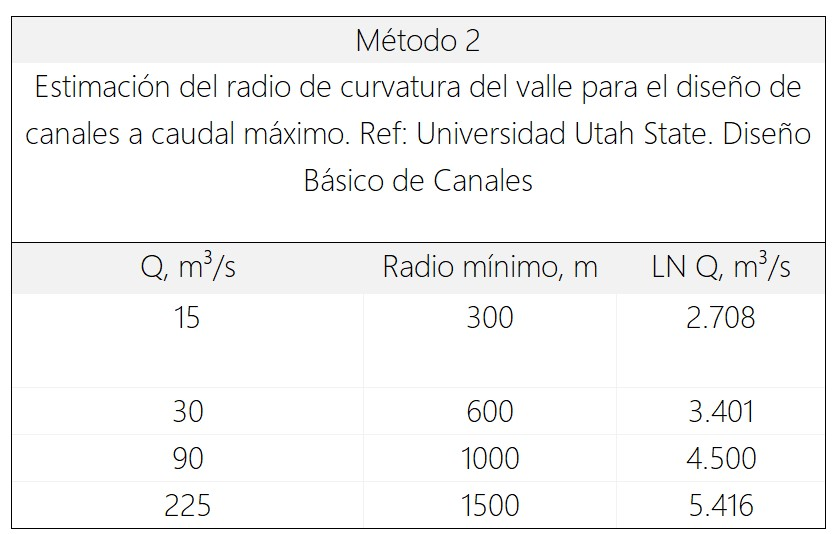
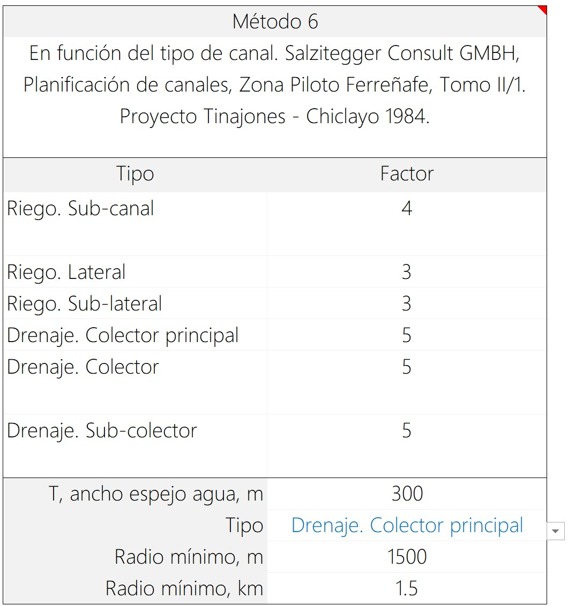
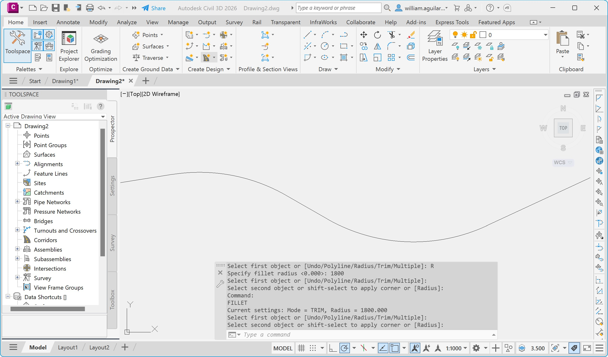

# 3. Trazado del eje de valle y estimación de radios de curvatura para suavizado
Keywords: `realigment` `curvature-ratio` `clothoid` `m01a03`

Establecer los puntos para el trazado del eje de valle y estimar los radios de curvatura que permitan trazar el corredor del alineamiento del valle suavizado requerido para el diseño sinuoso.

Existen diversas metodologías para estimar la curvatura de suavizado del eje recto del valle. El suavizado tiene como propósito garantizar un adecuado cambio de dirección en el río que permita el flujo o tránsito de las crecientes de forma segura y evitando en lo posible, turbulencias, oleaje y zonas susceptibles a procesos erosivos y/o de depositación de sedimentos, buscando de mantener velocidad constante en el flujo.

<div align="center"></div>


## Objetivos

* Localizar los puntos fijos de inicio, entrega o cambio de dirección que definirán el trazado del eje recto del valle.
* Trazar el eje recto del valle.
* Estimar el radio de curvatura para el suavizado del valle.
* Trazar el eje curvo suavizado o clotoide de valle utilizando diferentes métodos y herramientas.
* Comparar los ejes suavizados obtenidos.
* Estudiar los elementos que componen una clotoide.


## Requerimientos

Archivos, actividades previas, lecturas y herramientas requeridas para el desarrollo de esta actividad:

<div align="center">

| Requerimiento                                                                                                                            | Descripción                                                                                            |
|:-----------------------------------------------------------------------------------------------------------------------------------------|:-------------------------------------------------------------------------------------------------------|
| [:toolbox:Herramienta](https://www.microsoft.com/es/microsoft-365/excel?market=bz)                                                       | Microsoft Excel 365.                                                                                   |
| [:toolbox:Herramienta](https://qgis.org/)                                                                                                | QGIS 3.42 o superior.                                                    |
| [:toolbox:Herramienta](https://www.autodesk.com/products/civil-3d)                                                                       | Autodesk Civil 3D 2025 o superior.                                       |
| [:open_file_folder:R.HCMC.NodoValle.xlsx](../../file/table/R.HCMC.NodoValle.xlsx)                                                        | Puntos de localización para el trazado del valle compuesto por tramos rectos.                                                                                                                                                                                                                  |
| [:round_pushpin:R.HCMC.NodoValle.shp](../../file/shp/R.HCMC.NodoValle.zip)                                                               | Capa de nodos eje valle recto (creada en actividad anterior).                                          |
| [:open_file_folder:R.HydroTools. RadioCurvaturaValle.xlsx](https://github.com/rcfdtools/R.HydroTools/tree/main/tool/RadioCurvaturaValle) | Libro de cálculo para la Estimación del radio de curvatura para el suavizado del valle en canales, Rc. |

</div>

> Para los diferentes avances de proyecto, es necesario guardar y publicar las diferentes versiones generadas del (los) libro (s) de Microsoft Excel y reportes o informes, agregando al final la fecha de control documental en formato aaaammdd, p. ej. _R.HydroTools.DisenoCaucesParametros.20250528.xlsx_.


## 0. Conceptos generales

### Consideraciones generales para el trazado del eje de valle

Generalmente, el alineamiento, ancho y suavizado del valle está condicionado por múltiples restricciones.

| Condición o restricción   | Descripción                                                                                                                                                                                                                                                               |
|:--------------------------|:--------------------------------------------------------------------------------------------------------------------------------------------------------------------------------------------------------------------------------------------------------------------------|
| Topográfica               | Zonas con bajos que impiden que el canal se trace en corte o zonas que hidráulicamente drenan hacia otras cuencas.                                                                                                                                                        |
| Geotécnica                | Fallas, afloramientos rocosos, acuíferos.                                                                                                                                                                                                                                 |
| Eco-ambiental             | Fauna y flora nativa en suelos de protección. Corredor para el transito de especies endémicas protegidas.                                                                                                                                                                 |
| Infraestructura existente | Instalaciones, vías, canales, tanques, bocatomas, asentamientos humanos.                                                                                                                                                                                                  |
| Territorial               | Incompatibilidad con los usos del suelo definidos en los POT, rondas de protección, zonas declararas de interés histórico. Resguardos indígenas y asentamientos de comunidades protegidas. Zonas agropecuarias productivas con puntos de agua superficial concesionada. |


### Métodos incluidos

| Método                                                                                          | Descripción                                                                                                                                                                                                                                                                                                                                                   |
|:------------------------------------------------------------------------------------------------|:--------------------------------------------------------------------------------------------------------------------------------------------------------------------------------------------------------------------------------------------------------------------------------------------------------------------------------------------------------------|
| 1. Manual de procedimientos de pequeños sistemas de riego                                       | Estimación del radio de curvatura del valle para el diseño de canales a caudal máximo. Ref: Manual de procedimientos de pequeños sistemas de riego. Rango de caudales entre 0.5 y 20 m³/s.                                                                                                                                                                    |                                                                                                                                                                    
| 2. Universidad Utah State. Diseño Básico de Canales                                             | Estimación del radio de curvatura del valle para el diseño de canales a caudal máximo. Ref: Universidad Utah State. Diseño Básico de Canales. Rango de caudales entre 15 y 225 m³/s.                                                                                                                                                                          |                                                                                                                                                                          
| 3. En función del tipo de régimen. Subcrítico y Supercrítico                                    | Esta metodología no tiene en cuenta directamente el total caudal transportado por el valle y cauce dominante sino parámetros en función del régimen de flujo. Parámetros de entrada, profundidad del flujo y, velocidad V, ancho superficial T.                                                                                                               |                                                                                                               
| 4. Por factor multiplicador en función del caudal y la base (Wageningen, The Netherlands. 1978) | Estimación del radio de curvatura del valle para el diseño de canales a caudal máximo. Ref: "International Institute For Land Reclamation And Improvement" ILRI, Principios y Aplicaciones del Drenaje, Tomo IV, Wageningen The Netherlands 1978. Rango de caudales mínimos entre 0 y 17 m³/s. Rango de caudales máximos entre 10 y hasta mayores de 20 m³/s. | 
| 5. Por factor multiplicador en función del ancho (Urban Storm Drainage Criteria Manual )        | Estimación del radio de curvatura del valle para el diseño de canales. Ref:  Urban Drainage and Flood Control District. Urban Storm Drainage Criteria Manual Volume 1. Chapter 08 Open Channels, numeral 5.4, el radio de curvatura debe estar entre 3 o 4 veces el ancho superior del canal. Se estima en función del ancho superficial T.                   |                   
| 6. En función del tipo de canal. Salzitegger                                                    | Salzitegger Consult GMBH, Planificación de canales, Zona Piloto Ferreñafe, Tomo II/1. Proyecto Tinajones - Chiclayo 1984. En función del ancho superficial T y el tipo de drenaje o canal.                                                                                                                                                                    |

## 1. Estimación de radios de curvatura

1. En los parámetros de entrada del Método 1 correspondiente al Manual de procedimientos de pequeños sistemas de riego, ingrese el caudal de diseño para la estimación del radio de curvatura del valle, tenga en cuenca que el caudal ingresado deberá corresponder al mayor valor obtenido para el periodo de retorno del valle en cada uno los puntos de estudio localizados a lo largo del valle. Para el caso de estudio, utilizaremos un caudal de diseño de 522.1 m³/s correspondiente al periodo de retorno de 100 años, obtendrá un radio estimado de 2500 metros. 

> Debido a que esta metodología es aplicable a caudales en rangos entre 5 y 100 m³/s, no se recomienda utilizar el radio estimado.

<div align="center"></div>
<div align="center"></div>

2. El método 2, correspondiente al Diseño Básico de Canales de la Universidad Utah State, calcula automáticamente el radio de curvatura en función del caudal ingresado previamente, obtendra un radio estimado de 1825 metros.

<div align="center"></div>
<div align="center"></div>
<div align="center"></div>
<div align="center"></div>

3. En los parámetros de entrada del Método 3 correspondiente al cálculo de curvatura en función del régimen del flujo, ingrese los valores correspondientes a la profundidad del flujo, velocidad media en el canal y ancho superficial inundable del valle. Para el caso de estudio utilizaremos como referencia un canal de sección compuesta con altura de sección de 3 metros (menos 0.4 metros de borde libre), velocidad máxima de diseño en valle de 3 m/s y ancho superficial de 300 metros en el valle, obteniendo para régimen subcrítico un radio de 900 metros y para supercrítico de 424 metros.

<div align="center"></div>

4. En los parámetros de entrada del Método 4 por factor multiplicador en función del caudal y la base (Wageningen, The Netherlands. 1978), ingresar el ancho en la base de la sección del canal en valle, para el caso de estudio utilizaremos como referencia un valle de 240 metros que combinado con el caudal ingresado de diseño, permite establecer un radio de 1680 metros.

<div align="center"></div>

5. El método 5 por factor multiplicador en función del ancho (Urban Storm Drainage Criteria Manual), calcula automáticamente el radio de curvatura en función del caudal ingresado previamente, obtendra un radio estimado de 1200 metros.

<div align="center"></div>

6. En los parámetros de entrada del Método 6 en función del tipo de canal (Salzitegger), seleccione el tipo de canal a diseñar, para el caso de estudio utilizaremos _Drenaje - Colector principal_, obteniendo un radio de curvatura de 1500 metros.

<div align="center"></div>

7. Compare los resultados obtenidos, defina y justifique textualmente el radio de curvatura a utilizar en su proyecto.

<div align="center"></div>
<div align="center"></div>
<div align="center"></div>

Para el caso de estudio, se selecciona el Método 2. Universidad Utah State / Diseño Básico de Canales, con un radio redondeado a 1800 metros debido a que tiene en cuenta un amplio rango de caudales que al ser ajustados a una curva logarítmica ofrecen un ajuste adecuado para su estimación.


## 2. Nodos del eje recto y trazado del alineamiento recto central del valle

1. En QGIS, cargue los archivos shapefile _HMS_Subbasin_v0_, _HMS_River_v0_, _CGG_Vial_v0_ contenidos dentro del modelo hidrológico en la ruta [/file/hec/HECHMS_v0](../../file/hec/) y la capa de nodos [/file/shp/R.HCMC.NodoValle.shp](../../file/shp/R.HCMC.NodoValle.zip) generada en la actividad anterior.

<div align="center"></div>

2. Utilizando la herramienta _Vector creation / Points to path_, cree el eje del valle con el nombre de capa _/file/shp/RD_EjeValle_v0.shp_. Rotule los nodos a partir del código del eje.

<div align="center"></div>
<div align="center"></div>

3. Desde Layer _Properties / Source / Query Builder_, filtre los nodos y el eje de su proyecto.

<div align="center"></div>
<div align="center"></div>

> :fire: Atención: los nodos y ejes mostrados en la ilustración no son los mismos nodos a utilizar en el proyecto final, consulte con el instructor los nodos a utilizar.


## 3. Curva clotoide en QGIS

QGIS dispone de herramientas de digitalización básica y avanzada CAD, sin embargo, la creación de curvas es generada a partir de segmentos rectos sin inclusión de nodos complementarios en intersecciones. Para el desarrollo de este ejemplo utilizaremos el procedimiento genérico de construcción de clotoides, correspondiente a la creación de arcos circulares y segmentos rectos de entre tangencia.

1. Desde el panel lateral _Browser_, cree en la carpeta _/file/shp/_ una capa geográfica de líneas en formato shapefile y guarde como _RD_EjeValleSuavizado_QGIS.shp_, utilize el CRS 3116 y cree un campo de atributos numérico doble con el nombre `CurvRatio` y agregue al mapa.

<div align="center"></div>

> Para facilitar la edición y visualización de la clotoide, agregue el mapa base de Google Satellite desde el conector https://mt1.google.com/vt/lyrs=s&x={x}&y={y}&z={z}.

2. En el panel Layers, seleccione la capa _RD_EjeValleSuavizado_QGIS_ y de clic en el botón de edición de capa, luego seleccione la opción _Add Line Feature_ y _Digitize Shape_; podrá observar que se han activado diferentes herramientas asociadas a formas geométricas.

<div align="center"></div>

3. En la barra _Shape Digitizing Toolbar_, seleccione la herramienta de creación de círculos _Circle from 2 tangents and a point_, luego en la barra de encajado o _Snapping Toolbar_, defina ajuste por segmento y tolerancias en 5 píxeles.

<div align="center"></div>

3. Digitalice dos circunferencias tangentes con radio de curvatura 1800m entre los nodos 1-2-3 y 2-3-4.

> Para terminar la creación de cada círculo tangente de clic derecho en cualquier lugar del mapa y complete el atributo _CurvRatio_.

<div align="center"></div>

4. Utilizando la herramienta _Split_, fraccione las circunferencias creadas y conserve solo los arcos circulares próximos al eje. Primero, seleccione una de las circunferencias, luego la herramienta _Split Features_ y el nodo central o más próximo a la tangencia del valle.

> Recuerde que QGIS crea subtramos rectos de dibujo y no arcos circulares.

<div align="center"></div>
<div align="center"></div>

5. Utilizando las herramientas de dibujo y el encajado por nodos y vertices, complete la digitalización de tramos rectos y entre tangencias y combine las 5 partes en una única poli-línea utilizando la herramienta _Merge Selected Features_.

<div align="center"></div>

7. Abra la tabla de atributos y verifique que solo exista una entidad, para terminar calcule la longitud de la línea suavizada del valle, podrá observar que para el caso de estudio corresponde a 5158.006 m. Realice este mismo cálculo para el alineamiento recto del valle, cuyo valor es 5353.1 m y rotule.

<div align="center"></div>
<div align="center"></div>


## 4. Curva clotoide por arcos circulares en Autodesk Civil 3D

El procedimiento consiste en dibujar circunferencias tangentes a las líneas donde existen cambios de dirección, ingresando su radio (1.8km), cortar con Trim y luego unir los segmentos utilizando el comando Join (command: J). 

> Este método a diferencia del suavizado de líneas cartográficas realizado en QGIS que traza curvas por segmentos no circulares, utiliza un segmento circular que es empalmado con los segmentos rectos restantes. 

Opcionalmente, se puede utilizar la herramienta de fileteado circular (Fillet) la cual genera líneas unidas por arcos circulares en la misma poli-línea de entrada, el resultado es idéntico al trazado manual de arcos.  

1. Desde el botón Autodesk Civil 3D, crear un archivo nuevo en blanco (New) seleccionando la plantilla _AutoCAD Civil 3D (Metric) NCS.dwt, que le permitirá crear el proyecto en el sistema internacional de unidades.

<div align="center"></div>

Verificar unidades (metros), notación numérica y notación para escritura de ángulos (Comando: _Units, o en el botón Autodesk – Drawing Utilities - Units).

<div align="center"></div>

2. Ingrese a Autodesk Civil 3D Metric, para construir el eje recto del valle, copie y pegue en el _Command Bar_ la siguiente secuencia de comandos de construcción de poli-línea a partir de nodos (incluida la línea en blanco al final).

> Para su proyecto, las secuencias de comandos se encuentran en [:open_file_folder:R.HCMC.NodoValle.xlsx](../../file/table/R.HCMC.NodoValle.xlsx)

```
PLine
1080095.9812,1573338.0615
1078176.4987,1572444.7917
1076394.5087,1573470.9228
1075229.3831,1573286.485

```

<div align="center"></div>

3. En el _Command Bar_, ingrese el comando _Fillet_, defina el radio de curvatura en 1800 metros y de clic en los dos primeros tramos localizados a partir del primer cambio de dirección del valle.

<div align="center"></div>

> Para el eje de su proyecto, es posible que en algunos cambios de dirección no pueda ser resuelta la entre tangencia debido al ángulo de giro, por lo que es necesario encontrar un radio que permita resolver la clotoide. Como estrtategia, puede buscar el mayor radio de curvatura cercano al radio de diseño en los puntos con menor deflexión (o menor ángulo de giro) y resolver con entre tangencia cercana a cero. 

4. Utilizando el comando _List_, consulte las propiedades de la poli-línea, podrá observar que su longitud es de 5158.536 metrtos.

<div align="center"></div>

5. Guarde el archivo en formato .dxf como _/file/cad/RD_EjeValleSuavizado_AutodeskCivil3DClotoide.dxf_ y luego visualice en QGIS.

<div align="center"></div>

Para la visualización en QGIS, desde el menú _Layer_ seleccione _Add Layer / Add Vector Layer_.

<div align="center"></div>
<div align="center"></div>

6. Exporte a una capa shapefile como _/file/shp/RD_EjeValleSuavizado_AutodeskCivil3DClotoide.shp_, luego calcule la longitud planar de la línea que corresponderá a 5157.964 metros debido a que los arcos circulares son convertidos a segmentos rectos.

<div align="center"></div>


## 5. Curva clotoide por alineamiento en Autodesk Civil 3D

Elementos que componen una clotoide [^1]

* BP – Punto de Inicio de alineamiento
* PC – Punto de curvatura
* PT – Punto de tangencia
* EP – Punto Final del alineamiento
* Entre-tangencia

<div align="center"></div>

1. Siguiendo las instrucciones del numeral anterior y a partir de la plantilla métrica, cree un nuevo archivo en blanco, verifique unidades y con el comando PLine trace el eje recto del valle. Con el comando _List_, verifique las coordenadas del eje recto del valle.

<div align="center"></div>

2. Con la herramienta _Home / Create desing / Alignment / Alignment creation tools_, cree un alineamiento, nombre de eje como _RD_EjeValleSuavizado_AutodeskCivil3DAligment_.

<div align="center"></div>

3. En _Alignment Layout Tools_, definir el radio de curvatura y demás propiedades según el diseño, seleccionar el tipo de curva (Clotoide) e introducir el radio de curvatura. 

<div align="center"></div>
<div align="center"></div>

4. Seleccionar la herramienta _Alignment Layout Tools / Tangent - Tangent (With curves)_ e iniciar el proceso de dibujo teniendo en cuenta la dirección del flujo y que los vértices del alineamiento recto correspondan con los vértices de las curvas, es decir, se debe dibujar el alineamiento sobre los vértices que definen la poli-línea del alineamiento recto.

<div align="center"></div>
<div align="center"></div>

5. Para modificar el radio de curvatura, dar clic en el botón _Alignment Grid View_, podrá modificar independientemente cada curva y visualizar la longitud total de la clotoide correspondiente a 5158.536 metros.

<div align="center"></div>

Cuando sea necesario modificar el alineamiento trazado, seleccionar y dar clic derecho sobre la línea y seleccionar la opción _Edit Alignment Layout Tools o Geometry_.

<div align="center"></div>

5. Guarde el archivo de Autodesk Civil 3D como _/file/cad/RD_EjeValleSuavizado_AutodeskCivil3DAligment.dwg_.

6. Exportar el modelo Civil 3D a Autocad. En el menú _Output_ seleccionar la opción _Export Civil 3D Drawing_, nombre como _/file/cad/RD_EjeValleSuavizado_AutodeskCivil3DAligmentAcad.dwg_ utilizando para ello el sufijo _Acad_, no incluya los Layouts o sheets.

<div align="center"></div>
<div align="center"></div>


## 6. Comparación de resultados

A partir del trazado y conversión de los ejes suavizados se obtienen diferentes longitudes. Como referencia para futuros análisis, utilizaremos la longitud obtenida en Autodesk Civil 3D, correspondiente a 5158.536 metros.

| Herramienta                                           | Longitud (m) | Observaciones                                                                 |
|:------------------------------------------------------|:------------:|:------------------------------------------------------------------------------|
| QGIS                                                  |   5353.100   | Eje recto del valle.                                                          |
| QGIS                                                  |   5158.006   | Eje suavizado trazado usando circunferencias tangentes, sin arcos circulares. |
| Autodesk Civil 3D - Clotoide                          |   5158.536   | Curva clotoide por arcos circulares usando Fillet.                            |
| Autodesk Civil 3D - Clotoide / Conversión a shapefile |   5157.964   | Eje suavizado convertido a shapefile desde QGIS                               |
| Autodesk Civil 3D - Alineamiento                      |   5158.536   | Curva clotoide por alineamiento                                               |

<div align="center"></div>


## Actividades de proyecto :triangular_ruler:

Utilizando la [plantilla suministrada](../../file/report/R.HCMC.PlantillaSoporteDesarrollo.docx), cree un documento soporte mostrando las actividades desarrolladas en el orden presentado en esta actividad, junto con los análisis y recomendaciones realizadas, convierta a Adobe Acrobat (.pdf) y guarde en la carpeta _/activity_ del repositorio de datos del proyecto; nombre el archivo con el código de la actividad agregando al final la fecha de control documental en formato aaaammdd (p. ej. M01A00_20250531.pdf).

En la siguiente tabla se listan las actividades que deben ser desarrolladas y documentadas por cada estudiante o grupo de proyecto.

| Actividad | Alcance                                                                                                                                                                                                                                                                                                                                                                                                                                                                                                                                              |
|:----------|:-----------------------------------------------------------------------------------------------------------------------------------------------------------------------------------------------------------------------------------------------------------------------------------------------------------------------------------------------------------------------------------------------------------------------------------------------------------------------------------------------------------------------------------------------------|
| M01A03    | Estimar el radio de curvatura del valle y justificar técnicamente el valor a utilizar en su proyecto en la ficha de control documental.                                                                                                                                                                                                                                                                                                                                                                                                              | 
| M01A03    | Crear la línea del eje recto del valle y calcular su longitud. Formato shapefile con georeferenciación y formato CAD.                                                                                                                                                                                                                                                                                                                                                                                                                                | 
| M01A03    | Realizar el suavizado del valle usando arcos circulares y medir su longitud: shapefile en QGIS con georreferenciación, CAD usando Fillet y alineamiento Civil 3D. En el informe compare las longitudes obtenidas y explique las diferencias.                                                                                                                                                                                                                                                                                                         | 
| M01A03    | A partir del eje suavizado del valle, cree un buffer de 1 km de ancho con terminaciones redondeadas y con el Atlas Geológico Colombia más reciente, realice un recorte y analice las formaciones geológicas presentes dentro del buffer e indique que consideraciones de diseño y construcción se deben tener en cuenta. Incluya mapas detallados en el documento soporte.                                                                                                                                                                           | 
| M01A03    | A partir del eje suavizado del valle, y a través de un análisis de proximidad con el Atlas Geológico Colombia más reciente, identifique las fallas geológicas que están cerca o sobre el eje. Analice y presente recomendaciones. Incluya mapas detallados en el documento soporte.                                                                                                                                                                                                                                                                  | 
| M01A03    | Registrar los valores obtenidos en el [libro de parámetros generales](https://github.com/rcfdtools/R.HydroTools/tree/main/tool/DisenoCaucesParametros) requeridos para el diseño y la modelación. Guardar en la carpeta _/file/table_.                                                                                                                                                                                                                                                                                                                |
| M01A03    | Opcional: en caso de que conozca otro método de suavizado diferente, formúlelo dentro del libro de cálculo suministrado.                                                                                                                                                                                                                                                                                                                                                                                                                             | 
| M01A03    | Opcional: verificar la formulación correcta de los libros de cálculo suministrados. En las notas de la ficha de control documental indicar el método de verificación y si se requieren o no ajustes.                                                                                                                                                                                                                                                                                                                                                 |
| M01A03    | En una tabla y al final del informe de avance de esta entrega, indique el detalle de las actividades realizadas por cada integrante de su grupo; utilice las siguientes columnas: `Nombre del integrante`, `Actividades realizadas`, `Tiempo dedicado en horas` (si presenta la entrega individualmente, no es necesaria la presentación de esta tabla).<br><br>Para actividades que no requieren del desarrollo de elementos de avance, indicar si realizo la lectura de la guía de clase y las lecturas indicadas al inicio en los requerimientos. | 

> Nota 1: para la revisión del proyecto final, guarde los libros cálculo de Microsoft Excel y los archivos generados en esta actividad, en las localizaciones indicadas en cada numeral.
>
> Nota 2: una vez el instructor realice la revisión y el estudiante presente las correcciones o ajustes solicitados, será necesario cargar una nueva versión de los archivos en el repositorio del proyecto, incluyendo o actualizando al final del nombre del archivo, la fecha de presentación en formato aaaammdd y manteniendo las versiones anteriores presentadas.
>
> Nota 3: para el análisis geológico utilizar los vectores más recientes de Unidades cronoestratigráficas de Colombia y Fallas geológicas de Colombia disponibles en https://www.colombiaenmapas.gov.co/ y https://www2.sgc.gov.co/MGC/Paginas/agc_500K2020.aspx


## Referencias

* http://www.fao.org/3/a-at787s.pdf
* Manual de procedimientos de pequeños sistemas de riego.
* Universidad Utah State, Diseño Básico de Canales.
* International Institute For Land Reclamation And Improvement" ILRI, Principios y Aplicaciones del Drenaje, Tomo IV, Wageningen, The Netherlands. 1978.
* Urban Drainage and Flood Control District. Urban Storm Drainage Criteria Manual Volume 1. Chapter 08 Open Channels, numeral 5.4
* http://cybertesis.uach.cl/tesis/uach/2011/bmfcim722p/doc/bmfcim722p.pdf
* Salzitegger Consult GMBH, Planificación de canales, Zona Piloto Ferreñafe, Tomo II/1. Proyecto Tinajones - Chiclayo 1984.
* https://www.u-cursos.cl/ Facultad de ingeniería
* https://github.com/rcfdtools/R.SIGE/blob/main/activity/Geology/Readme.md


## Control de versiones

| Versión    | Descripción                                                                                                                                                                    | Autor                                      | Horas |
|------------|:-------------------------------------------------------------------------------------------------------------------------------------------------------------------------------|--------------------------------------------|:-----:|
| 2024.02.01 | Migración a GitHub                                                                                                                                                             | [rcfdtools](https://github.com/rcfdtools)  |  12   |
| 2022.07.25 | Actualización general de documentación.                                                                                                                                        | [rcfdtools](https://github.com/rcfdtools)  |  0.5  |
| 2021.10.14 | Actualización general de formato.                                                                                                                                              | [rcfdtools](https://github.com/rcfdtools)  |   2   |
| 2020.10.11 | Inclusión de Método 5. Por factor multiplicador en función del ancho (Urban Storm Drainage Criteria Manual). Inclusión de Método 6. En función del tipo de canal. Salzitegger. | [rcfdtools](https://github.com/rcfdtools)  |   2   |
| 2016.05.19 | Versión inicial.                                                                                                                                                               | [rcfdtools](https://github.com/rcfdtools)  |   8   |


##

_R.HCMC es de uso libre para fines académicos, conoce nuestra licencia, cláusulas, condiciones de uso y como referenciar los contenidos publicados en este repositorio, dando [clic aquí](../../LICENSE.md)._

_¡Encontraste útil este repositorio!, apoya su difusión marcando este repositorio con una ⭐ o síguenos dando clic en el botón Follow de [rcfdtools](https://github.com/rcfdtools) en GitHub._


| [:arrow_backward: Anterior](../M01A02/Readme.md) | [:house: Inicio](../../README.md) | [:beginner: Ayuda / Colabora](https://github.com/rcfdtools/R.SIGE/discussions/99999) | [Siguiente :arrow_forward:](../M01A04/Readme.md) |
|--------------------------------------------------|-----------------------------------|--------------------------------------------------------------------------------------|--------------------------------------------------|

[^1]: https://knowledge.autodesk.com/support/autocad-civil-3d/learn-explore/caas/CloudHelp/cloudhelp/2016/ENU/Civil3D-UserGuide/files/GUID-296B42FD-1E33-46D2-88C0-F3B78FF81BE6-htm.html 