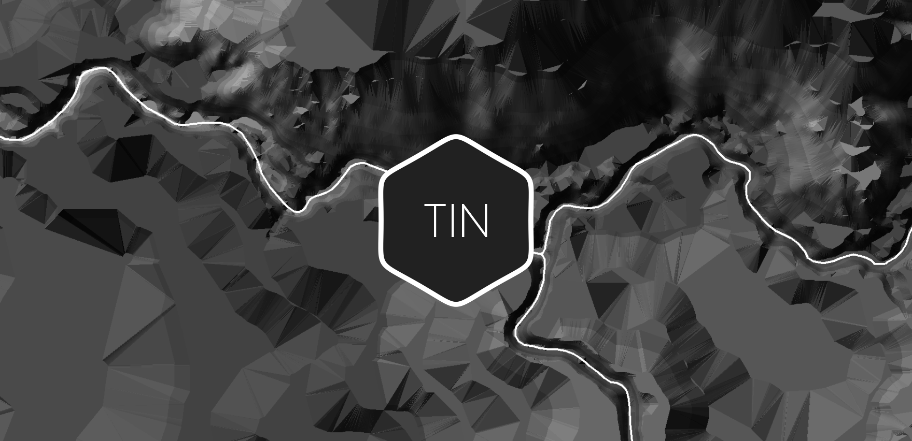
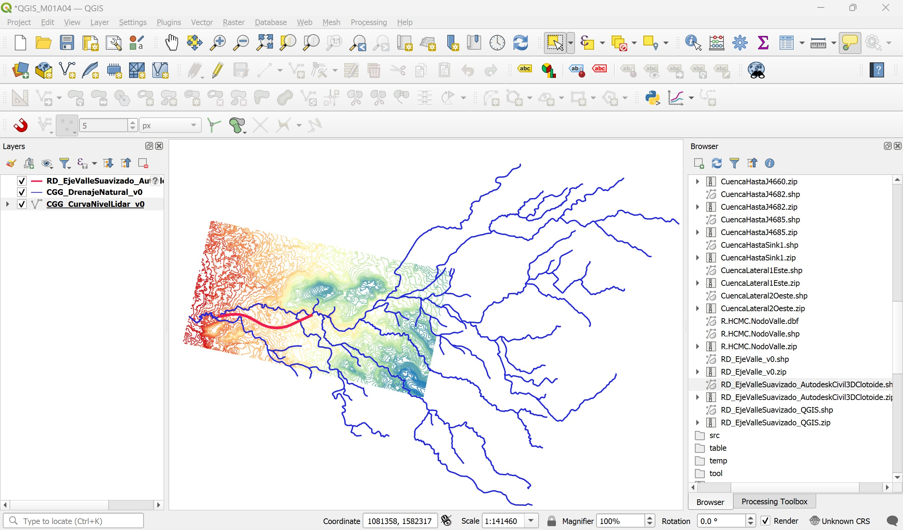
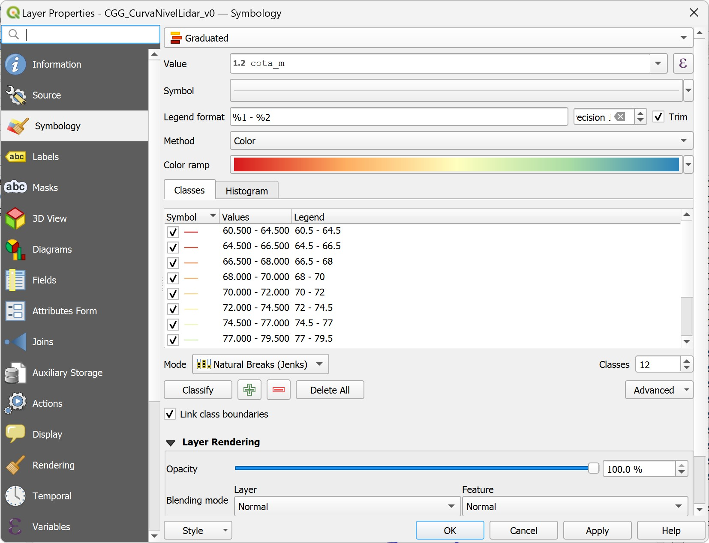
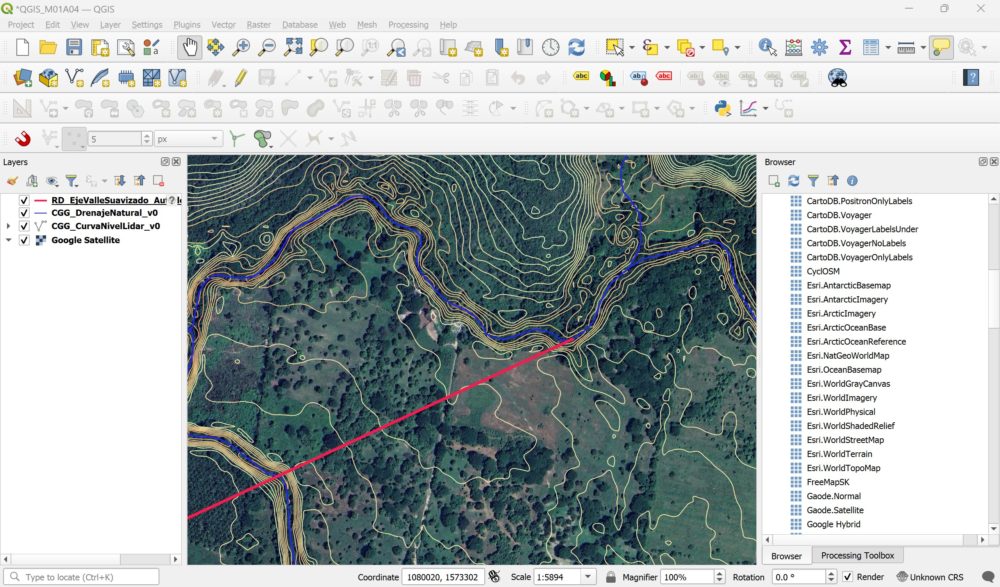
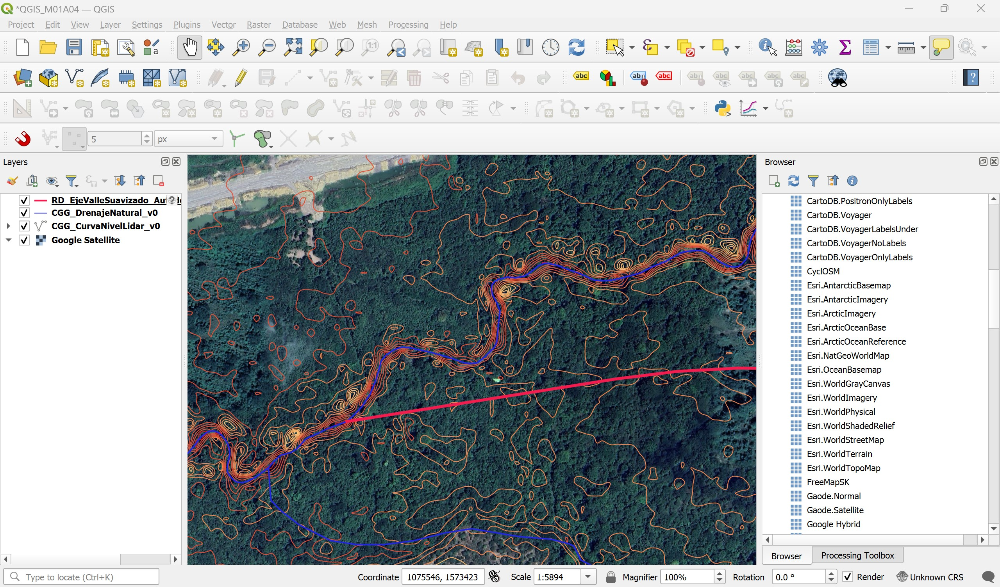
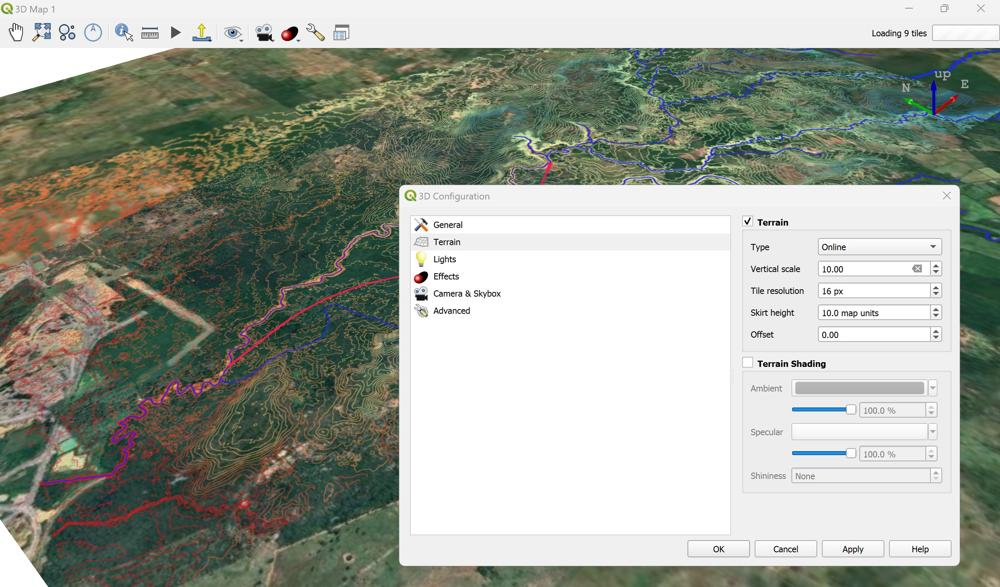
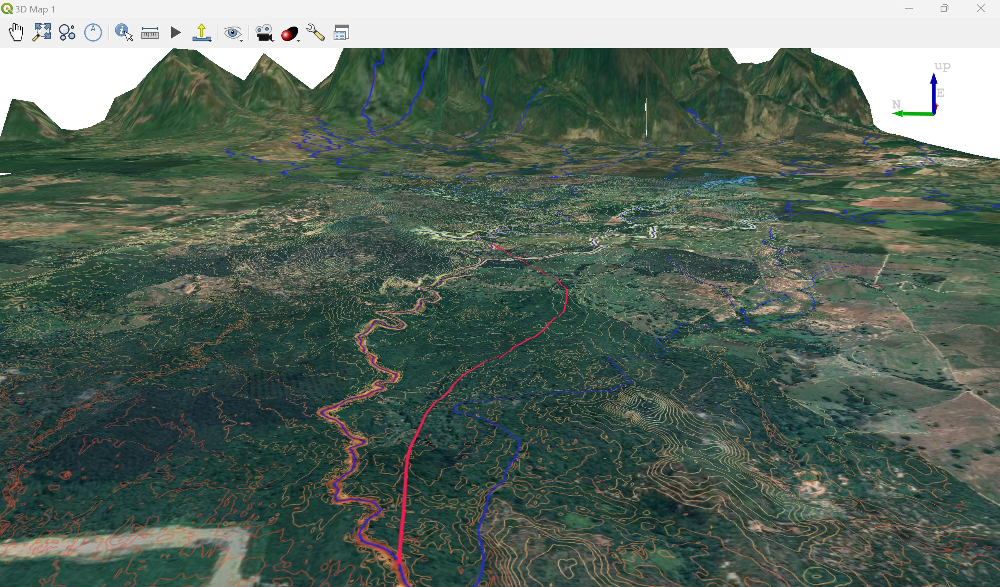

# 1.4. Modelo digital de terreno GIS 3D en estado natural (TIN) usando QGIS
Keywords: `tin`  `m01a04`

A partir de curvas de nivel, construir un modelo de terreno triangulado - TIN (red irregular de triángulos) en 3 dimensiones, que permita estudiar los cauces existentes así como la implementación del corredor de diseño y cauce sinuoso para la modelación hidráulica.

## Objetivos

* Visualizar en 2D y 3D las curvas de nivel y cauces naturales de la zona.
* Delimitar la zona de estudio del modelo de terreno.
* Recortar las curvas de nivel hasta el límite de la zona de estudio.
* Construir la malla triangulada del modelo de terreno TIN.
* Delimitar y extraer el dominio del TIN.
* Extraer y exportar a CAD las aristas del TIN.

## Requerimientos

Archivos, actividades previas, lecturas y herramientas requeridas para el desarrollo de esta actividad:

| Requerimiento                                                                                                                       | Descripción                                                                       |
|:------------------------------------------------------------------------------------------------------------------------------------|:----------------------------------------------------------------------------------|
| [:toolbox:Herramienta](https://www.microsoft.com/es/microsoft-365/excel?market=bz)                                                  | Microsoft Excel 365.                                                              |
| [:open_file_folder:R.HCMC.DTM.xlsx.xlsx](R.HCMC.DTM.xlsx)                                                                           | Libro de cálculo para registro de archivos generados para el proyecto.            |
| [:round_pushpin:RD_EjeValleSuavizado_ AutodeskCivil3DClotoide.shp](../../file/shp/RD_EjeValleSuavizado_AutodeskCivil3DClotoide.zip) | Clotoide eje valle suavizado en formato shapefile (creada en actividad anterior). |
| [:round_pushpin:CGG_CurvaNivelLidar_v0.shp](../../file/shp/CGG_CurvaNivelLidar_v0.zip)                                              | Capa de curvas de nivel.                                                          |
| [:round_pushpin:CGG_DrenajeNatural_v0.shp](../../file/shp/CGG_DrenajeNatural_v0.zip)                                                | Capa de drenajes naturales.                                                       |

> Para los diferentes avances de proyecto, es necesario guardar y publicar las diferentes versiones generadas del (los) libro (s) de Microsoft Excel y reportes o informes, agregando al final la fecha de control documental en formato aaaammdd, p. ej. _R.HydroTools.DisenoCaucesParametros.20250528.xlsx_.

## 1. Visualización general de capas

1. En QGIS, cree un proyecto en blanco y defina el CRS 3116. Agregue las capas [CGG_CurvaNivelLidar_v0.shp](../../file/shp/CGG_CurvaNivelLidar_v0.zip), [CGG_DrenajeNatural_v0.shp](../../file/shp/CGG_DrenajeNatural_v0.zip) y [RD_EjeValleSuavizado_AutodeskCivil3DClotoide.shp](../../file/shp/RD_EjeValleSuavizado_AutodeskCivil3DClotoide.zip), ajuste la simbología de representación de cada capa de curvas de nivel a 12 clases usando la paleta _Spectral_.

2. Desde el panel lateral Browser, agregue el mapa XYZ Tiles / Google Satellite y visualice el eje del valle en la zona de inicio y entrega.

3. Realice una visualización preliminar 3D. En el menú _View_, seleccione la opción _3D Map Views / New 3D Map View_. En la ventana de configuración, establezca _Terrain / Online_ con escala de exageración vertical en 10.

Con la rueda y clic sostenido del Mouse o apuntador, ajuste la rotación y acercamiento a la visualización de terreno.

## 2. 

## Actividades de proyecto :triangular_ruler:

Utilizando la [plantilla suministrada](../../file/report/R.HCMC.PlantillaSoporteDesarrollo.docx), cree un documento soporte mostrando las actividades desarrolladas en el orden presentado en esta actividad, junto con los análisis y recomendaciones realizadas, convierta a Adobe Acrobat (.pdf) y guarde en la carpeta _/activity_ del repositorio de datos del proyecto; nombre el archivo con el código de la actividad agregando al final la fecha de control documental en formato aaaammdd (p. ej. M01A00_20250531.pdf).

En la siguiente tabla se listan las actividades que deben ser desarrolladas y documentadas por cada estudiante o grupo de proyecto.

| Actividad | Alcance                                                                                                                                                                                                                                                                                                                                                                                                                                                                                                                                              |
|:----------|:-----------------------------------------------------------------------------------------------------------------------------------------------------------------------------------------------------------------------------------------------------------------------------------------------------------------------------------------------------------------------------------------------------------------------------------------------------------------------------------------------------------------------------------------------------|
| M01A04    | Descargar el archivo [R.HydroTools.DisenoCaucesParametros.xlsx](https://github.com/rcfdtools/R.HydroTools/blob/main/tool/DisenoCaucesParametros/R.HydroTools.DisenoCaucesParametros.xlsx) disponible en GitHub, e incluirlo en el repositorio.                                                                                                                                                                                                                                                                                                       | 
| M01A04    | Investigar, verificar y registrar en el libro de Excel, los parámetros técnicos, hidráulicos e hidrológicos indicados en esta actividad.  Para el grupo de parámetros normativos, ambientales / sociales y territoriales, revisar los parámetros actualmente reportados, investigar, registrar y actualizar.                                                                                                                                                                                                                                   | 
| M01A04    | Registrar los valores obtenidos en el [libro de parámetros generales](https://github.com/rcfdtools/R.HydroTools/tree/main/tool/DisenoCaucesParametros) requeridos para el diseño y la modelación. Guardar en la carpeta _file/table_.                                                                                                                                                                                                                                                                                                                |
| M01A04    | Opcional: verificar la formulación correcta de los libros de cálculo suministrados. En las notas de la ficha de control documental indicar el método de verificación y si se requieren o no ajustes.                                                                                                                                                                                                                                                                                                                                                 |
| M01A04    | En una tabla y al final del informe de avance de esta entrega, indique el detalle de las actividades realizadas por cada integrante de su grupo; utilice las siguientes columnas: `Nombre del integrante`, `Actividades realizadas`, `Tiempo dedicado en horas` (si presenta la entrega individualmente, no es necesaria la presentación de esta tabla).  Para actividades que no requieren del desarrollo de elementos de avance, indicar si realizo la lectura de la guía de clase y las lecturas indicadas al inicio en los requerimientos. | 

> Nota 1: para la revisión del proyecto final, guarde los libros cálculo de Microsoft Excel y los archivos generados en esta actividad, en las localizaciones indicadas en cada numeral.
>
> Nota 2: una vez el instructor realice la revisión y el estudiante presente las correcciones o ajustes solicitados, será necesario cargar una nueva versión de los archivos en el repositorio del proyecto, incluyendo o actualizando al final del nombre del archivo, la fecha de presentación en formato aaaammdd y manteniendo las versiones anteriores presentadas.
>

## Referencias

* 

## Control de versiones

| Versión    | Descripción        | Autor                                      | Horas |
|------------|:-------------------|--------------------------------------------|:-----:|
| 2024.02.24 | Migración a GitHub | [rcfdtools](https://github.com/rcfdtools)  |   8   |
| 2014.01.11 | Versión inicial.   | [rcfdtools](https://github.com/rcfdtools)  |  18   |

##

_R.HCMC es de uso libre para fines académicos, conoce nuestra licencia, cláusulas, condiciones de uso y como referenciar los contenidos publicados en este repositorio, dando [clic aquí](../../LICENSE.md)._

_¡Encontraste útil este repositorio!, apoya su difusión marcando este repositorio con una ⭐ o síguenos dando clic en el botón Follow de [rcfdtools](https://github.com/rcfdtools) en GitHub._

| [:arrow_backward: Anterior](../M01A03/Readme.md) | [:house: Inicio](../../README.md) | [:beginner: Ayuda / Colabora](https://github.com/rcfdtools/R.SIGE/discussions/99999) | [Siguiente :arrow_forward:](../M01A05/Readme.md) |
|--------------------------------------------------|-----------------------------------|--------------------------------------------------------------------------------------|--------------------------------------------------|

[^1]: 