# 1.4. Modelo digital de terreno GIS 3D en estado natural (TIN) usando QGIS
Keywords: `tin`  `m01a04`

A partir de curvas de nivel, construir un modelo de terreno triangulado - TIN (red irregular de triángulos) en 3 dimensiones, que permita estudiar los cauces existentes así como la implementación del corredor de diseño y cauce sinuoso para la modelación hidráulica.

## Objetivos

* Visualizar en 2D y 3D las curvas de nivel y cauces naturales de la zona.
* Construir la malla triangulada del modelo de terreno TIN.
* Extraer y exportar a CAD las aristas del TIN (opcional).

## Requerimientos

Archivos, actividades previas, lecturas y herramientas requeridas para el desarrollo de esta actividad:

| Requerimiento                                                                                                                       | Descripción                                                                       |
|:------------------------------------------------------------------------------------------------------------------------------------|:----------------------------------------------------------------------------------|
| [:toolbox:Herramienta](https://www.microsoft.com/es/microsoft-365/excel?market=bz)                                                  | Microsoft Excel 365.                                                              |
| [:toolbox:Herramienta](https://qgis.org/)                                                                                           | QGIS 3.42 o superior.                                                    |
| [:toolbox:Herramienta](https://www.autodesk.com/products/civil-3d)                                                                  | Autodesk Civil 3D 2025 o superior.                                       |
| [:open_file_folder:R.HCMC.DTM.xlsx](../../file/table/R.HCMC.DTM.xlsx)                                                               | Libro de cálculo para registro de archivos generados para el proyecto.            |
| [:round_pushpin:RD_EjeValleSuavizado_ AutodeskCivil3DClotoide.shp](../../file/shp/RD_EjeValleSuavizado_AutodeskCivil3DClotoide.zip) | Clotoide eje valle suavizado en formato shapefile (creada en actividad anterior). |
| [:round_pushpin:CGG_CurvaNivelLidar_v0.shp](../../file/shp/CGG_CurvaNivelLidar_v0.zip)                                              | Capa de curvas de nivel.                                                          |
| [:round_pushpin:CGG_DrenajeNatural_v0.shp](../../file/shp/CGG_DrenajeNatural_v0.zip)                                                | Capa de drenajes naturales.                                                       |

> Para los diferentes avances de proyecto, es necesario guardar y publicar las diferentes versiones generadas del (los) libro (s) de Microsoft Excel y reportes o informes, agregando al final la fecha de control documental en formato aaaammdd, p. ej. _R.HydroTools.DisenoCaucesParametros.20250528.xlsx_.

## 1. Visualización general de capas

1. En QGIS, cree un proyecto en blanco y defina el CRS 3116. Agregue las capas [CGG_CurvaNivelLidar_v0.shp](../../file/shp/CGG_CurvaNivelLidar_v0.zip), [CGG_DrenajeNatural_v0.shp](../../file/shp/CGG_DrenajeNatural_v0.zip) y [RD_EjeValleSuavizado_AutodeskCivil3DClotoide.shp](../../file/shp/RD_EjeValleSuavizado_AutodeskCivil3DClotoide.zip), ajuste la simbología de representación de cada capa de curvas de nivel a 12 clases usando la paleta _Spectral_.

2. Desde el panel lateral Browser, agregue el mapa XYZ Tiles / Google Satellite y visualice el eje del valle en la zona de inicio y entrega.

3. Realice una visualización preliminar 3D. En el menú _View_, seleccione la opción _3D Map Views / New 3D Map View_. En la ventana de configuración, establezca _Terrain / Online_ con escala de exageración vertical en 10.

Con la rueda y clic sostenido del Mouse o apuntador, ajuste la rotación y acercamiento a la visualización de terreno.

## 2. Creación de TIN en formato vectorial

A partir de las curvas de nivel, crear el modelo de terreno triangulado TIN, primero abra la tabla de atributos de la capa de curvas de nivel e identifique el campo de elevación.

1. Desde el Processing Toolbox, ejecute la herramienta _Mesh / TIN Mesh Creation_, establezca el CRS 3116 y guarde en formato 2DM como _/file/dem/TIN_TerrenoNaturalQGIS_v0.d2m_.

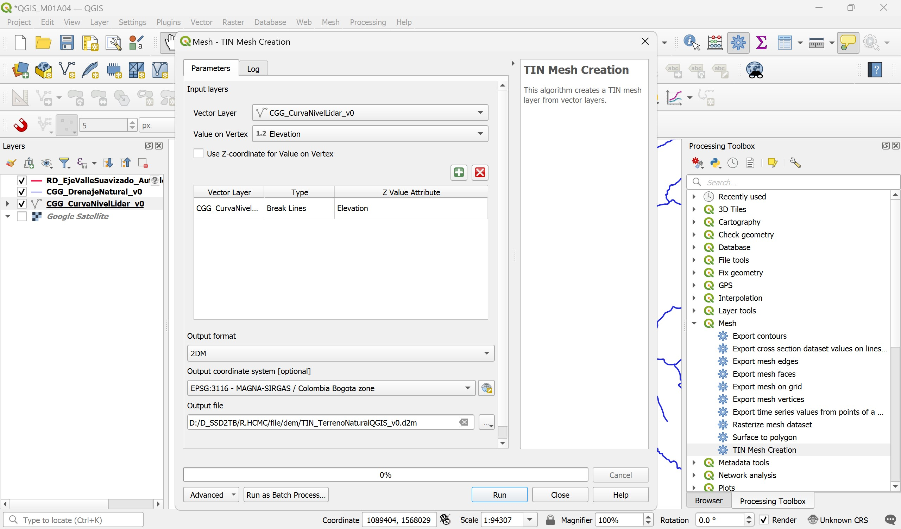

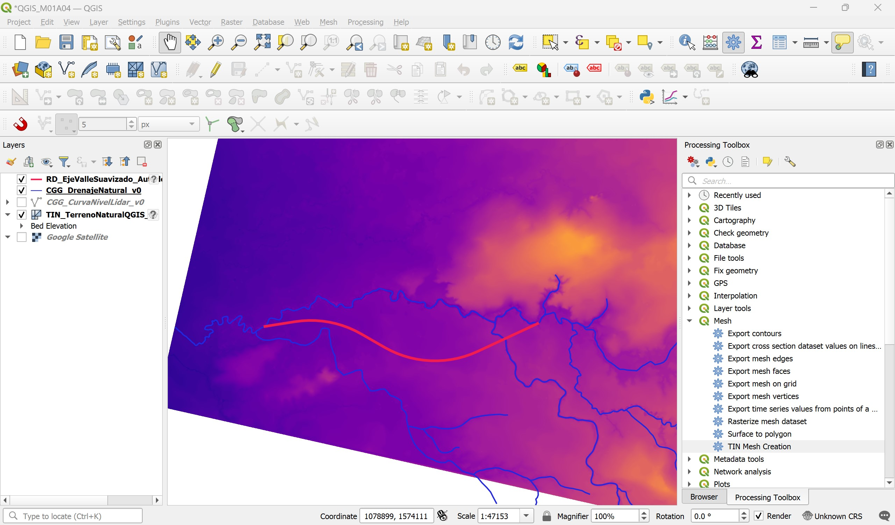

2. Desde las propiedades del TIN, ajuste y visualice la superficie a partir del mallado 2D.

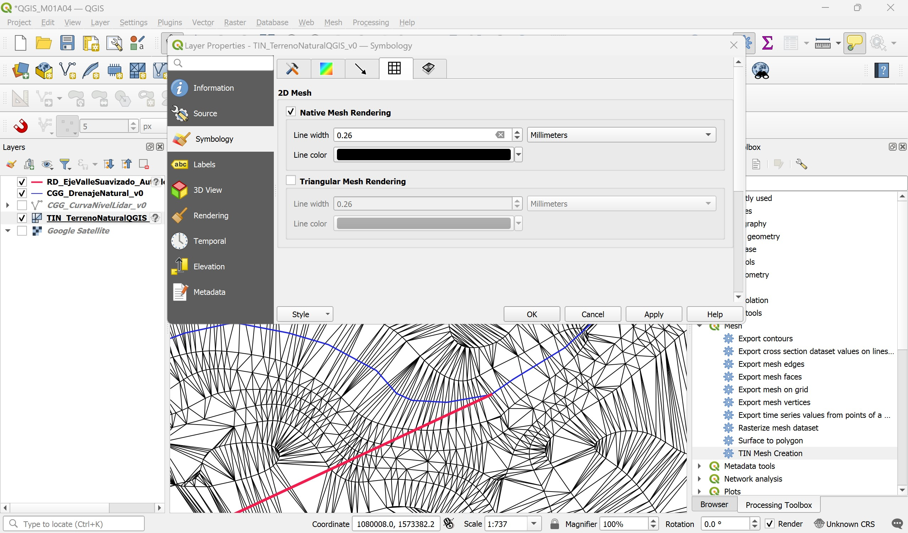

## 3. Creación de TIN en formato ráster

1. Desde el Processing Toolbox, ejecute la herramienta _Interpolation / TIN interpolation_, establezca el método lineal y extensión espacial a partir de las curvas de nivel, guarde la grilla con resolución de 0.5 metros en formato .tif como _/file/dem/TIN_TerrenoNaturalQGIS_v0.tif_ y opcionalmente la red triangulada como _/file/shp/TIN_TerrenoNaturalQGIS_v0.shp_.

> Para su proyecto no es obligatoria la generación de la red triangulada en formato vectorial shapefile.

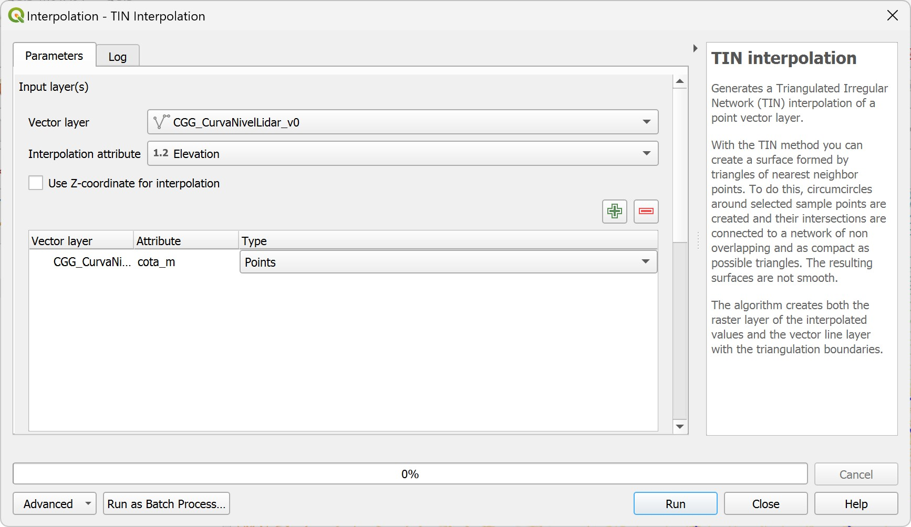

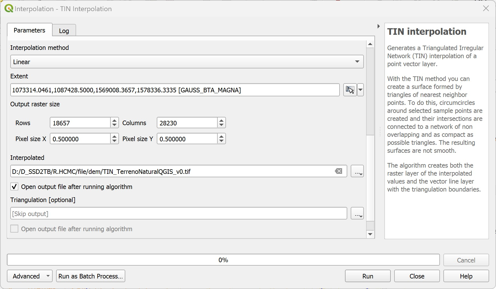

Visualizar en pseudo color utilizando la paleta _Spectral_.

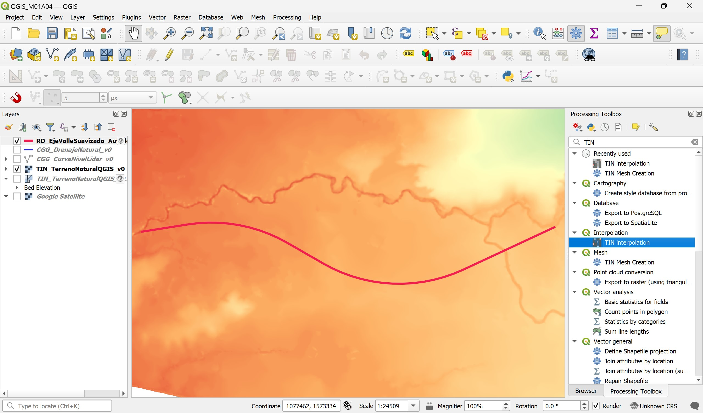

Para definir el número de columnas y filas del ráster de salida,  considerar la resolución de salida y la extensión de la capa de salida: 

* Columnas = (xmax - xmin) / Resolución
* Filas = (ymax - ymin) / Resolución

2. Visualice como Hillshade y Z Factor = 5.

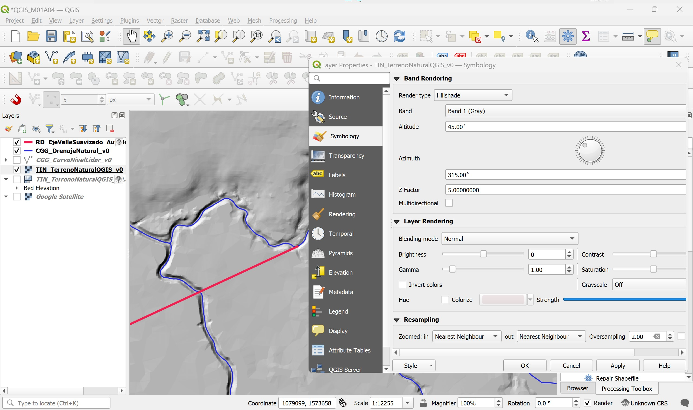

Zona de inicio

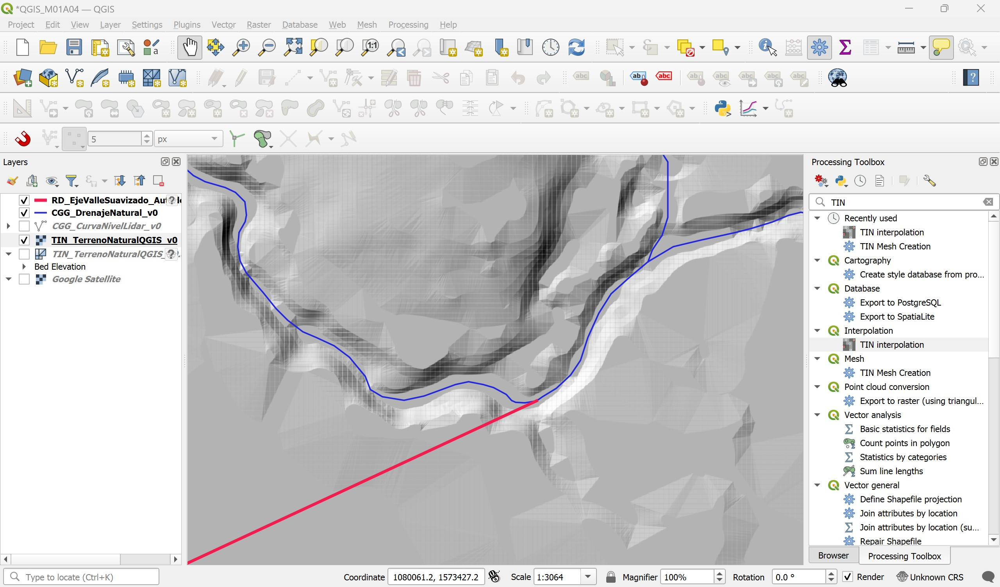

Zona de entrega

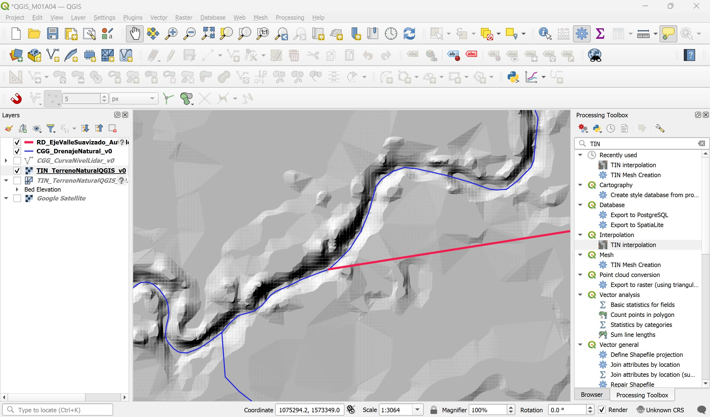

3. Verificación del tamaño de las celdas del ráster. El proceso de interpolación TIN crea una grilla ráster cuyas celdas no son regulares (Tamaños celda x <> y). Para verificar la resolución de salida, en la pestaña de capas, dar clic derecho en la grilla ráster y seleccione Propiedades / Información.

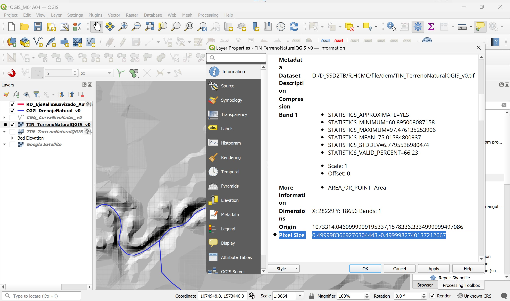

## 4. Visualización 3D de superficie interpolada

1. En el menú _View_, seleccione la opción _3D Map Views / New 3D Map View_. En la ventana de configuración, establezca _Terrain / Type (DEM (Raster Layer)_ seleccionando el TIN creado y especifique escala de exageración vertical en 10. Con la rueda y clic sostenido del Mouse o apuntador, ajuste la rotación y acercamiento a la visualización de terreno.

Zona de inicio

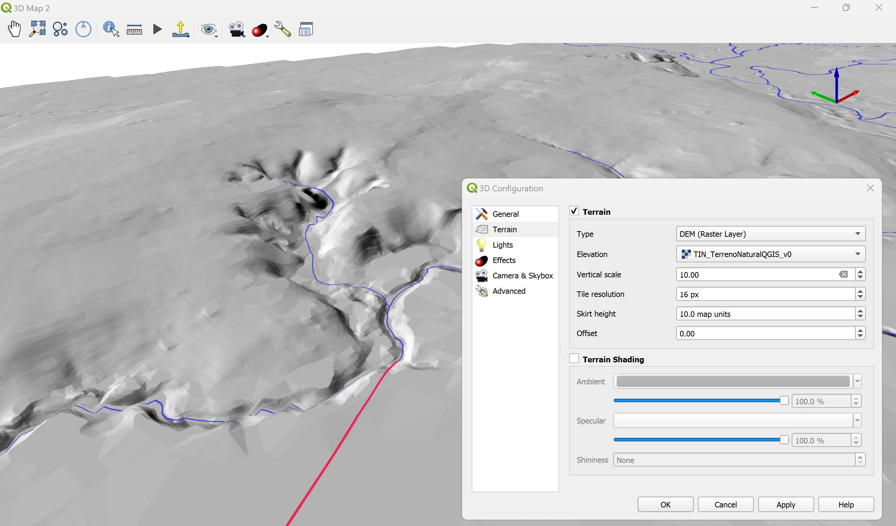

Zona de entrega

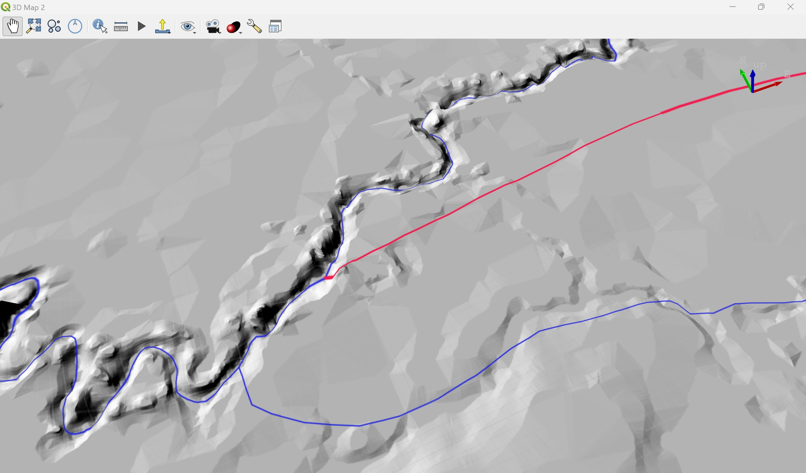

## 5. Visualización de perfiles y secciones transversales

1. En el menu _View_, seleccione la herramienta _Elevation Profile_, agregue el modelo de terreno en formato ráster y seleccione el eje del valle suavizado. Podrá observar el perfil, explorar las cotas de inicio y entrega y la forma de la sección del cauce lateral.

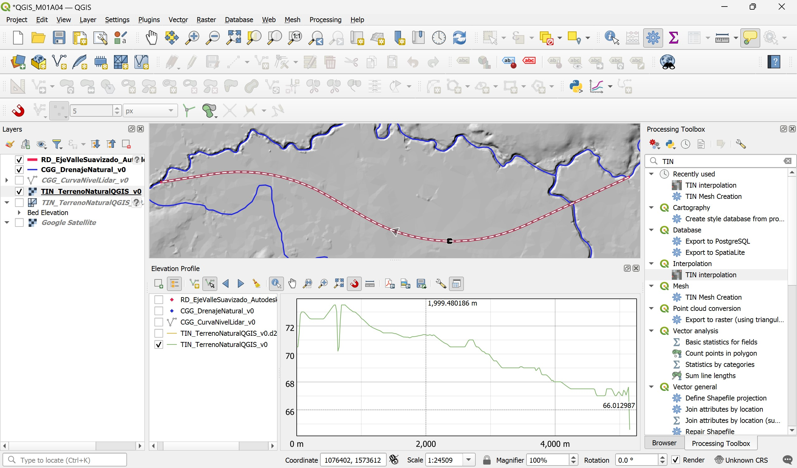

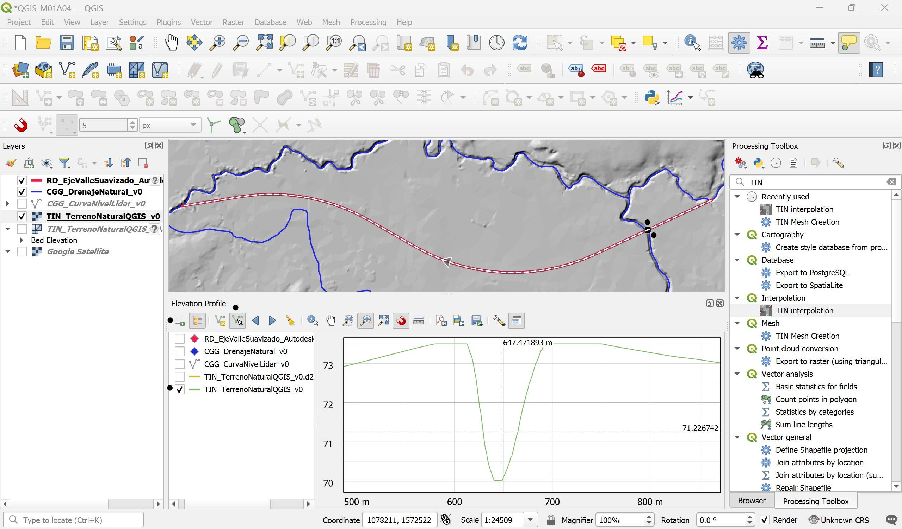

2. Acérquese al inicio del realineamiento, dibuje manualmente una sección transversal y visualice.

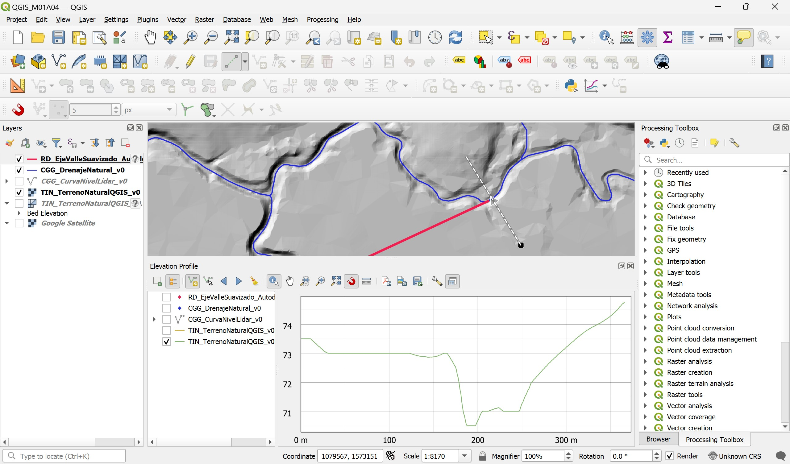

3. Acérquese al final del realineamiento, dibuje manualmente una sección transversal y visualice.

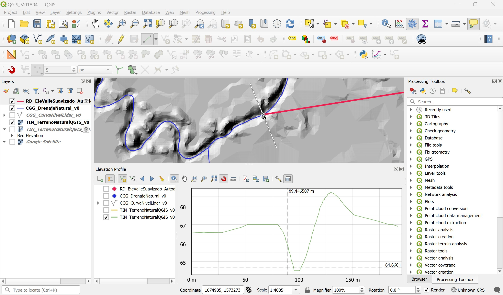

## 6. Exportación de vectores a CAD

1. Desde el menu _Project_, seleccionar la opción _Importar / Exportar / Export Project to DXF_, seleccionar las capas de drenajes, eje suavizado del valle, curvas de nivel y opcionalmente las aristas del modelo triangulado. Guardar como _/file/cad/DTM_QGISVectoresTerrenoNatural_v0.dxf_

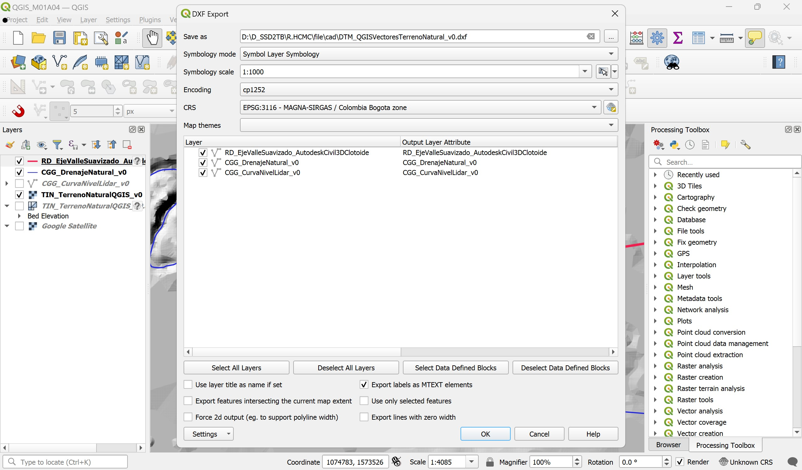

2. Abrir Autodesk Civil 3D y verificar el archivo exportado. En caso de no disponer de Autocad, crear un nuevo mapa de QGIS e importer el DXF para verificar su contenido.

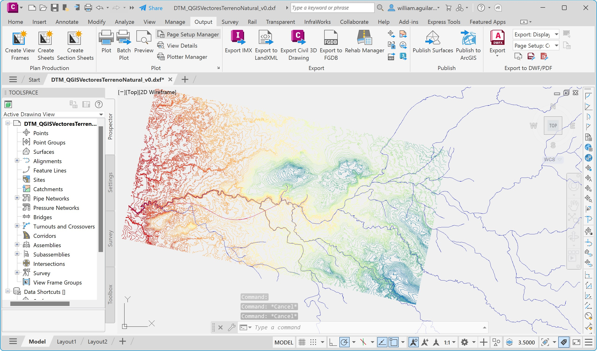

## Actividades de proyecto :triangular_ruler:

Utilizando la [plantilla suministrada](../../file/report/R.HCMC.PlantillaSoporteDesarrollo.docx), cree un documento soporte mostrando las actividades desarrolladas en el orden presentado en esta actividad, junto con los análisis y recomendaciones realizadas, convierta a Adobe Acrobat (.pdf) y guarde en la carpeta _/activity_ del repositorio de datos del proyecto; nombre el archivo con el código de la actividad agregando al final la fecha de control documental en formato aaaammdd (p. ej. M01A00_20250531.pdf).

En la siguiente tabla se listan las actividades que deben ser desarrolladas y documentadas por cada estudiante o grupo de proyecto.

| Actividad | Alcance                                                                                                                                                                                                                                                                                                                                                                                                                                                                                                                                              |
|:----------|:-----------------------------------------------------------------------------------------------------------------------------------------------------------------------------------------------------------------------------------------------------------------------------------------------------------------------------------------------------------------------------------------------------------------------------------------------------------------------------------------------------------------------------------------------------|
| M01A04    | Modificar la red de drenaje natural _CGG_DrenajeNatural_v0.shp_ incluyendo el eje suavizado del valle a partir del eje de proyecto asignado y eliminando los tramos remanentes naturales que serán removidos por la explotación minera, nombrar como _/file/shp/CGG_DrenajeNaturalValleSuavizado_v0.shp_.                                                                                                                                                                                                                                            | 
| M01A04    | Crear el modelo de terreno triangulado TIN en formato vectorial D2M raster .tif con resolución 0.5 metros.                                                                                                                                                                                                                                                                                                                                                                                                                                           | 
| M01A04    | A partir de la grilla de terreno .tif, crear un modelo de sombreado Hillshade, guardar como _/file/dem/TIN_TerrenoNaturalQGISHillshade_v0.tif_.                                                                                                                                                                                                                                                                                                                                                                                                      | 
| M01A04    | Reportar los nombres de los archivos creados y sus detalles técnicos en la ficha de control documental [R.HCMC.DTM.xlsx](../../file/table/R.HCMC.DTM.xlsx).                                                                                                                                                                                                                                                                                                                                                                                          | 
| M01A04    | Para cada archivo creado de formas geométricas, clases de entidad, grillas y modelos de terreno, incluir capturas de pantalla en formato .jpg con el mismo nombre del archivo y en la misma ubicación del archivo dentro de las carpetas datos indicadas en cada numeral. Insertar en el reporte técnico en el numeral correspondiente incluyendo textos descriptivos.                                                                                                                                                                               | 
| M01A04    | En una tabla y al final del informe de avance de esta entrega, indique el detalle de las actividades realizadas por cada integrante de su grupo; utilice las siguientes columnas: `Nombre del integrante`, `Actividades realizadas`, `Tiempo dedicado en horas` (si presenta la entrega individualmente, no es necesaria la presentación de esta tabla).  Para actividades que no requieren del desarrollo de elementos de avance, indicar si realizo la lectura de la guía de clase y las lecturas indicadas al inicio en los requerimientos. | 

> Nota 1: para la revisión del proyecto final, guarde los libros cálculo de Microsoft Excel y los archivos generados en esta actividad, en las localizaciones indicadas en cada numeral.
>
> Nota 2: una vez el instructor realice la revisión y el estudiante presente las correcciones o ajustes solicitados, será necesario cargar una nueva versión de los archivos en el repositorio del proyecto, incluyendo o actualizando al final del nombre del archivo, la fecha de presentación en formato aaaammdd y manteniendo las versiones anteriores presentadas.
>
> Nota 3: para el estudio posterior de las secciones transversales de su proyecto (en la zona de inicio / entrega del eje del valle y evaluación de pendientes de los cauces y corredores), es conveniente estudiar tramos naturales hasta entre 1 y 5 km a partir de los ejes próximos al nodo J4685 del modelo hidrológico (tramo en cuenca W19600, W19450, W19440, W20010 y demás que hagan parte del modelo o la intervención). Lo anterior debido a que el cauce principal al inicio se encuentra agradado o sedimentado. Para estos tramos, en el modelo de muestreo, será necesario incluir secciones transversales y posiciones de banca que permitan a través del perfil longitudinal del río, analizar la cota de fondo real del punto de inicio.
>
> Nota 4: para la entrega no es necesario extraer las aristas o los vectores del modelo triangulado, debido a que la superficie requerida en el Módulo 2 será construida a partir de curvas de nivel.

## Referencias

* https://help.autodesk.com/view/CIV3D/2025/ENU/?guid=GUID-6C5C6DC0-3C2D-4825-8BA8-4FA58941F560
* https://docs.qgis.org/3.40/en/docs/user_manual/processing_algs/qgis/interpolation.html

## Control de versiones

| Versión    | Descripción        | Autor                                      | Horas |
|------------|:-------------------|--------------------------------------------|:-----:|
| 2025.06.02 | Migración a GitHub | [rcfdtools](https://github.com/rcfdtools)  |   6   |

##

_R.HCMC es de uso libre para fines académicos, conoce nuestra licencia, cláusulas, condiciones de uso y como referenciar los contenidos publicados en este repositorio, dando [clic aquí](../../LICENSE.md)._

_¡Encontraste útil este repositorio!, apoya su difusión marcando este repositorio con una ⭐ o síguenos dando clic en el botón Follow de [rcfdtools](https://github.com/rcfdtools) en GitHub._

| [:arrow_backward: Anterior](../M01A03/Readme.md) | [:house: Inicio](../../README.md) | [:beginner: Ayuda / Colabora](https://github.com/rcfdtools/R.SIGE/discussions/99999) | [Siguiente :arrow_forward:](../M01A05/Readme.md) |
|--------------------------------------------------|-----------------------------------|--------------------------------------------------------------------------------------|--------------------------------------------------|

[^1]: 