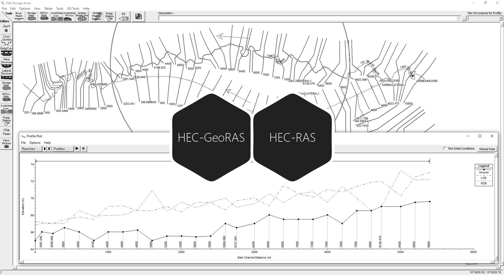
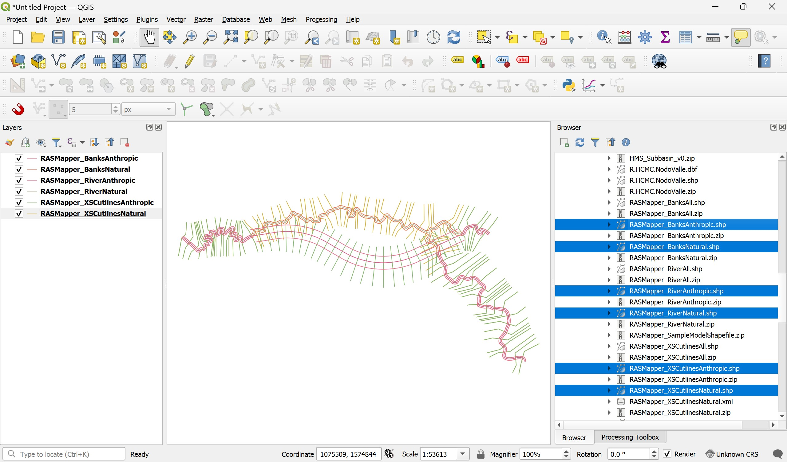
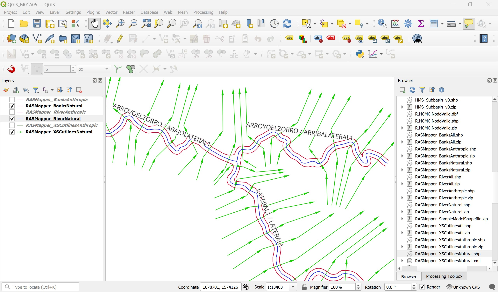
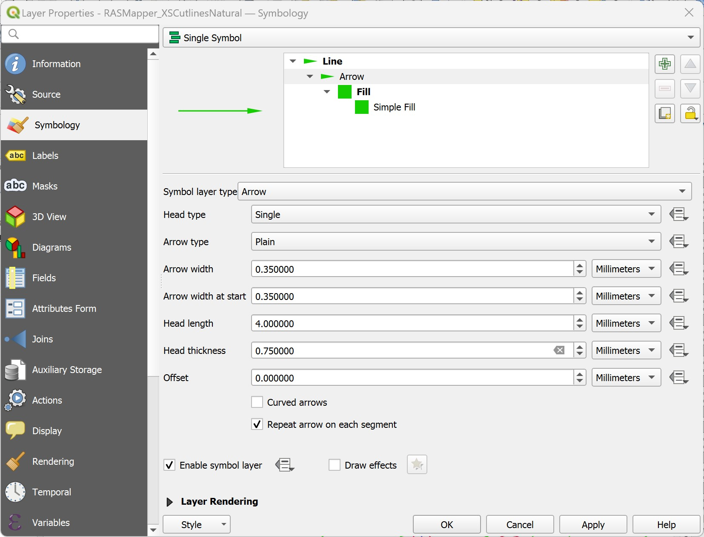
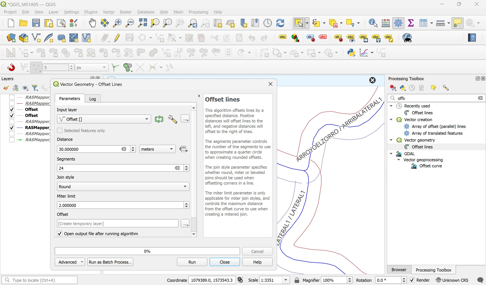

# 1.5. Modelo topológico de muestreo en HEC-RAS para el estudio de secciones y perfiles
Keywords: `topological-model` `sample-model` `ras-mapper`  `m01a05`

A partir del modelo de terreno triangulado - TIN, la red de drenaje natural foto restituida y el eje suavizado del valle; construir un modelo HEC-RAS que permita evaluar las secciones de referencia, el canal natural actual y el perfil de terreno del eje de valle trazado.

## Objetivos

* Importar y editar los drenajes, secciones transversales, bancas y líneas de flujo de la zona de estudio.
* Configurar las capas del proyecto hidráulico para su exportación.
* Validar las líneas de drenaje y secciones transversales.
* Visualizar el perfil del cauce natural a reemplazar, el perfil del eje del valle suavizado y las secciones transversales de inicio y entrega.

## Requerimientos

Archivos, actividades previas, lecturas y herramientas requeridas para el desarrollo de esta actividad:

| Requerimiento                                                                                           | Descripción                                                                                                                     |
|:--------------------------------------------------------------------------------------------------------|:--------------------------------------------------------------------------------------------------------------------------------|
| [:toolbox:Herramienta](https://www.hec.usace.army.mil/software/hec-ras/)                                | HEC-RAS 6.6 o superior.                                                                                                         |
| [:round_pushpin:RASMapper_SampleModelShapefile](../../file/shp/RASMapper_SampleModelShapefile.zip)      | Capas geográficas vectoriales para modelo de muestreo HEC-RAS.                                                                  |

> Para los diferentes avances de proyecto, es necesario guardar y publicar las diferentes versiones generadas del (los) libro (s) de Microsoft Excel y reportes o informes, agregando al final la fecha de control documental en formato aaaammdd, p. ej. _R.HydroTools.DisenoCaucesParametros.20250528.xlsx_.

## 1. Visualización y revisión de vectores en QGIS

1. En QGIS, cargue desde la ruta _/file/shp_ las capas _RASMapper_BanksAnthropic.shp_, _RASMapper_BanksNatural.shp_, _RASMapper_RiverAnthropic.shp_, _RASMapper_RiverNatural.shp_, _RASMapper_XSCutlinesAnthropic.shp_ y _RASMapper_XSCutlinesNatural.shp_.

2. Active solo los elementos de muestreo de la red natural, ajuste la simbología de representación con colores similares a los mostrados en la ilustración y rotule los drenajes con `"RiverCode"  || ' / ' ||  "ReachCode"`.

> :fire: Tenga en cuenta que para la correcta asociación de las abscisas del modelo hidráulico de muestreo, los drenajes así como las líneas de banca deberán ser digitalizadas en el sentido del flujo y las secciones transversales de izquierda a derecha en el sentido del flujo.

Para la construcción de las líneas de muestreo de cauces naturales de su proyecto, utilice las siguientes directrices:

| Tipo línea                      | Directriz                                                                                                                                                                                                                                                                                                                                                                                                                                                                                                                                                                                                                                            |
|:--------------------------------|:-----------------------------------------------------------------------------------------------------------------------------------------------------------------------------------------------------------------------------------------------------------------------------------------------------------------------------------------------------------------------------------------------------------------------------------------------------------------------------------------------------------------------------------------------------------------------------------------------------------------------------------------------------|
| RASMapper_RiverNatural.shp      | Crear la red de muestreo a partir de los vectores contenidos en la capa de [drenajes naturales](../../shp/CGG_DrenajeNatural_v0.zip), incluya aguas arriba y aguas abajo de los nodos inicio y entrega del eje del valle suavizado, tramos naturales entre 1 y 5 km y los ejes de los cauces naturales hasta el límite del modelo digital de elevación. Para el nombramiento de los tramos, en el campo `RiverCode` identifique el cauce principal con un nombre único y los demás tramos laterales con nombres como Lateral1 / Lateral2 en el sentido del flujo, en el campo `ReachCode` asigne nombres en función de los sub-tramos identificados. |
| RASMapper_BanksNatural.shp      | A partir de la red de drenaje, generar paralelas de 30 metros a cada lado. Herramienta _QGIS / Processing Toolbox / Vector geometry / Offset lines_.                                                                                                                                                                                                                                                                                                                                                                                                                                                                                                   |
| RASMapper_XSCutlinesNatural.shp | En RAS Mapper, generar líneas de muestreo en intervalos cada 200 metros y anchos iniciales de 500 metros, luego editar y ajustar manualmente la localización muestreando ondas sinuosas y meandros. Agregue secciones transversales complementarias en zonas de inicio y entrega (a no más de 10 cm del nodo) y localizaciones estratégicas del modelo como nodos de unión, zonas con bajos y estructuras existentes.                                                                                                                                                                                                                                |

## Actividades de proyecto :triangular_ruler:

Utilizando la [plantilla suministrada](../../file/report/R.HCMC.PlantillaSoporteDesarrollo.docx), cree un documento soporte mostrando las actividades desarrolladas en el orden presentado en esta actividad, junto con los análisis y recomendaciones realizadas, convierta a Adobe Acrobat (.pdf) y guarde en la carpeta _/activity_ del repositorio de datos del proyecto; nombre el archivo con el código de la actividad agregando al final la fecha de control documental en formato aaaammdd (p. ej. M01A00_20250531.pdf).

En la siguiente tabla se listan las actividades que deben ser desarrolladas y documentadas por cada estudiante o grupo de proyecto.

| Actividad | Alcance                                                                                                                                                                                                                                                                                                                                                                                                                                                                                                                                              |
|:----------|:-----------------------------------------------------------------------------------------------------------------------------------------------------------------------------------------------------------------------------------------------------------------------------------------------------------------------------------------------------------------------------------------------------------------------------------------------------------------------------------------------------------------------------------------------------|
| M01A01    | Descargar el archivo [R.HydroTools.DisenoCaucesParametros.xlsx](https://github.com/rcfdtools/R.HydroTools/blob/main/tool/DisenoCaucesParametros/R.HydroTools.DisenoCaucesParametros.xlsx) disponible en GitHub, e incluirlo en el repositorio.                                                                                                                                                                                                                                                                                                       | 
| M01A01    | Investigar, verificar y registrar en el libro de Excel, los parámetros técnicos, hidráulicos e hidrológicos indicados en esta actividad.  Para el grupo de parámetros normativos, ambientales / sociales y territoriales, revisar los parámetros actualmente reportados, investigar, registrar y actualizar.                                                                                                                                                                                                                                   | 
| M01A02    | Registrar los valores obtenidos en el [libro de parámetros generales](https://github.com/rcfdtools/R.HydroTools/tree/main/tool/DisenoCaucesParametros) requeridos para el diseño y la modelación. Guardar en la carpeta _file/table_.                                                                                                                                                                                                                                                                                                                |
| M01A02    | Opcional: verificar la formulación correcta de los libros de cálculo suministrados. En las notas de la ficha de control documental indicar el método de verificación y si se requieren o no ajustes.                                                                                                                                                                                                                                                                                                                                                 |
| M01A01    | En una tabla y al final del informe de avance de esta entrega, indique el detalle de las actividades realizadas por cada integrante de su grupo; utilice las siguientes columnas: `Nombre del integrante`, `Actividades realizadas`, `Tiempo dedicado en horas` (si presenta la entrega individualmente, no es necesaria la presentación de esta tabla).  Para actividades que no requieren del desarrollo de elementos de avance, indicar si realizo la lectura de la guía de clase y las lecturas indicadas al inicio en los requerimientos. | 

> Nota 1: para la revisión del proyecto final, guarde los libros cálculo de Microsoft Excel y los archivos generados en esta actividad, en las localizaciones indicadas en cada numeral.
>
> Nota 2: una vez el instructor realice la revisión y el estudiante presente las correcciones o ajustes solicitados, será necesario cargar una nueva versión de los archivos en el repositorio del proyecto, incluyendo o actualizando al final del nombre del archivo, la fecha de presentación en formato aaaammdd y manteniendo las versiones anteriores presentadas.
>

## Referencias

* 

## Control de versiones

| Versión    | Descripción        | Autor                                      | Horas |
|------------|:-------------------|--------------------------------------------|:-----:|
| 2024.02.24 | Migración a GitHub | [rcfdtools](https://github.com/rcfdtools)  |   8   |
| 2014.01.11 | Versión inicial.   | [rcfdtools](https://github.com/rcfdtools)  |  18   |

##

_R.HCMC es de uso libre para fines académicos, conoce nuestra licencia, cláusulas, condiciones de uso y como referenciar los contenidos publicados en este repositorio, dando [clic aquí](../../LICENSE.md)._

_¡Encontraste útil este repositorio!, apoya su difusión marcando este repositorio con una ⭐ o síguenos dando clic en el botón Follow de [rcfdtools](https://github.com/rcfdtools) en GitHub._

| [:arrow_backward: Anterior](../M01A00/Readme.md) | [:house: Inicio](../../README.md) | [:beginner: Ayuda / Colabora](https://github.com/rcfdtools/R.SIGE/discussions/99999) | [Siguiente :arrow_forward:](../M01A02/Readme.md) |
|--------------------------------------------------|-----------------------------------|--------------------------------------------------------------------------------------|--------------------------------------------------|

[^1]: 