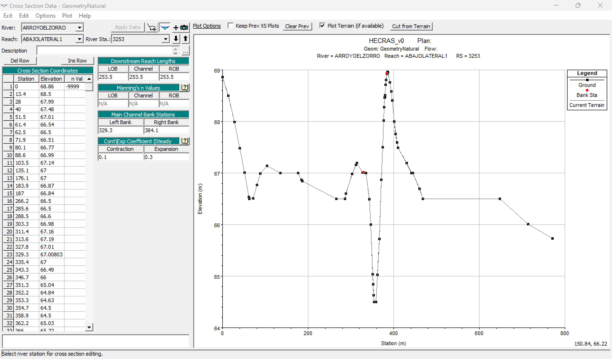

# 1.5. Modelo topológico de muestreo en HEC-RAS para el estudio de secciones y perfiles
Keywords: `topological-model` `sample-model` `ras-mapper`  `m01a05`

A partir del modelo de terreno triangulado - TIN, la red de drenaje natural foto restituida y el eje suavizado del valle; construir un modelo HEC-RAS que permita evaluar las secciones de referencia, el canal natural actual y el perfil de terreno del eje de valle trazado.

## Objetivos

* Importar y editar los drenajes, secciones transversales, bancas y líneas de flujo de la zona de estudio.
* Configurar las capas del proyecto hidráulico para su exportación.
* Validar las líneas de drenaje y secciones transversales.
* Visualizar el perfil del cauce natural a reemplazar, el perfil del eje del valle suavizado y las secciones transversales de inicio y entrega.

## Requerimientos

Archivos, actividades previas, lecturas y herramientas requeridas para el desarrollo de esta actividad:

| Requerimiento                                                                                           | Descripción                                                    |
|:--------------------------------------------------------------------------------------------------------|:---------------------------------------------------------------|
| [:toolbox:Herramienta](https://www.hec.usace.army.mil/software/hec-ras/)                                | HEC-RAS 6.7 Beta 3 o superior.                                 |
| [:round_pushpin:RASMapper_SampleModelShapefile](../../file/shp/RASMapper_SampleModelShapefile.zip)      | Capas geográficas vectoriales para modelo de muestreo HEC-RAS. |

> Para los diferentes avances de proyecto, es necesario guardar y publicar las diferentes versiones generadas del (los) libro (s) de Microsoft Excel y reportes o informes, agregando al final la fecha de control documental en formato aaaammdd, p. ej. _R.HydroTools.DisenoCaucesParametros.20250528.xlsx_.

## 1. Creación y verificación de vectores en QGIS

1. En QGIS, cargue desde la ruta _/file/shp_ las capas _RASMapper_BanksAnthropic.shp_, _RASMapper_BanksNatural.shp_, _RASMapper_RiverAnthropic.shp_, _RASMapper_RiverNatural.shp_, _RASMapper_XSCutlinesAnthropic.shp_ y _RASMapper_XSCutlinesNatural.shp_.

2. Active solo los elementos de muestreo de la red natural, ajuste la simbología de representación con colores similares a los mostrados en la ilustración y rotule los drenajes con `"RiverCode"  || ' / ' ||  "ReachCode"`. Para facilitar la comprensión del modelo de muestreo, agregue desde _/file/shp_ el eje suavizado del realineamiento del valle _RD_EjeValleSuavizado_AutodeskCivil3DClotoide.shp_ y el modelo digital de elevación _/file/dem/TIN_TerrenoNaturalQGIS_v0.tif_.

> :fire: Tenga en cuenta que para la correcta asociación de las abscisas del modelo hidráulico de muestreo, los drenajes así como las líneas de banca deberán ser digitalizadas en el sentido del flujo y las secciones transversales de izquierda a derecha en el sentido del flujo. Verifique la dirección vectorial por medio de simbología por flechas hacia el final.

Como observa en la ilustración, la red de muestreo de cauces naturales únicamente contiene elementos próximos a la zona del futuro cauce de realineamiento y hasta el límite del modelo digital de terreno generado previamente.

Para la construcción de las líneas de muestreo de cauces naturales de su proyecto, utilice las siguientes directrices:

| Tipo línea                      | Directriz                                                                                                                                                                                                                                                                                                                                                                                                                                                                                                                                                                                                                                            |
|:--------------------------------|:-----------------------------------------------------------------------------------------------------------------------------------------------------------------------------------------------------------------------------------------------------------------------------------------------------------------------------------------------------------------------------------------------------------------------------------------------------------------------------------------------------------------------------------------------------------------------------------------------------------------------------------------------------|
| RASMapper_RiverNatural.shp      | Crear la red de muestreo a partir de los vectores contenidos en la capa de [drenajes naturales](../../shp/CGG_DrenajeNatural_v0.zip), incluya aguas arriba y aguas abajo de los nodos inicio y entrega del eje del valle suavizado, tramos naturales entre 1 y 5 km y los ejes de los cauces naturales hasta el límite del modelo digital de elevación. Para el nombramiento de los tramos, en el campo `RiverCode` identifique el cauce principal con un nombre único y los demás tramos laterales con nombres como Lateral1 / Lateral2 en el sentido del flujo, en el campo `ReachCode` asigne nombres en función de los sub-tramos identificados. |
| RASMapper_BanksNatural.shp      | A partir de la red de drenaje, generar paralelas de 30 metros a cada lado. Herramienta _QGIS / Processing Toolbox / Vector geometry / Offset lines_.                                                                                                                                                                                                                                                                                                                                                                                                                                                                                                 |
| RASMapper_XSCutlinesNatural.shp | En RAS Mapper, generar líneas de muestreo en intervalos cada 200 metros y anchos iniciales de 500 metros, luego editar y ajustar manualmente la localización muestreando ondas sinuosas, meandros, pasos de vía, cambios de pendiente y resuelva secciones generadas entre cruzadas o por fuera del límite del DTM. Agregue secciones transversales complementarias en zonas de inicio y entrega del realineamiento proyectado de valle (a no más de 10 cm del nodo) y en localizaciones estratégicas del modelo como nodos de unión, zonas con bajos y estructuras existentes.                                                                      |

Ejemplo de creación de líneas paralelas de bancas usando QGIS. 

> Las bancas definen la localización de la zona central del canal o zona de cauce dominante en la que se asume constante el valor de la rugosidad, de las bancas hacia afuera se considera la zona de llanura. 
> 
> Tenga en cuenta que los valores de rugosidad pueden variar discretamente en toda la sección transversal de acuerdo a las coberturas de usos actuales del suelo disponibles en la zona.

3. Edite manualmente las líneas de secciones transversales para:

* Evitar que en las secciones transversales las bancas de un mismo lado crucen dos o más veces la misma sección.
* Cada sección transversal debe ser cruzada solo una vez por la banca izquierda y solo una vez por la banca derecha.
* Las secciones transversales siempre deben ser intersecadas por cada una de las bancas.
* Las líneas de banca no pueden intersecar los ríos (River) o las líneas de dirección de flujo (Flowpaths).
* La sección más aguas abajo al final del último tramo de drenaje debe localizarse en el extremo del río para garantizar que el absicado de las secciones inicie en cero.

> Nota: en caso de que las secciones transversales editadas hayan sido copiadas desde un proyecto anterior, será necesario eliminar el campo de atributos de los identificadores hidráulicos denominado _HydroID_.

4. Repita el procedimiento anterior para la creación y verificación de las líneas de muestreo del modelo antrópico, utilice las directrices generales del modelo natural presentadas anteriormente y las siguientes directrices complementarias:

| Tipo línea                        | Directriz                                                                                                                                                                                    |
|:----------------------------------|:---------------------------------------------------------------------------------------------------------------------------------------------------------------------------------------------|
| RASMapper_RiverAnthropic.shp      | Elimine los tramos naturales remanentes que serán removidos en la operación minera y conserve solo los elementos conectores al nuevo eje de realineamiento de valle.                         |
| RASMapper_BanksAnthropic.shp      | En la zona del eje del valle suavizado de realineamiento, generar paralelas de 150 metros a cada lado para el muestreo completo del corredor de confinamiento hidráulico.                    |                                                                                                                                                                                                                                                                                                                                                                                                                                                                         |
| RASMapper_XSCutlinesAnthropic.shp | En la zona natural utilizar el mismo trazado de secciones naturales y en la zona del valle generar líneas de muestreo en intervalos cada 200 metros y anchos iniciales de 500 a 1000 metros. |

## 2. Creación de proyecto HEC-RAS y topología RAS Mapper

1. Abra HEC-RAS y en el menú _Options_, seleccione la opción _Units System (US Customary / SI)_ y establezca como sistema por defecto el sistema de unidades internacional.

2. En el menú _File_, seleccione la opción _New Project_ creando primero la carpeta de proyecto _/file/hec/HECRAS_v0/_ y nombre el proyecto como _HECRAS_v0.prj_.

3. En el menú _GIS Tools_, de clic en _RAS Mapper..._ o en de clic en el ícono RAS Mapper de la ventana principal de HEC-RAS. En RAS Mapper, de clic en el menú _Project_ y seleccione la opción _Set Projection_, busque y establezca el CRS [GAUSS_BTA_MAGNA.prj](../../file/projectionfile).

4. En el panel lateral izquierdo seleccione el grupo Terrains y de clic derecho y seleccione la opción _Create a New RAS Terrain_, busque el DTM [/file/dem/TIN_TerrenoNaturalQGIS_v0.tif](../../file/dem) y de clic en _Create_.

> En la opción _Rounding (Precision)_ puede utilizar 1/128 de precisión con respecto a las elevaciones registradas en la grilla de terreno. 

Renombre el modelo de terreno como TIN_TerrenoNaturalQGIS y ajuste las propiedades de visualización utilizando un factor de sombreado de 10 y rampa ajustada a 24 clases en escala de grises.

5. En el panel lateral izquierdo seleccione el grupo _Geometries_, de clic derecho y seleccione la opción _Create New Geometry_, nombre como _GeometryNatural_ y asocie el DTM.

6. Seleccione la nueva geometría creada y de clic en el botón de edición (lápiz amarillo), seleccione la capa _Rivers_ y dando clic derecho seleccione la opción _Import Features_. Busque y seleccione la capa [/file/shp/RASMapper_RiverNatural.shp](../../file/shp/RASMapper_RiverNatural.zip) y asocie los códigos `River = RiverCode` y `Reach = ReachCode`.

Detenga la edición y guarde los cambios realizados en la geometría.

Dando clic derecho en la capa _Rivers_, seleccione la opción _Layer Properties_ y en _Additional Options_ active las casillas de visualización de flechas direccionales y abscisado. Acérquese a la zona de unión del cauce lateral y verifique que exista el nodo de unión o Junction y que las flechas direccionales estén en el sentido del flujo.

7. Edite la geometría e importe los _Bank Lines_ desde [/file/shp/RASMapper_BanksNatural.shp](../../file/shp/RASMapper_BanksNatural.zip), guarde, visualice y verifique las flechas direccionales.

8. Edite la geometría e importe las _Cross Sections_ desde [/file/shp/RASMapper_XSCutlinesNatural.shp](../../file/shp/RASMapper_XSCutlinesNatural.zip), guarde, visualice y verifique las flechas direccionales y los nodos de posición de banca.

9. Visualice toda la geometría y revise en detalle las diferentes localizaciones. Como referencia de visualización, en _Map Layers_ agregue desde _Reference Layers_ la capa del eje del valle suavizado [/file/shp/RD_EjeValleSuavizado_AutodeskCivil3DClotoide.shp](../../file/shp/RD_EjeValleSuavizado_AutodeskCivil3DClotoide.zip).

Sección inicio realineamiento 

Sección entrega realineamiento 

10. Edite la geometría de Cross Sections y en el menú contextual seleccione las opciones _Update Cross Sections / Elevation Profiles from Terrain_ y _All XS Attributes (Except Terrain)_, que calculara las elevaciones respecto al terreno en cada sección transversal y guarde las actualizaciones. En _Cross Sections_ active la casilla de visualización _Edge Lines_ que le permitirá conocer el límite externo de la envolvente que rodea las secciones transversales.

Selecione uno de los tramos de drenaje contenidos en Rivers y desde el menú contextual, visualice el perfil de terreno. La línea roja representa las elevaciones de la grilla del DTM y la línea verde, las elevaciones asociadas en cada sección transversal de muestreo en la intersección con el río.

Cauce principal aguas abajo de la entrada Lateral 1 

Cauce Lateral 1 

> Para su proyecto, visualice en RAS Mapper, cada uno de los tramos de drenaje.

## 3. Visualización y ajuste de geometría 1D en HEC-RAS

1. Cierre RAS Mapper, y en la ventana principal de HEC-RAS, de clic en el editor de geometría 1D.

> Se recomienda mantener cerrado el editor RAS Mapper cuando esté utilizando el editor de geometría 1D de HEC-RAS, así evitará perdidas de datos o corrupción de los archivos del proyecto.

2. En la ventana _Geometric Data_ y desde el menú _File_, seleccione la opción _Open Geometry Data_, seleccione el archivo _GeometryNatural_.

3. Consulte y verifique los siguientes elementos:

* Perfil de cada tramo de drenaje con abscisado correcto
* Perfil de cada río incluyendo sus tramos
* Secciones transversales con distancias positivas en bancas y entre secciones
* Posición de bancas en las secciones

4. Perfil del cauce natural principal y cauce lateral

Cauce principal 

Cauce lateral 

5. Sección de inicio y entrega realineamiento.

Sección de inicio, abscisa 9944 m 

Sección de entrega, abscisa 3253 m 

6. Utilizando el editor de secciones transversales, ajuste las posiciones de banca hasta la corona de confinamiento.

## Actividades de proyecto :triangular_ruler:

Utilizando la [plantilla suministrada](../../file/report/R.HCMC.PlantillaSoporteDesarrollo.docx), cree un documento soporte mostrando las actividades desarrolladas en el orden presentado en esta actividad, junto con los análisis y recomendaciones realizadas, convierta a Adobe Acrobat (.pdf) y guarde en la carpeta _/activity_ del repositorio de datos del proyecto; nombre el archivo con el código de la actividad agregando al final la fecha de control documental en formato aaaammdd (p. ej. M01A00_20250531.pdf).

En la siguiente tabla se listan las actividades que deben ser desarrolladas y documentadas por cada estudiante o grupo de proyecto.

| Actividad | Alcance                                                                                                                                                                                                                                                                                                                                                                                                                                                                                                                                              |
|:----------|:-----------------------------------------------------------------------------------------------------------------------------------------------------------------------------------------------------------------------------------------------------------------------------------------------------------------------------------------------------------------------------------------------------------------------------------------------------------------------------------------------------------------------------------------------------|
| M01A01    | Descargar el archivo [R.HydroTools.DisenoCaucesParametros.xlsx](https://github.com/rcfdtools/R.HydroTools/blob/main/tool/DisenoCaucesParametros/R.HydroTools.DisenoCaucesParametros.xlsx) disponible en GitHub, e incluirlo en el repositorio.                                                                                                                                                                                                                                                                                                       | 
| M01A01    | Investigar, verificar y registrar en el libro de Excel, los parámetros técnicos, hidráulicos e hidrológicos indicados en esta actividad.  Para el grupo de parámetros normativos, ambientales / sociales y territoriales, revisar los parámetros actualmente reportados, investigar, registrar y actualizar.                                                                                                                                                                                                                                   | 
| M01A02    | Registrar los valores obtenidos en el [libro de parámetros generales](https://github.com/rcfdtools/R.HydroTools/tree/main/tool/DisenoCaucesParametros) requeridos para el diseño y la modelación. Guardar en la carpeta _file/table_.                                                                                                                                                                                                                                                                                                                |
| M01A02    | Opcional: verificar la formulación correcta de los libros de cálculo suministrados. En las notas de la ficha de control documental indicar el método de verificación y si se requieren o no ajustes.                                                                                                                                                                                                                                                                                                                                                 |
| M01A01    | En una tabla y al final del informe de avance de esta entrega, indique el detalle de las actividades realizadas por cada integrante de su grupo; utilice las siguientes columnas: `Nombre del integrante`, `Actividades realizadas`, `Tiempo dedicado en horas` (si presenta la entrega individualmente, no es necesaria la presentación de esta tabla).  Para actividades que no requieren del desarrollo de elementos de avance, indicar si realizo la lectura de la guía de clase y las lecturas indicadas al inicio en los requerimientos. | 

> Nota 1: para la revisión del proyecto final, guarde los libros cálculo de Microsoft Excel y los archivos generados en esta actividad, en las localizaciones indicadas en cada numeral.
>
> Nota 2: una vez el instructor realice la revisión y el estudiante presente las correcciones o ajustes solicitados, será necesario cargar una nueva versión de los archivos en el repositorio del proyecto, incluyendo o actualizando al final del nombre del archivo, la fecha de presentación en formato aaaammdd y manteniendo las versiones anteriores presentadas.
>

## Referencias

* 

## Control de versiones

| Versión    | Descripción        | Autor                                      | Horas |
|------------|:-------------------|--------------------------------------------|:-----:|
| 2024.02.24 | Migración a GitHub | [rcfdtools](https://github.com/rcfdtools)  |   8   |
| 2014.01.11 | Versión inicial.   | [rcfdtools](https://github.com/rcfdtools)  |  18   |

##

_R.HCMC es de uso libre para fines académicos, conoce nuestra licencia, cláusulas, condiciones de uso y como referenciar los contenidos publicados en este repositorio, dando [clic aquí](../../LICENSE.md)._

_¡Encontraste útil este repositorio!, apoya su difusión marcando este repositorio con una ⭐ o síguenos dando clic en el botón Follow de [rcfdtools](https://github.com/rcfdtools) en GitHub._

| [:arrow_backward: Anterior](../M01A00/Readme.md) | [:house: Inicio](../../README.md) | [:beginner: Ayuda / Colabora](https://github.com/rcfdtools/R.SIGE/discussions/99999) | [Siguiente :arrow_forward:](../M01A02/Readme.md) |
|--------------------------------------------------|-----------------------------------|--------------------------------------------------------------------------------------|--------------------------------------------------|

[^1]: 