# 1.6. Evaluación de secciones transversales de referencia y cotas de fondo de inicio y entrega
Keywords: `realigment` `cross-section` `hydraulic-depth` `superficial-widtth` `river-slope` `hydraulic-reference-values` `m01a06`

A partir de las secciones existentes en los ríos naturales a intervenir, definir las cotas de inicio y entrega del canal artificial a diseñar, la cota máxima de almacenamiento o cota de desbordamiento, la altura máxima de la sección y el ancho promedio existente del cauce dominante y/o de la llanura.

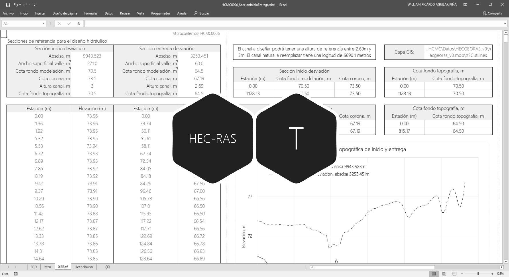

## Objetivos

* Identificar las secciones transversales de inicio y entrega del canal a diseñar.
* Evaluar las cotas de fondo de inicio y entrega.
* Estimar el delta Y o diferencia de elevación entre secciones de inicio y entrega.
* Comparar los anchos superficiales de las secciones naturales.

## Requerimientos

Archivos, actividades previas, lecturas y herramientas requeridas para el desarrollo de esta actividad:

| Requerimiento                                                                                                                                         | Descripción                                                                                 |
|:------------------------------------------------------------------------------------------------------------------------------------------------------|:--------------------------------------------------------------------------------------------|
| [:toolbox:Herramienta](https://www.microsoft.com/es/microsoft-365/excel?market=bz)                                                                    | Microsoft Excel 365.                                                                        |
| [:toolbox:Herramienta](https://www.hec.usace.army.mil/software/hec-ras/)                                                                              | HEC-RAS 6.7 Beta 3 o superior.                                                              |
| [:toolbox:Herramienta](https://qgis.org/)                                                                                                             | QGIS 3.42 o superior.                                                                       |
| [:open_file_folder:R.HydroTools.SeccionTransvInicioEntrega.xlsx](https://github.com/rcfdtools/R.HydroTools/tree/main/tool/SeccionTransvInicioEntrega) | Libro de cálculo para la evaluación de secciones naturales de inicio y entrega.             |
| [:open_file_folder:Modelo hidráulico HECRAS_v0](../../file/hec)                                                                                       | Modelo hidráulico de muestreo HEC-RAS v0 creado en actividad [M01A05](../M01A05/Readme.md). |

> Para los diferentes avances de proyecto, es necesario guardar y publicar las diferentes versiones generadas del (los) libro (s) de Microsoft Excel y reportes o informes, agregando al final la fecha de control documental en formato aaaammdd, p. ej. _R.HydroTools.DisenoCaucesParametros.20250528.xlsx_.

## 0. Consideraciones generales para el análisis

Tenga en cuenta las siguientes consideraciones:

* Los datos de estación / elevación son extraídos del modelo de muestreo HEC-RAS, construido a partir del modelo digital de terreno de puntos o curvas topográficas y líneas de secciones transversales.
* Las cotas de inicio y entrega para el diseño y modelación pueden ser más altas o bajas dependiendo si se considera rellenar, dragar o rectificar el cauce natural antes de su intervención.
* Se puede considerar que el canal artificial a diseñar deberá tener una profundidad similar a la del cauce natural a reemplazar, sin embargo, cuando se plantea realizar dragado o rectificación de fondo para rehabilitación o realce de los taludes de protección, las profundidades pueden variar y será necesario realizar un nuevo levantamiento topo-batimétrico de las zonas de inicio y entrega para realizar un nuevo análisis.
* Para el correcto cálculo del área hidráulica y perímetro mojado, la línea que describe el ancho superficial a partir de la selección de estaciones debe ser horizontal y no debe cruzar la línea de terreno. Tenga en cuenca que cuando existen bancos de arena o sobre elevaciones por encima de la lámina de agua dentro del ancho superficial, la hoja de cálculo sobre estima o sub-estima el valor del área y perímetro hidráulico calculado.

## 1. Obtención de valores estación / elevación y localización geográfica 

1. Abra el [modelo hidráulico de muestreo HEC-RAS](../../file/hec) creado en la actividad anterior, y en _Geometry Data_ cargue la geometría _GeomertyNatural_ e identifique la sección natural de inicio y entrega del eje del valle correspondientes a las abscisas 9944 m al inicio y 3253 m en la entrega.

Sección inicio - Abscisa 9944 m 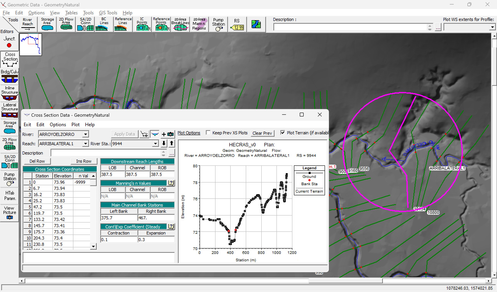

Sección entrega - Abscisa 3253 m 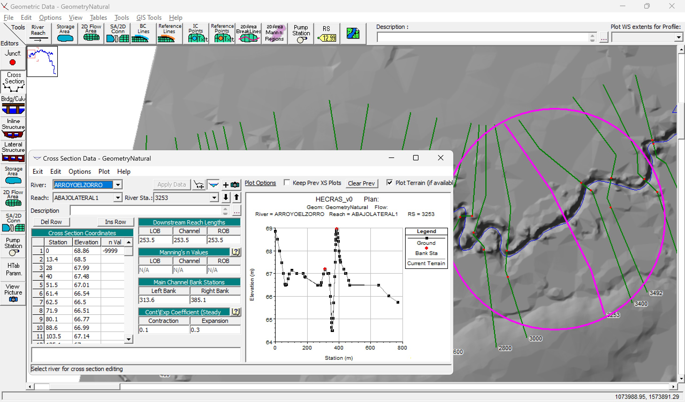

2. En el libro de Microsoft Excel [R.HydroTools.SeccionTransvInicioEntrega.xlsx](https://github.com/rcfdtools/R.HydroTools/tree/main/tool/SeccionTransvInicioEntrega), registre los valores de estación y elevación, copiando y pegando los valores desde el visor de secciones de HEC-RAS.

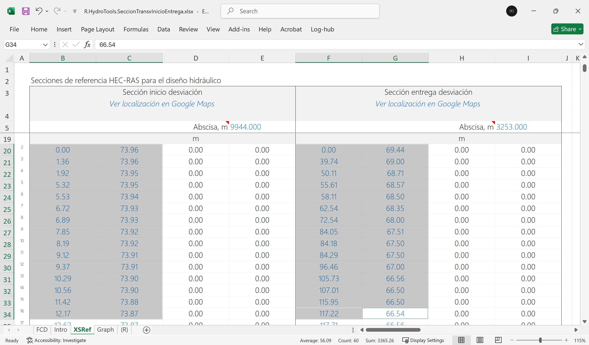

3. En QGIS, agregue las capas de ríos, secciones transversales naturales y eje del valle suavizado, obtenga las coordenadas de localización del centroide de las secciones de inicio y entrega, registre en el libro de Excel.

Para la localización de centroides, cree y calcule en la capa de secciones transversales naturales, las siguientes propiedades geométricas:

| Campo  | Tipo       | Descripción                                  | Propiedad geométrica                                                 |
|:-------|:-----------|:---------------------------------------------|:---------------------------------------------------------------------|
| CXm    | Real (10)  | Coordenada X de centroide en metros          | x(@geometry)                                                         |
| CYm    | Real (10)  | Coordenada Y de centroide en metros          | y(@geometry)                                                         |
| Latdd  | Real (10)  | Latitud de centroide en grados geodésicos    | x(transform($geometry, layer_property(@layer, 'crs'),'EPSG:4326'))   |
| Londd  | Real (10)  | Longitud de centroide en grados geodésicos   | y(transform($geometry, layer_property(@layer, 'crs'),'EPSG:4326'))   |

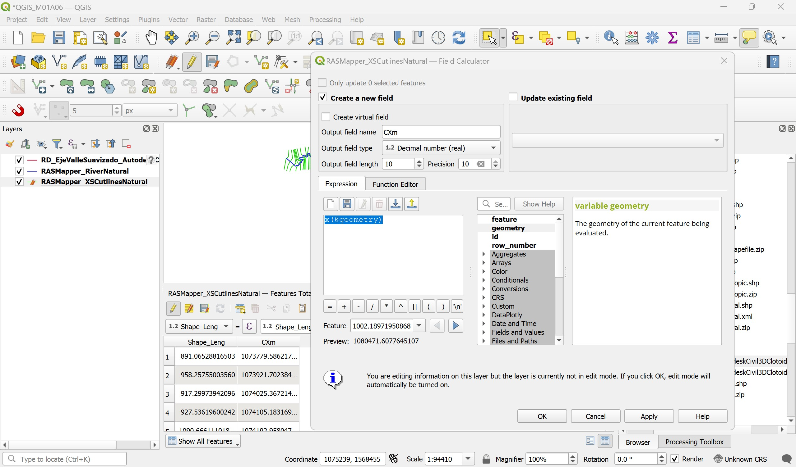

> Para el cálculo correcto del centroide geográfico se debe exportar y reproyectar la capa _RASMapper_XSCutlinesNatural.shp_ al CRS 3116, guardar como _RASMapper_XSCutlinesNatural3116.shp_

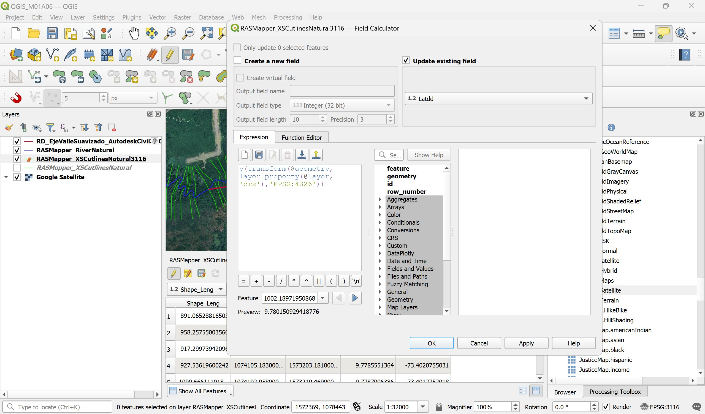

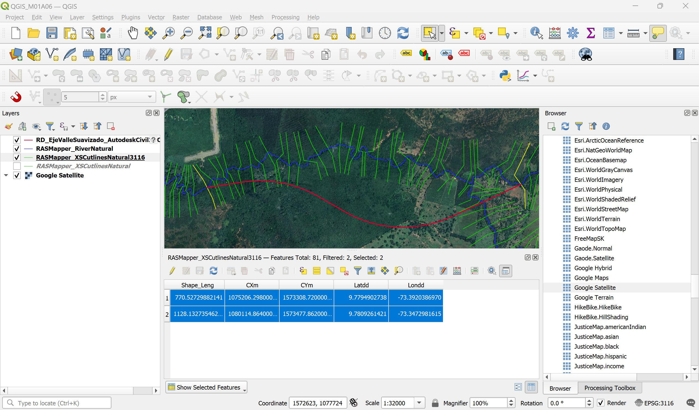

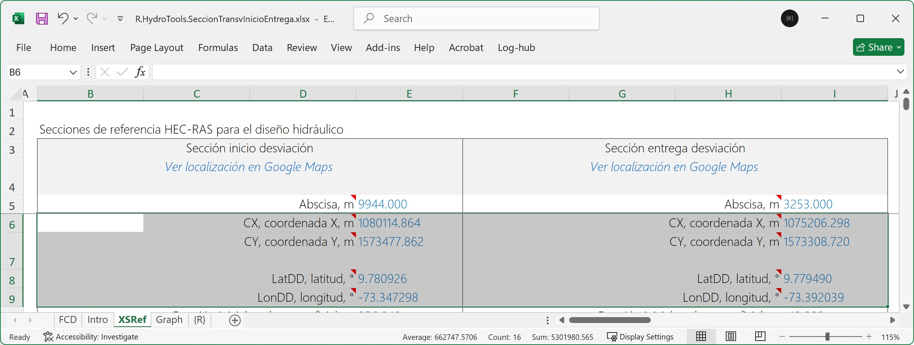

4. Dando clic en el enlace _Ver Localización de Google Maps_ del libro de Excel, visualice la localización de las secciones.

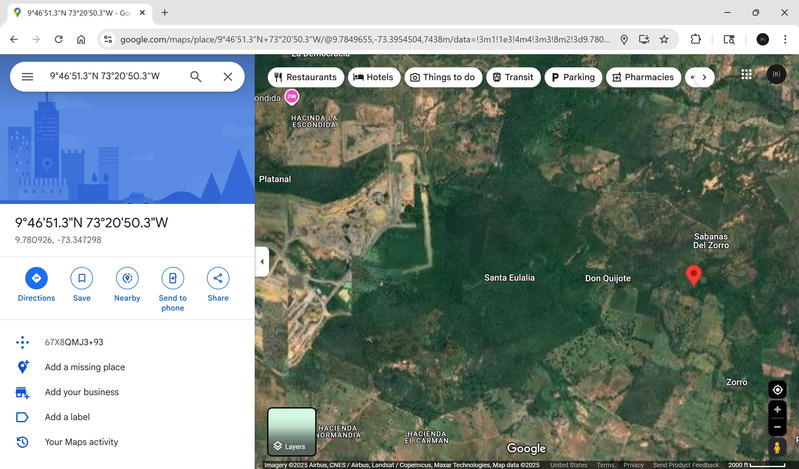

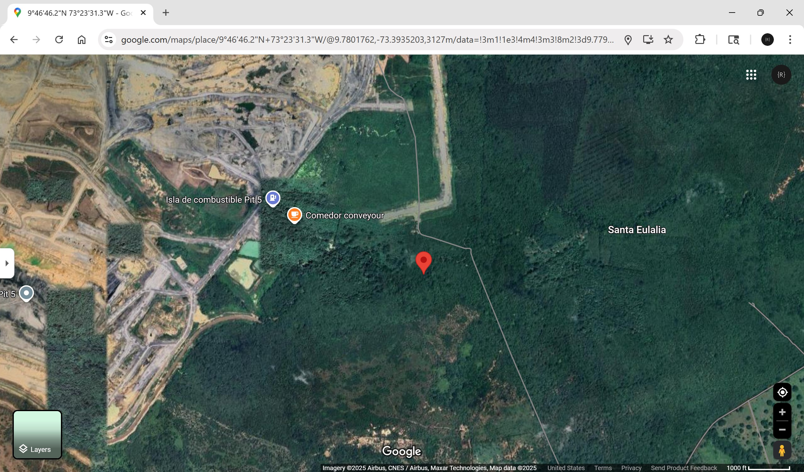

## 2. Estimación de anchos superficiales

1. En HEC-RAS, abra el visor de secciones y manteniendo presionada la tecla <kbd>Ctrl</kbd>, mida el ancho superficial desde el punto de desbordamiento hacia el extremo opuesto de la zona del valle. Mantener presionada la tecla <kbd>Ctrl</kbd> y haga clic en los dos puntos requeridos sobre el dibujo de la sección.

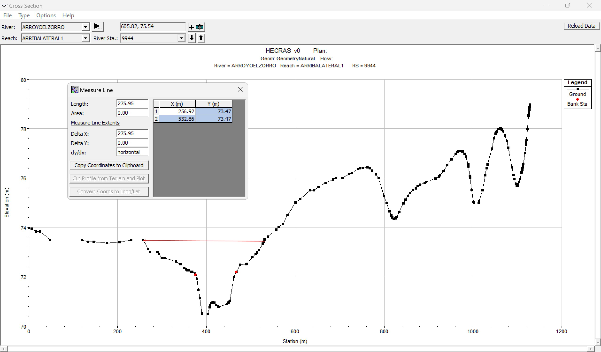

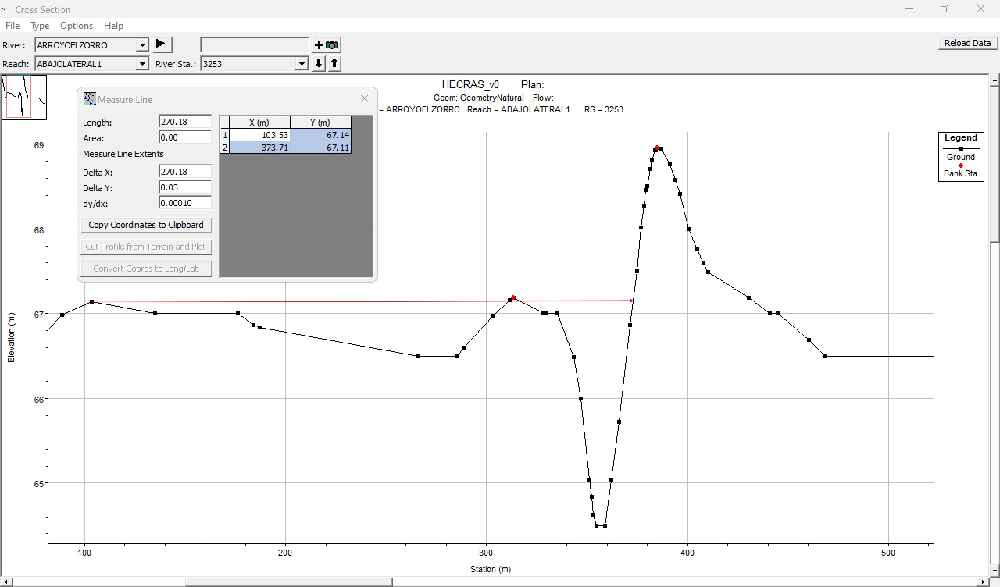

2. En el libro de Excel, seleccione para cada sección, la estación de localización correspondiente al ancho superficial a izquierda y derecha, automáticamente se calculará el ancho cuyos valores están al rededor de 270 metros.

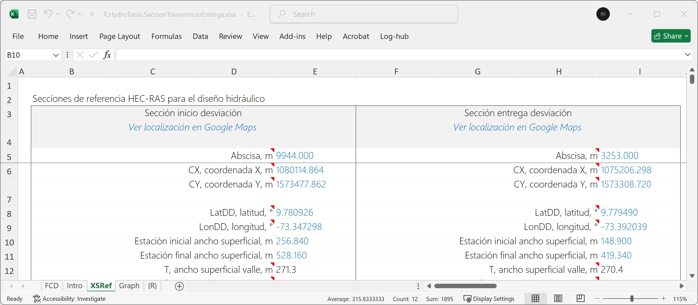

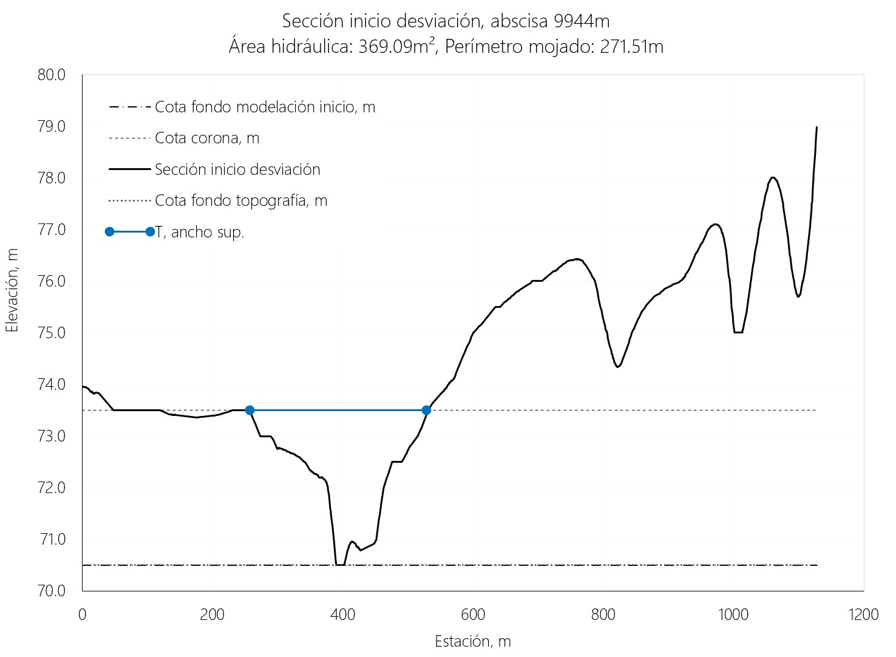

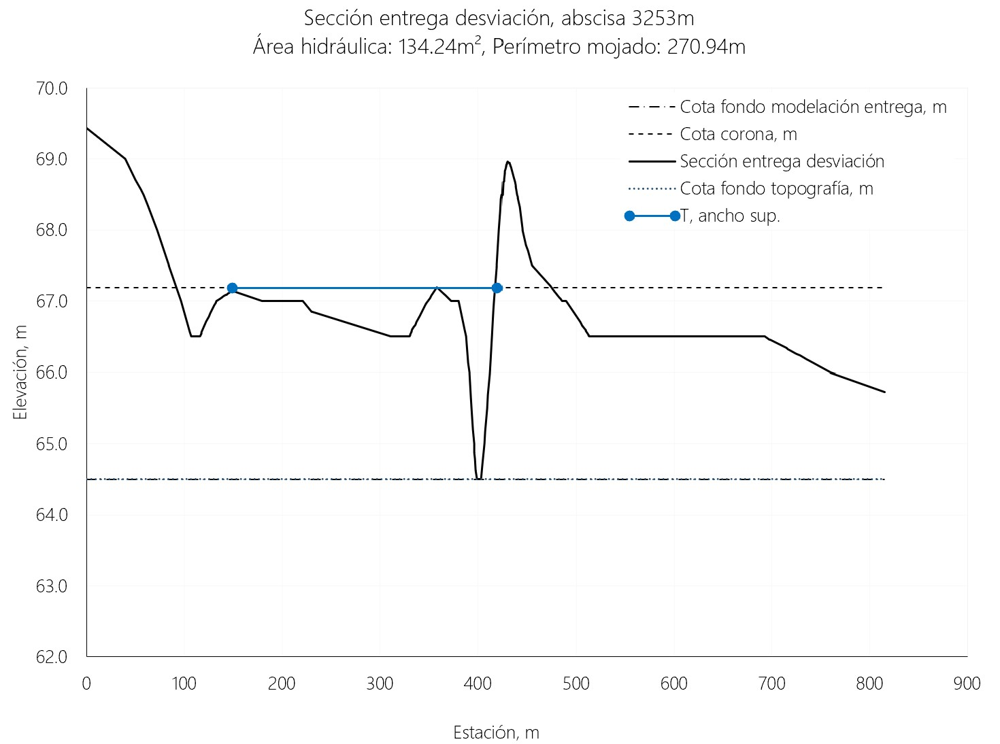

## 3. Profundidad hidráulica de la sección, perímetro mojado, área hidráulica y pendiente

En el libro de Excel, ingrese el valor de las cotas de fondo (topográfica y de diseño) y cotas corona, automáticamente serán calculadas las profundidades, demás propiedades hidráulicas.

> Tenga en cuenta que la cota topográfica corresponde a la cota leida a partir del DTM y que la cota de fondo de modelación corresponde al valor que utilizará como referencia para el cálculo de la pendiente y para el diseño hidráulico de la sección de realineamiento.

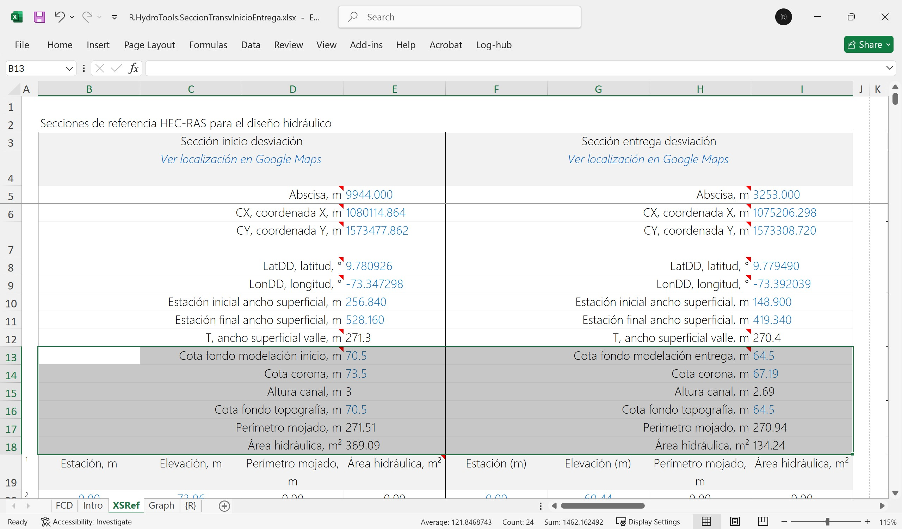

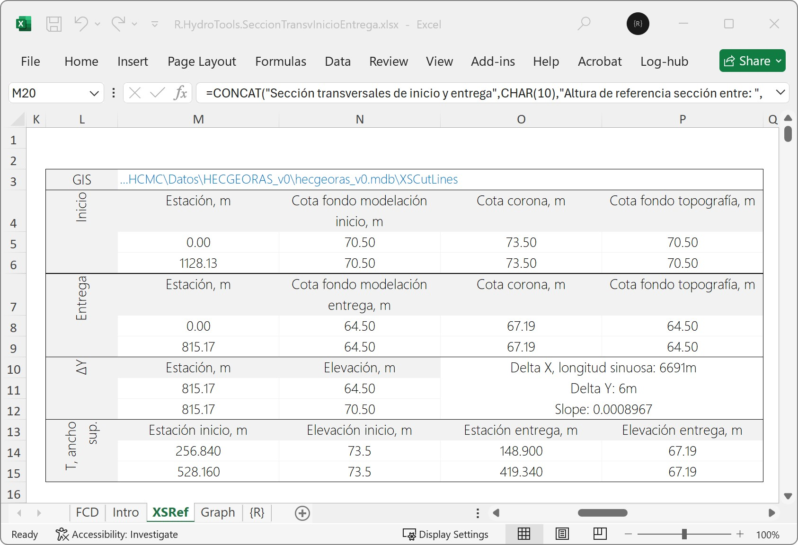

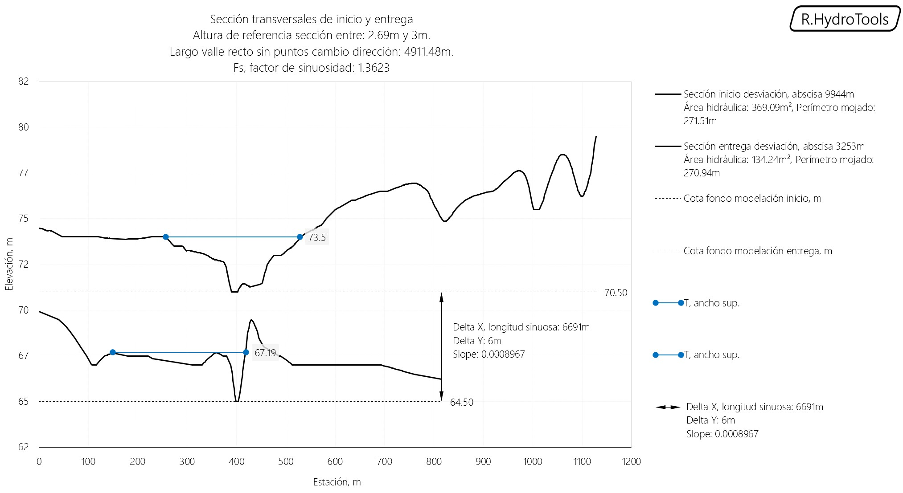

## 4. Parámetros de diseño

Para el diseño se ha establecido que se mantengan las cotas de inicio y entrega debido a que corresponde al fondo del lecho estable, luego de los procesos erosivos y de depositación de sedimentos, propios de la dinámica fluvial de estos cauces de llanura.

* Cota fondo al inicio: 70.5 m.s.n.m.
* Cota fondo en entrega: 64.5 m.s.n.m.
* Delta Y: 6 metros.
* Respecto a la altura máxima de nivel para desbordamiento, se ha determinado que en la sección de inicio corresponde a 3 metros y en la sección de entrega a 2.69 metros.
* Para el diseño geométrico vertical o de sección tipo, se debe tratar de mantener la altura de desbordamiento existente o en su defecto cuando necesariamente deba ser mayor, se deberán considerar diques de encausamiento y protección.
* Respecto al ancho superficial (T), para el cauce dominante se debe tratar de conservar el ancho de las secciones naturales o una transición entre ellas.
* Para el cálculo de la pendiente de diseño se deberá utilizar el valor de referencia Delta Y, y la longitud del alineamiento natural actual desde el punto de inicio y hasta la entrega, correspondiente a 0.0008967 m/m.

## Actividades de proyecto :triangular_ruler:

Utilizando la [plantilla suministrada](../../file/report/R.HCMC.PlantillaSoporteDesarrollo.docx), cree un documento soporte mostrando las actividades desarrolladas en el orden presentado en esta actividad, junto con los análisis y recomendaciones realizadas, convierta a Adobe Acrobat (.pdf) y guarde en la carpeta _/activity_ del repositorio de datos del proyecto; nombre el archivo con el código de la actividad agregando al final la fecha de control documental en formato aaaammdd (p. ej. M01A00_20250531.pdf).

En la siguiente tabla se listan las actividades que deben ser desarrolladas y documentadas por cada estudiante o grupo de proyecto.

| Actividad | Alcance                                                                                                                                                                                                                                                                                                                                                                                                                                                                                                                                              |
|:----------|:-----------------------------------------------------------------------------------------------------------------------------------------------------------------------------------------------------------------------------------------------------------------------------------------------------------------------------------------------------------------------------------------------------------------------------------------------------------------------------------------------------------------------------------------------------|
| M01A05    | Extraer, registrar y analizar del modelo de muestreo HEC-RAS en condición natural, los valores de estación elevación de las secciones naturales de inicio y entrega. Nota: la diferencia entre abscisas de inicio y entrega debe ser aproximadamente igual a la longitud del río natural a reemplazar, correspondiente a 10304.06 m para el proyecto final.                                                                                                                                                                                          | 
| M01A05    | Evaluar y reportar los anchos superficiales de las secciones naturales de inicio y entrega. Explique las diferencias entre ambas secciones.                                                                                                                                                                                                                                                                                                                                                                                                          | 
| M01A05    | Evaluar y reportar las áreas hidráulicas y perímetros mojados de las secciones naturales de inicio y entrega. Explique las diferencias entre ambas secciones.                                                                                                                                                                                                                                                                                                                                                                                        | 
| M01A05    | Evaluar y definir las cotas de fondo de inicio y entrega a utilizar para el diseño hidráulico. Considerar dragado o agradación analizando el perfil de los drenajes naturales e incluir la justificación y método de análisis en la ficha de control documental - FCD del libro de Excel. Ver Nota 3.                                                                                                                                                                                                                                                | 
| M01A05    | Registrar los valores obtenidos en el [libro de parámetros generales](https://github.com/rcfdtools/R.HydroTools/tree/main/tool/DisenoCaucesParametros) requeridos para el diseño y la modelación. Guardar en la carpeta _/file/table_.                                                                                                                                                                                                                                                                                                               |
| M01A05    | Opcional: verificar la formulación correcta de los libros de cálculo suministrados. En las notas de la ficha de control documental indicar el método de verificación y si se requieren o no ajustes.                                                                                                                                                                                                                                                                                                                                                 |
| M01A05    | En una tabla y al final del informe de avance de esta entrega, indique el detalle de las actividades realizadas por cada integrante de su grupo; utilice las siguientes columnas: `Nombre del integrante`, `Actividades realizadas`, `Tiempo dedicado en horas` (si presenta la entrega individualmente, no es necesaria la presentación de esta tabla).  Para actividades que no requieren del desarrollo de elementos de avance, indicar si realizo la lectura de la guía de clase y las lecturas indicadas al inicio en los requerimientos. | 

> Nota 1: para la revisión del proyecto final, guarde los libros cálculo de Microsoft Excel y los archivos generados en esta actividad, en las localizaciones indicadas en cada numeral.
>
> Nota 2: una vez el instructor realice la revisión y el estudiante presente las correcciones o ajustes solicitados, será necesario cargar una nueva versión de los archivos en el repositorio del proyecto, incluyendo o actualizando al final del nombre del archivo, la fecha de presentación en formato aaaammdd y manteniendo las versiones anteriores presentadas.
>
> Nota 3: para definir la cota de fondo a utilizar en el diseño del nuevo realineamiento, se recomienda crear un perfil del tramo natural a reemplazar por el Thalweg que incluya entre 1 a 5 km aguas arriba y aguas abajo de los tramos existentes. Luego trazar líneas con diferentes profundidades de fondo y analizar cuál de ellas representa adecuadamente el fondo real del cauce. Para la obtención correcta del perfil por el Thalweg, es necesario obtener los valores de la cota de fondo usando HEC-RAS, a partir del modelo de muestreo realizado en la entrega anterior con posiciones de banca correctas. Para este análisis puede utilizar como referencia la formulación del libro de análisis de la herramienta [r.cfdtools para análisis de perfiles](https://github.com/rcfdtools/R.HydroTools/tree/main/tool/PerfilValleEstCaidaCorteRelleno) incluyendo en las columnas de análisis de pendiente de referencia promedio, los valores de estación / elevación de todo el eje del cauce natural e incluyendo las cotas de fondo de la pendiente de referencia del esquema de perfil.

## Referencias

* https://www.hec.usace.army.mil/confluence/rasdocs/ras1dtechref/6.7_beta3
* https://ecology.wa.gov/spills-cleanup/contamination-cleanup/sediment-cleanups

## Control de versiones

| Versión    | Descripción        | Autor                                      | Horas |
|------------|:-------------------|--------------------------------------------|:-----:|
| 2025.06.04 | Migración a GitHub | [rcfdtools](https://github.com/rcfdtools)  |   5   |

##

_R.HCMC es de uso libre para fines académicos, conoce nuestra licencia, cláusulas, condiciones de uso y como referenciar los contenidos publicados en este repositorio, dando [clic aquí](../../LICENSE.md)._

_¡Encontraste útil este repositorio!, apoya su difusión marcando este repositorio con una ⭐ o síguenos dando clic en el botón Follow de [rcfdtools](https://github.com/rcfdtools) en GitHub._

| [:arrow_backward: Anterior](../M01A05/Readme.md) | [:house: Inicio](../../README.md) | [:beginner: Ayuda / Colabora](https://github.com/rcfdtools/R.SIGE/discussions/99999) | [Siguiente :arrow_forward:](../M01A07/Readme.md) |
|--------------------------------------------------|-----------------------------------|--------------------------------------------------------------------------------------|--------------------------------------------------|

[^1]: 