# 1.7. Análisis de la pendiente de diseño en cauce y valle
Keywords: `realigment` `river-slope` `valley-slope` `m01a07`

Utilizando el modelo de muestreo en HEC-RAS y a partir de la longitud del tramo natural a reemplazar y de las secciones existentes, determinar la pendiente de referencia para el diseño geométrico e hidráulico. Dentro de las consideraciones para el diseño de la sección del canal artificial, es importante evaluar la condición de equilibrio del cauce natural existente, expresada por la pendiente del cauce dominante y el equilibrio entre la erosión y agradación del lecho determinado por la edad del cauce.

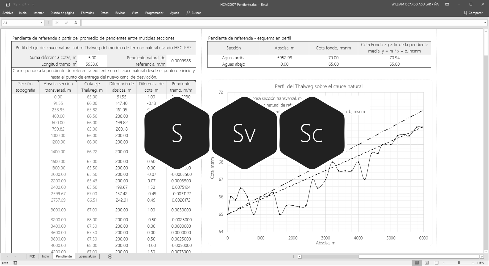

En caso de que existan restricciones de trazado y sea necesario utilizar una pendiente mayor a la pendiente del cauce natural existente a reemplazar, será necesario considerar el diseño del fondo del canal de realineamiento en la sección dominante utilizando estructuras de caída con o sin contra escalón, permitiendo así replicar la pendiente natural.

> Para el diseño geométrico del canal artificial, se recomienda utilizar la pendiente obtenida del eje del diseño sinuoso del río entre las secciones de referencia de inicio y entrega, para replicar así la longitud del cauce natural sin alterar la longitud del tránsito y el tiempo de concentración de la cuenca.

## Objetivos

* Estimar la longitud del tramo de río natural a reemplazar o realinear.
* Estimar la pendiente general de referencia para el canal dominante.
* Estimar la pendiente ponderada a partir de la posición de las secciones transversales de muestreo.
* Definir la pendiente de diseño a utilizar para el cauce dominante.
* Evaluar la pendiente que regirá el tránsito de las crecientes por el valle.

## Requerimientos

Archivos, actividades previas, lecturas y herramientas requeridas para el desarrollo de esta actividad:

| Requerimiento                                                                                                                                 | Descripción                                                                                 |
|:----------------------------------------------------------------------------------------------------------------------------------------------|:--------------------------------------------------------------------------------------------|
| [:toolbox:Herramienta](https://www.microsoft.com/es/microsoft-365/excel?market=bz)                                                            | Microsoft Excel 365.                                                                        |
| [:toolbox:Herramienta](https://www.hec.usace.army.mil/software/hec-ras/)                                                                      | HEC-RAS 6.6 o superior.                                                                     |
| [:open_file_folder:R.HydroTools.PendienteCauceValle.xlsx](https://github.com/rcfdtools/R.HydroTools/tree/main/tool/PendienteCauceValle)       | Libro de cálculo para análisis de pendientes.                                               |
| [:open_file_folder:Modelo hidráulico HECRAS_v0](../../file/hec)                                                                               | Modelo hidráulico de muestreo HEC-RAS v0 creado en actividad [M01A05](../M01A05/Readme.md). |

> Para los diferentes avances de proyecto, es necesario guardar y publicar las diferentes versiones generadas del (los) libro (s) de Microsoft Excel y reportes o informes, agregando al final la fecha de control documental en formato aaaammdd, p. ej. _R.HydroTools.DisenoCaucesParametros.20250528.xlsx_.

## 1. Pendiente tramo cauce sinuoso natural a reemplazar a partir de sección inicio / entrega

Utilizando como referencia las abscisas de inicio y entrega del [modelo hidráulico de muestreo HEC-RAS v0](../../file/hec) evaluadas en la actividad anterior, correspondientes a 9944 m y 3253 m, la longitud del cauce natural a reemplazar o Delta X es de 6691 metros, la longitud vectorial del tramo a reemplazar corresponde a 6689.9 metros. A partir de las cotas de fondo de la sección de inicio y entrega correspondientes a 64.5 m y 70.5 m, el Delta Y del cauce natural es 6 metros. 

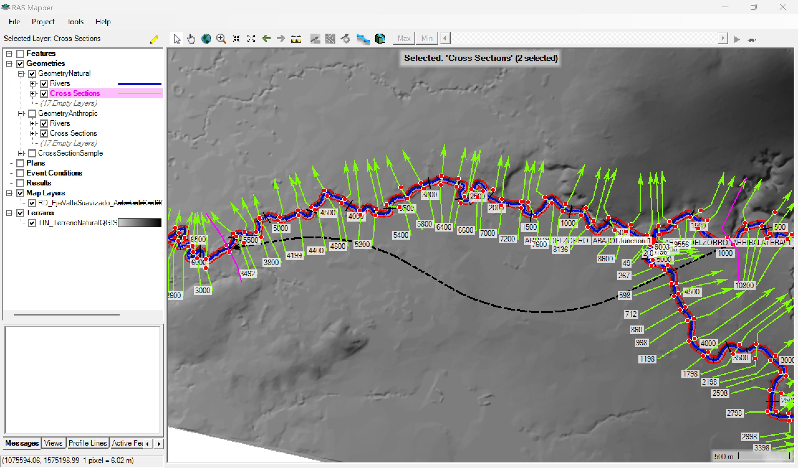

 S = ΔY / ΔX 

En el libro de Microsoft Excel [R.HydroTools.PendienteCauceValle.xlsx](https://github.com/rcfdtools/R.HydroTools/tree/main/tool/PendienteCauceValle), registre la longitud y diferencia de nivel obtenida, obteniendo una pendiente de 0.0008969 m/m.

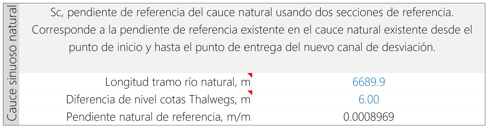

## 2. Pendiente valle suavizado de realineamiento a partir de sección inicio / entrega

En la actividad [M01A03](../M01A03), realizamos el trazado y suavizado del valle de realineamiento, obteniendo una longitud de valle suavizado correspondiente a 5158.536 metros. Para la diferencia de nivel Y entre las secciones de inicio y entrega, el valor de pendiente de diseño del valle equivale a 0.0011631 m/m. Registre los valores en el libro de Excel.

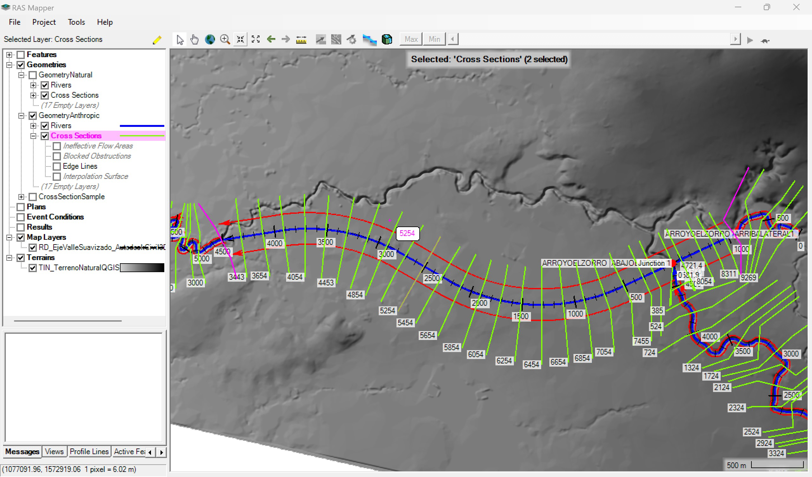

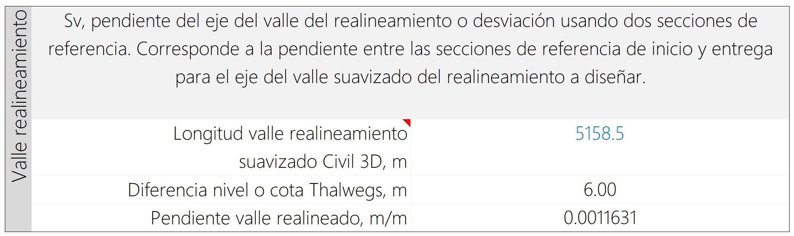

## 3. Pendiente promedio a partir de múltiples secciones transversales

Utilizando como referencia las cotas de fondo del Thalweg obtenidas a partir de la cota más baja entre bancas en cada sección y la separación entre secciones del [modelo hidráulico de muestreo HEC-RAS v0](../../file/hec), estimar la pendiente ponderada.

1. En HEC-RAS, abra el visor 2D de _Geometry Data_ y la geometría _GeometryNatural_.

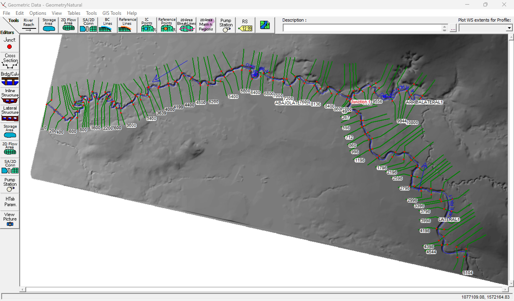

2. Seleccione el cauce natural y cree visualice el perfil de los dos tramos del cauce principal.

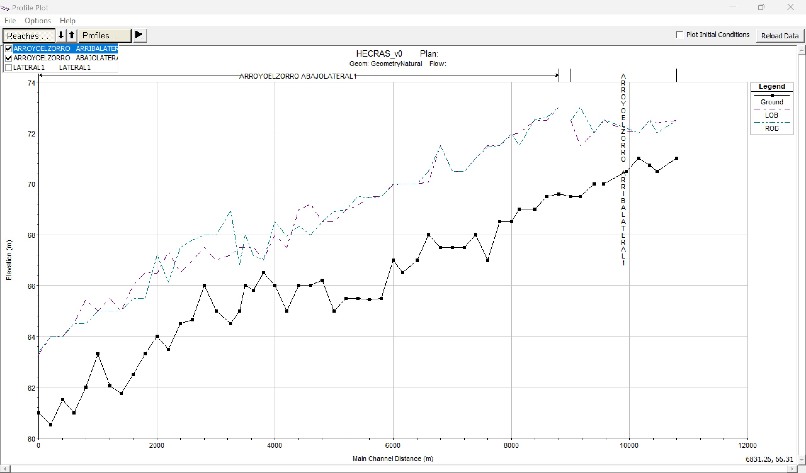

3. En el menú _File_, seleccione la herramienta _Copy Values To Clipboard_. En un nuevo libro de Microsoft Excel, pegue estos valores. Podrá observar que las columnas Ground, LOB y ROB contienen las abscisas y las cotas del Thalweg y cota en las bancas izquierda y derecha. Elimine las filas duplicadas y vacías.

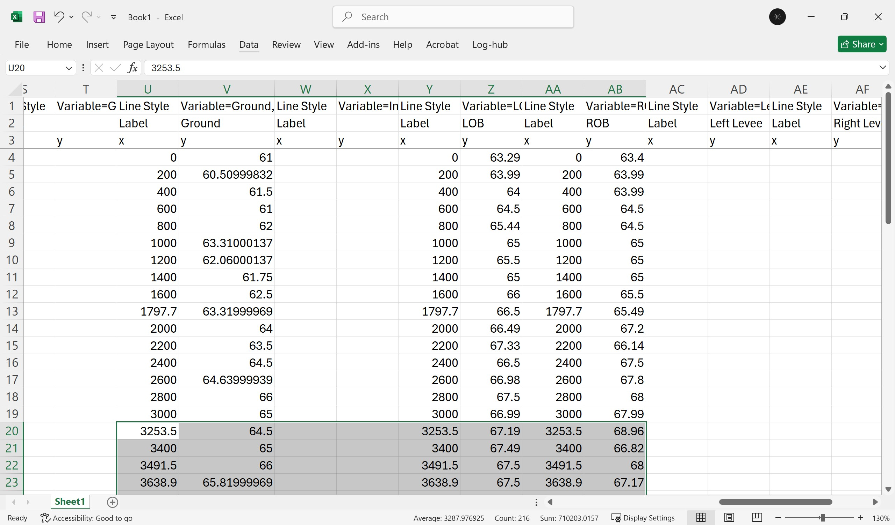

4. En el libro de Excel de análisis de pendiente, pegue los valores de terreno o ground correspondiente a las filas entre las abscicas 3253 y 9944 m. Automáticamente serán calculadas las diferencias entre abscisas, diferencias entre cotas, pendientes por pares de secciones y la pendiente promedio correpondiente a 0.0010469 m/m para una longitud de tramo de 6617.5 metros. 

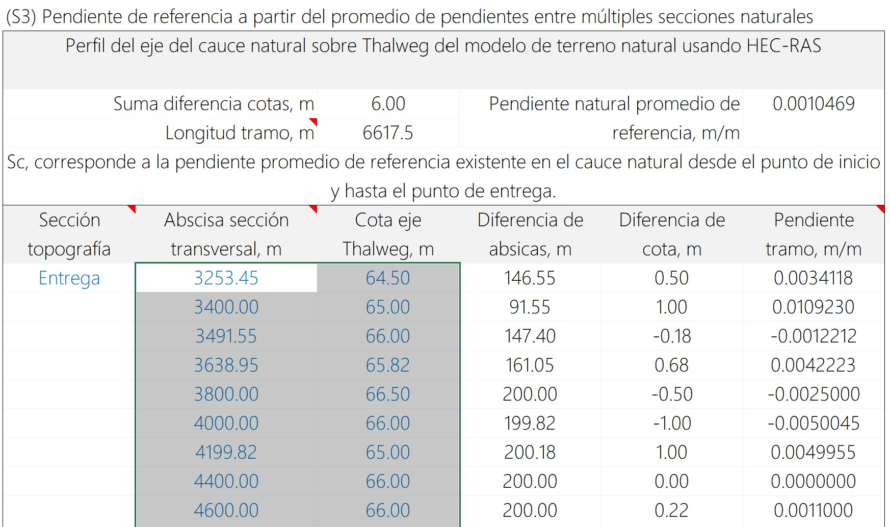

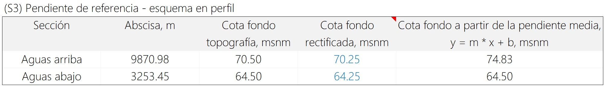

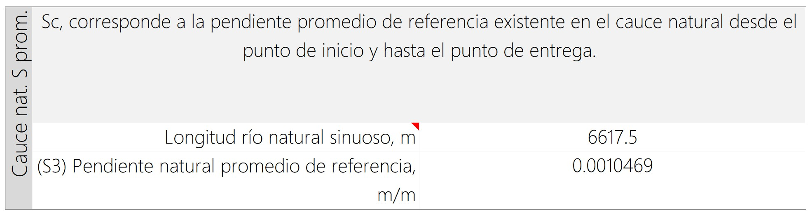

## 4. Análisis de pendiente de diseño

> El libro de análisis permite el registro de datos correspondientes a la longitud del posterior cauce sinuoso trazado en Autodesk Civil 3D, la diferencia de cotas entre las secciones de inicio y entrega del valle y la obtención y verificación de la pendiente final del corredor. Estos valores deberán ser similares a los del cauce natural a reemplazar y deberán ser registrados una vez se realice su trazado.

A partir de los análisis, las pendientes a considerar en el diseño son:

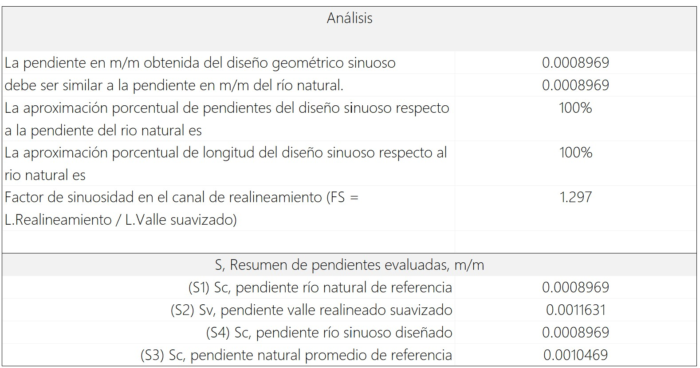

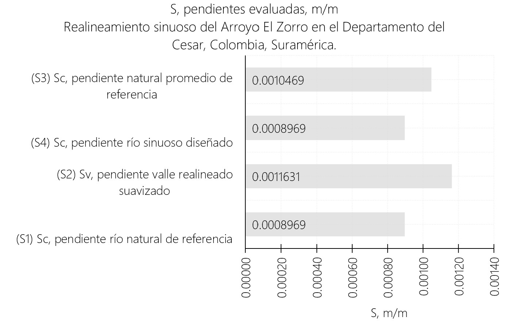

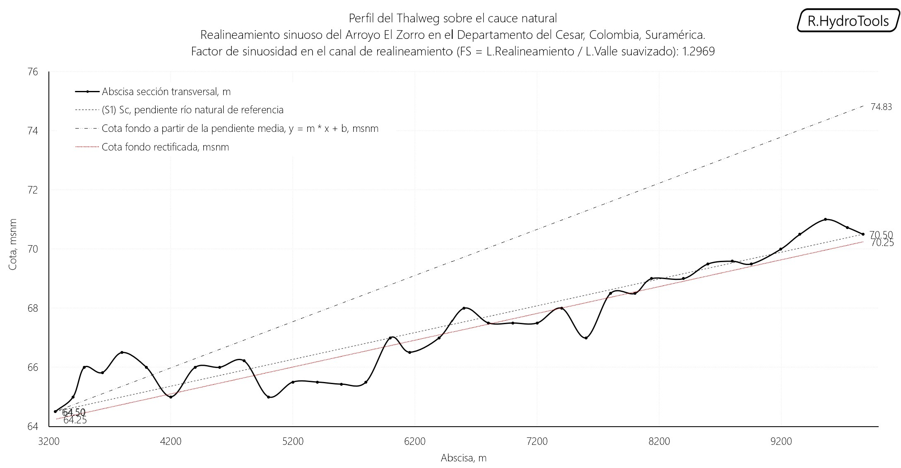

Para el diseño del cauce sinuoso, utilizaremos como referencia una pendiente de 0.0008969 m/m para replicar la pendiente del cauce natural actual a reemplazar.

## Actividades de proyecto :triangular_ruler:

Utilizando la [plantilla suministrada](../../file/report/R.HCMC.PlantillaSoporteDesarrollo.docx), cree un documento soporte mostrando las actividades desarrolladas en el orden presentado en esta actividad, junto con los análisis y recomendaciones realizadas, convierta a Adobe Acrobat (.pdf) y guarde en la carpeta _/activity_ del repositorio de datos del proyecto; nombre el archivo con el código de la actividad agregando al final la fecha de control documental en formato aaaammdd (p. ej. M01A00_20250531.pdf).

En la siguiente tabla se listan las actividades que deben ser desarrolladas y documentadas por cada estudiante o grupo de proyecto.

| Actividad | Alcance                                                                                                                                                                                                                                                                                                                                                                                                                                                                                                                                              |
|:----------|:-----------------------------------------------------------------------------------------------------------------------------------------------------------------------------------------------------------------------------------------------------------------------------------------------------------------------------------------------------------------------------------------------------------------------------------------------------------------------------------------------------------------------------------------------------|
| M01A07    | Estimar la pendiente natural existente a partir de las secciones naturales de inicio y entrega.                                                                                                                                                                                                                                                                                                                                                                                                                                                      | 
| M01A07    | Estimar la pendiente del valle suavizado.                                                                                                                                                                                                                                                                                                                                                                                                                                                                                                            | 
| M01A07    | Estimar la pendiente media por subtramos a partir de secciones transversales de muestreo.                                                                                                                                                                                                                                                                                                                                                                                                                                                                                                            | 
| M01A07    | Definir y justificar técnicamente la pendiente de diseño del cauce sinuoso artificial.                                                                                                                                                                                                                                                                                                                                                                                                                                                                                                            | 
| M01A07    | Investigar consideraciones generales para la definición de la pendiente de diseño, incluir referencias y enlaces a fuentes consultadas.                                                                                                                                                                                                                                                                                                                                                                                                                                                                                                           | 
| M01A07    | Registrar los valores obtenidos en el [libro de parámetros generales](https://github.com/rcfdtools/R.HydroTools/tree/main/tool/DisenoCaucesParametros) requeridos para el diseño y la modelación. Guardar en la carpeta _file/table_.                                                                                                                                                                                                                                                                                                                |
| M01A07    | Opcional: verificar la formulación correcta de los libros de cálculo suministrados. En las notas de la ficha de control documental indicar el método de verificación y si se requieren o no ajustes.                                                                                                                                                                                                                                                                                                                                                 |
| M01A07    | En una tabla y al final del informe de avance de esta entrega, indique el detalle de las actividades realizadas por cada integrante de su grupo; utilice las siguientes columnas: `Nombre del integrante`, `Actividades realizadas`, `Tiempo dedicado en horas` (si presenta la entrega individualmente, no es necesaria la presentación de esta tabla).  Para actividades que no requieren del desarrollo de elementos de avance, indicar si realizo la lectura de la guía de clase y las lecturas indicadas al inicio en los requerimientos. | 

> Nota 1: para la revisión del proyecto final, guarde los libros cálculo de Microsoft Excel y los archivos generados en esta actividad, en las localizaciones indicadas en cada numeral.
>
> Nota 2: una vez el instructor realice la revisión y el estudiante presente las correcciones o ajustes solicitados, será necesario cargar una nueva versión de los archivos en el repositorio del proyecto, incluyendo o actualizando al final del nombre del archivo, la fecha de presentación en formato aaaammdd y manteniendo las versiones anteriores presentadas.
>

## Referencias

* https://www.hec.usace.army.mil/software/hec-ras/documentation/HEC-RAS_Hydraulic_Reference_Manual_v6.5.pdf

## Control de versiones

| Versión    | Descripción        | Autor                                      | Horas |
|------------|:-------------------|--------------------------------------------|:-----:|
| 2025.06.04 | Migración a GitHub | [rcfdtools](https://github.com/rcfdtools)  |   4   |

##

_R.HCMC es de uso libre para fines académicos, conoce nuestra licencia, cláusulas, condiciones de uso y como referenciar los contenidos publicados en este repositorio, dando [clic aquí](../../LICENSE.md)._

_¡Encontraste útil este repositorio!, apoya su difusión marcando este repositorio con una ⭐ o síguenos dando clic en el botón Follow de [rcfdtools](https://github.com/rcfdtools) en GitHub._

| [:arrow_backward: Anterior](../M01A06/Readme.md) | [:house: Inicio](../../README.md) | [:beginner: Ayuda / Colabora](https://github.com/rcfdtools/R.SIGE/discussions/99999) | [Siguiente :arrow_forward:](../M01A08/Readme.md) |
|--------------------------------------------------|-----------------------------------|--------------------------------------------------------------------------------------|--------------------------------------------------|

[^1]: 