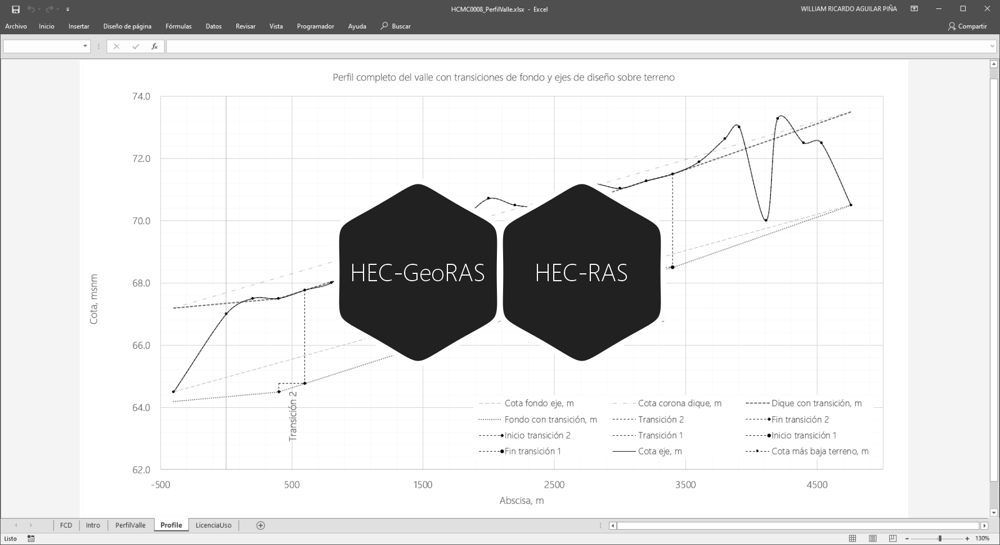
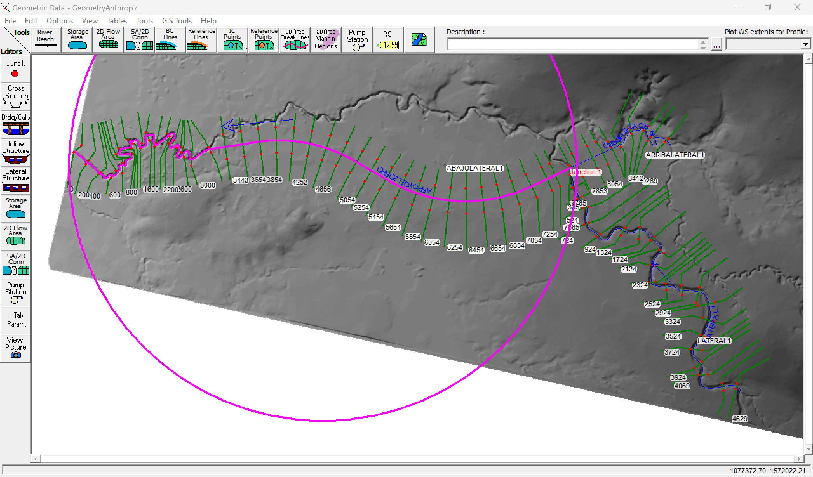
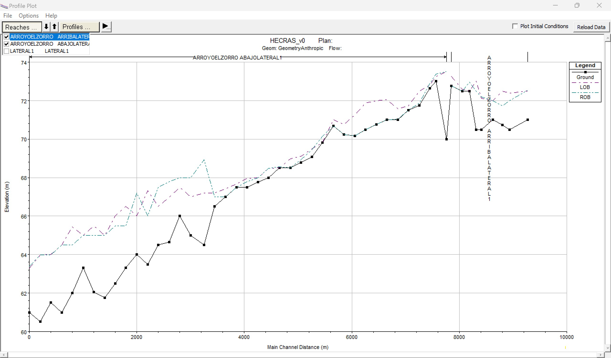
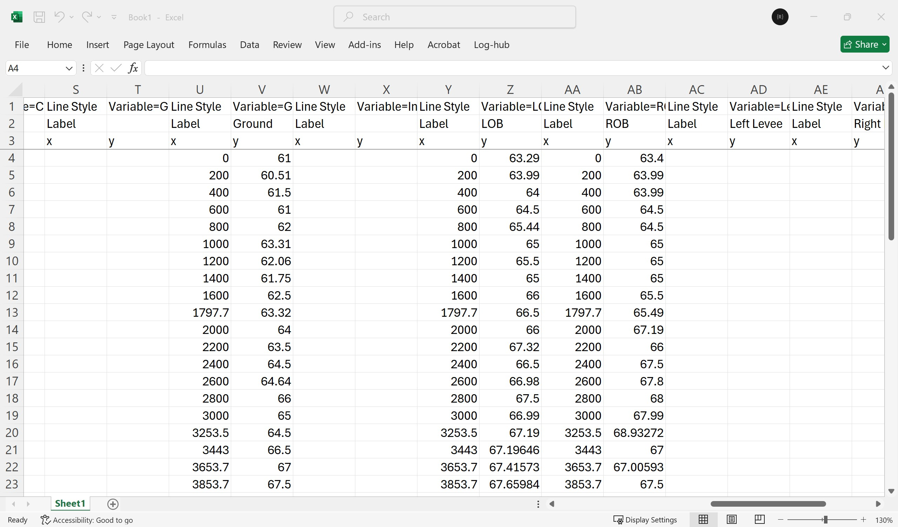
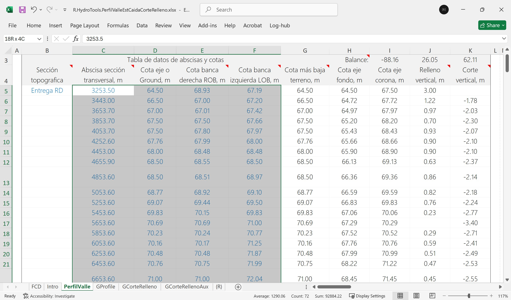
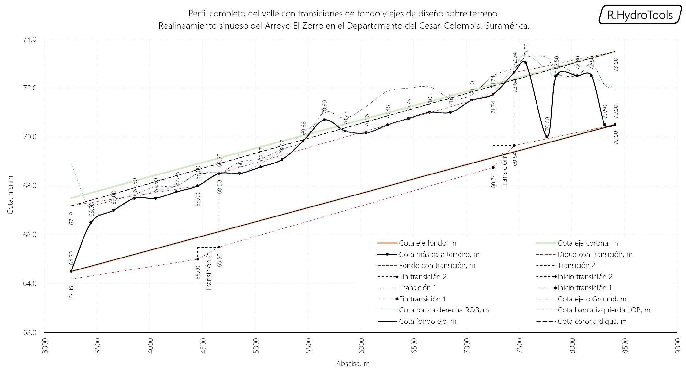

# 1.8. Perfil de terreno del valle, evaluación de estructuras de caída y análisis de corte vs. relleno
Keywords: `realigment`  `m01a00`

A partir de la información topográfica disponible bajo la zona del eje del valle suavizado trazado y utilizando las secciones transversales del modelo de muestreo en HEC-RAS, establecer si el canal artificial a diseñar estará en corte y/o relleno. El procedimiento presentado analiza solo el corte del valle y el posible uso de estructuras de caída para ajuste de pendiente.

## Objetivos

* Visualizar el perfil del eje de valle suavizado sobre el terreno natural que será cortado.
* Trazar los ejes de fondo, corona y posibles estructuras de caída por escalón.
* Analizar preliminarmente las zonas de corte y relleno.

## Requerimientos

Archivos, actividades previas, lecturas y herramientas requeridas para el desarrollo de esta actividad:

| Requerimiento                                                                                                                                                   | Descripción                                                                                                                 |
|:----------------------------------------------------------------------------------------------------------------------------------------------------------------|:----------------------------------------------------------------------------------------------------------------------------|
| [:toolbox:Herramienta](https://www.microsoft.com/es/microsoft-365/excel?market=bz)                                                                              | Microsoft Excel 365.                                                                                                        |
| [:toolbox:Herramienta](https://www.hec.usace.army.mil/software/hec-ras/)                                                                                        | HEC-RAS 6.6 o superior.                                                                                                     |
| [:open_file_folder:R.HydroTools.PerfilValleEstCaidaCorteRelleno.xlsx](https://github.com/rcfdtools/R.HydroTools/tree/main/tool/PerfilValleEstCaidaCorteRelleno) | Libro de cálculo para el análisis del perfil del valle, evaluación de estructuras de caída y análisis de corte vs. relleno. |
| [:open_file_folder:Modelo hidráulico HECRAS_v0](../../file/hec)                                                                                                 | Modelo hidráulico de muestreo HEC-RAS v0 creado en actividad [M01A05](../M01A05/Readme.md). |

> Para los diferentes avances de proyecto, es necesario guardar y publicar las diferentes versiones generadas del (los) libro (s) de Microsoft Excel y reportes o informes, agregando al final la fecha de control documental en formato aaaammdd, p. ej. _R.HydroTools.DisenoCaucesParametros.20250528.xlsx_.

## 0. Consideraciones generales para el análisis

* Para obtener el perfil por los puntos más bajos de cada sección correspondientes al Thalweg, previamente creamos el modelo hidráulico de muestreo en HEC-RAS v0 que contiene ejes de río, bancas y secciones transversales para el canal corredor del nuevo valle. La localización de la posición de las bancas fue ajustada manualmente para obtener los puntos más bajos en cada corredor. Para obtener en HEC-RAS las abscisas y las cotas asociadas de eje y bancas, en la ventana de visualización de perfiles ir a _File_ y seleccionar la opción _Copy Values to Clipboard_. El abscisado de secciones transversales en HEC-RAS siempre se realiza en el sentido inverso del flujo, aguas abajo en el punto de salida se encuentra la abscisa cero y aguas arriba la abscisa correspondiente al punto de inicio del realineamiento.
* El análisis de cortes y rellenos se calcula a partir de la diferencia entre la línea proyectada del fondo continuo y la cota del terreno natural.
* La relación de corte vs. relleno permite identificar si el alineamiento del valle requiere o no de un nuevo trazado para buscar la condición de equilibrio o garantizar que el nuevo canal se encuentre mayoritariamente en corte debido a que pueden existir restricciones de disponibilidad de material para la conformación del canal.
* Es necesario identificar las cotas de fondo de los cauces laterales en el punto de entrega al nuevo eje suavizado de valle e identificar si se encuentran entregado a fondo o por encima. En caso de que la cota de fondo de un cauce lateral esté entregando por debajo de la línea proyectada de fondo del valle, será necesario incluir una estructura de caída para que el cauce pueda entregar a fondo o por encima.
* Para canales prismáticos en los que no se realiza diseño sinuoso para la fracción correspondiente al cauce dominante, podrá como diseñador proponer e incluir estructuras de caída para reducir la pendiente.

## 1. Perfil longitudinal del eje del valle suavizado

1. Abra el modelo de muestreo [HECRAS_v0](../../file/hec) y desde el editor _Geometry Data_, cargue la geometría GeometryAnthropic.

2. Seleccione el eje correspondiente al valle suavizado y visualice el perfil completo del río.

3. Desde el menú _File_, copie los datos del perfil en el portapapeles con la opción _Copy Values to Clipboard_ y pegue en un libro de Excel en blanco. Localice las columnas Ground, LOB y ROB que contienen los valores XY de abscisado y cota de terreno y bancas; elimine registros duplicados y celdas en blanco. 

4. En el libro de análisis [R.HydroTools.PerfilValleEstCaidaCorteRelleno.xlsx](https://github.com/rcfdtools/R.HydroTools/tree/main/tool/PerfilValleEstCaidaCorteRelleno), registre los valores entre las secciones 3253 m y 8412 m.

5. Visualice el perfil del valle, podrá observar que en el punto de inicio y entrega, las cotas 70.5 m y 64.5 m corresponden a los valores evaluados en actividades anteriores y la entrega del cauce lateral.

## Actividades de proyecto :triangular_ruler:

Utilizando la [plantilla suministrada](../../file/report/R.HCMC.PlantillaSoporteDesarrollo.docx), cree un documento soporte mostrando las actividades desarrolladas en el orden presentado en esta actividad, junto con los análisis y recomendaciones realizadas, convierta a Adobe Acrobat (.pdf) y guarde en la carpeta _/activity_ del repositorio de datos del proyecto; nombre el archivo con el código de la actividad agregando al final la fecha de control documental en formato aaaammdd (p. ej. M01A00_20250531.pdf).

En la siguiente tabla se listan las actividades que deben ser desarrolladas y documentadas por cada estudiante o grupo de proyecto.

| Actividad | Alcance                                                                                                                                                                                                                                                                                                                                                                                                                                                                                                                                              |
|:----------|:-----------------------------------------------------------------------------------------------------------------------------------------------------------------------------------------------------------------------------------------------------------------------------------------------------------------------------------------------------------------------------------------------------------------------------------------------------------------------------------------------------------------------------------------------------|
| M01A00    | Descargar el archivo [R.HydroTools.DisenoCaucesParametros.xlsx](https://github.com/rcfdtools/R.HydroTools/blob/main/tool/DisenoCaucesParametros/R.HydroTools.DisenoCaucesParametros.xlsx) disponible en GitHub, e incluirlo en el repositorio.                                                                                                                                                                                                                                                                                                       | 
| M01A00    | Investigar, verificar y registrar en el libro de Excel, los parámetros técnicos, hidráulicos e hidrológicos indicados en esta actividad.  Para el grupo de parámetros normativos, ambientales / sociales y territoriales, revisar los parámetros actualmente reportados, investigar, registrar y actualizar.                                                                                                                                                                                                                                   | 
| M01A00    | Registrar los valores obtenidos en el [libro de parámetros generales](https://github.com/rcfdtools/R.HydroTools/tree/main/tool/DisenoCaucesParametros) requeridos para el diseño y la modelación. Guardar en la carpeta _file/table_.                                                                                                                                                                                                                                                                                                                |
| M01A00    | Opcional: verificar la formulación correcta de los libros de cálculo suministrados. En las notas de la ficha de control documental indicar el método de verificación y si se requieren o no ajustes.                                                                                                                                                                                                                                                                                                                                                 |
| M01A00    | En una tabla y al final del informe de avance de esta entrega, indique el detalle de las actividades realizadas por cada integrante de su grupo; utilice las siguientes columnas: `Nombre del integrante`, `Actividades realizadas`, `Tiempo dedicado en horas` (si presenta la entrega individualmente, no es necesaria la presentación de esta tabla).  Para actividades que no requieren del desarrollo de elementos de avance, indicar si realizo la lectura de la guía de clase y las lecturas indicadas al inicio en los requerimientos. | 

> Nota 1: para la revisión del proyecto final, guarde los libros cálculo de Microsoft Excel y los archivos generados en esta actividad, en las localizaciones indicadas en cada numeral.
>
> Nota 2: una vez el instructor realice la revisión y el estudiante presente las correcciones o ajustes solicitados, será necesario cargar una nueva versión de los archivos en el repositorio del proyecto, incluyendo o actualizando al final del nombre del archivo, la fecha de presentación en formato aaaammdd y manteniendo las versiones anteriores presentadas.
>

## Referencias

* 

## Control de versiones

| Versión    | Descripción        | Autor                                      | Horas |
|------------|:-------------------|--------------------------------------------|:-----:|
| 2024.02.24 | Migración a GitHub | [rcfdtools](https://github.com/rcfdtools)  |   8   |
| 2014.01.11 | Versión inicial.   | [rcfdtools](https://github.com/rcfdtools)  |  18   |

##

_R.HCMC es de uso libre para fines académicos, conoce nuestra licencia, cláusulas, condiciones de uso y como referenciar los contenidos publicados en este repositorio, dando [clic aquí](../../LICENSE.md)._

_¡Encontraste útil este repositorio!, apoya su difusión marcando este repositorio con una ⭐ o síguenos dando clic en el botón Follow de [rcfdtools](https://github.com/rcfdtools) en GitHub._

| [:arrow_backward: Anterior](../M01A00/Readme.md) | [:house: Inicio](../../README.md) | [:beginner: Ayuda / Colabora](https://github.com/rcfdtools/R.SIGE/discussions/99999) | [Siguiente :arrow_forward:](../M01A02/Readme.md) |
|--------------------------------------------------|-----------------------------------|--------------------------------------------------------------------------------------|--------------------------------------------------|

[^1]: 