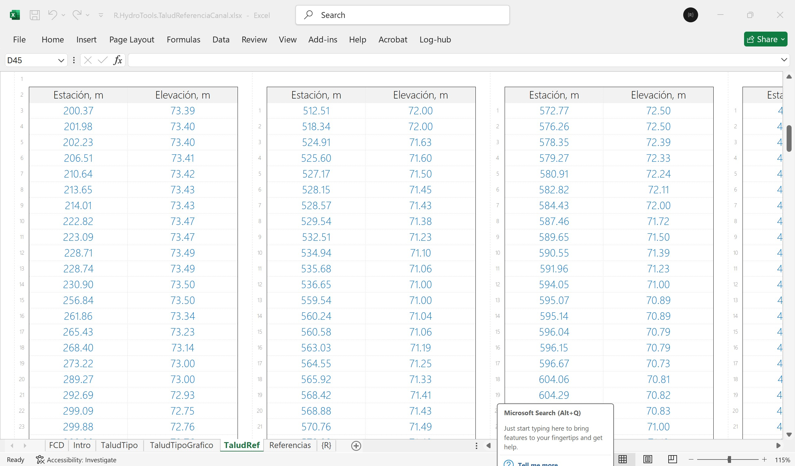

# 1.9. Evaluación de taludes de referencia para diseño a partir de secciones transversales de cauces naturales
Keywords: `side-slope`  `m01a09`

A partir de la información topográfica disponible y de las secciones transversales trazadas en el modelo de muestreo HEC-RAS v0 arriba del punto de inicio y abajo del punto de entrega sobre cauces naturales existentes y en cauces laterales, estudiar la inclinación actual de los taludes que será utilizada como referencia para el diseño del canal artificial compuesto, correspondiente al talud estable del cauce natural luego de todos los procesos erosivos y de sedimentación.

## Objetivos

* Identificar las secciones para el muestreo.
* Obtener valores de estación elevación para cada sección.
* Analizar los taludes existentes.
* Establecer y justificar los taludes de diseño.

## Requerimientos

Archivos, actividades previas, lecturas y herramientas requeridas para el desarrollo de esta actividad:

| Requerimiento                                                                                                                               | Descripción                                                                                                                                  |
|:--------------------------------------------------------------------------------------------------------------------------------------------|:---------------------------------------------------------------------------------------------------------------------------------------------|
| [:toolbox:Herramienta](https://www.microsoft.com/es/microsoft-365/excel?market=bz)                                                          | Microsoft Excel 365.                                                                                                                         |
| [:toolbox:Herramienta](https://www.hec.usace.army.mil/software/hec-ras/)                                                                    | HEC-RAS 6.6 o superior.                                                                                                                      |
| [:open_file_folder:R.HydroTools.TaludReferenciaCanal.xlsx](https://github.com/rcfdtools/R.HydroTools/tree/main/tool/TaludReferenciaCanal)   | Libro de cálculo para la evaluación de taludes de referencia para diseño de sección a partir de secciones transversales de cauces naturales. |
| [:open_file_folder:Modelo hidráulico HECRAS_v0](../../file/hec)                                                                             | Modelo hidráulico de muestreo HEC-RAS v0 creado en actividad [M01A05](../M01A05/Readme.md).                                                  |

> Para los diferentes avances de proyecto, es necesario guardar y publicar las diferentes versiones generadas del (los) libro (s) de Microsoft Excel y reportes o informes, agregando al final la fecha de control documental en formato aaaammdd, p. ej. _R.HydroTools.DisenoCaucesParametros.20250528.xlsx_.

## 0. Consideraciones generales

Para el análisis, tenga en cuenta las siguientes consideraciones:

* Para el diseño geométrico del canal de realineamiento, se consideran válidos, taludes de diseño con relación H:V mayor a la encontrada en las secciones naturales, obteniendo taludes más tendidos en los que existirá menor riesgo de arrastre de material, erosión, socavación, volcamiento o falla.
* Para el estudio de los taludes de referencia, en el libro de análisis se pueden utilizar las columnas del talud izquierdo para el análisis de las secciones del cauce dominante y las columnas derechas para el talud del valle o de creciente.
* En el análisis puede incluir secciones transversales representativas en cauces laterales o en la zona del canal natural a reemplazar.
* Se recomienda analizar en la columna de talud izquierdo, los taludes correspondientes al cauce dominante y en la columna derecha los correspondientes al talud del valle o de creciente.

Esquema de sección trapezoidal 

Taludes y tipos de recubrimiento 

Taludes por inclinación 

## 1. Identificación de secciones a utilizar

1. En HEC-RAS, abra el modelo hidráulico de muestreo y en RAS Mapper, seleccione como mínimo 10 secciones transversales naturales y abra la tabla de atributos para identificar sus abscisas.

2. En el libro de análisis [R.HydroTools.TaludReferenciaCanal.xlsx](https://github.com/rcfdtools/R.HydroTools/tree/main/tool/TaludReferenciaCanal), registre los valores estación / elevación de cada una de las secciones identificadas. Para ello, utilice el editor _Geometry Data_ y la ventana de edición de secciones transversales.

## 2. Localización de líneas de referencia de talud

1. En cada sección, defina las estaciones iniciales y finales a lado izquierdo y derecho que permiten identificar la localización de la línea de referencia de talud,

2. Visualice y ajuste las líneas de referencia de taludes.

3. Revise la tabla resúmen de taludes izquierdos y derechos, defina y justifique la relación de taludes a utilizar en el diseño de la sección compuesta.

De acuerdo al análisis de taludes en secciones naturales, el talud típico en la zona del canal dominante es de aproximadamente 14:1 (por cada metro en la vertical, 14 metros en la horizontal). Para el diseño del canal dominante utilizar taludes con la misma relación.

## Actividades de proyecto :triangular_ruler:

Utilizando la [plantilla suministrada](../../file/report/R.HCMC.PlantillaSoporteDesarrollo.docx), cree un documento soporte mostrando las actividades desarrolladas en el orden presentado en esta actividad, junto con los análisis y recomendaciones realizadas, convierta a Adobe Acrobat (.pdf) y guarde en la carpeta _/activity_ del repositorio de datos del proyecto; nombre el archivo con el código de la actividad agregando al final la fecha de control documental en formato aaaammdd (p. ej. M01A00_20250531.pdf).

En la siguiente tabla se listan las actividades que deben ser desarrolladas y documentadas por cada estudiante o grupo de proyecto.

| Actividad | Alcance                                                                                                                                                                                                                                                                                                                                                                                                                                                                                                                                              |
|:----------|:-----------------------------------------------------------------------------------------------------------------------------------------------------------------------------------------------------------------------------------------------------------------------------------------------------------------------------------------------------------------------------------------------------------------------------------------------------------------------------------------------------------------------------------------------------|
| M01A00    | Descargar el archivo [R.HydroTools.DisenoCaucesParametros.xlsx](https://github.com/rcfdtools/R.HydroTools/blob/main/tool/DisenoCaucesParametros/R.HydroTools.DisenoCaucesParametros.xlsx) disponible en GitHub, e incluirlo en el repositorio.                                                                                                                                                                                                                                                                                                       | 
| M01A00    | Investigar, verificar y registrar en el libro de Excel, los parámetros técnicos, hidráulicos e hidrológicos indicados en esta actividad.  Para el grupo de parámetros normativos, ambientales / sociales y territoriales, revisar los parámetros actualmente reportados, investigar, registrar y actualizar.                                                                                                                                                                                                                                   | 
| M01A00    | Registrar los valores obtenidos en el [libro de parámetros generales](https://github.com/rcfdtools/R.HydroTools/tree/main/tool/DisenoCaucesParametros) requeridos para el diseño y la modelación. Guardar en la carpeta _file/table_.                                                                                                                                                                                                                                                                                                                |
| M01A00    | Opcional: verificar la formulación correcta de los libros de cálculo suministrados. En las notas de la ficha de control documental indicar el método de verificación y si se requieren o no ajustes.                                                                                                                                                                                                                                                                                                                                                 |
| M01A00    | En una tabla y al final del informe de avance de esta entrega, indique el detalle de las actividades realizadas por cada integrante de su grupo; utilice las siguientes columnas: `Nombre del integrante`, `Actividades realizadas`, `Tiempo dedicado en horas` (si presenta la entrega individualmente, no es necesaria la presentación de esta tabla).  Para actividades que no requieren del desarrollo de elementos de avance, indicar si realizo la lectura de la guía de clase y las lecturas indicadas al inicio en los requerimientos. | 

> Nota 1: para la revisión del proyecto final, guarde los libros cálculo de Microsoft Excel y los archivos generados en esta actividad, en las localizaciones indicadas en cada numeral.
>
> Nota 2: una vez el instructor realice la revisión y el estudiante presente las correcciones o ajustes solicitados, será necesario cargar una nueva versión de los archivos en el repositorio del proyecto, incluyendo o actualizando al final del nombre del archivo, la fecha de presentación en formato aaaammdd y manteniendo las versiones anteriores presentadas.
>

## Referencias

* INVIAS. Manual de drenaje para carreteras. Tabla 4.8.
* RAS Título B Sistemas de Acueducto. Tabla B 4.4.
* Dado el contenido de material cohesivo, en el ángulo de reposo del material solo debe ser considerado materiales gruesos no cohesivos. Ref: Ven Te Chow. Hidráulicas de Canales Abiertos. página 169.

## Control de versiones

| Versión    | Descripción        | Autor                                      | Horas |
|------------|:-------------------|--------------------------------------------|:-----:|
| 2024.02.24 | Migración a GitHub | [rcfdtools](https://github.com/rcfdtools)  |   8   |
| 2014.01.11 | Versión inicial.   | [rcfdtools](https://github.com/rcfdtools)  |  18   |

##

_R.HCMC es de uso libre para fines académicos, conoce nuestra licencia, cláusulas, condiciones de uso y como referenciar los contenidos publicados en este repositorio, dando [clic aquí](../../LICENSE.md)._

_¡Encontraste útil este repositorio!, apoya su difusión marcando este repositorio con una ⭐ o síguenos dando clic en el botón Follow de [rcfdtools](https://github.com/rcfdtools) en GitHub._

| [:arrow_backward: Anterior](../M01A00/Readme.md) | [:house: Inicio](../../README.md) | [:beginner: Ayuda / Colabora](https://github.com/rcfdtools/R.SIGE/discussions/99999) | [Siguiente :arrow_forward:](../M01A02/Readme.md) |
|--------------------------------------------------|-----------------------------------|--------------------------------------------------------------------------------------|--------------------------------------------------|

[^1]: 