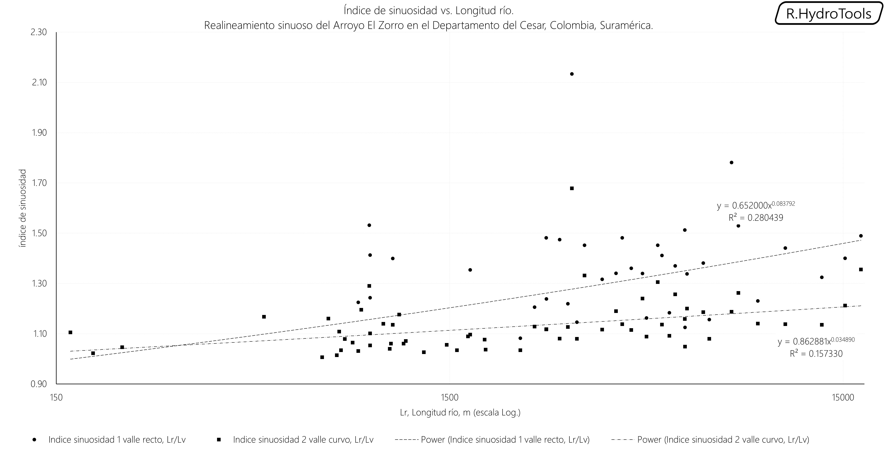
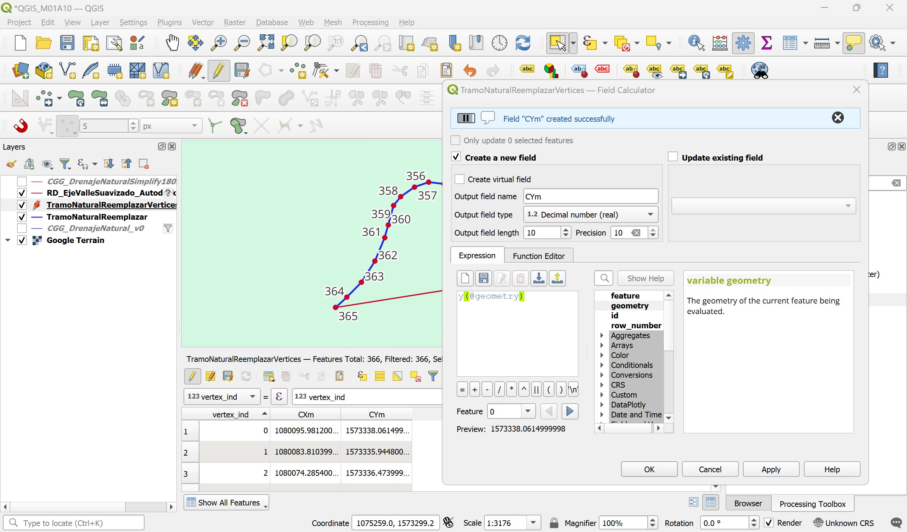
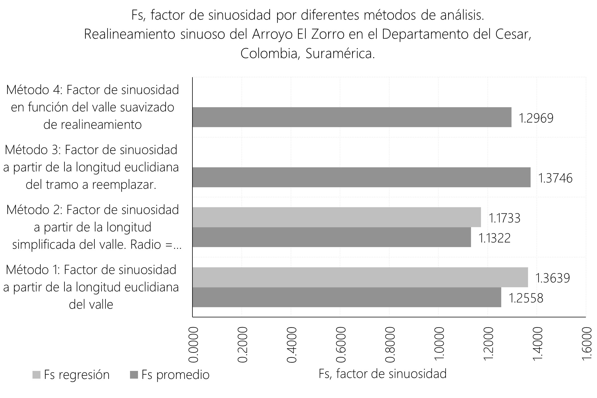

# 1.10. Evaluación y análisis de la sinuosidad en cauces naturales existentes de la zona de estudio
Keywords: `sinuosity`  `m01a10`

A partir de las líneas de drenaje restituidas y las líneas esquemáticas que representan tránsito hidrológico del modelo HEC-HMS, determinar el factor de sinuosidad por diferentes métodos geográficos.

## Objetivos

* Visualizar la red de drenaje natural.
* Estimar el factor de sinuosidad a partir de la longitud euclidiana del valle.
* Estimar el factor de sinuosidad a partir de la línea suavizada del valle.
* Estimar la sinuosidad a partir del tramo natural a reemplazar.

## Requerimientos

Archivos, actividades previas, lecturas y herramientas requeridas para el desarrollo de esta actividad:

| Requerimiento                                                                                                                                    | Descripción                                                                                 |
|:-------------------------------------------------------------------------------------------------------------------------------------------------|:--------------------------------------------------------------------------------------------|
| [:toolbox:Herramienta](https://www.microsoft.com/es/microsoft-365/excel?market=bz)                                                               | Microsoft Excel 365.                                                                        |
| [:toolbox:Herramienta](https://qgis.org/)                                                                                                        | QGIS 3.42 o superior.                                                                       |
| [:open_file_folder:R.HydroTools.SinuosidadCauceAnalisis.xlsx](https://github.com/rcfdtools/R.HydroTools/tree/main/tool/SinuosidadCauceAnalisis)  | Libro de cálculo para análisis de sinuosidad.                                               |

> Para los diferentes avances de proyecto, es necesario guardar y publicar las diferentes versiones generadas del (los) libro (s) de Microsoft Excel y reportes o informes, agregando al final la fecha de control documental en formato aaaammdd, p. ej. _R.HydroTools.DisenoCaucesParametros.20250528.xlsx_.

## Método 1: Estimación del factor de sinuosidad a partir de la longitud euclidiana del valle en cada río

1. En QGIS, cargue la capa de drenajes [CGG_DrenajeNatural_v0.shp](../../file/shp/CGG_DrenajeNatural_v0.zip), ajuste la simbología de representación y abra la tabla de atributos.

> Para proyectos en los que no se dispone de la red de drenaje: crear una capa de drenajes 2D digitalizando los cauces sobre una ortofoto o sobre un modelo de terreno lidar. La digitalización se debe realizar por tramos de río entre afluentes detallando las líneas meandriformes y en el sentido del flujo.

2. En la tabla de atributos de la capa geográfica de drenajes, crear y poblar los siguientes atributos numéricos reales con 10 dígitos de precisión:

| Atributo | Descripción                                                          | Cálculo geométrico                        |
|----------|----------------------------------------------------------------------|-------------------------------------------|
| LPm      | Longitud planar del tramo en metros.                                 | length(@geometry)                         |
| CXStart  | Coordenada plana X en metros del nodo inicial.                       | x(start_point(@geometry))                 |
| CYStart  | Coordenada plana Y en metros del nodo inicial.                       | y(start_point(@geometry))                 |
| CXEnd    | Coordenada plana X en metros del nodo final.                         | x(end_point(@geometry))                   |
| CYEnd    | Coordenada plana Y en metros del nodo final.                         | y(end_point(@geometry))                   |
| LValley  | Longitud euclidiana del valle en metros usando Teorema de Pitágoras. | ((CXStart-CXEnd)^2+(CYStart-CYEnd)^2)^0.5 |
| FS       | Factor de sinuosidad.                                                | LPm/LValley                               |

> Expresión LValley = `(( "CXStart" - "CXEnd" )^2+( "CYStart" - "CYEnd" )^2)^0.5`

3. Utilizando el complemento _DataPlotly_, cree una gráfica de análisis representando en las abscisas la longitud del río y en las ordenadas la longitud del valle, podrá observar que algunos nodos se encuentran dispersos indicando sinuosidades altas.

Cree también una gráfica LPm vs. FS, podrá observar que existe una dispersión alta entre los datos y un patrón de agrupamiento en ríos cortos.

4. Para este análisis se recomienda incluir solo los tramos de drenaje que se encuentran en la llanura. Para ello, agregue el mapa de base XYZ de Google Terrain desde la ruta https://mt1.google.com/vt/lyrs=p&x={x}&y={y}&z={z} y manualmente, seleccione solo estos drenajes. En la tabla de atributos cree un campo numérico entero con el nombre `EvalFS` y asigne 1 a los drenajes a evaluar y 0 a los excluídos.

5. Cree un campo numérico entero con le nombre _FeatureID_ y desde el calculador de campo asigne la propiedad _@id_, luego desde las propiedades de la capa y para todos los drenajes y a través del _Query Builder_, filtre los drenajes con `EvalFS = 1`. 

6. En el libro de análisis [R.HydroTools.SinuosidadCauceAnalisis.xlsx](https://github.com/rcfdtools/R.HydroTools/tree/main/tool/SinuosidadCauceAnalisis), registre los valores obtenidos en QGIS de código de río o `FeatureID`, longitud de río y longitud de valle en la tabla del Método 1, visualice la gráfica de análisis.

> :fire: Para la correcta obtención de los parámetros de la regresión, ajustar en la función de estimación lineal de Microsoft Excel, el rango de selección de las celdas correspondientes a la tabla de registros.

**Resultados**: el factor de sinuosidad promedio corresponde a un valor de 1.26 y para la longitud del cauce natural a reemplazar correspondiente a 6689.9 m y utilizando la regresión obtenida, el factor es 1.3639.

## Método 2: Factor de sinuosidad a partir de la longitud simplificada del valle. Radio 2 Km.

A diferencia del método anterior en el que utilizamos la longitud euclidiana del valle, en este método utilizaremos una simplificación del alineamiento que domina el recorrido del flujo en el valle por eventos de creciente, suponiendo que estos flujos mantienen la direccionalidad del corredor o ronda geo-morfométrica del cauce.

1. En QGIS, ejecute la herramienta _Processing Toolbox / Vector geometry / Simplify_ para simplificar la trayectoria de cada tramo de drenaje utilizando como tolerancia 1/10 del radio de curvatura para el suavizado del valle obtenido en la actividad [M01A03](../M01A03/Readme.md). Nombre la capa resultante como [/file/shp/CGG_DrenajeNaturalSimplify180m_v0.shp](../../file/shp/CGG_DrenajeNaturalSimplify180m_v0.zip).

> Recuerde que previamente realizamos un filtro excluyendo los drenajes de montaña cuyas sinuosidades pueden ser inferiores a las de los cauces de llanura,

2. En la tabla de atributos de la capa de líneas simplificadas, calcule en un campo numérico real (precisión 10) con el nombre `LValleySim`, la longitud geométrica planar de cada línea. 

6. En el libro de análisis [R.HydroTools.SinuosidadCauceAnalisis.xlsx](https://github.com/rcfdtools/R.HydroTools/tree/main/tool/SinuosidadCauceAnalisis), registre los valores obtenidos en QGIS de código de río o `FeatureID`, longitud de río y longitud de valle simplificado en la tabla del Método 2, visualice la gráfica de análisis.

> :fire: Para la correcta obtención de los parámetros de la regresión, ajustar en la función de estimación lineal de Microsoft Excel, el rango de selección de las celdas correspondientes a la tabla de registros.

**Resultados**: el factor de sinuosidad promedio corresponde a un valor de 1.13 y para la longitud del cauce natural a reemplazar correspondiente a 6689.9 m y utilizando la regresión obtenida, el factor es 1.1733.

Gráficos de comparación Método 1 y Método 2.

## Método 3: Factor de sinuosidad a partir de la longitud euclidiana del tramo a reemplazar

1. En QGIS, cargue al mapa la capa [RD_EjeValleSuavizado_AutodeskCivil3DClotoide.shp](../../file/shp/RD_EjeValleSuavizado_AutodeskCivil3DClotoide.zip) correspondiente al eje del valle suavizado. Utilice este eje como guía para la extracción del drenaje natural que será reemplazado.

2. Seleccione los tramos de drenaje natural a reemplazar y exporte a una nueva capa con el nombre [TramoNaturalReemplazar.shp](../../file/shp/TramoNaturalReemplazar.zip).

> Asegúrese de que el tramo exportado cubre la longitud completa desde el inicio y hasta el fin del valle, en caso de ser necesario, exporte los tramos naturales inmediatos aguar arriba y aguas abajo y luego con ayuda el editor de geometría, corte los extremos restantes usando la herramienta _Split_.

3. Abra la tabla de atributos de la capa exportada y verifique cuantos registros o líneas de drenaje contiene la capa, seleccione todos los registros y desde el editor de entidades, con la herramienta Merge, una los dos tramos.

4. En la tabla de atributos, recalcule todas las propiedades correspondientes a identificador, longitudes, factores y coordenadas. Obtendrá un factor de sinuosidad de 1.3746 a partir de la longitud del río y la longitud Euclidiana del valle.

5. Para obtener todos los nodos que componen la polí-línea del tramo natural a reemplazar, ejecute la herramienta _Vector geometry / Extract vertices_, nombre la capa resultante como [TramoNaturalReemplazarVertices.shp](../../file/shp/TramoNaturalReemplazarVertices.zip).

6. Rotule a partir del campo `vertex_ind` o campo de ordenamiento de nodos en el sentido del dibujo, luego, abra la tabla de atributos, active el editor y elimine todos los campos excepto el campo de numeración de nodos.

7. Cree dos campos de atributos numéricos reales (precisión 10) con los nombres CXm y CYm, y desde el calculador de campo obtenga las coordenadas proyectadas en metros usando las funciones `x(@geometry)` y `y(@geometry)`.

8. Ordene los registros por el número de vertice, 6 y en el libro de análisis [R.HydroTools.SinuosidadCauceAnalisis.xlsx](https://github.com/rcfdtools/R.HydroTools/tree/main/tool/SinuosidadCauceAnalisis), registre los valores obtenidos en QGIS de coordenadas en la tabla del Método 3, visualice la gráfica de análisis.

## Comparación y análisis de resultados

Para el diseño del cauce sinuoso hemos obtenido diferentes valores de referencia, sin embargo, consideraremos que según el trazado del valle suavizado correspondiente a una longitud de Lv = 5158.536 metros y la longitud del cauce natural a reemplazar correspondiente a Lr = 6689.90475528285 metros, el factor de sinuosidad es 1.29686.

## Actividades de proyecto :triangular_ruler:

Utilizando la [plantilla suministrada](../../file/report/R.HCMC.PlantillaSoporteDesarrollo.docx), cree un documento soporte mostrando las actividades desarrolladas en el orden presentado en esta actividad, junto con los análisis y recomendaciones realizadas, convierta a Adobe Acrobat (.pdf) y guarde en la carpeta _/activity_ del repositorio de datos del proyecto; nombre el archivo con el código de la actividad agregando al final la fecha de control documental en formato aaaammdd (p. ej. M01A00_20250531.pdf).

En la siguiente tabla se listan las actividades que deben ser desarrolladas y documentadas por cada estudiante o grupo de proyecto.

| Actividad | Alcance                                                                                                                                                                                                                                                                                                                                                                                                                                                                                                                                              |
|:----------|:-----------------------------------------------------------------------------------------------------------------------------------------------------------------------------------------------------------------------------------------------------------------------------------------------------------------------------------------------------------------------------------------------------------------------------------------------------------------------------------------------------------------------------------------------------|
| M01A00    | Descargar el archivo [R.HydroTools.DisenoCaucesParametros.xlsx](https://github.com/rcfdtools/R.HydroTools/blob/main/tool/DisenoCaucesParametros/R.HydroTools.DisenoCaucesParametros.xlsx) disponible en GitHub, e incluirlo en el repositorio.                                                                                                                                                                                                                                                                                                       | 
| M01A00    | Investigar, verificar y registrar en el libro de Excel, los parámetros técnicos, hidráulicos e hidrológicos indicados en esta actividad.  Para el grupo de parámetros normativos, ambientales / sociales y territoriales, revisar los parámetros actualmente reportados, investigar, registrar y actualizar.                                                                                                                                                                                                                                   | 
| M01A00    | Registrar los valores obtenidos en el [libro de parámetros generales](https://github.com/rcfdtools/R.HydroTools/tree/main/tool/DisenoCaucesParametros) requeridos para el diseño y la modelación. Guardar en la carpeta _file/table_.                                                                                                                                                                                                                                                                                                                |
| M01A00    | Opcional: verificar la formulación correcta de los libros de cálculo suministrados. En las notas de la ficha de control documental indicar el método de verificación y si se requieren o no ajustes.                                                                                                                                                                                                                                                                                                                                                 |
| M01A00    | En una tabla y al final del informe de avance de esta entrega, indique el detalle de las actividades realizadas por cada integrante de su grupo; utilice las siguientes columnas: `Nombre del integrante`, `Actividades realizadas`, `Tiempo dedicado en horas` (si presenta la entrega individualmente, no es necesaria la presentación de esta tabla).  Para actividades que no requieren del desarrollo de elementos de avance, indicar si realizo la lectura de la guía de clase y las lecturas indicadas al inicio en los requerimientos. | 

> Nota 1: para la revisión del proyecto final, guarde los libros cálculo de Microsoft Excel y los archivos generados en esta actividad, en las localizaciones indicadas en cada numeral.
>
> Nota 2: una vez el instructor realice la revisión y el estudiante presente las correcciones o ajustes solicitados, será necesario cargar una nueva versión de los archivos en el repositorio del proyecto, incluyendo o actualizando al final del nombre del archivo, la fecha de presentación en formato aaaammdd y manteniendo las versiones anteriores presentadas.
>

## Referencias

* 

## Control de versiones

| Versión    | Descripción        | Autor                                      | Horas |
|------------|:-------------------|--------------------------------------------|:-----:|
| 2024.02.24 | Migración a GitHub | [rcfdtools](https://github.com/rcfdtools)  |   8   |
| 2014.01.11 | Versión inicial.   | [rcfdtools](https://github.com/rcfdtools)  |  18   |

##

_R.HCMC es de uso libre para fines académicos, conoce nuestra licencia, cláusulas, condiciones de uso y como referenciar los contenidos publicados en este repositorio, dando [clic aquí](../../LICENSE.md)._

_¡Encontraste útil este repositorio!, apoya su difusión marcando este repositorio con una ⭐ o síguenos dando clic en el botón Follow de [rcfdtools](https://github.com/rcfdtools) en GitHub._

| [:arrow_backward: Anterior](../M01A00/Readme.md) | [:house: Inicio](../../README.md) | [:beginner: Ayuda / Colabora](https://github.com/rcfdtools/R.SIGE/discussions/99999) | [Siguiente :arrow_forward:](../M01A02/Readme.md) |
|--------------------------------------------------|-----------------------------------|--------------------------------------------------------------------------------------|--------------------------------------------------|

[^1]: 