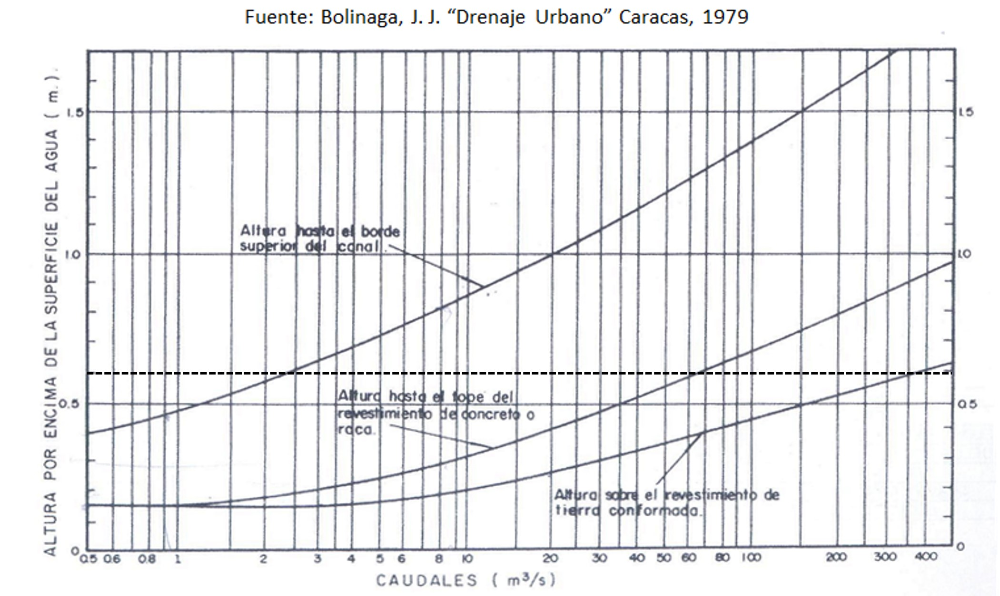
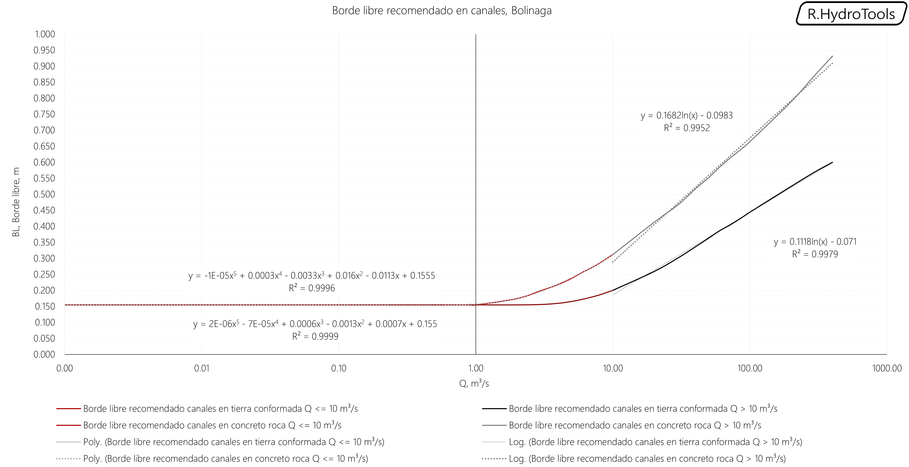

# 1.11. Estimación de borde libre en canales - Freeboard
Keywords: `freeboard`  `m01a11`

Sobreelevación requerida o borde libre en la sección de un canal, capaz de contener el flujo sin desbordamiento, producto del oleaje o de la sobreelevación de la lámina de agua en tramos curvos y transiciones.

## Objetivos

* Estimar el borde libre por diferentes métodos de diseño: canal erosionable, canal revestido, canal flujo subcritico, canal flujo supercrítico, canal flujo supercritico sobreelevación en curvatura y transición, Bolinaga en tierra conformada, Boligana en oncreto o roca y en función del ancho superficial T en canales revestidos.
* Definir el borde libre de referencia para el diseño del canal arttificial.

## Requerimientos

Archivos, actividades previas, lecturas y herramientas requeridas para el desarrollo de esta actividad:

| Requerimiento                                                                                                                                        | Descripción                                                                                                                                                                                                                                                                                                                                                                                                   |
|:-----------------------------------------------------------------------------------------------------------------------------------------------------|:--------------------------------------------------------------------------------------------------------------------------------------------------------------------------------------------------------------------------------------------------------------------------------------------------------------------------------------------------------------------------------------------------------------|
| [:toolbox:Herramienta](https://www.microsoft.com/es/microsoft-365/excel?market=bz)                                                                   | Microsoft Excel 365.                                                                                                                                                                                                                                                                                                                                                                                          |
| [:open_file_folder:R.HydroTools.BordeLibreCanal.xlsx](https://github.com/rcfdtools/R.HydroTools/tree/main/tool/BordeLibreCanal)                      | Libro de cálculo para la estimación del borde libre.                                                                                                                                                                                                                                                                                                                                                          |
| :mortar_board:[M01A01](../M01A01)   :mortar_board:[M01A02](../M01A02)  :mortar_board:[M01A03](../M01A03)  :mortar_board:[M01A06](../M01A06) | Caudales de diseño obtenidos de la modelación hidrológica para diferentes periodos de retorno.  Parámetros de diseño: velocidad máxima admisible de flujo (V), máxima profundidad normal (Yn) admisible sin borde libre de acuerdo a la altura máxima disponible para el diseño de la sección (Y), ancho superficial disponible (T) y radio de curvatura (Rc) estimado para el eje suavizado del valle. |

> Para los diferentes avances de proyecto, es necesario guardar y publicar las diferentes versiones generadas del (los) libro (s) de Microsoft Excel y reportes o informes, agregando al final la fecha de control documental en formato aaaammdd, p. ej. _R.HydroTools.DisenoCaucesParametros.20250528.xlsx_.

## Procedimiento general

1. En el libro de análisis [R.HydroTools.BordeLibreCanal.xlsx](https://github.com/rcfdtools/R.HydroTools/tree/main/tool/BordeLibreCanal), ingrese los parámetros correspondientes al caudal de diseño de la sección compuesta para el periodo de retorno de diseño, profundidad normal del flujo, velocidad máxima admisible, ancho superficial máximo y radio de curvatura del valle suavizado.

> Del ancho máximo del corredor de realineamiento, correspondiente a 300 metros, reservaremos como mínimo 10 metros a cada costado de la sección compuesta para la conformación de la corona, por lo cual, el ancho superficial máximo T será de 280 metros.
> 
> Profundidad normal sin borde libre: se ha tomado como referencia la sección de inicio del canal de realineamiento cuya profundidad máxima es de 3 metros y se ha previsto un borde libre de 0.4 metros. La profundidad normal de la lámina de agua deberá estar alrededor de 2.6 metros.

Para análisis en función del caudal y el tipo de superficie, utilizaremos las siguientes curvas características de Bolinaga.

Para análisis en función del ancho libre utilizaremos los siguientes valores de referencia.

2. Una vez ingresados los parámetros de entrada, automáticamente serán estimados diferentes valores de borde libre, para el canal de realineamiento se utilizan como referencia, todos aquellos métodos relacionados con canales erosionables y en régimen subcrítico. Para las estructuras hidráulicas de inicio, entrega, cauces laterales y controles de fondo, podrá considerar todos los valores de referencia dependiendo del tipo de recubrimiento y el régimen del flujo.

**Valor de referencia para diseño**: debido a que se trata de un canal compuesto por sección trapezoidal dominante y sección trapezoidal de creciente, valle confinado de gran ancho y pendiente similar a la del cauce natural original, se ha establecido que 0.4 metros es suficiente para evitar desbordamiento por causa de oleaje y sobreelevación en curvas y transiciones.

## Actividades de proyecto :triangular_ruler:

Utilizando la [plantilla suministrada](../../file/report/R.HCMC.PlantillaSoporteDesarrollo.docx), cree un documento soporte mostrando las actividades desarrolladas en el orden presentado en esta actividad, junto con los análisis y recomendaciones realizadas, convierta a Adobe Acrobat (.pdf) y guarde en la carpeta _/activity_ del repositorio de datos del proyecto; nombre el archivo con el código de la actividad agregando al final la fecha de control documental en formato aaaammdd (p. ej. M01A00_20250531.pdf).

En la siguiente tabla se listan las actividades que deben ser desarrolladas y documentadas por cada estudiante o grupo de proyecto.

| Actividad | Alcance                                                                                                                                                                                                                                                                                                                                                                                                                                                                                                                                              |
|:----------|:-----------------------------------------------------------------------------------------------------------------------------------------------------------------------------------------------------------------------------------------------------------------------------------------------------------------------------------------------------------------------------------------------------------------------------------------------------------------------------------------------------------------------------------------------------|
| M01A11    | Utilizando los métodos presentados en esta actividad, estimar y adoptar el borde libre a aplicar en el cauce principal a diseñar en el proyecto, justificar técnicamente el valor adoptado.                                                                                                                                                                                                                                                                                                                                                          | 
| M01A11    | Estimar el borde libre a aplicar en cauces laterales. En otras hojas del libro de Excel, incluir los parámetros hidráulicos de los cauces laterales, midiendo en GIS o CAD el valor del radio de curvatura de las ondas sinuosas. Luego del análisis en cada cauce, definir un único borde libre a aplicar a estos cauces para el proyecto.                                                                                                                                                                                                          | 
| M01A11    | Registrar los valores obtenidos en el [libro de parámetros generales](https://github.com/rcfdtools/R.HydroTools/tree/main/tool/DisenoCaucesParametros) requeridos para el diseño y la modelación. Guardar en la carpeta _/file/table_.                                                                                                                                                                                                                                                                                                               |
| M01A11    | Opcional: investigar al menos una metodología complementaria para la estimación del BL y formularla en el libro suministrado.                                                                                                                                                                                                                                                                                                                                                                                                                        |
| M01A11    | Opcional: verificar la formulación correcta de los libros de cálculo suministrados. En las notas de la ficha de control documental indicar el método de verificación y si se requieren o no ajustes.                                                                                                                                                                                                                                                                                                                                                 |
| M01A11    | En una tabla y al final del informe de avance de esta entrega, indique el detalle de las actividades realizadas por cada integrante de su grupo; utilice las siguientes columnas: `Nombre del integrante`, `Actividades realizadas`, `Tiempo dedicado en horas` (si presenta la entrega individualmente, no es necesaria la presentación de esta tabla).  Para actividades que no requieren del desarrollo de elementos de avance, indicar si realizo la lectura de la guía de clase y las lecturas indicadas al inicio en los requerimientos. | 

> Nota 1: para la revisión del proyecto final, guarde los libros cálculo de Microsoft Excel y los archivos generados en esta actividad, en las localizaciones indicadas en cada numeral.
>
> Nota 2: una vez el instructor realice la revisión y el estudiante presente las correcciones o ajustes solicitados, será necesario cargar una nueva versión de los archivos en el repositorio del proyecto, incluyendo o actualizando al final del nombre del archivo, la fecha de presentación en formato aaaammdd y manteniendo las versiones anteriores presentadas.
>

## Referencias

* http://www.academia.edu/7579800/13ava_Dise%C3%B1o_de_canales
* USBR Small Dams
* http://ingenieriacivil.tutorialesaldia.com/mini-curso-de-diseno-de-canales-con-regimen-uniforme-parte-iii-seccion-de-maxima-eficiencia-y-borde-libre/
* http://facingyconst.blogspot.com.co/2007/09/diseo-de-canales.html
* http://www.bellavistaar.gov/wp-content/uploads/2015/08/Chapter-6-Open-Channel-Flow.pdf

## Control de versiones

| Versión    | Descripción        | Autor                                      | Horas |
|------------|:-------------------|--------------------------------------------|:-----:|
| 2025.06.07 | Migración a GitHub | [rcfdtools](https://github.com/rcfdtools)  |   2   |

##

_R.HCMC es de uso libre para fines académicos, conoce nuestra licencia, cláusulas, condiciones de uso y como referenciar los contenidos publicados en este repositorio, dando [clic aquí](../../LICENSE.md)._

_¡Encontraste útil este repositorio!, apoya su difusión marcando este repositorio con una ⭐ o síguenos dando clic en el botón Follow de [rcfdtools](https://github.com/rcfdtools) en GitHub._

| [:arrow_backward: Anterior](../M01A10/Readme.md) | [:house: Inicio](../../README.md) | [:beginner: Ayuda / Colabora](https://github.com/rcfdtools/R.SIGE/discussions/99999) | [Siguiente :arrow_forward:](../M01A12/Readme.md) |
|--------------------------------------------------|-----------------------------------|--------------------------------------------------------------------------------------|--------------------------------------------------|

[^1]: 