# 1.12. Evaluación de tamaño de partículas y definición de rugosidades de diseño
Keywords: `gradation` `roughness-coefficient`  `m01a12`

Estudiar el tamaño característico del material que compone el lecho o la zona de corte del canal de realineamiento y establecer los valores de rugosidad a utilizar en el diseño hidráulico de la sección compuesta para la aplicación de diferentes métodos de diseño (Shields, Lane).

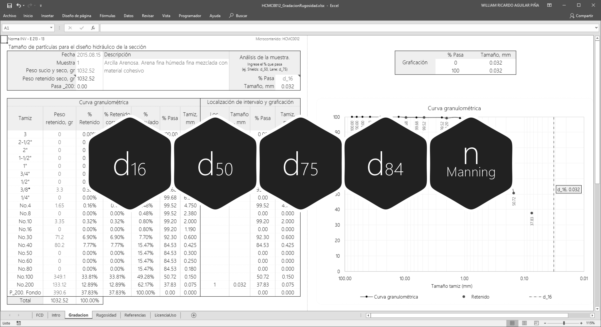

## Objetivos

* Evaluar el tamaño de partículas disponibles en la zona para el diseño hidráulico de la sección estable.
* Estimar los valores de la rugosidad de Manning a utilizar en función del material característico del lecho.
* Definir los valores de la rugosidad de Manning usando valores de referencia.

## Requerimientos

Archivos, actividades previas, lecturas y herramientas requeridas para el desarrollo de esta actividad:

| Requerimiento                                                                                                                          | Descripción                                                                            |
|:---------------------------------------------------------------------------------------------------------------------------------------|:---------------------------------------------------------------------------------------|
| [:toolbox:Herramienta](https://www.microsoft.com/es/microsoft-365/excel?market=bz)                                                     | Microsoft Excel 365.                                                                   |
| [:open_file_folder:R.HydroTools.GradacionRugosidad.xlsx](https://github.com/rcfdtools/R.HydroTools/tree/main/tool/GradacionRugosidad)  | Libro de cálculo para el análisis de los materiales del lecho y rugosidades de diseño. |

> Para los diferentes avances de proyecto, es necesario guardar y publicar las diferentes versiones generadas del (los) libro (s) de Microsoft Excel y reportes o informes, agregando al final la fecha de control documental en formato aaaammdd, p. ej. _R.HydroTools.DisenoCaucesParametros.20250528.xlsx_.

## 0. Conceptos generales

Para el análisis de los materiales del lecho y la definición de las rugosidades de diseño, utilizaremos las siguientes ecuaciones y valores de referencia.

### 0.1. Ecuaciones empíricas para estimar el valor característico de la rugosidad de Manning

#### Basados en d50
| Autor                                                                     | Ecuación empírica                         | Descripción o referencia                                                                                                                                                                                          |
|---------------------------------------------------------------------------|-------------------------------------------|-------------------------------------------------------------------------------------------------------------------------------------------------------------------------------------------------------------------|
| Strikler, 1923                                                            | 𝑛=0.0152(𝐷50)1⁄6   | Ríos con lecho de grava en Suiza                                                                                                                                                                                  |                                                                                                                                                                                  
| Posada, 1998                                                              | 𝑛=0.0487(𝐷50)1⁄6   | Ríos de montaña con lecho de grava, Antioquia y Risaralda. Estudio en canales naturales                                                                                                                           |                                                                                                                           
| Keulegan, 1938 y 1949                                                     | 𝑛=0.0260(𝐷50)1⁄6   | Universidad Nacional de Colombia, sede Medellín. Escuela de Geociencias y Medio Ambiente, Ramiro Marbello Pérez                                                                                                   |                                                                                                   
| Administración de carreteras federales de Estados unidos de América, 1975 | 𝑛=0.0395(𝐷50)1⁄6   | Universidad Nacional de Colombia, sede Medellín. Escuela de Geociencias y Medio Ambiente, Ramiro Marbello Pérez                                                                                                   |                                                                                                   
| Simons y Senturk, 1976                                                    | 𝑛=0.0389(𝐷50)1⁄6   | Universidad Nacional de Colombia, sede Medellín. Escuela de Geociencias y Medio Ambiente, Ramiro Marbello Pérez                                                                                                   |                                                                                                   
| Garde y Raju, 1978                                                        | 𝑛=0.039(𝐷50)1⁄6    | Universidad Nacional de Colombia, sede Medellín. Escuela de Geociencias y Medio Ambiente, Ramiro Marbello Pérez. Granulometría gruesa y libre de ondulaciones. 50% del material por peso tiene un diámetro menor. | 
| Bray, 1979                                                                | 𝑛=0.0593(𝐷50)0.179 | Universidad Nacional de Colombia, sede Medellín. Escuela de Geociencias y Medio Ambiente, Ramiro Marbello Pérez                                                                                                   |                                                                                                   
| Subramanya, 1982                                                          | 𝑛=0.047(𝐷50)1⁄6    | Universidad Nacional de Colombia, sede Medellín. Escuela de Geociencias y Medio Ambiente, Ramiro Marbello Pérez                                                                                                   |

#### Basados en d65
| Autor                  | Ecuación empírica                         | Descripción o referencia                                                                                        |
|------------------------|-------------------------------------------|-----------------------------------------------------------------------------------------------------------------|
| Keulegan, 1938 y 1949  | 𝑛=0.0416(𝐷65)1⁄6   | Universidad Nacional de Colombia, sede Medellín. Escuela de Geociencias y Medio Ambiente, Ramiro Marbello Pérez |                        
| Chow, 1959             | 𝑛=0.0417(𝐷65)1⁄6   | Universidad Nacional de Colombia, sede Medellín. Escuela de Geociencias y Medio Ambiente, Ramiro Marbello Pérez |                                       
| Raudkivi, 1975         | 𝑛=0.013(𝐷65)1⁄6    | Continuación del trabajo de Stickler. Universidad Nacional de Colombia, sede Medellín                           | 
| Bray, 1979             | 𝑛=0.0561(𝐷65)0.179 | Universidad Nacional de Colombia, sede Medellín. Escuela de Geociencias y Medio Ambiente, Ramiro Marbello Pérez |                       

#### Basados en d75
| Autor          | Ecuación empírica                       | Descripción o referencia                                                         |
|----------------|-----------------------------------------|----------------------------------------------------------------------------------|
| Lane y Carlson | 𝑛=0.038(𝐷75)1⁄6  | Obtenida a través de experimentos de campo, en canales empedrados con guijarros. | 

#### Basados en d90
| Autor                        | Ecuación empírica                        | Descripción o referencia                                                                                                         |
|------------------------------|------------------------------------------|----------------------------------------------------------------------------------------------------------------------------------|
| Meyer - Peter y Muller, 1948 | 𝑛=0.038(𝐷90)1⁄6   | Mezclas de materiales de fondo con una significativa muestra de materiales granulométricos d90, tiene en cuenta el acorazamiento | 
| Keulegan, 1938 y 1949        | 𝑛=0.0249(𝐷90)1⁄6  | Universidad Nacional de Colombia, sede Medellín. Escuela de Geociencias y Medio Ambiente, Ramiro Marbello Pérez                  |                  
| Bray, 1979                   | 𝑛=0.0495(𝐷90)0.16 | Universidad Nacional de Colombia, sede Medellín. Escuela de Geociencias y Medio Ambiente, Ramiro Marbello Pérez                  |                  
| Yen, 1992                    | 𝑛=0.0384(𝐷90)0.16 | Universidad Nacional de Colombia, sede Medellín. Escuela de Geociencias y Medio Ambiente, Ramiro Marbello Pérez                  |                  

### 0.2. Valores de referencia para las rugosidades n de Manning [^1]

La selección de un valor apropiado de la Rugosidad n de Manning es muy significativo al momento de calcular la elevación de la lámina de agua en un canal. El n de Manning es altamente variable y depende de múltiples factores, tales como: 

* Rugosidad de la superficie o lecho
* Vegetación acuática, en los taludes y en llanura
* Irregularidades en el canal
* Tipo de alineamiento (recto, sinuoso, meandriforme, trenzado...)
* Arrastre y depositación de sedimentos
* Obstrucciones
* Tamaño y forma geométrica del canal
* Almacenamiento y descarga
* Cambios debidos a los ciclos estacionales
* Temperatura
* Material en suspensión y tipo de lecho.

En general, el coeficiente n de Manning debería ser calibrado a partir de observaciones realizadas respecto a la elevación de la lámina de agua en el canal (estaciones de medición limnimétricas y/o limnigráficas, marcas de agua) cuando estos datos están disponibles. Cuando no existen datos de medición de altura de lámina en el canal, se pueden utilizar valores de n obtenidos de cauces con similares condiciones o a partir de valores obtenidos experimentalmente.

Existen múltiples referencias de valores típicos de rugosidades n de Manning para canales, p. ej. en el libro de _Hidráulica de canales a superficie libre de Ven Te Chow, 1959_ se encuentra una compilación detallada de estos valores para los tipos de canales más usuales. En el [Manual de referencia técnico del Cuerpo de Ingenieros Militares de Estados Unidos de América](https://www.hec.usace.army.mil/confluence/rasdocs/ras1dtechref/latest/basic-data-requirements/geometric-data/energy-loss-coefficients), se encuentra una tabla resumen de los valores típicos presentados por Chow. 

Manning's n Values from www.hec.usace.army.mil

| Type of Channel and Description                                                                                 |  Minimum  |  Normal  |  Maximum  |
|-----------------------------------------------------------------------------------------------------------------|:---------:|:--------:|:---------:|
| **A. Natural Streams**                                                                                          |           |          |           |
| **A1. Main Channels**                                                                                           |           |          |           |
| a. Clean, straight, full, no rifts or deep pools                                                                |   0.025   |   0.03   |   0.033   |
| b. Same as above, but more stones and weeds                                                                     |   0.03    |  0.035   |   0.04    |
| c. Clean, winding, some pools and shoals                                                                        |   0.033   |   0.04   |   0.045   |
| d. Same as above, but some weeds and stones                                                                     |   0.035   |  0.045   |   0.05    |
| e. Same as above, lower stages, more ineffective slopes and sections                                            |   0.04    |  0.048   |   0.055   |
| f. Same as "d" but more stones                                                                                  |   0.045   |   0.05   |   0.06    |
| g. Sluggish reaches, weedy. deep pools                                                                          |   0.05    |   0.07   |   0.08    |
| h. Very weedy reaches, deep pools, or floodways with heavy stands of timber and brush                           |   0.07    |   0.1    |   0.15    |
| **A2. Flood Plains**                                                                                            |           |          |           |
| **a. Pasture no brush**                                                                                         |           |          |           |
| 1. Short grass                                                                                                  |   0.025   |   0.03   |   0.035   |
| 2. High grass                                                                                                   |   0.03    |  0.035   |   0.05    |
| **b. Cultivated areas**                                                                                         |           |          |           |
| 1. No crop                                                                                                      |   0.02    |   0.03   |   0.04    |
| 2. Mature row crops                                                                                             |   0.025   |  0.035   |   0.045   |
| 3. Mature field crops                                                                                           |   0.03    |   0.04   |   0.05    |
| **c. Brush**                                                                                                    |           |          |           |
| 1. Scattered brush, heavy weeds                                                                                 |   0.035   |   0.05   |   0.07    |
| 2. Light brush and trees, in winter                                                                             |   0.035   |   0.05   |   0.06    |
| 3. Light brush and trees, in summer                                                                             |   0.04    |   0.06   |   0.08    |
| 4. Medium to dense brush, in winter                                                                             |   0.045   |   0.07   |   0.11    |
| 5. Medium to dense brush, in summer                                                                             |   0.07    |   0.1    |   0.16    |
| **d. Trees**                                                                                                    |           |          |           |
| 1. Cleared land with tree stumps, no sprouts                                                                    |   0.03    |   0.04   |   0.05    |
| 2. Same as above, but heavy sprouts                                                                             |   0.05    |   0.06   |   0.08    |
| 3. Heavy stand of timber, few down trees, little undergrowth, flow below branches                               |   0.08    |   0.1    |   0.12    |
| 4. Same as above, but with flow into branches                                                                   |    0.1    |   0.12   |   0.16    |
| 5. Dense willows, summer, straight**                                                                            |   0.11    |   0.15   |    0.2    |
| **A3.Mountain Streams, no vegetation in channel, banks usually steep, with trees and brush on banks submerged** |           |          |           |
| a. Bottom: gravels, cobbles, and few boulders                                                                   |   0.03    |   0.04   |   0.05    |
| b. Bottom: cobbles with large boulders                                                                          |   0.04    |   0.05   |   0.07    |
| **B. Lined or Built-Up Channels**                                                                               |           |          |           |
| **B1. Concrete**                                                                                                |           |          |           |
| a. Trowel finish                                                                                                |   0.011   |  0.013   |   0.015   |
| b. Float Finish                                                                                                 |   0.013   |  0.015   |   0.016   |
| c. Finished, with gravel bottom                                                                                 |   0.015   |  0.017   |   0.02    |
| d. Unfinished                                                                                                   |   0.014   |  0.017   |   0.02    |
| e. Gunite, good section                                                                                         |   0.016   |  0.019   |   0.023   |
| f. Gunite, wavy section                                                                                         |   0.018   |  0.022   |   0.025   |
| g. On good excavated rock                                                                                       |   0.017   |   0.02   |           |
| h. On irregular excavated rock                                                                                  |   0.022   |  0.027   |           |
| **B2. Concrete bottom float finished with sides of:**                                                           |           |          |           |
| a. Dressed stone in mortar                                                                                      |   0.015   |  0.017   |   0.02    |
| b. Random stone in mortar                                                                                       |   0.017   |   0.02   |   0.024   |
| c. Cement rubble masonry, plastered                                                                             |   0.016   |   0.02   |   0.024   |
| d. Cement rubble masonry                                                                                        |   0.02    |  0.025   |   0.03    |
| e. Dry rubble on riprap                                                                                         |   0.02    |   0.03   |   0.035   |
| **B3. Gravel bottom with sides of:**                                                                            |           |          |           |
| a. Formed concrete                                                                                              |   0.017   |   0.02   |   0.025   |
| b. Random stone in mortar                                                                                       |   0.02    |  0.023   |   0.026   |
| c. Dry rubble or riprap                                                                                         |   0.023   |  0.033   |   0.036   |
| **B4. Brick**                                                                                                   |           |          |           |
| a. Glazed                                                                                                       |   0.011   |  0.013   |   0.015   |
| b. In cement mortar                                                                                             |   0.012   |  0.015   |   0.018   |
| **B5. Metal**                                                                                                   |           |          |           |
| a. Smooth steel surfaces                                                                                        |   0.011   |  0.012   |   0.014   |
| b. Corrugated metal                                                                                             |   0.021   |  0.025   |   0.03    |
| **B6. Asphalt**                                                                                                 |           |          |           |
| a. Smooth                                                                                                       |   0.013   |  0.013   |           |
| b. Rough                                                                                                        |   0.016   |  0.016   |           |
| 7.Vegetal lining                                                                                                |   0.03    |          |    0.5    |
| **C. Excavated or Dredged Channels**                                                                            |           |          |           |
| **C1. Earth, straight and uniform**                                                                             |           |          |           |
| a. Clean, recently completed                                                                                    |   0.016   |  0.018   |   0.02    |
| b. Clean, after weathering                                                                                      |   0.018   |  0.022   |   0.025   |
| c. Gravel, uniform section, clean                                                                               |   0.022   |  0.025   |   0.03    |
| d. With short grass, few weeds                                                                                  |   0.022   |  0.027   |   0.033   |
| **C2. Earth, winding and sluggish**                                                                             |           |          |           |
| a. No vegetation                                                                                                |   0.023   |  0.025   |   0.03    |
| b. Grass, some weeds                                                                                            |   0.025   |   0.03   |   0.033   |
| c. Dense weeds or aquatic plants in deep channels                                                               |   0.03    |  0.035   |   0.04    |
| d. Earth bottom and rubble side                                                                                 |   0.028   |   0.03   |   0.035   |
| e. Stony bottom and weedy banks                                                                                 |   0.025   |  0.035   |   0.04    |
| f. Cobble bottom and clean sides                                                                                |   0.03    |   0.04   |   0.05    |
| **C3.Dragline-excavated or dredged**                                                                            |           |          |           |
| a. No vegetation**                                                                                              |   0.025   |  0.028   |   0.033   |
| b. Light brush on banks                                                                                         |   0.035   |   0.05   |   0.06    |
| **C4. Rock cuts**                                                                                               |           |          |           |
| a. Smooth and uniform                                                                                           |   0.025   |  0.035   |   0.04    |
| b. Jagged and irregular                                                                                         |   0.035   |   0.04   |   0.05    |
| **C5. Channels not maintained, weeds and brush**                                                                |           |          |           |
| a. Clean bottom, brush on sides                                                                                 |   0.04    |   0.05   |   0.08    |
| b. Same as above, highest stage of flow                                                                         |   0.045   |   0.07   |   0.11    |
| c. Dense weeds, high as flow depth                                                                              |   0.05    |   0.08   |   0.12    |
| d. Dense brush, high stage                                                                                      |   0.08    |   0.1    |   0.14    |

## 1. Curva granulométrica y tamaño característico del material (% pasa)

1. En el libro de análisis [R.HydroTools.GradacionRugosidad.xlsx](https://github.com/rcfdtools/R.HydroTools/tree/main/tool/GradacionRugosidad), identifique los valores de la tabla de gradación del caso de estudio y proyecto.

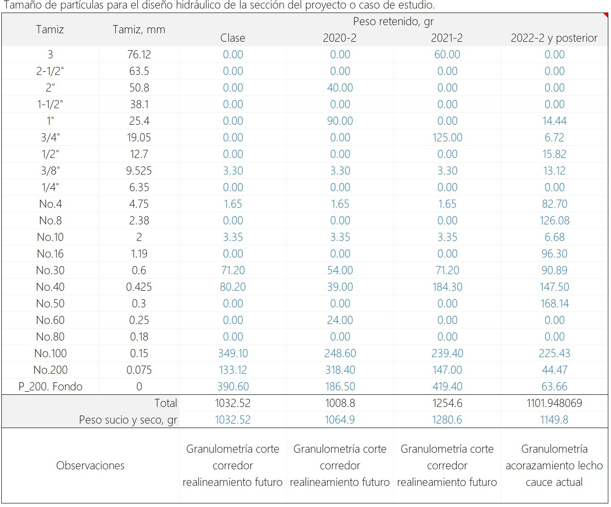

En la parte inferior de la tabla podrá observar el peso total de la muestra y el peso sucio y seco requerido para realizar la corrección de la curva granulométrica.

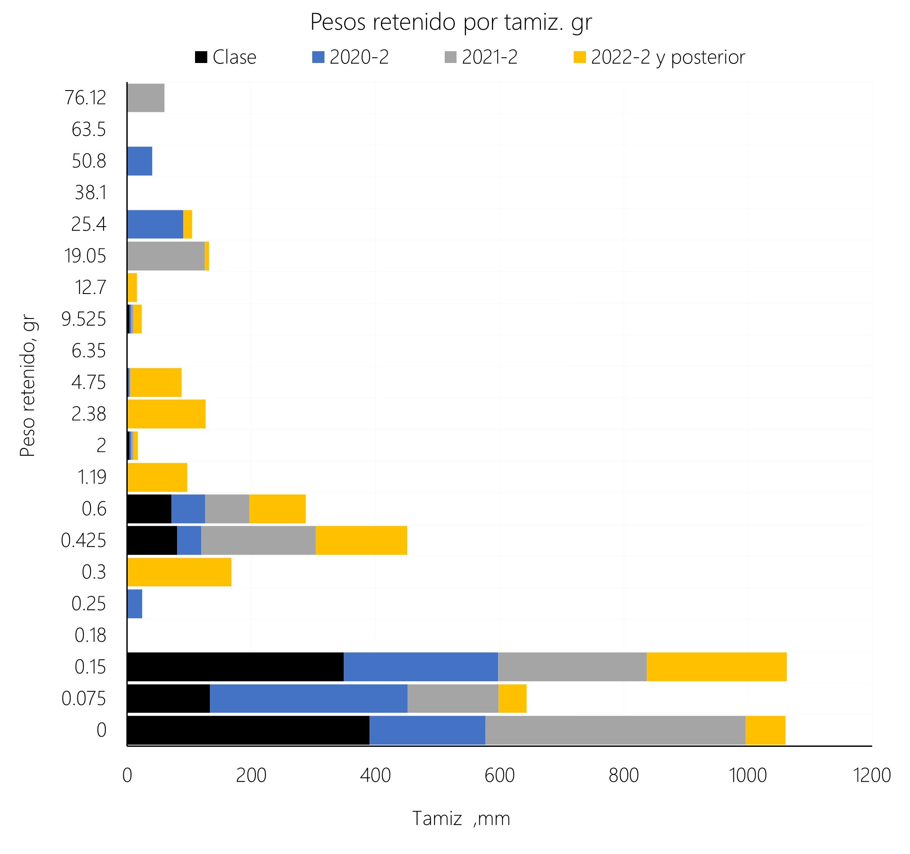

2. En la hoja _Gradación_, registre los valores de peso retenido y peso sucio y seco. Automáticamente serán calculados los porcentajes acumulados y los porcentajes que pasan y se generará la gráfica de la curva granulométrica.

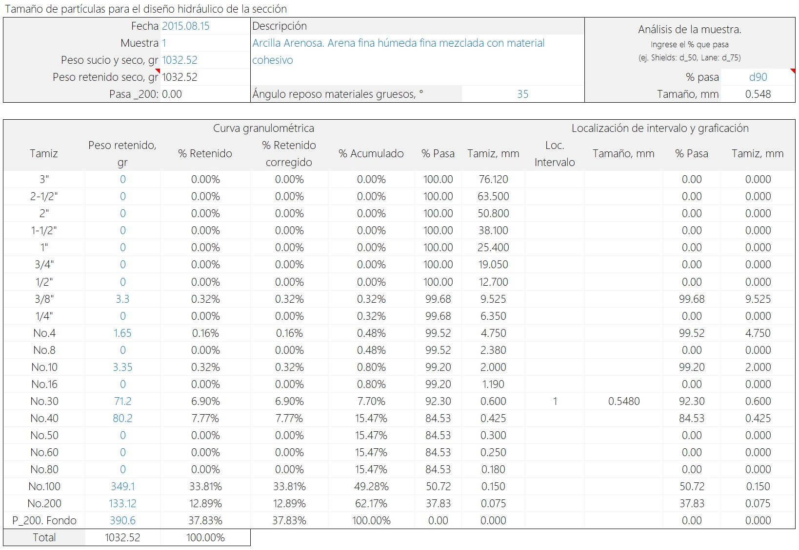

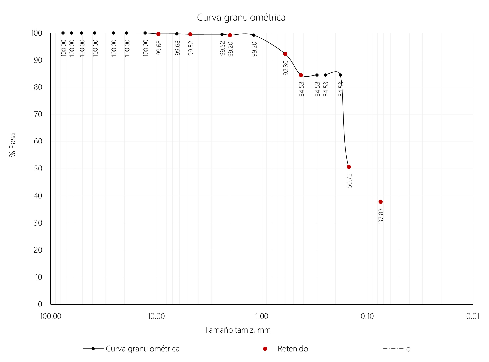

3. Para la determinación del tamaño característico de los materiales y dependiendo de la metodología de diseño de la sección hidráulica del canal, utilizaremos como referencia los siguientes porcentajes: d16, d50, d65, d75, d84 y d90.

En la hoja de análisis, ingrese el primer valor de análisis correspondiente a d16 y verifique la posición en la curva granulométrica.

d16 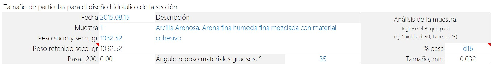

Realice en análisis para los demás valores.

d50 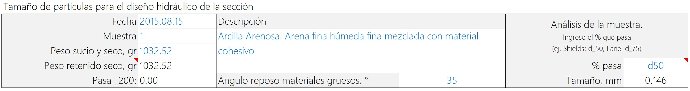

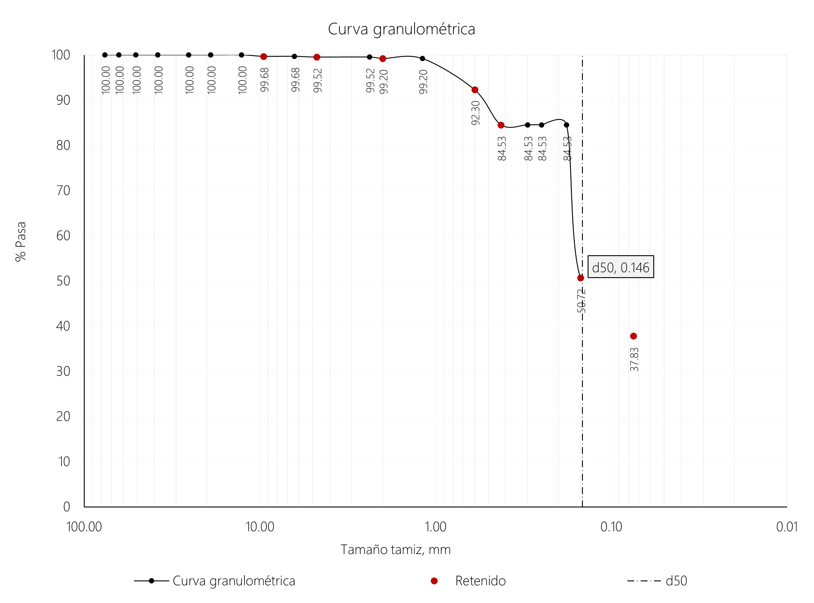

d65 

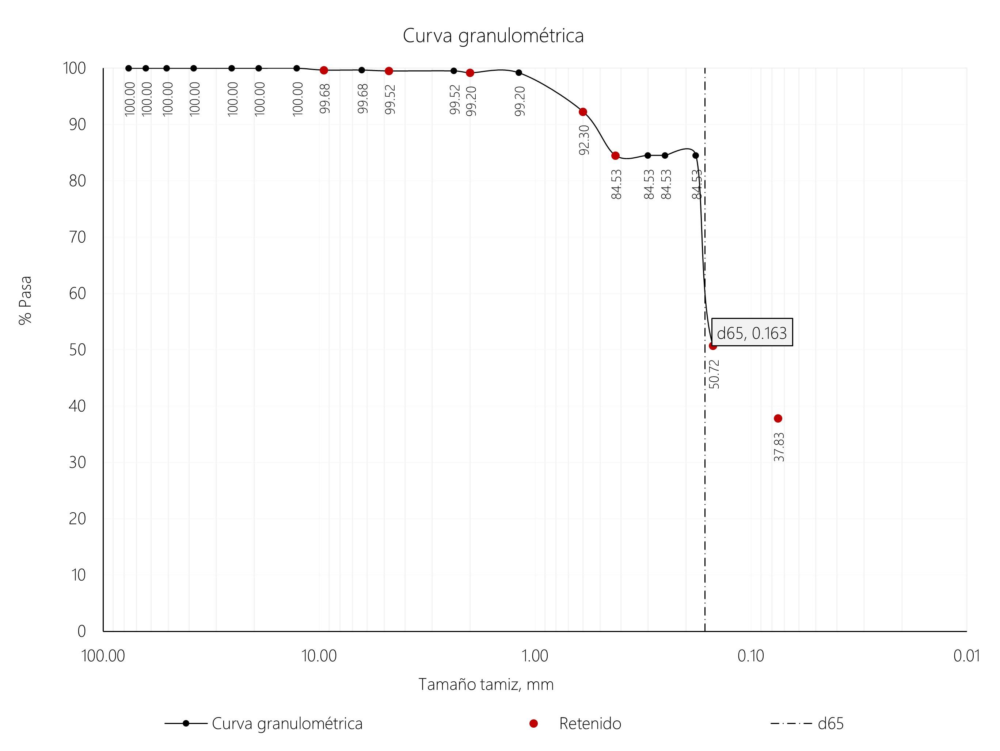

d75 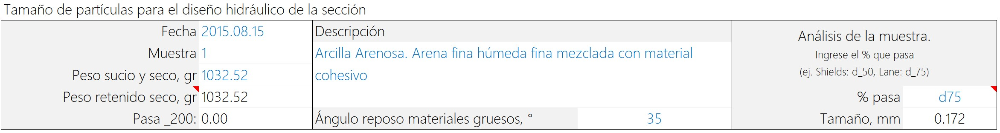

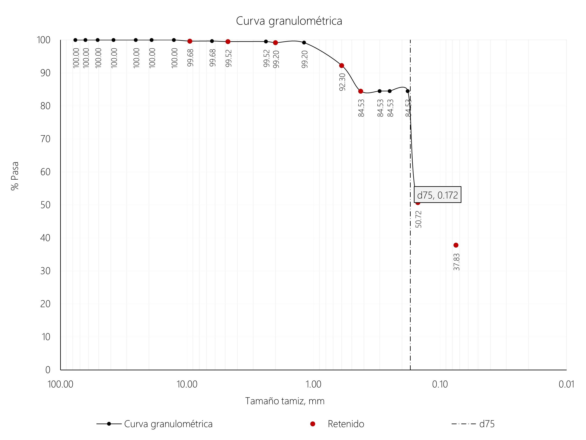

d84 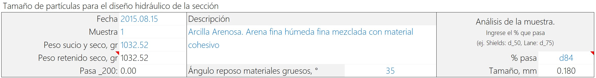

d90 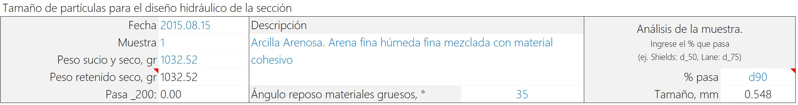

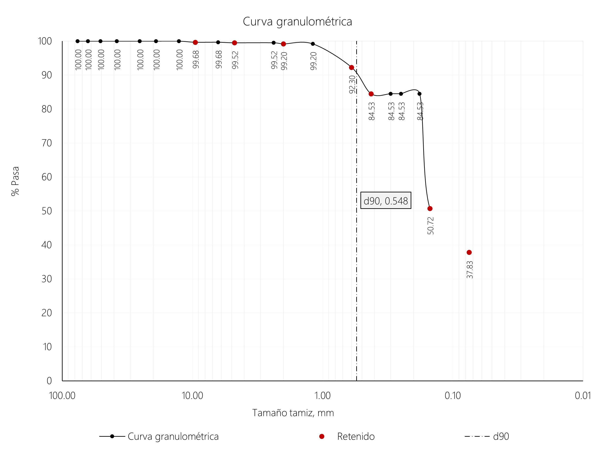

## 2. Rugosidades de diseño

## Actividades de proyecto :triangular_ruler:

Utilizando la [plantilla suministrada](../../file/report/R.HCMC.PlantillaSoporteDesarrollo.docx), cree un documento soporte mostrando las actividades desarrolladas en el orden presentado en esta actividad, junto con los análisis y recomendaciones realizadas, convierta a Adobe Acrobat (.pdf) y guarde en la carpeta _/activity_ del repositorio de datos del proyecto; nombre el archivo con el código de la actividad agregando al final la fecha de control documental en formato aaaammdd (p. ej. M01A00_20250531.pdf).

En la siguiente tabla se listan las actividades que deben ser desarrolladas y documentadas por cada estudiante o grupo de proyecto.

| Actividad | Alcance                                                                                                                                                                                                                                                                                                                                                                                                                                                                                                                                              |
|:----------|:-----------------------------------------------------------------------------------------------------------------------------------------------------------------------------------------------------------------------------------------------------------------------------------------------------------------------------------------------------------------------------------------------------------------------------------------------------------------------------------------------------------------------------------------------------|
| M01A00    | Descargar el archivo [R.HydroTools.DisenoCaucesParametros.xlsx](https://github.com/rcfdtools/R.HydroTools/blob/main/tool/DisenoCaucesParametros/R.HydroTools.DisenoCaucesParametros.xlsx) disponible en GitHub, e incluirlo en el repositorio.                                                                                                                                                                                                                                                                                                       | 
| M01A00    | Investigar, verificar y registrar en el libro de Excel, los parámetros técnicos, hidráulicos e hidrológicos indicados en esta actividad.  Para el grupo de parámetros normativos, ambientales / sociales y territoriales, revisar los parámetros actualmente reportados, investigar, registrar y actualizar.                                                                                                                                                                                                                                   | 
| M01A00    | Registrar los valores obtenidos en el [libro de parámetros generales](https://github.com/rcfdtools/R.HydroTools/tree/main/tool/DisenoCaucesParametros) requeridos para el diseño y la modelación. Guardar en la carpeta _/file/table_.                                                                                                                                                                                                                                                                                                               |
| M01A00    | Opcional: verificar la formulación correcta de los libros de cálculo suministrados. En las notas de la ficha de control documental indicar el método de verificación y si se requieren o no ajustes.                                                                                                                                                                                                                                                                                                                                                 |
| M01A00    | En una tabla y al final del informe de avance de esta entrega, indique el detalle de las actividades realizadas por cada integrante de su grupo; utilice las siguientes columnas: `Nombre del integrante`, `Actividades realizadas`, `Tiempo dedicado en horas` (si presenta la entrega individualmente, no es necesaria la presentación de esta tabla).  Para actividades que no requieren del desarrollo de elementos de avance, indicar si realizo la lectura de la guía de clase y las lecturas indicadas al inicio en los requerimientos. | 

> Nota 1: para la revisión del proyecto final, guarde los libros cálculo de Microsoft Excel y los archivos generados en esta actividad, en las localizaciones indicadas en cada numeral.
>
> Nota 2: una vez el instructor realice la revisión y el estudiante presente las correcciones o ajustes solicitados, será necesario cargar una nueva versión de los archivos en el repositorio del proyecto, incluyendo o actualizando al final del nombre del archivo, la fecha de presentación en formato aaaammdd y manteniendo las versiones anteriores presentadas.
>

## Referencias

* http://artemisa.unicauca.edu.co/~hdulica/T_TRANSPORTE_SEDIMENTOS.pdf
* http://wwwrcamnl.wr.usgs.gov/sws/fieldmethods/Indirects/nvalues/index.htm
* US Army Corps of Engineers. HEC-RAS River Analysis System, Hydraulic Reference Manual, Versión 5.0. CPD-69. 2016.2
* Universidad Nacional de Colombia, sede Medellín. Escuela de Geociencias y Medio Ambiente, Ramiro Marbello Pérez
* Open Channel Hydraulics, 1985. French, R.
* Open Channel Hydraulics, 1959. Chow, Ven Te.
* http://bdigital.unal.edu.co/12697/60/3353962.2005.Parte%2011.pdf
* https://pubs.usgs.gov/wsp/2339/report.pdf
* https://www.fsl.orst.edu/geowater/FX3/help/8_Hydraulic_Reference/Mannings_n_Tables.htm

## Control de versiones

| Versión    | Descripción        | Autor                                      | Horas |
|------------|:-------------------|--------------------------------------------|:-----:|
| 2025.06.07 | Migración a GitHub | [rcfdtools](https://github.com/rcfdtools)  |   8   |

##

_R.HCMC es de uso libre para fines académicos, conoce nuestra licencia, cláusulas, condiciones de uso y como referenciar los contenidos publicados en este repositorio, dando [clic aquí](../../LICENSE.md)._

_¡Encontraste útil este repositorio!, apoya su difusión marcando este repositorio con una ⭐ o síguenos dando clic en el botón Follow de [rcfdtools](https://github.com/rcfdtools) en GitHub._

| [:arrow_backward: Anterior](../M01A11/Readme.md) | [:house: Inicio](../../README.md) | [:beginner: Ayuda / Colabora](https://github.com/rcfdtools/R.SIGE/discussions/99999) | [Siguiente :arrow_forward:](../M01A13/Readme.md) |
|--------------------------------------------------|-----------------------------------|--------------------------------------------------------------------------------------|--------------------------------------------------|

[^1]: https://www.hec.usace.army.mil/confluence/rasdocs/ras1dtechref/latest/basic-data-requirements/geometric-data/energy-loss-coefficients