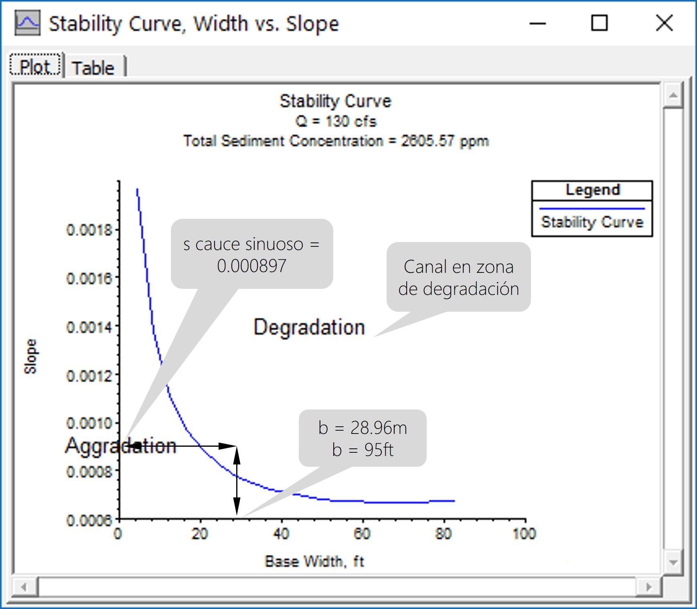
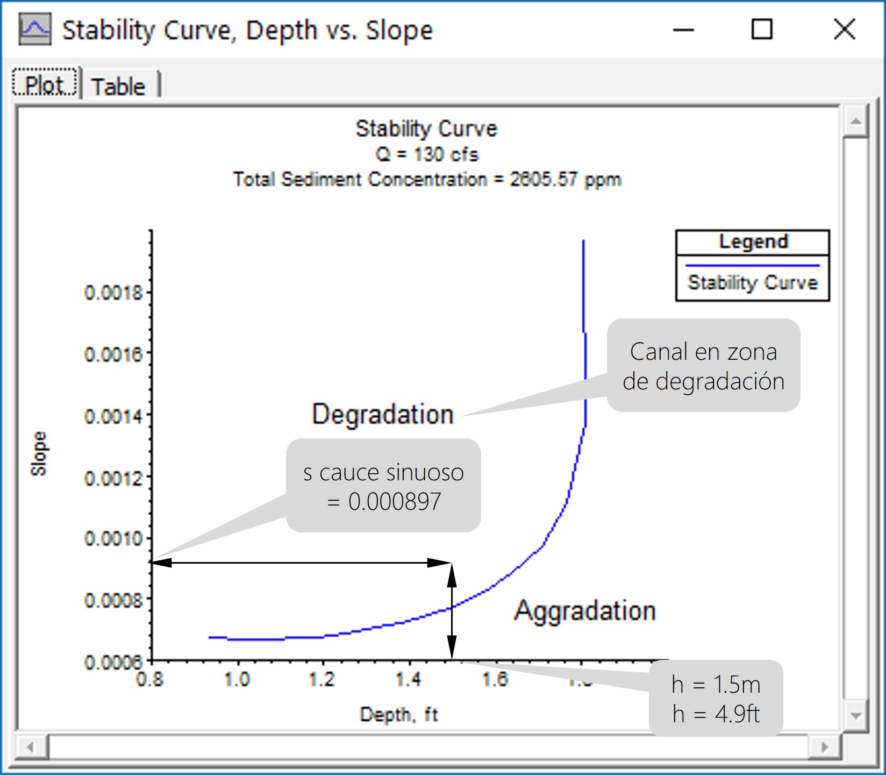
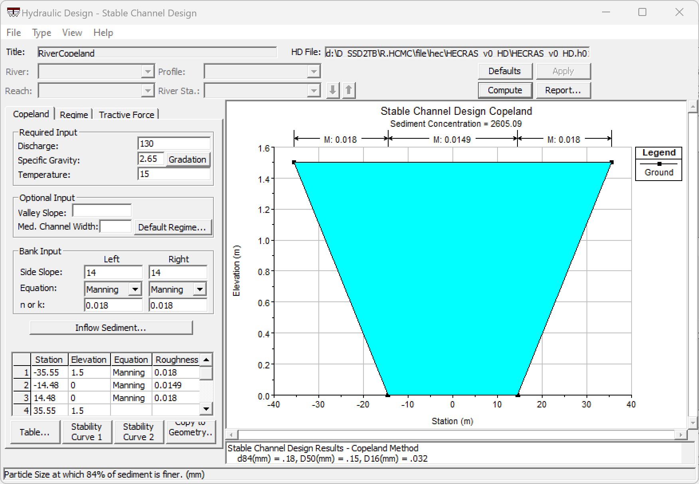
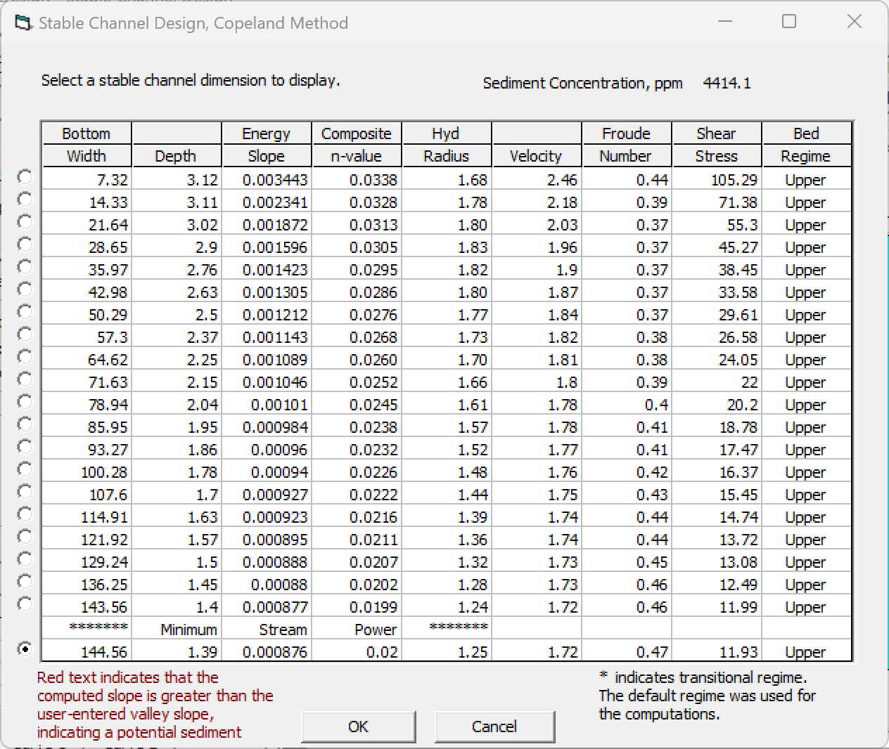

# 1.13. Diseño geométrico e hidráulico vertical del cauce principal de desviación y cauces laterales menores
Keywords: `hydraulic-desgn` `tractive-force` `river` `valley` `confined-valley` `m01a13`

Dimensionar la sección hidráulica dominante (1) y de creciente (2) del cauce principal y de los cauces laterales menores, verificando a flujo uniforme la capacidad hidráulica de la sección compuesta (3) y el borde libre requerido.

## Objetivos

* Diseñar la sección dominante por los métodos Copeland, Régimen de Flujo y Fuerza tractiva.
* Diseñar la sección de creciente por los métodos Copeland, Régimen de Flujo y Fuerza tractiva.
* Verificar la sección compuesta por flujo uniforme.
~~* Diseñar la geometría de los pasos de vía usando alcantarillas por área equivalente a descarga libre.~~
* Crear un prototipo digital del diseño realizado y modelar a flujo permanente y no permanente.

## Requerimientos

Archivos, actividades previas, lecturas y herramientas requeridas para el desarrollo de esta actividad:

| Requerimiento                                                                                                                                                            | Descripción                                                                                     |
|:-------------------------------------------------------------------------------------------------------------------------------------------------------------------------|:------------------------------------------------------------------------------------------------|
| [:toolbox:Herramienta](https://www.microsoft.com/es/microsoft-365/excel?market=bz)                                                                                       | Microsoft Excel 365.                                                                            |
| [:toolbox:Herramienta](https://www.hec.usace.army.mil/software/hec-ras/)                                                                                                 | HEC-RAS 6.6 o superior.                                                                         |
| [:round_pushpin:R.HCMC.NodoValle.shp](../../file/shp/R.HCMC.NodoValle.zip)                                                                                               | Capa de nodos eje valle recto (creada en actividad anterior).                                   |
| [:open_file_folder:R.HydroTools.DisenoGeometricoHidraulicoVertical.xlsm](https://github.com/rcfdtools/R.HydroTools/tree/main/tool/DisenoGeometricoHidraulicoVertical)    | Libro de cálculo para el diseño geométrico e hidráulico vertical de canales a superficie libre. |
| [:open_file_folder:Modelo hidráulico HECRAS_v0](../../file/hec)                                                                                                          | Modelo hidráulico de muestreo HEC-RAS v0 creado en actividad [M01A05](../M01A05/Readme.md).     |

> Para los diferentes avances de proyecto, es necesario guardar y publicar las diferentes versiones generadas del (los) libro (s) de Microsoft Excel y reportes o informes, agregando al final la fecha de control documental en formato aaaammdd, p. ej. _R.HydroTools.DisenoCaucesParametros.20250528.xlsx_.

## 0. Creación de proyecto HEC-RAS

1. En HEC-RAS cree un proyecto nuevo y nombre como _/file/hec/HECRAS_v0_HD/HECRAS_v0_HD.prj_. 

> En actividades anteriores, establecimos por defecto el sistema internacional de unidades, sin embargo, es indispensable verificar que el proyecto sea creadoo en este sistema. 

2. Ingrese al Módulo de Diseño, menú _Run / Hydraulic Design Functions…_ o clic en el botón _Perform Hydraulic Design Computations_.  

En la ventana de diseño hidráulico y en _Type / Stable Channel Design…_, observará que HEC-RAS dispone de 3 métodos diferentes para el diseño de sección estable (secciones que hidráulicamente se encuentran en el límite entre la agradación o degradación del lecho).

* Copeland
* Regime
* Tractive Force

## 1. Diseño por Método de Copeland en HEC-RAS

### 1.1. Sección dominante (river)

Para el diseño geométrico e hidráulico vertical utilizaremos los siguientes parámetros registrados en el libro global de diseño en Excel:

* Caudal de diseño Tr 2.33yr (m³/s) = 130.
* Temperatura Agua (ºC) = 15.
* Gradación de los materiales del lecho: D84 = 0.18 mm, D50 = 0.146 mm, D16 = 0.032 mm.
* Taludes = 14H : 1V.
* Rugosidad canal dominante = 0.018.

1. En la ventana del módulo de diseño, ingrese los parámetros de la sección dominante en la pestaña del método de Copelad.

> Concentración de sedimentos: calculados por HEC-RAS en función de la geometría de la sección suponiendo que el cauce natural tiene un ancho en la base del canal dominante de 20 m, altura máxima de 3 m y la pendiente de la línea de energía es paralela a la del fondo del cauce sinuoso S = 0.000897, sedimentos totales = 2605.57 ppm.

Una vez ingresados los valores, de clic en el botón _Apply_.

2. De clic en el botón _Compute_, aparecerá entonces una ventana con diferentes geometrías propuestas que cumplen con el diseño de sección estable para los parámetros ingresados.

Para la selección de la sección de diseño, es necesario tener en cuenta que existe una restricción preestablecida respecto al alto máximo de 3 metros disponible la sección natural compuesta y al borde libre de 0.4 metros, por tanto, seleccionar por ejemplo la sección diseñada que utiliza 1.5 metros de la altura total para el tránsito del caudal dominante.

La sección seleccionada de 1.5 m de altura además de cumplir con los criterios de sección estable, cumple con los criterios de velocidad (1.7 m/s < 2 m/s) y cortante (11.44 N/m² ≈ 10 N/m²).

> Para la sección correspondiente al tránsito del caudal dominante, NO es necesario disponer de borde libre debido a que se considera válido que la llanura de inundación confinada pueda ser parcialmente inundada.

3. Verifique las curvas de estabilidad 1 y 2 trazadas para la sección diseñada a partir de los parámetros ingresados.

> Atención: las gráficas presentan una inconsistencia en las unidades refiriéndose al Sistema Inglés, los valores mostrados corresponden a las unidades del Sistema Internacional. El caudal utilizado es 130 m³/s.

Por tratarse de una sección ancha (28.96 m) el lecho podría sufrir algún nivel de degradación y para la altura seleccionada de 1.5 metros. Entonces, el canal diseñado podrá presentar algunos fenómenos de erosión de sedimentos provenientes de su propio lecho cuando esté recién excavado y sin vegetación acuática o hierbas en las zonas de talud.

4. En _File / Save Hydraulic Design Data_, guarde el diseño como _RiverCopeland_.

### 1.2. Sección creciente (valley)

Para el diseño geométrico e hidráulico vertical utilizaremos los siguientes parámetros registrados en el libro global de diseño en Excel:

* Caudal de diseño Tr 100yr (m³/s) = 392 (Tr 100yr = 522 – Tr 2.33yr = 130).
* Temperatura Agua (ºC) = 15.
* Gradación de los materiales del lecho: D84 = 0.18 mm, D50 = 0.146 mm, D16 = 0.032 mm.
* Taludes = 14H : 1V.
* Rugosidad canal dominante = 0.035.

> Concentración de sedimentos = Calculados por HEC-RAS en función de la geometría de la sección suponiendo que el cauce natural tiene un ancho de llanura en la base de 230 m, altura máxima de 3 m y la pendiente de la línea de energía es paralela a la del fondo del cauce sinuoso S = 0.000897. Sedimentos totales = 4414.83 ppm.

1. En el menú _File / New Hydraulic Design Data_, guarde como _ValleyCopeland_ e ingrese los parámetros requeridos.

2. Clic en _Apply_ y _Compute_, aparecerá entonces una ventana con diferentes geometrías propuestas que cumplen con el diseño de sección estable para los parámetros ingresados.

Para la selección de la sección de diseño, es necesario tener en cuenta que existe una restricción preestablecida respecto al alto máximo de 3 m disponible la sección natural compuesta, el borde libre de 0.4 m y la altura de sección seleccionada de 1.5 m para la zona del cauce dominante. (para el ejercicio de clase seleccionar la sección con menor elevación)

La sección seleccionada de 1.39 m de altura además de cumplir con los criterios de sección estable, cumple con los criterios de velocidad (1.72 m/s < 3 m/s) y cortante (11.93 N/m² ≈ 20 N/m²). Tener en cuenta que el borde libre disponible para este diseño es de 0.11 m (3 m – 1.5 m – 1.39 m) inferior al estimado de 0.4 m. 

### 1.3. Sección compuesta (composite)

* Corona cauce dominante 70.96 m = 2 * (14 * 1.5 ) + 28.96
* T Ancho Superficial 183.48 m = 2 * (14 * 1.39) + 144.56
* Corona Valle 186.56 m = 2 * (14 * 1.5) + 144.56
* Huella para mecanización = (300 – 186.56) / 2 = 56.72 m

> Posteriormente, verificaremos por flujo uniforme la altura del borde libre de la sección compuesta.

## 2. Diseño por Método del Régimen de Flujo en HEC-RAS

Para el diseño geométrico e hidráulico vertical utilizaremos los siguientes parámetros registrados en el libro global de diseño en Excel:

* Caudal de diseño Tr 100yr (m³/s) = 392 (Tr 100yr = 522 – Tr 2.33yr = 130).
* Gradación de los materiales del lecho D50 = 0.146 mm.
* Concentración de sedimentos: 2605.57 ppm + 4414.83 ppm = 7020.4 ppm. Corresponde a los sedimentos calculados por el método de Copeland para la sección de dominante y de creciente
* Temperatura Agua (ºC) = 15.
* Factor lateral = 0.1 suponiendo que las bancas son desmoronables.

En el menú _File / New Hydraulic Design Data_, guarde como _ValleyRegime_ e ingrese los parámetros requeridos.

La sección obtenida es de 892.49 metros de ancho, altura de lámina de agua en 0.22 metros, pendiente de 0.000663 y rugosidad del lecho de 0.0046.

> Como observa, en este método no se ingresan las inclinaciones de los taludes laterales y pendiente, la sección es resuelta en función de la estabilidad.

## 3. Diseño por Método de la Fuerza Tractiva (Lane) en HEC-RAS

### 3.1. Sección dominante (river)

Para el diseño geométrico e hidráulico vertical utilizaremos los siguientes parámetros registrados en el libro global de diseño en Excel:

* Caudal de diseño Tr 2.33yr (m³/s) = 130
* Temperatura Agua (ºC) = 15
* Gradación de los materiales del lecho d75 = 0.172 mm.
* Ángulo de reposo de los materiales (º): 35
* Talud lateral = 14H:1V.
* n rugosidad de Manning : 0.018
* Pendiente de diseño del cauce sinuoso (m/m): 0.000897.
* Altura estimada = 1.5m.

1. En el menú _File / New Hydraulic Design Data_, guarde como _RiverTractiveForceLane_ e ingrese los parámetros requeridos.

> Para establecer las variables a resolver (texto en **negrilla**), usar doble clic. Resolver **d50** zona central y ancho de base en la sección **W**.

Resultados:

* Ancho en la base = 38.69 metros.
* Ancho en la corona = 80.64 metros.
* Tamaño de partículas requeridas para lecho estable = 16.2 mm.

### 3.2. Sección creciente (valley)

Para el diseño geométrico e hidráulico vertical utilizaremos los siguientes parámetros registrados en el libro global de diseño en Excel:

* Caudal de diseño Tr 100yr (m³/s) = 392 (Tr 100yr = 522 – Tr 2.33yr = 130).
* Temperatura Agua (ºC) = 15.
* Gradación de los materiales del lecho d75 = 0.172 mm.
* Ángulo de reposo de los materiales (º): 35
* Talud lateral = 14H:1V.
* n rugosidad de Manning: 0.035 en bancas y 0.018 en el lecho central
* Pendiente de diseño del cauce sinuoso (m/m): 0.000897.
* Altura estimada = 1.1 m.

> La altura total de la sección deberá ser máximo de 3 metros correspondientes a 1.5m para el caudal dominante, 1.1m para crecientes y 0.4m para borde libre.

1. En el menú _File / New Hydraulic Design Data_, guarde como _ValleyTractiveForceLane_ e ingrese los parámetros requeridos.

Resultados:

* Ancho en la base = 200.24 metros.
* Ancho en la corona = 231.04 metros.
* Tamaño de partículas requeridas para lecho estable = 12.7 mm.

La diferencia en los resultados con respecto al Método de Shields corresponde a un mayor tamaño de material para la protección del lecho.

### 3.3. Sección compuesta (composite)

Geometría ajustada de la Sección a utilizar en el caso de estudio: al corredor disponible de 300 metros se le descontó una huella de mecanización de 24.4 metros. A la base del valle se le sumó aproximadamente 4.5 metros a cada lado para prevenir co-alineación de taludes.

div align="center">

> Para regularizar el diseño y facilitar el replanteo en terreno se recomienda ajustar los anchos calculados a valores enteros por encima del valor obtenido.

## 4. Diseño por Método de la Fuerza Tractiva (Shields) en HEC-RAS

### 4.1. Sección dominante (river)

Para el diseño geométrico e hidráulico vertical utilizaremos los siguientes parámetros registrados en el libro global de diseño en Excel:

* Caudal de diseño Tr 2.33yr (m³/s) = 130
* Temperatura Agua (ºC) = 15
* Gradación de los materiales del lecho d50 = 0.146 mm.
* Ángulo de reposo de los materiales (º): 35
* Talud lateral = 14H:1V.
* n rugosidad de Manning : 0.018
* Pendiente de diseño del cauce sinuoso (m/m): 0.000897.
* Altura estimada = 1.5m.

1. En el menú _File / New Hydraulic Design Data_, guarde como _RiverTractiveForceShields_ e ingrese los parámetros requeridos.

> Para establecer las variables a resolver (texto en **negrilla**), usar doble clic. Resolver **d50** zona central y ancho de base en la sección **W**.

Resultados:

* Ancho en la base = 38.68 metros.
* Ancho en la corona = 80.68 metros.
* Tamaño de partículas requeridas para lecho estable = 13.8 mm.

### 4.2. Sección creciente (valley)

Para el diseño geométrico e hidráulico vertical utilizaremos los siguientes parámetros registrados en el libro global de diseño en Excel:

* Caudal de diseño Tr 100yr (m³/s) = 392 (Tr 100yr = 522 – Tr 2.33yr = 130).
* Temperatura Agua (ºC) = 15.
* Gradación de los materiales del lecho D50 = 0.146 mm.
* Ángulo de reposo de los materiales (º): 35
* Talud lateral = 14H:1V.
* n rugosidad de Manning: 0.035 en bancas y 0.018 en el lecho central
* Pendiente de diseño del cauce sinuoso (m/m): 0.000897.
* Altura estimada = 1.1 m.

> La altura total de la sección deberá ser máximo de 3 metros correspondientes a 1.5m para el caudal dominante, 1.1m para crecientes y 0.4m para borde libre.

1. En el menú _File / New Hydraulic Design Data_, guarde como _ValleyTractiveForceShields_ e ingrese los parámetros requeridos.

Resultados:

* Ancho en la base = 200.24 metros.
* Ancho en la corona = 231.04 metros.
* Tamaño de partículas requeridas para lecho estable = 10.8 mm.

### 4.3. Sección compuesta (composite)

Geometría ajustada de la Sección a utilizar en el caso de estudio: al corredor disponible de 300 metros se le descontó una huella de mecanización de 24.4 metros. A la base del valle se le sumó aproximadamente 4.5 metros a cada lado para prevenir co-alineación de taludes.

> Atención: los datos de este esquema se utilizarán para el diseño sinuoso

> Para regularizar el diseño y facilitar el replanteo en terreno se recomienda ajustar los anchos calculados a valores enteros por encima del valor obtenido.

## 5. Verificación sección compuesta por Flujo Uniforme en HEC-RAS

Luego del diseño hidráulico, es necesario comprobar que la sección compuesta es capaz de drenar el caudal de la creciente de diseño de acuerdo a los parámetros y restricciones establecidas:

* Ancho base canal dominante desde el eje (m) = 20. (40 m / 2)
* Ancho base canal creciente desde el eje (m) = 104.6. (209.2 m / 2)
* Taludes = 14H:1V.
* Altura sección dominante (m) = 1.5.
* Altura sección creciente (m) = 1.5. (1.1 m + 0.4 m). Sumar el alto estimado más el borde libre.
* s pendiente (m/m) = 0.000897.

1. En el módulo de diseño ir al menú _Type / NewHydraulic Design Data…._ y nombrar como _CompositeTractiveForceShieldUniformFlow_.

2. En el módulo de diseño ir al menú _Type / Uniform Flow…._ e ingresar en la pestaña _Width_ los parámetros y geometría obtenida del diseño hidráulico:

> Para la elevación inversa o cota de fondo, puede utilizar 0 cómo valor de referencia o la cota real del fondo en el inicio del nuevo realineamiento, correspondiente a 70.5 metros.
> 
> Cota máxima lámina de agua = 2.6 m, considerando el borde libre de diseño definido en actividades anteriores.

3. 

## Actividades de proyecto :triangular_ruler:

Utilizando la [plantilla suministrada](../../file/report/R.HCMC.PlantillaSoporteDesarrollo.docx), cree un documento soporte mostrando las actividades desarrolladas en el orden presentado en esta actividad, junto con los análisis y recomendaciones realizadas, convierta a Adobe Acrobat (.pdf) y guarde en la carpeta _/activity_ del repositorio de datos del proyecto; nombre el archivo con el código de la actividad agregando al final la fecha de control documental en formato aaaammdd (p. ej. M01A00_20250531.pdf).

En la siguiente tabla se listan las actividades que deben ser desarrolladas y documentadas por cada estudiante o grupo de proyecto.

| Actividad | Alcance                                                                                                                                                                                                                                                                                                                                                                                                                                                                                                                                              |
|:----------|:-----------------------------------------------------------------------------------------------------------------------------------------------------------------------------------------------------------------------------------------------------------------------------------------------------------------------------------------------------------------------------------------------------------------------------------------------------------------------------------------------------------------------------------------------------|
| M01A00    | Descargar el archivo [R.HydroTools.DisenoCaucesParametros.xlsx](https://github.com/rcfdtools/R.HydroTools/blob/main/tool/DisenoCaucesParametros/R.HydroTools.DisenoCaucesParametros.xlsx) disponible en GitHub, e incluirlo en el repositorio.                                                                                                                                                                                                                                                                                                       | 
| M01A00    | Investigar, verificar y registrar en el libro de Excel, los parámetros técnicos, hidráulicos e hidrológicos indicados en esta actividad.  Para el grupo de parámetros normativos, ambientales / sociales y territoriales, revisar los parámetros actualmente reportados, investigar, registrar y actualizar.                                                                                                                                                                                                                                   | 
| M01A00    | Registrar los valores obtenidos en el [libro de parámetros generales](https://github.com/rcfdtools/R.HydroTools/tree/main/tool/DisenoCaucesParametros) requeridos para el diseño y la modelación. Guardar en la carpeta _/file/table_.                                                                                                                                                                                                                                                                                                               |
| M01A00    | Opcional: verificar la formulación correcta de los libros de cálculo suministrados. En las notas de la ficha de control documental indicar el método de verificación y si se requieren o no ajustes.                                                                                                                                                                                                                                                                                                                                                 |
| M01A00    | En una tabla y al final del informe de avance de esta entrega, indique el detalle de las actividades realizadas por cada integrante de su grupo; utilice las siguientes columnas: `Nombre del integrante`, `Actividades realizadas`, `Tiempo dedicado en horas` (si presenta la entrega individualmente, no es necesaria la presentación de esta tabla).  Para actividades que no requieren del desarrollo de elementos de avance, indicar si realizo la lectura de la guía de clase y las lecturas indicadas al inicio en los requerimientos. | 

> Nota 1: para la revisión del proyecto final, guarde los libros cálculo de Microsoft Excel y los archivos generados en esta actividad, en las localizaciones indicadas en cada numeral.
>
> Nota 2: una vez el instructor realice la revisión y el estudiante presente las correcciones o ajustes solicitados, será necesario cargar una nueva versión de los archivos en el repositorio del proyecto, incluyendo o actualizando al final del nombre del archivo, la fecha de presentación en formato aaaammdd y manteniendo las versiones anteriores presentadas.
>

## Referencias

* Book: Julian Aguirre
* Ven Te Chow. Hidráulica de canales (Ejemplo 7.4 Ven Te Chow)

## Control de versiones

| Versión    | Descripción        | Autor                                      | Horas |
|------------|:-------------------|--------------------------------------------|:-----:|
| 2025.06.09 | Migración a GitHub | [rcfdtools](https://github.com/rcfdtools)  |   8   |

##

_R.HCMC es de uso libre para fines académicos, conoce nuestra licencia, cláusulas, condiciones de uso y como referenciar los contenidos publicados en este repositorio, dando [clic aquí](../../LICENSE.md)._

_¡Encontraste útil este repositorio!, apoya su difusión marcando este repositorio con una ⭐ o síguenos dando clic en el botón Follow de [rcfdtools](https://github.com/rcfdtools) en GitHub._

| [:arrow_backward: Anterior](../M01A12/Readme.md) | [:house: Inicio](../../README.md) | [:beginner: Ayuda / Colabora](https://github.com/rcfdtools/R.SIGE/discussions/99999) | [Siguiente :arrow_forward:](../M01A0214/Readme.md) |
|--------------------------------------------------|-----------------------------------|--------------------------------------------------------------------------------------|----------------------------------------------------|

[^1]: 