# 1. 14. Prototipo digital del canal diseñado
Keywords: `hydraulic-prototipe`  `m01a14`

A partir del diseño geométrico e hidráulico de la sección y la pendiente del cauce, crear un prototipo del canal principal (sección compuesta por cauce dominante y valle) y realice la modelación en flujo Permanente (todos los periodos de retorno y caudal medio) y No Permanente del canal (periodo de retorno 2.33 y 100 años).

## Objetivos

* Crear un prototipo que permita estudiar hidráulicamente en condiciones de flujo permanente y no permanente el canal compuesto diseñado.

## Requerimientos

Archivos, actividades previas, lecturas y herramientas requeridas para el desarrollo de esta actividad:

| Requerimiento                                                                                           | Descripción                                                                                                                     |
|:--------------------------------------------------------------------------------------------------------|:--------------------------------------------------------------------------------------------------------------------------------|
| [:toolbox:Herramienta](https://www.microsoft.com/es/microsoft-365/excel?market=bz)                      | Microsoft Excel 365.                                                                                                            |
|  [:toolbox:Herramienta](https://www.hec.usace.army.mil/software/hec-ras/)                               | HEC-RAS 6.6 o superior.                                                  |

> Para los diferentes avances de proyecto, es necesario guardar y publicar las diferentes versiones generadas del (los) libro (s) de Microsoft Excel y reportes o informes, agregando al final la fecha de control documental en formato aaaammdd, p. ej. _R.HydroTools.DisenoCaucesParametros.20250528.xlsx_.

## 1. Creación de proyecto HEC-RAS

Para la creación del prototipo, utilizaremos las especificaciones de la sección hidráulica obtenida a partir del Método de la Fuerza Tractiva usando Shields.

1. En HEC-RAS, ir al menú File y clic en New Project. Crear la carpeta _/file/hec/HECRAS_v0_PrototipoCanal_ y guardar el proyecto como HECRAS_v0_PrototipoCanal.

> En el menú _Options_, clic en _Unit System_, establecer unidades en el sistema internacional.

## 2. Creación de geometría

1. En la ventana principal de HEC-RAS, ir al menú _Edit_ y seleccionar _Geometric Data_, o clic en el ícono de _View / Edit geometric data_. En el editor de geometría, clic en _Add New River Reach_. Dibujar manualmente una línea horizontal de derecha a izquierda y n ombrar como _CanalPrincipal_.

2. En el menú _GIS Tools_, seleccionar la opción _Reach Invert Lines Table_ y modificar las coordenadas por las mostradas. El nodo 1 corresponde al inicio de línea al este y el nodo 2 al fin de la línea al oeste. El prototipo creado tendrá una longitud de 1000 metros. Luego de dar clic en Ok, observará que no es visible la línea, para lo cual deberá ajustar el tamaño visible del espacio de trabajo

3. En el menú _View_, seleccionar la opción Set _Schematic Plot Extents_ e ingresar los valores mostrados. Verifique la dirección vectorial de la línea de este a oeste.

4. Para la creación de las secciones transversales, de clic en el ícono _Cross Section_. En la ventana _Cross Section Data_, ir al menú _Options_ y dar clic en _Add a new Cross Section_. Ingresar los parámetros registrados en el libro de diseño [R.HydroTools.Diseno GeometricoHidraulicoVertical.xlsm](https://github.com/rcfdtools/R.HydroTools/tree/main/tool/DisenoGeometricoHidraulicoVertical) correspondientes a la sección de inicio en la abscisa 1000 m del prototipo, dar clic en _Apply Data_. Verificar la posición de las bancas en la corona del talud del cauce dominante.

5. Repita el procedimiento anterior para la sección de descarga localizada en la abscisa cero.

6. Cierre el editor de secciones y en la ventana principal del editor de geometría de clic en el menú _File / Save Geometry Data_, nombrar como _CanalPrincipalCompuesto_. Visualice la planta del eje y las dos secciones principales.

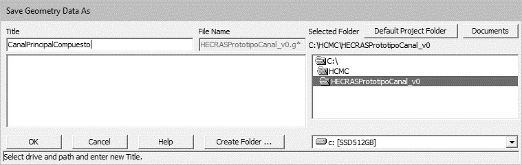

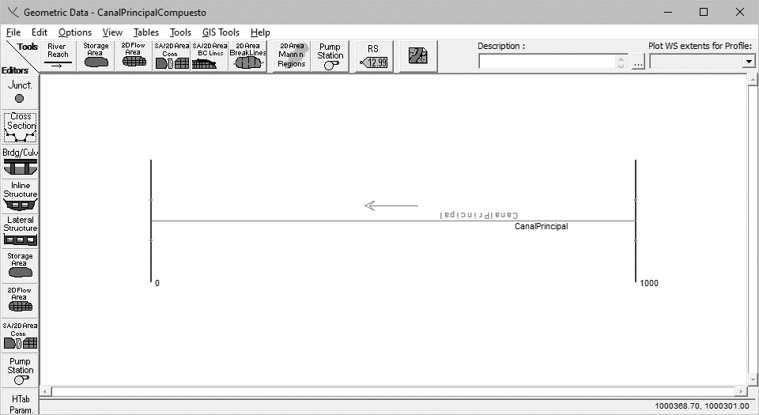

7. Seleccione el eje del canal prototipo y visualice el perfil, observará que las bancas se encuentran 1.5 m sobre el fondo.

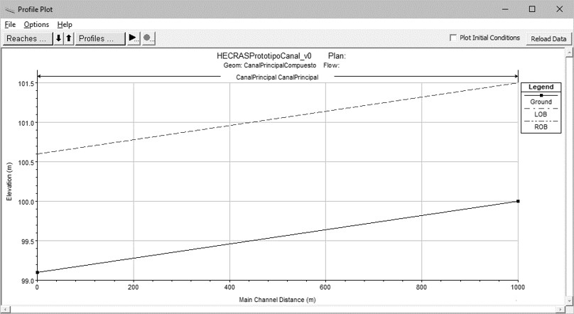

## 3. Interpolación de secciones transversales

1. En la ventana del editor de geometría, ir al menú _Tools / XS Interpolation / Between 2 XS’ sections_. Interpolar cada 100 metros. Obtendrá 11 secciones transversales espaciadas cada 100 metros. 

> Estas secciones son requeridas para el correcto tránsito del caudal o los hidrogramas de entrada establecidos en las condiciones de frontera. Las secciones interpoladas se identifican por un * al final de la abscisa. Guardar la geometría obtenida. Visualizar el perfil activando las marcas de terreno del abscisado.

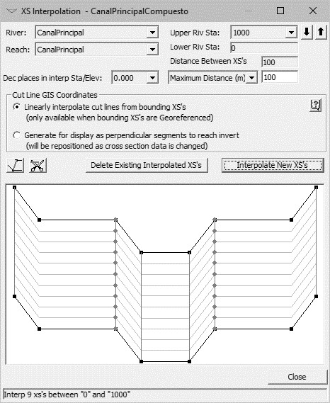

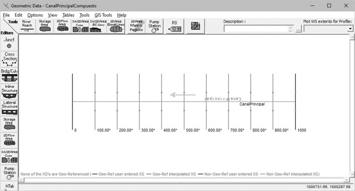

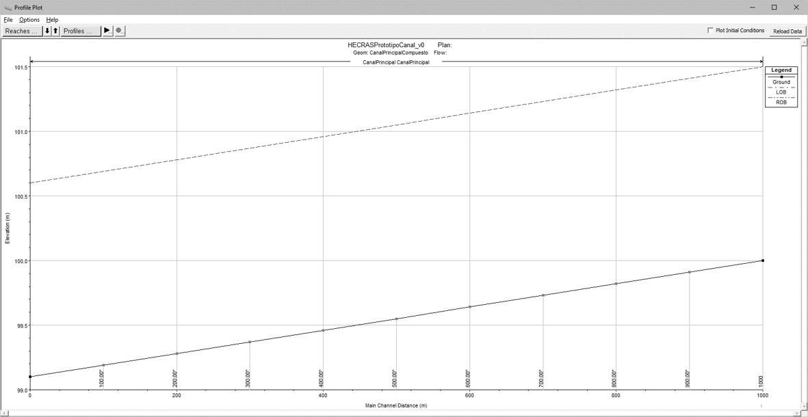

## 4. Datos de flujo y condiciones de frontera para flujo permanente

1. En la ventana principal del proyecto HEC-RAS, ir al menú _Edit_ y seleccionar _Steady Flow Data_ o dar clic en el botón _View / Edit steady flow data_. En la ventana _Steady Flow Data_, agregar 7 perfiles de flujo, uno para cada caudal pico obtenido para los diferentes periodos de retorno y para el caudal medio.

Ingresar los caudales pico obtenidos para cada periodo de retorno - Tr, que se encuentran registrados en el libro [R.HydroTools.HidrogramaRegVal.xlsm](https://github.com/rcfdtools/R.HydroTools/tree/main/tool/HidrogramaRegVal), correspondientes al punto de inicio o del nodo intermedio con mayor caudal pico obtenido, que para el caso de estudio corresponde al nodo J4660.

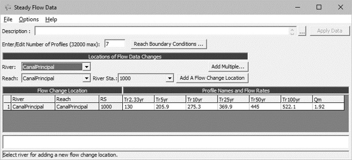

Desde el menú _Options_, cambiar el nombre de los perfiles para cada Tr.

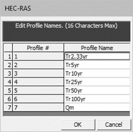

2. Establecer las condiciones de frontera para flujo subcrítico, utilice profundidad normal e introduzca la pendiente de diseño del río correspondiente a 0.0008969 m/m.

> Modelar a descarga libre.

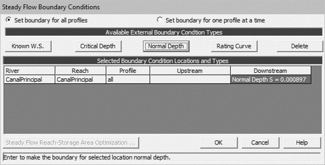

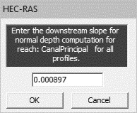

3. Guarde los caudales y condiciones de frontera como _Steady_.

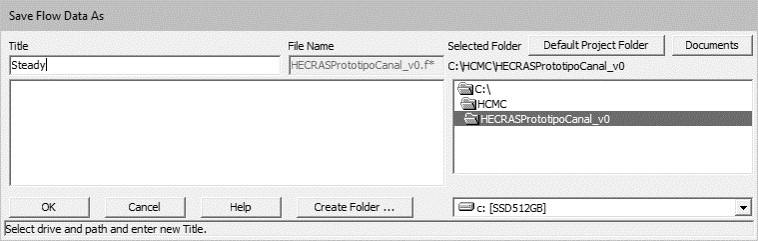

## 5. Datos de flujo y condiciones de frontera para flujo no permanente

1. En la ventana principal del proyecto HEC-RAS, ir al menú _Edit_ y seleccionar _Unsteady Flow Data_ o dar clic en el botón _View / Edit unsteady flow data_.
 
En la ventana Unsteady Flow Data, ingresar el hidrograma de flujo correspondiente al periodo de retorno de 100 años en las condiciones de frontera aguas arriba localizadas en la abscisa 1000 m utilizando 4321 pulsos (cada 1 minuto).

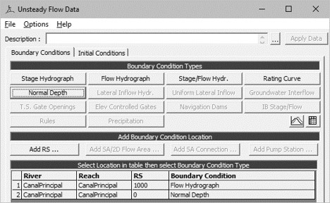

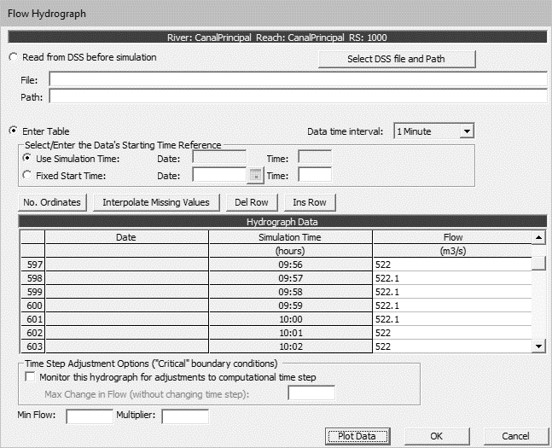

2. Aguas abajo definir profundidad normal e ingresar la pendiente de diseño del canal.

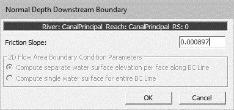

Visualice el hidrograma.

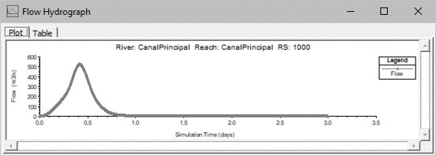

3. Establecer en condiciones iniciales, un flujo inicial o flujo de precalentamiento del modelo de 0.0001 m³/s. 

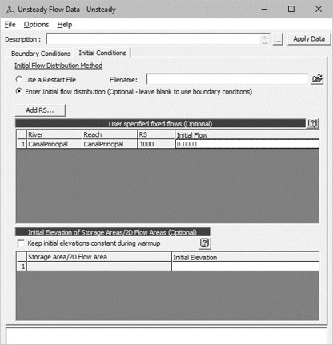

4. Guarde el hidrograma y condiciones de frontera como _Unsteady_.4.

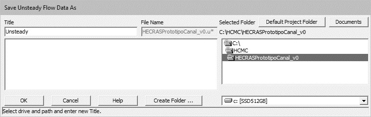

## 6. Modelación en flujo permanente

1. En la ventana principal del proyecto HEC-RAS, ir al menú _Run_ y seleccionar _Steady Flow Analysis_ o dar clic en el botón _Perform a steady flow simulation_.

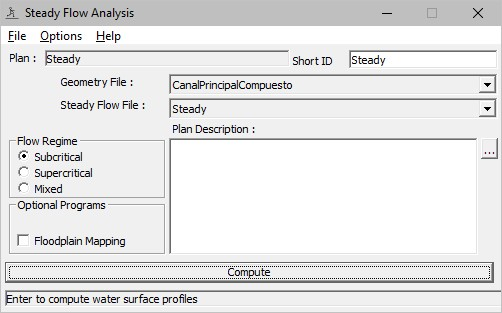

2. En _Options_, seleccionar _Critical Depth Output Option_ y marcar la casilla _Critical Always Calculated_.

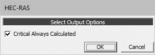

3. Guardar como _Steady_.

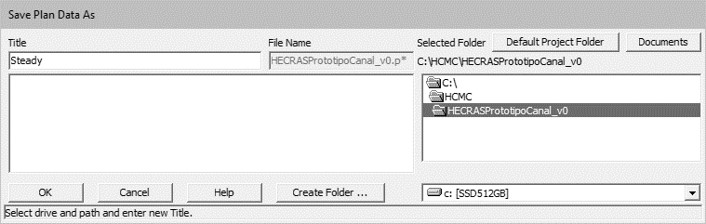

4. Ejecutar en condiciones de flujo subcrítico y revisar el Log oo registro de resultados.

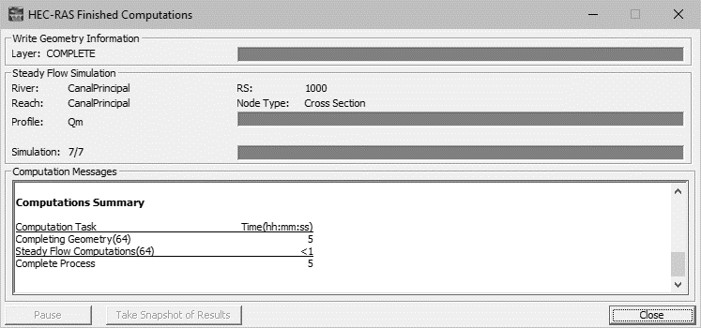

5. Visualice los resultados obtenidos en las secciones transversales y el perfil de flujo.

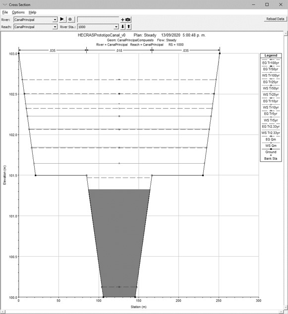

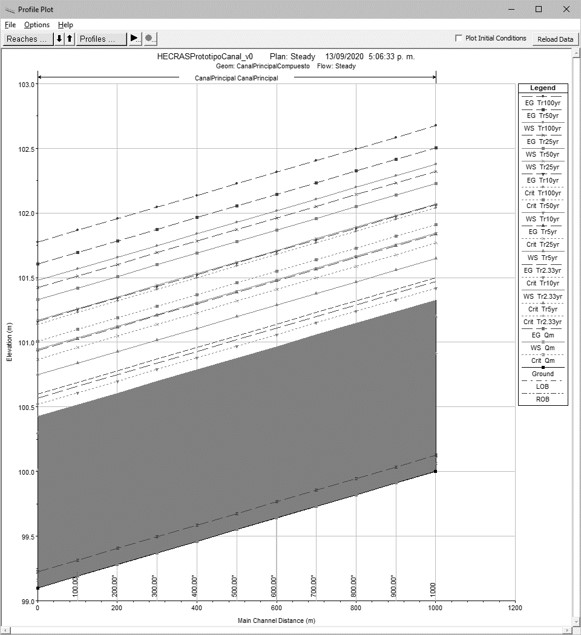

6. Visualice los resultados obtenidos y verifique que las velocidades obtenidas sean < 2 m/s en la sección del cauce dominante o río (river) y < 3 m/s en el valle (valley).

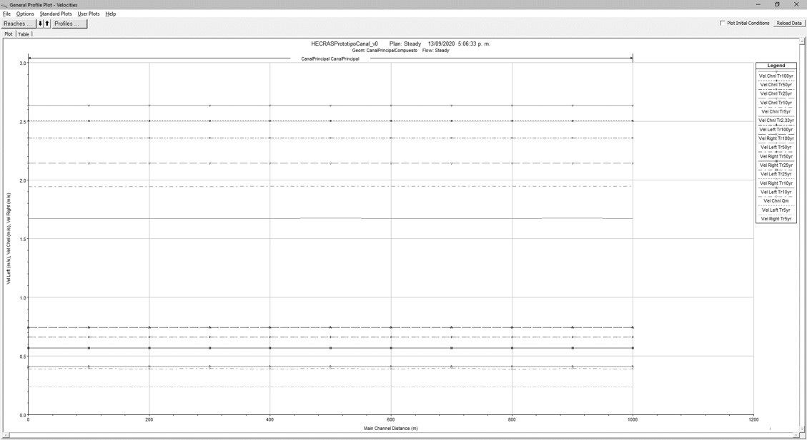

7. Visualice los resultados obtenidos y verifique que los cortantes sean < 10 N/m² en la sección del cauce dominante o río (river) y < 20 N/m² en el valle (valley).

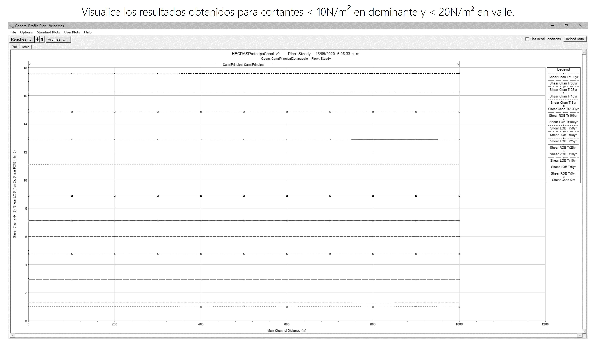

8. Visualice la representación 3D.

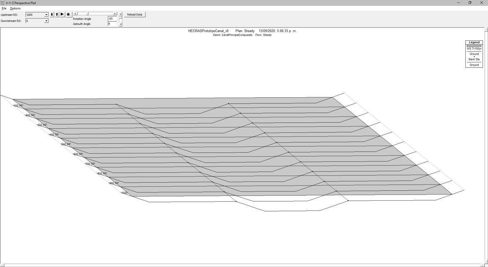

9. Revise las tablas de resultados.

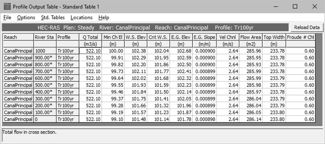

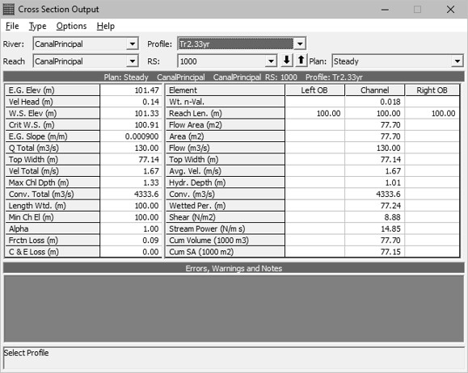

## 7. Modelación para flujo no permanente

1. En la ventana principal del proyecto HEC-RAS, ir al menú _Run_ y seleccionar _Unsteady Flow Analysis_ o dar clic en el botón _Perform a usteady flow simulation_. Guardar como _Unsteady_.

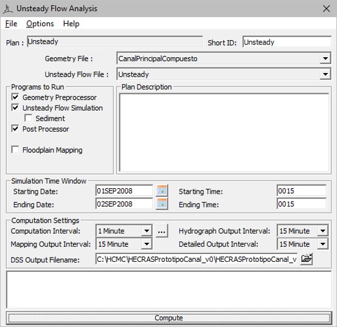

2. Ejecutar y revisar registro de salida.

> Para este análisis utilizaremos un intervalo de cálculo de 1 minuto sin evaluar la condición de Courant.

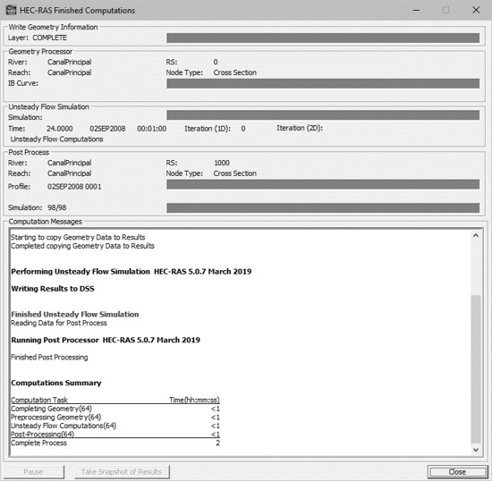

3. Visualice los resultados obtenidos en las secciones transversales y el perfil de flujo.

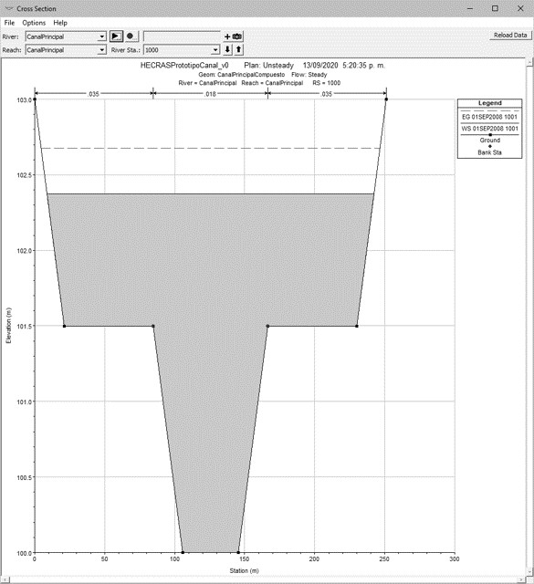

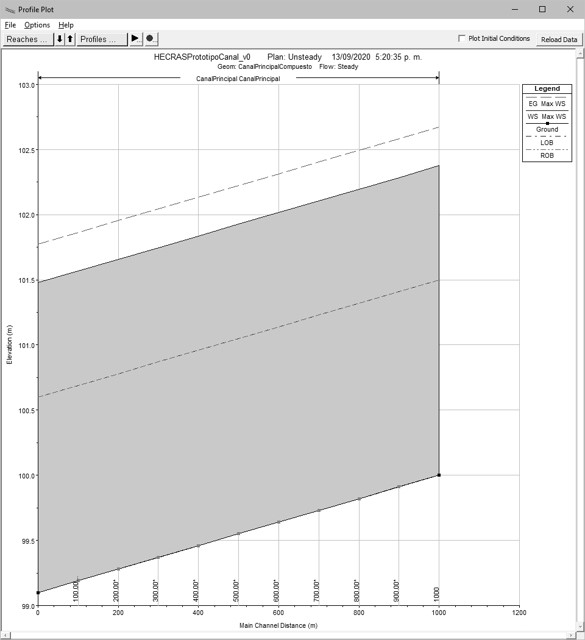

4. Visualice los resultados obtenidos y verifique que las velocidades sean < 3 m/s en valle.

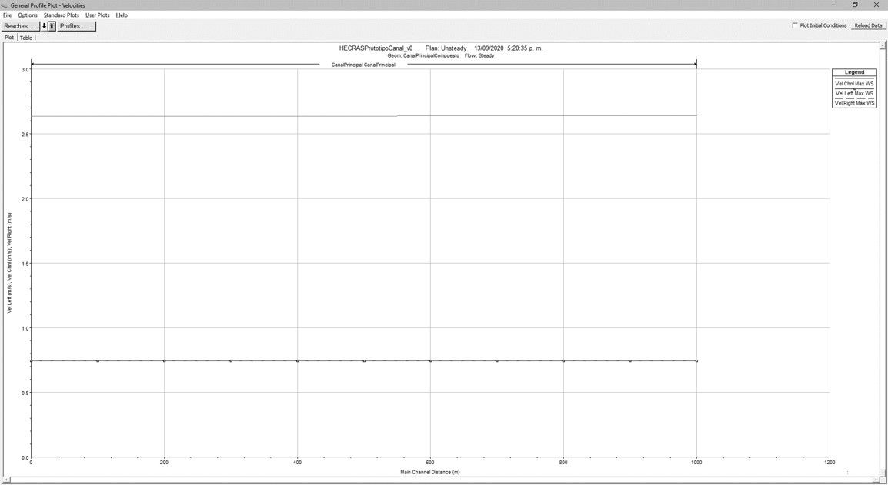

5. Visualice los resultados obtenidos y verifique los cortantes sean < 20 N/m² en valle.

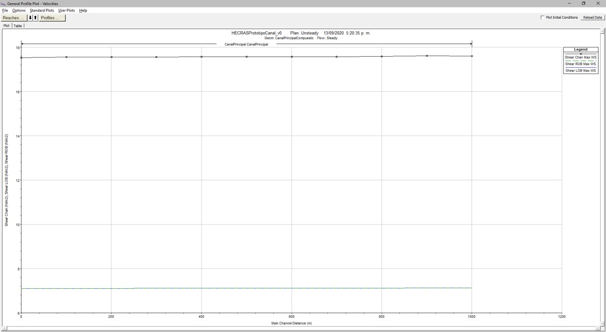

6. Revise las tablas de resultados.

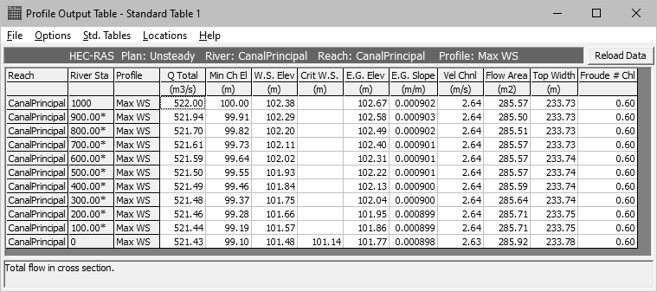

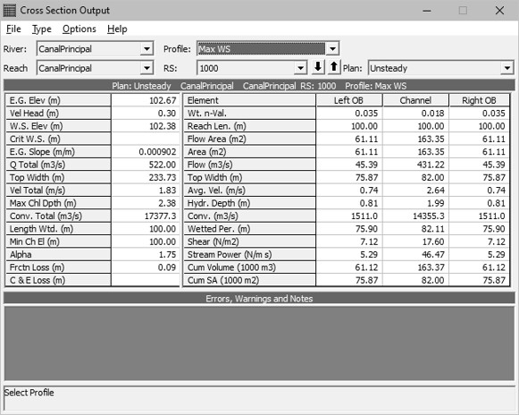

## Actividades de proyecto :triangular_ruler:

Utilizando la [plantilla suministrada](../../file/report/R.HCMC.PlantillaSoporteDesarrollo.docx), cree un documento soporte mostrando las actividades desarrolladas en el orden presentado en esta actividad, junto con los análisis y recomendaciones realizadas, convierta a Adobe Acrobat (.pdf) y guarde en la carpeta _/activity_ del repositorio de datos del proyecto; nombre el archivo con el código de la actividad agregando al final la fecha de control documental en formato aaaammdd (p. ej. M01A14_20250531.pdf).

En la siguiente tabla se listan las actividades que deben ser desarrolladas y documentadas por cada estudiante o grupo de proyecto.

| Actividad | Alcance                                                                                                                                                                                                                                                                                                                                                                                                                                                                                                                                              |
|:----------|:-----------------------------------------------------------------------------------------------------------------------------------------------------------------------------------------------------------------------------------------------------------------------------------------------------------------------------------------------------------------------------------------------------------------------------------------------------------------------------------------------------------------------------------------------------|
| M01A14    | A partir del diseño geométrico e hidráulico de su proyecto, crear un prototipo del canal principal (sección compuesta por cauce dominante y valle) y realizar la modelación en flujo Permanente (todos los periodos de retorno definidos y caudal medio) y No Permanente del canal (periodo de retorno 2.33 y 100 años o los definidos para el diseño). Comprima y cargue el modelo en la carpeta /file/hec/.                                                                                                                                        | 
| M01A14    | Cree una copia de la geometría, agregue y modele los cauces laterales de su proyecto. Requerirá de dos nodos o junctions e ingresar caudales en flujo permanente al inicio de cada tramo y en las intersecciones, en no permanente no es requerido el ingreso de hidrogramas en junctions. Tenga en cuenta que la geometría debe incluir la pendiente de diseño de los cauces laterales y la geometría de la secciones tipo obtenidas. Modelar solo para periodo de retorno 2.33, 25, 100 años o los definidos para el diseño.                       | 
| M01A14    | Opcional: verificar la formulación correcta de los libros de cálculo suministrados. En las notas de la ficha de control documental indicar el método de verificación y si se requieren o no ajustes.                                                                                                                                                                                                                                                                                                                                                 |
| M01A14    | En una tabla y al final del informe de avance de esta entrega, indique el detalle de las actividades realizadas por cada integrante de su grupo; utilice las siguientes columnas: `Nombre del integrante`, `Actividades realizadas`, `Tiempo dedicado en horas` (si presenta la entrega individualmente, no es necesaria la presentación de esta tabla).  Para actividades que no requieren del desarrollo de elementos de avance, indicar si realizo la lectura de la guía de clase y las lecturas indicadas al inicio en los requerimientos. | 

> Nota 1: para la revisión del proyecto final, guarde los libros cálculo de Microsoft Excel y los archivos generados en esta actividad, en las localizaciones indicadas en cada numeral.
>
> Nota 2: una vez el instructor realice la revisión y el estudiante presente las correcciones o ajustes solicitados, será necesario cargar una nueva versión de los archivos en el repositorio del proyecto, incluyendo o actualizando al final del nombre del archivo, la fecha de presentación en formato aaaammdd y manteniendo las versiones anteriores presentadas.
>

## Referencias

* US Army Corps of Engineers. HEC-RAS River Analysis System, Hydraulic Reference Manual, Version 5.0. CPD-69. 2016.2

## Control de versiones

| Versión    | Descripción        | Autor                                      | Horas |
|------------|:-------------------|--------------------------------------------|:-----:|
| 2025.06.11 | Migración a GitHub | [rcfdtools](https://github.com/rcfdtools)  |   3   |

##

_R.HCMC es de uso libre para fines académicos, conoce nuestra licencia, cláusulas, condiciones de uso y como referenciar los contenidos publicados en este repositorio, dando [clic aquí](../../LICENSE.md)._

_¡Encontraste útil este repositorio!, apoya su difusión marcando este repositorio con una ⭐ o síguenos dando clic en el botón Follow de [rcfdtools](https://github.com/rcfdtools) en GitHub._

| [:arrow_backward: Anterior](../M01A14/Readme.md) | [:house: Inicio](../../README.md) | [:beginner: Ayuda / Colabora](https://github.com/rcfdtools/R.SIGE/discussions/99999) | [Siguiente :arrow_forward:](../M01A02/Readme.md) |
|--------------------------------------------------|-----------------------------------|--------------------------------------------------------------------------------------|--------------------------------------------------|

[^1]: 