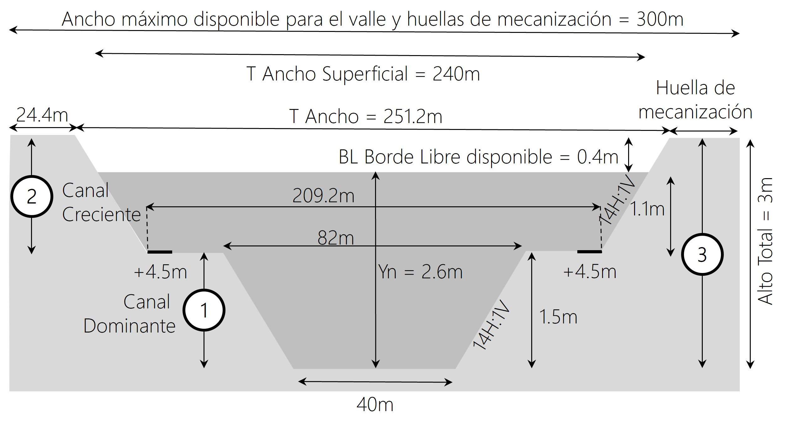

# 1. 14. Prototipo digital del canal diseñado
Keywords: `hydraulic-prototipe`  `m01a14`

A partir del diseño geométrico e hidráulico de la sección y la pendiente del cauce, crear un prototipo del canal principal (sección compuesta por cauce dominante y valle) y realice la modelación en flujo Permanente (todos los periodos de retorno y caudal medio) y No Permanente del canal (periodo de retorno 2.33 y 100 años).

## Objetivos

* Crear un prototipo que permita estudiar hidráulicamente en condiciones de flujo permanente y no permanente el canal compuesto diseñado.

## Requerimientos

Archivos, actividades previas, lecturas y herramientas requeridas para el desarrollo de esta actividad:

| Requerimiento                                                                                           | Descripción                                                                                                                     |
|:--------------------------------------------------------------------------------------------------------|:--------------------------------------------------------------------------------------------------------------------------------|
| [:toolbox:Herramienta](https://www.microsoft.com/es/microsoft-365/excel?market=bz)                      | Microsoft Excel 365.                                                                                                            |
|  [:toolbox:Herramienta](https://www.hec.usace.army.mil/software/hec-ras/)                               | HEC-RAS 6.6 o superior.                                                  |

> Para los diferentes avances de proyecto, es necesario guardar y publicar las diferentes versiones generadas del (los) libro (s) de Microsoft Excel y reportes o informes, agregando al final la fecha de control documental en formato aaaammdd, p. ej. _R.HydroTools.DisenoCaucesParametros.20250528.xlsx_.

## 1. Creación de proyecto HEC-RAS

Para la creación del prototipo, utilizaremos las especificaciones de la sección hidráulica obtenida a partir del Método de la Fuerza Tractiva usando Shields.

1. En HEC-RAS, ir al menú File y clic en New Project. Crear la carpeta _/file/hec/HECRAS_v0_PrototipoCanal_ y guardar el proyecto como HECRAS_v0_PrototipoCanal.

> En el menú _Options_, clic en _Unit System_, establecer unidades en el sistema internacional.

## 2. Creación de geometría

1. En la ventana principal de HEC-RAS, ir al menú _Edit_ y clic en _Geometric Data_ o clic en el ícono de _View / Edit geometric data_. En el editor de geometría, clic en _Add New River Reach_. Dibujar manualmente una línea horizontal de derecha a izquierda y n ombrar como _CanalPrincipal_.

2. En el menú _GIS Tools_, seleccionar la opción _Reach Invert Lines Table_ y modificar las coordenadas por las mostradas. El nodo 1 corresponde al inicio de línea al este y el nodo 2 al fin de la línea al oeste. El prototipo creado tendrá una longitud de 1000 metros. Luego de dar clic en Ok, observará que no es visible la línea, para lo cual deberá ajustar el tamaño visible del espacio de trabajo

3. En el menú _View_, seleccionar la opción Set _Schematic Plot Extents_ e ingresar los valores mostrados. Verifique la dirección vectorial de la línea de este a oeste.

4. Para la creación de las secciones transversales, de clic en el ícono _Cross Section_. En la ventana _Cross Section Data_, ir al menú _Options_ y dar clic en _Add a new Cross Section_. Ingresar los parámetros registrados en el libro de diseño [R.HydroTools.Diseno GeometricoHidraulicoVertical.xlsm](https://github.com/rcfdtools/R.HydroTools/tree/main/tool/DisenoGeometricoHidraulicoVertical) correspondientes a la sección de inicio en la abscisa 1000 m del prototipo, dar clic en _Apply Data_. Verificar la posición de las bancas en la corona del talud del cauce dominante.

4. Repita el procedimiento anterior para la sección de descarga localizada en la abscisa cero.

## Actividades de proyecto :triangular_ruler:

Utilizando la [plantilla suministrada](../../file/report/R.HCMC.PlantillaSoporteDesarrollo.docx), cree un documento soporte mostrando las actividades desarrolladas en el orden presentado en esta actividad, junto con los análisis y recomendaciones realizadas, convierta a Adobe Acrobat (.pdf) y guarde en la carpeta _/activity_ del repositorio de datos del proyecto; nombre el archivo con el código de la actividad agregando al final la fecha de control documental en formato aaaammdd (p. ej. M01A00_20250531.pdf).

En la siguiente tabla se listan las actividades que deben ser desarrolladas y documentadas por cada estudiante o grupo de proyecto.

| Actividad | Alcance                                                                                                                                                                                                                                                                                                                                                                                                                                                                                                                                              |
|:----------|:-----------------------------------------------------------------------------------------------------------------------------------------------------------------------------------------------------------------------------------------------------------------------------------------------------------------------------------------------------------------------------------------------------------------------------------------------------------------------------------------------------------------------------------------------------|
| M01A00    | Descargar el archivo [R.HydroTools.DisenoCaucesParametros.xlsx](https://github.com/rcfdtools/R.HydroTools/blob/main/tool/DisenoCaucesParametros/R.HydroTools.DisenoCaucesParametros.xlsx) disponible en GitHub, e incluirlo en el repositorio.                                                                                                                                                                                                                                                                                                       | 
| M01A00    | Investigar, verificar y registrar en el libro de Excel, los parámetros técnicos, hidráulicos e hidrológicos indicados en esta actividad.  Para el grupo de parámetros normativos, ambientales / sociales y territoriales, revisar los parámetros actualmente reportados, investigar, registrar y actualizar.                                                                                                                                                                                                                                   | 
| M01A00    | Registrar los valores obtenidos en el [libro de parámetros generales](https://github.com/rcfdtools/R.HydroTools/tree/main/tool/DisenoCaucesParametros) requeridos para el diseño y la modelación. Guardar en la carpeta _/file/table_.                                                                                                                                                                                                                                                                                                               |
| M01A00    | Opcional: verificar la formulación correcta de los libros de cálculo suministrados. En las notas de la ficha de control documental indicar el método de verificación y si se requieren o no ajustes.                                                                                                                                                                                                                                                                                                                                                 |
| M01A00    | En una tabla y al final del informe de avance de esta entrega, indique el detalle de las actividades realizadas por cada integrante de su grupo; utilice las siguientes columnas: `Nombre del integrante`, `Actividades realizadas`, `Tiempo dedicado en horas` (si presenta la entrega individualmente, no es necesaria la presentación de esta tabla).  Para actividades que no requieren del desarrollo de elementos de avance, indicar si realizo la lectura de la guía de clase y las lecturas indicadas al inicio en los requerimientos. | 

> Nota 1: para la revisión del proyecto final, guarde los libros cálculo de Microsoft Excel y los archivos generados en esta actividad, en las localizaciones indicadas en cada numeral.
>
> Nota 2: una vez el instructor realice la revisión y el estudiante presente las correcciones o ajustes solicitados, será necesario cargar una nueva versión de los archivos en el repositorio del proyecto, incluyendo o actualizando al final del nombre del archivo, la fecha de presentación en formato aaaammdd y manteniendo las versiones anteriores presentadas.
>

## Referencias

* 

## Control de versiones

| Versión    | Descripción        | Autor                                      | Horas |
|------------|:-------------------|--------------------------------------------|:-----:|
| 2024.02.24 | Migración a GitHub | [rcfdtools](https://github.com/rcfdtools)  |   8   |
| 2014.01.11 | Versión inicial.   | [rcfdtools](https://github.com/rcfdtools)  |  18   |

##

_R.HCMC es de uso libre para fines académicos, conoce nuestra licencia, cláusulas, condiciones de uso y como referenciar los contenidos publicados en este repositorio, dando [clic aquí](../../LICENSE.md)._

_¡Encontraste útil este repositorio!, apoya su difusión marcando este repositorio con una ⭐ o síguenos dando clic en el botón Follow de [rcfdtools](https://github.com/rcfdtools) en GitHub._

| [:arrow_backward: Anterior](../M01A00/Readme.md) | [:house: Inicio](../../README.md) | [:beginner: Ayuda / Colabora](https://github.com/rcfdtools/R.SIGE/discussions/99999) | [Siguiente :arrow_forward:](../M01A02/Readme.md) |
|--------------------------------------------------|-----------------------------------|--------------------------------------------------------------------------------------|--------------------------------------------------|

[^1]: 