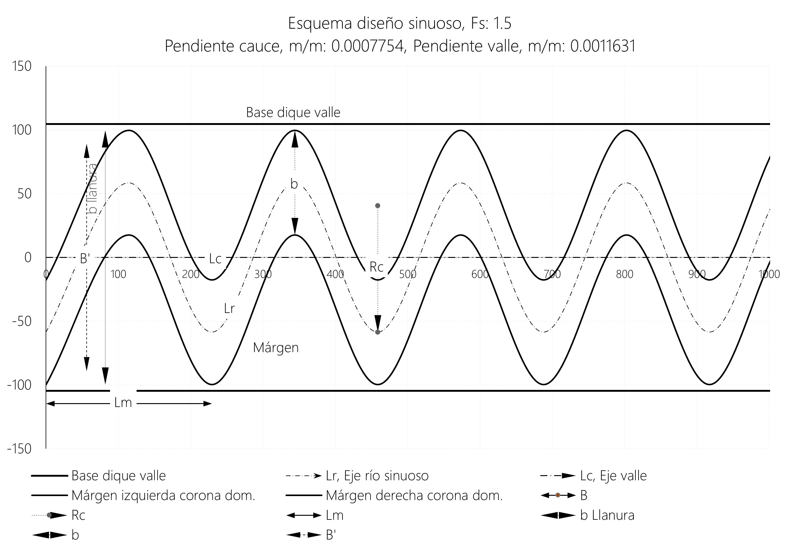
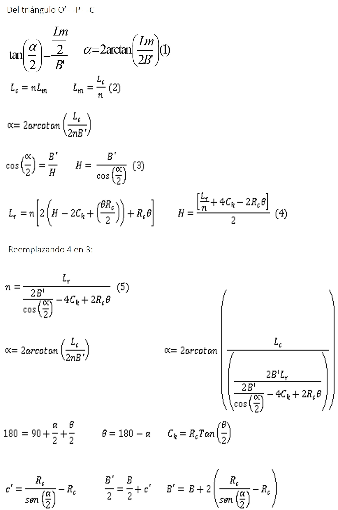
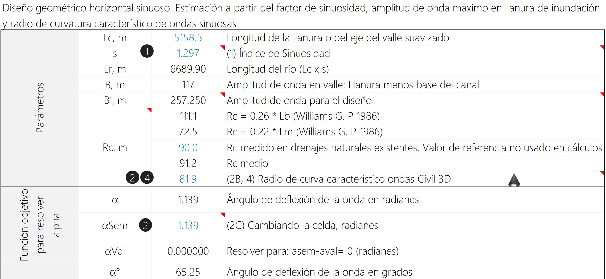
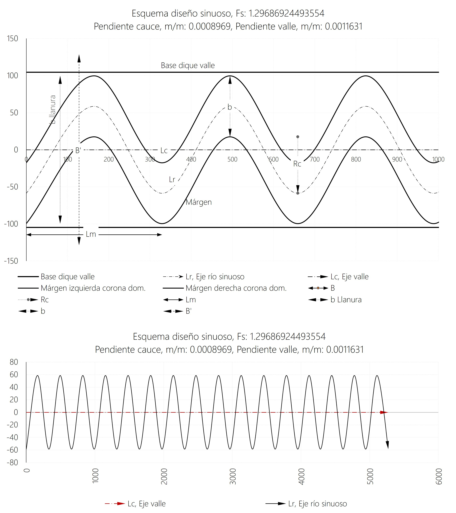

# 1.15. Diseño geométrico horizontal o diseño sinuoso
Keywords: `realigment`  `hydraulics` `hydraulic-design` `sinusoidal-river-design ``m01a015`

A partir de la estimación de los radios de curvatura característicos de los meandros o las ondas existentes en el cauce natural a reemplazar, el índice de sinuosidad y los anchos de sección diseñados hidráulicamente para el transporte del caudal dominante y creciente, determinar los atributos geométricos requeridos para el trazado del cauce sinuoso.

## Objetivos

* Entender conceptos aplicables al diseño geométrico horizontal de cauces sinuosos.
* Realizar diferentes diseños sinuosos a partir de diferentes criterios y valores de sinuosidad. (3 diseños)

## Requerimientos

Archivos, actividades previas, lecturas y herramientas requeridas para el desarrollo de esta actividad:

| Requerimiento                                                                                                                          | Descripción                                                                |
|:---------------------------------------------------------------------------------------------------------------------------------------|:---------------------------------------------------------------------------|
| [:toolbox:Herramienta](https://www.microsoft.com/es/microsoft-365/excel?market=bz)                                                     | Microsoft Excel 365.                                                       |
| [:toolbox:Herramienta](https://qgis.org/)                                                               | QGIS 3.42 o superior.                                                    |
| [:open_file_folder:R.HydroTools.DisenoSinuosoCanal.xlsm](https://github.com/rcfdtools/R.HydroTools/tree/main/tool/DisenoSinuosoCanal)  | Libro de cálculo para el diseño geométrico horizontal sinuoso de canales.  |

> Para los diferentes avances de proyecto, es necesario guardar y publicar las diferentes versiones generadas del (los) libro (s) de Microsoft Excel y reportes o informes, agregando al final la fecha de control documental en formato aaaammdd, p. ej. _R.HydroTools.DisenoCaucesParametros.20250528.xlsx_.

## 0. Conceptos generales

Para el diseño sinuoso son requeridos los parámetros geométricos obtenidos en las actividades anteriores, a partir de estos valores y con el libro de diseño, obtendremos los siguientes valores:

* Ángulo de deflexión de la onda, α.
* Longitud sinuosa del río, Lr.
* Número de ondas sinuosas, n.
* Longitud hidráulica de cada onda, Lb.
* Longitud de aproximación entre ondas o entre-tangencia, La.
* Número de subdivisiones en el eje del valle suavizado, Lc * (Lm/4).

> Estos valores serán utilizados para el trazado de ejes en Autodesk Civil 3D.

### Geometría y solución trigonométrica de una onda sinuosa

* Lm: Longitud de onda.
* Lb: Longitud hidráulica de la onda. Incluida la longitud de aproximación.
* α: Ángulo de deflexión de la onda.
* La: Longitud de aproximación entre ondas.
* B: Amplitud de onda. Definida hasta la línea de bancas.
* B’: Amplitud de onda para el trazado.
* ϴ: Radio de apertura.
* Lc: Longitud del valle suavizado.

> El parámetro _n_ corresponde al número de ondas sinuosas requeridas.

### Procedimiento general de aplicación

* (1): Decidir el factor de sinuosidad a aplicar para: a. Mantener la pendiente original del cauce natural, b. Disminuir la pendiente del cauce con un factor de sinuosidad mayor ó c. Aumentar la pendiente del cauce con un factor de sinuosidad menor.
* (2A, 2B, 2C, 2D): Ingresar un radio de curvatura Rc (m) menor o igual al medido. Puede ingresar un valor de 10 m para que solver estime el máximo permisible para que la Longitud de Aproximación La (m) sea cero, o para que una onda se empalme con otra sin aproximación. Para Solver establecer una _alphasemilla_ cercana a cero y positiva, o ingresar 1. Nota: Este valor no puede ser una raíz negativa obtenida por Solver.
* (3A, 3B): Ingresar el valor calculado de ancho de la base del canal para caudal dominante de Tr: 2.33yr y el ancho del valle máximo. Al ancho de la base del valle disponible se le debe descontar un ancho de separación entre la curva externa de cada onda al borde de talud de la base del valle para evitar que el talud del cauce dominante y del valle sea contínuo y asi prevener la erosión del talud. Se recomiendan 5 m a cada lado. Ejemplo: Si el ancho disponible para valle es de 160m se debe realizar el diseño sinuoso con 150m. En el trazado de ejes usando CIVIL 3D se dibuja el corredor de 160 m, un offset de 5 m a cada lado y las curvas externas se trazan dentro del corredor efectivo libre para garantizar la separación de taludes.
* (4): Para trazar el eje de la clotoide en CIVIL3D, se toma la longitud hidraulica de cada onda y se divide en 4 partes (Lm/4), se multiplica por el número de ondas requeridas y se divide el eje del valle en este numero. Luego se traza con una línea espiral o una clotoide de radio Rc característico calculado por el eje sinuoso por los puntos extremos de intersección de cada subtramo con el borde externo de la onda. Para las sample lines dividir B' entre 2 y utilizar este valor para su construcción.

### Longitud sinuosa del río (lr) 

Esta longitud se obtiene multiplicando la longitud del valle suavizado por el factor de sinuosidad. Generalmente, se puede optar por aplicar cualquiera de las siguientes directrices:

| Directriz                                                                                                                                       | Notas                                                                                                                                                                   |
|:------------------------------------------------------------------------------------------------------------------------------------------------|:------------------------------------------------------------------------------------------------------------------------------------------------------------------------|
| A. Conservar la longitud del río natural a reemplazar                                                                                           | Se obtiene calculando el factor de sinuosidad equivalente respecto a la longitud del valle suavizado trazado. (Se mantiene la pendiente del cauce natural a reemplazar) |
| B. Determinar la longitud del río natural aplicando el factor de sinuosidad característico estimado para la cuenca a intervenir.                | La longitud del río puede no ser igual a la longitud a reemplazar, obteniendo una mayor o menor pendiente.                                                              |
| C. Aumentar la longitud del río sinuoso aplicando un factor de sinuosidad mayor que permita obtener una pendiente menor a la del cauce natural. | La longitud del río es mayor a la longitud a reemplazar, obteniendo una menor pendiente.                                                                                |

> Nota: los cauces sinuosos tienen un factor de sinuosidad inferior a 1.5. Cauces con factores superiores a 1.5, se consideran meandriformes.

### Prevención de co-alineación de taludes en zonas de curva

Al ancho de la base del valle disponible se le debe descontar un ancho de separación entre la curva externa de cada onda al borde de talud de la base del valle para evitar que el talud del cauce dominante y del valle sea continuo y así prevenir la erosión del talud. Se recomiendan 5 m a cada lado. 

> Este criterio fue aplicado previamente en el diseño de la sección hidráulica compuesta.
> 
> Ejemplo: si el ancho disponible en la base del valle es de 160 m, se debe realizar el diseño sinuoso para un ancho máximo de 150 m. En el trazado de ejes usando Autodesk Civil 3D se dibuja el corredor de 160 m, un offset de 5 m a cada lado y las curvas externas se trazan dentro del corredor efectivo libre para garantizar la separación y no co-alineación de taludes.

## 1. Diseño sinuoso 1 - Conservando la longitud del río natural a reemplazar

Parámetros:

* B: ancho superior corona dominante: 82 m.
* b llanura: Ancho inferior creciente: 199.2 m = (209.2 m valle – 10 m para prevenir co-alineación de los taludes, 5 m restados a cada lado).
* Lc: longitud valle suavizado: 5158.5 m.
* Lr: longitud cauce natural actual: 6689.9 m.

1. En el libro de diseño [R.HydroTools.DisenoSinuosoCanal.xlsm](https://github.com/rcfdtools/R.HydroTools/tree/main/tool/DisenoSinuosoCanal), ingrese la longitud de la llanura o valle suavizado `Lc` y con la herramienta _Data / What-if Analysis / Goal seek_ (Buscar objetivo), busque la longitud del cauce cambiando el factor o índice de sinuosidad. Obtendrá un factor de 1.297, mismo valor obtenido en la actividad [M01A10](../M01A10).

> En versiones antiguas de Microsoft Excel, ir al menú _Datos / Pruebas de Hipótesis / Función Objetivo_. 

2. En QGIS, mida el radio aproximado de curvatura de las ondas de los cauces usando la capa de la red de drenaje natural. Obtendrá un valor de referencia de aproximadamente 90 metros. Registre este valor en el campo `Rc` del libro de diseño.

> El tercer valor `Rc` registrado, corresponde al radio a utilizar en el diseño geométrico. Un valor aproximado será resuelto para la geometría de entrada usando _Solver_ de Excel.

3. En _Excel / File / Options / Add-ins_, active el complemento Solver.

4. En el tercer valor del campo _Rc_, ingrese un 1 como valor de entrada del radio de curvatura a resolver y en _αSem_ también ingrese 1. 

> Tenga en cuenta que los métodos numéricos de Solver, podrá encontrar múltiples soluciones o raíces de las ecuaciones para los parámetros de entrada, utilice la primer solución para los valores de referencia ingresados.

5. De clic en el botón `(2A). Estimar α y Rc máximo. Solver`, automáticamente será calculado el valor de `Rc` y el ángulo _α_ de deflexión de la onda en radianes. Obtendrá un Rc de 81.9 m y alpha en 1.139 radianes o 65.25 grados.

Para la solución con Solver, utilizaremos las siguientes restricciones y configuración:

* La = 0, entre-tangencia mínima.
* alpha α >=0, cualquier deflexión que permita generar un cauce sinuoso.
* tetta <= 179, máxima deflexión o curvatura que que permita generar un cauce sinuoso.
* Solving method: GRG Nonlinear (constraint precisión = 0.0001, convergence = 0.0001)

6. Ajuste manualmente el Rc de diseño a 82 m y de clic en el botón `(2D). Calcular α para Rc de diseño. Goal seek` para recalcular el ángulo de deflexión, obtendrá un  alpha en 1.139 radianes o 65.24 grados.

7. En la parte inferior del libro de diseño, ingrese el ancho superior de la corona `b` del cauce dominante, correspondiente a 82 metros, el ancho en la base de la llanura descontando los anchos de prevención de coalineación, correspondiente a 199.2 m, el valor de coalineación lateral correspondiente a 5 metros y la diferencia de nivel Δy entre los fondos de la sección de inicio y entrega correspondiente a 6 m.

8. Verifique los parámetros de dibujo geométrico obtenidos para las ondas sinuosas y verifique que las pendientes del cauce sinuoso y valle suavizado corresponde a las pendientes de diseño.

Resultados obtenidos y atributos para el dibujo en Autodesk® Civil 3D o en Autocad.

* α - Angulo de deflexión de la onda : 65.24º.
* Lr - Longitud sinuosa del río: 6689.9 m.
* Número de ondas sinuosas: 16.
* Lb - Longitud hidráulica de cada onda: 427.4 m.
* La - Longitud de aproximación entre ondas o entre-tangencia: 50 m.
* Número de subdivisiones en el eje del valle suavizado (número de ondas x 4): 64.
* Pendiente del Río: (6 m / 6689.9 m) = 0.0008969 m/m (pendiente idéntica a la del cauce natural a reemplazar).
* B’: 256.522 m.
* B’/2: 128.261 m.
* Lm: 329.566 m.
* S – Factor de sinuosidad Equivalente: 1.297.

Para el cálculo de la pendiente, la diferencia de nivel respecto a las cotas de inicio y fondo entre las secciones de inicio y entrega es de 6 metros.

## 2. Diseño sinuoso 2 - Determinando la longitud del río natural aplicando el factor de sinuosidad característico estimado para la cuenca a intervenir

Utilizando el factor de sinuosidad característico obtenido en la actividad [M01A10](../M01A10), correspondiente al análisis a partir de la simplificación del valle utilizando un radio de 180 metros, a través del cual se pudo determinar un valor de 1.1733 a partir de la ecuación de regresión **y = 0.8629 * x0.0349**, donde x corresponde a un cauce con longitud de 6689.9 m, estime los parámetros de diseño del cauce sinuoso.

Resultados obtenidos y atributos para el dibujo en Autodesk® Civil 3D o en Autocad.

* α - Angulo de deflexión de la onda : 75.38º.
* Lr - Longitud sinuosa del río: 6052.47 m.
* Número de ondas sinuosas: 11.5.
* Lb - Longitud hidráulica de cada onda: 525.7258 m.
* La - Longitud de aproximación entre ondas o entre-tangencia: 15 m.
* Número de subdivisiones en el eje del valle suavizado (número de ondas x 4): 46.
* Pendiente del Río: (6 m / 6052.47 m) = 0.0009913 m/m (pendiente mayor a la del cauce natural a reemplazar).
* B’: 289.978 m.
* B’/2: 144.989  m.
* Lm: 448.074 m.
* S – Factor de sinuosidad Equivalente: 1.173.

## Actividades de proyecto :triangular_ruler:

Utilizando la [plantilla suministrada](../../file/report/R.HCMC.PlantillaSoporteDesarrollo.docx), cree un documento soporte mostrando las actividades desarrolladas en el orden presentado en esta actividad, junto con los análisis y recomendaciones realizadas, convierta a Adobe Acrobat (.pdf) y guarde en la carpeta _/activity_ del repositorio de datos del proyecto; nombre el archivo con el código de la actividad agregando al final la fecha de control documental en formato aaaammdd (p. ej. M01A00_20250531.pdf).

En la siguiente tabla se listan las actividades que deben ser desarrolladas y documentadas por cada estudiante o grupo de proyecto.

| Actividad | Alcance                                                                                                                                                                                                                                                                                                                                                                                                                                                                                                                                              |
|:----------|:-----------------------------------------------------------------------------------------------------------------------------------------------------------------------------------------------------------------------------------------------------------------------------------------------------------------------------------------------------------------------------------------------------------------------------------------------------------------------------------------------------------------------------------------------------|
| M01A00    | Descargar el archivo [R.HydroTools.DisenoCaucesParametros.xlsx](https://github.com/rcfdtools/R.HydroTools/blob/main/tool/DisenoCaucesParametros/R.HydroTools.DisenoCaucesParametros.xlsx) disponible en GitHub, e incluirlo en el repositorio.                                                                                                                                                                                                                                                                                                       | 
| M01A00    | Investigar, verificar y registrar en el libro de Excel, los parámetros técnicos, hidráulicos e hidrológicos indicados en esta actividad.  Para el grupo de parámetros normativos, ambientales / sociales y territoriales, revisar los parámetros actualmente reportados, investigar, registrar y actualizar.                                                                                                                                                                                                                                   | 
| M01A00    | Registrar los valores obtenidos en el [libro de parámetros generales](https://github.com/rcfdtools/R.HydroTools/tree/main/tool/DisenoCaucesParametros) requeridos para el diseño y la modelación. Guardar en la carpeta _/file/table_.                                                                                                                                                                                                                                                                                                               |
| M01A00    | Opcional: verificar la formulación correcta de los libros de cálculo suministrados. En las notas de la ficha de control documental indicar el método de verificación y si se requieren o no ajustes.                                                                                                                                                                                                                                                                                                                                                 |
| M01A00    | En una tabla y al final del informe de avance de esta entrega, indique el detalle de las actividades realizadas por cada integrante de su grupo; utilice las siguientes columnas: `Nombre del integrante`, `Actividades realizadas`, `Tiempo dedicado en horas` (si presenta la entrega individualmente, no es necesaria la presentación de esta tabla).  Para actividades que no requieren del desarrollo de elementos de avance, indicar si realizo la lectura de la guía de clase y las lecturas indicadas al inicio en los requerimientos. | 

> Nota 1: para la revisión del proyecto final, guarde los libros cálculo de Microsoft Excel y los archivos generados en esta actividad, en las localizaciones indicadas en cada numeral.
>
> Nota 2: una vez el instructor realice la revisión y el estudiante presente las correcciones o ajustes solicitados, será necesario cargar una nueva versión de los archivos en el repositorio del proyecto, incluyendo o actualizando al final del nombre del archivo, la fecha de presentación en formato aaaammdd y manteniendo las versiones anteriores presentadas.
>

## Referencias

* 

## Control de versiones

| Versión    | Descripción        | Autor                                      | Horas |
|------------|:-------------------|--------------------------------------------|:-----:|
| 2024.02.24 | Migración a GitHub | [rcfdtools](https://github.com/rcfdtools)  |   8   |
| 2014.01.11 | Versión inicial.   | [rcfdtools](https://github.com/rcfdtools)  |  18   |

##

_R.HCMC es de uso libre para fines académicos, conoce nuestra licencia, cláusulas, condiciones de uso y como referenciar los contenidos publicados en este repositorio, dando [clic aquí](../../LICENSE.md)._

_¡Encontraste útil este repositorio!, apoya su difusión marcando este repositorio con una ⭐ o síguenos dando clic en el botón Follow de [rcfdtools](https://github.com/rcfdtools) en GitHub._

| [:arrow_backward: Anterior](../M01A00/Readme.md) | [:house: Inicio](../../README.md) | [:beginner: Ayuda / Colabora](https://github.com/rcfdtools/R.SIGE/discussions/99999) | [Siguiente :arrow_forward:](../M01A02/Readme.md) |
|--------------------------------------------------|-----------------------------------|--------------------------------------------------------------------------------------|--------------------------------------------------|

[^1]: 