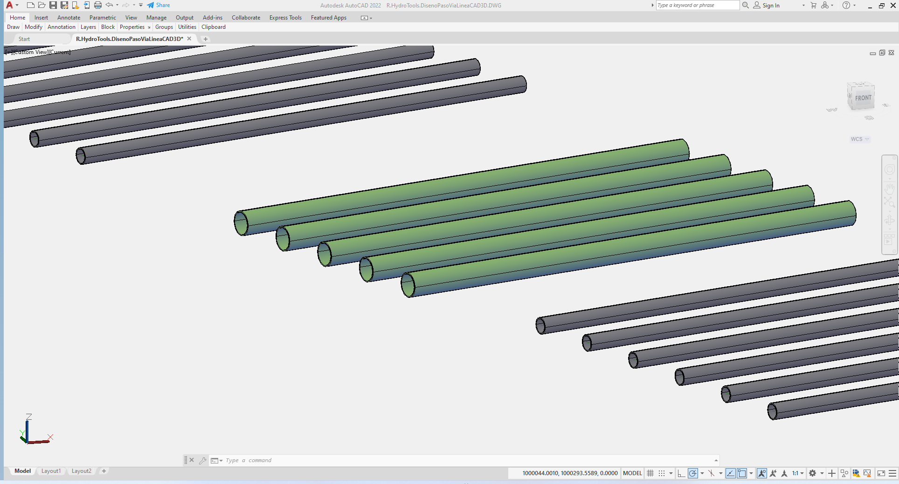
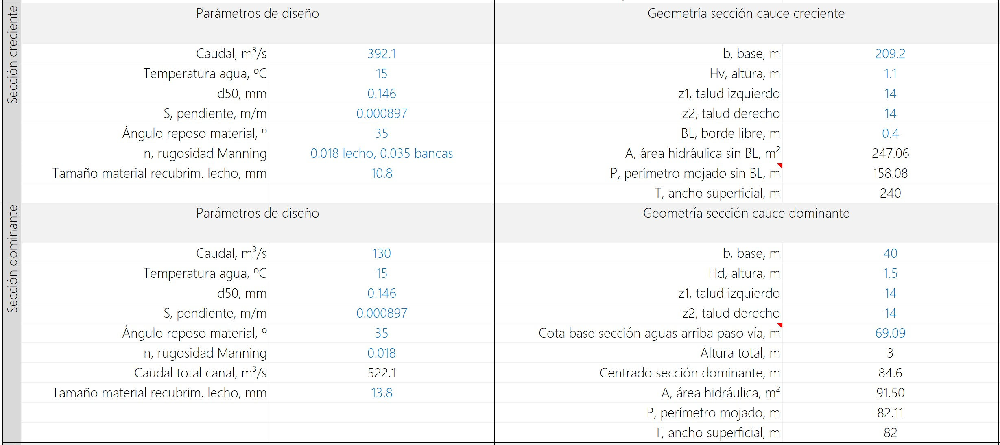
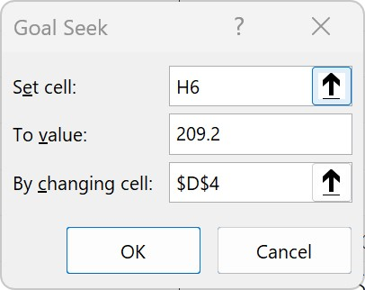
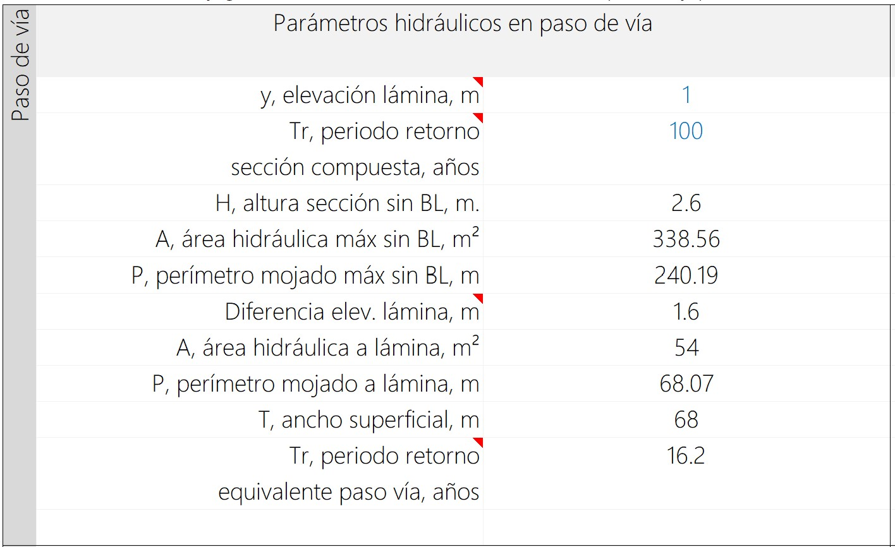
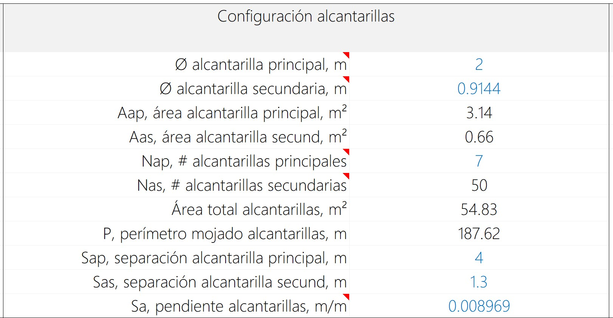
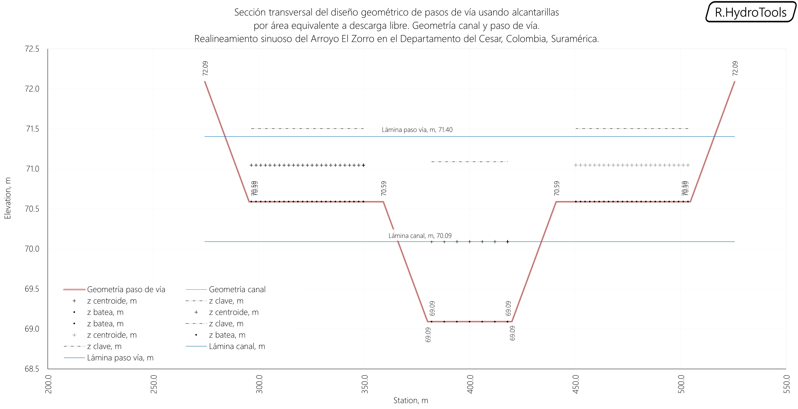

# 1.16. Obras y estructuras hidráulicas - Paso de vía
Keywords: `realigment` _hydraulic-sewer_ `m01a16`

Diseño geométrico de pasos de vía en canales usando alcantarillas por área equivalente a descarga libre para modelos hidráulicos en HEC-RAS. Es recomendable ubicar los pasos de vía en zonas de corte, en la que se disponga de una profundidad a la base del canal dominante mayor a la profundidad hidráulica de diseño, de este modo se podrán utilizar tuberías de diámetros superiores garantizando el tránsito hidráulico a descarga libre.

## Objetivos

* Dimensionar la geometría de sección requerida para transportar el caudal de diseño de creciente bajo pasos de vía usando área equivalente.
* Verificar la posición y alineamiento de las alcantarillas.

## Requerimientos

Archivos, actividades previas, lecturas y herramientas requeridas para el desarrollo de esta actividad:

| Requerimiento                                                                                                                           | Descripción                                                                                                                                                         |
|:----------------------------------------------------------------------------------------------------------------------------------------|:--------------------------------------------------------------------------------------------------------------------------------------------------------------------|
| [:toolbox:Herramienta](https://www.microsoft.com/es/microsoft-365/excel?market=bz)                                                      | Microsoft Excel 365.                                                                                                                                                |
| [:toolbox:Herramienta](https://notepad-plus-plus.org/)                                                                                  | Notepad++.                                                                                                                                                          |
| [:toolbox:Herramienta](https://qgis.org/)                                                                                               | QGIS 3.42 o superior.                                                                                                                                               |
| [:open_file_folder:R.HydroTools.DisenoPasoViaCanal.xlsm](https://github.com/rcfdtools/R.HydroTools/tree/main/tool/DisenoPasoViaCanal)   | Libro de cálculo para Diseño geométrico de pasos de vía en canales usando alcantarillas por área equivalente a descarga libre para modelos hidráulicos en HEC-RAS.  |

> Para los diferentes avances de proyecto, es necesario guardar y publicar las diferentes versiones generadas del (los) libro (s) de Microsoft Excel y reportes o informes, agregando al final la fecha de control documental en formato aaaammdd, p. ej. _R.HydroTools.DisenoCaucesParametros.20250528.xlsx_.

## Procedimiento general

1. En el libro de diseño [R.HydroTools.DisenoPasoViaCanal.xlsm](https://github.com/rcfdtools/R.HydroTools/tree/main/tool/DisenoPasoViaCanal), registre los parámetros de diseño de la sección dominante (river) y creciente (valley) obtenidas previamente en la actividad [M01A13](../M01A13). Automáticamente, será calculada el área hidráulica, el perímetro mojado y el ancho superficial de la sección. 

> Asegúrese de que la geometría ingresada corresponde a la utilizada en el diseño sinuoso.

2. Defina los siguientes parámetros hidráulicos del paso de vía:

* y, elevación lámina (m): corresponde a la altura máxima de la lámina de agua en las alcantarillas. Para mantener el mismo ancho la sección del canal diseñado, con función objetivo defina para la celda `H6` un valor igual al ancho en la base del valle (209.2 m para el caso de estudio) cambiando la altura `y`, obtendrá una altura de lámina de 1.08 metros.
* Tr, periodo retorno (años): periodo de retorno máximo que será transportado. Al inicio del curso se definió el periodo de retorno para el diseño de las estructuras hidráulicas y pasos de vía, correspondiente a 25 años, sin embargo, este valor puede ser ajustado para mantener el ancho de la sección compuesta de diseño.

> :bulb: No es recomendable diseñar el paso de vía para transportar todo el flujo máximo del periodo de diseño de la sección compuesta correspondiente a 100 años. Considere que las tuberías podrán trabajar a presión y evite sobreanchos que requerirán el diseño de expansiones y contracciones.

Para el diseño utilizaremos una altura de lámina de 1 metro y un periodo de 25 años, sin embargo, el periodo de retorno para esta altura de lámina podrá ser diferente si consideramos el flujo a superficie libre o el flujo en carga o a presión por las alcantarillas. Una vez ingresados los valores serán realizados diferentes cálculos hidráulicos.

3. Defina el diámetro de las alcantarillas principales y secundarias, para el caso de estudio utilizaremos tuberías de 2 metros (118") y 0.9144 metros (36"). Luego de clic en el botón `Resolver` que le permitirá calcular el número de tuberías requeridas. Inicialmente, obtendrá que son requeridas 7.333 tuberías principales y 48 secundarias, ajuste el valor a 7 tubos principales, así obtendrá que necesita 50 secundarias que equivalen a un área hidráulica de 54.83 m². 

> Para la óptima distribución de las tuberías en la sección, es necesario definir la separación entre las alcantarillas principales y las secundarías e ingresar la pendiente que tendrán las tuberías. La separación dependerá del tipo de material y la estructura portante de los conductos a emplear, para el caso de estudio utilizaremos tubos principales en lámina corrugada de acero que requieren de material de confinamiento lateral para garantizar su estabilidad, y tuberías secundarias en concreto que requieren una separación menor.

Verifique el gráfico de sección, si en el diseño decidió que el ancho del paso de vía debe ser igual al ancho de la sección, las secciones compuestas deben ser similares.

> El gráfico de sección permite además conocer la localización de las tuberías, sus coronas y bateas, además de la línea que representa la altura de lámina de agua a superficie libre. Asegúrese de que las cotas clave de las tuberías se encuentran bajo la altura máxima de la sección.

En caso de que haya decidido diseñar la sección 

## Actividades de proyecto :triangular_ruler:

Utilizando la [plantilla suministrada](../../file/report/R.HCMC.PlantillaSoporteDesarrollo.docx), cree un documento soporte mostrando las actividades desarrolladas en el orden presentado en esta actividad, junto con los análisis y recomendaciones realizadas, convierta a Adobe Acrobat (.pdf) y guarde en la carpeta _/activity_ del repositorio de datos del proyecto; nombre el archivo con el código de la actividad agregando al final la fecha de control documental en formato aaaammdd (p. ej. M01A00_20250531.pdf).

En la siguiente tabla se listan las actividades que deben ser desarrolladas y documentadas por cada estudiante o grupo de proyecto.

| Actividad | Alcance                                                                                                                                                                                                                                                                                                                                                                                                                                                                                                                                              |
|:----------|:-----------------------------------------------------------------------------------------------------------------------------------------------------------------------------------------------------------------------------------------------------------------------------------------------------------------------------------------------------------------------------------------------------------------------------------------------------------------------------------------------------------------------------------------------------|
| M01A00    | Descargar el archivo [R.HydroTools.DisenoCaucesParametros.xlsx](https://github.com/rcfdtools/R.HydroTools/blob/main/tool/DisenoCaucesParametros/R.HydroTools.DisenoCaucesParametros.xlsx) disponible en GitHub, e incluirlo en el repositorio.                                                                                                                                                                                                                                                                                                       | 
| M01A00    | Investigar, verificar y registrar en el libro de Excel, los parámetros técnicos, hidráulicos e hidrológicos indicados en esta actividad.  Para el grupo de parámetros normativos, ambientales / sociales y territoriales, revisar los parámetros actualmente reportados, investigar, registrar y actualizar.                                                                                                                                                                                                                                   | 
| M01A00    | Registrar los valores obtenidos en el [libro de parámetros generales](https://github.com/rcfdtools/R.HydroTools/tree/main/tool/DisenoCaucesParametros) requeridos para el diseño y la modelación. Guardar en la carpeta _/file/table_.                                                                                                                                                                                                                                                                                                               |
| M01A00    | Opcional: verificar la formulación correcta de los libros de cálculo suministrados. En las notas de la ficha de control documental indicar el método de verificación y si se requieren o no ajustes.                                                                                                                                                                                                                                                                                                                                                 |
| M01A00    | En una tabla y al final del informe de avance de esta entrega, indique el detalle de las actividades realizadas por cada integrante de su grupo; utilice las siguientes columnas: `Nombre del integrante`, `Actividades realizadas`, `Tiempo dedicado en horas` (si presenta la entrega individualmente, no es necesaria la presentación de esta tabla).  Para actividades que no requieren del desarrollo de elementos de avance, indicar si realizo la lectura de la guía de clase y las lecturas indicadas al inicio en los requerimientos. | 

> Nota 1: para la revisión del proyecto final, guarde los libros cálculo de Microsoft Excel y los archivos generados en esta actividad, en las localizaciones indicadas en cada numeral.
>
> Nota 2: una vez el instructor realice la revisión y el estudiante presente las correcciones o ajustes solicitados, será necesario cargar una nueva versión de los archivos en el repositorio del proyecto, incluyendo o actualizando al final del nombre del archivo, la fecha de presentación en formato aaaammdd y manteniendo las versiones anteriores presentadas.
>

## Referencias

* 

## Control de versiones

| Versión    | Descripción        | Autor                                      | Horas |
|------------|:-------------------|--------------------------------------------|:-----:|
| 2025.06.12 | Migración a GitHub | [rcfdtools](https://github.com/rcfdtools)  |   8   |

##

_R.HCMC es de uso libre para fines académicos, conoce nuestra licencia, cláusulas, condiciones de uso y como referenciar los contenidos publicados en este repositorio, dando [clic aquí](../../LICENSE.md)._

_¡Encontraste útil este repositorio!, apoya su difusión marcando este repositorio con una ⭐ o síguenos dando clic en el botón Follow de [rcfdtools](https://github.com/rcfdtools) en GitHub._

| [:arrow_backward: Anterior](../M01A15/Readme.md) | [:house: Inicio](../../README.md) | [:beginner: Ayuda / Colabora](https://github.com/rcfdtools/R.SIGE/discussions/99999) | [Siguiente :arrow_forward:](../M01A17/Readme.md) |
|--------------------------------------------------|-----------------------------------|--------------------------------------------------------------------------------------|--------------------------------------------------|

[^1]: 