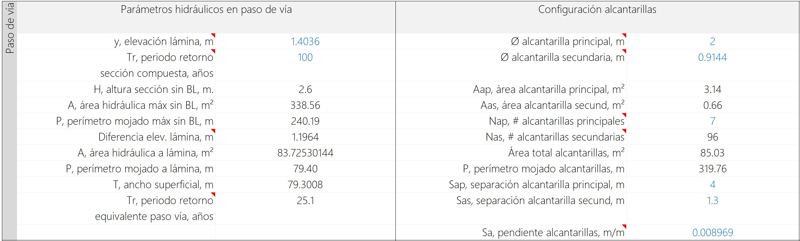

# 1.16. Obras y estructuras hidráulicas - Paso de vía
Keywords: `realigment` _hydraulic-sewer_ `m01a16`

Diseño geométrico de pasos de vía en canales usando alcantarillas por área equivalente a descarga libre para modelos hidráulicos en HEC-RAS. Es recomendable ubicar los pasos de vía en zonas de corte, en la que se disponga de una profundidad a la base del canal dominante mayor a la profundidad hidráulica de diseño, de este modo se podrán utilizar tuberías de diámetros superiores garantizando el tránsito hidráulico a descarga libre.

## Objetivos

* Dimensionar la geometría de sección requerida para transportar el caudal de diseño de creciente bajo pasos de vía usando área equivalente.
* Verificar la posición y alineamiento de las alcantarillas.

## Requerimientos

Archivos, actividades previas, lecturas y herramientas requeridas para el desarrollo de esta actividad:

| Requerimiento                                                                                                                           | Descripción                                                                                                                                                         |
|:----------------------------------------------------------------------------------------------------------------------------------------|:--------------------------------------------------------------------------------------------------------------------------------------------------------------------|
| [:toolbox:Herramienta](https://www.microsoft.com/es/microsoft-365/excel?market=bz)                                                      | Microsoft Excel 365.                                                                                                                                                |
| [:toolbox:Herramienta](https://notepad-plus-plus.org/)                                                                                  | Notepad++.                                                                                                                                                          |
| [:toolbox:Herramienta](https://qgis.org/)                                                                                               | QGIS 3.42 o superior.                                                                                                                                               |
| [:open_file_folder:R.HydroTools.DisenoPasoViaCanal.xlsm](https://github.com/rcfdtools/R.HydroTools/tree/main/tool/DisenoPasoViaCanal)   | Libro de cálculo para Diseño geométrico de pasos de vía en canales usando alcantarillas por área equivalente a descarga libre para modelos hidráulicos en HEC-RAS.  |

> Para los diferentes avances de proyecto, es necesario guardar y publicar las diferentes versiones generadas del (los) libro (s) de Microsoft Excel y reportes o informes, agregando al final la fecha de control documental en formato aaaammdd, p. ej. _R.HydroTools.DisenoCaucesParametros.20250528.xlsx_.

## 1. Diseño de paso de vía

1. En el libro de diseño [R.HydroTools.DisenoPasoViaCanal.xlsm](https://github.com/rcfdtools/R.HydroTools/tree/main/tool/DisenoPasoViaCanal) y en la hoja _SeccionCompuesta_, registre los parámetros de diseño de la sección dominante (river) y creciente (valley) obtenidas previamente en la actividad [M01A13](../M01A13). Automáticamente, será calculada el área hidráulica, el perímetro mojado y el ancho superficial de la sección. 

> Asegúrese de que la geometría ingresada corresponde a la utilizada en el diseño sinuoso.

2. Defina los siguientes parámetros hidráulicos del paso de vía:

| Parámetro                                    | Alcance                                                                                                                                                                                                                                                                                                                                                                     |
|----------------------------------------------|-----------------------------------------------------------------------------------------------------------------------------------------------------------------------------------------------------------------------------------------------------------------------------------------------------------------------------------------------------------------------------|
| y, elevación lámina (m)                      | Corresponde a la altura máxima de la lámina de agua en las alcantarillas. Para mantener el mismo ancho la sección del canal diseñado, con función objetivo defina para la celda `H6` un valor igual al ancho en la base del valle (209.2 m para el caso de estudio) cambiando la altura `y`, obtendrá una altura de lámina de 1.08 metros.                                  |
| Tr, periodo retorno sección compuesta (años) | Periodo de retorno utilizado para el diseño de la sección compuesta. Al inicio del curso se definió el periodo de retorno para el diseño de la sección, correspondiente a 100 años. A partir de este valor se calcula el periodo de retorno que podrá ser transportado por las alcantarillas a partir del área hidráulica equivalente para la elevación de lámina definida. |

> :bulb: No es recomendable diseñar el paso de vía para transportar todo el flujo máximo del periodo de diseño de la sección compuesta correspondiente a 100 años. Considere que las tuberías podrán trabajar a presión y evite sobreanchos que requerirán el diseño de expansiones y contracciones.

Para el diseño utilizaremos una altura de lámina de 1 metro y como referencia de diseño de la sección compuesta un periodo de 100 años, una vez ingresados los valores serán realizados diferentes cálculos hidráulicos.

> Al inicio del curso se definió el periodo de retorno para el diseño de las estructuras hidráulicas y pasos de vía, correspondiente a 25 años, sin embargo, este valor puede ser ajustado para mantener el ancho de la sección compuesta de diseño.

3. Defina el diámetro de las alcantarillas principales y secundarias, para el caso de estudio utilizaremos tuberías de 2 metros (118") y 0.9144 metros (36"). Luego de clic en el botón `Resolver` que le permitirá calcular el número de tuberías requeridas. Inicialmente, obtendrá que son requeridas 7.333 tuberías principales y 48 secundarias, ajuste el valor a 7 tubos principales, así obtendrá que necesita 50 secundarias que equivalen a un área hidráulica de 54.83 m². 

> Para la óptima distribución de las tuberías en la sección, es necesario definir la separación entre las alcantarillas principales y las secundarías e ingresar la pendiente que tendrán las tuberías (similar a la pendiente del río o del valle). La separación dependerá del tipo de material y la estructura portante de los conductos a emplear, para el caso de estudio utilizaremos tubos principales en lámina corrugada de acero que requieren de material de confinamiento lateral para garantizar su estabilidad, y tuberías secundarias en concreto que requieren una separación menor.

> El periodo de retorno equivalente obtenido, correspondiente a 16.2 años para la altura de lámina definida, podrá ser diferente si consideramos el flujo a superficie libre o el flujo en carga o a presión por las alcantarillas.

4. Verifique el gráfico de sección, si en el diseño decidió que el ancho del paso de vía debe ser igual al ancho de la sección, las secciones compuestas deben ser similares.

> El gráfico de sección permite conocer la localización de las tuberías, sus coronas y bateas, además de la línea que representa la altura de lámina de agua a superficie libre. Asegúrese de que las cotas clave de las tuberías se encuentran bajo la altura máxima de la corona de la sección en valle.

En caso de que haya decidido diseñar la sección del paso de vía con sobre ancho para un periodo de retorno igual a 25 años, requerirá de una altura de lámina de 1.4036 metros y 96 tuberías secundarias, obtendrá una sección como la mostrada en las dos siguientes ilustraciones que requerirá el diseño de una expansión y una contracción.

## 2. Localización geográfica de alcantarillas

1. En la hoja _GISSetup_, ingrese las coordenadas de localización de los nodos iniciales y finales del eje central de la sección dominante en el paso de vía, automáticamente será calculada la longitud de la alcantarilla y su rotación en radianes.

Para conocer la localización de las coordenadas del eje del paso de vía, en QGIS defina manualmente sobre el alineamiento del valle dos puntos de paso correspondientes a donde inicia y termina el ancho del paso de vía.

> Para la separación se recomienda al menos definir un ancho de 60 metros.
>
> Esta localización deberá ser ajustada una vez se realice el trazado del valle suavizado y del eje sinuoso en Autodesk Civil 3D.

2. Revise los parámetros adicionales para localización de alcantarillas principales y secundarias a partir de las propiedades geométricas de la sección compuesta del canal principal.

3. Defina los atributos de las secciones de referencia a utilizar en el modelo HEC-RAS 1D, tales como, nombre del río, nombre del tramo, abscisa central del alineamiento del paso de vía, distancia del eje del paso de vía a la sección más cercana aguas arriba, estación del nodo central de la sección aguas arriba y aguas abajo del paso de vía y cota base de la sección aguas abajo del paso de vía.

> Para su proyecto, defina valores similares a los utilizados en el caso de estudio. Posteriormente, estos valores serán ajustados utilizando las localizaciones de su modelo hidráulico.

4. De clic en el botón `Crear tabla GIS HEC-RAS 2D` que generará el contenido de la hoja _GISCulvertPoint_. Revise el contenido de la tabla y la gráfica en planta.

5. En la hoja _SeccionCompuesta_, visualice las tablas de localización de los ejes centrales de las estaciones de localización de alcantarillas en cada sección.

> Los valores de las tablas son utilizados en el modelo HEC-RAS 1D.

## 3. Dibujo de ejes geográficos en QGIS

1. Desde el libro de diseño, exporte la hoja _GISCulvertPoint_ un archivo de texto separado por comas como _/file/table/R.HCMC.GISCulvertPoint.csv_ y cierre Excel.

2. En QGIS cree una capa temporal de nodos a partir de las localizaciones exportadas, _Layer / Add Delimited Text Layer_.

> Asegúrese de que el campo _SoftField_ sea importado como valor numérico entero y en _Z field_ asigne el valor Z correspodiente al eje de cada alcantarilla.

3. Exporte la capa a un archivo de formas con el nombre _/file/table/PasoViaAlcantarillaPuntoEje.shp_ y remueva la capa temporal.

4. Ajuste la simbología y rotule a partir del campo `LineField`.

5. Para crear las líneas conectoras, utilice la herramienta _Processing Toolbox / Vector creation / Points to path_, guarde como /file/shp/PasoViaAlcantarillaLineaEje.shp

6. Exporte la capa de ejes a formato AutoCAD DXF como _/file/cad/R.HydroTools.DisenoPasoViaLineaCAD.dxf_, incluya los valores de la dimensión Z.

## 4. Dibujo de tuberías 3D en Autodesk Civil 3D o en AutoCAD

1. En Autodesk Civil o en AutoCAD, abra el archivo _/file/cad/R.HydroTools.DisenoPasoViaLineaCAD.dxf_ y guarde como _/file/cad/R.HydroTools.DisenoPasoViaLineaCAD3D.dwg_.

2. Desde el _Workspace Switching_ ubicado en la parte inferior de la pantalla (ícono _Setup_ o piñon), seleccionar _3D Basic_ o _3D Modeling_.

3. Active la vista de navegación con el comando _NAVBAR_ y desde el Orbit rote la vista 3D.

4. Para las tuberías principales cree en cualquier localización del espacio de trabajo CAD, circunferencias con diámetro igual al definido en el diseño del paso de vía, p.ej., 2 metros. Comando: _Circle_ y radius 2. Selecciones la circunferencia y con el comando _List_, asegúrese de que el diámetro es de 2 metros o radio de 1 metro.

5. Con el comando _Sweep_, seleccione la circunferencia, de enter y luego el eje del tubo. Podrá observar que se ha creado el sólido de la tubería.

6. Desde el menú _Visualize_, active la Vista Conceptual.

7. Ejecute el comando _SolidEdit_, seleccione _Body_, _Shell_, seleccione el sólido desde la parte exterior del tubo, luego la cara frontal, luego la cara posterior y de Enter, ingrese el espesor de la tubería, p.ej., 0.1 m y de Enter.

8. Utilizando el comando _Copy_, replique varias veces las tuberías sobre los ejes 3D. Como observa, las tuberías no se traslapan y tienen la separación de diseño.

9. Repita el mismo procedimiento para las tuberías secundarias cuyo diámetro es 0.9144 metros y asegúrese de que no existen translapos. 

## Actividades de proyecto :triangular_ruler:

Utilizando la [plantilla suministrada](../../file/report/R.HCMC.PlantillaSoporteDesarrollo.docx), cree un documento soporte mostrando las actividades desarrolladas en el orden presentado en esta actividad, junto con los análisis y recomendaciones realizadas, convierta a Adobe Acrobat (.pdf) y guarde en la carpeta _/activity_ del repositorio de datos del proyecto; nombre el archivo con el código de la actividad agregando al final la fecha de control documental en formato aaaammdd (p. ej. M01A16_20250531.pdf).

En la siguiente tabla se listan las actividades que deben ser desarrolladas y documentadas por cada estudiante o grupo de proyecto.

| Actividad | Alcance                                                                                                                                                                                                                                                                                                                                                                                                                                                                                                                                              |
|:----------|:-----------------------------------------------------------------------------------------------------------------------------------------------------------------------------------------------------------------------------------------------------------------------------------------------------------------------------------------------------------------------------------------------------------------------------------------------------------------------------------------------------------------------------------------------------|
| M01A16    | Utilizando el libro de diseño, realizar el diseño geométrico de pasos de vía usando alcantarillas por área equivalente a descarga libre para una sección igual a la sección de la sección compuesta del cauce principal, indique cual fue el periodo de retorno equivalente obtenido. Guardar el libro como /file/table/R.HydroTools.DisenoPasoViaCanal.Diseno1.xlsx.                                                                                                                                                                                | 
| M01A16    | Utilizando el libro de diseño, realizar el diseño geométrico de pasos de vía usando alcantarillas por área equivalente a descarga libre para un periodo de retorno de 25 años o el definido en su proyecto para el diseño de obras hidráulicas. Guardar el libro como /file/table/R.HydroTools.DisenoPasoViaCanal.Diseno2.xlsx.                                                                                                                                                                                                                      | 
| M01A16    | Crear sólidos de tuberías en 3D usando Autodesk y representar en 3D, incluir capturas de pantalla en la hoja GISSetup y de vistas 3D donde se compruebe que no hay traslapos. Guardar en el  repositorio de datos en la carpeta /file/cad/ el archivo de sólidos 3D como DisenoPasoViaCAD.dwg.                                                                                                                                                                                                                                                       | 
| M01A16    | Registrar los valores obtenidos en el [libro de parámetros generales](https://github.com/rcfdtools/R.HydroTools/tree/main/tool/DisenoCaucesParametros) requeridos para el diseño y la modelación. Guardar en la carpeta _/file/table_.                                                                                                                                                                                                                                                                                                               |
| M01A16    | Opcional: verificar la formulación correcta de los libros de cálculo suministrados. En las notas de la ficha de control documental indicar el método de verificación y si se requieren o no ajustes.                                                                                                                                                                                                                                                                                                                                                 |
| M01A16    | En una tabla y al final del informe de avance de esta entrega, indique el detalle de las actividades realizadas por cada integrante de su grupo; utilice las siguientes columnas: `Nombre del integrante`, `Actividades realizadas`, `Tiempo dedicado en horas` (si presenta la entrega individualmente, no es necesaria la presentación de esta tabla).  Para actividades que no requieren del desarrollo de elementos de avance, indicar si realizo la lectura de la guía de clase y las lecturas indicadas al inicio en los requerimientos. | 

> Nota 1: para la revisión del proyecto final, guarde los libros cálculo de Microsoft Excel y los archivos generados en esta actividad, en las localizaciones indicadas en cada numeral.
>
> Nota 2: una vez el instructor realice la revisión y el estudiante presente las correcciones o ajustes solicitados, será necesario cargar una nueva versión de los archivos en el repositorio del proyecto, incluyendo o actualizando al final del nombre del archivo, la fecha de presentación en formato aaaammdd y manteniendo las versiones anteriores presentadas.
>

## Referencias

* Metodología de diseño desarrollada por [rcfdtools](https://github.com/rcfdtools).

## Control de versiones

| Versión    | Descripción        | Autor                                      | Horas |
|------------|:-------------------|--------------------------------------------|:-----:|
| 2025.06.12 | Migración a GitHub | [rcfdtools](https://github.com/rcfdtools)  |   8   |

##

_R.HCMC es de uso libre para fines académicos, conoce nuestra licencia, cláusulas, condiciones de uso y como referenciar los contenidos publicados en este repositorio, dando [clic aquí](../../LICENSE.md)._

_¡Encontraste útil este repositorio!, apoya su difusión marcando este repositorio con una ⭐ o síguenos dando clic en el botón Follow de [rcfdtools](https://github.com/rcfdtools) en GitHub._

| [:arrow_backward: Anterior](../M01A15/Readme.md) | [:house: Inicio](../../README.md) | [:beginner: Ayuda / Colabora](https://github.com/rcfdtools/R.SIGE/discussions/99999) | [Siguiente :arrow_forward:](../M01A17/Readme.md) |
|--------------------------------------------------|-----------------------------------|--------------------------------------------------------------------------------------|--------------------------------------------------|

[^1]: 