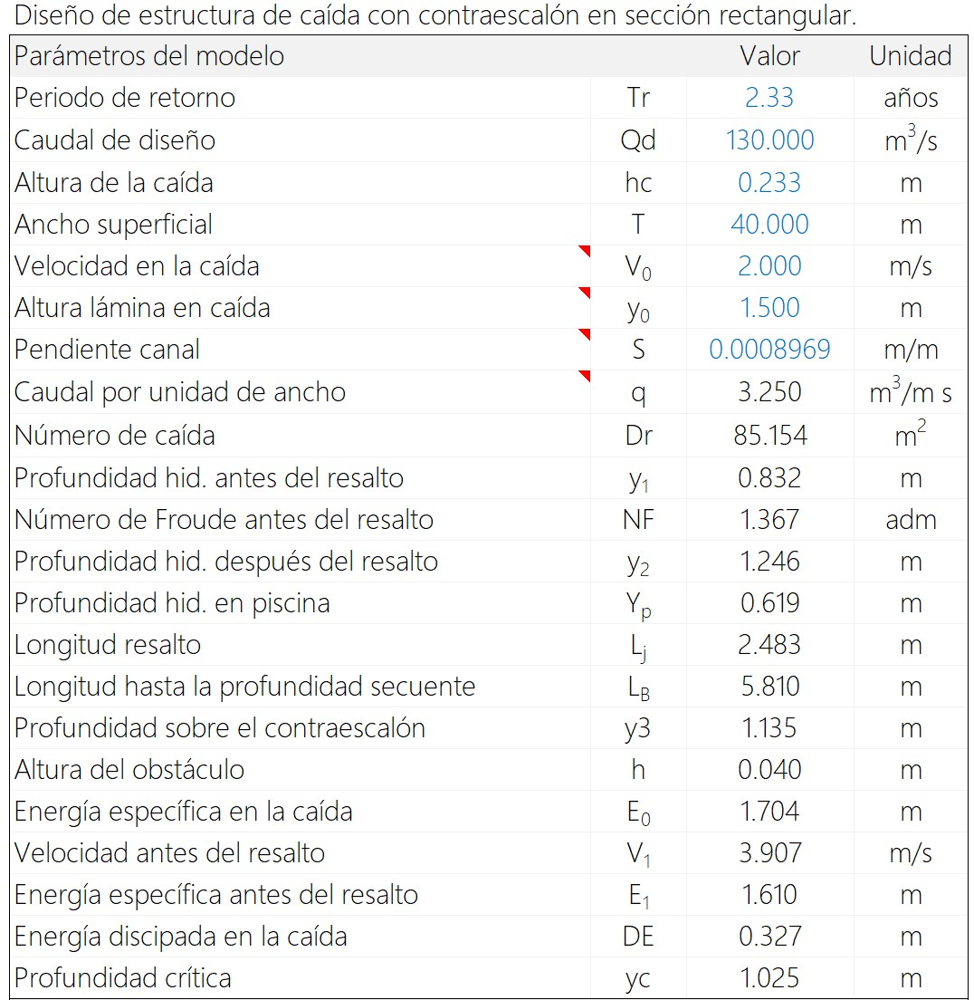

# 1.17. Obras y estructuras hidráulicas - Caída y control de fondo
Keywords: `realigment`  `m01a17`

Diseño de estructura de caída con y sin contra-escalón en sección rectangular. 

<div align="center"></div>


## Objetivos

* Evaluar el requerimiento de estructuras de caída en el cauce principal o en cauces laterales.
* Obtener las especificaciones de desarrollo de la estructura para la protección del fondo.
* Modelar y validar el funcionamiento de la estructura para las condiciones de diseño.


## Requerimientos

Archivos, actividades previas, lecturas y herramientas requeridas para el desarrollo de esta actividad:

<div align="center">

| Requerimiento                                                                                                                                                                | Descripción                                                                                        |
|:-----------------------------------------------------------------------------------------------------------------------------------------------------------------------------|:---------------------------------------------------------------------------------------------------|
| [:toolbox:Herramienta](https://www.microsoft.com/es/microsoft-365/excel?market=bz)                                                                                           | Microsoft Excel 365.                                                                               |
| [:toolbox:Herramienta](https://qgis.org/)                                                                                                                                    | QGIS 3.42 o superior.                                                    |
| [:toolbox:Herramienta](https://www.hec.usace.army.mil/software/hec-ras/)                                                                                                     | HEC-RAS 6.6 o superior.                                                  |
| [:open_file_folder:R.HydroTools.DisenoEstructura CaidaSinContraescalon.xlsm](https://github.com/rcfdtools/R.HydroTools/tree/main/tool/DisenoEstructuraCaidaSinContraescalon) | Libro de cálculo para el diseño de estructuras de caída sin contra-escalón en sección rectangular. |
| [:open_file_folder:R.HydroTools.DisenoEstructura CaidaConContraescalon.xlsm](https://github.com/rcfdtools/R.HydroTools/tree/main/tool/DisenoEstructuraCaidaConContraescalon) | Libro de cálculo para el diseño de estructuras de caída con contra-escalón en sección rectangular. |

</div>

> Para los diferentes avances de proyecto, es necesario guardar y publicar las diferentes versiones generadas del (los) libro (s) de Microsoft Excel y reportes o informes, agregando al final la fecha de control documental en formato aaaammdd, p. ej. _R.HydroTools.DisenoCaucesParametros.20250528.xlsx_.


## 0. Conceptos generales

El diseño y construcción de canales hidráulicos requiere frecuentemente del diseño de estructuras de caída, especialmente en las siguientes situaciones: 

* Cuando se busca ajustar o mantener la pendiente de diseño.
* Cuando no se realiza diseño de cauce sinuoso confinado en valle suavizado.
* Cuando debido a procesos erosivos, el fondo del canal se degrada y es necesario que este se agrade para recuperar su condición inicial y restablecer su pendiente.

En la actividad [M01A08](../M01A08), realizamos el análisis del perfil de terreno del valle y evaluamos o no el requerimiento de estructuras de caída para el empalme o entrega de cauces laterales por encima o a fondo del nuevo valle de realineamiento, encontrando que por las condiciones geo-morfométricas, no es necesario ajustar el fondo Sin embargo, realizaremos el diseño suponiendo que en algún tramo del cauce dominante, podrán ser requeridas estas estructuras.

> Tenga en cuenta que la sección dominante diseña para el canal es trapezoidal y que los libros de diseño de estructuras de caída son aplicable a geometría en canales rectangulares.


## 1. Estructura de caída sin contra-escalón

1. En el libro de diseño [R.HydroTools.DisenoEstructuraCaidaSinContraescalon.xlsm](https://github.com/rcfdtools/R.HydroTools/tree/main/tool/DisenoEstructuraCaidaSinContraescalon), ingrese los parámetros de diseño correspondientes a la sección del cauce dominante y la configuración del escalón.

Para este ejemplo, utilizaremos:

* Altura de escalón de 0.233 metros, que de acuerdo a los análisis previos realizados en la actividad [M01A08](../M01A08), corresponde a 6 caídas a lo largo del canal.
* Ancho superficial de la estructura de 40 metros, correspondiente al ancho del canal en la base del cauce dominante.
* Altura lámina en caída de 1.5 metros, suponiendo que el canal dominante se encuentra a flujo máximo para el periodo de diseño de 2.33 años.
* Pendiente del río correspondiente a 0.0008969 m/m.

<div align="center">

Tabla de análisis actividad [M01A08](../M01A08).


</div>

<div align="center">
Parámetros de entrada en hoja de diseño de caída sin contra-escalón y resultados obtenidos.<br>

</div>

2. Para los parámetros de entrada, el análisis indica que la profundidad crítica Yc es igual a 1.025 metros, con profundidades hidráulicas en piscina de 0.619 metros, antes del resalto en 0.832 metros y después del resalto en 1.284 metros, requiriendo protección de fondo de 6.04 metros, como se muestra en la figura.

<div align="center"></div>

3. Para crear en CAD las líneas correspondientes al perfil de fondo y lámina, seleccione las celdas en cursiva, copie y pegue en el Command de AutoCAD o Civil3D, primero lámina y luego fondo. En la selección incluir los espacios en blanco entre comandos y el espacio final. 

> Notación numérica requerida: separador decimal usando punto (.), separador de miles usando coma (,) y separador de listas usando coma (,).

Perfil de lámina esquemático

```
PLine
0,3.34812705803005
0.271338349198634,3.44837042139544
0.542676698397269,3.2841623060909
2.98472184118498,2.83193172409318
6.3111663690108,3.733
9.02454986099714,3.96043363365396

Pedit
M
All

Spline

```

Perfil de fondo

```
PLine
0,1.9997566366346
0.271338349198634,2
0.542676698397269,2
2.98472184118498,2
6.3111663690108,2
6.3111663690108,2.233
9.02454986099714,2.23543363365396

```

<div align="center"></div>

> Esta misma metodología puede ser aplicada a entrega de cauces laterales cuando no existe una gran diferencia en la altura de la caída.


## 2. Estructura de caída con contra-escalón

1. En el libro de diseño [R.HydroTools.DisenoEstructuraCaidaConContraescalon.xlsm](https://github.com/rcfdtools/R.HydroTools/tree/main/tool/DisenoEstructuraCaidaConContraescalon), ingrese los parámetros de diseño correspondientes a la sección del cauce dominante y la configuración del escalón.

Para este ejemplo, utilizaremos:

* Altura de escalón de 0.233 metros, que de acuerdo a los análisis previos realizados en la actividad [M01A08](../M01A08), corresponde a 6 caídas a lo largo del canal.
* Ancho superficial de la estructura de 40 metros, correspondiente al ancho del canal en la base del cauce dominante.
* Altura lámina en caída de 1.5 metros, suponiendo que el canal dominante se encuentra a flujo máximo para el periodo de diseño de 2.33 años.
* Pendiente del río correspondiente a 0.0008969 m/m.
* Velocidad en la caída de 2 m/s, correspondiente a la velocidad máxima de diseño de la sección dominante.

<div align="center">
Parámetros de entrada en hoja de diseño de caída con contra-escalón y resultados obtenidos.<br>

</div>

2. Para los parámetros de entrada, el análisis indica que la profundidad crítica Yc es igual a 1.025 metros, con profundidades hidráulicas en piscina de 0.619 metros, antes del resalto en 0.832 metros y después del resalto en 1.246 metros, requiriendo protección de fondo de 5.81 metros y obstáculo de 0.040 metros, como se muestra en la figura.

<div align="center"></div>

3. Para crear en CAD las líneas correspondientes al perfil de fondo y lámina, seleccione las celdas en cursiva, copie y pegue en el Command de AutoCAD o Civil3D, primero lámina y luego fondo. En la selección incluir los espacios en blanco entre comandos y el espacio final. 

> Notación numérica requerida: separador decimal usando punto (.), separador de miles usando coma (,) y separador de listas usando coma (,).

Perfil de lámina esquemático

```
PLine
0,3.30757312373799
0.871451722150918,3.24580399406767
1.74290344430184,3.1212235946609
4.2261370641488,2.83193172409318
7.55258159197462,3.733
11.0383884805783,3.96112642019839

Pedit
M
All

Spline


```

Perfil de fondo

```
PLine
0,2.05930440875276
0.580967814767278,2.05982547878582
0.580967814767278,2
1.74290344430184,2
4.2261370641488,2
7.55258159197462,2
7.55258159197462,2.233
11.0383884805783,2.23612642019839


```

<div align="center"></div>


> Se recomienda obra de protección de fondo hasta la profundidad Y2 debido a que dependiendo del periodo de retorno y el caudal de entrada, el resalto podra desplazarse hacia la caída.
> 
> Aplicable para canales con pendiente baja y flujo subcrítico en sección rectangular.
> 
> Esta misma metodología puede ser aplicada a entrega de cauces laterales cuando no existe una gran diferencia en la altura de la caída.


## Actividades de proyecto :triangular_ruler:

Utilizando la [plantilla suministrada](../../file/report/R.HCMC.PlantillaSoporteDesarrollo.docx), cree un documento soporte mostrando las actividades desarrolladas en el orden presentado en esta actividad, junto con los análisis y recomendaciones realizadas, convierta a Adobe Acrobat (.pdf) y guarde en la carpeta _/activity_ del repositorio de datos del proyecto; nombre el archivo con el código de la actividad agregando al final la fecha de control documental en formato aaaammdd (p. ej. M01A17_20250531.pdf).

En la siguiente tabla se listan las actividades que deben ser desarrolladas y documentadas por cada estudiante o grupo de proyecto.

| Actividad | Alcance                                                                                                                                                                                                                                                                                                                                                                                                                                                                                                                                              |
|:----------|:-----------------------------------------------------------------------------------------------------------------------------------------------------------------------------------------------------------------------------------------------------------------------------------------------------------------------------------------------------------------------------------------------------------------------------------------------------------------------------------------------------------------------------------------------------|
| M01A17    | Dentro del libro de diseño, cree una tabla formulada de valores X/Y/Z, con la localización de los nodos para la construcción geométrica de la estructura. En QGIS cree la capa geográfica de localización de los nodos y cree un modelo de terreno triangulado TIN y una grilla ráster de las estructura. En la actividad [M01A18](../M01A18) encontrará un ejemplo de este tipo de tablas.                                                                                                                                                          | 
| M01A17    | Diseñar y modelar unidimensionalmente en un prototipo digital de HEC-RAS, las estructuras de caída con y sin contra-escalón. (aplica también para canales principales que se hayan definido sin control de fondo o con fondo continuo en la entrega [M01A08](../M01A08)). Analizar con flujo no permanente si el resalto hidráulico se encuentra en una posición fija. Guardar el comprimido del modelo hidráulico como /file/hec/HECRAS_v0_EstructuraCaidaSinContraescalon.zip y /file/hec/HECRAS_v0_EstructuraCaidaConContraescalon.zip.           | 
| M01A17    | Para cada prototipo digital funcional, crear un vídeo animando las láminas de agua obtenidas en la sección, el perfil y un gráfico animado con las variaciones en velocidad y cortante. Guardar en formato .mp4 como /file/report/M01A17_EstructuraCaidaSinContraescalon.mp4 y /file/report/M01A17_EstructuraCaidaConContraescalon.mp4	                                                                                                                                                                                                              | 
| M01A17    | En el informe incluir capturas de pantalla detalladas de las secciones transversales, perfiles, condiciones de control, planta, ventana de ejecución, tablas de resultados y vista 3D. Incluir notas descriptivas del funcionamiento del modelo y su relación con el diseño realizado.                                                                                                                                                                                                                                                               | 
| M01A17    | Opcional: verificar la formulación correcta de los libros de cálculo suministrados. En las notas de la ficha de control documental indicar el método de verificación y si se requieren o no ajustes.                                                                                                                                                                                                                                                                                                                                                 |
| M01A17    | En una tabla y al final del informe de avance de esta entrega, indique el detalle de las actividades realizadas por cada integrante de su grupo; utilice las siguientes columnas: `Nombre del integrante`, `Actividades realizadas`, `Tiempo dedicado en horas` (si presenta la entrega individualmente, no es necesaria la presentación de esta tabla).<br><br>Para actividades que no requieren del desarrollo de elementos de avance, indicar si realizo la lectura de la guía de clase y las lecturas indicadas al inicio en los requerimientos. | 

> Nota 1: para la revisión del proyecto final, guarde los libros cálculo de Microsoft Excel y los archivos generados en esta actividad, en las localizaciones indicadas en cada numeral.
>
> Nota 2: una vez el instructor realice la revisión y el estudiante presente las correcciones o ajustes solicitados, será necesario cargar una nueva versión de los archivos en el repositorio del proyecto, incluyendo o actualizando al final del nombre del archivo, la fecha de presentación en formato aaaammdd y manteniendo las versiones anteriores presentadas.
>
> Nota 3: en los modelos unidimensionales HEC-RAS solo se tiene en cuenta el componente del vector direccional de la velocidad que es paralelo al sentido del flujo y se asume que el flujo es gradualmente variado a excepción de las estructuras hidráulicas propias que el programa puede modelar, tales como puentes, culverts y vertederos, en donde se resuelve mediante rápidamente variado o por la ecuación de momentum y otras ecuaciones empíricas. Para modelar con precisión este tipo de estructuras que estamos diseñando, se debería utilizar un modelo 3D (Como ANSYS FLUENT, Delft3D, OpenFoam) en el que se puede hacer la descomposición de los vectores en en sentido de cambio de dirección entre celdas y en la vertical. HEC-RAS 2D permite realizar el análisis de descomposición de transferencia entre celdas pero solo en planos horizontales correspondientes a la superficie de la lámina de agua. El objetivo de los prototipos es evaluar el alcance de los perfiles y líneas de energía que se obtienen usando modelos 1D para luego entender la necesidad de su modelación en 2D o 3D, por otra parte, para el diseño de ríos como el del ejercicio de clase, se busca obtener una abstracción y representación del tránsito hidráulico en grandes extensiones y superficies de inundación para evaluar las trazas en el plano XS y las zonas de flujo muerto, los circulantes y el cumplimiento de las condiciones de diseño.


## Referencias

* Ven Te Chow, Hidráulica de canales abiertos, pág. 414 (pdf pág. 212) Vertedero de caída recta.
* Libro de diseño desarrollado por [rcfdtools](https://github.com/rcfdtools) y [frankv13](https://github.com/frankv13).


## Control de versiones

| Versión    | Descripción        | Autor                                      | Horas |
|------------|:-------------------|--------------------------------------------|:-----:|
| 2025.06.13 | Migración a GitHub | [rcfdtools](https://github.com/rcfdtools)  |   3   |


##

_R.HCMC es de uso libre para fines académicos, conoce nuestra licencia, cláusulas, condiciones de uso y como referenciar los contenidos publicados en este repositorio, dando [clic aquí](../../LICENSE.md)._

_¡Encontraste útil este repositorio!, apoya su difusión marcando este repositorio con una ⭐ o síguenos dando clic en el botón Follow de [rcfdtools](https://github.com/rcfdtools) en GitHub._


| [:arrow_backward: Anterior](../M01A16/Readme.md) | [:house: Inicio](../../README.md) | [:beginner: Ayuda / Colabora](https://github.com/rcfdtools/R.SIGE/discussions/99999) | [Siguiente :arrow_forward:](../M01A18/Readme.md) |
|--------------------------------------------------|-----------------------------------|--------------------------------------------------------------------------------------|--------------------------------------------------|

[^1]: 