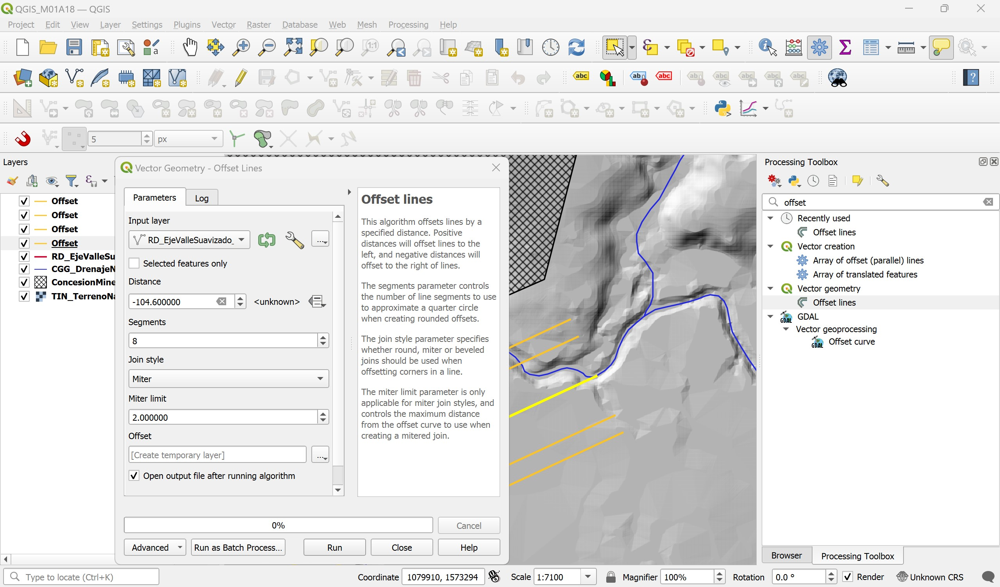
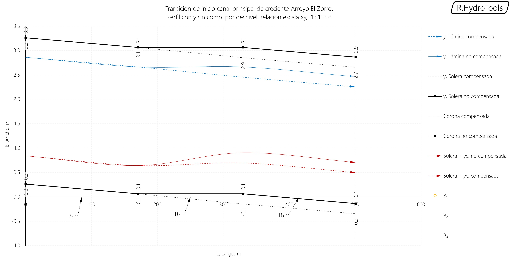
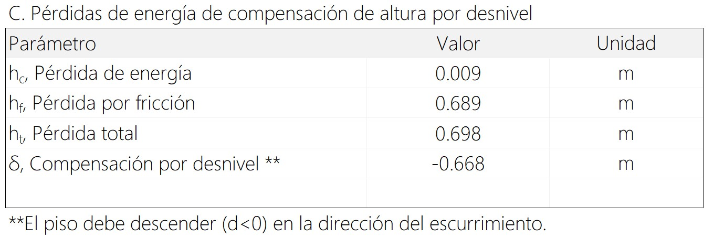
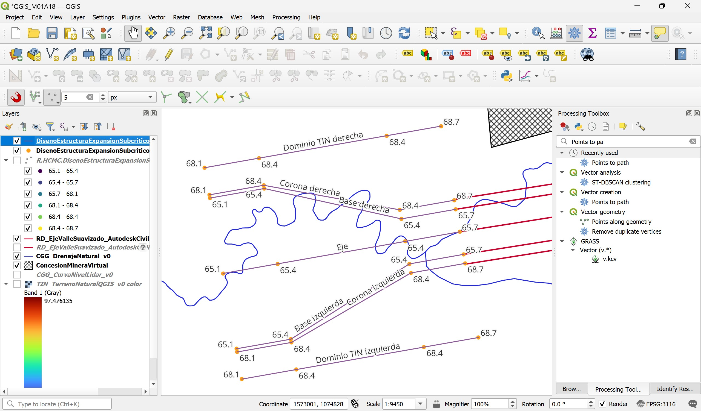

# 1.18. Obras y estructuras hidráulicas - Contracción y expansión
Keywords: `realigment` `hydraulics` `hydraulic-structure` `hydraulic-transition` `hydraulic-expansion` `hydraulic-contraction` `m01a18`

La construcción del canal prismático de sección compuesta del cauce principal, requiere de la implantación de contracción de inicio y expansión en entrega, debido a que el flujo de diseño debe ser conducido y transportado por un valle confinado.

## Objetivos

* Identificar la localización de contracciones y expansiones en el canal principal de realineamiento.
* Diseñar y obtener la geometría de las transiciones.
* Modelar y validar el funcionamiento de la estructura para las condiciones de diseño.

## Requerimientos

Archivos, actividades previas, lecturas y herramientas requeridas para el desarrollo de esta actividad:

| Requerimiento                                                                                                          | Descripción                                                                |
|:-----------------------------------------------------------------------------------------------------------------------|:---------------------------------------------------------------------------|
| [:toolbox:Herramienta](https://www.microsoft.com/es/microsoft-365/excel?market=bz)                                     | Microsoft Excel 365.                                                       |
| [:toolbox:Herramienta](https://qgis.org/)                                                                              | QGIS 3.42 o superior.                                                      |
| [:toolbox:Herramienta](https://www.hec.usace.army.mil/software/hec-ras/)                                               | HEC-RAS 6.6 o superior.                                                    |
| [:open_file_folder:R.HydroTools.DisenoEstructura ContraccionExpansionSubcritico.xlsm](https://github.com/rcfdtools/R.HydroTools/tree/main/tool/DisenoEstructuraContraccionExpansionSubcritico) | Libro de cálculo para el análisis y diseño de contracciones y expansiones. |

> Para los diferentes avances de proyecto, es necesario guardar y publicar las diferentes versiones generadas del (los) libro (s) de Microsoft Excel y reportes o informes, agregando al final la fecha de control documental en formato aaaammdd, p. ej. _R.HydroTools.DisenoCaucesParametros.20250528.xlsx_.

## 0. Conceptos generales

Casos en los que se requiere del uso de contracciones y/o expansiones:

* Contracción o expansión de canales naturales a canales artificiales en zonas de inicio y/o entrega.
* Contracción y expansión en pasos de vía.
* Contracción o expansión de canales laterales a estructuras de caída escalonadas y/o a rápidas.
* Contracción y expansión en tramos de aproximación a Canaletas Parshall ubicadas en canales.

## 1. Diseño de contracción de inicio canal principal

1. En QGIS, cree un proyecto nuevo en blanco y cargue la capa de drenajes naturales _/file/shp/CGG_DrenajeNatural_v0.shp_, el eje del valle suavizado _/file/shp/RD_EjeValleSuavizado_AutodeskCivil3DClotoide.shp_ creado en la actividad [M01A03](../M01A03), la capa del límite de la concesión minera _/file/shp/ConcesionMineraVirtual.shp_ y el modelo digital de terreno _/file/dem/TIN_TerrenoNaturalQGIS_v0.tif_ simbolizando por sombreado multidireccional.

2. Acérquese a la zona de inicio del valle suavizado y seleccione este eje. Con la herramienta _Processing Toolbox / Vector geometry / Offset lines_, cree líneas paralelas temporales a este eje a distancias de 150 metros y 104.6 metros (correspondiente al ancho de la llanura en la base 209.2 metros / 2).

3. Con la herramienta _Processing Toolbox / Vector general / Merge vector layers_, integre los 4 ejes paralelos (offset) y el eje del valle suavizado en una única capa, nombre como _/file/shp/RD_EjeValleSuavizado_AutodeskCivil3DClotoideOffset.shp_ y remueva los ejes temporales del proyecto,

4. Agregue al mapa la capa _/file/shp/CGG_CurvaNivelLidar_v0.shp_ y verifique la curva de confinamiento hidráulico, correspondiente a 73.5 metros en la corona del canal diseñado (70.5 m en el fondo de la sección de inicio + 3 m correspondientes a la altura de la sección compuesta del realineamiento). Con la herramienta de medición, mida el ancho del corredor desde la cota de confinamiento izquierda hasta la derecha, obtendrá una longitud aproximada a 375 metros.

5. En el libro de diseño [R.HydroTools.DisenoEstructuraContraccionExpansionSubcritico.xlsm](https://github.com/rcfdtools/R.HydroTools/tree/main/tool/DisenoEstructuraContraccionExpansionSubcritico), registre en la sección A los parámetros geométricos de diseño ingresando los anchos de referencia de la base del valle y ancho en la cota de confinamiento de la contracción, ingrese además la pendiente del valle suavizado, la altura de lámina y el borde libre. 

> Considere que el dique del talud de la expansión podrá tener una mayor inclinación, para el caso de estudio utilizaremos talues 5:1.

6. En la sección B, ingrese el caudal máximo que será transportado por el nuevo cauce (para el periodo de retorno 100 años), la rugosidad del valle (o la rugosidad equivalente de la sección compuesta), defina el tipo de transición y su forma.

Una vez ingresados los parámetros, automáticamente obtendrá el cálculo de los parámetros hidráulicos de inicio y salida de la contracción. Podrá observar además que la longitud de la estructura es de 159.2 metros con un ángulo de deflexión de las paredes laterales de 27.5°, correspondiente a contracción brusca.

7. Para optimizar el funcionamiento hidráulico de la transición y para evitar ondulaciones en la lámina de agua, la hoja de diseño calcula la compensación por desnivel, que para el caso de estudio corresponde a un valor de -0.210 metros.

> Para la implantación de la transición, puede decidir usar el fondo contínuo (o compensado) o el fondo recto en la zona de la transición.

Gráfico de comparación de fondos y perfiles 

## 2. Diseño de expansión de entrega canal principal

1. En QGIS, acérquese a la zona de entrega del valle suavizado, podrá observar que por al costado izquierdo existe una zona de confinamiento natural y que por el costado derecho el canal descargará a una amplia llanura de inundación que podrá incluso llegar al borde de la explotación minera o PIT.

> Para facilitar la representación del modelo digital de terreno, cree una copia del TIN y simbolice por preudo-color con transparencia del 50%.

2. Con la herramienta de medición, mida el ancho del corredor desde la cota de confinamiento izquierda hasta la derecha, obtendrá una longitud aproximada a 700 metros.

> Debido a que en el costado derecho no existe una barrera de confinamiento general, inicialmente realizaremos el diseño para el ancho medido.

3. En el libro de diseño [R.HydroTools.DisenoEstructuraContraccionExpansionSubcritico.xlsm](https://github.com/rcfdtools/R.HydroTools/tree/main/tool/DisenoEstructuraContraccionExpansionSubcritico), registre en la sección A los parámetros geométricos de diseño ingresando los anchos de referencia de la base del valle y ancho en la cota de confinamiento de la expansión, ingrese además la pendiente del valle suavizado, la altura de lámina y el borde libre. 

> Considere que el dique del talud de la expansión podrá tener una mayor inclinación, para el caso de estudio utilizaremos talues 5:1.

4. En la sección B, ingrese el caudal máximo que será transportado por el nuevo cauce (para el periodo de retorno 100 años), la rugosidad del valle (o la rugosidad equivalente de la sección compuesta), defina el tipo de transición y su forma.

Una vez ingresados los parámetros, automáticamente obtendrá el cálculo de los parámetros hidráulicos de inicio y salida de la expansión. Podrá observar además que la longitud de la estructura es de 592.4 metros con un ángulo de deflexión de las paredes laterales de 22.5°, correspondiente a contracción brusca.

5. Para optimizar el funcionamiento hidráulico de la transición y para evitar ondulaciones en la lámina de agua, la hoja de diseño calcula la compensación por desnivel, que para el caso de estudio corresponde a un valor de -0.668 metros.

> Para la implantación de la transición, puede decidir usar el fondo contínuo (o compensado) o el fondo recto en la zona de la transición.

Gráfico de comparación de fondos y perfiles 

## 3. Creación de modelo digital de terreno

Para la construcción del prototipo digital, es necesaria la creación de un modelo digital de elevación o el ingreso de los valores de estación-elevación de las coordenadas de cada sección de muestreo. Para el caso de estudio, construiremos el DTM correspondiente a la estructura de expansión en la entrega del canal principal.

1. En el libro de diseño, ingrese las coordenadas de referencia de orígen de la estructura registradas en la entrega [M01A06](../M01A06) y la cota de fondo de entrega, correspondiente a 65 m.s.n.m.

2. Copie la tabla que contiene las especificaciones de los nodos de la estructura (incluídas las cabeceras), y pegue en Notepad++ dentro de un nuevo archivo.

Ajuste en la cabecera los rótulos de las columnas `CZ no compensado` a `CZNoComp` y `CZ compensado` a `CZComp`, verifique que la separación entre datos y cabeceras corresponde a tabuladores.

> No modifique estas cabeceras directamente en el libro de Excel debido a que estos nombres son utilizados por cajas de herramientas geográficas.

3. Guarde como archivo de texto con el nombre _/file/table/R.HCMC.DisenoEstructuraExpansionSubcriticoGIS.CanalPpal.txt_

4. En QGIS, desde el menú _Layer / Add Layer / Add Delimited Text Layer..._ agregue la tabla de nodos y visualice como una capa temporal, utilice el archivo de texto, la coordenada Z para fondo no compensado y asigne el CRS 3116.

5. Ajuste la simbología de representación y rotule los nodos a partir de su cota. Podrá observar que con respecto a los ejes se encuentra en sentido de izquierda a derecha.

6. Guarde la capa temporal como un archivo shapefile en _/file/shp/DisenoEstructuraExpansionSubcriticoGISCanalPpal.shp_

7. Desde el modo de edición, rote y desplace los nodos a localización correcta al final del realineamiento del valle. Guarde los cambios realizados y detenga el Editor.

8. Utilizando la herramienta _Processing Toolbox / Vector creation / Points to path_, genere las líneas constructivas 3D de la estructura y guarde como _/file/shp/DisenoEstructuraExpansionSubcriticoGISCanalPpalLine.shp_

9. Utilizando la herramienta _Processing Toolbox / Mesh / TIN Mesh Creation_, cree la malla de la superficie 3D y guarde como _/file/dem/DisenoEstructuraExpansionSubcriticoGISCanalPpal.d2m_

10. Utilizando la herramienta _Processing Toolbox / Mesh / Rasterize mesh dataset_, convierta la malla 3D a la grilla del modelo digital de terreno de la estructura. Defina el tamaño de pixel en 0.1 metros y guarde como _/file/dem/DisenoEstructuraExpansionSubcriticoGISCanalPpal.tif_

12. Para verificar la correcta representación de la estructura, visualice el perfil longitudinal y algunas secciones transversales. En el menú _View_, seleccione la opción _Elevation Profile_, agregue las superficies y manualmente trace ejes de muestreo.

13. Utilizando la herramienta _View / 3D Map Views_, cree una representación 3D de la estructura.

> Visualice y verifique la superficie creada y en caso de ser necesario, ajuste la tabla de valores o el diseño de la estructura.

## Actividades de proyecto :triangular_ruler:

Utilizando la [plantilla suministrada](../../file/report/R.HCMC.PlantillaSoporteDesarrollo.docx), cree un documento soporte mostrando las actividades desarrolladas en el orden presentado en esta actividad, junto con los análisis y recomendaciones realizadas, convierta a Adobe Acrobat (.pdf) y guarde en la carpeta _/activity_ del repositorio de datos del proyecto; nombre el archivo con el código de la actividad agregando al final la fecha de control documental en formato aaaammdd (p. ej. M01A18_20250531.pdf).

En la siguiente tabla se listan las actividades que deben ser desarrolladas y documentadas por cada estudiante o grupo de proyecto.

| Actividad | Alcance                                                                                                                                                                                                                                                                                                                                                                                                                                                                                                                                              |
|:----------|:-----------------------------------------------------------------------------------------------------------------------------------------------------------------------------------------------------------------------------------------------------------------------------------------------------------------------------------------------------------------------------------------------------------------------------------------------------------------------------------------------------------------------------------------------------|
| M01A18    | Diseñar y modelar unidimensionalmente en HEC-RAS en flujo permanente y no permanente, las estructuras de expansión y contracción de inicio, entrega del canal principal y de pasos de vía (ver Nota 3 y Nota 4). Nombrar y comprimir los modelos como HECRAS_v0_EstructuraCanalPpalExpansion.zip, HECRAS_v0_EstructuraCanalPpalContraccion.zip, HECRAS_v0_EstructuraPasoViaExpansion.zip, HECRAS_v0_EstructuraPasoViaContraccion.zip y guardar en la carpeta _/file/hec/_ del repositorio de datos en formato.                                                                     | 
| M01A18    | Utilizando la tabla de valores X/Y/Z que contiene las localización de los nodos para la construcción geométrica de la estructura, en QGIS cree la capa geográfica de localización de los nodos,  modelo de terreno triangulado TIN y las grillas ráster de las estructura.                                                                                                                                                                                                                                                                           | 
| M01A18    | Para cada prototipo digital funcional, crear un vídeo animando las láminas de agua obtenidas en la sección, el perfil y un gráfico animado con las variaciones en velocidad y cortante. Guardar en formato .mp4 como /file/report/M01A18_EstructuraCanalPpalExpansion.mp4,  /file/report/M01A18_EstructuraCanalPpalContraccion.mp4,  /file/report/M01A18_EstructuraPasoViaExpansion.mp4,  /file/report/M01A18_EstructuraPasoViaContraccion.mp4.	                                                                                                                                             | 
| M01A18    | En el informe incluir capturas de pantalla detalladas de las secciones transversales, perfiles, condiciones de control, planta, ventana de ejecución, tablas de resultados y vista 3D. Incluir notas descriptivas del funcionamiento del modelo y su relación con el diseño realizado.                                                                                                                                                                                                                                                               |
| M01A18    | Opcional: verificar la formulación correcta de los libros de cálculo suministrados. En las notas de la ficha de control documental indicar el método de verificación y si se requieren o no ajustes.                                                                                                                                                                                                                                                                                                                                                 |
| M01A18    | En una tabla y al final del informe de avance de esta entrega, indique el detalle de las actividades realizadas por cada integrante de su grupo; utilice las siguientes columnas: `Nombre del integrante`, `Actividades realizadas`, `Tiempo dedicado en horas` (si presenta la entrega individualmente, no es necesaria la presentación de esta tabla).  Para actividades que no requieren del desarrollo de elementos de avance, indicar si realizo la lectura de la guía de clase y las lecturas indicadas al inicio en los requerimientos. | 

> Nota 1: para la revisión del proyecto final, guarde los libros cálculo de Microsoft Excel y los archivos generados en esta actividad, en las localizaciones indicadas en cada numeral.
>
> Nota 2: una vez el instructor realice la revisión y el estudiante presente las correcciones o ajustes solicitados, será necesario cargar una nueva versión de los archivos en el repositorio del proyecto, incluyendo o actualizando al final del nombre del archivo, la fecha de presentación en formato aaaammdd y manteniendo las versiones anteriores presentadas.
>
> Nota 3: diseñar expansión y contracción en el paso de vía solo sí en la entrega [M01A13](../M01A13) diseñó alcantarillas para un área hidráulica superior al máximo que puede transportar el canal, con lo que se modifica su ancho.
> 
> Nota 4: para la creación del prototipo digital, puede decidir su construcción usando fondo horizontal o fondo compensado, justifique técnicamente en el informe.
>
> Nota 5: en los modelos unidimensionales HEC-RAS solo se tiene en cuenta el componente del vector direccional de la velocidad que es paralelo al sentido del flujo y se asume que el flujo es gradualmente variado a excepción de las estructuras hidráulicas propias que el programa puede modelar, tales como puentes, culverts y vertederos, en donde se resuelve mediante rápidamente variado o por la ecuación de momentum y otras ecuaciones empíricas. Para modelar con precisión este tipo de estructuras que estamos diseñando, se debería utilizar un modelo 3D (Como ANSYS FLUENT, Delft3D, OpenFoam) en el que se puede hacer la descomposición de los vectores en en sentido de cambio de dirección entre celdas y en la vertical. HEC-RAS 2D permite realizar el análisis de descomposición de transferencia entre celdas pero solo en planos horizontales correspondientes a la superficie de la lámina de agua. El objetivo de los prototipos es evaluar el alcance de los perfiles y líneas de energía que se obtienen usando modelos 1D para luego entender la necesidad de su modelación en 2D o 3D, por otra parte, para el diseño de ríos como el del ejercicio de clase, se busca obtener una abstracción y representación del tránsito hidráulico en grandes extensiones y superficies de inundación para evaluar las trazas en el plano XS y las zonas de flujo muerto, los circulantes y el cumplimiento de las condiciones de diseño.

## Referencias

* Ven Te Chow, Hidráulica de canales abiertos, Capítulo 11 página 304.
* Elementos de diseño para acueductos y alcantarillados. Ricardo López Cualla. 1a edición. Capítulo 16 Alcantarillado pluvial, página 343.
* Open Channels Hydraulics, Osman Akan, 1a edición. Capítulo 6.
* Bases para el diseño hidráulico de transiciones en flujo subcrítico y supercrítico, Mónica Jarrín Coral, Universidad Central del Ecuador.
* https://ponce.sdsu.edu/canalenlinea05.php
* UNAM, Obras Hidráulicas I.
* http://www.fsl.orst.edu/geowater/FX3/help/8_Hydraulic_Reference/Froude_Number_and_Flow_States.htm

## Control de versiones

| Versión    | Descripción        | Autor                                      | Horas |
|------------|:-------------------|--------------------------------------------|:-----:|
| 2025.06.15 | Migración a GitHub | [rcfdtools](https://github.com/rcfdtools)  |   8   |

##

_R.HCMC es de uso libre para fines académicos, conoce nuestra licencia, cláusulas, condiciones de uso y como referenciar los contenidos publicados en este repositorio, dando [clic aquí](../../LICENSE.md)._

_¡Encontraste útil este repositorio!, apoya su difusión marcando este repositorio con una ⭐ o síguenos dando clic en el botón Follow de [rcfdtools](https://github.com/rcfdtools) en GitHub._

| [:arrow_backward: Anterior](../M01A17/Readme.md) | [:house: Inicio](../../README.md) | [:beginner: Ayuda / Colabora](https://github.com/rcfdtools/R.SIGE/discussions/99999) | [Siguiente :arrow_forward:](../M01A19/Readme.md) |
|--------------------------------------------------|-----------------------------------|--------------------------------------------------------------------------------------|--------------------------------------------------|

[^1]: 