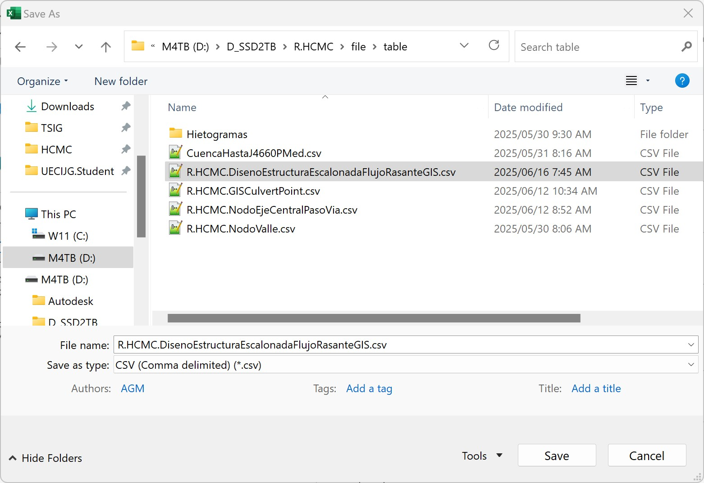
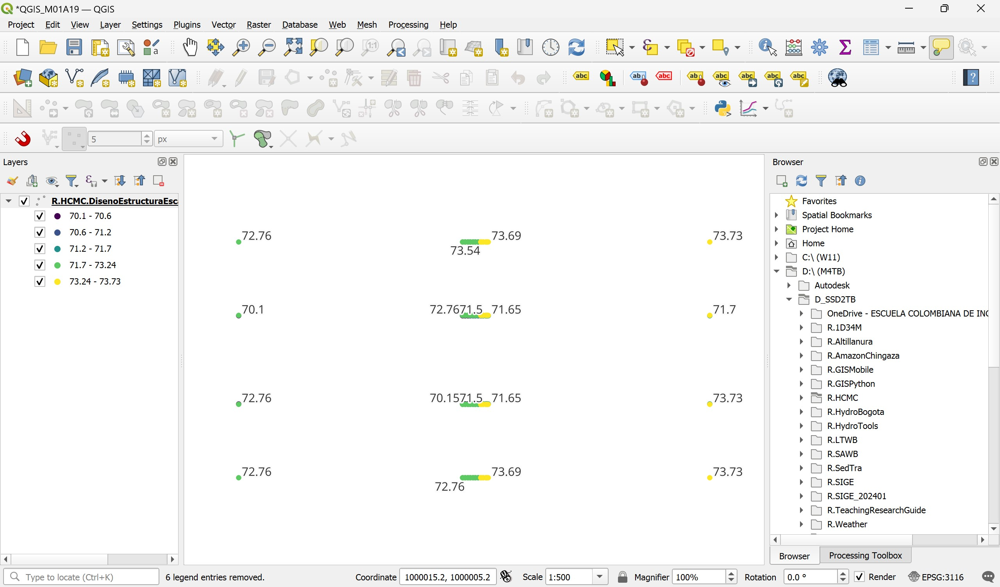

# 1.19. Obras y estructuras hidráulicas - Escalonada
Keywords: `hydraulics` `hydraulic-structure` `hydraulic-stepped-structure` `m01a19`

El diseño y construcción de canales hidráulicos, requiere frecuentemente del diseño de estructuras escalonadas cuando existen diferencias importantes de nivel entre el fondo del cauce lateral intervenido y el cauce o canal receptor.

## Objetivos

* Evaluar la diferencia entre la cota de fondo del cauce lateral y el fondo del realineamiento.
* Diseñar una estructura escalonada para la entrega de un cauce lateral.
* Modelar y validar el funcionamiento de la estructura para las condiciones de diseño.

## Requerimientos

Archivos, actividades previas, lecturas y herramientas requeridas para el desarrollo de esta actividad:

| Requerimiento                                                                                                          | Descripción                                                                                                                    |
|:-----------------------------------------------------------------------------------------------------------------------|:-------------------------------------------------------------------------------------------------------------------------------|
| [:toolbox:Herramienta](https://www.microsoft.com/es/microsoft-365/excel?market=bz)                                     | Microsoft Excel 365.                                                                                                           |
| [:toolbox:Herramienta](https://qgis.org/)                                                                              | QGIS 3.42 o superior.                                                                                                          |
| [:toolbox:Herramienta](https://www.hec.usace.army.mil/software/hec-ras/)                                               | HEC-RAS 6.6 o superior.                                                                                                        |
| [:open_file_folder:R.HydroTools.DisenoEstructuraEscalonadaFlujoRasante.xlsm](https://github.com/rcfdtools/R.HydroTools/tree/main/tool/DisenoEstructuraEscalonadaFlujoRasante) | Libro de cálculo para el análisis y diseño de estructura escalonada en sección rectangular a flujo rasante, método Iwao Ohtsu. |

> Para los diferentes avances de proyecto, es necesario guardar y publicar las diferentes versiones generadas del (los) libro (s) de Microsoft Excel y reportes o informes, agregando al final la fecha de control documental en formato aaaammdd, p. ej. _R.HydroTools.DisenoCaucesParametros.20250528.xlsx_.

## 0. Conceptos generales

Casos en los que se requiere del uso de estructuras escalonadas:

* Entrega de cauces laterales a cauces o a canales principales.
* Entrega de cuencas remanentes en cortes de vías a cunetas, canales perimetrales o ríos.
* Canales realineados en los que existe una diferencia considerable de altura entre el fondo de inicio realineado y el fondo del canal de entrega.

## 1. Procedimiento general

1. Utilizando el perfil del realineamiento del valle suavizado y el fondo del canal proyectado en la actividad [M01A08](../M01A08), determine la diferencia de nivel que existe en la entrega del cauce lateral. 

Para el caso de estudio, esta diferencia es tan solo de 0.25 metros, lo que indica que la entrega lateral podrá ser realizada por empalme de fondos y sin una estructura escalonada.

> Para el desarrollo de este ejercicio, realizaremos el diseño de una estructura escalonada con diferencia de caída de 1.5 metros.

2. En la hoja de diseño [R.HydroTools.DisenoEstructuraEscalonadaFlujoRasante.xlsm](https://github.com/rcfdtools/R.HydroTools/tree/main/tool/DisenoEstructuraEscalonadaFlujoRasante), registre los siguientes parámetros de diseño de la estructura:

* Caudal de diseño, Qd: caudal del cauce lateral obtenido en la entrega [M01A02](../M01A02) para la cuenca W19610 del modelo hidrológico con factor de atenuación 1.0. 
* Altura del escalón o contrahuella, s: altura definida por el diseñador.
* Ancho superficial estructura, B: correspondiente al ancho geométrico de la sección obtenido en la entrega [M01A13](../M01A13).
* Diferencia de caída, Dh: diferencia entre el fondo del cauce lateral y el fondo del valle.

Una vez ingresados estos parámetros, de clic en los botones `0. Resolver θ < 19°, L huella` y `1. Resolver y1`, así obtendrá la longitud de la huella para un angulo tetta inferior a 19 grados y la profundidad hidráulica _y1_ al inicio de la estructura.

> El ancho superficial de la estructura podrá ser menor teniendo en cuenta que la geometría del canal es trapezoidal y la geometría de la estructura es rectangular. Este valor es utilizado para calcular las profundidades secuentes del resalto hidráulico en la zona inferior de la estructura.

3. Verifique la altura de caída y que se cumplan los criterios de selección de altura de contrahuella.

4. Verifique el cumplimiento del tipo de flujo rasante en la estructura y la altura de caída necesaria para alcanzar esta condición.

5. Revise el cálculo de la profundidad y la velocidad de flujo, si se alcanza la condición de flujo quasi-uniforme.

6. Revise el cálculo de la profundidad y la velocidad de flujo cuando no se alcanza la condición de flujo quasi-uniforme (de clic en el botón `2. Resolver dw`), la energía residual y la concentración media del aire.

7. Revise y calcule la profundidad de flujo para una concentración de aire de 0.9 en zona de flujo quasi-uniforme, la altura de los muros del canal en zona de flujo quasi-uniforme y la profundidad de flujo y2 (profundidad secuente del resalto hidráulico) en zona inferior estructura, de clic en los botones `3. Resolver y2 con q-u` y `4. Resolver y2 sin q-u`.

> Como observa, los resultados presentan valores si se alcanza o no la condición de flujo quasi-uniforme. Para este ejemplo utilizaremos los resultados cuando no se alcanza la condición q-u, suponiendo que la descarga no está controlada y que la estructura en su entrega está localizada dentro del valle del cauce principal de realineamiento garantizando el confinamiento del flujo.

8. Para la construcción de los esquemas geométricos, ingrese el valor de desplazamiento por coalineación que permitirá crear nodos con un pequeño desplazamiento lateral en las paredes, y la pendiente del cauce lateral evaluado en la entrega [M01A13](../M01A13).

> Para cambiar la longitud de los tramos de aproximación antes y después de la estructura, necesarios para desarrollar el flujo por la estructura, ajuste el valor del factor multiplicador que se encuentra en la tabla de parámetros de entrada.

9. Visualice y revise el esquema del perfil de la estructura.

## 2. Creación de modelo digital de terreno

Para la ilustración del DTM, realizaremos un ajuste en el ancho de la sección de la estructura a 15 metros con factor de aproximación de 2.5 para obtener un corredor más largo y prevención de coalineación de nodos de 0.01 metros.

1. En el libro de diseño [R.HydroTools.DisenoEstructuraEscalonadaFlujoRasante.xlsm](https://github.com/rcfdtools/R.HydroTools/tree/main/tool/DisenoEstructuraEscalonadaFlujoRasante), exporte el contenido de la hoja _GIS_ a un archivo de texto separado por comas como _/file/table/R.HCMC.DisenoEstructuraEscalonadaFlujoRasanteGIS.csv_.

> :bulb: En GIS y CAD, es obligatoria la definición de un valor de coalineación debido a que al crear las superficies TIN, estas requieren de un pequeño desplazamiento en la vertical para nodos en la misma localización. Se recomienda usar 0.01 metros para CAD en Civil 3D y 0.1 metros en GIS definiendo pixeles de 0.1 metros en la exportación inicial del ráster.

2. En QGIS, desde el menú _Layer / Add Layer / Add Delimited Text Layer..._ agregue la tabla de nodos y visualice como una capa temporal, utilice el archivo csv, la coordenada Z y asigne el CRS 3116.

3. Ajuste la simbología de representación y rotule los nodos a partir de su cota. 

4. Guarde la capa temporal como un archivo shapefile en _/file/shp/DisenoEstructuraEscalonadaFlujoRasanteGIS.shp_

5. Utilizando la herramienta _Processing Toolbox / Vector general / Delete duplícate geometries_, elimine los nodos duplicados y guarde como _/file/shp/DisenoEstructuraEscalonadaFlujoRasanteGISClean.shp_. De los 1812 puntos obtenidos, solo 144 son únicos.

6. Utilizando la herramienta _Processing Toolbox / Mesh / TIN Mesh Creation_, cree la malla del modelo digital de terreno de la estructura. Guarde como _/file/dem/DisenoEstructuraEscalonadaFlujoRasanteGIS.d2m_

> :fire: Debido a la proximidad y extensión alargada de algunas caras trianguladas de la superficie del TIN, este procedimiento no se ejecuta correctamente en QGIS. En la ventana de ejecución podrá observar que el procedimiento no avanza más allá del 1% y que luego de unos segundo QGIS se cierra completamente.

7. Vuelva a abrir QGIS y exporte a formato DXF los 144 nodos que componen la estructura, guarde como _/file/cad/DisenoEstructuraEscalonadaFlujoRasanteGIS.dxf_.

Agregue las entidades DXF al mapa y verifique su localización.

8. En Autodesk Civil 3D, abra el archivo DXF exportado, acérquese a la capa con el comando _Z E_ y con el comando _PTYPE_, cambie la representación de los nodos a círculos de 0.2 m de diámetro.

9. Guarde el archivo DXF como un archivo de AutoCAD como /file/cad/DisenoEstructuraEscalonadaFlujoRasanteGIS.dwg.

Visualice y verifique la superficie creada y en caso de ser necesario, ajuste la tabla de valores.

## Actividades de proyecto :triangular_ruler:

Utilizando la [plantilla suministrada](../../file/report/R.HCMC.PlantillaSoporteDesarrollo.docx), cree un documento soporte mostrando las actividades desarrolladas en el orden presentado en esta actividad, junto con los análisis y recomendaciones realizadas, convierta a Adobe Acrobat (.pdf) y guarde en la carpeta _/activity_ del repositorio de datos del proyecto; nombre el archivo con el código de la actividad agregando al final la fecha de control documental en formato aaaammdd (p. ej. M01A00_20250531.pdf).

En la siguiente tabla se listan las actividades que deben ser desarrolladas y documentadas por cada estudiante o grupo de proyecto.

| Actividad | Alcance                                                                                                                                                                                                                                                                                                                                                                                                                                                                                                                                              |
|:----------|:-----------------------------------------------------------------------------------------------------------------------------------------------------------------------------------------------------------------------------------------------------------------------------------------------------------------------------------------------------------------------------------------------------------------------------------------------------------------------------------------------------------------------------------------------------|
| M01A00    | Descargar el archivo [R.HydroTools.DisenoCaucesParametros.xlsx](https://github.com/rcfdtools/R.HydroTools/blob/main/tool/DisenoCaucesParametros/R.HydroTools.DisenoCaucesParametros.xlsx) disponible en GitHub, e incluirlo en el repositorio.                                                                                                                                                                                                                                                                                                       | 
| M01A00    | Investigar, verificar y registrar en el libro de Excel, los parámetros técnicos, hidráulicos e hidrológicos indicados en esta actividad.  Para el grupo de parámetros normativos, ambientales / sociales y territoriales, revisar los parámetros actualmente reportados, investigar, registrar y actualizar.                                                                                                                                                                                                                                   | 
| M01A00    | Registrar los valores obtenidos en el [libro de parámetros generales](https://github.com/rcfdtools/R.HydroTools/tree/main/tool/DisenoCaucesParametros) requeridos para el diseño y la modelación. Guardar en la carpeta _/file/table_.                                                                                                                                                                                                                                                                                                               |
| M01A00    | Opcional: verificar la formulación correcta de los libros de cálculo suministrados. En las notas de la ficha de control documental indicar el método de verificación y si se requieren o no ajustes.                                                                                                                                                                                                                                                                                                                                                 |
| M01A00    | En una tabla y al final del informe de avance de esta entrega, indique el detalle de las actividades realizadas por cada integrante de su grupo; utilice las siguientes columnas: `Nombre del integrante`, `Actividades realizadas`, `Tiempo dedicado en horas` (si presenta la entrega individualmente, no es necesaria la presentación de esta tabla).  Para actividades que no requieren del desarrollo de elementos de avance, indicar si realizo la lectura de la guía de clase y las lecturas indicadas al inicio en los requerimientos. | 

> Nota 1: para la revisión del proyecto final, guarde los libros cálculo de Microsoft Excel y los archivos generados en esta actividad, en las localizaciones indicadas en cada numeral.
>
> Nota 2: una vez el instructor realice la revisión y el estudiante presente las correcciones o ajustes solicitados, será necesario cargar una nueva versión de los archivos en el repositorio del proyecto, incluyendo o actualizando al final del nombre del archivo, la fecha de presentación en formato aaaammdd y manteniendo las versiones anteriores presentadas.
>

## Referencias

* 

## Control de versiones

| Versión    | Descripción        | Autor                                      | Horas |
|------------|:-------------------|--------------------------------------------|:-----:|
| 2025.06.12 | Migración a GitHub | [rcfdtools](https://github.com/rcfdtools)  |   8   |
| 2014.01.11 | Versión inicial.   | [rcfdtools](https://github.com/rcfdtools)  |  18   |

##

_R.HCMC es de uso libre para fines académicos, conoce nuestra licencia, cláusulas, condiciones de uso y como referenciar los contenidos publicados en este repositorio, dando [clic aquí](../../LICENSE.md)._

_¡Encontraste útil este repositorio!, apoya su difusión marcando este repositorio con una ⭐ o síguenos dando clic en el botón Follow de [rcfdtools](https://github.com/rcfdtools) en GitHub._

| [:arrow_backward: Anterior](../M01A00/Readme.md) | [:house: Inicio](../../README.md) | [:beginner: Ayuda / Colabora](https://github.com/rcfdtools/R.SIGE/discussions/99999) | [Siguiente :arrow_forward:](../M01A02/Readme.md) |
|--------------------------------------------------|-----------------------------------|--------------------------------------------------------------------------------------|--------------------------------------------------|

[^1]: 