# 1.20. Obras y estructuras hidráulicas - Rápida
Keywords: `hydraulics` `hydraulic-structure` `hydraulic-jump` `hydraulic-fall`

Las rápidas pueden ser utilizadas para realizar conexión de cauces laterales a canales principales de desviación, ya que es posible ajustar la pendiente natural del terreno y por tal razón, el movimiento de tierras es menor al de una entrega usando estructuras escalonadas a flujo rasante. Una desventaja en su implementación es la erosión generada por las altas velocidades del canal de la rápida.

## Objetivos

* Estudiar las zonas que componen una rápida.
* Diseñar una estructura rápida para la entrega de un cauce lateral.
* Modelar y validar el funcionamiento de la estructura para las condiciones de diseño.

## Requerimientos

Archivos, actividades previas, lecturas y herramientas requeridas para el desarrollo de esta actividad:

| Requerimiento                                                                                           | Descripción                                                         |
|:--------------------------------------------------------------------------------------------------------|:--------------------------------------------------------------------|
| [:toolbox:Herramienta](https://www.microsoft.com/es/microsoft-365/excel?market=bz)                      | Microsoft Excel 365.                                                |
| [:toolbox:Herramienta](https://qgis.org/)                                                               | QGIS 3.42 o superior.                                               |
| [:open_file_folder:R.HydroTools.DisenoEstructuraRapida.xlsm](https://github.com/rcfdtools/R.HydroTools/tree/main/tool/DisenoEstructuraRapida) | Libro de cálculo para el diseño hidráulico y geométrico de rápidas. |

> Para los diferentes avances de proyecto, es necesario guardar y publicar las diferentes versiones generadas del (los) libro (s) de Microsoft Excel y reportes o informes, agregando al final la fecha de control documental en formato aaaammdd, p. ej. _R.HydroTools.DisenoCaucesParametros.20250528.xlsx_.

## 0. Conceptos generales

Una rápida es un canal de gran pendiente que conecta dos tramos de un canal con pendiente suave entre los que existe un desnivel considerable en una longitud corta y bliga a conducir el agua en ese tramo sobre pendientes pronunciadas y con altas velocidades. Cuando la longitud de la rápida es corta, se la denomina caída inclinada y su diseño hidráulico es el mismo que el de la rápida.

**Casos en los que se requiere del uso de rápidas**

* Entrega de cauces o drenajes laterales a cauces o a canales principales en los que existe una diferencia importante de nivel.
* Canales realineados en los que existe una diferencia considerable de altura entre el fondo de inicio realineado y el fondo del canal de entrega.

**Zonas**

| Zona  | Descripción                                                                                                                                                                                                                                                                                                                                                                                                                                                                                                                                                                                                                                                                                                                                       |
|-------|---------------------------------------------------------------------------------------------------------------------------------------------------------------------------------------------------------------------------------------------------------------------------------------------------------------------------------------------------------------------------------------------------------------------------------------------------------------------------------------------------------------------------------------------------------------------------------------------------------------------------------------------------------------------------------------------------------------------------------------------------|
| 0 a 1 | Canal natural o canal dragado de entrada en la parte superior.                                                                                                                                                                                                                                                                                                                                                                                                                                                                                                                                                                                                                                                                                    |
| 1 a 2 | Transición de entrada de la sección del canal natural al canal de sección reducida de la rápida. Funciona como sección de control para el establecimiento del régimen y profundidad crítico. Mediante la sección de control, se intenta disminuir las altas velocidades en la entrada a la rápida, producidas por el abatimiento de la superficie del agua y lograr que el efecto del remanso sea el mínimo posible. Sirve también para darle al flujo un ingreso adecuado a la rápida, con un flujo simétrico respecto del eje para evitar salpicaduras, oleaje e inclusive un salto de agua fuera del cauce.                                                                                                                                    |
| 2 a 3 | Canal de la rápida: Es el tramo comprendido entre la sección de control y el inicio de la trayectoria curva de caída. La pendiente de sus tramos se adecua a las condiciones topográficas del terreno. pero evitando reducciones de la pendiente. El régimen de flujo en la rápida es supercrítico y la superficie del agua sigue una curva que se acerca asintóticamente al tirante normal. Se recomienda seguir una alineación recta en planta y utilizar canales prismáticos de secciones rectangulares, dado que el flujo a altas velocidades es muy sensible a todo cambio de sección y de dirección. El flujo es especialmente inestable cuando el régimen es cercano al crítico o sea para los valores del número de Froude entre 1 y 1.5. |
| 3 a 4 | Trayectoria de caída: La trayectoria curva de caída, permite al diseñador, trazar una caída más pronunciada a la zona de transición hacia el tanque disipador.                                                                                                                                                                                                                                                                                                                                                                                                                                                                                                                                                                                    |
| 4 a 5 | Transición caída a tanque disipador: Zona donde se realiza la transición de la rápida hacia el ancho del canal original del cauce.                                                                                                                                                                                                                                                                                                                                                                                                                                                                                                                                                                                                                |
| 5 a 6 | Tanque disipador: Se ubica en el extremo inferior del canal de la rápida. Es la estructura que mantiene un colchón de agua que absorbe el exceso de energía cinética generada en la rápida mediante la reducción de la velocidad del agua en una poza de disipación. Su diseño se realiza a través de la determinación de la profundidad secuente. El régimen del flujo pasa de supercrítico a subcrítico mediante un resalto hidráulico                                                                                                                                                                                                                                                                                                          |
| 6 a 7 | Rampa de salida: La salida del tanque disipador debe ser una rampa con una pendiente de entre 2: I o más tendida para permitir la auto limpieza del colchón. Esto evita la acumulación de arena, grava, ramas y deshechos.                                                                                                                                                                                                                                                                                                                                                                                                                                                                                                                        |
| 7 a 8 | Canal natural o canal dragado de salida en la parte inferior o entrega.                                                                                                                                                                                                                                                                                                                                                                                                                                                                                                                                                                                                                                                                           |

## 1. Sección transversal canal aguas arriba de rápida (0 - 1)

En el libro de diseño [R.HydroTools.DisenoEstructuraRapida.xlsm](https://github.com/rcfdtools/R.HydroTools/tree/main/tool/DisenoEstructuraRapida), ingrese en la _Sección transversal canal aguas arriba de rápida (0 - 1)_, las propiedades geométricas del cauce lateral. Para el prototipo del caso de estudio, utilizaremos la geometría de la sección del cauce lateral obtenida en la actividad [M01A13](../M01A13) y el caudal obtenido en la entrega [M01A02](../M01A02) para la cuenca W19610 del modelo hidrológico con factor de atenuación 1.0.

M01A02 - Geometría del diseño hidráulico de la sección 

Parámetros geométricos canal natural 

Automáticamente, serán calculadas las propiedades hidráulicas de la sección y se generará el gráfico de sección y perfil para esta zona.

## 2. Resolver requeridos

Para facilitar la solución geométrica e hidráulica de la rápida, en la parte inferior de la hoja de diseño, encontrará una tabla en donde puede ingresar la longitud requerida en la rápida para la zona 2-3, la altura total de la estructura (correspondiente a la diferencia de nivel entre el fondo del cauce lateral y el fondo del canal de realineamiento donde se realizará la entrega) y la longitud de la transición ajustada en la zona 4-5.

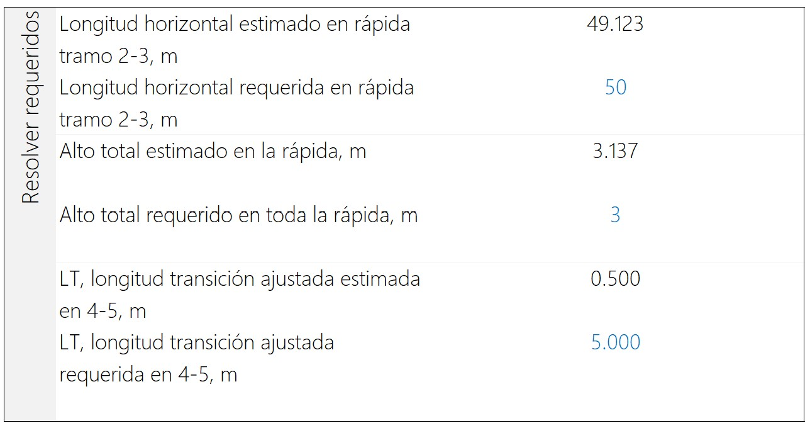

## 3. Sección transversal de control y transición (1 - 2)

Ingrese los parámetros de la sección de control donde se establecerá el control de flujo crítico. Ingrese un ancho de diseño, una pendiente semilla (recomendable ingresar la pendiente del canal natural de la zona 0.1) y el ángulo de la transición (por ejemplo 45 grados para una transición muy brusca). Una vez ingresados estos valores, de clic en el botón `A. Resolver pendiente tramo 1-2 para obtener L2-3 requerido`.

> Es recomendable diseñar este tramo con geometría rectangular con revestimiento en concreto rugoso, para lo cual, los taludes laterales deben ser establecidos en cero y la rugosidad en 0.018.

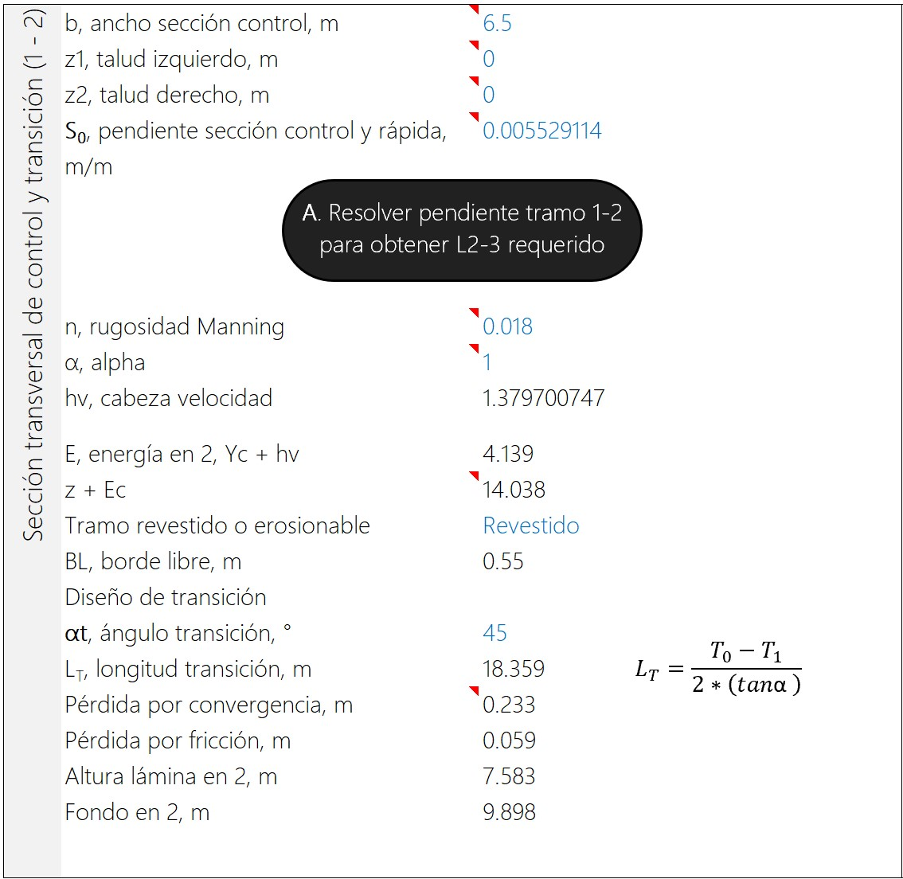

Automáticamente, serán calculadas las propiedades hidráulicas de la sección y se generará el gráfico de sección y perfil para esta zona.

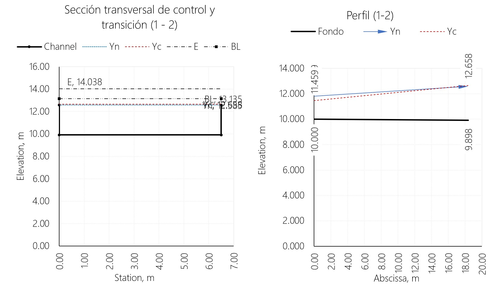

## 4. Longitud y perfil hidráulico rápida (2 - 3)

Automáticamente, serán calculadas las propiedades hidráulicas para esta zona, a partir de los parámetros resueltos en las zonas anteriores.

> Para resolver el perfil hidráulico en esta zona, se ha utilizado el método de tramo a tramo basado en la aplicación de la Fórmula de Bernulli. El desarrollo del perfil para alcanzar la profundidad normal, puede requerir de un canal muy largo, por lo que para su modelación y construcción, puede considerar una longitud más corta (donde considere como diseñador que ya se ha desarrollado completamente el perfil).

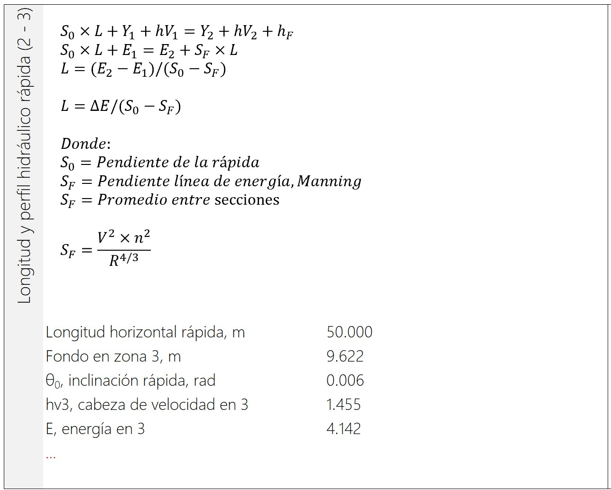

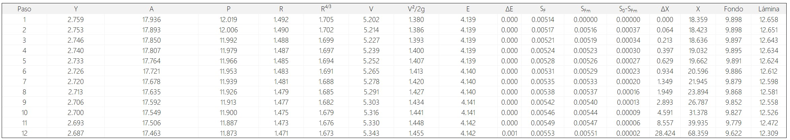

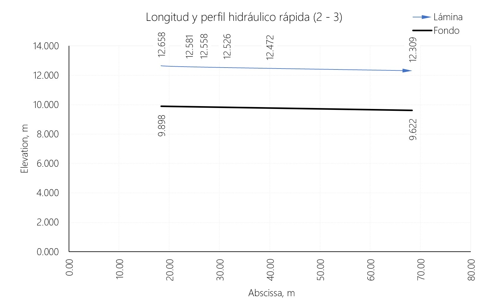

## 5. Diseño y perfil trayectoria de caída (3 - 4)

Para el diseño de esta zona, ingrese 1 como semilla de relación de caída, ingrese el factor de aceleración y de clic en el botón `B. Resolver altura total requerida en la estructura rápida cambiando relación de caída en 3-4`. Automáticamente obtendrá la inclinación y longitud de la trayectoria curva.

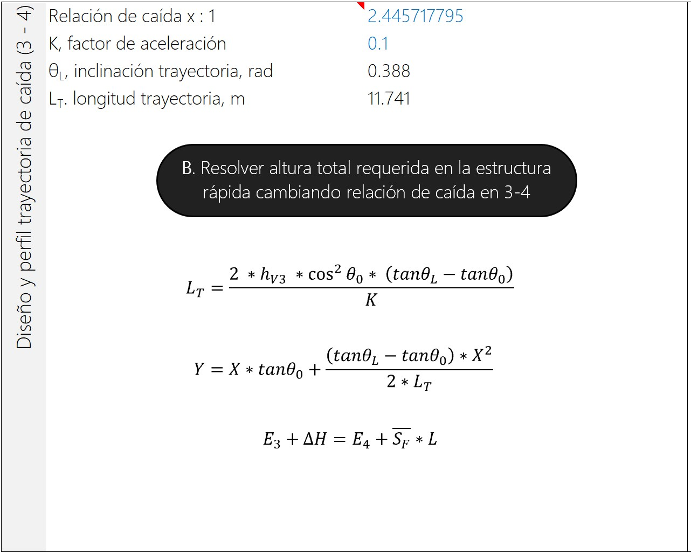

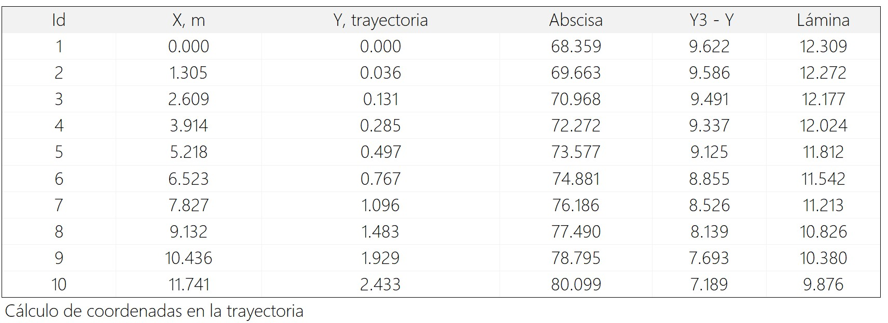

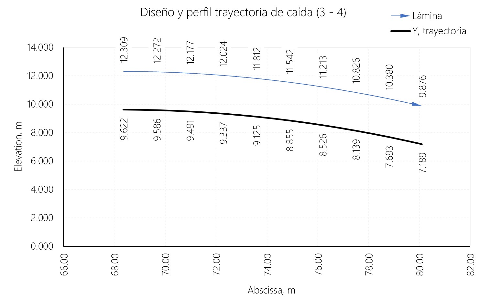

## 6. Transición caída trayectoria a tanque disipador (4 - 5)

Para el diseño de esta zona, utilizaremos el mismo ángulo de transición empleado en la sección de control 1-2, obteniendo su longitud y altura de caída.

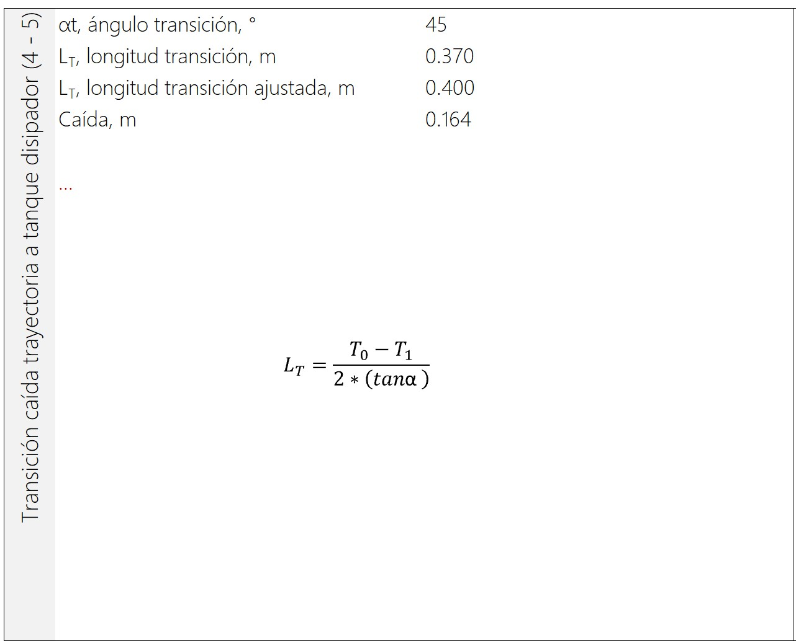

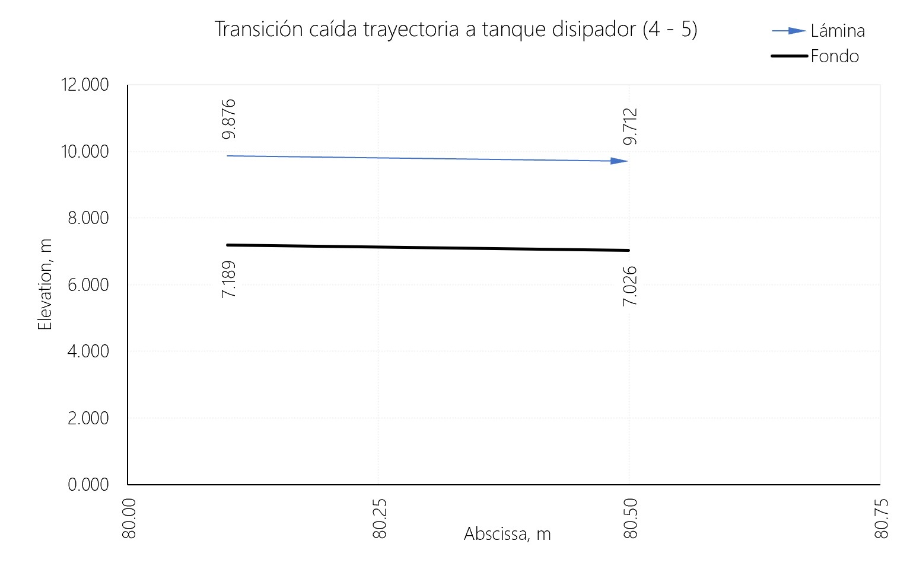

## 7. Tanque disipador (5 - 6 - 7 - 8)

Para el diseño de las zonas 5 a 8, ingrese la relación de inclinación de la rampa de salida. Automáticamente, serán calculadas las propiedades. En el evento que la profundidad del colchón amortiguador de agua sea muy pequeño (mínimo en el tanque colchón de 0.2 m usando bolsacretos de 0.5 m anclados 0.3 m), de clic en el botón `C. Resolver profundidad válida colchón "e" cambiando ancho en rápida` que le permitirá ajustar el ancho en la rápida definido para en la zona 1-2.

> Si decide ajustar automáticamente el ancho, deberá verificar y ajustar el diseño de las zonas 1 a 5.

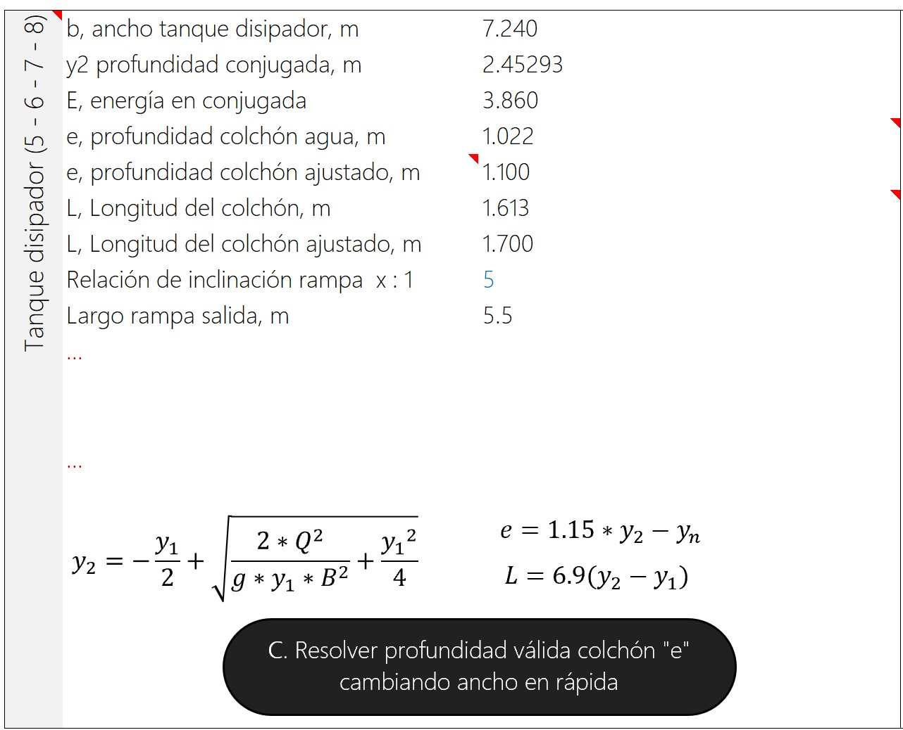

Para finalizar, verifique el gráfico de perfil de la rápida y el cumplimiento de longitud y altura definidos.

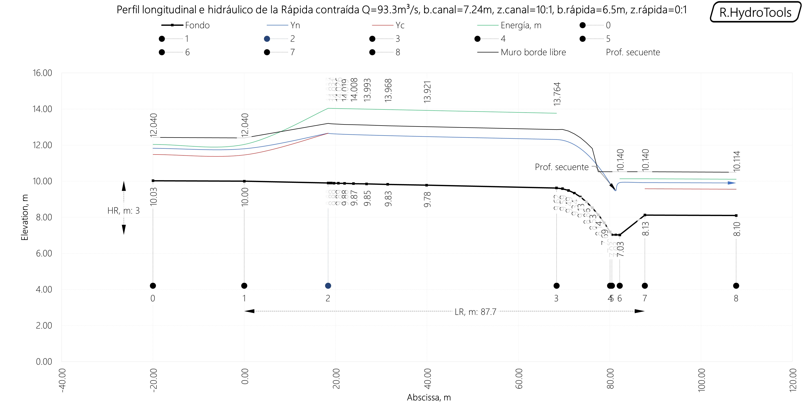

## Actividades de proyecto :triangular_ruler:

Utilizando la [plantilla suministrada](../../file/report/R.HCMC.PlantillaSoporteDesarrollo.docx), cree un documento soporte mostrando las actividades desarrolladas en el orden presentado en esta actividad, junto con los análisis y recomendaciones realizadas, convierta a Adobe Acrobat (.pdf) y guarde en la carpeta _/activity_ del repositorio de datos del proyecto; nombre el archivo con el código de la actividad agregando al final la fecha de control documental en formato aaaammdd (p. ej. M01A20_20250531.pdf).

En la siguiente tabla se listan las actividades que deben ser desarrolladas y documentadas por cada estudiante o grupo de proyecto.

| Actividad | Alcance                                                                                                                                                                                                                                                                                                                                                                                                                                                                                                                                              |
|:----------|:-----------------------------------------------------------------------------------------------------------------------------------------------------------------------------------------------------------------------------------------------------------------------------------------------------------------------------------------------------------------------------------------------------------------------------------------------------------------------------------------------------------------------------------------------------|
| M01A20    | Diseñar y modelar unidimensionalmente en HEC-RAS, la estructura rápida del cauce lateral. Crear un modelo prototipo en HEC-RAS y modelar a descarga libre y con descarga controlada, suponiendo que el canal principal está trasportando el caudal dominante. Nombrar los modelos como HECRAS_v0_EstructuraRapidaCauceLateral y cargar en formato .zip en la carpeta /file/hec/ del repositorio de datos (ver nota 3).                                                                                                                               | 
| M01A20    | Para cada prototipo digital funcional, crear un vídeo animando las láminas de agua obtenidas en la sección, el perfil y un gráfico animado con las variaciones en velocidad y cortante. Guardar en formato .mp4 como /file/report/M01A19_EstructuraRapidaCauceLateral.mp4.                                                                                                                                                                                                                                                                           | 
| M01A20    | En el informe incluir capturas de pantalla detalladas de las secciones transversales, perfiles, condiciones de control, planta, ventana de ejecución, tablas de resultados y vista 3D. Incluir notas descriptivas del funcionamiento del modelo y su relación con el diseño realizado.                                                                                                                                                                                                                                                               |
| M01A20    | Opcional: verificar la formulación correcta de los libros de cálculo suministrados. En las notas de la ficha de control documental indicar el método de verificación y si se requieren o no ajustes.                                                                                                                                                                                                                                                                                                                                                 |
| M01A20    | En una tabla y al final del informe de avance de esta entrega, indique el detalle de las actividades realizadas por cada integrante de su grupo; utilice las siguientes columnas: `Nombre del integrante`, `Actividades realizadas`, `Tiempo dedicado en horas` (si presenta la entrega individualmente, no es necesaria la presentación de esta tabla).  Para actividades que no requieren del desarrollo de elementos de avance, indicar si realizo la lectura de la guía de clase y las lecturas indicadas al inicio en los requerimientos. | 

> Nota 1: para la revisión del proyecto final, guarde los libros cálculo de Microsoft Excel y los archivos generados en esta actividad, en las localizaciones indicadas en cada numeral.
>
> Nota 2: una vez el instructor realice la revisión y el estudiante presente las correcciones o ajustes solicitados, será necesario cargar una nueva versión de los archivos en el repositorio del proyecto, incluyendo o actualizando al final del nombre del archivo, la fecha de presentación en formato aaaammdd y manteniendo las versiones anteriores presentadas.
>
> Nota 3: en caso de que los cauces laterales puedan ser entregados a fondo y no requieran del diseño de rápidas, para esta entrega será necesario diseñar y crear el prototipo solicitado diseñando por ejemplo con diferencia de cotas de 3.0 metros como mínimo y utilizando los parámetros hidráulicos del cauce.
>
> Nota 4: en los modelos unidimensionales HEC-RAS solo se tiene en cuenta el componente del vector direccional de la velocidad que es paralelo al sentido del flujo y se asume que el flujo es gradualmente variado a excepción de las estructuras hidráulicas propias que el programa puede modelar, tales como puentes, culverts y vertederos, en donde se resuelve mediante rápidamente variado o por la ecuación de momentum y otras ecuaciones empíricas. Para modelar con precisión este tipo de estructuras que estamos diseñando, se debería utilizar un modelo 3D (Como ANSYS FLUENT, Delft3D, OpenFoam) en el que se puede hacer la descomposición de los vectores en en sentido de cambio de dirección entre celdas y en la vertical. HEC-RAS 2D permite realizar el análisis de descomposición de transferencia entre celdas pero solo en planos horizontales correspondientes a la superficie de la lámina de agua. El objetivo de los prototipos es evaluar el alcance de los perfiles y líneas de energía que se obtienen usando modelos 1D para luego entender la necesidad de su modelación en 2D o 3D, por otra parte, para el diseño de ríos como el del ejercicio de clase, se busca obtener una abstracción y representación del tránsito hidráulico en grandes extensiones y superficies de inundación para evaluar las trazas en el plano XS y las zonas de flujo muerto, los circulantes y el cumplimiento de las condiciones de diseño.

## Referencias

* Estructuras de pendientes fuertes. Universidad Tecnológica de los Andes, Facultad de Ingeniería Civil. Alejandro Zapata.
* Obras de riego para zonas montañosas. P. Hoogendam – A. Bottega.2004 / “Irrigación”.A. Rosell C.1993 / “Manual de riego por gravedad”. W. Olarte.1987 / “Obras de captación, Canales y Modelos Hidráulicos”. G. Sotelo A. 1996.
* https://www.bibliocad.com/es/biblioteca/plantilla-diseno-de-una-rapida-hidraulica_100820/#
* USON, Caídas y Rápidas. http://tesis.uson.mx/digital/tesis/docs/3487/Capitulo7.pdf
* https://civilgeeks.com/2014/07/14/excel-para-diseno-hidraulico-de-una-rapida/
* Universidad Nacional Agraria La Molina, Facultad de Ingeniería Agrícola. Diseño hidráulico de la rápida Jachacirca, proyecto especial Pasto Grande - Moquegua. Angel Francisto Cerna Pérez. Lima, Perú. 2017.
* Hidráulica de canales abiertos, Ven Te Chow. Pág. 390 y 403. Edición 1994.

## Control de versiones

| Versión    | Descripción        | Autor                                      | Horas |
|------------|:-------------------|--------------------------------------------|:-----:|
| 2025.06.18 | Migración a GitHub | [rcfdtools](https://github.com/rcfdtools)  |   5   |

##

_R.HCMC es de uso libre para fines académicos, conoce nuestra licencia, cláusulas, condiciones de uso y como referenciar los contenidos publicados en este repositorio, dando [clic aquí](../../LICENSE.md)._

_¡Encontraste útil este repositorio!, apoya su difusión marcando este repositorio con una ⭐ o síguenos dando clic en el botón Follow de [rcfdtools](https://github.com/rcfdtools) en GitHub._

| [:arrow_backward: Anterior](../M01A19/Readme.md) | [:house: Inicio](../../README.md) | [:beginner: Ayuda / Colabora](https://github.com/rcfdtools/R.SIGE/discussions/99999) | [Siguiente :arrow_forward:](../M02A01/Readme.md) |
|--------------------------------------------------|-----------------------------------|--------------------------------------------------------------------------------------|--------------------------------------------------|

[^1]: 