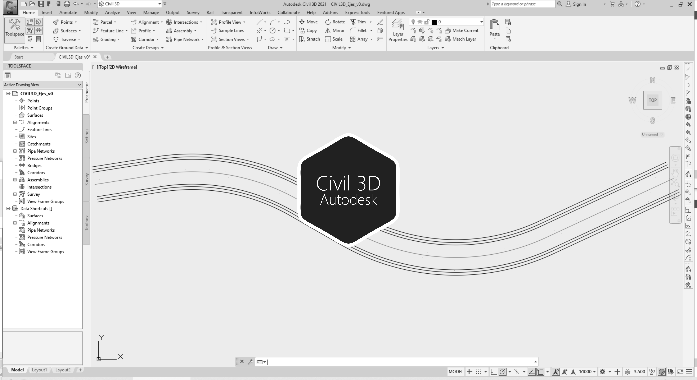

# 2.2. Trazado de los alineamientos para el valle (eje de valle, taludes y cauces laterales)
Keywords: `export` `aligment` `curve-spiral` `clothoid` `offset-aligment` `autodesk-civil-3d` `autodesk-autocad` `surface` `m02a02`

Trazar los alineamientos correspondientes para el eje del valle y taludes para el cauce de realineamiento y cauces menores.

## Objetivos

* Exportar los drenajes naturales de ArcMap a Autodesk AutoCAD.
* Trazar el eje del valle usando Autodesk Civil 3D.
* Trazar offsets o líneas paralelas que definen los ejes de bancas y taludes.

## Requerimientos

Archivos, actividades previas, lecturas y herramientas requeridas para el desarrollo de esta actividad:

| Requerimiento                                                                                                                   | Descripción                                                                                                                                                                                      |
|:--------------------------------------------------------------------------------------------------------------------------------|:-------------------------------------------------------------------------------------------------------------------------------------------------------------------------------------------------|
| [:toolbox:Herramienta](https://qgis.org/)                                                                                       | QGIS 3.42 o superior.                                                                                                                                                                            |
| [:toolbox:Herramienta](https://www.autodesk.com/products/autocad)                                                               | Autodesk AutoCAD 2026 (english version) o superior.                                                                                                                                              |
| [:toolbox:Herramienta](https://www.autodesk.com/products/civil-3d)                                                              | Autodesk Civil 3D 2026 (english version) o superior.                                                                                                                                             |
| [:round_pushpin:CGG_DrenajeNatural_v0.shp](../../file/shp/CGG_DrenajeNatural_v0.zip)                                            | Capa geográfica de drenajes naturales.                                                                                                                                                           |
| [:round_pushpin:RD_EjeValleNodo_v1.dwg](../../file/cad/acad/RD_EjeValleNodo_v1.zip)                                             | Archivo Autodesk AutoCAD con: eje recto del valle de realineamiento.                                                                                                                             |
| [:mortar_board:Actividad 1.3. Trazado del eje de valle y estimación de radios de curvatura para suavizado](../M01A03/Readme.md) | Establecer los puntos para el trazado del eje de valle y estimar los radios de curvatura que permitan trazar el corredor del alineamiento del valle suavizado requerido para el diseño sinuoso.  |

> Para los diferentes avances de proyecto, es necesario guardar y publicar las diferentes versiones generadas del (los) libro (s) de Microsoft Excel y reportes o informes, agregando al final la fecha de control documental en formato aaaammdd, p. ej. _R.HydroTools.DisenoCaucesParametros.20250528.xlsx_.

## Procedimiento general

R.HCMC se encuentra en proceso de actualización, consulte la versión anterior en el enlace [M02A02.pdf](M02A02.pdf).

## Actividades de proyecto :triangular_ruler:

Utilizando la [plantilla suministrada](../../file/report/R.HCMC.PlantillaInformeTecnico.docx), cree un informe técnico mostrando las actividades desarrolladas en el orden presentado en esta actividad, junto con los análisis y recomendaciones realizadas, convierta a Adobe Acrobat (.pdf) y guarde en la carpeta _/report_ del repositorio de datos del proyecto; nombre el archivo con el código de la actividad agregando al final la fecha de control documental en formato aaaammdd (p. ej. M02A01_20250531.pdf).

En la siguiente tabla se listan las actividades que deben ser desarrolladas y documentadas por cada estudiante o grupo de proyecto.

| Actividad | Alcance                                                                                                                                                                                                                                                                                                                                                                                                                                                                                                                                              |
|:----------|:-----------------------------------------------------------------------------------------------------------------------------------------------------------------------------------------------------------------------------------------------------------------------------------------------------------------------------------------------------------------------------------------------------------------------------------------------------------------------------------------------------------------------------------------------------|
| M02A02    | Desde QGIS, exporte la capa de drenajes naturales [CGG_DrenajeNatural_v0.shp](../../file/shp/CGG_DrenajeNatural_v0.zip) a formato CAD, guardar el archivo como _[/file/cad/acad/CGG_DrenajeNatural_v0.dxf](../../file/cad/acad/CGG_DrenajeNatural_v0.zip)_.En el informe técnico, incluya capturas de pantalla de las herramientas de exportación utilizadas.                                                                                                                                                                            | 
| M02A02    | En Autodesk Civil 3D, crear el alineamiento del valle suavizado y los offset de banca, nombrar como _[/file/cad/civil/Civil3D_EjeValle_v0.dwg](../../file/cad/civil/Civil3D_EjeValle_v0.zip)_.En el informe técnico, incluya capturas de pantalla de las diferentes herramientas Autodesk Civil 3D utilizadas y los alineamientos obtenidos.                                                                                                                                                                                                       | 
| M02A02    | En una tabla y al final del informe de avance de esta entrega, indique el detalle de las actividades realizadas por cada integrante de su grupo; utilice las siguientes columnas: `Nombre del integrante`, `Actividades realizadas`, `Tiempo dedicado en horas` (si presenta la entrega individualmente, no es necesaria la presentación de esta tabla).  Para actividades que no requieren del desarrollo de elementos de avance, indicar si realizo la lectura de la guía de clase y las lecturas indicadas al inicio en los requerimientos. | 

**_Nota 1_**: para la revisión del proyecto final, guarde los libros cálculo de Microsoft Excel y los archivos generados en esta actividad, en las localizaciones indicadas en cada numeral.

**_Nota 2_**: una vez el instructor realice la revisión y el estudiante presente las correcciones o ajustes solicitados, será necesario cargar una nueva versión de los archivos en el repositorio del proyecto, incluyendo o actualizando al final del nombre del archivo, la fecha de presentación en formato aaaammdd y manteniendo las versiones anteriores presentadas.

## Referencias

* https://www.autodesk.com/education/free-software/autocad
* https://www.autodesk.com/education/free-software/civil-3d

## Control de versiones

| Versión    | Descripción        | Autor                                     | Horas |
|------------|:-------------------|-------------------------------------------|:-----:|
| 2025.07.29 | Migración a GitHub | [rcfdtools](https://github.com/rcfdtools) |   2   |
| 2014.01.13 | Versión inicial.   | [frankv13](https://github.com/frankv13)   |   8   |

##

_R.HCMC es de uso libre para fines académicos, conoce nuestra licencia, cláusulas, condiciones de uso y como referenciar los contenidos publicados en este repositorio, dando [clic aquí](../../LICENSE.md)._

_¡Encontraste útil este repositorio!, apoya su difusión marcando este repositorio con una ⭐ o síguenos dando clic en el botón Follow de [rcfdtools](https://github.com/rcfdtools) en GitHub._

| [:arrow_backward: Anterior](../M02A01/Readme.md) | [:house: Inicio](../../README.md) | [:beginner: Ayuda / Colabora](https://github.com/rcfdtools/R.HCMC/discussions/1) | [Siguiente :arrow_forward:](../M02A03/Readme.md) |
|--------------------------------------------------|-----------------------------------|----------------------------------------------------------------------------------|--------------------------------------------------|

[^1]: 