

# 2.3. Trazado de clotoides para el cauce sinuoso
Keywords: `aligment` `curve-spiral` `clothoid` `offset-aligment` `autodesk-civil-3d` `autodesk-autocad` `surface` `m02a03`

Trazar el alineamiento del cauce dominante sinuoso teniendo en cuenta los parámetros geométricos de la sinuosidad definida en el diseño. Dibujar los ejes correspondientes a los taludes del cauce principal, teniendo en cuenta las consideraciones planteadas en el diseño en cuanto a no linealidad de taludes y pasos para la mecanización. Ajustar el diseño sinuoso al ancho disponible del valle. 

## Objetivos

* Trazar los ejes requeridos para el corte del cauce principal sobre terreno natural.
* Trazar los ejes requeridos para el corte de cauces laterales sobre terreno natural.

## Requerimientos

Archivos, actividades previas, lecturas y herramientas requeridas para el desarrollo de esta actividad:

| Requerimiento                                                                                                                                             | Descripción                                                                                                                                                                                                                                                                                                                                                      |
|:----------------------------------------------------------------------------------------------------------------------------------------------------------|:-----------------------------------------------------------------------------------------------------------------------------------------------------------------------------------------------------------------------------------------------------------------------------------------------------------------------------------------------------------------|
| [🧰Herramienta](https://qgis.org/)                                                                                                                 | QGIS 3.42 o superior.                                                                                                                                                                                                                                                                                                                                            |
| [🧰Herramienta](https://www.autodesk.com/products/civil-3d)                                                                                        | Autodesk Civil 3D 2026 (english version) o superior.                                                                                                                                                                                                                                                                                                             |
| [📌Civil3D_EjeValle_v0.dwg](../../file/cad/civil/Civil3D_EjeValle_v0.zip)                                                                    | Archivo Autodesk Civil 3D con: eje recto del valle, clotoide eje suavizado del valle y offsets de taludes de valle.                                                                                                                                                                                                                                              |
| [🎓Actividad 1.15. Diseño geométrico horizontal o diseño sinuoso](../M01A15/Readme.md)                                                        | A partir de la estimación de los radios de curvatura característicos de los meandros o las ondas existentes en el cauce natural a reemplazar, el índice de sinuosidad y los anchos de sección diseñados hidráulicamente para el transporte del caudal dominante y creciente, determinar los atributos geométricos requeridos para el trazado del cauce sinuoso.  |

> Para los diferentes avances de proyecto, es necesario guardar y publicar las diferentes versiones generadas del (los) libro (s) de Microsoft Excel y reportes o informes, agregando al final la fecha de control documental en formato aaaammdd, p. ej. _R.HydroTools.DisenoCaucesParametros.20250528.xlsx_.

## Procedimiento general

R.HCMC se encuentra en proceso de actualización, consulte la versión anterior en el enlace [M02A03.pdf](M02A03.pdf).

1. En Autodesk Civil 3D, abra el archivo /cad/civil/Civil3D_EjeValle_v0.dwg creado en la actividad anterior y guarde como /cad/civil/Civil3D_Ejes_v0.dwg

> Desde la barra de estado y con el botón _Workspace Switching_ (⚙️) o el comando **WSCURRENT**, establezca el entorno de trabajo como _Civil 3D_.

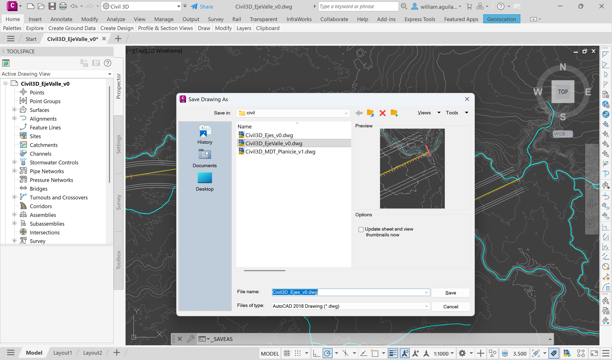

2. Ajuste la visualización de la superficie de terreno a solo contorno y en el **MAPWSPACE** desactive la visualización de las curvas de nivel GIS.

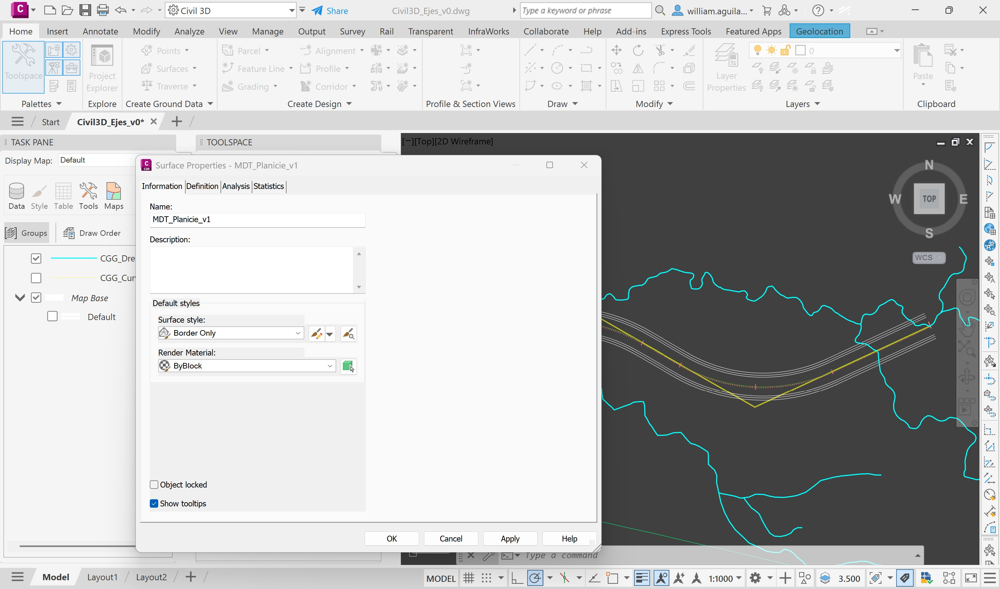

3. Para el trazado el eje sinuoso son requeridos los parámetros _Radio de curva característico de onda (Rc = 81.9m ≈ 82m_), _Amplitud de onda para el diseño (B’/2 = 128.689m)_ y _Longitud de onda (Lm/4 = 82.369m)_ obtenidos en la [Actividad 1.15. Diseño geométrico horizontal o diseño sinuoso](../M01A15/Readme.md), correspondientes al _Diseño sinuoso 1 - Conservando la longitud del río natural a reemplazar_.

4. Desde _Home / Profile & Section Views / Sample Lines_, cree el grupo de líneas de muestreo estableciendo la superficie de terreno.

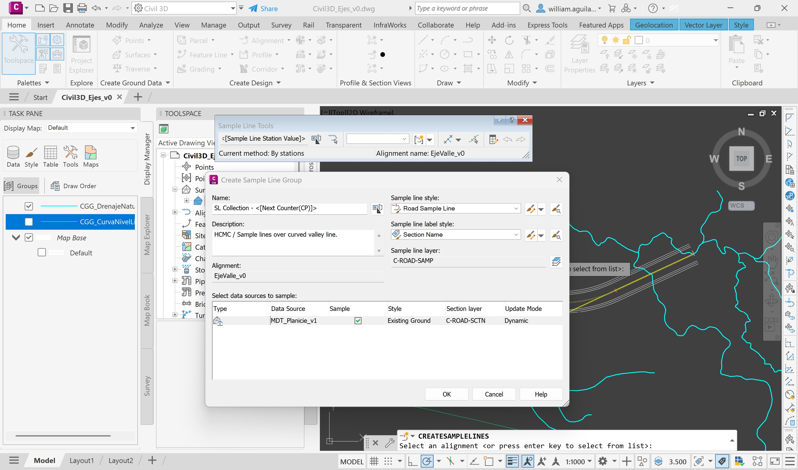

5. En la barra _Sample Line Tools_, seleccione la herramienta _By Range of Stations_

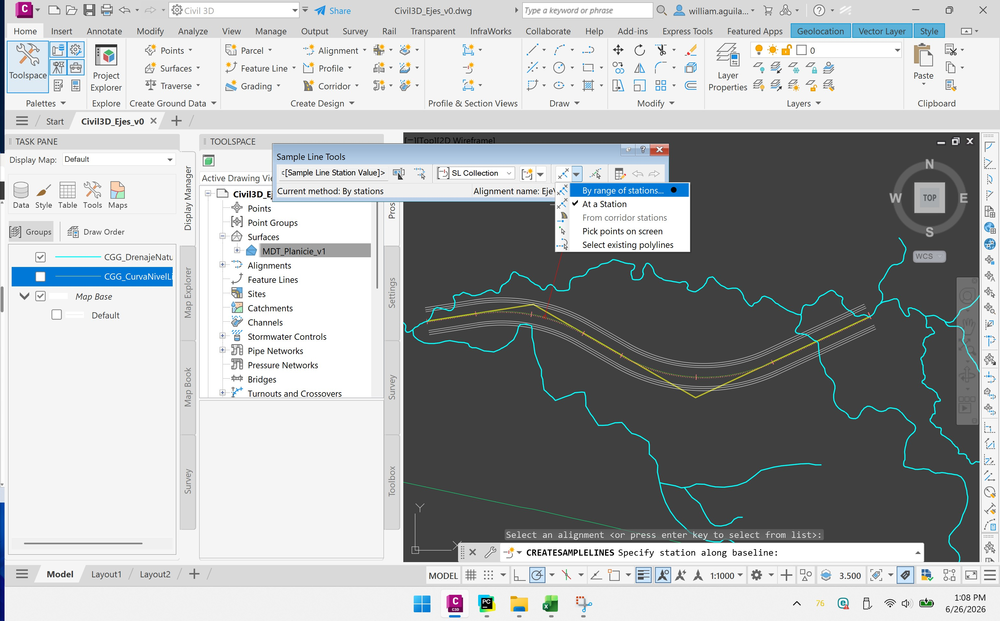

Establezca los siguientes parámetros:

* Left Swath Width / With = 128.689m (correspondiente a B’/2)
* Right Swath Width / With = 128.689m (correspondiente a B’/2)
* Sampling incrementos / Increment Along Tangents = 82.369 (correspondiente a Lm/4)
* Sampling incrementos / Increment Along Curves = 82.369 (correspondiente a Lm/4)
* Sampling incrementos / Increment Along Spirals = 82.369 (correspondiente a Lm/4)
* Additional Sample Controls / At Range Start: True (para crear una línea de muestreo al inicio del eje del valle)
* Additional Sample Controls / At Range End: True (para crear una línea de muestreo al final del eje del valle)

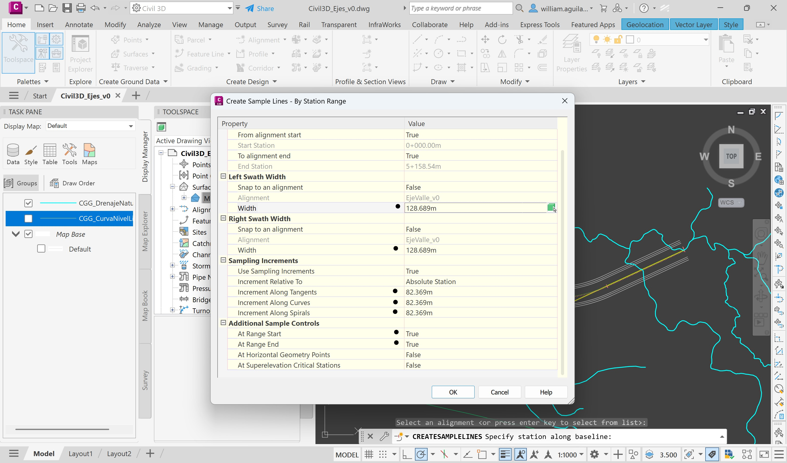

6. Para facilitar el trazado del alineamiento sinuoso del cauce dominante, seleccione y oculte con el menú contextual y la opción _Isolate Objects / Hide Selected Objects_, las etiquetas de abscisado de las líneas de muestreo, las etiquetas de abscisado del eje del valle y los ejes offset del valle.

> Los objetos aislados u ocultos pueden se pueden volver a visualizar dando clic en el botón _Unisolate Objects / End Object Isoletion_ de la barra de estado.

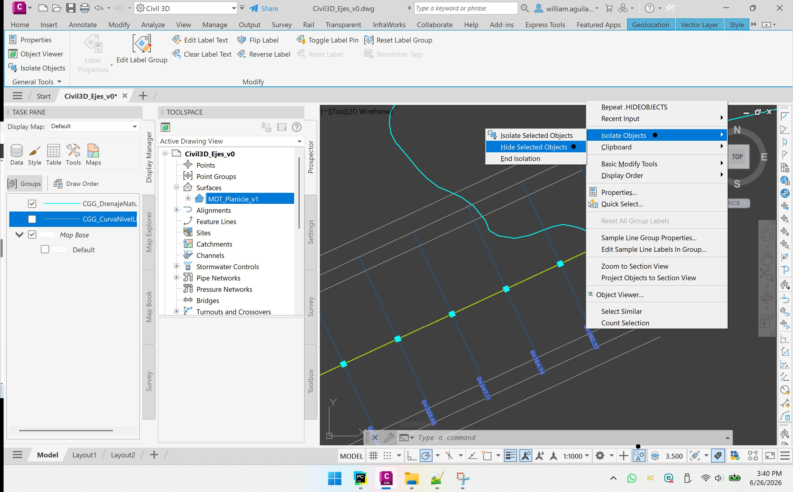

7. Cree el alineamiento del cauce sinuoso con la opción dibujar alineamiento: _Home/ Create Desing/ Alignment/ Alignment Creation Tools_, definir el nombre de eje como _EjeSinuoso_ y establezca un radio de curvatura de 82 metros (obtenido del diseño sinuoso).

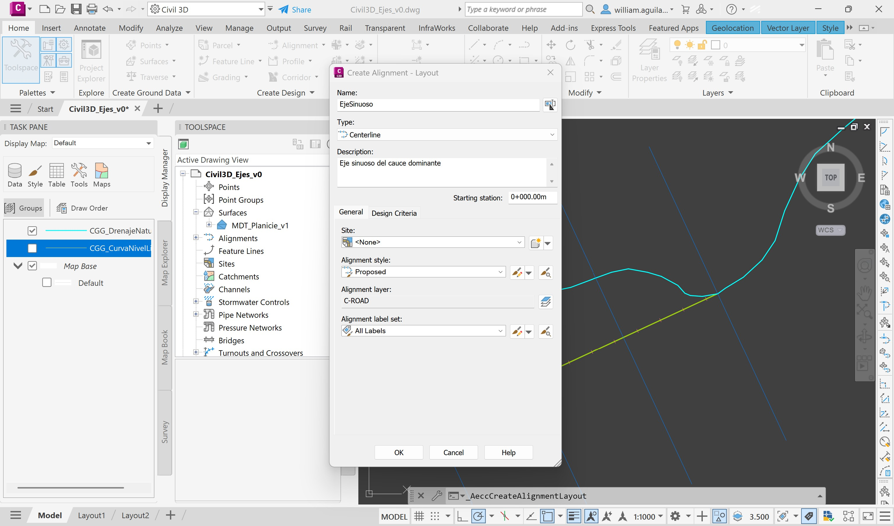

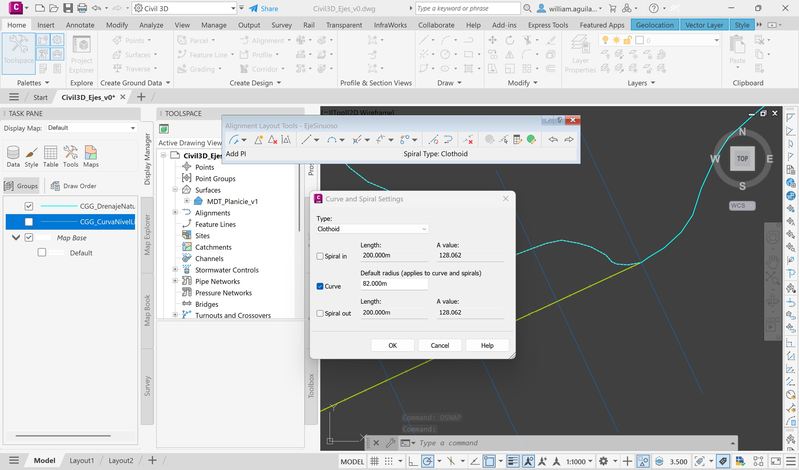

Para facilitar el empalme, ajuste las opciones de encajado u OSNAP (Tecla F3) a punto final y nodo.

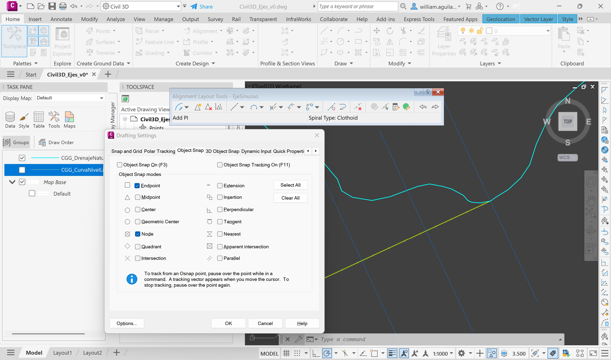

8. Inicie el trazado al inicio del valle ajustando la curva de empalme del cauce natural con el eje del valle.

> Con los parámetros de radio y tipo de curva, seleccionar el dibujo de eje con curvas. El dibujo de cada onda se debe realizar pariendo desde el punto inicial y se debe restringir el punto PI de curva en el extremo de la línea definida por _B’_ hasta completar el dibujo sobre todo el eje del valle.
> 
> Es importante verificar que no existan puntos _PI_ intermedios entre curvas, Civil agrega automáticamente puntos PI en cada punto en el que hacemos clic, podríamos solamente dibujar las curvas entre los extremos de las líneas (sample lines), sin embargo, es recomendable seguir el eje del valle lo mejor posible, por esta razón se recomienda siempre hacer clic en puntos intermedios que estén sobre el eje curvo del valle y luego eliminar los _PI_ sobrantes.

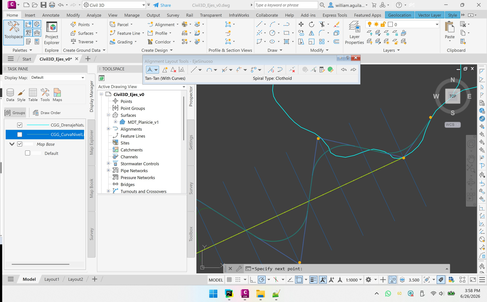

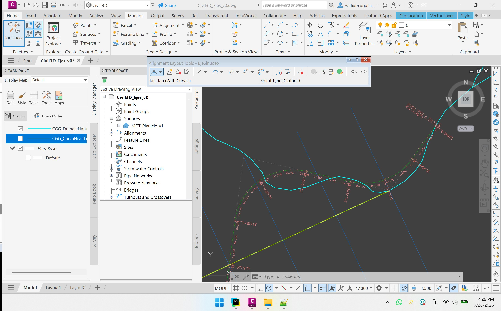

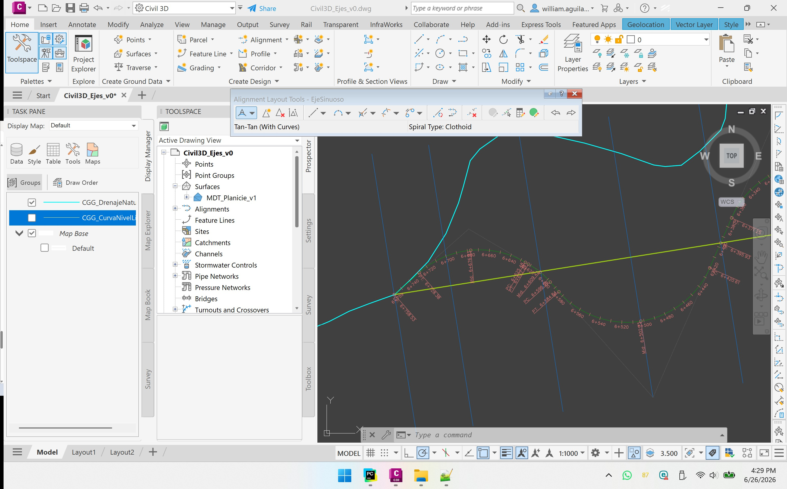

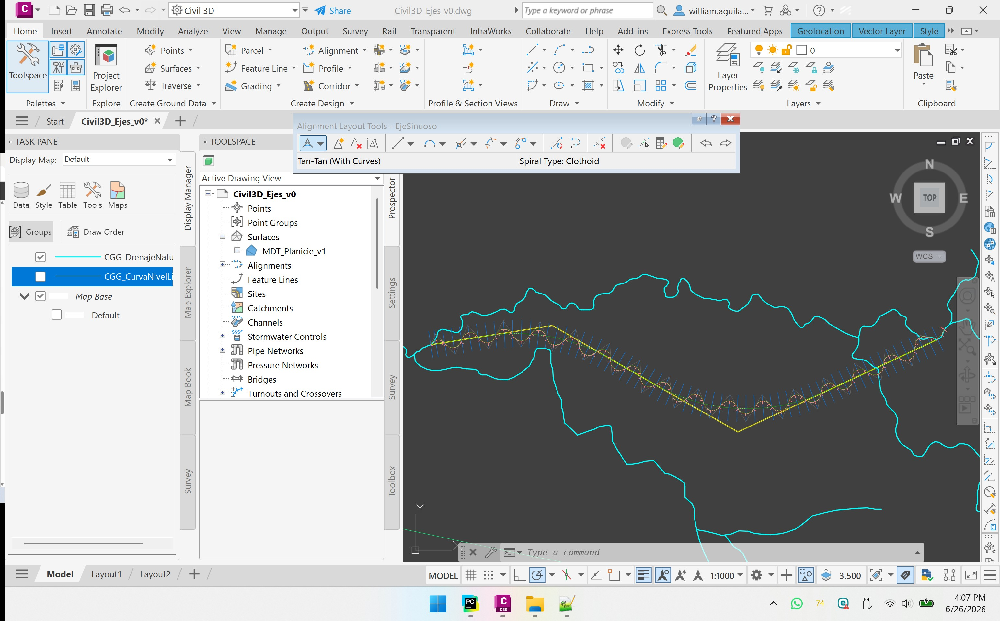

9. Cree las líneas paralelas u offsets al eje del cauce dominante correspondientes a las bases y coronas de talud. Tener en cuenta que el diseño de la sección compuesta realizado en la actividad [M01A03](../M01A03/Readme.md), correspondiente al _Diseño por Método de la Fuerza Tractiva (Shields d50) en HEC-RAS_. Para facilitar la visualización, oculte o aisle los rótulos del eje sinuoso y las líneas de muestreo (para seleccionar las líneas utilice el menú contextual y la opción _Select Similar_).

> La metodología de diseño se basa en un eje sinuoso al rededor de un eje recto de valle, sin embargo, el eje del valle tiene su propia sinuosidad (es un eje curvo), es decir, su alineamiento curvo no permite que las ondas sinuosas se distribuyan uniformemente sin traslapos, entonces, se deben corregir las curvas para que todos los meandros se localicen dentro del valle. Se deben agregar los ejes Offset de la sección del cauce principal para verificar que el cauce principal quede localizado dentro del valle y mover los distintos _PI_ necesarios para cumplir este criterio.

* Líneas base de talud en cauce dominante a 40 / 2 = 20 metros
* Líneas corona interna en cauce dominante a 82 / 2 = 41 metros

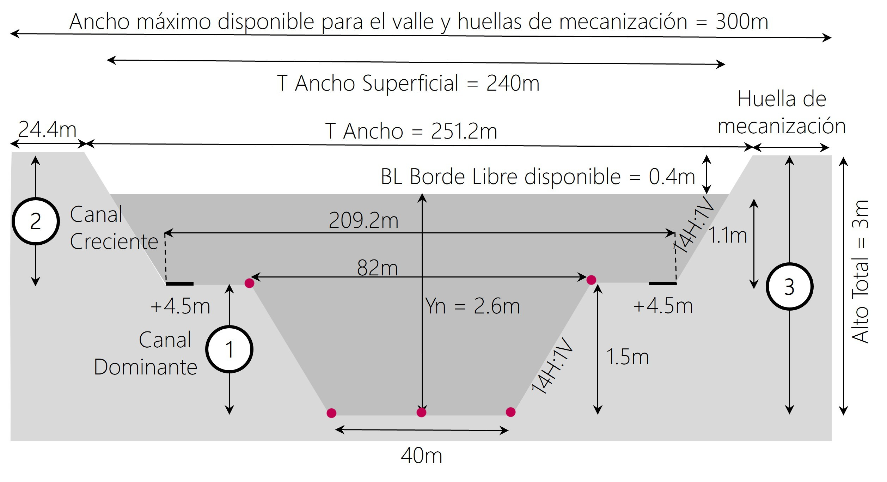

Seleccionar la herramienta _Home/ Create Desing/ Alignment/ Create Offset Aligment_

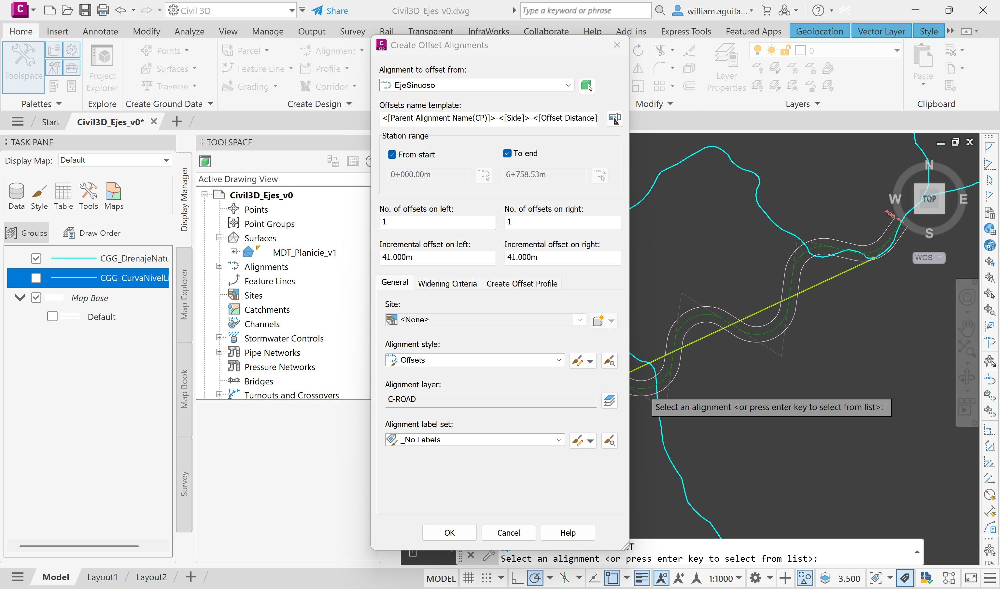

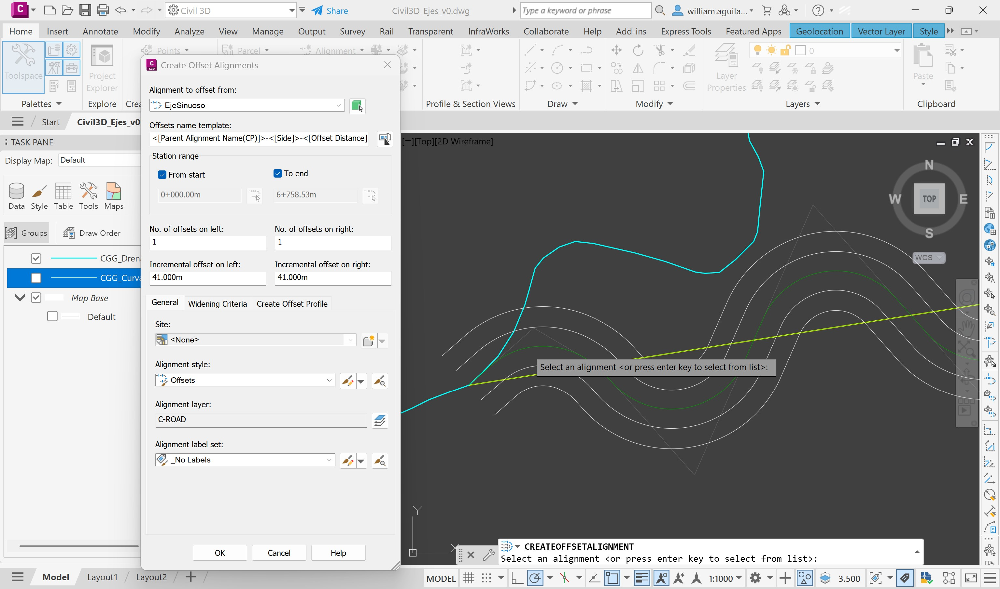

10. Utilizando el botón _Unisole Objects / End Object Isolation de cada curva, es necesario trazar un offset a la línea de base del valle a la distancia de prevención de coalineación establecida en el diseño, correspondiente a 4.5 metros. Una vez trazadas, desde las propiedades de las líneas, cambie el tipo de línea por trazos discontínuos. Con el comando **LTSCALE**, ajuste la escala de visualización de líneas a 10.

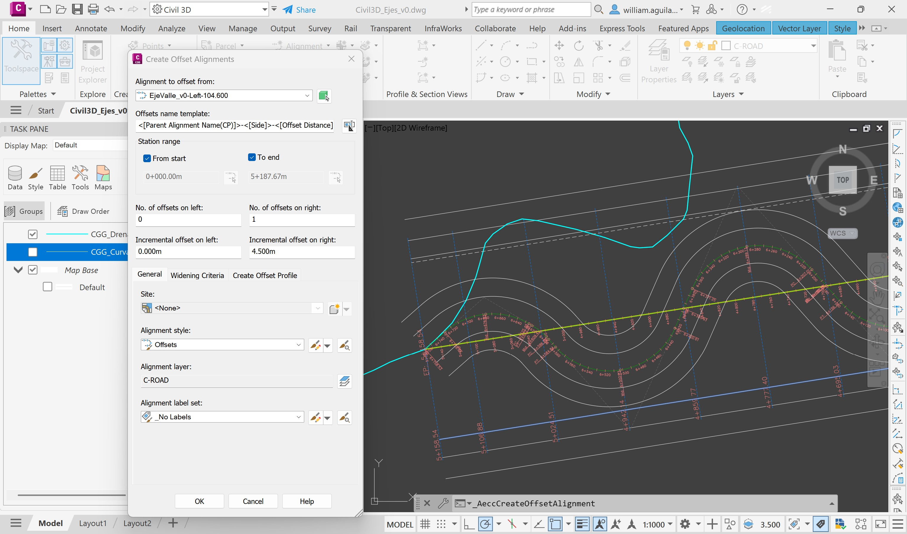

11. Verifique cada curva y ajuste los puntos de control de cambio de curvatura del eje sinuoso del cauce dominante, para que el offset de la corona no se cruce con las líneas offset correspondientes a la huella de mecanización.

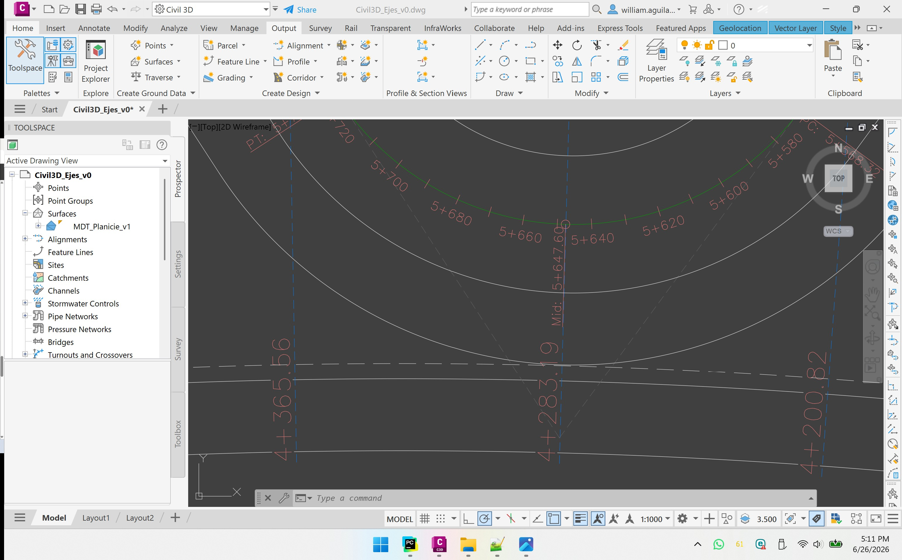

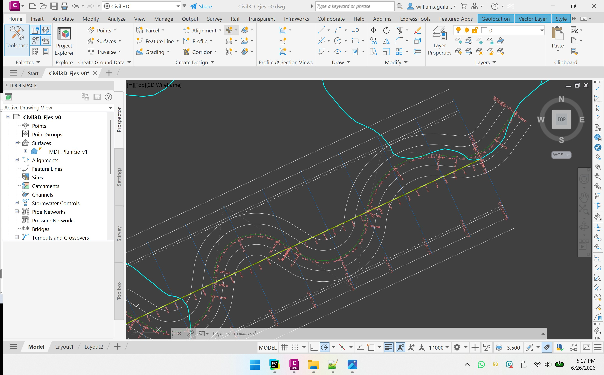

## Actividades de proyecto (👥 grupal opcional no calificable, 👤individual requerido) :triangular_ruler:

Utilizando la [plantilla suministrada](../../file/report/HCMC_PlantillaInformeTecnico.docx), cree un informe técnico mostrando las actividades desarrolladas en el orden presentado en esta actividad, junto con los análisis y recomendaciones realizadas, convierta a Adobe Acrobat (.pdf) y guarde en la carpeta _/report_ del repositorio de datos del proyecto; nombre el archivo con el código de la actividad agregando al final la fecha de control documental en formato aaaammdd (p. ej. M02A01_20250531.pdf).

En la siguiente tabla se listan las actividades que deben ser desarrolladas y documentadas por cada estudiante o grupo de proyecto.

| Actividad | Alcance                                                                                                                                                                                                                                                                                                                                                                                                                                                                                                                                                                                                                                                                                                                                                                                                                        |
|:----------|:-------------------------------------------------------------------------------------------------------------------------------------------------------------------------------------------------------------------------------------------------------------------------------------------------------------------------------------------------------------------------------------------------------------------------------------------------------------------------------------------------------------------------------------------------------------------------------------------------------------------------------------------------------------------------------------------------------------------------------------------------------------------------------------------------------------------------------|
| M02A03    | 👤👥 En Autodesk Civil 3D, crear los Sample Lines, dibujar el cauce sinuoso, trazar las líneas paralelas u offsets (ver Nota 3) y verificar que los ejes de corona no se crucen con la línea de aferencia de la base del valle, nombrar como _[/file/cad/civil/Civil3D_Ejes_v0.dwg](../../file/cad/civil/Civil3D_Ejes_v0.zip)_.  En el informe técnico, incluya capturas de pantalla de las diferentes herramientas Autodesk Civil 3D utilizadas y los alineamientos obtenidos, también, capturas de pantalla de las curvas a las cuales fue necesario ajustar su radio de curvatura para prevenir la coalineación de taludes.  Indicar las consideraciones generales utilizadas para el empalme de las ondas de inicio y entrega con los cauces naturales y con cauces laterales, incluir capturas de pantalla.      | 
| M02A03    | 👥 En una tabla y al final del informe de avance de esta entrega, indique el detalle de las actividades realizadas por cada integrante de su grupo; utilice las siguientes columnas: `Nombre del integrante`, `Actividades realizadas`, `Tiempo dedicado en horas` (si presenta la entrega individualmente, no es necesaria la presentación de esta tabla).  👤 Para actividades que no requieren del desarrollo de elementos de avance, indicar si realizo la lectura de la guía de clase y las lecturas indicadas al inicio en los requerimientos.                                                                                                                                                                                                                                                                           | 

**_Nota 1_**: para la revisión del proyecto final, guarde los libros cálculo de Microsoft Excel y los archivos generados en esta actividad, en las localizaciones indicadas en cada numeral.

**_Nota 2_**: una vez el instructor realice la revisión y el estudiante presente las correcciones o ajustes solicitados, será necesario cargar una nueva versión de los archivos en el repositorio del proyecto, incluyendo o actualizando al final del nombre del archivo, la fecha de presentación en formato aaaammdd y manteniendo las versiones anteriores presentadas.

**_Nota 3_**: sí en el trazado del cauce sinuoso no se pueden resolver los offset en Autodesk Civil 3D, será necesario, por ejemplo, modificar el diseño cambiando el radio de curvatura de las ondas o modificando el diseño de la sección compuesta aumentando la altura del cauce dominante para que el ancho superficial a corona sea menor. Opcionalmente y por tratarse de un ejercicio académico, podrá reducir la inclinación o relación de talud y reducir las franjas de las huellas de mecanización en la zona superior del valle para tener de esta forma un ancho mayor para el trazado.

## Referencias

* https://www.autodesk.com/education/free-software/autocad
* https://www.autodesk.com/education/free-software/civil-3d

##

_R.HCMC es de uso libre para fines académicos, conoce nuestra licencia, cláusulas, condiciones de uso y como referenciar los contenidos publicados en este repositorio, dando [clic aquí](../../LICENSE.md)._

_¡Encontraste útil este repositorio!, apoya su difusión marcando este repositorio con una ⭐ o síguenos dando clic en el botón Follow de [rcfdtools](https://github.com/rcfdtools) en GitHub._

| [◄ Anterior](../M02A02/Readme.md) | [:house: Inicio](../../README.md) | [:beginner: Ayuda / Colabora](https://github.com/rcfdtools/R.HCMC/discussions/1) | [Siguiente ►](../M02A04/Readme.md) |
|---------------------------------------------------|-----------------------------------|----------------------------------------------------------------------------------|---------------------------------------------------|

[^1]: 