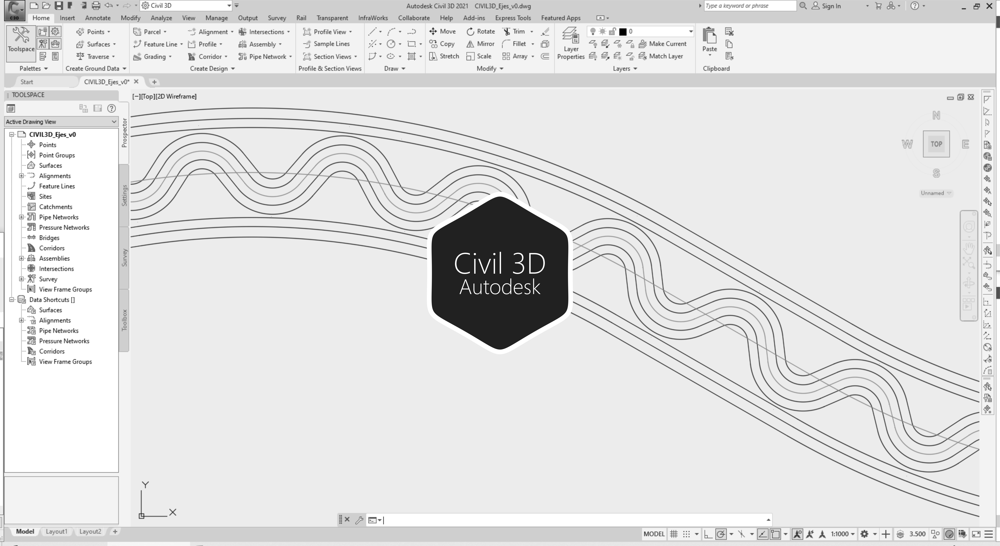

# 2.3. Trazado de clotoides para el cauce sinuoso
Keywords: `aligment` `curve-spiral` `clothoid` `offset-aligment` `autodesk-civil-3d` `autodesk-autocad` `surface` `M02A03`

Trazar el alineamiento del cauce dominante sinuoso teniendo en cuenta los parámetros geométricos de la sinuosidad definida en el diseño. Dibujar los ejes correspondientes a los taludes del cauce principal, teniendo en cuenta las consideraciones planteadas en el diseño en cuanto a no linealidad de taludes y pasos para la mecanización. Ajustar el diseño sinuoso al ancho disponible del valle. 

## Objetivos

* Trazar los ejes requeridos para el corte del cauce principal sobre terreno natural.
* Trazar los ejes requeridos para el corte de cauces laterales sobre terreno natural.

## Requerimientos

Archivos, actividades previas, lecturas y herramientas requeridas para el desarrollo de esta actividad:

| Requerimiento                                                                            | Descripción                                                                                                         |
|:-----------------------------------------------------------------------------------------|:--------------------------------------------------------------------------------------------------------------------|
| [:toolbox:Herramienta](https://qgis.org/)                                                | QGIS 3.42 o superior.                                                                                               |
| [:toolbox:Herramienta](https://www.autodesk.com/products/civil-3d)                       | Autodesk Civil 3D 2026 (english version) o superior.                                                                |
| [:round_pushpin:Civil3D_EjeValle_v0.dwg](../../file/cad/civil/Civil3D_EjeValle_v0.zip)   | Archivo Autodesk Civil 3D con: eje recto del valle, clotoide eje suavizado del valle y offsets de taludes de valle. |

> Para los diferentes avances de proyecto, es necesario guardar y publicar las diferentes versiones generadas del (los) libro (s) de Microsoft Excel y reportes o informes, agregando al final la fecha de control documental en formato aaaammdd, p. ej. _R.HydroTools.DisenoCaucesParametros.20250528.xlsx_.

## Procedimiento general

R.HCMC se encuentra en proceso de actualización, consulte la versión anterior en el enlace [M02A03.pdf](M02A03.pdf).

## Actividades de proyecto :triangular_ruler:

Utilizando la [plantilla suministrada](../../file/report/R.HCMC.PlantillaSoporteDesarrollo.docx), cree un documento soporte mostrando las actividades desarrolladas en el orden presentado en esta actividad, junto con los análisis y recomendaciones realizadas, convierta a Adobe Acrobat (.pdf) y guarde en la carpeta _/report_ del repositorio de datos del proyecto; nombre el archivo con el código de la actividad agregando al final la fecha de control documental en formato aaaammdd (p. ej. M02A01_20250531.pdf).

En la siguiente tabla se listan las actividades que deben ser desarrolladas y documentadas por cada estudiante o grupo de proyecto.

| Actividad | Alcance                                                                                                                                                                                                                                                                                                                                                                                                                                                                                                                                                                                                                                                                                                                                                                                                                        |
|:----------|:-------------------------------------------------------------------------------------------------------------------------------------------------------------------------------------------------------------------------------------------------------------------------------------------------------------------------------------------------------------------------------------------------------------------------------------------------------------------------------------------------------------------------------------------------------------------------------------------------------------------------------------------------------------------------------------------------------------------------------------------------------------------------------------------------------------------------------|
| M02A02    | En Autodesk Civil 3D, crear los Sample Lines, dibujar el cauce sinuoso, trazar las líneas paralelas u offsets (ver Nota 3) y verificar que los ejes de corona no se crucen con la línea de aferencia de la base del valle, nombrar como _[/file/cad/civil/Civil3D_Ejes_v0.dwg](../../file/cad/civil/Civil3D_Ejes_v0.zip)_.  En el documento soporte, incluya capturas de pantalla de las diferentes herramientas Autodesk Civil 3D utilizadas y los alineamientos obtenidos, también, capturas de pantalla de las curvas a las cuales fue necesario ajustar su radio de curvatura para prevenir la coalineación de taludes.  Indicar las consideraciones generales utilizadas para el empalme de las ondas de inicio y entrega con los cauces naturales y con los cauces laterales, incluir capturas de pantalla.  | 
| M02A02    | En una tabla y al final del informe de avance de esta entrega, indique el detalle de las actividades realizadas por cada integrante de su grupo; utilice las siguientes columnas: `Nombre del integrante`, `Actividades realizadas`, `Tiempo dedicado en horas` (si presenta la entrega individualmente, no es necesaria la presentación de esta tabla).  Para actividades que no requieren del desarrollo de elementos de avance, indicar si realizo la lectura de la guía de clase y las lecturas indicadas al inicio en los requerimientos.                                                                                                                                                                                                                                                                           | 

> Nota 1: para la revisión del proyecto final, guarde los libros cálculo de Microsoft Excel y los archivos generados en esta actividad, en las localizaciones indicadas en cada numeral.
>
> Nota 2: una vez el instructor realice la revisión y el estudiante presente las correcciones o ajustes solicitados, será necesario cargar una nueva versión de los archivos en el repositorio del proyecto, incluyendo o actualizando al final del nombre del archivo, la fecha de presentación en formato aaaammdd y manteniendo las versiones anteriores presentadas.
>
> Nota 3: sí en el trazado del cauce sinuoso no se pueden resolver los offset en Autodesk Civil 3D, será necesario, por ejemplo, modificar el diseño cambiando el radio de curvatura de las ondas o modificando el diseño de la sección compuesta aumentando la altura del cauce dominante para que el ancho superficial a corona sea menor. Opcionalmente y por tratarse de un ejercicio académico, podrá reducir la inclinación o relación de talud y reducir las franjas de las huellas de mecanización en la zona superior del valle para tener de esta forma un ancho mayor para el trazado.

## Referencias

* https://www.autodesk.com/education/free-software/autocad
* https://www.autodesk.com/education/free-software/civil-3d

## Control de versiones

| Versión    | Descripción        | Autor                                      | Horas |
|------------|:-------------------|--------------------------------------------|:-----:|
| 2025.07.30 | Migración a GitHub | [rcfdtools](https://github.com/rcfdtools)  |   2   |
| 2014.01.14 | Versión inicial.   | [rcfdtools](https://github.com/rcfdtools)  |  16   |

##

_R.HCMC es de uso libre para fines académicos, conoce nuestra licencia, cláusulas, condiciones de uso y como referenciar los contenidos publicados en este repositorio, dando [clic aquí](../../LICENSE.md)._

_¡Encontraste útil este repositorio!, apoya su difusión marcando este repositorio con una ⭐ o síguenos dando clic en el botón Follow de [rcfdtools](https://github.com/rcfdtools) en GitHub._

| [:arrow_backward: Anterior](../M02A02/Readme.md) | [:house: Inicio](../../README.md) | [:beginner: Ayuda / Colabora](https://github.com/rcfdtools/R.HCMC/discussions/99999) | [Siguiente :arrow_forward:](../M02A04/Readme.md) |
|---------------------------------------------------|-----------------------------------|--------------------------------------------------------------------------------------|---------------------------------------------------|

[^1]: 