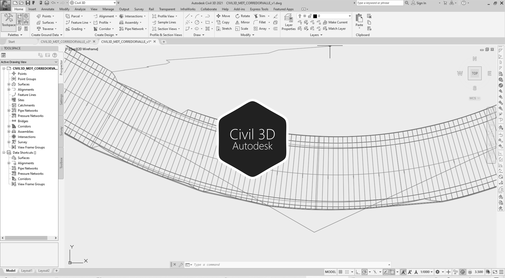

# 2.4. Trazado del corredor para el valle
Keywords: `aligment` `curve-spiral` `clothoid` `offset-aligment` `autodesk-civil-3d` `autodesk-autocad` `surface` `M02A03`

Utilizando Autodesk Civil 3D se dibujan las secciones transversales para el corte y/o relleno del valle sobre el modelo de terreno natural.

## Objetivos

* Crear las secciones de corte para la sección definida del valle de creciente.
* Crear las leyes de corte y relleno para la sección del Valle.
* Crear el corredor para el valle, cortando el MDT definido para la planicie.

## Requerimientos

Archivos, actividades previas, lecturas y herramientas requeridas para el desarrollo de esta actividad:

| Requerimiento                                                                            | Descripción                                                                                                                                                           |
|:-----------------------------------------------------------------------------------------|:----------------------------------------------------------------------------------------------------------------------------------------------------------------------|
| [:toolbox:Herramienta](https://qgis.org/)                                                | QGIS 3.42 o superior.                                                                                                                                                 |
| [:toolbox:Herramienta](https://www.autodesk.com/products/civil-3d)                       | Autodesk Civil 3D 2026 (english version) o superior.                                                                                                                  |
| [:round_pushpin:Civil3D_EjeValle_v0.dwg](../../file/cad/civil/Civil3D_EjeValle_v0.zip)   | Archivo Autodesk Civil 3D con: eje recto del valle, clotoide eje suavizado del valle y offsets de taludes de valle. |

> Para los diferentes avances de proyecto, es necesario guardar y publicar las diferentes versiones generadas del (los) libro (s) de Microsoft Excel y reportes o informes, agregando al final la fecha de control documental en formato aaaammdd, p. ej. _R.HydroTools.DisenoCaucesParametros.20250528.xlsx_.

## Procedimiento general

R.HCMC se encuentra en proceso de actualización, consulte la versión anterior en el enlace [M02A04.pdf](M02A04.pdf).

## Actividades de proyecto :triangular_ruler:

Utilizando la [plantilla suministrada](../../file/report/R.HCMC.PlantillaSoporteDesarrollo.docx), cree un documento soporte mostrando las actividades desarrolladas en el orden presentado en esta actividad, junto con los análisis y recomendaciones realizadas, convierta a Adobe Acrobat (.pdf) y guarde en la carpeta _/report_ del repositorio de datos del proyecto; nombre el archivo con el código de la actividad agregando al final la fecha de control documental en formato aaaammdd (p. ej. M02A01_20250531.pdf).

En la siguiente tabla se listan las actividades que deben ser desarrolladas y documentadas por cada estudiante o grupo de proyecto.

| Actividad | Alcance                                                                                                                                                                                                                                                                                                                                                                                                                                                                                                                                                                                                                                                                                                                                                                                                                                                                                                                                                                                                                                                                                            |
|:----------|:---------------------------------------------------------------------------------------------------------------------------------------------------------------------------------------------------------------------------------------------------------------------------------------------------------------------------------------------------------------------------------------------------------------------------------------------------------------------------------------------------------------------------------------------------------------------------------------------------------------------------------------------------------------------------------------------------------------------------------------------------------------------------------------------------------------------------------------------------------------------------------------------------------------------------------------------------------------------------------------------------------------------------------------------------------------------------------------------------|
| M02A04    | Crear copia del archivo del modelo de terreno Autodesk Civil 3D _[/file/cad/civil/Civil3D_MDT_Planicie_v1.dwg](../../file/cad/civil/Civil3D_MDT_Planicie_v1.zip)_ y nombrar como _[/file/cad/civil/Civil3D_MDT_CorredorValle_v1.dwg](../../file/cad/civil/Civil3D_MDT_CorredorValle_v1.zip)_.  Dentro del archivo _Civil3D_MDT_CorredorValle_v1.dwg_, copiar los vectores de alineamientos definidos para el valle suavizado en [/file/cad/civil/Civil3D_EjeValle_v0.dwg](../../file/cad/civil/Civil3D_EjeValle_v0.zip), generar el perfil de terreno sobre el eje del valle, trazar el fondo del valle del diseño hidráulico, dibujar la sección definida para el valle con sus respectivos ensambles y leyes de corte, generar el corredor y generar la superficie del valle. Ver Nota 3 y Nota 4.  En el documento soporte, incluya capturas de pantalla de las diferentes herramientas Autodesk Civil 3D utilizadas y la superficie del valle obtenida en al menos 3 tipos de visualización (2D Wireframe, 3D Wireframe, Conceptual, Realistic, Shaded, Shaded with edges, X-Ray). | 
| M02A04   | En una tabla y al final del informe de avance de esta entrega, indique el detalle de las actividades realizadas por cada integrante de su grupo; utilice las siguientes columnas: `Nombre del integrante`, `Actividades realizadas`, `Tiempo dedicado en horas` (si presenta la entrega individualmente, no es necesaria la presentación de esta tabla).  Para actividades que no requieren del desarrollo de elementos de avance, indicar si realizo la lectura de la guía de clase y las lecturas indicadas al inicio en los requerimientos.                                                                                                                                                                                                                                                                                                                                                                                                                                                                                                                                               | 

> Nota 1: para la revisión del proyecto final, guarde los libros cálculo de Microsoft Excel y los archivos generados en esta actividad, en las localizaciones indicadas en cada numeral.
>
> Nota 2: una vez el instructor realice la revisión y el estudiante presente las correcciones o ajustes solicitados, será necesario cargar una nueva versión de los archivos en el repositorio del proyecto, incluyendo o actualizando al final del nombre del archivo, la fecha de presentación en formato aaaammdd y manteniendo las versiones anteriores presentadas.
>
> Nota 3: en caso de que el proyecto lo requiera, deberá considerar la condición de protección de la operación minera por realce de diques en el lado próximo a la explotación, por lo que la sección transversal y cota de corona deberá ser ajustada.
>
> Nota 4: complementariamente y en otro archivo p. ej., Civil3D_MDT_CorredorValleRio_v0.dwg, puede copiar los vectores de alineamientos definidos para el valle suavizado en Civil3D_EjeValle_v0.dwg, generar el perfil de terreno sobre el eje del valle, trazar el fondo del cauce dominante del diseño hidráulico, dibujar la sección definida para la sección compuesta (valle y dominante) con sus respectivos ensambles y leyes de corte, generar el corredor y generar la superficie del valle. El objetivo de realizar el corte de la superficie con la sección compuesta, es crear una superficie que permita modelar hidráulicamente el cauce sin tener en cuenta la sinuosidad, para luego comparar con los resultados obtenidos del cauce sinuoso, donde podrá encontrar que para las mismas condiciones de frontera, la velocidad del flujo será mayor debido a que la pendiente del valle es mayor a la pendiente del cauce sinuoso.

## Referencias

* https://www.autodesk.com/education/free-software/autocad
* https://www.autodesk.com/education/free-software/civil-3d

## Control de versiones

| Versión    | Descripción        | Autor                                     | Horas |
|------------|:-------------------|-------------------------------------------|:-----:|
| 2025.07.30 | Migración a GitHub | [rcfdtools](https://github.com/rcfdtools) |   2   |
| 2014.01.14 | Versión inicial.   | [frankv13](https://github.com/frankv13)   |  16   |

##

_R.HCMC es de uso libre para fines académicos, conoce nuestra licencia, cláusulas, condiciones de uso y como referenciar los contenidos publicados en este repositorio, dando [clic aquí](../../LICENSE.md)._

_¡Encontraste útil este repositorio!, apoya su difusión marcando este repositorio con una ⭐ o síguenos dando clic en el botón Follow de [rcfdtools](https://github.com/rcfdtools) en GitHub._

| [:arrow_backward: Anterior](../M02A03/Readme.md) | [:house: Inicio](../../README.md) | [:beginner: Ayuda / Colabora](https://github.com/rcfdtools/R.HCMC/discussions/99999) | [Siguiente :arrow_forward:](../M02A05/Readme.md) |
|---------------------------------------------------|-----------------------------------|--------------------------------------------------------------------------------------|---------------------------------------------------|

[^1]: 