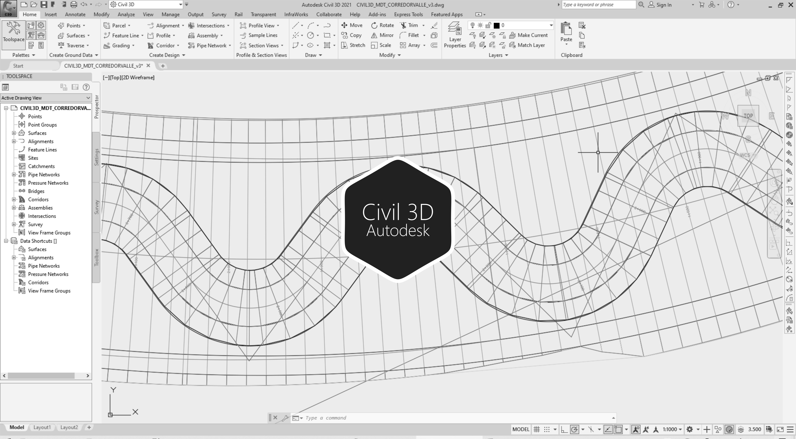

# 2.5. Modelo de terreno con la geometría del canal sinuoso diseñado y cauces laterales
Keywords: `aligment` `curve-spiral` `clothoid` `offset-aligment` `autodesk-civil-3d` `autodesk-autocad` `surface` `m02a05`

Utilizando Autodesk Civil 3D se dibujan las secciones transversales para el corte y/o relleno del cauce dominante sobre el modelo de terreno creado para el corredor del valle.

## Objetivos

* Crear las secciones de corte para la sección definida del cauce sinuoso.
* Crear las leyes de corte y relleno para la sección del cauce sinuoso.
* Crear el corredor para el cauce sinuoso.
* Crear el modelo de terreno combinado valle y cauce sinuoso.

## Requerimientos

Archivos, actividades previas, lecturas y herramientas requeridas para el desarrollo de esta actividad:

| Requerimiento                                                                                                                                              | Descripción                                                                                                                                                                                                                  |
|:-----------------------------------------------------------------------------------------------------------------------------------------------------------|:-----------------------------------------------------------------------------------------------------------------------------------------------------------------------------------------------------------------------------|
| [🧰Herramienta](https://qgis.org/)                                                                                                                  | QGIS 3.42 o superior.                                                                                                                                                                                                        |
| [🧰Herramienta](https://www.autodesk.com/products/civil-3d)                                                                                         | Autodesk Civil 3D 2026 (english version) o superior.                                                                                                                                                                         |
| [📌Civil3D_Ejes_v0.dwg](../../file/cad/civil/Civil3D_Ejes_v0.zip)                                                                             | Archivo Autodesk Civil 3D con: eje recto del valle, clotoide eje suavizado del valle, offsets de taludes de valle, sample lines, cauce sinuoso, offsets cauce sinuoso.                                                       |
| [📌Civil3D_MDT_CorredorValle_v1.dwg](../../file/cad/civil/Civil3D_MDT_CorredorValle_v1.zip)                                                   | Archivo Autodesk Civil 3D con: DTM planicie y corredor del valle suavizado con relleno lateral de corte a -6:1, [v2](2) con relleno lateral a -3:1.                                                                          |
| [🎓Actividad 1.13. Diseño geométrico e hidráulico vertical del cauce principal de desviación y cauces laterales menores](../M01A13/Readme.md)  | Dimensionar la sección hidráulica dominante y de creciente del cauce principal y de los cauces laterales menores, verificando a flujo uniforme la capacidad hidráulica de las sección compuesta y el borde libre requerido.  |

> Para los diferentes avances de proyecto, es necesario guardar y publicar las diferentes versiones generadas del (los) libro (s) de Microsoft Excel y reportes o informes, agregando al final la fecha de control documental en formato aaaammdd, p. ej. _R.HydroTools.DisenoCaucesParametros.20250528.xlsx_.

## Procedimiento general

R.HCMC se encuentra en proceso de actualización, consulte la versión anterior en el enlace [M02A05.pdf](M02A05.pdf).

## Actividades de proyecto (👥 grupal opcional no calificable, 👤individual requerido) :triangular_ruler:

Utilizando la [plantilla suministrada](../../file/report/HCMC_PlantillaInformeTecnico.docx), cree un informe técnico mostrando las actividades desarrolladas en el orden presentado en esta actividad, junto con los análisis y recomendaciones realizadas, convierta a Adobe Acrobat (.pdf) y guarde en la carpeta _/report_ del repositorio de datos del proyecto; nombre el archivo con el código de la actividad agregando al final la fecha de control documental en formato aaaammdd (p. ej. M02A01_20250531.pdf).

En la siguiente tabla se listan las actividades que deben ser desarrolladas y documentadas por cada estudiante o grupo de proyecto.

| Actividad | Alcance                                                                                                                                                                                                                                                                                                                                                                                                                                                                                                                                                                                                                                                                                                                                                                                                                                                                                                                                                                                                                                                                                                                                                                                                                                                                                                                                                                                    |
|:----------|:-------------------------------------------------------------------------------------------------------------------------------------------------------------------------------------------------------------------------------------------------------------------------------------------------------------------------------------------------------------------------------------------------------------------------------------------------------------------------------------------------------------------------------------------------------------------------------------------------------------------------------------------------------------------------------------------------------------------------------------------------------------------------------------------------------------------------------------------------------------------------------------------------------------------------------------------------------------------------------------------------------------------------------------------------------------------------------------------------------------------------------------------------------------------------------------------------------------------------------------------------------------------------------------------------------------------------------------------------------------------------------------------|
| M02A05    | 👤👥 Crear una copia del archivo _[Civil3D_MDT_CorredorValle_v1.dwg](../../file/cad/civil/Civil3D_MDT_CorredorValle_v1.zip)_ donde se definió el corredor para el Valle suavizado y guardar como _[/file/cad/civil/Civil3D_MDT_CorredorValleRio_v1.dwg](../../file/cad/civil/Civil3D_MDT_CorredorValleRio_v1.zip)_.  Dentro del archivo _[Civil3D_MDT_CorredorValleRio_v1.dwg](../../file/cad/civil/Civil3D_MDT_CorredorValleRio_v1.zip)_, copiar los vectores de alineamientos del eje sinuoso definidos en _[Civil3D_Ejes_v0.dwg](../../file/cad/civil/Civil3D_Ejes_v0.zip)_, generar el perfil de terreno sobre valle a partir del eje del cauce sinuoso, trazar el fondo del cauce sinuoso obtenido del diseño hidráulico, dibujar la sección definida para el cauce sinuoso con sus respectivos ensambles y leyes de corte, generar el corredor y generar la superficie del cauce sinuoso. Realizar el corte la superficie del valle y cauce sinuoso a partir de los alineamientos de los cauces laterales y su entrega. Ver Nota 3.  En el informe técnico, incluya capturas de pantalla de las diferentes herramientas Civil 3D utilizadas y la superficie del valle y cauce sinuoso obtenida en al menos 3 tipos de visualización (2D Wireframe, 3D Wireframe, Conceptual, Realistic, Shaded, Shaded with edges, X-Ray). |  
| M02A05    | 👥 En una tabla y al final del informe de avance de esta entrega, indique el detalle de las actividades realizadas por cada integrante de su grupo; utilice las siguientes columnas: `Nombre del integrante`, `Actividades realizadas`, `Tiempo dedicado en horas` (si presenta la entrega individualmente, no es necesaria la presentación de esta tabla).  👤 Para actividades que no requieren del desarrollo de elementos de avance, indicar si realizo la lectura de la guía de clase y las lecturas indicadas al inicio en los requerimientos.                                                                                                                                                                                                                                                                                                                                                                                                                                                                                                                                                                                                                                                                                                                                                                                                                                       | 

**_Nota 1_**: para la revisión del proyecto final, guarde los libros cálculo de Microsoft Excel y los archivos generados en esta actividad, en las localizaciones indicadas en cada numeral.

**_Nota 2_**: una vez el instructor realice la revisión y el estudiante presente las correcciones o ajustes solicitados, será necesario cargar una nueva versión de los archivos en el repositorio del proyecto, incluyendo o actualizando al final del nombre del archivo, la fecha de presentación en formato aaaammdd y manteniendo las versiones anteriores presentadas.

**_Nota 3_**: en caso de que el proyecto lo requiera, deberá considerar modificar la superficie creada incluyendo los diques de encausamiento localizados al inicio del canal diseñado y los diques de protección en la zona de descarga. También se hace necesario considerar el trazado de diques de encausamiento en las zonas de entrega de cauces laterales hasta la cota de confinamiento hidráulico definida por la corona del valle en el cauce principal.

## Referencias

* https://www.autodesk.com/education/free-software/autocad
* https://www.autodesk.com/education/free-software/civil-3d

##

_R.HCMC es de uso libre para fines académicos, conoce nuestra licencia, cláusulas, condiciones de uso y como referenciar los contenidos publicados en este repositorio, dando [clic aquí](../../LICENSE.md)._

_¡Encontraste útil este repositorio!, apoya su difusión marcando este repositorio con una ⭐ o síguenos dando clic en el botón Follow de [rcfdtools](https://github.com/rcfdtools) en GitHub._

| [◄ Anterior](../M02A04/Readme.md) | [:house: Inicio](../../README.md) | [:beginner: Ayuda / Colabora](https://github.com/rcfdtools/R.HCMC/discussions/1) | [Siguiente ►](../M02A06/Readme.md) |
|---------------------------------------------------|-----------------------------------|----------------------------------------------------------------------------------|---------------------------------------------------|

[^1]: 