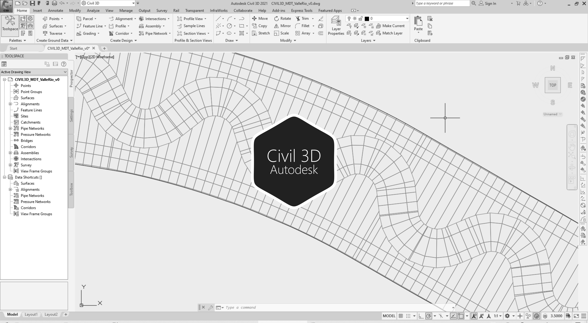

# 2.6. Modelo de terreno combinado (valle, cauce sinuoso diseñado y cauces laterales)
Keywords: `aligment` `curve-spiral` `clothoid` `offset-aligment` `autodesk-civil-3d` `autodesk-autocad` `surface` `m02a06`

Crear el modelo de terreno combinado para el canal, incluyendo el valle y el cauce sinuoso.

## Objetivos

* Integrar los modelos de terreno de los corredores del valle y el cauce sinuoso.
* Exportar el MDT a formato .dwg.

## Requerimientos

Archivos, actividades previas, lecturas y herramientas requeridas para el desarrollo de esta actividad:

| Requerimiento                                                                                                  | Descripción                                                                                                                                                     |
|:---------------------------------------------------------------------------------------------------------------|:----------------------------------------------------------------------------------------------------------------------------------------------------------------|
| [🧰Herramienta](https://qgis.org/)                                                                      | QGIS 3.42 o superior.                                                                                                                                           |
| [🧰Herramienta](https://www.autodesk.com/products/civil-3d)                                             | Autodesk Civil 3D 2026 (english version) o superior.                                                                                                            |
| [📌Civil3D_MDT_CorredorValle_v1.dwg](../../file/cad/civil/Civil3D_MDT_CorredorValle_v1.zip)       | Archivo Autodesk Civil 3D con: DTM planicie y corredor del valle suavizado con relleno lateral de corte a -6:1, [v2](2) con relleno lateral a -3:1.             |
| [📌Civil3D_MDT_CorredorValleRio_v1.dwg](../../file/cad/civil/Civil3D_MDT_CorredorValleRio_v1.zip) | Archivo Autodesk Civil 3D con: DTM planicie y corredor de valle suavizado con relleno lateral a -3:1, corredor cauce sinuoso sobre corredor de valle suavizado. |

> Para los diferentes avances de proyecto, es necesario guardar y publicar las diferentes versiones generadas del (los) libro (s) de Microsoft Excel y reportes o informes, agregando al final la fecha de control documental en formato aaaammdd, p. ej. _R.HydroTools.DisenoCaucesParametros.20250528.xlsx_.

## Procedimiento general

R.HCMC se encuentra en proceso de actualización, consulte la versión anterior en el enlace [M02A06.pdf](M02A06.pdf).

## Actividades de proyecto (👥 grupal opcional no calificable, 👤individual requerido) :triangular_ruler:

Utilizando la [plantilla suministrada](../../file/report/HCMC_PlantillaInformeTecnico.docx), cree un informe técnico mostrando las actividades desarrolladas en el orden presentado en esta actividad, junto con los análisis y recomendaciones realizadas, convierta a Adobe Acrobat (.pdf) y guarde en la carpeta _/report_ del repositorio de datos del proyecto; nombre el archivo con el código de la actividad agregando al final la fecha de control documental en formato aaaammdd (p. ej. M02A01_20250531.pdf).

En la siguiente tabla se listan las actividades que deben ser desarrolladas y documentadas por cada estudiante o grupo de proyecto.

| Actividad | Alcance                                                                                                                                                                                                                                                                                                                                                                                                                                                                                                                                                                                                                                                                                                                                                                                                                                                                                                                                                                                                                                                                                                                                                                                                                                                                                                                                                                                                |
|:----------|:-------------------------------------------------------------------------------------------------------------------------------------------------------------------------------------------------------------------------------------------------------------------------------------------------------------------------------------------------------------------------------------------------------------------------------------------------------------------------------------------------------------------------------------------------------------------------------------------------------------------------------------------------------------------------------------------------------------------------------------------------------------------------------------------------------------------------------------------------------------------------------------------------------------------------------------------------------------------------------------------------------------------------------------------------------------------------------------------------------------------------------------------------------------------------------------------------------------------------------------------------------------------------------------------------------------------------------------------------------------------------------------------------------|
| M02A06    | 👤👥 A partir del archivo [_Civil3D_MDT_CorredorValle_v1.dwg_](../../file/cad/civil/Civil3D_MDT_CorredorValle_v1.zip), extraer en un archivo de AutoCAD, el sólido del valle y todas las líneas de corte (incluido el límite externo). Recortar las líneas del valle y eliminar los tramos dentro de la máscara del límite del sólido del río. Guarde el archivo como [_/file/cad/acad/Civil3D_SolidoValle_v1.dwg_](../../file/cad/acad/Civil3D_SolidoValle_v1.zip).  A partir del archivo [_Civil3D_MDT_CorredorValleRio_v1.dwg_](../../file/cad/civil/Civil3D_MDT_CorredorValleRio_v1.zip), extraer el sólido del río y todas las líneas de corte (incluido el límite externo). Guarde el archivo como _[/file/cad/acad/Civil3D_SolidoSinuoso_v1.dwg](../../file/cad/acad/Civil3D_SolidoSinuoso_v1.zip)_.  Para integrar las dos superficies empalmadas en una única capa, copiar las líneas de los sólidos del valle, río y límite externo del valle, en un nuevo archivo de AutoCAD, guardar como [/file/cad/acad/Civil3D_MDT_ValleRio_v0.dwg](/file/cad/acad/Civil3D_MDT_ValleRio_v0.zip).  En el informe técnico, incluya capturas de pantalla de las diferentes herramientas CIVIL 3D utilizadas y el sólido del valle y cauce sinuoso integrados en al menos 3 tipos de visualización (2D Wireframe, 3D Wireframe, Conceptual, Realistic, Shaded, Shaded with edges, X-Ray). |  
| M02A06    | 👥 En una tabla y al final del informe de avance de esta entrega, indique el detalle de las actividades realizadas por cada integrante de su grupo; utilice las siguientes columnas: `Nombre del integrante`, `Actividades realizadas`, `Tiempo dedicado en horas` (si presenta la entrega individualmente, no es necesaria la presentación de esta tabla).  👤 Para actividades que no requieren del desarrollo de elementos de avance, indicar si realizo la lectura de la guía de clase y las lecturas indicadas al inicio en los requerimientos.                                                                                                                                                                                                                                                                                                                                                                                                                                                                                                                                                                                                                                                                                                                                                                                                                                             | 

**_Nota 1_**: para la revisión del proyecto final, guarde los libros cálculo de Microsoft Excel y los archivos generados en esta actividad, en las localizaciones indicadas en cada numeral.

**_Nota 2_**: una vez el instructor realice la revisión y el estudiante presente las correcciones o ajustes solicitados, será necesario cargar una nueva versión de los archivos en el repositorio del proyecto, incluyendo o actualizando al final del nombre del archivo, la fecha de presentación en formato aaaammdd y manteniendo las versiones anteriores presentadas.

## Referencias

* https://www.autodesk.com/education/free-software/autocad
* https://www.autodesk.com/education/free-software/civil-3d

##

_R.HCMC es de uso libre para fines académicos, conoce nuestra licencia, cláusulas, condiciones de uso y como referenciar los contenidos publicados en este repositorio, dando [clic aquí](../../LICENSE.md)._

_¡Encontraste útil este repositorio!, apoya su difusión marcando este repositorio con una ⭐ o síguenos dando clic en el botón Follow de [rcfdtools](https://github.com/rcfdtools) en GitHub._

| [◄ Anterior](../M02A05/Readme.md) | [:house: Inicio](../../README.md) | [:beginner: Ayuda / Colabora](https://github.com/rcfdtools/R.HCMC/discussions/1) | [Siguiente ►](../M02A07/Readme.md) |
|--------------------------------------------------|-----------------------------------|----------------------------------------------------------------------------------|---------------------------------------------------|

[^1]: 