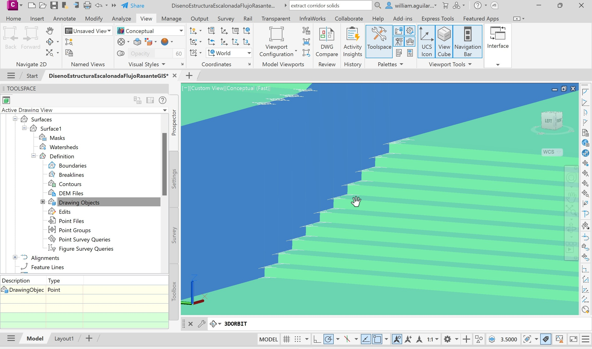

# 2.7. Dibujo de estructuras hidráulicas
Keywords: `hydraulic-structures` `hydraulic-sewer` `bridge` `hydraulic-stepped-structure` `expansion` `contraction` `autodesk-civil-3d` `autodesk-autocad` `surface` `m02a07`

Dibujo de estructuras hidráulicas e incorporación al modelo de terreno.

## Objetivos

* Dibujar en Autodesk Civil 3D, el corredor y los taludes del paso de vía.
* Dibujar en Autodesk Civil 3D, los diques de encausamiento en la zona de inicio y entrega, que hacen parte de las expansiones y contracciones diseñadas para el empalme del cauce natural al cauce de realineamiento y en las zonas de paso de vía, si se realizó su diseño considerando el sobreancho requerido por las alcantarillas.
* Dibujar en Autodesk Civil 3D, las estructuras de caída o de control de fondo (con y sin dentellón), en el caso de que el fondo del valle haya sido definido con este tipo de estructuras.
* Dibujar en Autodesk Civil 3D, la estructura escalonada de entrega de uno de los cauces naturales laterales que entregan al canal de realineamiento. 
* Dibujar en Autodesk Civil 3D, la estructura rápida de entrega de uno de los cauces naturales laterales que entregan al canal de realineamiento. 
* Exportar a Autodesk AutoCAD, las superficies 3D de las diferentes estructuras diseñadas y dibujadas.
* Incorporar las superficies 3D de las estructuras, al MDT integrado del valle y río en formato de AutoCAD.

## Requerimientos

Archivos, actividades previas, lecturas y herramientas requeridas para el desarrollo de esta actividad:

| Requerimiento                                                                                                   | Descripción                                                                                                                                                                                                                                                                                                                                                                                                     |
|:----------------------------------------------------------------------------------------------------------------|:----------------------------------------------------------------------------------------------------------------------------------------------------------------------------------------------------------------------------------------------------------------------------------------------------------------------------------------------------------------------------------------------------------------|
| [:toolbox:Herramienta](https://qgis.org/)                                                                       | QGIS 3.42 o superior.                                                                                                                                                                                                                                                                                                                                                                                           |
| [:toolbox:Herramienta](https://www.autodesk.com/products/civil-3d)                                              | Autodesk Civil 3D 2026 (english version) o superior.                                                                                                                                                                                                                                                                                                                                                            |
| [:round_pushpin:Civil3D_MDT_ValleRio_v0.dwg](../../file/cad/acad/Civil3D_MDT_ValleRio_v0.zip)                   | Archivo Autodesk AutoCAD con: sólido que integra las superficies del valle y cauce sinuoso diseñado y trazado con Autodesk Civil 3D.                                                                                                                                                                                                                                                                            |
| [:mortar_board:Actividad 1.16. Obras y estructuras hidráulicas - Paso de vía](../M01A16/Readme.md)              | Diseño geométrico de pasos de vía en canales usando alcantarillas por área equivalente a descarga libre.                                                                                                                                                                                                                                                                                                        |
| [:mortar_board:Actividad 1.17. Obras y estructuras hidráulicas - Caída y control de fondo](../M01A17/Readme.md) | Diseño de estructura de caída con y sin contra-escalón en sección rectangular.                                                                                                                                                                                                                                                                                                                                  |
| [:mortar_board:Actividad 1.18. Obras y estructuras hidráulicas - Contracción y expansión](../M01A18/Readme.md)  | La construcción del canal prismático de sección compuesta del cauce principal, requiere de la implantación de contracción de inicio y expansión en entrega, debido a que el flujo de diseño debe ser conducido y transportado por un valle confinado.                                                                                                                                                           |
| [:mortar_board:Actividad 1.19. Obras y estructuras hidráulicas - Escalonada](../M01A19/Readme.md)               | El diseño y construcción de canales hidráulicos, requiere frecuentemente del diseño de estructuras escalonadas cuando existen diferencias importantes de nivel entre el fondo del cauce lateral intervenido y el cauce o canal receptor.                                                                                                                                                                        |
| [:mortar_board:Actividad 1.20. Obras y estructuras hidráulicas - Rápida](../M01A20/Readme.md)                   | Las rápidas pueden ser utilizadas para realizar conexión de cauces laterales a canales principales de desviación, ya que es posible ajustar la pendiente natural del terreno y por tal razón, el movimiento de tierras es menor al de una entrega usando estructuras escalonadas a flujo rasante. Una desventaja en su implementación es la erosión generada por las altas velocidades del canal de la rápida.  |

> Para los diferentes avances de proyecto, es necesario guardar y publicar las diferentes versiones generadas del (los) libro (s) de Microsoft Excel y reportes o informes, agregando al final la fecha de control documental en formato aaaammdd, p. ej. _R.HydroTools.DisenoCaucesParametros.20250528.xlsx_.

## Procedimiento general

Siga en clase, las indicaciones del instructor para el dibujo y creación de las superficies de las diferentes estructuras hidráulicas requeridas, así como su incorporación al MDT integrado del valle suavizado y el río sinuoso. 

## Actividades de proyecto :triangular_ruler:

Utilizando la [plantilla suministrada](../../file/report/R.HCMC.PlantillaSoporteDesarrollo.docx), cree un documento soporte mostrando las actividades desarrolladas en el orden presentado en esta actividad, junto con los análisis y recomendaciones realizadas, convierta a Adobe Acrobat (.pdf) y guarde en la carpeta _/report_ del repositorio de datos del proyecto; nombre el archivo con el código de la actividad agregando al final la fecha de control documental en formato aaaammdd (p. ej. M02A01_20250531.pdf).

En la siguiente tabla se listan las actividades que deben ser desarrolladas y documentadas por cada estudiante o grupo de proyecto.

| Actividad | Alcance                                                                                                                                                                                                                                                                                                                                                                                                                                                                                                                                              |
|:----------|:-----------------------------------------------------------------------------------------------------------------------------------------------------------------------------------------------------------------------------------------------------------------------------------------------------------------------------------------------------------------------------------------------------------------------------------------------------------------------------------------------------------------------------------------------------|
| M02A07    | Siga en clase, las indicaciones del instructor para el dibujo y creación de las superficies de las diferentes estructuras hidráulicas requeridas, así como su incorporación al MDT integrado del valle suavizado y el río sinuoso.                                                                                                                                                                                                                                                                                                                   |  
| M02A07    | En una tabla y al final del informe de avance de esta entrega, indique el detalle de las actividades realizadas por cada integrante de su grupo; utilice las siguientes columnas: `Nombre del integrante`, `Actividades realizadas`, `Tiempo dedicado en horas` (si presenta la entrega individualmente, no es necesaria la presentación de esta tabla).  Para actividades que no requieren del desarrollo de elementos de avance, indicar si realizo la lectura de la guía de clase y las lecturas indicadas al inicio en los requerimientos. | 

> Nota 1: para la revisión del proyecto final, guarde los libros cálculo de Microsoft Excel y los archivos generados en esta actividad, en las localizaciones indicadas en cada numeral.
>
> Nota 2: una vez el instructor realice la revisión y el estudiante presente las correcciones o ajustes solicitados, será necesario cargar una nueva versión de los archivos en el repositorio del proyecto, incluyendo o actualizando al final del nombre del archivo, la fecha de presentación en formato aaaammdd y manteniendo las versiones anteriores presentadas.

## Referencias

* https://www.autodesk.com/education/free-software/autocad
* https://www.autodesk.com/education/free-software/civil-3d

## Control de versiones

| Versión    | Descripción        | Autor                                     | Horas |
|------------|:-------------------|-------------------------------------------|:-----:|
| 2025.07.30 | Migración a GitHub | [rcfdtools](https://github.com/rcfdtools) |   2   |
| 2014.01.22 | Versión inicial.   | [frankv13](https://github.com/frankv13)   |  26   |

##

_R.HCMC es de uso libre para fines académicos, conoce nuestra licencia, cláusulas, condiciones de uso y como referenciar los contenidos publicados en este repositorio, dando [clic aquí](../../LICENSE.md)._

_¡Encontraste útil este repositorio!, apoya su difusión marcando este repositorio con una ⭐ o síguenos dando clic en el botón Follow de [rcfdtools](https://github.com/rcfdtools) en GitHub._

| [:arrow_backward: Anterior](../M02A06/Readme.md) | [:house: Inicio](../../README.md) | [:beginner: Ayuda / Colabora](https://github.com/rcfdtools/R.HCMC/discussions/99999) | [Siguiente :arrow_forward:](../M02A08/Readme.md) |
|--------------------------------------------------|-----------------------------------|--------------------------------------------------------------------------------------|---------------------------------------------------|

[^1]: 