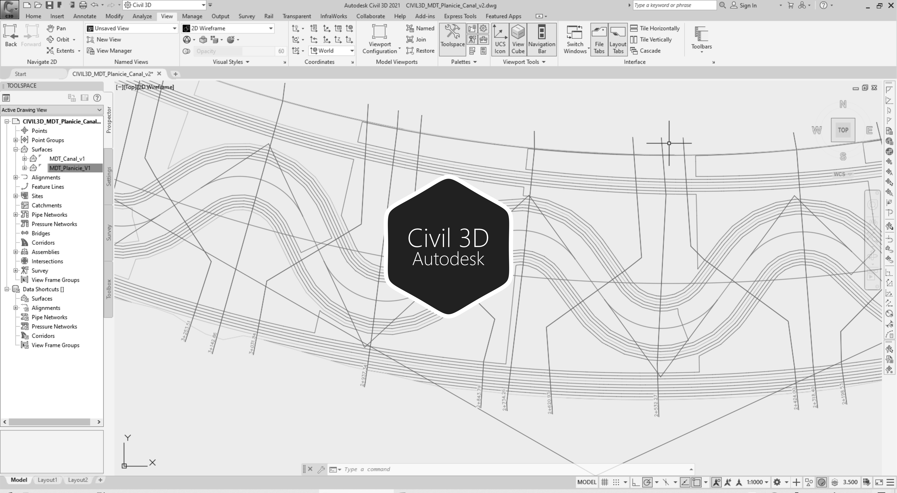

# 2.9. Planos - Generación de secciones transversales, planta y perfil
Keywords: `profile` `volume-cut-fill` `engineering-sketch` `cross-section` `autodesk-civil-3d` `autodesk-autocad` `surface` `m02a09`

A partir de los modelos de terreno para la planicie y para el canal combinado, y de los ejes para el valle y el cauce principal, generar las secciones transversales, la planta y el perfil. Generar tablas de curvas.

## Objetivos

* Generar secciones transversales.
* Generar perfiles.
* Etiquetar ejes para dibujo de la planta.

## Requerimientos

Archivos, actividades previas, lecturas y herramientas requeridas para el desarrollo de esta actividad:

| Requerimiento                                                                                          | Descripción                                                                                                                                                                                                                                                |
|:-------------------------------------------------------------------------------------------------------|:-----------------------------------------------------------------------------------------------------------------------------------------------------------------------------------------------------------------------------------------------------------|
| [:toolbox:Herramienta](https://qgis.org/)                                                              | QGIS 3.42 o superior.                                                                                                                                                                                                                                      |
| [:toolbox:Herramienta](https://www.autodesk.com/products/civil-3d)                                     | Autodesk Civil 3D 2026 (english version) o superior.                                                                                                                                                                                                       |
| [:round_pushpin:Civil3D_MDT_PlanicieCanal_v1.dwg](../../file/cad/civil/Civil3D_MDT_Planicie_v1.zip)    | Archivo Autodesk Civil 3D con: modelo digital de terreno - DTM de la planicie a partir de curvas de nivel con incorporación del realineamiento (valle curvo y río sinuoso) y tablas de cálculo de volúmenes de corte y relleno de secciones transversales. |

> Para los diferentes avances de proyecto, es necesario guardar y publicar las diferentes versiones generadas del (los) libro (s) de Microsoft Excel y reportes o informes, agregando al final la fecha de control documental en formato aaaammdd, p. ej. _R.HydroTools.DisenoCaucesParametros.20250528.xlsx_.

## Procedimiento general

R.HCMC se encuentra en proceso de actualización, consulte la versión anterior en el enlace [M02A09.pdf](M02A09.pdf).

## Actividades de proyecto :triangular_ruler:

Utilizando la [plantilla suministrada](../../file/report/R.HCMC.PlantillaInformeTecnico.docx), cree un informe técnico mostrando las actividades desarrolladas en el orden presentado en esta actividad, junto con los análisis y recomendaciones realizadas, convierta a Adobe Acrobat (.pdf) y guarde en la carpeta _/report_ del repositorio de datos del proyecto; nombre el archivo con el código de la actividad agregando al final la fecha de control documental en formato aaaammdd (p. ej. M02A01_20250531.pdf).

En la siguiente tabla se listan las actividades que deben ser desarrolladas y documentadas por cada estudiante o grupo de proyecto.

| Actividad | Alcance                                                                                                                                                                                                                                                                                                                                                                                                                                                                                                                                              |
|:----------|:-----------------------------------------------------------------------------------------------------------------------------------------------------------------------------------------------------------------------------------------------------------------------------------------------------------------------------------------------------------------------------------------------------------------------------------------------------------------------------------------------------------------------------------------------------|
| M02A09    | A partir del archivo _[Civil3D_MDT_PlanicieCanal_v1.dwg](../../file/cad/civil/Civil3D_MDT_PlanicieCanal_v1.zip)_, presentar todas las secciones transversales y perfil del eje del río con zonas de corte y relleno, nombrar como _[Civil3D_MDT_PlanicieCanalSeccionPerfil_v1.dwg](../../file/cad/civil/Civil3D_MDT_PlanicieCanalSeccionPerfil_v1.dwg)_.  En el informe técnico, incluya capturas de pantalla de detalle con las diferentes herramientas Autodesk Civil 3D utilizadas.                                                       |  
| M02A09    | En una tabla y al final del informe de avance de esta entrega, indique el detalle de las actividades realizadas por cada integrante de su grupo; utilice las siguientes columnas: `Nombre del integrante`, `Actividades realizadas`, `Tiempo dedicado en horas` (si presenta la entrega individualmente, no es necesaria la presentación de esta tabla).  Para actividades que no requieren del desarrollo de elementos de avance, indicar si realizo la lectura de la guía de clase y las lecturas indicadas al inicio en los requerimientos. | 

**_Nota 1_**: para la revisión del proyecto final, guarde los libros cálculo de Microsoft Excel y los archivos generados en esta actividad, en las localizaciones indicadas en cada numeral.

**_Nota 2_**: una vez el instructor realice la revisión y el estudiante presente las correcciones o ajustes solicitados, será necesario cargar una nueva versión de los archivos en el repositorio del proyecto, incluyendo o actualizando al final del nombre del archivo, la fecha de presentación en formato aaaammdd y manteniendo las versiones anteriores presentadas.

## Referencias

* https://www.autodesk.com/education/free-software/autocad
* https://www.autodesk.com/education/free-software/civil-3d

##

_R.HCMC es de uso libre para fines académicos, conoce nuestra licencia, cláusulas, condiciones de uso y como referenciar los contenidos publicados en este repositorio, dando [clic aquí](../../LICENSE.md)._

_¡Encontraste útil este repositorio!, apoya su difusión marcando este repositorio con una ⭐ o síguenos dando clic en el botón Follow de [rcfdtools](https://github.com/rcfdtools) en GitHub._

| [:arrow_backward: Anterior](../M02A08/Readme.md) | [:house: Inicio](../../README.md) | [:beginner: Ayuda / Colabora](https://github.com/rcfdtools/R.HCMC/discussions/1) | [Siguiente :arrow_forward:](../M03A01/Readme.md) |
|---------------------------------------------------|-----------------------------------|----------------------------------------------------------------------------------|---------------------------------------------------|

[^1]: 