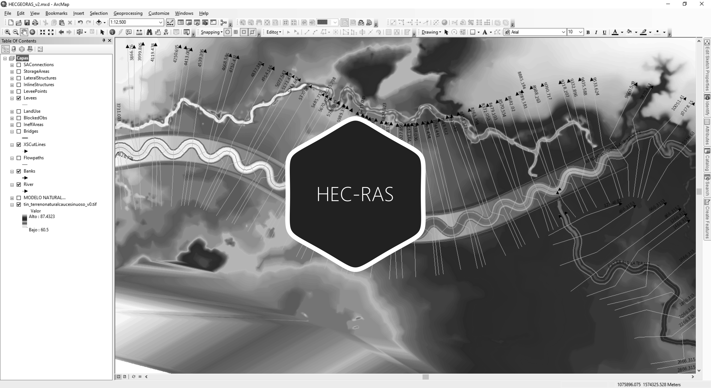
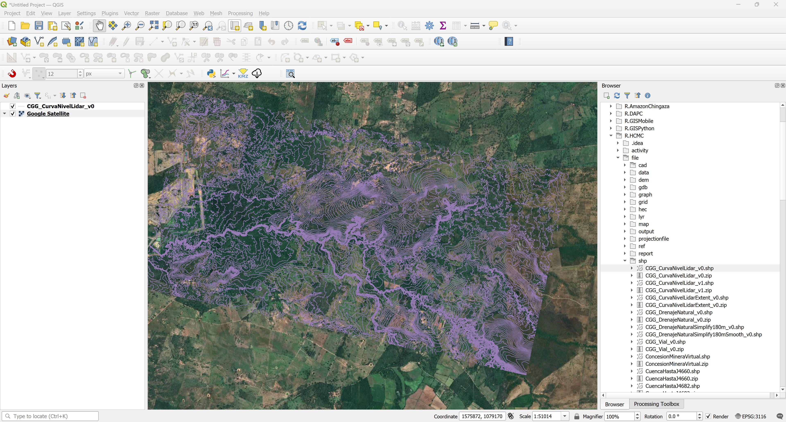
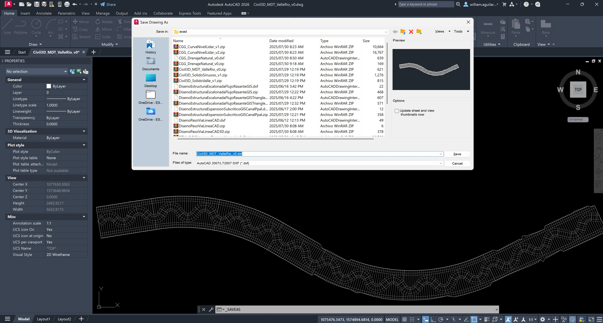

# :globe_with_meridians:Módulo III – Modelación hidráulica 1D

En este módulo se realiza el ensamble en RAS-Mapper de la topología requerida del canal y paso de vía y se realiza la modelación hidráulica 1D en HEC-RAS para verificar mediante los resultados obtenidos, que el canal diseñado cumpla con las especificaciones geométricas e hidráulicas de diseño.

HEC-RAS es una herramienta computacional de dominio público creada por el Cuerpo de Ingenieros Militares de los Estados Unidos de América (US Army Corps of Engineers), utilizada para realizar cálculos hidráulicos sobre una red compuesta por canales abiertos naturales o construidos, llanuras de inundación y aluviones.

HEC-RAS tiene la capacidad de simular Flujo No Permanente, unidimensional o bidimensionalmente y se puede utilizar para modelar regímenes de flujo subcrítico, supercrítico y mixto. 
Actualmente, los cálculos hidráulicos 1D realizados para secciones transversales, puentes, alcantarillas y otras estructuras hidráulicas pueden ser realizados en flujo no permanente. Otras características especiales incluyen: análisis de rotura de presas y diques, estaciones de bombeo, operación de presas para sistemas navegables, sistemas de tuberías a presión, calibración automatizada, reglas de operación definidas por el usuario y la combinación de modelos 1D y 2D.

# 3.1. Creación del modelo topológico usando RAS-Mapper
Keywords: `hec-ras` `ras-mapper` `hydraulic-model` `cross-section` `leeve` `bank` `m03a01`

A partir de los ejes y modelos de terreno natural, valle y cauce sinuoso diseñado y dibujado en Autodesk Civil 3D, ensamblar el modelo de terreno combinado y generar el modelo topológico geográfico requerido para la modelación hidráulica en HEC-RAS.

## Objetivos

* Integrar el modelo de terreno del realineamiento diseñado y dibujado en Autodesk Civil 3D, con el MDT natural.
* Crear el modelo de terreno triangulado TIN.
* Crear y validar la geometría del modelo topológico en HEC-RAS usando RAS Mapper.

## Requerimientos

Archivos, actividades previas, lecturas y herramientas requeridas para el desarrollo de esta actividad:

| Requerimiento                                                                                                              | Descripción                                                                                                                                                                                                                                                                                                                                                      |
|:---------------------------------------------------------------------------------------------------------------------------|:-----------------------------------------------------------------------------------------------------------------------------------------------------------------------------------------------------------------------------------------------------------------------------------------------------------------------------------------------------------------|
| [:toolbox:Herramienta](https://qgis.org/)                                                                                  | QGIS 3.42 o superior.                                                                                                                                                                                                                                                                                                                                            |
| [:toolbox:Herramienta](https://www.hec.usace.army.mil/software/hec-ras/)                                                   | HEC-RAS 6.7 Beta 3 o superior.                                                                                                                                                                                                                                                                                                                                   |
| [:round_pushpin:CGG_CurvaNivelLidar_v0.shp](../../file/shp/CGG_CurvaNivelLidar_v0.zip)                                     | Capa geográfica de curvas de nivel.                                                                                                                                                                                                                                                                                                                              |
| [:round_pushpin:Civil3D_MDT_ValleRio_v0.dwg](../../file/cad/acad/Civil3D_MDT_ValleRio_v0.zip)                              | Archivo Autodesk AutoCAD con: líneas 3D del modelo digital de terreno que integra el valle curvo y el río sinuoso.                                                                                                                                                                                                                                               | 
| [:round_pushpin:Civil3D_Ejes_v0.dwg](../../file/cad/civil/Civil3D_Ejes_v0.zip)                                             | Archivo Autodesk Civil 3D con: eje recto del valle, clotoide eje suavizado del valle, offsets de taludes de valle, sample lines, cauce sinuoso, offsets cauce sinuoso.                                                                                                                                                                                           |
| [:round_pushpin:shp_RASMapperModuleIII](../../file/shp/shp_RASMapperModuleIII.zip)                                         | Capas geográficas para ensamble del modelo hidráulico del realineamiento en RAS Mapper: Banks_RAS.shp, Bridges_RAS.shp, Flowpaths_RAS.shp, Levee_RAS_Position.shp, Levee_RAS_Position_SimplePart.shp, Levees_RAS.shp, River_RAS.shp, XSCutLines_RAS.shp, XSCutLines_RAS_Properties.shp, XSCutLines_RAS_Properties_Left.shp, XSCutLines_RAS_Properties_Right.shp. |

> Para los diferentes avances de proyecto, es necesario guardar y publicar las diferentes versiones generadas del (los) libro (s) de Microsoft Excel y reportes o informes, agregando al final la fecha de control documental en formato aaaammdd, p. ej. _R.HydroTools.DisenoCaucesParametros.20250528.xlsx_.

## 1. Procedimiento general

R.HCMC se encuentra en proceso de actualización, consulte la versión anterior usando Hec-GeoRAS en el enlace [M03A01.pdf](M03A01.pdf).

1. En QGIS, cree un proyecto nuevo asignando el CRS 3116, agregue la capa [/shp/CGG_CurvaNivelLidar_v0.shp](../../file/shp/CGG_CurvaNivelLidar_v0.zip).

> Para comprender mejor la localización geográfica del proyecto, agregue el mapa base XYZ de Google Maps desde https://mt1.google.com/vt/lyrs=m&x={x}&y={y}&z={z}. Mapas base complementarios en: https://github.com/opengeos/qgis-basemaps/blob/main/qgis_basemaps.py

2. Desde Autodesk AutoCAD o Civil 3D, convierta el archivo [/cad/acad/Civil3D_MDT_ValleRio_v0.dwg](../../file/cad/acad/Civil3D_MDT_ValleRio_v0.zip) a un archivo .dxf versión 2007 con el nombre [/cad/acad/Civil3D_MDT_ValleRio_v0.dxf](../../file/cad/acad/Civil3D_MDT_ValleRio_v0dxf.zip)

y los vectores CAD del DTM creado en Autodesk Civil 3D

## 2. Obtención de valores de estación-elevación de diques en QGIS en cada sección transversal y asignación en Geometry 1D de HEC-RAS

Los diques o Leeves en modelos hidráulicos unidimensionales, son los elementos que permiten confinar el flujo hidráulico en una sección transversal y su incorporación es indispensable para poder modelar correctamente las condiciones de desbordamiento y el área hidráulica de la sección. En secciones transversales en la que existen zonas laterales fuera del cauce principal, el área hidráulica se calcula a lo ancho de toda la sección; cuando están definidos los diques izquierdo y derecho, únicamente el área hidráulica es calculada dentro de estas dos posiciones. 

RAS Mapper, no dispone en la versión 6.7 de HEC-RAS, de una herramienta para la incorporación de posiciones de dique en secciones transversales de modelos 1D. Es por ello, que es necesario calcular los valores de estación o distancias desde el nodo inicial de la sección, hasta los puntos de localización de diques izquierdo y derecho, además de la elevación en la sección de estos elementos. Guarde las capas generadas en la carpeta [/hec/HECRAS_v1/shp_RASMapperModuleIII/](../../file/hec/)

1. Desde el modelo hidráulico de HEC-RAS y desde RAS Mapper, actualice todas las propiedades de las secciones transversales o XSCutLines (abscisas, valores de estación-elevación de los nodos que representan la sección). 
2. Desde RAS Mapper, exporte las XSCutLines con todas sus propiedades a un archivo shapefile y guarde como _XSCutLines_RAS_Properties.shp_. Recuerde que los nombres de los campos de atributos serán truncados a 10 caracteres alfanuméricos cuando estos son exportados a .shp.
3. En QGIS, agregue a un mapa la capa _XSCutLines_RAS_Properties.shp_ y elimine todos los atributos, excepto los correspondientes a `River`, `Reach` y `RiverStati`.
4. Realice la intersección espacial de las secciones transversales _XSCutLines_RAS_Properties.shp_, con las líneas de diques _Levees_RAS.shp_ (las líneas de dique deberán contener la propiedad `Side`, indicando si corresponde al lado izquierdo o derecho del canal en el sentido del flujo) y guarde como una capa de puntos con el nombre _Levee_RAS_Position.shp_.  
5. En _Levee_RAS_Position.shp_, filtre los puntos correspondientes al lado izquierdo del dique.
6. Ejecute la herramienta de división de líneas a partir de puntos, utilizando las líneas de secciones transversales o _XSCutLines_RAS_Properties.shp_ y los nodos _Levee_RAS_Position.shp_ filtrados del dique izquierdo obtenidos de la intersección. Guarde la capa resultante de líneas fraccionadas como _XSCutLines_RAS_Properties_Left.shp_ y elimine las líneas residuales a la derecha de la línea del dique izquierdo y todas aquellas líneas de sección transversales que no se intersecan con la línea de dique.
7. En la capa _XSCutLines_RAS_Properties_Left.shp_, cree un campo numérico real con el nombre `LPm` y calcule la longitud planar de la línea en metros.
8. En la capa _Levee_RAS_Position.shp_ que contiene los nodos de intersección de secciones transversales con diques, cree un campo numérico real con el nombre `LeftSta`.
9. Cree una unión de tablas entre la capa _Levee_RAS_Position.shp_ y _XSCutLines_RAS_Properties_Left.shp_, utilizando como llave primaria el campo `RiverStati`. En el campo `LeftSta`, asigne el valor del atributo calculado en el campo `LPm`.
10. Remueva la unión y repita el procedimiento anterior desde el paso 5, para los nodos de dique del lado derecho de cada sección transversal. Nombre la capa de dividida de secciones hasta el dique derecho como _XSCutLines_RAS_Properties_Right.shp_.
11. En caso de ser necesario y solo si la capa de nodos de diques _Levee_RAS_Position.shp_ es multiparte, convierta a parte sencilla. Multipart to Singlepart.
12. Para cada uno de los nodos de dique, obtenga la elevación o cota a partir del modelo de terreno. De esta forma habrá obtenido las estaciones y elevaciones de cada dique en cada sección.
13. Establezca los valores obtenidos en el modelo hidráulico de HEC-RAS, en el editor de geometría 1D, en el menú _Tables_, seleccione la opción _Levees_ y asigne masivamente los valores obtenidos.

> Otra alternativa es agregar manualmente desde el editor de geometría 1D de secciones transversales de HEC-RAS, la localización de los diques en cada sección.

## Actividades de proyecto :triangular_ruler:

Utilizando la [plantilla suministrada](../../file/report/R.HCMC.PlantillaInformeTecnico.docx), cree un informe técnico mostrando las actividades desarrolladas en el orden presentado en esta actividad, junto con los análisis y recomendaciones realizadas, convierta a Adobe Acrobat (.pdf) y guarde en la carpeta _/report_ del repositorio de datos del proyecto; nombre el archivo con el código de la actividad agregando al final la fecha de control documental en formato aaaammdd (p. ej. M02A01_20250531.pdf).

Libro de revisión y calificación: [M03A01_ModeloTopologico.xlsx](M03A01_ModeloTopologico.xlsx)

En la siguiente tabla se listan las actividades que deben ser desarrolladas y documentadas por cada estudiante o grupo de proyecto.

| Actividad | Alcance                                                                                                                                                                                                                                                                                                                                                                                                                                                                                                                                                                                                                                                                                                                                                                                                                                                                                                                                                                                                                                                                                                                                                                                                                                                                            |
|:----------|:-----------------------------------------------------------------------------------------------------------------------------------------------------------------------------------------------------------------------------------------------------------------------------------------------------------------------------------------------------------------------------------------------------------------------------------------------------------------------------------------------------------------------------------------------------------------------------------------------------------------------------------------------------------------------------------------------------------------------------------------------------------------------------------------------------------------------------------------------------------------------------------------------------------------------------------------------------------------------------------------------------------------------------------------------------------------------------------------------------------------------------------------------------------------------------------------------------------------------------------------------------------------------------------|
| M03A01    | Crear el modelo de terreno integrando valle, cauce sinuoso y zona natural remanente. Para la zona externa al corredor diseñado utilizar las curvas de nivel de la zona natural y para el corredor utilizar las líneas 3D obtenidas de la superficie dibujada en Autodesk Civil 3D. El modelo de terreno deberá incluir las estructuras hidráulicas diseñadas y dibujadas en Autodesk Civil 3D. Nombrar como _[/dem/TIN_TerrenoNaturalCauceSinuoso_v0](../../file/dem)_ y convertir a GeoTIFF (con resolución máxima de 1 metro) como _[/dem/TIN_TerrenoNaturalCauceSinuoso_v0.tif](../../file/dem)_, comprimir los dos terrenos del modelo (vectorial y grilla ráster) como _[/dem/TIN_TerrenoNaturalCauceSinuoso_v0_tin.zip](../../file/dem)_ y _[/dem/TIN_TerrenoNaturalCauceSinuoso_v0_tif.zip](../../file/dem)_. En el informe técnico indicar sí a partir del análisis del modelo de terreno integrado, son requeridos diques de encausamiento en inicio y de protección en entrega.                                                                                                                                                                                                                                                                                        |  
| M03A01    | Crear el modelo topológico en RAS-Mapper incluyendo ejes de cauces, secciones transversales, líneas de banca (para localizar el límite de las zonas de rugosidad),  líneas de dique (para la zona primaria de confinamiento hidráulico antes del desborde por corona del valle), cauces laterales existentes y al menos un paso de vía. Muestrear las secciones transversales del cauce sinuoso diseñado al menos en cada curva externa y centro del tramo de aproximación o segmento recto de entre-tengencia de curvas. Comprimir como _[/hec/HECRAS_v1_aaaammdd.zip](../../file/hec)_. En el informe técnico, incluir al menos 10 secciones transversales de muestreo en el tramo de diseño, editar el título de la gráfica indicando la abscisa de la sección transversal más próxima utilizada. Desde RAS Mapper, presente perfiles en el tramo natural de inicio y entrega con el empalme del canal diseñado, perfil del rio sinuoso diseñado, en el paso de vía y perfiles de entrega de cauces laterales, para verificar que se hayan incluido en Autodesk Civil 3D las estructuras laterales. En QGIS, represente el MDT en 3D con exageración vertical 50 y presente capturas de pantalla de la zona de inicio, entrega, paso de vía y cauces laterales. Ver _Nota 3_. |  
| M03A01    | En el informe técnico incluya capturas de pantalla detalladas del proceso constructivo del modelo de terreno y del modelo topológico, para cada capa o clase de entidad mostrar los vectores con su dirección vectorial y tabla de atributos completamente poblada. Incluir observaciones detalladas.                                                                                                                                                                                                                                                                                                                                                                                                                                                                                                                                                                                                                                                                                                                                                                                                                                                                                                                                                                            |  
| M03A01    | Opcional: crear el modelo de terreno y el modelo topológico con sección compuesta y sin cauce dominante o río sinuoso. La creación de este modelo le permitirá posteriormente comparar los resultados de modelación hidráulica (velocidad, cortante, borde libre, tiempo de viaje...) entre el realineamiento con sección compuesta con cauce dominante sinuoso y realineamiento con sección compuesta siguiendo el eje del valle.                                                                                                                                                                                                                                                                                                                                                                                                                                                                                                                                                                                                                                                                                                                                                                                                                                                 |  
| M03A01    | En una tabla y al final del informe de avance de esta entrega, indique el detalle de las actividades realizadas por cada integrante de su grupo; utilice las siguientes columnas: `Nombre del integrante`, `Actividades realizadas`, `Tiempo dedicado en horas` (si presenta la entrega individualmente, no es necesaria la presentación de esta tabla).  Para actividades que no requieren del desarrollo de elementos de avance, indicar si realizo la lectura de la guía de clase y las lecturas indicadas al inicio en los requerimientos.                                                                                                                                                                                                                                                                                                                                                                                                                                                                                                                                                                                                                                                                                                                               | 

**_Nota 1_**: para la revisión del proyecto final, guarde los libros cálculo de Microsoft Excel y los archivos generados en esta actividad, en las localizaciones indicadas en cada numeral.

**_Nota 2_**: una vez el instructor realice la revisión y el estudiante presente las correcciones o ajustes solicitados, será necesario cargar una nueva versión de los archivos en el repositorio del proyecto, incluyendo o actualizando al final del nombre del archivo, la fecha de presentación en formato aaaammdd y manteniendo las versiones anteriores presentadas.

**_Nota 3_**: para la revisión y calificación del modelo topológico, se verificará

* Incorporación de valores de estación-elevación para localización de nodos de diques. Requerido para el correcto confinamiento hidráulico en la sección compuesta diseñada.
* Sentido vectorial correcto de las líneas de todo el modelo.
* Perpendicularidad y localización detallada de secciones transversales con respecto al eje sinuoso y valle diseñado.
* Localización de secciones transversales en la zona naturales de inicio, entrega y cauces naturales.
* Localización de secciones transversales sobre las obras hidráulicas diseñadas y dibujadas en Autodesk Civil 3D e incorporadas al modelo de terreno.
* Visualización correcta de secciones transversales de muestreo sobre el tramo de diseño sin sobre elevaciones o errores de empalme entre la corona del cauce dominante y la base del valle confinado.
* Localización correcta de bancas, líneas de flujo, líneas de diques. En esta actividad no es necesario incorporar las localizaciones de los diques a partir de valores de estación-elevación, únicamente incluir en RAS Mapper como vector de referencia, las líneas que definen la corona del talud en valle y la corona de las estructuras hidráulicas y diques de encausamiento.  
* Localización del eje de paso de vía e inclusión de expansión y contracción en el modelo de terreno.
* Conexión de cauces laterales al cauce principal.
* Atributos requeridos por el modelo hidráulico, tales como nombres de ríos, nombres de tramos, abscisado, distancia entre ejes, distancia entre márgenes, localización de bancas y demás atributos generados por RAS-Mapper.

## Referencias

* https://www.hec.usace.army.mil/confluence/rasdocs
* https://www.hec.usace.army.mil/confluence/rasdocs/r2dum/6.6/developing-a-terrain-model-and-geospatial-layers/opening-ras-mapper
* https://www.hec.usace.army.mil/confluence/rasdocs/r2dum/6.6/developing-a-terrain-model-and-geospatial-layers/setting-the-spatial-reference-projection
* https://www.hec.usace.army.mil/confluence/rasdocs/r2dum/6.6/ras-mapper-supported-file-formats
* https://plugins.qgis.org/plugins/SplitLinesByPoints/

## Control de versiones

| Versión     | Descripción        | Autor                                     | Horas |
|-------------|:-------------------|-------------------------------------------|:-----:|
| 2025.07.31  | Migración a GitHub | [rcfdtools](https://github.com/rcfdtools) |   2   |

##

_R.HCMC es de uso libre para fines académicos, conoce nuestra licencia, cláusulas, condiciones de uso y como referenciar los contenidos publicados en este repositorio, dando [clic aquí](../../LICENSE.md)._

_¡Encontraste útil este repositorio!, apoya su difusión marcando este repositorio con una ⭐ o síguenos dando clic en el botón Follow de [rcfdtools](https://github.com/rcfdtools) en GitHub._

| [:arrow_backward: Anterior](../M02A09/Readme.md) | [:house: Inicio](../../README.md) | [:beginner: Ayuda / Colabora](https://github.com/rcfdtools/R.HCMC/discussions/1) | [Siguiente :arrow_forward:](../M03A02/Readme.md) |
|--------------------------------------------------|-----------------------------------|----------------------------------------------------------------------------------|---------------------------------------------------|

[^1]: 