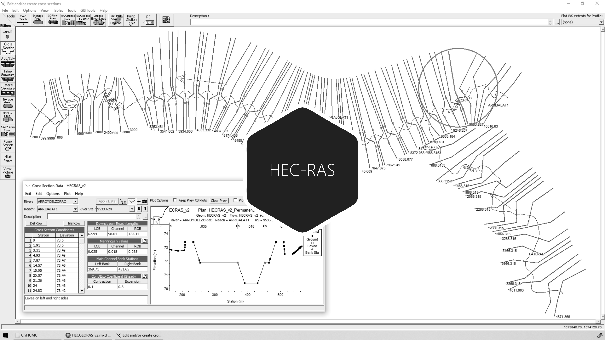

# 3.2. Verificación de topología en HEC-RAS
Keywords: `hec-ras` `ras-mapper` `hydraulic-model` `cross-section` `leeve` `bank` `m03a02`

A partir de la topología generada validar y depurar la geometría 1D HEC-RAS del cauce sinuoso diseñado.

## Objetivos

* En el editor de geometría 1D de HEC-RAS, Visualizar perfiles y secciones de inicio y entrega.
* Verificar las propiedades geométricas de las secciones transversales.
* Depurar el modelo ajustando posiciones de bancas y diques.

## Requerimientos

Archivos, actividades previas, lecturas y herramientas requeridas para el desarrollo de esta actividad:

| Requerimiento                                                            | Descripción                                                                                     |
|:-------------------------------------------------------------------------|:------------------------------------------------------------------------------------------------|
| [:toolbox:Herramienta](https://qgis.org/)                                | QGIS 3.42 o superior.                                                                           |
| [:toolbox:Herramienta](https://www.hec.usace.army.mil/software/hec-ras/) | HEC-RAS 6.7 Beta 3 o superior.                                                                  |
| [:open_file_folder:Modelo hidráulico HECRAS_v1](../../file/hec)          | Modelo hidráulico unidimensional HEC-RAS v1 creado en actividad [M03A01](../M03A01/Readme.md). |

> Para los diferentes avances de proyecto, es necesario guardar y publicar las diferentes versiones generadas del (los) libro (s) de Microsoft Excel y reportes o informes, agregando al final la fecha de control documental en formato aaaammdd, p. ej. _R.HydroTools.DisenoCaucesParametros.20250528.xlsx_.

## Procedimiento general

R.HCMC se encuentra en proceso de actualización, consulte la versión anterior en el enlace [M03A02.pdf](M03A02.pdf).

## Procedimiento para obtención de valores de estación-elevación de diques en cada sección transversal y asignación en RAS Mapper

Los diques o Leeves en modelos hidráulicos unidimensionales, son los elementos que permiten confinar el flujo hidráulico en una sección transversal y su incorporación es indispensable para poder modelar correctamente las condiciones de desbordamiento y el área hidráulica de la sección. En secciones transversales en la que existen zonas laterales fuera del cauce principal, el área hidráulica se calcula a lo ancho de toda la sección; cuando están definidos los diques izquierdo y derecho, únicamente el área hidráulica es calculada dentro de estas dos posiciones. 

RAS Mapper, no dispone en la versión 6.7 de HEC-RAS, de una herramienta para la incorporación de posiciones de dique en secciones transversales de modelos 1D. Es por ello, que es necesario calcular los valores de estación o distancias desde el nodo inicial de la sección, hasta los puntos de localización de diques izquierdo y derecho, además de la elevación en la sección de estos elementos. 

1. Desde el modelo hidráulico de HEC-RAS y desde RAS Mapper, actualice todas las propiedades de las secciones transversales o XSCutLines (abscisas, valores de estación-elevación de los nodos que representan la sección). 
2. Desde RAS Mapper, exporte las XSCutLines con todas sus propiedades a un archivo shapefile y guarde como XSCutLines.shp. Recuerde que los nombres de los campos de atributos serán truncados a 10 caracteres alfanuméricos cuando estos son exportados a .shp.
3. En QGIS, agregue a un mapa la capa XSCutLines.shp y elimine todos los atributos, excepto los correspondientes a `River`, `Reach` y `RiverStati`. Opcionalmente, obtenga en campos de atributos numéricos dobles, las coordenadas XY del punto de inicio de cada sección transversal.
4. Realice la intersección espacial de las secciones transversales o XSCutLines, con las líneas de diques o Levees (las líneas de dique deberán contener la propiedad Side, indicando si corresponde al lado izquierdo o derecho del canal en el sentido del flujo) y guarde como una capa de puntos con el nombre XSCulLinesLevees.shp.  
5. Filtre los puntos correspondientes al lado izquierdo del dique.
6. Ejecute la herramienta de división de líneas a partir de puntos, utilizando las líneas de secciones transversales o XSCutLines y los nodos filtrados del dique izquierdo obtenidos  de la intersección. Guarde la capa resultante de líneas fraccionadas como XSCutLinesLeft.shp y elimine las líneas residuales a la derecha de la línea del dique izquierdo y todas aquellas líneas de sección transversales que no se intersecan con la línea de dique.
7. En la capa XSCutLinesLeft.shp, cree un campo numérico real con el nombre `LPm` y calcule la longitud planar de la línea en metros.
8. En la capa XSCulLinesLevees.shp que contiene los nodos de intersección de secciones transversales con diques, cree un campo numérico real con el nombre `LeftSta`.
9. Cree una unión de tablas entre la capa XSCulLinesLevees.shp y XSCutLinesLeft.shp, utilizando como llave primaria el campo `RiverStati`. En el campo `LeftSta`, copie el valor del atributo calculado en el campo `LPm`.
10. Remueva la unión y repita el procedimiento anterior desde el paso 5, para los nodos de dique del lado derecho de cada sección transversal.
11. En caso de ser necesario y solo si la capa de nodos de dique XSCulLinesLevees.shp sea multiparte, convierta a parte sencilla. Multipart to Singlepart.
12. Para cada uno de los nodos de dique, obtenga la elevación o cota a partir del modelo de terreno, de esta forma habrá obtenido las estaciones y elevaciones de cada dique en cada sección.
13. Establezca los valores obtenidos en el modelo hidráulico de HEC-RAS, en el editor de geometría 1D, en el menú Tables, seleccione la opción Levees...

## Actividades de proyecto :triangular_ruler:

Utilizando la [plantilla suministrada](../../file/report/R.HCMC.PlantillaSoporteDesarrollo.docx), cree un documento soporte mostrando las actividades desarrolladas en el orden presentado en esta actividad, junto con los análisis y recomendaciones realizadas, convierta a Adobe Acrobat (.pdf) y guarde en la carpeta _/report_ del repositorio de datos del proyecto; nombre el archivo con el código de la actividad agregando al final la fecha de control documental en formato aaaammdd (p. ej. M02A01_20250531.pdf).

En la siguiente tabla se listan las actividades que deben ser desarrolladas y documentadas por cada estudiante o grupo de proyecto.

| Actividad | Alcance                                                                                                                                                                                                                                                                                                                                                                                                                                                                                                                                              |
|:----------|:-----------------------------------------------------------------------------------------------------------------------------------------------------------------------------------------------------------------------------------------------------------------------------------------------------------------------------------------------------------------------------------------------------------------------------------------------------------------------------------------------------------------------------------------------------|
| M03A02    | En el editor de geometría 1D de HEC-RAS, visualizar y depurar el modelo hidráulico [HECRAS_v1.zip](../../file/hec). Para la revisión y calificación, se verificará la depuración completa del modelo hidráulico, posiciones de bancas, posiciones de diques, simplificación de secciones transversales y demás elementos indicados en esta actividad, además de las indicaciones descritas en la _Nota 3_.                                                                                                                                                                          |  
| M03A02    | En una tabla y al final del informe de avance de esta entrega, indique el detalle de las actividades realizadas por cada integrante de su grupo; utilice las siguientes columnas: `Nombre del integrante`, `Actividades realizadas`, `Tiempo dedicado en horas` (si presenta la entrega individualmente, no es necesaria la presentación de esta tabla).  Para actividades que no requieren del desarrollo de elementos de avance, indicar si realizo la lectura de la guía de clase y las lecturas indicadas al inicio en los requerimientos. | 

**_Nota 1_**: para la revisión del proyecto final, guarde los libros cálculo de Microsoft Excel y los archivos generados en esta actividad, en las localizaciones indicadas en cada numeral.

**_Nota 2_**: una vez el instructor realice la revisión y el estudiante presente las correcciones o ajustes solicitados, será necesario cargar una nueva versión de los archivos en el repositorio del proyecto, incluyendo o actualizando al final del nombre del archivo, la fecha de presentación en formato aaaammdd y manteniendo las versiones anteriores presentadas.

**_Nota 3_**: elementos requeridos en informe y en el modelo.

* Incorporación de valores de estación-elevación para localización de nodos de diques. Requerido para el correcto confinamiento hidráulico en la sección compuesta diseñada. 
* Visualizar independientemente los perfiles del cauce principal, cauce lateral 1 y cauce lateral 2. Identificar zonas que requieran ajustes como diques en posiciones incorrectas, diques faltantes, bancas erradas.
* Visualizar las secciones de inicio y entrega del cauce sinuoso diseñado. Verificar distancias positivas entre secciones y posición de bancas.
* Para todas las secciones, limpiar los puntos co-alineados de estación - elevación y simplificar dejando un máximo de 496 puntos por sección.
* Verificar la posición correcta de las bancas en todas las secciones transversales y ajustar en secciones naturales.
* Verificar la posición correcta de diques en todas las secciones transversales y localizar en secciones naturales para definir el cauce principal antes de desbordamiento.
* Verificar y ajustar la conexión de cauces laterales a nodos de unión en el cauce principal.
* Utilizando la herramienta Plot Cross Section y Print Múltiple, exportar a un archivo .pdf, todas las secciones transversales depuradas incluyendo los identificadores de cada río y tramo. Utilizar hoja tamaño carta en formato horizontal mostrando 4 secciones transversales por página.
* En el documento soporte, muestre capturas de pantalla detalladas de la depuración realizada.
* Luego de depurado el modelo, comprimir como [/file/hec/HECRAS_v1_aaaammdd.zip](../../file/hec).

## Referencias

* https://www.hec.usace.army.mil/confluence/rasdocs 
* https://www.hec.usace.army.mil/confluence/rasdocs/r2dum/6.6/developing-a-terrain-model-and-geospatial-layers/opening-ras-mapper
* https://www.hec.usace.army.mil/confluence/rasdocs/r2dum/6.6/developing-a-terrain-model-and-geospatial-layers/setting-the-spatial-reference-projection
* https://www.hec.usace.army.mil/confluence/rasdocs/r2dum/6.6/ras-mapper-supported-file-formats

## Control de versiones

| Versión     | Descripción        | Autor                                     | Horas |
|-------------|:-------------------|-------------------------------------------|:-----:|
| 2025.07.31  | Migración a GitHub | [rcfdtools](https://github.com/rcfdtools) |   2   |

##

_R.HCMC es de uso libre para fines académicos, conoce nuestra licencia, cláusulas, condiciones de uso y como referenciar los contenidos publicados en este repositorio, dando [clic aquí](../../LICENSE.md)._

_¡Encontraste útil este repositorio!, apoya su difusión marcando este repositorio con una ⭐ o síguenos dando clic en el botón Follow de [rcfdtools](https://github.com/rcfdtools) en GitHub._

| [:arrow_backward: Anterior](../M03A01/Readme.md) | [:house: Inicio](../../README.md) | [:beginner: Ayuda / Colabora](https://github.com/rcfdtools/R.HCMC/discussions/99999) | [Siguiente :arrow_forward:](../M03A03/Readme.md) |
|--------------------------------------------------|-----------------------------------|--------------------------------------------------------------------------------------|--------------------------------------------------|

[^1]: 