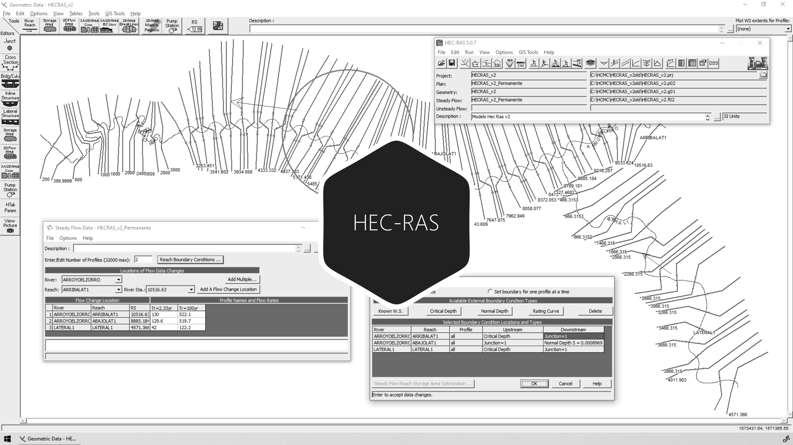

# 3.3. Definición de parámetros hidráulicos y condiciones de frontera
Keywords: `hec-ras` `ras-mapper` `hydraulic-model` `cross-section` `boundary-condition` `m03a03`

Establecer los parámetros para la modelación hidráulica y definir las condiciones de frontera requeridas para las condiciones de flujo permanente y no permanente.

## Objetivos

* Asignar las rugosidades del cauce dominante y valle.
* Definir los perfiles y caudales para flujo permanente.
* Definir los perfiles y caudales para flujo no permanente.

## Requerimientos

Archivos, actividades previas, lecturas y herramientas requeridas para el desarrollo de esta actividad:

| Requerimiento                                                                                                                                             | Descripción                                                                                                                                                                                                                                                                                                    |
|:----------------------------------------------------------------------------------------------------------------------------------------------------------|:---------------------------------------------------------------------------------------------------------------------------------------------------------------------------------------------------------------------------------------------------------------------------------------------------------------|
| [:toolbox:Herramienta](https://qgis.org/)                                                                                                                 | QGIS 3.42 o superior.                                                                                                                                                                                                                                                                                          |
| [:toolbox:Herramienta](https://www.hec.usace.army.mil/software/hec-ras/)                                                                                  | HEC-RAS 6.7 Beta 3 o superior.                                                                                                                                                                                                                                                                                 |
| [:mortar_board:Actividad 1.1. Parámetros generales requeridos para el diseño y la modelación](../M01A01/Readme.md)                                        | Definición de parámetros generales y establecimiento de criterios a tener en cuenta para el diseño del canal artificial principal, cauces laterales y estructuras hidráulicas.                                                                                                                                 |
| [:mortar_board:Actividad 1.2. Modelación hidrológica para obtención de caudales de diseño e hidrogramas para tránsito de crecientes](../M01A02/Readme.md) | Obtener en función del área de aportación hasta los puntos de inicio, entrega, descarga de cauces laterales y para diferentes periodos de retorno, los caudales requeridos para el diseño hidráulico y geométrico, así como los hidrogramas para el tránsito hidráulico de crecientes por el canal artificial. |
| [:mortar_board:Actividad 1.12. Evaluación de tamaño de partículas y definición de rugosidades de diseño](../M01A12/Readme.md)                             | Estudiar el tamaño característico del material que compone el lecho o la zona de corte del canal de realineamiento y establecer los valores de rugosidad a utilizar en el diseño hidráulico de la sección compuesta para la aplicación de diferentes métodos de diseño (Shields, Lane).                        |
| [:open_file_folder:Modelo hidráulico HECRAS_v1](../../file/hec)                                                                                           | Modelo hidráulico unidimensional HEC-RAS v1 depurado en actividad [M03A02](../M03A02/Readme.md).                                                                                                                                                                                                               |

> Para los diferentes avances de proyecto, es necesario guardar y publicar las diferentes versiones generadas del (los) libro (s) de Microsoft Excel y reportes o informes, agregando al final la fecha de control documental en formato aaaammdd, p. ej. _R.HydroTools.DisenoCaucesParametros.20250528.xlsx_.

## Procedimiento general

R.HCMC se encuentra en proceso de actualización, consulte la versión anterior en el enlace [M03A03.pdf](M03A03.pdf).

## Actividades de proyecto :triangular_ruler:

Utilizando la [plantilla suministrada](../../file/report/R.HCMC.PlantillaInformeTecnico.docx), cree un informe técnico mostrando las actividades desarrolladas en el orden presentado en esta actividad, junto con los análisis y recomendaciones realizadas, convierta a Adobe Acrobat (.pdf) y guarde en la carpeta _/report_ del repositorio de datos del proyecto; nombre el archivo con el código de la actividad agregando al final la fecha de control documental en formato aaaammdd (p. ej. M02A01_20250531.pdf).

Libro de revisión y calificación: [M03A03_ParametroCondicionFrontera.xlsx](M03A03_ParametroCondicionFrontera.xlsx)

En la siguiente tabla se listan las actividades que deben ser desarrolladas y documentadas por cada estudiante o grupo de proyecto.

| Actividad | Alcance                                                                                                                                                                                                                                                                                                                                                                                                                                                                                                                                              |
|:----------|:-----------------------------------------------------------------------------------------------------------------------------------------------------------------------------------------------------------------------------------------------------------------------------------------------------------------------------------------------------------------------------------------------------------------------------------------------------------------------------------------------------------------------------------------------------|
| M03A03    | En el modelo hidráulico depurado [HECRAS_v1](../../file/hec), incorpore las condiciones de frontera definidas en esta actividad para su proyecto y para los periodos de retorno considerados en su diseño, además de las indicaciones descritas en la _Nota 3_.                                                                                                                                                                                                                                                                                      |  
| M03A03    | En una tabla y al final del informe de avance de esta entrega, indique el detalle de las actividades realizadas por cada integrante de su grupo; utilice las siguientes columnas: `Nombre del integrante`, `Actividades realizadas`, `Tiempo dedicado en horas` (si presenta la entrega individualmente, no es necesaria la presentación de esta tabla).  Para actividades que no requieren del desarrollo de elementos de avance, indicar si realizo la lectura de la guía de clase y las lecturas indicadas al inicio en los requerimientos. | 

**_Nota 1_**: para la revisión del proyecto final, guarde los libros cálculo de Microsoft Excel y los archivos generados en esta actividad, en las localizaciones indicadas en cada numeral.

**_Nota 2_**: una vez el instructor realice la revisión y el estudiante presente las correcciones o ajustes solicitados, será necesario cargar una nueva versión de los archivos en el repositorio del proyecto, incluyendo o actualizando al final del nombre del archivo, la fecha de presentación en formato aaaammdd y manteniendo las versiones anteriores presentadas.

**_Nota 3_**: elementos requeridos en informe y en el modelo.

* En el modelo [HECRAS_v1](../../file/hec) depurado en la actividad anterior, asignar las rugosidades en zona central del cauce dominante y valle. Utilizar los valores con los cuales realizó todo el diseño hidráulico de su proyecto en el Módulo 1.
* Flujo permanente: defina y justifique los periodos de retorno a utilizar, ingrese los caudales pico obtenidos, el caudal medio, el caudal ecológico estimado y defina las condiciones de frontera aguas abajo y aguas arriba. Considere los periodos utilizados para las estructuras hidráulicas a modelar y el caudal pico por simultaneidad (factor de atenuación por lluvia simultánea) para los nodos de unión y cauces laterales.
* Flujo no permanente: defina y justifique los periodos de retorno a utilizar, ingrese los pulsos de los hidrogramas obtenidos de la modelación hidrológica y defina las condiciones de frontera aguas abajo y aguas arriba. Considere los periodos utilizados para las estructuras hidráulicas a modelar y los pulsos máximos por simultaneidad para los nodos de unión y cauces laterales. Para cada periodo de retorno deberá definir un archivo de datos dentro del mismo modelo hidráulico.
* Tenga en cuenta que para la modelación hidráulica del cauce principal, en los cauces laterales deberá ingresar los caudales pico obtenidos para los factores de atenuación calculados en el punto de descarga. En canales laterales y en otros archivos de condiciones de frontera, incluya únicamente los caudales pico e hidrogramas del factor propio de la cuenca lateral, solo si va a verificar el funcionamiento hidráulico de las estructuras laterales de entrega. Para la revisión se verificará la correspondencia entre los caudales picos e hidrogramas obtenidos de la modelación hidrológica de su proyecto y los ingresados al modelo hidráulico, así como los periodos de retorno a utilizar en la modelación para evaluar el cauce sinuoso diseñado, los cauces laterales y las obras hidráulicas.
* En el informe técnico presente capturas de pantalla detalladas del proceso de ingreso de datos, parámetros hidráulicos, condiciones de frontera y gráficas de cada hidrograma ingresado. Incluir observaciones detalladas.
* Luego de ingresados todos los parámetros hidráulicos y condiciones de frontera al modelo, comprimir como [/file/hec/HECRAS_v1_aaaammdd.zip](../../file/hec).

## Referencias

* https://www.hec.usace.army.mil/confluence/rasdocs 
* https://www.hec.usace.army.mil/confluence/rasdocs/r2dum/6.6/developing-a-terrain-model-and-geospatial-layers/opening-ras-mapper
* https://www.hec.usace.army.mil/confluence/rasdocs/r2dum/6.6/developing-a-terrain-model-and-geospatial-layers/setting-the-spatial-reference-projection
* https://www.hec.usace.army.mil/confluence/rasdocs/r2dum/6.6/ras-mapper-supported-file-formats
* https://www.fsl.orst.edu/geowater/FX3/help/8_Hydraulic_Reference/Flow_Profiles.htm 

## Control de versiones

| Versión     | Descripción        | Autor                                     | Horas |
|-------------|:-------------------|-------------------------------------------|:-----:|
| 2025.07.31  | Migración a GitHub | [rcfdtools](https://github.com/rcfdtools) |   2   |

##

_R.HCMC es de uso libre para fines académicos, conoce nuestra licencia, cláusulas, condiciones de uso y como referenciar los contenidos publicados en este repositorio, dando [clic aquí](../../LICENSE.md)._

_¡Encontraste útil este repositorio!, apoya su difusión marcando este repositorio con una ⭐ o síguenos dando clic en el botón Follow de [rcfdtools](https://github.com/rcfdtools) en GitHub._

| [:arrow_backward: Anterior](../M03A02/Readme.md) | [:house: Inicio](../../README.md) | [:beginner: Ayuda / Colabora](https://github.com/rcfdtools/R.HCMC/discussions/1) | [Siguiente :arrow_forward:](../M03A04/Readme.md) |
|--------------------------------------------------|-----------------------------------|----------------------------------------------------------------------------------|---------------------------------------------------|

[^1]: 