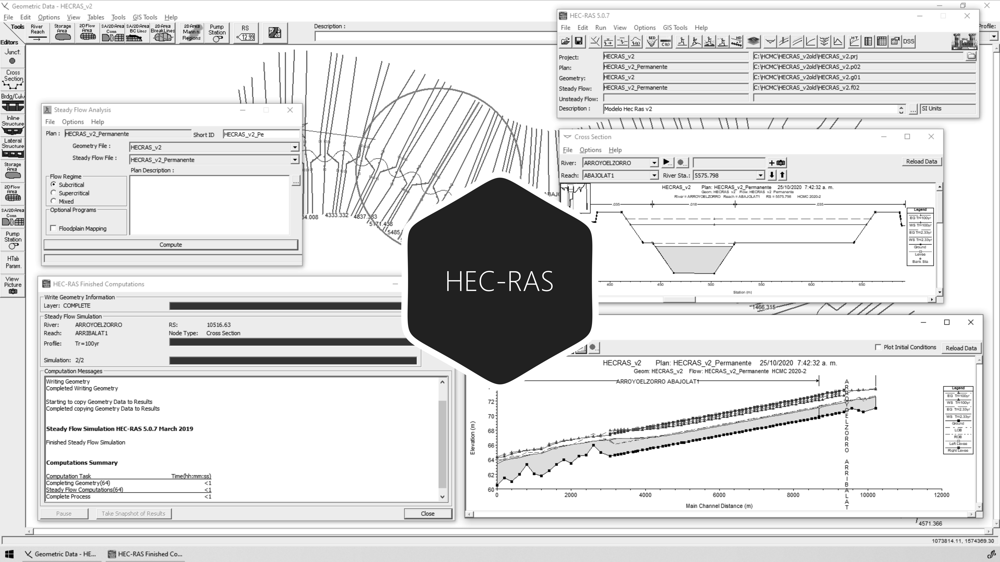

# 3.4. Modelación unidimensional en condiciones de flujo permanente y no permanente
Keywords: `hec-ras` `ras-mapper` `hydraulic-model` `hydraulic-simulation` `cross-section` `boundary-condition` `m03a04`

A partir del modelo geométrico y de los parámetros y condiciones de frontera establecidos, realizar la modelación o tránsito hidráulico para flujo permanente y no permanente.

## Objetivos

* Modelar unidimensional en condiciones de flujo permanente.
* Modelar unidimensional en condiciones de flujo no permanente.

## Requerimientos

Archivos, actividades previas, lecturas y herramientas requeridas para el desarrollo de esta actividad:

| Requerimiento                                                                                    | Descripción                                                                                                                                                    |
|:-------------------------------------------------------------------------------------------------|:---------------------------------------------------------------------------------------------------------------------------------------------------------------|
| [:toolbox:Herramienta](https://qgis.org/)                                                        | QGIS 3.42 o superior.                                                                                                                                          |
| [:toolbox:Herramienta](https://www.hec.usace.army.mil/software/hec-ras/)                         | HEC-RAS 6.7 Beta 3 o superior.                                                                                                                                 |
| [:open_file_folder:Modelo hidráulico HECRAS_v1](../../file/hec)                                  | Modelo hidráulico unidimensional HEC-RAS v1 depurado con inclusión de diques y condiciones de frontera, completado en actividad [M03A03](../M03A03/Readme.md). |

> Para los diferentes avances de proyecto, es necesario guardar y publicar las diferentes versiones generadas del (los) libro (s) de Microsoft Excel y reportes o informes, agregando al final la fecha de control documental en formato aaaammdd, p. ej. _R.HydroTools.DisenoCaucesParametros.20250528.xlsx_.

## Procedimiento general

R.HCMC se encuentra en proceso de actualización, consulte la versión anterior en el enlace [M03A04.pdf](M03A04.pdf).

## Actividades de proyecto :triangular_ruler:

Utilizando la [plantilla suministrada](../../file/report/R.HCMC.PlantillaInformeTecnico.docx), cree un informe técnico mostrando las actividades desarrolladas en el orden presentado en esta actividad, junto con los análisis y recomendaciones realizadas, convierta a Adobe Acrobat (.pdf) y guarde en la carpeta _/report_ del repositorio de datos del proyecto; nombre el archivo con el código de la actividad agregando al final la fecha de control documental en formato aaaammdd (p. ej. M02A01_20250531.pdf).

Libro de revisión y calificación: [M03A04_Modelacion1D.xlsx](M03A04_Modelacion1D.xlsx)

En la siguiente tabla se listan las actividades que deben ser desarrolladas y documentadas por cada estudiante o grupo de proyecto.

| Actividad | Alcance                                                                                                                                                                                                                                                                                                                                                                                                                                                                                                                                                                                                                                                                                                                                                                                                                                                                                            |
|:----------|:---------------------------------------------------------------------------------------------------------------------------------------------------------------------------------------------------------------------------------------------------------------------------------------------------------------------------------------------------------------------------------------------------------------------------------------------------------------------------------------------------------------------------------------------------------------------------------------------------------------------------------------------------------------------------------------------------------------------------------------------------------------------------------------------------------------------------------------------------------------------------------------------------|
| M03A04    | Flujo permanente: en el modelo [HECRAS_v1](../../file/hec), ejecutar la modelación hidráulica en condiciones de flujo permanente para los periodos de retorno considerados en su diseño, presentar el perfil de flujo del cauce principal, los cauces laterales, localización de profundidades críticas y para las secciones naturales de inicio y entrega del realineamiento, mostrar las profundidades de lámina de agua para todos los periodos de retorno evaluados, caudal medio y caudal ecológico. Ver _Nota 3_.                                                                                                                                                                                                                                                                                                                                                                            |  
| M03A04    | Flujo no permanente: en el modelo como [HECRAS_v1](../../file/hec), ejecutar la modelación hidráulica en condiciones de flujo no permanente para 2.33, 25, 100 años de periodo de retorno y los periodos de retorno considerados en su diseño, presentar el perfil de flujo de la envolvente de máximos del cauce principal, los cauces laterales y para las secciones naturales y de diseño de inicio y entrega, mostrar todas las profundidades de lámina de agua máximos para todos los periodos de retorno evaluados. En caso de que no pueda ser ejecutado en flujo no permanente, crear una copia de la geometría, depurar o eliminar secciones naturales donde se presentan controles de flujo, hasta obtener un modelo estable en esta condición. En el informe técnico indicar las consideraciones generales para la modificación de la geometría del modelo hidráulico. Ver _Nota 3_.  |  
| M03A04    | Considere, analice y explique el tipo o los tipos de regímenes de flujo a aplicar a partir de los posible controles hidráulicos que existen en el canal. Indicar la abscisa de las secciones transversales donde se presentan los posibles controles. Analizar a partir de las profundidades críticas obtenidas en la modelación de flujo permanente.                                                                                                                                                                                                                                                                                                                                                                                                                                                                                                                                              |  
| M03A04    | En una tabla y al final del informe de avance de esta entrega, indique el detalle de las actividades realizadas por cada integrante de su grupo; utilice las siguientes columnas: `Nombre del integrante`, `Actividades realizadas`, `Tiempo dedicado en horas` (si presenta la entrega individualmente, no es necesaria la presentación de esta tabla).  Para actividades que no requieren del desarrollo de elementos de avance, indicar si realizo la lectura de la guía de clase y las lecturas indicadas al inicio en los requerimientos.                                                                                                                                                                                                                                                                                                                                               | 

**_Nota 1_**: para la revisión del proyecto final, guarde los libros cálculo de Microsoft Excel y los archivos generados en esta actividad, en las localizaciones indicadas en cada numeral.

**_Nota 2_**: una vez el instructor realice la revisión y el estudiante presente las correcciones o ajustes solicitados, será necesario cargar una nueva versión de los archivos en el repositorio del proyecto, incluyendo o actualizando al final del nombre del archivo, la fecha de presentación en formato aaaammdd y manteniendo las versiones anteriores presentadas.

**_Nota 3:_** elementos requeridos en informe y en el modelo.

* En el informe técnico, incluya capturas de pantalla detalladas del proceso de modelación con perfiles de cada río, secciones de inicio y entrega del cauce sinuoso diseñado, la planta original del modelo y la planta con las modificaciones realizadas para modelar establemente a flujo no permanente. Incluir observaciones detalladas.
* Para la revisión, se verificará la correcta ejecución del modelo en condiciones de flujo permanente y no permanente, así como la modificación del modelo hidráulico para obtener una simulación estable. Se evaluará la identificación de los posibles controles hidráulicos y el tipo de régimen utilizado en la modelación.
* En caso de haber realizado modificaciones a la geometría obtenida del modelo RAS-Mapper, deberán existir dos archivos de geometría, uno con la geometría original y otro con la geometría depurada.
* Luego de la modificación del modelo y la ejecución completa en condiciones de flujo permanente y no permanente, comprimir como _[HECRAS_v1_aaaammdd.zip](../../file/hec)_.

## Referencias

* https://www.hec.usace.army.mil/confluence/rasdocs 
* https://www.hec.usace.army.mil/confluence/rasdocs/r2dum/6.6/developing-a-terrain-model-and-geospatial-layers/opening-ras-mapper
* https://www.hec.usace.army.mil/confluence/rasdocs/r2dum/6.6/developing-a-terrain-model-and-geospatial-layers/setting-the-spatial-reference-projection
* https://www.hec.usace.army.mil/confluence/rasdocs/r2dum/6.6/ras-mapper-supported-file-formats
* https://www.fsl.orst.edu/geowater/FX3/help/8_Hydraulic_Reference/Flow_Profiles.htm 

## Control de versiones

| Versión     | Descripción        | Autor                                     | Horas |
|-------------|:-------------------|-------------------------------------------|:-----:|
| 2025.07.31  | Migración a GitHub | [rcfdtools](https://github.com/rcfdtools) |   3   |

##

_R.HCMC es de uso libre para fines académicos, conoce nuestra licencia, cláusulas, condiciones de uso y como referenciar los contenidos publicados en este repositorio, dando [clic aquí](../../LICENSE.md)._

_¡Encontraste útil este repositorio!, apoya su difusión marcando este repositorio con una ⭐ o síguenos dando clic en el botón Follow de [rcfdtools](https://github.com/rcfdtools) en GitHub._

| [:arrow_backward: Anterior](../M03A03/Readme.md) | [:house: Inicio](../../README.md) | [:beginner: Ayuda / Colabora](https://github.com/rcfdtools/R.HCMC/discussions/1) | [Siguiente :arrow_forward:](../M03A05/Readme.md) |
|---------------------------------------------------|-----------------------------------|----------------------------------------------------------------------------------|---------------------------------------------------|

[^1]: 