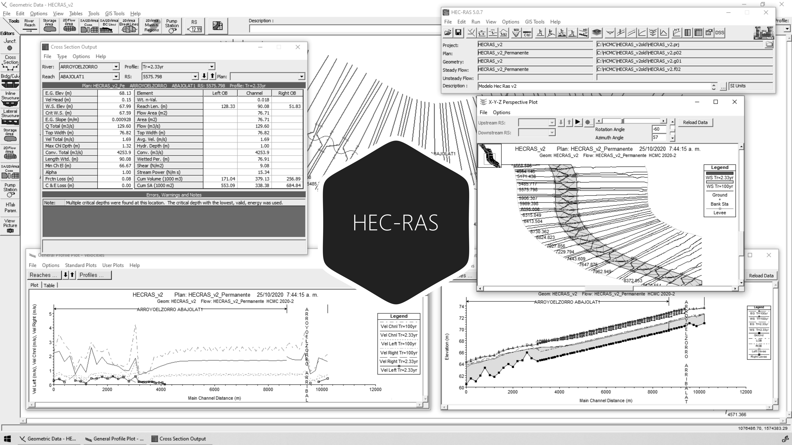

# 3.5. Análisis de resultados (perfil de flujo, línea de energía, esfuerzo cortante, velocidad, borde libre)
Keywords: `hec-ras` `ras-mapper` `hydraulic-model` `hydraulic-simulation` `cross-section` `boundary-condition` `m03a05`

A partir de los resultados obtenidos en la ejecución del modelo hidráulico para condiciones de flujo permanente y no permanente, evaluar los resultados obtenidos para determinar si el diseño realizado cumplió con las especificaciones de diseño planteadas al inicio del curso.

## Objetivos

* Analizar los perfiles de flujo para diferentes periodos de retorno.
* Analizar la profundidad crítica.
* Evaluar el borde libre obtenido.
* Verificar la elevación de la lámina de agua en el canal dominante.
* Verificar las velocidades de flujo máximas y mínimas.
* Verificar el esfuerzo cortante máximo.
* Verificar la energía máxima obtenida en todo el canal.

## Requerimientos

Archivos, actividades previas, lecturas y herramientas requeridas para el desarrollo de esta actividad:

| Requerimiento                                                                                                           | Descripción                                                                                                                                                                     |
|:------------------------------------------------------------------------------------------------------------------------|:--------------------------------------------------------------------------------------------------------------------------------------------------------------------------------|
| [:toolbox:Herramienta](https://qgis.org/)                                                                               | QGIS 3.42 o superior.                                                                                                                                                           |
| [:toolbox:Herramienta](https://www.hec.usace.army.mil/software/hec-ras/)                                                | HEC-RAS 6.7 Beta 3 o superior.                                                                                                                                                  |
| [:mortar_board:Actividad 1.1. Parámetros generales requeridos para el diseño y la modelación](../M01A01/Readme.md)      | Definición de parámetros generales y establecimiento de criterios a tener en cuenta para el diseño del canal artificial principal, cauces laterales y estructuras hidráulicas.  |
| [:open_file_folder:Modelo hidráulico HECRAS_v1](../../file/hec)                                                         | Modelo hidráulico unidimensional HEC-RAS v1 depurado con inclusión de diques, condiciones de frontera y modelación, completado en actividad [M03A04](../M03A04/Readme.md).      |

> Para los diferentes avances de proyecto, es necesario guardar y publicar las diferentes versiones generadas del (los) libro (s) de Microsoft Excel y reportes o informes, agregando al final la fecha de control documental en formato aaaammdd, p. ej. _R.HydroTools.DisenoCaucesParametros.20250528.xlsx_.

## Procedimiento general

R.HCMC se encuentra en proceso de actualización, consulte la versión anterior en el enlace [M03A05.pdf](M03A05.pdf).

## Actividades de proyecto (👥 grupal opcional no calificable, 👤individual requerido) :triangular_ruler:

Utilizando la [plantilla suministrada](../../file/report/HCMC_PlantillaInformeTecnico.docx), cree un informe técnico mostrando las actividades desarrolladas en el orden presentado en esta actividad, junto con los análisis y recomendaciones realizadas, convierta a Adobe Acrobat (.pdf) y guarde en la carpeta _/report_ del repositorio de datos del proyecto; nombre el archivo con el código de la actividad agregando al final la fecha de control documental en formato aaaammdd (p. ej. M02A01_20250531.pdf).

Libro de revisión y calificación de proyecto: [M03A05_AnalisisResultado.xlsx](M03A05_AnalisisResultado.xlsx)

En la siguiente tabla se listan las actividades que deben ser desarrolladas y documentadas por cada estudiante o grupo de proyecto.

| Actividad | Alcance                                                                                                                                                                                                                                                                                                                                                                                                                                                                                                                                              |
|:----------|:-----------------------------------------------------------------------------------------------------------------------------------------------------------------------------------------------------------------------------------------------------------------------------------------------------------------------------------------------------------------------------------------------------------------------------------------------------------------------------------------------------------------------------------------------------|
| M03A05    | 👤👥 Para condiciones de flujo permanente y no permanente, evaluar y presentar en un reporte técnico integrado con análisis detallados de acuerdo a las indicaciones de la Nota 3.                                                                                                                                                                                                                                                                                                                                                                        |  
| M03A05    | 👥 En una tabla y al final del informe de avance de esta entrega, indique el detalle de las actividades realizadas por cada integrante de su grupo; utilice las siguientes columnas: `Nombre del integrante`, `Actividades realizadas`, `Tiempo dedicado en horas` (si presenta la entrega individualmente, no es necesaria la presentación de esta tabla).  👤 Para actividades que no requieren del desarrollo de elementos de avance, indicar si realizo la lectura de la guía de clase y las lecturas indicadas al inicio en los requerimientos. | 

**_Nota 1_**: para la revisión del proyecto final, guarde los libros cálculo de Microsoft Excel y los archivos generados en esta actividad, en las localizaciones indicadas en cada numeral.

**_Nota 2_**: una vez el instructor realice la revisión y el estudiante presente las correcciones o ajustes solicitados, será necesario cargar una nueva versión de los archivos en el repositorio del proyecto, incluyendo o actualizando al final del nombre del archivo, la fecha de presentación en formato aaaammdd y manteniendo las versiones anteriores presentadas.

**_Nota 3_**: elementos requeridos en informe y en el modelo.

* Visualice y analíce los resultados obtenidos desde el editor de geometría 1D.
* Perfiles de flujo: para cada periodo de retorno evaluado indicar si existen desbordamientos, remansos o cambios bruscos en el desarrollo del perfil y plantear soluciones para obtener un perfil continuo y estable.
* Profundidad crítica: evaluar la profundidad crítica e indicar el tipo de perfil hidráulico obtenido, indicar posiciones de Yc que se crucen con la profundidad de lámina o que esté por encima. Plantear soluciones para obtener profundidades críticas siempre por debajo de la profundidad normal y/o de lámina de agua en la zona prismática diseñada y modelada. Realizar el análisis en condiciones de flujo subcrítico y mixto. Evaluar solo para flujo permanente.
* Borde libre: evaluar si el BL cumple con los criterios de diseño planteados para su proyecto, en caso de que sea menor indicar las posibles causas y plantear soluciones.
* Elevación lámina de agua en secciones de diseño sinuoso para la sección dominante: evaluar la profundidad e indicar si se producen o no desbordamientos; recordar que la condición de diseño corresponde a tránsito o flujo hasta la corona.
* Velocidad de flujo: para los periodos de diseño de la sección dominante y de creciente, evaluar e indicar si las velocidades máximas y mínimas se cumplen de acuerdo a los límites establecidos para su proyecto; en caso de que no se cumplan indicar las posibles causas y los cambios que se tendrían que hacer en el diseño geométrico e hidráulico para cumplir con los criterios establecidos.
* Esfuerzo cortante: para los periodos de diseño de la sección dominante y de creciente, evaluar e indicar si los esfuerzos cortantes máximos cumplen o están por debajo o muy próximos a los valores admisibles definidos; en caso de que no se cumplan indicar las posibles causas y los cambios que se tendrían que hacer en el diseño geométrico e hidráulico para cumplir con los criterios establecidos.
* Energía máxima: para cada periodo de retorno evaluado, presentar el perfil de cada río con la línea de energía obtenida y presentar un análisis descriptivo.
* En el informe técnico, incluya capturas de pantalla detalladas para todos los parámetros indicados, tablas detalladas de resultados obtenidos en cada sección transversal, incluir análisis y si se cumplió o no con las condiciones de diseño y los valores admisibles definidos para el proyecto. Incluir cabecera, tabla de contenido, numeración de páginas, separadores de página para cada grupo de análisis y observaciones detalladas. El análisis de flujo permanente y no permanente deberá ser presentado en dos capítulos independientes.
* Para la revisión se verificará el cumplimiento de los parámetros de diseño que el estudiante definió al inicio del curso en el Tema 1. Debido a que es un ejercicio académico, para su proyecto se considerarán válidos, resultados con tolerancias de hasta máximo o mínimo 15% del valor obtenido respecto al valor admisible definido. Para cada análisis solicitado deberá indicar los valores resultantes y el porcentaje de cumplimiento obtenido, por ejemplo, si la velocidad límite definida para la sección dominante fue de 2m/s y en el tramo prismático diseñado en la zona donde se encuentra completamente desarrollado el flujo se presenta una velocidad máxima promedio de 2.37m/s, no cumplió con el valor admisible en un 18.5% [((2.37/2)-1)*100].
* En caso de haber realizado ajustes en las condiciones de frontera para flujo permanente y no permanente, comprimir como [HECRAS_v1_aaaammdd.zip](../../file/hec).

## Referencias

* https://www.hec.usace.army.mil/confluence/rasdocs 
* https://www.hec.usace.army.mil/confluence/rasdocs/r2dum/6.6/developing-a-terrain-model-and-geospatial-layers/opening-ras-mapper
* https://www.hec.usace.army.mil/confluence/rasdocs/r2dum/6.6/developing-a-terrain-model-and-geospatial-layers/setting-the-spatial-reference-projection
* https://www.hec.usace.army.mil/confluence/rasdocs/r2dum/6.6/ras-mapper-supported-file-formats
* https://www.fsl.orst.edu/geowater/FX3/help/8_Hydraulic_Reference/Flow_Profiles.htm 

##

_R.HCMC es de uso libre para fines académicos, conoce nuestra licencia, cláusulas, condiciones de uso y como referenciar los contenidos publicados en este repositorio, dando [clic aquí](../../LICENSE.md)._

_¡Encontraste útil este repositorio!, apoya su difusión marcando este repositorio con una ⭐ o síguenos dando clic en el botón Follow de [rcfdtools](https://github.com/rcfdtools) en GitHub._

| [◄ Anterior](../M03A04/Readme.md) | [:house: Inicio](../../README.md) | [:beginner: Ayuda / Colabora](https://github.com/rcfdtools/R.HCMC/discussions/1) | [Siguiente ►](../M03A06/Readme.md) |
|---------------------------------------------------|-----------------------------------|----------------------------------------------------------------------------------|---------------------------------------------------|

[^1]: 