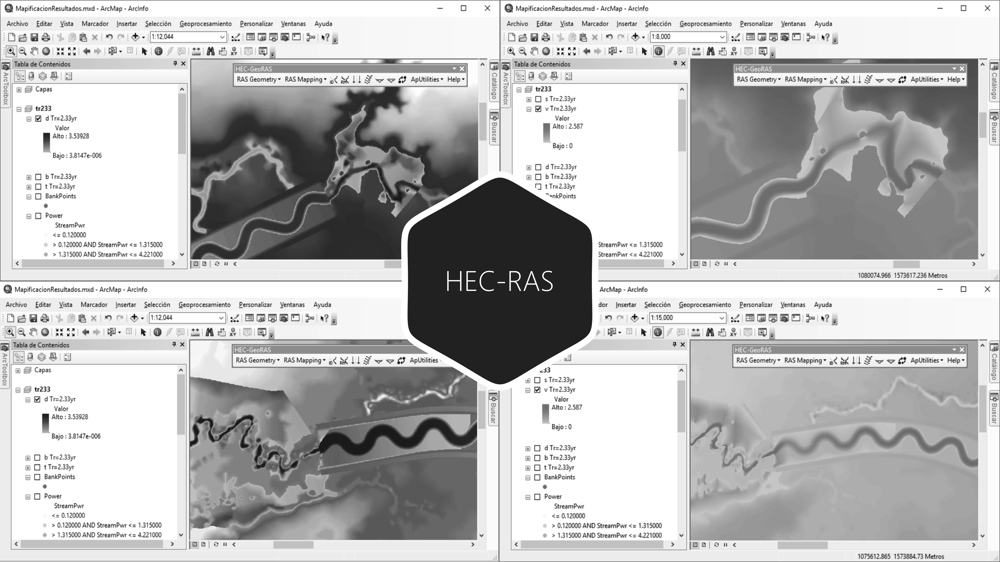

# 3.6. Mapificación de resultados de modelación 1D en RAS Mapper
Keywords: `hec-ras` `ras-mapper` `hydraulic-model` `hydraulic-simulation` `cross-section` `boundary-condition` `m03a06`

A partir de los resultados obtenidos en la ejecución del modelo hidráulico para condiciones de flujo permanente o no permanente, mapificar las llanuras de inundación, velocidades, cortantes y energía.

## Objetivos

* Crear y analizar mapas de resultados en RAS Mapper.
* Crear el mapa de llanuras de inundación.
* Crear el mapa de velocidad.
* Crear el mapa de cortante.
* Crear el mapa de energía.

## Requerimientos

Archivos, actividades previas, lecturas y herramientas requeridas para el desarrollo de esta actividad:

| Requerimiento                                                                                                           | Descripción                                                                                                                                                                              |
|:------------------------------------------------------------------------------------------------------------------------|:-----------------------------------------------------------------------------------------------------------------------------------------------------------------------------------------|
| [:toolbox:Herramienta](https://qgis.org/)                                                                               | QGIS 3.42 o superior.                                                                                                                                                                    |
| [:toolbox:Herramienta](https://www.hec.usace.army.mil/software/hec-ras/)                                                | HEC-RAS 6.7 Beta 3 o superior.                                                                                                                                                           |
| [:mortar_board:Actividad 1.1. Parámetros generales requeridos para el diseño y la modelación](../M01A01/Readme.md)      | Definición de parámetros generales y establecimiento de criterios a tener en cuenta para el diseño del canal artificial principal, cauces laterales y estructuras hidráulicas.           |
| [:open_file_folder:Modelo hidráulico HECRAS_v1](../../file/hec)                                                         | Modelo hidráulico unidimensional HEC-RAS v1 depurado con inclusión de diques, condiciones de frontera y modelación, completado y/o ajustado en actividad [M03A05](../M03A05/Readme.md).  |

> Para los diferentes avances de proyecto, es necesario guardar y publicar las diferentes versiones generadas del (los) libro (s) de Microsoft Excel y reportes o informes, agregando al final la fecha de control documental en formato aaaammdd, p. ej. _R.HydroTools.DisenoCaucesParametros.20250528.xlsx_.

## Procedimiento general

R.HCMC se encuentra en proceso de actualización, consulte la versión anterior en el enlace [M03A06.pdf](M03A06.pdf).

## Actividades de proyecto :triangular_ruler:

Utilizando la [plantilla suministrada](../../file/report/R.HCMC.PlantillaSoporteDesarrollo.docx), cree un documento soporte mostrando las actividades desarrolladas en el orden presentado en esta actividad, junto con los análisis y recomendaciones realizadas, convierta a Adobe Acrobat (.pdf) y guarde en la carpeta _/report_ del repositorio de datos del proyecto; nombre el archivo con el código de la actividad agregando al final la fecha de control documental en formato aaaammdd (p. ej. M02A01_20250531.pdf).

En la siguiente tabla se listan las actividades que deben ser desarrolladas y documentadas por cada estudiante o grupo de proyecto.

| Actividad | Alcance                                                                                                                                                                                                                                                                                                                                                                                                                                                                                                                                                                                                                                                                                                                               |
|:----------|:--------------------------------------------------------------------------------------------------------------------------------------------------------------------------------------------------------------------------------------------------------------------------------------------------------------------------------------------------------------------------------------------------------------------------------------------------------------------------------------------------------------------------------------------------------------------------------------------------------------------------------------------------------------------------------------------------------------------------------------|
| M03A06    | Para cada periodo de retorno (como mínimo 2.33, 25 y 100 años) y tipo de flujo (permanente y no permanente), realizar la mapificación de cada variable en RAS Mapper (profundidad, velocidad y cortante); analizar los resultados obtenidos indicando en que zonas se cumple o no con las condiciones de diseño establecidas y representar el mapa de trazas de flujo con flechas direccionales.  En el documento soporte muestre capturas de pantalla detalladas para todos los mapas obtenidos para los diferentes parámetros indicados, incluir análisis cuantitativo y si se cumplió o no con las condiciones de diseño y los valores admisibles definidos para el proyecto. Incluir observaciones detalladas. Ver _Nota 3_.  |  
| M03A06   | En una tabla y al final del informe de avance de esta entrega, indique el detalle de las actividades realizadas por cada integrante de su grupo; utilice las siguientes columnas: `Nombre del integrante`, `Actividades realizadas`, `Tiempo dedicado en horas` (si presenta la entrega individualmente, no es necesaria la presentación de esta tabla).  Para actividades que no requieren del desarrollo de elementos de avance, indicar si realizo la lectura de la guía de clase y las lecturas indicadas al inicio en los requerimientos.                                                                                                                                                                                  | 

**_Nota 1_**: para la revisión del proyecto final, guarde los libros cálculo de Microsoft Excel y los archivos generados en esta actividad, en las localizaciones indicadas en cada numeral.

**_Nota 2_**: una vez el instructor realice la revisión y el estudiante presente las correcciones o ajustes solicitados, será necesario cargar una nueva versión de los archivos en el repositorio del proyecto, incluyendo o actualizando al final del nombre del archivo, la fecha de presentación en formato aaaammdd y manteniendo las versiones anteriores presentadas.

**_Nota 3_**: elementos requeridos en informe y en el modelo.

* Para la revisión se verificará que la mapificación se haya realizado completa para cada tipo de flujo, periodo de retorno y para cada variable solicitada, además de los análisis detallados presentados.
* Así como en la entrega anterior, se aceptarán como válidos, valores obtenidos que estén en una banda del 15% por encima o por debajo del valor de referencia o admisible definido para el diseño. Por ejemplo, si la velocidad máxima para el canal dominante fue definida en 2 m/s, se aceptarán como válidos, valores de hasta 2.3 m/s.
* Para cada variable analizada (profundidad, velocidad y cortante), personalizar la rampa de colores con 2 clases utilizando el valor límite que permita evaluar si se cumplió o no con las condiciones de diseño.
* Luego de realizada la mapificación en RAS Mapper, comprimir el modelo hidráulico como [HECRAS_v1_aaaammdd.zip](../../file/hec).

## Referencias

* https://www.hec.usace.army.mil/confluence/rasdocs 
* https://www.hec.usace.army.mil/confluence/rasdocs/r2dum/6.6/developing-a-terrain-model-and-geospatial-layers/opening-ras-mapper
* https://www.hec.usace.army.mil/confluence/rasdocs/r2dum/6.6/developing-a-terrain-model-and-geospatial-layers/setting-the-spatial-reference-projection
* https://www.hec.usace.army.mil/confluence/rasdocs/r2dum/6.6/ras-mapper-supported-file-formats
* https://www.fsl.orst.edu/geowater/FX3/help/8_Hydraulic_Reference/Flow_Profiles.htm 

## Control de versiones

| Versión    | Descripción        | Autor                                     | Horas |
|------------|:-------------------|-------------------------------------------|:-----:|
| 2025.08.01 | Migración a GitHub | [rcfdtools](https://github.com/rcfdtools) |   2   |

##

_R.HCMC es de uso libre para fines académicos, conoce nuestra licencia, cláusulas, condiciones de uso y como referenciar los contenidos publicados en este repositorio, dando [clic aquí](../../LICENSE.md)._

_¡Encontraste útil este repositorio!, apoya su difusión marcando este repositorio con una ⭐ o síguenos dando clic en el botón Follow de [rcfdtools](https://github.com/rcfdtools) en GitHub._

| [:arrow_backward: Anterior](../M03A05/Readme.md) | [:house: Inicio](../../README.md) | [:beginner: Ayuda / Colabora](https://github.com/rcfdtools/R.HCMC/discussions/99999) | [Siguiente :arrow_forward:](../M03A07/Readme.md) |
|---------------------------------------------------|-----------------------------------|--------------------------------------------------------------------------------------|---------------------------------------------------|

[^1]: 