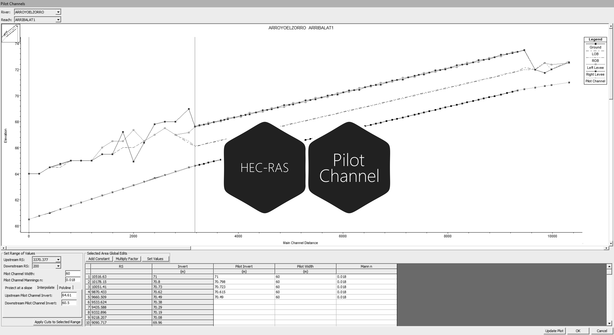

# 3.7. Modelación 1D del canal principal rectificando fondo de secciones naturales de inicio y entrega
Keywords: `hec-ras` `ras-mapper` `hydraulic-model` `hydraulic-simulation` `cross-section` `boundary-condition` `m03a07`

A partir del modelo geométrico y de los parámetros y condiciones de frontera establecidos, realizar la modelación o tránsito hidráulico para flujo permanente y no permanente solo del cauce principal completo, rectificando el fondo de las secciones naturales de inicio y entrega usando la herramienta Pilot Channel para obtener un fondo sin tramos horizontales y/o adversos.

## Objetivos

* Utilizar la herramienta Pilot Channel para la definición de fondo en secciones transversales rectificadas.
* Modelar el canal principal completo incluyendo los tramos naturales de inicio y entrega.

## Requerimientos

Archivos, actividades previas, lecturas y herramientas requeridas para el desarrollo de esta actividad:

| Requerimiento                                                                                                           | Descripción                                                                                                                                                                                           |
|:------------------------------------------------------------------------------------------------------------------------|:------------------------------------------------------------------------------------------------------------------------------------------------------------------------------------------------------|
| [:toolbox:Herramienta](https://qgis.org/)                                                                               | QGIS 3.42 o superior.                                                                                                                                                                                 |
| [:toolbox:Herramienta](https://www.hec.usace.army.mil/software/hec-ras/)                                                | HEC-RAS 6.7 Beta 3 o superior.                                                                                                                                                                        |
| [:open_file_folder:Modelo hidráulico HECRAS_v1](../../file/hec)                                                         | Modelo hidráulico unidimensional HEC-RAS v1 depurado con inclusión de diques, condiciones de frontera y modelación, completado, ajustado y complementado en actividad [M03A06](../M03A06/Readme.md). |

> Para los diferentes avances de proyecto, es necesario guardar y publicar las diferentes versiones generadas del (los) libro (s) de Microsoft Excel y reportes o informes, agregando al final la fecha de control documental en formato aaaammdd, p. ej. _R.HydroTools.DisenoCaucesParametros.20250528.xlsx_.

## Procedimiento general

R.HCMC se encuentra en proceso de actualización, consulte la versión anterior en el enlace [M03A07.pdf](M03A07.pdf).

## Actividades de proyecto :triangular_ruler:

Utilizando la [plantilla suministrada](../../file/report/R.HCMC.PlantillaSoporteDesarrollo.docx), cree un documento soporte mostrando las actividades desarrolladas en el orden presentado en esta actividad, junto con los análisis y recomendaciones realizadas, convierta a Adobe Acrobat (.pdf) y guarde en la carpeta _/report_ del repositorio de datos del proyecto; nombre el archivo con el código de la actividad agregando al final la fecha de control documental en formato aaaammdd (p. ej. M02A01_20250531.pdf).

En la siguiente tabla se listan las actividades que deben ser desarrolladas y documentadas por cada estudiante o grupo de proyecto.

| Actividad  | Alcance                                                                                                                                                                                                                                                                                                                                                                                                                                                                                                                                              |
|:-----------|:-----------------------------------------------------------------------------------------------------------------------------------------------------------------------------------------------------------------------------------------------------------------------------------------------------------------------------------------------------------------------------------------------------------------------------------------------------------------------------------------------------------------------------------------------------|
| M03A07     | A partir de modelo hidráulico 1D de proyecto, crear una copia de la geometría previamente validada y utilizando la herramienta Pilot Channel, rectificar el fondo de las secciones naturales de inicio y entrega antes y después del canal sinuoso diseñado. Opcionalmente podrá aplicar esta misma técnica para ajustar los fondos en los cauces laterales y realizar la modelación completa en flujo no permanente. Simplificar la geometría de las secciones usando, por ejemplo, 100 puntos característicos. Ver _Nota 3_.                         |  
| M03A07     | En una tabla y al final del informe de avance de esta entrega, indique el detalle de las actividades realizadas por cada integrante de su grupo; utilice las siguientes columnas: `Nombre del integrante`, `Actividades realizadas`, `Tiempo dedicado en horas` (si presenta la entrega individualmente, no es necesaria la presentación de esta tabla).  Para actividades que no requieren del desarrollo de elementos de avance, indicar si realizo la lectura de la guía de clase y las lecturas indicadas al inicio en los requerimientos. | 

**_Nota 1_**: para la revisión del proyecto final, guarde los libros cálculo de Microsoft Excel y los archivos generados en esta actividad, en las localizaciones indicadas en cada numeral.

**_Nota 2_**: una vez el instructor realice la revisión y el estudiante presente las correcciones o ajustes solicitados, será necesario cargar una nueva versión de los archivos en el repositorio del proyecto, incluyendo o actualizando al final del nombre del archivo, la fecha de presentación en formato aaaammdd y manteniendo las versiones anteriores presentadas.

**_Nota 3_**: elementos requeridos en informe y en el modelo.

* Realizar la modelación en condiciones de flujo permanente y no permanente (como mínimo Tr 2.33 y 100 años) y presentar un análisis general del nuevo perfil obtenido analizando los diferentes cambios en el régimen de flujo, por medio de la localización de las profundidades críticas.
* En el documento soporte, incluya capturas de pantalla detalladas del proceso de corrección de fondos y los perfiles de flujo obtenidos. Incluir observaciones detalladas. 
* Para la revisión se verificará el perfil de fondo y la funcionalidad del modelo hidráulico para condiciones de flujo permanente y no permanente.
* Luego de realizada las modificaciones en el modelo hidráulico y la modelación funcional, comprimir el modelo como [HECRAS_v1a_aaaammdd.zip](../../file/hec).

## Referencias

* https://www.hec.usace.army.mil/confluence/rasdocs 
* https://www.hec.usace.army.mil/confluence/rasdocs/r2dum/6.6/developing-a-terrain-model-and-geospatial-layers/opening-ras-mapper
* https://www.hec.usace.army.mil/confluence/rasdocs/r2dum/6.6/developing-a-terrain-model-and-geospatial-layers/setting-the-spatial-reference-projection
* https://www.hec.usace.army.mil/confluence/rasdocs/r2dum/6.6/ras-mapper-supported-file-formats
* https://www.fsl.orst.edu/geowater/FX3/help/8_Hydraulic_Reference/Flow_Profiles.htm 

## Control de versiones

| Versión    | Descripción        | Autor                                     | Horas |
|------------|:-------------------|-------------------------------------------|:-----:|
| 2025.08.01 | Migración a GitHub | [rcfdtools](https://github.com/rcfdtools) |   2   |

##

_R.HCMC es de uso libre para fines académicos, conoce nuestra licencia, cláusulas, condiciones de uso y como referenciar los contenidos publicados en este repositorio, dando [clic aquí](../../LICENSE.md)._

_¡Encontraste útil este repositorio!, apoya su difusión marcando este repositorio con una ⭐ o síguenos dando clic en el botón Follow de [rcfdtools](https://github.com/rcfdtools) en GitHub._

| [:arrow_backward: Anterior](../M03A06/Readme.md) | [:house: Inicio](../../README.md) | [:beginner: Ayuda / Colabora](https://github.com/rcfdtools/R.HCMC/discussions/99999) | [Siguiente :arrow_forward:](../M03A08/Readme.md) |
|---------------------------------------------------|-----------------------------------|--------------------------------------------------------------------------------------|---------------------------------------------------|

[^1]: 