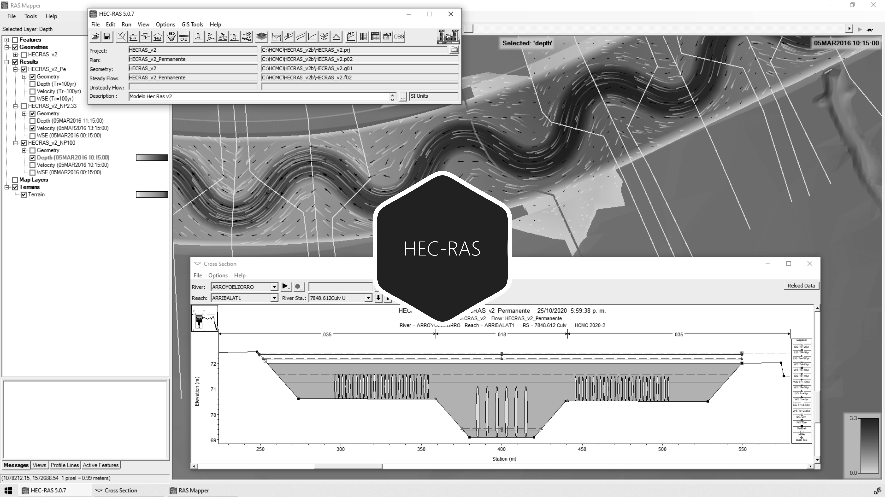

# 3.8. Modelación de pasos de vía en modelos hidráulicos 1D
Keywords: `hec-ras` `ras-mapper` `hydraulic-model` `hydraulic-simulation` `cross-section` `boundary-condition` `m03a08`

A partir del modelo hidráulico funcional que incluye la rectificación de fondo de las secciones naturales antes y después del canal sinuoso diseñado, modelar el paso de vía utilizando alcantarillas en la zona del canal dominante y valle.

## Objetivos

* Visualizar el Profile Line del paso de vía.
* Eliminar las secciones transversales próximas para localizar el tablero o barrera.
* Agregar tablero en paso de vía.
* Agregar las alcantarillas en paso de vía.
* Modelar en condición de flujo permanente y no permanente.
* Mapificar resultados, visualizar perfiles y secciones de paso de vía.

## Requerimientos

Archivos, actividades previas, lecturas y herramientas requeridas para el desarrollo de esta actividad:

| Requerimiento                                                                                      | Descripción                                                                                                                                                                                               |
|:---------------------------------------------------------------------------------------------------|:----------------------------------------------------------------------------------------------------------------------------------------------------------------------------------------------------------|
| [:toolbox:Herramienta](https://qgis.org/)                                                          | QGIS 3.42 o superior.                                                                                                                                                                                     |
| [:toolbox:Herramienta](https://www.hec.usace.army.mil/software/hec-ras/)                           | HEC-RAS 6.7 Beta 3 o superior.                                                                                                                                                                            |
| [:mortar_board:Actividad 1.16. Obras y estructuras hidráulicas - Paso de vía](../M01A16/Readme.md) | Diseño geométrico de pasos de vía en canales usando alcantarillas por área equivalente a descarga libre para modelos hidráulicos en HEC-RAS.                                                              |
| [:open_file_folder:Modelo hidráulico HECRAS_v1a](../../file/hec)                                   | Modelo hidráulico unidimensional HEC-RAS v1a depurado con inclusión de diques, condiciones de frontera y modelación, y con ajuste de fondo con Pilot Channel en actividad [M03A07](../M03A07/Readme.md). |

> Para los diferentes avances de proyecto, es necesario guardar y publicar las diferentes versiones generadas del (los) libro (s) de Microsoft Excel y reportes o informes, agregando al final la fecha de control documental en formato aaaammdd, p. ej. _R.HydroTools.DisenoCaucesParametros.20250528.xlsx_.

## Procedimiento general

R.HCMC se encuentra en proceso de actualización, consulte la versión anterior en el enlace [M03A08.pdf](M03A08.pdf).

## Actividades de proyecto :triangular_ruler:

Utilizando la [plantilla suministrada](../../file/report/R.HCMC.PlantillaSoporteDesarrollo.docx), cree un documento soporte mostrando las actividades desarrolladas en el orden presentado en esta actividad, junto con los análisis y recomendaciones realizadas, convierta a Adobe Acrobat (.pdf) y guarde en la carpeta _/report_ del repositorio de datos del proyecto; nombre el archivo con el código de la actividad agregando al final la fecha de control documental en formato aaaammdd (p. ej. M02A01_20250531.pdf).

En la siguiente tabla se listan las actividades que deben ser desarrolladas y documentadas por cada estudiante o grupo de proyecto.

| Actividad  | Alcance                                                                                                                                                                                                                                                                                                                                                                                                                                                                                                                                              |
|:-----------|:-----------------------------------------------------------------------------------------------------------------------------------------------------------------------------------------------------------------------------------------------------------------------------------------------------------------------------------------------------------------------------------------------------------------------------------------------------------------------------------------------------------------------------------------------------| 
| M03A08     | Crear una línea de perfil en formato shapefile sobre el eje de paso de vía, agregar a perfiles y visualizar a partir del modelo de terreno RAS Mapper.                                                                                                                                                                                                                                                                                                                                                                                               |  
| M03A08     | Identificar y eliminar secciones próximas a pasos de vía fuera del tablero. Indicar en una tabla dentro del reporte único, las abscisas de secciones eliminadas y el criterio de exclusión. En el reporte único, mostrar un esquema en planta de las secciones a eliminar.                                                                                                                                                                                                                                                                           |  
| M03A08     | Agregar el tablero y las alcantarillas del paso de vía en grupos de 25 tuberías. En el reporte indique el periodo de diseño a transitar por el paso de vía, la altura de lámina considerada para la sección hidráulica equivalente y esquemas detallados de las secciones transversales de paso de vía y ventanas de definición de parámetros de entrada.                                                                                                                                                                                            |  
| M03A08     | Modelar en flujo permanente para diferentes periodos de retorno, incluido el periodo de diseño del paso de vía y hasta el Tr mayor considerado en el diseño hidráulico de la sección compuesta. En el reporte único, incluir caudales de entrada, condiciones de frontera, esquemas de perfiles, secciones transversales, llanura de inundación RAS Mapper, mapa de velocidades y líneas de corriente.                                                                                                                                               |  
| M03A08     | Modelar en flujo no permanente el periodo de diseño del paso de vía y para el Tr mayor utilizado en el diseño geométrico de la sección compuesta. En el reporte único, incluir esquemas de hidrograma de entrada y condiciones de frontera, perfiles, secciones transversales, llanura de inundación RAS Mapper y mapa de velocidades. Analizar remansos y desbordamientos y proponer obras adicionales para ajustar la sección del canal principal, justificar técnicamente.                                                                        |  
| M03A08     | En el documento soporte muestre capturas de pantalla detalladas de las actividades desarrolladas y observaciones detalladas.                                                                                                                                                                                                                                                                                                                                                                                                                         |  
| M03A08     | Para la revisión se verificará el funcionamiento del modelo, los mapas de llanuras de inundación, análisis de remansos y desbordamientos en caso de que se produzcan y las obras propuestas de mitigación.                                                                                                                                                                                                                                                                                                                                           |  
| M03A08     | Luego de realizada las modificaciones en el modelo hidráulico con la inclusión del paso de vía y la modelación funcional, comprimir el modelo como [HECRAS_v1b_aaaammdd.zip](../../file/hec).                                                                                                                                                                                                                                                                                                                                                        |  
| M03A08     | En una tabla y al final del informe de avance de esta entrega, indique el detalle de las actividades realizadas por cada integrante de su grupo; utilice las siguientes columnas: `Nombre del integrante`, `Actividades realizadas`, `Tiempo dedicado en horas` (si presenta la entrega individualmente, no es necesaria la presentación de esta tabla).  Para actividades que no requieren del desarrollo de elementos de avance, indicar si realizo la lectura de la guía de clase y las lecturas indicadas al inicio en los requerimientos. | 

**_Nota 1_**: para la revisión del proyecto final, guarde los libros cálculo de Microsoft Excel y los archivos generados en esta actividad, en las localizaciones indicadas en cada numeral.

**_Nota 2_**: una vez el instructor realice la revisión y el estudiante presente las correcciones o ajustes solicitados, será necesario cargar una nueva versión de los archivos en el repositorio del proyecto, incluyendo o actualizando al final del nombre del archivo, la fecha de presentación en formato aaaammdd y manteniendo las versiones anteriores presentadas.

## Referencias

* https://www.hec.usace.army.mil/confluence/rasdocs 
* https://www.hec.usace.army.mil/confluence/rasdocs/r2dum/6.6/developing-a-terrain-model-and-geospatial-layers/opening-ras-mapper
* https://www.hec.usace.army.mil/confluence/rasdocs/r2dum/6.6/developing-a-terrain-model-and-geospatial-layers/setting-the-spatial-reference-projection
* https://www.hec.usace.army.mil/confluence/rasdocs/r2dum/6.6/ras-mapper-supported-file-formats
* https://www.fsl.orst.edu/geowater/FX3/help/8_Hydraulic_Reference/Flow_Profiles.htm 

## Control de versiones

| Versión    | Descripción        | Autor                                     | Horas |
|------------|:-------------------|-------------------------------------------|:-----:|
| 2025.08.01 | Migración a GitHub | [rcfdtools](https://github.com/rcfdtools) |   2   |

##

_R.HCMC es de uso libre para fines académicos, conoce nuestra licencia, cláusulas, condiciones de uso y como referenciar los contenidos publicados en este repositorio, dando [clic aquí](../../LICENSE.md)._

_¡Encontraste útil este repositorio!, apoya su difusión marcando este repositorio con una ⭐ o síguenos dando clic en el botón Follow de [rcfdtools](https://github.com/rcfdtools) en GitHub._

| [:arrow_backward: Anterior](../M03A08/Readme.md) | [:house: Inicio](../../README.md) | [:beginner: Ayuda / Colabora](https://github.com/rcfdtools/R.HCMC/discussions/99999) | [Siguiente :arrow_forward:](../M04A01/Readme.md) |
|--------------------------------------------------|-----------------------------------|--------------------------------------------------------------------------------------|---------------------------------------------------|

[^1]: 