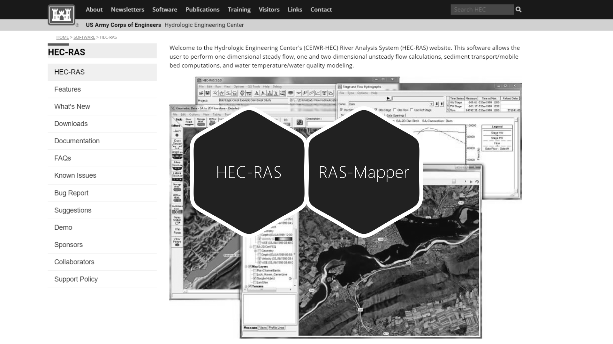

# :large_blue_circle:Módulo IV – Modelación hidráulica 2D

En este módulo se ejecuta la modelación bidimensional del cauce diseñado mediante la construcción de mallas semiestructuradas, así como la mapificación y análisis de resultados en RAS Mapper.

# 4.0. Introducción y requerimientos
Keywords: `2d-modeling` `hec-ras` `ras-mapper` `hydraulic-model` `hydraulic-simulation` `cross-section` `boundary-condition` `m04a00`

Conceptos y elementos requeridos para modelación bidimensional. 

## Objetivos

* Entender las principales diferencias entre el editor de geometría 1D y RAS Mapper.
* Identificar la lista de capas que deberán ser producidas en las diferentes actividades del Módulo 4, necesarias para la modelación 2D.

## Requerimientos

Archivos, actividades previas, lecturas y herramientas requeridas para el desarrollo de esta actividad:

| Requerimiento                                                                                       | Descripción                                                                                                                                                                                                                                                  |
|:----------------------------------------------------------------------------------------------------|:-------------------------------------------------------------------------------------------------------------------------------------------------------------------------------------------------------------------------------------------------------------|
| [:mortar_board:Actividades Módulo I – Parámetros y diseño geométrico e hidráulico](../../Readme.md) | Parámetros generales a utilizar en el diseño del canal artificial y se obtienen los caudales e hidrogramas requeridos para el diseño geométrico y el tránsito hidráulico de las crecientes y se realiza el diseño de las estructuras hidráulicas requeridas. |
| [:round_pushpin:shp_RASMapperModuleIV](../../file/shp/shp_RASMapperModuleIV.rar)                    | Capas geográficas para ensamble del modelo hidráulico 2d                                                                                                                                                                                                     |
| [:round_pushpin:Modelo digital de elevación DEM con valle y corredor sinuoso](../../file/dem)       | TIN_TerrenoNaturalCauceSinuoso_v0.tif: Ensamble de curvas de nivel Lidar con valle y corredor sinuoso trazado en Autodesk Civil 3D.                                                                                                                          |

> Para los diferentes avances de proyecto, es necesario guardar y publicar las diferentes versiones generadas del (los) libro (s) de Microsoft Excel y reportes o informes, agregando al final la fecha de control documental en formato aaaammdd, p. ej. _R.HydroTools.DisenoCaucesParametros.20250528.xlsx_.

## Procedimiento general

R.HCMC se encuentra en proceso de actualización, consulte la versión anterior en el enlace [M04A00.pdf](M04A00.pdf).

**Digital elevation model - DEM**
* TIN_TerrenoNaturalCauceSinuosoQGIS_v0.tif

**Geometry2D**
* Perimeter_v4.shp
* Breaklines.shp
* LandCover_v0.shp
* Main cells: 50m
* Breaklines Near spacing: 15m
* Breaklines Far spacing: 30m

**GeometryDrag**
* RiverRAS_v1.shp
* LeveeStructure.shp
* XSCutLines_v2.shp
* Banks_v0a.shp

## Actividades de proyecto :triangular_ruler:

Utilizando la [plantilla suministrada](../../file/report/R.HCMC.PlantillaInformeTecnico.docx), cree un informe técnico mostrando las actividades desarrolladas en el orden presentado en esta actividad, junto con los análisis y recomendaciones realizadas, convierta a Adobe Acrobat (.pdf) y guarde en la carpeta _/report_ del repositorio de datos del proyecto; nombre el archivo con el código de la actividad agregando al final la fecha de control documental en formato aaaammdd (p. ej. M02A01_20250531.pdf).

En la siguiente tabla se listan las actividades que deben ser desarrolladas y documentadas por cada estudiante o grupo de proyecto.

| Actividad | Alcance                                                                                                                                                                                                                                                                                                                                                                                                                                                                                                                                              |
|:----------|:-----------------------------------------------------------------------------------------------------------------------------------------------------------------------------------------------------------------------------------------------------------------------------------------------------------------------------------------------------------------------------------------------------------------------------------------------------------------------------------------------------------------------------------------------------| 
| M04A00    | No requeridas para esta actividad.                                                                                                                                                                                                                                                                                                                                                                                                                                                                                                                   |  
| M04A00    | En una tabla y al final del informe de avance de esta entrega, indique el detalle de las actividades realizadas por cada integrante de su grupo; utilice las siguientes columnas: `Nombre del integrante`, `Actividades realizadas`, `Tiempo dedicado en horas` (si presenta la entrega individualmente, no es necesaria la presentación de esta tabla).  Para actividades que no requieren del desarrollo de elementos de avance, indicar si realizo la lectura de la guía de clase y las lecturas indicadas al inicio en los requerimientos. | 

**_Nota 1_**: para la revisión del proyecto final, guarde los libros cálculo de Microsoft Excel y los archivos generados en esta actividad, en las localizaciones indicadas en cada numeral.

**_Nota 2_**: una vez el instructor realice la revisión y el estudiante presente las correcciones o ajustes solicitados, será necesario cargar una nueva versión de los archivos en el repositorio del proyecto, incluyendo o actualizando al final del nombre del archivo, la fecha de presentación en formato aaaammdd y manteniendo las versiones anteriores presentadas.

## Referencias

* https://www.hec.usace.army.mil/confluence/rasdocs 
* https://www.hec.usace.army.mil/confluence/rasdocs/r2dum/6.6/developing-a-terrain-model-and-geospatial-layers/opening-ras-mapper
* https://www.hec.usace.army.mil/confluence/rasdocs/r2dum/6.6/developing-a-terrain-model-and-geospatial-layers/setting-the-spatial-reference-projection
* https://www.hec.usace.army.mil/confluence/rasdocs/r2dum/6.6/ras-mapper-supported-file-formats
* https://www.fsl.orst.edu/geowater/FX3/help/8_Hydraulic_Reference/Flow_Profiles.htm 

## Control de versiones

| Versión    | Descripción        | Autor                                     | Horas |
|------------|:-------------------|-------------------------------------------|:-----:|
| 2025.08.06 | Migración a GitHub | [rcfdtools](https://github.com/rcfdtools) |   2   |

##

_R.HCMC es de uso libre para fines académicos, conoce nuestra licencia, cláusulas, condiciones de uso y como referenciar los contenidos publicados en este repositorio, dando [clic aquí](../../LICENSE.md)._

_¡Encontraste útil este repositorio!, apoya su difusión marcando este repositorio con una ⭐ o síguenos dando clic en el botón Follow de [rcfdtools](https://github.com/rcfdtools) en GitHub._

| [:arrow_backward: Anterior](../M03A08/Readme.md) | [:house: Inicio](../../README.md) | [:beginner: Ayuda / Colabora](https://github.com/rcfdtools/R.HCMC/discussions/1) | [Siguiente :arrow_forward:](../M04A01/Readme.md) |
|--------------------------------------------------|-----------------------------------|----------------------------------------------------------------------------------|--------------------------------------------------|

[^1]: 