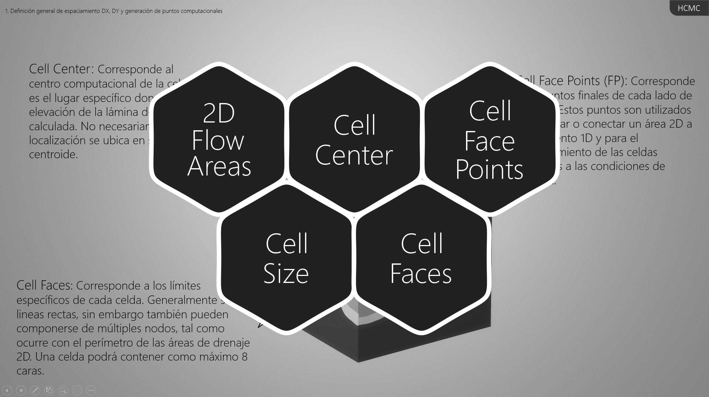

# 4.3. Creación y refinamiento de la malla compuesta
Keywords: `2d-modeling` `hec-ras` `ras-mapper` `hydraulic-model` `hydraulic-simulation` `cross-section` `boundary-condition` `m04a03`

Una malla o grilla computacional es creada a partir de la definición de un área de drenaje 2D y puede ser refinada a partir de ejes y/o regiones.

## Objetivos

* Definir el espaciamiento DX, DY entre celdas y generar los puntos computacionales.
* Calcular las tablas de propiedades hidráulicas y geométricas.
* Estudiar las propiedades en celdas y sus caras.
* Exportar las líneas para refinamiento de celdas a partir de los ejes trazados en Autodesk Civil 3D.
* Crear regiones de refinamiento a partir de los ejes trazados en Autodesk Civil 3D.
* Importar líneas y refinar la malla en RAS Mapper.
* Importar regiones y refinar la malla en RAS Mapper.
* Corregir celdas erradas con más de 8 caras.
* Exportar celdas, nodos y líneas de flujo a formato GIS.

## Requerimientos

Archivos, actividades previas, lecturas y herramientas requeridas para el desarrollo de esta actividad:

| Requerimiento                                                                                      | Descripción                                                                                                                                                                                               |
|:---------------------------------------------------------------------------------------------------|:----------------------------------------------------------------------------------------------------------------------------------------------------------------------------------------------------------|
| [:toolbox:Herramienta](https://qgis.org/)                                                          | QGIS 3.42 o superior.                                                                                                                                                                                     |
| [:toolbox:Herramienta](https://www.hec.usace.army.mil/software/hec-ras/)                           | HEC-RAS 6.7 Beta 3 o superior.                                                                                                                                                                            |

> Para los diferentes avances de proyecto, es necesario guardar y publicar las diferentes versiones generadas del (los) libro (s) de Microsoft Excel y reportes o informes, agregando al final la fecha de control documental en formato aaaammdd, p. ej. _R.HydroTools.DisenoCaucesParametros.20250528.xlsx_.

## Procedimiento general

R.HCMC se encuentra en proceso de actualización, consulte la versión anterior en el enlace [M04A03.pdf](M04A03.pdf).

Una malla o grilla computacional es creada a partir de la definición de un área de drenaje 2D. Cada celda de la malla está compuesta de las siguientes 3 propiedades.

* Cell Center: Corresponde al centro computacional de la celda y es el lugar específico donde la elevación de la lámina de agua es calculada. No necesariamente su localización se ubica en su centroide.
* Cell Faces: Corresponde a los límites específicos de cada celda. Generalmente, son líneas rectas, sin embargo, también pueden componerse de múltiples nodos, tal como ocurre con el perímetro de las áreas de drenaje 2D. Una celda podrá contener como máximo 8 caras.
* Cell Face Points (FP): Corresponde a los puntos finales de cada lado de la celda. Estos puntos son utilizados para anclar o conectar un área 2D a un elemento 1D y para el reconocimiento de las celdas asociadas a las condiciones de frontera.

Después de crear la malla o grilla computacional, podrá agregar líneas o regiones para su refinamiento.

Generalmente, el refinamiento con líneas de corte se utiliza en las zonas de corona de taludes en diques o bancas y a lo largo de las vías para definir los límites de flujo (similar a los diques o leeves en un modelo 1D a partir de secciones transversales) o para controlar su dirección.

Las regiones de refinamiento funcionan similar a las lineas de corte y son mayormente utilizadas cuando las lineas de refinamiento se encuentran próximas o cuando se quiere cambiar el tamaño interno de las celdas y de su contorno en una región determinada, por ejemplo, en zonas de amortiguación, embalses, estructuras hidráulicas, a lo largo de todo el valle o en zonas con contornos curvos cerrados.

## Actividades de proyecto :triangular_ruler:

Utilizando la [plantilla suministrada](../../file/report/R.HCMC.PlantillaInformeTecnico.docx), cree un informe técnico mostrando las actividades desarrolladas en el orden presentado en esta actividad, junto con los análisis y recomendaciones realizadas, convierta a Adobe Acrobat (.pdf) y guarde en la carpeta _/report_ del repositorio de datos del proyecto; nombre el archivo con el código de la actividad agregando al final la fecha de control documental en formato aaaammdd (p. ej. M02A01_20250531.pdf).

En la siguiente tabla se listan las actividades que deben ser desarrolladas y documentadas por cada estudiante o grupo de proyecto.

| Actividad | Alcance                                                                                                                                                                                                                                                                                                                                                                                                                                                                                                                                              |
|:----------|:-----------------------------------------------------------------------------------------------------------------------------------------------------------------------------------------------------------------------------------------------------------------------------------------------------------------------------------------------------------------------------------------------------------------------------------------------------------------------------------------------------------------------------------------------------| 
| M04A03    | No requeridas para esta actividad.                                                                                                                                                                                                                                                                                                                                                                                                                                                                                                                   |  
| M04A03    | En una tabla y al final del informe de avance de esta entrega, indique el detalle de las actividades realizadas por cada integrante de su grupo; utilice las siguientes columnas: `Nombre del integrante`, `Actividades realizadas`, `Tiempo dedicado en horas` (si presenta la entrega individualmente, no es necesaria la presentación de esta tabla).  Para actividades que no requieren del desarrollo de elementos de avance, indicar si realizo la lectura de la guía de clase y las lecturas indicadas al inicio en los requerimientos. | 

**_Nota 1_**: para la revisión del proyecto final, guarde los libros cálculo de Microsoft Excel y los archivos generados en esta actividad, en las localizaciones indicadas en cada numeral.

**_Nota 2_**: una vez el instructor realice la revisión y el estudiante presente las correcciones o ajustes solicitados, será necesario cargar una nueva versión de los archivos en el repositorio del proyecto, incluyendo o actualizando al final del nombre del archivo, la fecha de presentación en formato aaaammdd y manteniendo las versiones anteriores presentadas.

## Referencias

* https://www.hec.usace.army.mil/confluence/rasdocs 
* https://www.hec.usace.army.mil/confluence/rasdocs/r2dum/6.6/developing-a-terrain-model-and-geospatial-layers/opening-ras-mapper
* https://www.hec.usace.army.mil/confluence/rasdocs/r2dum/6.6/developing-a-terrain-model-and-geospatial-layers/setting-the-spatial-reference-projection
* https://www.hec.usace.army.mil/confluence/rasdocs/r2dum/6.6/ras-mapper-supported-file-formats
* https://www.fsl.orst.edu/geowater/FX3/help/8_Hydraulic_Reference/Flow_Profiles.htm 

## Control de versiones

| Versión    | Descripción        | Autor                                     | Horas |
|------------|:-------------------|-------------------------------------------|:-----:|
| 2025.08.06 | Migración a GitHub | [rcfdtools](https://github.com/rcfdtools) |   2   |

##

_R.HCMC es de uso libre para fines académicos, conoce nuestra licencia, cláusulas, condiciones de uso y como referenciar los contenidos publicados en este repositorio, dando [clic aquí](../../LICENSE.md)._

_¡Encontraste útil este repositorio!, apoya su difusión marcando este repositorio con una ⭐ o síguenos dando clic en el botón Follow de [rcfdtools](https://github.com/rcfdtools) en GitHub._

| [:arrow_backward: Anterior](../M04A02/Readme.md) | [:house: Inicio](../../README.md) | [:beginner: Ayuda / Colabora](https://github.com/rcfdtools/R.HCMC/discussions/99999) | [Siguiente :arrow_forward:](../M04A04/Readme.md) |
|---------------------------------------------------|-----------------------------------|--------------------------------------------------------------------------------------|---------------------------------------------------|

[^1]: 